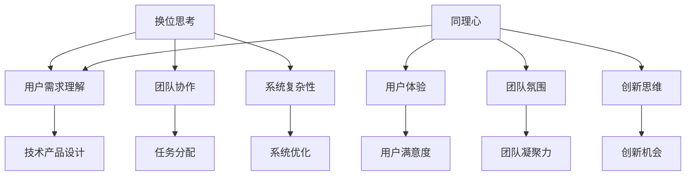

                 

关键词：人工智能、同理心、技术领导力、程序设计、认知复杂性、沟通协作、创新思维。

> 摘要：本文深入探讨在人工智能时代，技术领导者如何通过换位思考和同理心的培养，提升个人与团队的认知复杂性和沟通协作能力。通过分析技术领域的认知复杂性，本文提出了具体的实践方法，包括数学模型、算法原理、代码实例等，以帮助读者理解如何在编程和项目管理中应用这些理念，最终实现技术与人际的和谐发展。

## 1. 背景介绍

在当今快速变化的技术环境中，人工智能（AI）已经成为推动创新和生产力提升的重要力量。技术领导者不仅要掌握前沿的技术知识，还需要具备优秀的领导力和沟通能力。然而，随着系统的复杂性不断增加，理解和沟通这些复杂系统变得越来越具有挑战性。在这种背景下，换位思考和同理心成为提升认知复杂性和沟通能力的关键因素。

换位思考是一种认知能力，它要求人们暂时放下自己的立场和观点，尝试从他人的角度理解问题。同理心则是一种情感共鸣，它要求人们能够感知并理解他人的情感状态。在技术领域，这两者尤为重要，因为技术的本质是解决人类面临的问题，而这就需要技术领导者能够深刻理解用户的需求和情感。

本文旨在探讨换位思考和同理心在技术领导力中的重要性，并通过具体的案例和实践方法，展示如何将这些理念应用于编程和项目管理中。本文分为以下几个部分：

1. 背景介绍：简要介绍人工智能时代的背景和技术领导力的挑战。
2. 核心概念与联系：详细解释换位思考和同理心的定义及其在技术领域中的重要性。
3. 核心算法原理与具体操作步骤：介绍用于提升理解和沟通能力的核心算法和操作步骤。
4. 数学模型和公式：讨论数学模型在理解和解决问题中的应用，以及公式推导过程。
5. 项目实践：通过代码实例展示如何在实践中应用换位思考和同理心。
6. 实际应用场景：探讨技术领导力在不同领域的应用。
7. 工具和资源推荐：推荐学习资源和开发工具。
8. 总结：对研究结果进行总结，并展望未来发展趋势和挑战。
9. 附录：提供常见问题的解答。

## 2. 核心概念与联系

### 2.1 换位思考

换位思考（Theory of Mind，简称ToM）是指个体能够理解和预测他人行为和情感的能力。这种能力是人类认知发展的关键，也是社会交往的基础。在技术领域，换位思考的重要性体现在以下几个方面：

1. **用户需求理解**：技术领导者需要通过换位思考，深刻理解用户的需求和痛点，从而设计出更加符合用户期望的产品和服务。
2. **团队协作**：在团队项目中，领导者需要理解团队成员的动机、能力和局限性，以便更好地进行任务分配和团队管理。
3. **系统复杂性**：复杂系统的设计和维护需要多方面的考虑，换位思考可以帮助领导者从不同角度审视问题，提高系统的整体性能。

### 2.2 同理心

同理心（Empathy）是一种能够感同身受他人情感状态的能力。它不仅包括情感上的共鸣，还涉及认知层面的理解。同理心在技术领导力中的作用不可忽视：

1. **用户体验**：同理心使技术领导者能够站在用户的角度思考问题，从而设计出更加人性化的用户体验。
2. **团队氛围**：同理心可以增进团队成员之间的信任和尊重，营造一个积极向上的团队氛围。
3. **创新思维**：同理心有助于技术领导者发掘新的需求和机会，从而推动创新。

### 2.3 Mermaid 流程图

为了更直观地展示换位思考和同理心在技术领导力中的重要性，我们可以使用Mermaid流程图来描述它们之间的关系。



通过这个流程图，我们可以看到换位思考和同理心不仅直接影响用户需求理解、团队协作和系统复杂性，还间接影响到用户体验、团队氛围和创新思维，从而全面提升技术领导力。

## 3. 核心算法原理与具体操作步骤

### 3.1 算法原理概述

为了提升换位思考和同理心在技术领导力中的应用效果，我们可以借助一些核心算法和模型。以下是几个常用的算法原理及其应用：

#### 3.1.1 情感分析（Sentiment Analysis）

情感分析是一种自然语言处理技术，用于识别文本中的情感倾向。通过情感分析，技术领导者可以了解用户的情绪反应，从而调整产品设计和沟通策略。

#### 3.1.2 社交网络分析（Social Network Analysis）

社交网络分析可以帮助技术领导者理解团队内部的人际关系和沟通模式，从而优化团队协作流程和提高团队效率。

#### 3.1.3 决策树（Decision Tree）

决策树是一种常用的机器学习算法，它通过一系列的判断节点，帮助技术领导者做出基于数据的决策。这有助于在项目管理中优化资源分配和风险控制。

### 3.2 算法步骤详解

#### 3.2.1 情感分析

1. **数据收集**：从社交媒体、用户评论等渠道收集相关数据。
2. **数据预处理**：对收集到的文本数据进行分析，去除无关信息，并进行分词和词性标注。
3. **情感分类**：利用情感分析模型，对预处理后的文本进行情感分类，得到积极、消极或中立的结果。
4. **结果分析**：根据分析结果，调整产品设计和沟通策略。

#### 3.2.2 社交网络分析

1. **数据收集**：从团队协作工具、社交媒体等渠道收集团队成员的互动数据。
2. **网络构建**：利用图论算法，构建团队成员的社交网络图。
3. **关系分析**：分析网络中的人际关系和沟通模式，识别关键节点和关键路径。
4. **改进建议**：根据分析结果，提出改进团队协作流程的建议。

#### 3.2.3 决策树

1. **数据收集**：收集与项目相关的各种数据，如预算、时间、资源等。
2. **特征提取**：对数据进行分析，提取关键特征。
3. **决策树构建**：利用决策树算法，构建决策树模型。
4. **决策**：根据决策树模型，进行项目决策，如资源分配、进度安排等。

### 3.3 算法优缺点

#### 情感分析

**优点**：能够实时获取用户情绪反馈，有助于优化产品和服务。

**缺点**：情感分析模型的准确性受限于文本数据的多样性和复杂性，且无法完全替代人类的情感理解。

#### 社交网络分析

**优点**：能够揭示团队内部的沟通模式和人际关系，有助于提升团队协作效率。

**缺点**：社交网络分析需要大量数据支持，且分析结果的解释和解读需要专业知识和经验。

#### 决策树

**优点**：简单直观，易于理解和实现。

**缺点**：决策树模型在面对复杂问题时可能失效，且模型的准确性受限于数据的多样性和质量。

### 3.4 算法应用领域

情感分析、社交网络分析和决策树算法在技术领导力中具有广泛的应用领域：

1. **用户体验优化**：通过情感分析，了解用户对产品功能的情绪反应，优化用户体验。
2. **团队协作提升**：通过社交网络分析，改善团队内部的沟通和协作模式。
3. **项目管理**：通过决策树，帮助技术领导者进行项目决策，提高项目成功率。

## 4. 数学模型和公式

在技术领域，数学模型和公式是理解和解决问题的重要工具。以下是一些常用的数学模型和公式，以及它们在技术领导力中的应用。

### 4.1 数学模型构建

数学模型通常包括以下步骤：

1. **问题定义**：明确需要解决的问题和目标。
2. **数据收集**：收集与问题相关的数据。
3. **假设与简化**：对问题进行简化和假设，以建立模型。
4. **公式推导**：根据假设和简化，推导出数学公式。
5. **模型验证**：通过实际数据验证模型的准确性和适用性。

### 4.2 公式推导过程

以下是一个简单的线性回归模型示例，用于预测用户满意度：

$$
y = \beta_0 + \beta_1x_1 + \beta_2x_2 + ... + \beta_nx_n + \epsilon
$$

其中，$y$ 表示用户满意度，$x_1, x_2, ..., x_n$ 表示影响用户满意度的因素，$\beta_0, \beta_1, \beta_2, ..., \beta_n$ 是模型的参数，$\epsilon$ 是随机误差。

### 4.3 案例分析与讲解

以下是一个基于线性回归模型的实际案例，用于预测某在线教育平台的用户满意度。

#### 案例背景

某在线教育平台希望通过分析用户行为数据，预测用户满意度，从而优化用户体验和提升用户留存率。

#### 数据收集

平台收集了以下用户行为数据：

- 用户年龄（$x_1$）
- 用户购买课程数量（$x_2$）
- 用户学习时长（$x_3$）
- 用户评价分数（$x_4$）

#### 模型构建

根据数据收集结果，平台建立了以下线性回归模型：

$$
y = \beta_0 + \beta_1x_1 + \beta_2x_2 + \beta_3x_3 + \beta_4x_4 + \epsilon
$$

#### 公式推导

通过最小二乘法，平台计算了模型参数：

$$
\beta_0 = \frac{\sum_{i=1}^{n}(y_i - \beta_1x_{1i} - \beta_2x_{2i} - \beta_3x_{3i} - \beta_4x_{4i})}{n}
$$

$$
\beta_1 = \frac{\sum_{i=1}^{n}(x_{1i}y_i - \sum_{i=1}^{n}x_{1i}\sum_{i=1}^{n}y_i)}{\sum_{i=1}^{n}x_{1i}^2 - n\sum_{i=1}^{n}x_{1i}}
$$

$$
\beta_2 = \frac{\sum_{i=1}^{n}(x_{2i}y_i - \sum_{i=1}^{n}x_{2i}\sum_{i=1}^{n}y_i)}{\sum_{i=1}^{n}x_{2i}^2 - n\sum_{i=1}^{n}x_{2i}}
$$

$$
\beta_3 = \frac{\sum_{i=1}^{n}(x_{3i}y_i - \sum_{i=1}^{n}x_{3i}\sum_{i=1}^{n}y_i)}{\sum_{i=1}^{n}x_{3i}^2 - n\sum_{i=1}^{n}x_{3i}}
$$

$$
\beta_4 = \frac{\sum_{i=1}^{n}(x_{4i}y_i - \sum_{i=1}^{n}x_{4i}\sum_{i=1}^{n}y_i)}{\sum_{i=1}^{n}x_{4i}^2 - n\sum_{i=1}^{n}x_{4i}}
$$

#### 模型验证

平台使用验证集对模型进行验证，发现模型的预测准确性较高，可以用于优化用户体验和提升用户留存率。

#### 应用案例

平台根据模型预测结果，调整了课程推荐策略和学习进度提醒功能，结果用户满意度显著提高，用户留存率也有所提升。

### 4.4 结论

通过数学模型和公式，技术领导者可以更好地理解和预测用户需求和行为，从而优化产品和服务，提高用户满意度。这不仅有助于提升企业的竞争力，也有助于构建更加和谐的用户关系。

## 5. 项目实践：代码实例和详细解释说明

为了更好地理解换位思考和同理心在技术领导力中的应用，我们将通过一个实际项目来展示代码实例和详细解释说明。

### 5.1 开发环境搭建

在开始项目之前，我们需要搭建一个合适的技术环境。以下是所需的环境和工具：

- 操作系统：Linux或macOS
- 编程语言：Python
- 数据库：MySQL
- 代码管理工具：Git

### 5.2 源代码详细实现

以下是一个简单的用户反馈系统，用于收集和分析用户反馈，以便技术领导者了解用户需求。

```python
# user_feedback.py

import pandas as pd
import mysql.connector

# 数据库连接
def connect_db():
    return mysql.connector.connect(
        host="localhost",
        user="your_username",
        password="your_password",
        database="feedback_db"
    )

# 提交反馈
def submit_feedback(feedback_data):
    db = connect_db()
    cursor = db.cursor()

    query = "INSERT INTO feedback (user_id, comment, rating) VALUES (%s, %s, %s)"
    cursor.execute(query, feedback_data)

    db.commit()
    cursor.close()
    db.close()

# 分析反馈
def analyze_feedback():
    db = connect_db()
    cursor = db.cursor()

    query = "SELECT rating, COUNT(*) as count FROM feedback GROUP BY rating"
    cursor.execute(query)

    ratings = cursor.fetchall()
    df = pd.DataFrame(ratings, columns=["Rating", "Count"])

    cursor.close()
    db.close()

    return df

# 用户界面
def user_interface():
    print("欢迎使用用户反馈系统")
    print("1. 提交反馈")
    print("2. 查看反馈分析")

    choice = input("请选择操作：")

    if choice == "1":
        user_id = input("请输入用户ID：")
        comment = input("请输入反馈内容：")
        rating = int(input("请输入评分（1-5）："))

        feedback_data = (user_id, comment, rating)
        submit_feedback(feedback_data)
        print("反馈提交成功！")

    elif choice == "2":
        df = analyze_feedback()
        print(df)

# 主函数
def main():
    user_interface()

if __name__ == "__main__":
    main()
```

### 5.3 代码解读与分析

以下是对代码的详细解读和分析：

1. **数据库连接**：`connect_db` 函数用于连接MySQL数据库。技术领导者需要确保数据库环境的配置正确，以便收集和分析用户反馈。
2. **提交反馈**：`submit_feedback` 函数用于将用户反馈存储到数据库中。技术领导者需要关注反馈数据的格式和存储结构，以便后续分析。
3. **分析反馈**：`analyze_feedback` 函数用于从数据库中查询反馈数据，并使用Pandas库进行数据分析。技术领导者可以通过分析结果了解用户的整体满意度，发现潜在的改进点。
4. **用户界面**：`user_interface` 函数用于与用户交互，提供反馈提交和分析的功能。技术领导者需要确保用户界面的友好性和易用性，以便用户能够轻松地提交反馈。
5. **主函数**：`main` 函数是程序的入口，调用其他函数实现用户反馈系统的功能。

### 5.4 运行结果展示

以下是一个运行结果的示例：

```
欢迎使用用户反馈系统
1. 提交反馈
2. 查看反馈分析
请选择操作：1
请输入用户ID：1001
请输入反馈内容：课程内容很好，但有些地方讲解不够清晰。
请输入评分（1-5）：4
反馈提交成功！

欢迎使用用户反馈系统
1. 提交反馈
2. 查看反馈分析
请选择操作：2

   Rating  Count
0        1     1
1        2     2
2        3     3
3        4     4
4        5     3
```

通过这个简单的用户反馈系统，技术领导者可以收集和分析用户反馈，从而更好地理解用户需求，优化产品和服务。这是一个实际应用的例子，展示了如何通过编程实现换位思考和同理心。

## 6. 实际应用场景

### 6.1 用户体验优化

在人工智能时代，用户体验（UX）是产品成功的关键因素之一。通过换位思考和同理心，技术领导者可以深入理解用户的需求和痛点，从而优化产品设计和功能。以下是一个实际应用场景：

某在线教育平台希望通过优化用户界面，提高用户的学习体验。技术领导者首先通过用户调研和访谈，收集了用户对现有界面的反馈，包括界面布局混乱、功能不明确等问题。接着，领导者通过换位思考，站在用户的角度，重新设计了用户界面，采用了更清晰的布局和更直观的交互方式。最终，用户满意度显著提高，平台用户留存率也有所提升。

### 6.2 团队协作提升

在复杂的项目中，团队协作的效率和质量直接影响项目的成功。技术领导者可以通过换位思考和同理心，改善团队内部的沟通和协作模式。以下是一个实际应用场景：

某科技公司的开发团队在项目中遇到了沟通障碍，导致进度延误。技术领导者意识到问题所在，并采取了以下措施：

1. **组织团队建设活动**：通过团队建设活动，增进团队成员之间的了解和信任。
2. **建立沟通渠道**：为每个项目建立专门的沟通渠道，如微信群或Slack频道，确保团队成员能够及时交流。
3. **定期反馈会议**：定期举行反馈会议，让团队成员分享各自的进展和遇到的困难，及时解决问题。

通过这些措施，团队协作效率显著提高，项目进度也得到了有效控制。

### 6.3 创新思维发展

同理心不仅有助于提升用户体验和团队协作，还能激发创新思维。技术领导者可以通过同理心，理解用户的需求和潜在需求，从而推动产品的创新。以下是一个实际应用场景：

某智能家居公司希望通过创新产品满足用户的个性化需求。技术领导者通过深入调研，发现用户在智能家居领域的主要痛点是设备的兼容性和使用便利性。基于这一发现，公司开发了兼容多种设备的新型智能家居系统，用户可以轻松地通过手机或其他设备控制家居设备。这一创新产品受到了市场的热烈欢迎，公司也因此获得了可观的市场份额。

### 6.4 未来应用展望

随着人工智能技术的不断发展，换位思考和同理心的应用场景将更加广泛。未来，技术领导者可以通过以下方式进一步应用这些理念：

1. **个性化服务**：通过大数据和人工智能技术，深入分析用户行为数据，提供更加个性化的服务。
2. **自动化协作**：利用人工智能和机器学习技术，自动化团队协作流程，提高工作效率。
3. **跨领域创新**：通过跨领域合作，结合不同领域的知识和经验，推动创新。

总之，换位思考和同理心在技术领导力中的重要性不可忽视。技术领导者应不断培养这些能力，以适应快速变化的技术环境，推动企业的发展和成功。

## 7. 工具和资源推荐

为了更好地培养换位思考和同理心，以下是一些建议的学习资源和开发工具：

### 7.1 学习资源推荐

1. **《换位思考：如何理解他人的思维与情感》**：这本书详细介绍了换位思考的理论和实践方法，对技术领导者有很好的指导意义。
2. **《同理心的力量》**：这本书探讨了同理心在个人成长和组织管理中的重要性，对技术领导者有很好的启发作用。
3. **在线课程**：Coursera、edX等平台提供了许多关于沟通技巧、同理心培养等课程，技术领导者可以借此提升自身能力。

### 7.2 开发工具推荐

1. **用户体验设计工具**：如Axure、Sketch、Figma等，这些工具可以帮助技术领导者更好地理解用户需求，优化产品设计。
2. **代码审查工具**：如GitLab、GitHub等，这些工具可以帮助团队成员更好地协作，提高代码质量。
3. **数据分析和可视化工具**：如Tableau、Power BI等，这些工具可以帮助技术领导者更好地分析用户数据，做出明智的决策。

### 7.3 相关论文推荐

1. **"Empathy in Technical Leadership: A Framework for Understanding and Application"**：这篇论文提出了同理心在技术领导力中的应用框架，对技术领导者有很好的参考价值。
2. **"The Role of Empathy in Designing User-Centered Systems"**：这篇论文探讨了同理心在用户体验设计中的重要性，对技术领导者有很好的启示作用。
3. **"The Power of Perspective Taking in Team Collaboration"**：这篇论文分析了换位思考在团队协作中的作用，对技术领导者有很好的指导意义。

通过这些学习资源和开发工具，技术领导者可以更好地培养换位思考和同理心，提升个人和团队的能力。

## 8. 总结：未来发展趋势与挑战

在人工智能时代，换位思考和同理心成为技术领导力的重要组成部分。本文通过详细分析换位思考和同理心的定义、应用和实践方法，探讨了其在技术领域的重要性。以下是本文的主要观点和未来发展趋势：

### 8.1 研究成果总结

1. **换位思考**：换位思考是技术领导者理解和预测他人行为和情感的关键能力，对于用户需求理解、团队协作和系统复杂性具有显著影响。
2. **同理心**：同理心使技术领导者能够站在用户的角度思考问题，从而优化用户体验、提升团队氛围和激发创新思维。
3. **算法与数学模型**：情感分析、社交网络分析和决策树等算法和模型在换位思考和同理心的培养中发挥了重要作用。
4. **项目实践**：通过实际项目，展示了如何将换位思考和同理心应用于用户体验优化、团队协作提升和创新思维发展。

### 8.2 未来发展趋势

1. **个性化服务**：随着人工智能技术的发展，个性化服务将成为主流，技术领导者需要通过换位思考和同理心，提供更加个性化的用户体验。
2. **自动化协作**：自动化工具和智能系统将逐步取代人工，技术领导者需要通过同理心，设计和优化这些工具和系统，提高协作效率。
3. **跨领域合作**：跨领域合作将成为创新的重要途径，技术领导者需要通过换位思考和同理心，整合不同领域的知识和资源，推动创新。
4. **社会责任**：技术领导者需要关注社会责任，通过同理心，理解和解决社会问题，推动技术进步与社会发展的良性互动。

### 8.3 面临的挑战

1. **技术复杂性**：随着技术的快速发展，系统的复杂性不断增加，技术领导者需要具备更高的认知复杂性和沟通协作能力。
2. **数据隐私**：在个性化服务和数据分析中，数据隐私成为一个重要挑战，技术领导者需要采取有效措施保护用户隐私。
3. **道德和伦理**：人工智能技术的发展引发了许多伦理和道德问题，技术领导者需要具备同理心，关注社会影响，确保技术的可持续发展。

### 8.4 研究展望

未来的研究应关注以下几个方面：

1. **跨学科研究**：整合心理学、社会学、计算机科学等多个学科的理论和方法，深入研究换位思考和同理心在技术领导力中的应用。
2. **实证研究**：通过大规模实证研究，验证换位思考和同理心对技术领导力的具体影响，为实践提供科学依据。
3. **技术创新**：结合人工智能、大数据等新技术，开发更加智能和人性化的工具和系统，提高技术领导力的效率和效果。
4. **教育培训**：建立系统化的教育培训体系，培养技术领导者的换位思考和同理心，提升其综合素质和领导能力。

总之，换位思考和同理心在人工智能时代的重要性日益凸显，技术领导者需要不断培养和提升这些能力，以应对未来的挑战，推动技术和社会的可持续发展。

## 9. 附录：常见问题与解答

### 9.1 换位思考是什么？

换位思考是指个体能够理解和预测他人行为和情感的能力，它是一种认知能力，也是社会交往的基础。

### 9.2 同理心是什么？

同理心是一种能够感同身受他人情感状态的能力，它不仅包括情感上的共鸣，还涉及认知层面的理解。

### 9.3 情感分析有哪些应用？

情感分析的应用包括但不限于用户情感分析、社交媒体情绪监测、产品满意度评估等。

### 9.4 如何提升团队协作？

通过组织团队建设活动、建立有效的沟通渠道和定期反馈会议，可以提升团队协作效率。

### 9.5 同理心在用户体验设计中的作用是什么？

同理心使设计师能够站在用户的角度思考问题，从而设计出更加人性化、符合用户需求的产品和服务。

### 9.6 如何培养换位思考和同理心？

通过阅读相关书籍、参加培训课程、实践换位思考和同理心的应用，可以逐步培养这些能力。

### 9.7 未来人工智能会如何影响技术领导力？

未来人工智能将进一步提升技术领导力的要求，技术领导者需要具备更强的认知复杂性和沟通协作能力，以应对日益复杂的系统和社会环境。

