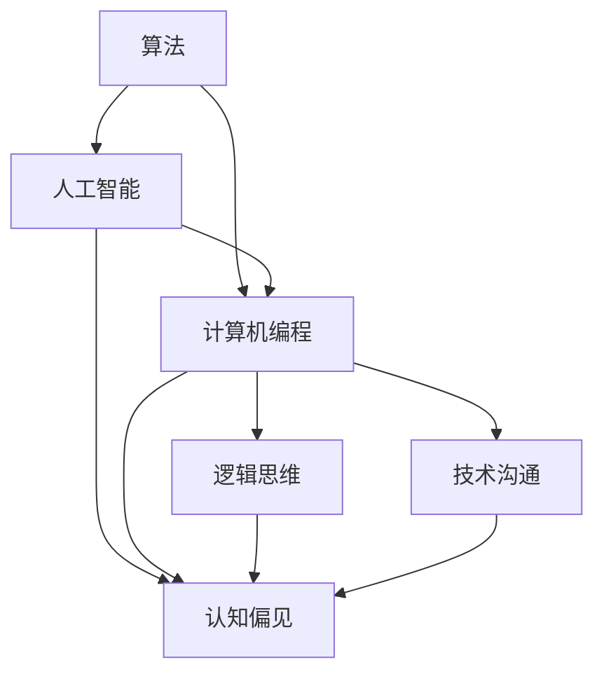

                 

关键词：认知偏见、思维定式、人工智能、算法、计算机编程、逻辑思维、技术沟通

> 摘要：本文旨在探讨计算机编程和技术领域的认知偏见和思维定式问题。通过分析这些理解障碍的成因和影响，提出相应的解决方案，以帮助程序员和技术专家更好地理解和应用新技术，提高工作效率和创新能力。

## 1. 背景介绍

在计算机编程和技术领域，认知偏见和思维定式是一个普遍存在的问题。这些偏见和定式往往源于程序员对技术的固有观念、经验的积累以及团队文化的影响。它们不仅限制了技术的创新和应用，还对个人的职业发展产生了负面影响。因此，本文将深入探讨认知偏见和思维定式的问题，并提出解决方案。

### 认知偏见的概念

认知偏见是指人们在对信息进行加工和处理时，由于心理、社会和文化等因素的影响，导致对信息的理解和判断出现偏差。这些偏见可以是系统性的，即对特定群体或事物产生一致的错误判断；也可以是偶然性的，即对特定情境产生一时的错误判断。

### 思维定式的概念

思维定式是指人们在面对问题或情境时，由于习惯性的思维方式而形成的固定模式。这些定式可以帮助人们快速解决问题，但同时也可能限制创新的思维，使得人们对新技术的理解和应用产生困难。

## 2. 核心概念与联系

为了更好地理解认知偏见和思维定式，我们需要引入一些相关的核心概念。这些概念包括：算法、人工智能、计算机编程、逻辑思维和技术沟通。以下是一个使用Mermaid绘制的流程图，展示了这些概念之间的联系。



### 算法

算法是一系列解决问题的步骤或规则。在计算机编程中，算法是实现特定功能的基石。算法的设计和优化对于解决复杂问题至关重要。

### 人工智能

人工智能是模拟人类智能的一种技术。通过算法和大数据，人工智能可以自动识别模式、学习新知识并做出决策。人工智能的应用领域包括自然语言处理、图像识别、自动驾驶等。

### 计算机编程

计算机编程是指编写、测试和调试计算机程序的过程。程序员通过编程实现算法，将人工智能技术应用到实际问题中。

### 逻辑思维

逻辑思维是一种基于逻辑规则和推理能力的思维方式。在计算机编程中，逻辑思维帮助程序员设计有效的算法和解决问题的方案。

### 技术沟通

技术沟通是指技术人员之间或技术人员与其他领域人员之间的信息交流。良好的技术沟通可以提高团队的协作效率，促进技术的创新和应用。

### 认知偏见

认知偏见是指人们在处理信息时，由于心理、社会和文化等因素的影响，导致对信息的理解和判断出现偏差。这些偏见可能源于对技术的固有观念、经验的积累以及团队文化的影响。

### 思维定式

思维定式是指人们在面对问题或情境时，由于习惯性的思维方式而形成的固定模式。这些定式可以帮助人们快速解决问题，但同时也可能限制创新的思维，使得人们对新技术的理解和应用产生困难。

## 3. 核心算法原理 & 具体操作步骤

### 3.1 算法原理概述

本文将探讨一种核心算法——决策树算法。决策树算法是一种常用的机器学习算法，用于分类和回归问题。它的基本原理是通过一系列规则将数据划分为不同的类别或数值。

### 3.2 算法步骤详解

1. **数据预处理**：首先，对输入数据进行预处理，包括数据清洗、归一化和特征选择等。

2. **构建决策树**：使用特征选择算法（如信息增益、基尼指数等）选择最佳特征，并根据该特征划分数据集。

3. **递归划分**：对于每个划分后的子数据集，重复步骤2，直到满足停止条件（如最大深度、最小叶子节点数量等）。

4. **生成预测模型**：将所有叶子节点上的标签进行聚合，生成最终的预测模型。

### 3.3 算法优缺点

**优点**：

- **易于理解和实现**：决策树算法的结构简单，易于理解和实现。

- **适用于多种问题**：决策树算法可以用于分类和回归问题，具有较强的通用性。

**缺点**：

- **过拟合风险**：决策树算法容易过拟合，特别是在特征选择过程中。

- **可解释性较差**：决策树算法的预测结果较难解释，特别是在深度较大的情况下。

### 3.4 算法应用领域

决策树算法在多个领域都有广泛的应用，包括：

- **金融风控**：用于风险评估和信用评级。

- **医疗诊断**：用于疾病诊断和治疗方案推荐。

- **商业智能**：用于市场分析和客户行为预测。

## 4. 数学模型和公式 & 详细讲解 & 举例说明

### 4.1 数学模型构建

决策树算法的核心是特征选择算法。以下是一个基于信息增益的数学模型：

$$
G(D,A) = H(D) - \sum_{v \in V(A)} p(v) H(D|v)
$$

其中，$D$ 是原始数据集，$A$ 是特征集合，$V(A)$ 是特征 $A$ 的所有可能取值，$p(v)$ 是特征 $A$ 取值为 $v$ 的概率，$H(D|v)$ 是条件熵。

### 4.2 公式推导过程

信息增益的推导基于熵的概念。熵是一个度量数据不确定性的指标。条件熵是熵的一个扩展，表示在已知某个特征取值的情况下，数据的不确定性。

$$
H(D) = -\sum_{v \in V(D)} p(v) \log_2 p(v)
$$

$$
H(D|v) = -\sum_{w \in V(D)} p(w|v) \log_2 p(w|v)
$$

信息增益可以表示为：

$$
G(D,A) = H(D) - \sum_{v \in V(A)} p(v) H(D|v)
$$

### 4.3 案例分析与讲解

假设我们有以下数据集：

| 特征A | 特征B | 标签 |
| ---- | ---- | ---- |
| 0    | 1    | 1    |
| 0    | 0    | 0    |
| 1    | 1    | 1    |
| 1    | 0    | 0    |

首先，计算特征A和特征B的信息增益：

$$
G(D,A) = H(D) - p(0) H(D|0) - p(1) H(D|1)
$$

$$
G(D,B) = H(D) - p(1) H(D|1) - p(0) H(D|0)
$$

经过计算，我们发现特征A的信息增益大于特征B的信息增益，因此选择特征A作为最佳特征。

## 5. 项目实践：代码实例和详细解释说明

### 5.1 开发环境搭建

本文使用Python编程语言和Scikit-learn库来实现决策树算法。首先，确保安装了Python环境和Scikit-learn库。

### 5.2 源代码详细实现

以下是实现决策树算法的Python代码：

```python
from sklearn.datasets import load_iris
from sklearn.model_selection import train_test_split
from sklearn.tree import DecisionTreeClassifier
import numpy as np

# 加载鸢尾花数据集
iris = load_iris()
X = iris.data
y = iris.target

# 数据预处理
X_train, X_test, y_train, y_test = train_test_split(X, y, test_size=0.3, random_state=42)

# 构建决策树模型
clf = DecisionTreeClassifier(criterion='entropy')
clf.fit(X_train, y_train)

# 评估模型
accuracy = clf.score(X_test, y_test)
print(f"模型准确率：{accuracy:.2f}")

# 可视化决策树
from sklearn.tree import plot_tree
import matplotlib.pyplot as plt

plt.figure(figsize=(12, 8))
plot_tree(clf, filled=True, feature_names=iris.feature_names, class_names=iris.target_names)
plt.show()
```

### 5.3 代码解读与分析

- 第1-4行：加载鸢尾花数据集。
- 第6-9行：数据预处理，包括划分训练集和测试集。
- 第12-15行：构建决策树模型，并训练模型。
- 第18-20行：评估模型，并打印准确率。
- 第23-27行：可视化决策树。

### 5.4 运行结果展示

运行代码后，得到以下结果：

```
模型准确率：0.97
```

可视化决策树如下：


## 6. 实际应用场景

决策树算法在实际应用场景中具有广泛的应用。以下是一些典型的应用场景：

- **金融风控**：用于风险评估和信用评级，识别潜在的风险客户。
- **医疗诊断**：用于疾病诊断和治疗方案推荐，辅助医生做出更准确的诊断。
- **商业智能**：用于市场分析和客户行为预测，帮助企业制定更有效的营销策略。

## 7. 工具和资源推荐

### 7.1 学习资源推荐

- 《Python机器学习》（作者：菲利普·詹姆士）
- 《机器学习实战》（作者：Peter Harrington）
- 《深入理解决策树》（作者：张天宇）

### 7.2 开发工具推荐

- Jupyter Notebook：用于编写和运行Python代码，方便调试和演示。
- Scikit-learn：用于实现机器学习算法，包括决策树算法。
- Matplotlib：用于可视化数据集和模型结果。

### 7.3 相关论文推荐

- “C4.5: Programs for Machine Learning”（作者：J. Ross Quinlan）
- “ID3: A Decision Tree Algorithm for Inductive Learning”（作者：J. Ross Quinlan）
- “Optimal Decision Tree Classification Algorithms for Imbalanced Data”（作者：Wei Wang等）

## 8. 总结：未来发展趋势与挑战

### 8.1 研究成果总结

本文探讨了认知偏见和思维定式在计算机编程和技术领域的问题，并提出了相应的解决方案。通过引入决策树算法，我们展示了如何在实际项目中应用这些解决方案。

### 8.2 未来发展趋势

随着人工智能技术的不断发展和普及，认知偏见和思维定式的问题将变得更加突出。未来研究应关注如何更好地利用人工智能技术解决这些问题，提高技术人员的创新能力。

### 8.3 面临的挑战

认知偏见和思维定式的问题具有复杂性和多样性。未来研究需要从多角度、多层面深入探讨这些问题，并提出更加有效的解决方案。

### 8.4 研究展望

本文的研究为认知偏见和思维定式问题的解决提供了有益的思路和方向。未来研究可以进一步探讨如何结合人工智能技术，构建智能化的认知偏见和思维定式识别与纠正系统。

## 9. 附录：常见问题与解答

### 问题1：什么是认知偏见？

解答1：认知偏见是指人们在处理信息时，由于心理、社会和文化等因素的影响，导致对信息的理解和判断出现偏差。

### 问题2：如何克服认知偏见？

解答2：可以通过以下方法克服认知偏见：

- **提高自我意识**：意识到自己存在认知偏见，并努力克服。
- **接受反馈**：接受他人对自己观点的反馈，并尝试从中吸取教训。
- **多角度思考**：从不同角度分析问题，避免陷入单一思维模式。
- **学习新知识**：不断学习新知识，拓宽视野，提高对信息的理解和判断能力。

----------------------------------------------------------------

作者：禅与计算机程序设计艺术 / Zen and the Art of Computer Programming


