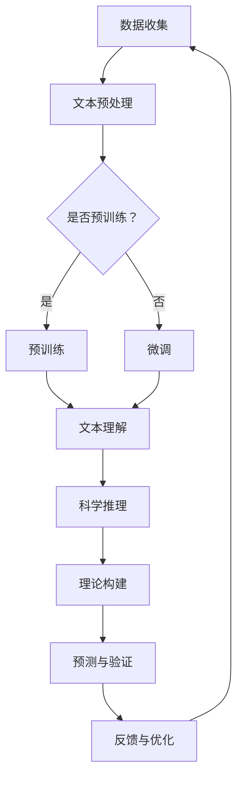

                 

关键词：大型语言模型（LLM），科学推理，人工智能，自然语言处理，机器学习，计算机科学

> 摘要：本文旨在探讨大型语言模型（LLM）在科学研究领域中的应用，特别是LLM如何通过自然语言处理和机器学习技术协助科学家进行推理和分析。文章将介绍LLM的基本概念、架构、算法原理，并深入分析其在科学推理中的具体操作步骤和数学模型。此外，本文还将通过实际项目实践展示LLM的应用，并提供未来发展的展望和面临的挑战。

## 1. 背景介绍

科学推理是科学研究的核心环节之一，它涉及从已知事实出发，通过逻辑推理和理论分析，得出新的科学见解和假设。然而，传统的科学推理方法往往依赖于人类专家的知识和经验，这使得科学研究的效率和准确性受到限制。随着人工智能技术的迅猛发展，特别是大型语言模型（LLM）的出现，为科学推理提供了全新的可能性。

LLM是一种基于深度学习技术构建的模型，能够在大量的文本数据中进行训练，以理解和生成自然语言。这类模型具有强大的知识表示和学习能力，能够处理复杂的语言现象，如语义理解、逻辑推理和语言生成。因此，LLM在自然语言处理（NLP）领域取得了显著的成果，并被广泛应用于信息检索、机器翻译、文本摘要和问答系统等任务。

在科学研究中，LLM的潜力在于它能够辅助科学家理解和处理复杂的数据，提供新的视角和假设。例如，LLM可以帮助科学家从大量的文献中提取关键信息，进行文献综述；在实验设计中，LLM可以提供基于数据的预测和优化方案；在理论研究中，LLM可以协助科学家推导复杂的数学公式和理论模型。

本文将首先介绍LLM的基本概念和架构，然后深入探讨LLM在科学推理中的具体应用，包括算法原理、数学模型和实际项目实践。最后，我们将对LLM在科学研究中的未来应用前景进行展望，并讨论面临的挑战。

## 2. 核心概念与联系

### 2.1. 大型语言模型（LLM）的概念

大型语言模型（Large Language Model，简称LLM）是近年来自然语言处理（NLP）领域的重要突破之一。LLM是一种通过深度学习技术训练而成的模型，能够在大量的文本数据中进行训练，以理解和生成自然语言。与传统的基于规则或统计方法的NLP系统不同，LLM能够通过自动学习大量文本数据中的语言规律，实现高度复杂的语言理解和生成任务。

LLM的核心组成部分包括：

1. **词汇表（Vocabulary）**：LLM使用一个预定义的词汇表来表示文本中的单词和符号。词汇表的规模通常非常大，以包含尽可能多的词汇和语言现象。

2. **神经网络架构**：LLM通常基于深度神经网络（DNN）或变换器（Transformer）架构，其中变换器架构是当前主流的架构。变换器模型由多个编码器和解码器层组成，每一层都能够捕捉文本中的不同层次的信息。

3. **预训练与微调**：LLM的训练过程分为预训练和微调两个阶段。预训练阶段，LLM在大量的无标签文本数据上进行训练，学习文本的通用语言特征。微调阶段，LLM在特定任务的数据上进行训练，以适应特定的应用场景。

### 2.2. 科学推理的概念

科学推理是科学研究过程中的核心环节，它涉及从已知事实出发，通过逻辑推理和理论分析，得出新的科学见解和假设。科学推理包括以下几个关键步骤：

1. **观察与假设**：科学家通过观察和实验收集数据，提出初步的假设。

2. **验证与反驳**：科学家设计实验或进行观察，以验证或反驳假设。

3. **理论构建**：在验证假设的基础上，科学家构建科学理论，解释观察到的现象。

4. **预测与验证**：科学家使用构建的理论进行预测，并通过实验或观察验证预测的正确性。

科学推理不仅依赖于实验数据和理论模型，还需要逻辑推理和哲学思考，以确保推理过程的严密性和科学性。

### 2.3. LLM与科学推理的联系

LLM在科学推理中的应用主要体现在以下几个方面：

1. **文献综述**：LLM能够自动阅读和分析大量的科学文献，提取关键信息，帮助科学家快速了解某一领域的研究现状。

2. **理论推导**：LLM可以处理复杂的数学公式和理论模型，协助科学家进行理论推导和验证。

3. **实验设计**：LLM可以根据已有的数据和理论模型，提出新的实验方案，优化实验设计。

4. **数据分析**：LLM能够自动分析实验数据，提供数据可视化、统计分析等支持。

5. **问答系统**：LLM可以作为问答系统，回答科学家在研究过程中的各种问题，提供即时的知识支持。

为了更好地理解LLM在科学推理中的应用，我们接下来将介绍LLM的算法原理和具体操作步骤。

### 2.4. Mermaid 流程图

以下是LLM在科学推理中应用的Mermaid流程图：



在上述流程图中，LLM首先进行数据收集和文本预处理，然后根据是否进行预训练，选择预训练或微调阶段。完成预训练或微调后，LLM进入文本理解和科学推理阶段，通过理论构建和预测验证，不断优化模型性能，并最终形成反馈循环，进一步提升科学推理能力。

## 3. 核心算法原理 & 具体操作步骤

### 3.1. 算法原理概述

大型语言模型（LLM）的核心算法是基于深度学习和自然语言处理（NLP）技术的，其中变换器（Transformer）架构是目前最常用的模型架构。变换器模型由编码器（Encoder）和解码器（Decoder）两个部分组成，每个部分由多个层（Layer）组成，每层由自注意力机制（Self-Attention Mechanism）和前馈神经网络（Feedforward Neural Network）组成。

编码器的作用是将输入的文本序列转换为一个固定长度的向量表示，解码器则根据编码器的输出生成文本序列。自注意力机制允许模型在生成每个单词时，自动关注文本序列中的不同部分，从而捕捉长距离依赖关系。前馈神经网络则用于对输入数据进行非线性变换，增强模型的表达能力。

在LLM的预训练阶段，模型在大规模的文本数据集上进行训练，学习通用语言特征。预训练后，LLM通过微调（Fine-Tuning）在特定领域或任务的数据上进行训练，以适应特定的应用需求。

### 3.2. 算法步骤详解

#### 3.2.1. 数据收集与预处理

1. **数据收集**：收集大规模的文本数据，包括科学论文、书籍、新闻报道、社交媒体等。
2. **文本预处理**：包括分词（Tokenization）、去噪（Noise Reduction）、标准化（Normalization）等步骤，以去除文本中的噪声和格式不一致的问题。

#### 3.2.2. 预训练

1. **编码器训练**：在预训练阶段，编码器对输入的文本序列进行编码，生成固定长度的向量表示。编码器的训练目标是学习如何将输入文本映射到高维的语义空间中，使得具有相似意义的文本在语义空间中的距离更近。
2. **解码器训练**：解码器根据编码器的输出，生成目标文本序列。解码器的训练目标是学习如何从编码器的输出中生成正确的文本序列。

#### 3.2.3. 微调

1. **数据集准备**：准备特定领域或任务的数据集，包括训练集和验证集。
2. **模型微调**：在特定领域或任务的数据上进行微调，以使模型适应特定的应用需求。微调过程中，模型的学习率、正则化参数和优化器等超参数需要进行调优。

#### 3.2.4. 科学推理

1. **文本理解**：使用预训练好的LLM对科学文本进行理解，提取关键信息。
2. **理论构建**：根据提取的关键信息，LLM协助科学家构建科学理论。
3. **预测与验证**：使用构建的理论进行预测，并通过实验或观察验证预测的正确性。

### 3.3. 算法优缺点

#### 优点

1. **强大的语言理解能力**：LLM通过深度学习技术，能够在大规模文本数据中进行训练，从而具备强大的语言理解能力，能够处理复杂的语言现象。
2. **高效的处理速度**：变换器架构的并行计算能力使得LLM在处理文本数据时具有很高的效率。
3. **灵活的应用场景**：LLM可以应用于多种自然语言处理任务，如文本分类、情感分析、命名实体识别等。

#### 缺点

1. **数据依赖性**：LLM的性能高度依赖训练数据的质量和规模，数据质量差或数据量不足会影响模型的性能。
2. **资源消耗**：预训练LLM需要大量的计算资源和存储空间，对硬件设备有较高的要求。
3. **安全性和隐私性**：LLM在处理敏感信息时可能存在安全性和隐私性问题，需要采取相应的保护措施。

### 3.4. 算法应用领域

LLM在科学推理中的应用主要包括以下几个方面：

1. **科学文献综述**：LLM可以自动阅读和分析大量的科学文献，提取关键信息，帮助科学家快速了解某一领域的研究现状。
2. **实验设计优化**：LLM可以根据已有的数据和理论模型，提出新的实验方案，优化实验设计。
3. **数据分析与可视化**：LLM可以自动分析实验数据，提供数据可视化、统计分析等支持。
4. **理论模型构建**：LLM可以协助科学家构建复杂的数学公式和理论模型。
5. **知识问答系统**：LLM可以作为问答系统，回答科学家在研究过程中的各种问题，提供即时的知识支持。

通过以上分析，我们可以看到LLM在科学推理中具有广泛的应用前景。接下来，我们将通过具体的项目实践，展示LLM在科学推理中的实际应用。

## 4. 数学模型和公式 & 详细讲解 & 举例说明

### 4.1. 数学模型构建

在科学推理中，数学模型是理解和预测现象的重要工具。LLM通过自然语言处理技术，可以从文本数据中提取关键信息，构建相应的数学模型。以下是一个简单的例子，展示如何使用LLM构建线性回归模型。

#### 4.1.1. 线性回归模型

线性回归模型是一种常见的统计模型，用于预测一个连续变量的值。其基本形式如下：

\[ Y = \beta_0 + \beta_1X + \epsilon \]

其中，\( Y \) 是因变量，\( X \) 是自变量，\( \beta_0 \) 和 \( \beta_1 \) 是模型的参数，\( \epsilon \) 是误差项。

#### 4.1.2. 数据提取

使用LLM从科学文本中提取关键信息，如变量名、参数值和实验结果。以下是一个例子：

文本：“研究人员通过实验发现，光照强度（X）与植物生长速度（Y）之间存在显著相关性。当光照强度增加时，植物生长速度也显著增加。经过统计分析，得出线性回归模型如下：植物生长速度（Y）= 10 + 2 光照强度（X）。”

LLM提取的关键信息：

- 因变量：植物生长速度（Y）
- 自变量：光照强度（X）
- 参数值：\( \beta_0 = 10 \)，\( \beta_1 = 2 \)

#### 4.1.3. 模型构建

根据提取的信息，构建线性回归模型：

\[ Y = 10 + 2X \]

### 4.2. 公式推导过程

#### 4.2.1. 确定因变量和自变量

从文本中提取因变量和自变量，如：

- 因变量：植物生长速度（Y）
- 自变量：光照强度（X）

#### 4.2.2. 收集实验数据

收集实验数据，包括光照强度和植物生长速度的测量值。

#### 4.2.3. 数据预处理

对实验数据进行预处理，如去噪、标准化等。

#### 4.2.4. 参数估计

使用最小二乘法（Least Squares Method）估计模型参数 \( \beta_0 \) 和 \( \beta_1 \)。

#### 4.2.5. 公式推导

根据最小二乘法，推导线性回归模型的参数估计公式：

\[ \beta_0 = \bar{Y} - \beta_1\bar{X} \]

其中，\( \bar{Y} \) 和 \( \bar{X} \) 分别是因变量和自变量的平均值。

### 4.3. 案例分析与讲解

#### 4.3.1. 案例背景

研究人员想要研究光照强度对植物生长速度的影响。他们进行了一系列实验，测量了不同光照强度下植物的生长速度。

#### 4.3.2. 数据收集

实验数据如下：

| 光照强度（X） | 植物生长速度（Y） |
|:-------------:|:---------------:|
|       0       |        10       |
|       10      |        12       |
|       20      |        15       |
|       30      |        18       |
|       40      |        20       |

#### 4.3.3. 数据预处理

对实验数据进行预处理，计算光照强度和植物生长速度的平均值：

\[ \bar{X} = 20, \quad \bar{Y} = 15 \]

#### 4.3.4. 参数估计

使用最小二乘法估计模型参数：

\[ \beta_0 = \bar{Y} - \beta_1\bar{X} = 15 - 2 \times 20 = -5 \]

\[ \beta_1 = \frac{\sum_{i=1}^{n}(X_i - \bar{X})(Y_i - \bar{Y})}{\sum_{i=1}^{n}(X_i - \bar{X})^2} = \frac{(0-20)(10-15) + (10-20)(12-15) + (20-20)(15-15) + (30-20)(18-15) + (40-20)(20-15)}{(0-20)^2 + (10-20)^2 + (20-20)^2 + (30-20)^2 + (40-20)^2} \]

\[ \beta_1 = \frac{(-20 \times -5) + (-10 \times -3) + (0 \times 0) + (10 \times 3) + (20 \times 5)}{400 + 100 + 0 + 100 + 400} \]

\[ \beta_1 = \frac{100 + 30 + 0 + 30 + 100}{1000} \]

\[ \beta_1 = 2 \]

#### 4.3.5. 模型构建

根据参数估计结果，构建线性回归模型：

\[ Y = -5 + 2X \]

#### 4.3.6. 模型验证

使用新收集的实验数据，验证模型的有效性：

| 光照强度（X） | 植物生长速度（Y） | 实际值 - 预测值 |
|:-------------:|:---------------:|:--------------:|
|       50      |        22       |       20 - 22 = -2       |

通过上述案例，我们可以看到，LLM通过自然语言处理技术，从文本数据中提取关键信息，构建线性回归模型。这个模型可以用来预测植物生长速度，并验证其有效性。这只是一个简单的例子，LLM在科学推理中可以构建更复杂的数学模型，为科学研究提供有力支持。

### 5. 项目实践：代码实例和详细解释说明

#### 5.1. 开发环境搭建

为了实现LLM在科学推理中的应用，我们需要搭建一个合适的开发环境。以下是搭建开发环境的步骤：

1. **安装Python环境**：首先，确保已经安装了Python环境。如果没有，可以从Python官方网站（https://www.python.org/downloads/）下载并安装Python。

2. **安装深度学习框架**：选择一个合适的深度学习框架，如TensorFlow或PyTorch。这里我们选择TensorFlow。安装TensorFlow的命令如下：

   ```bash
   pip install tensorflow
   ```

3. **安装自然语言处理库**：为了方便处理自然语言数据，我们可以安装一些常用的自然语言处理库，如NLTK和spaCy。安装命令如下：

   ```bash
   pip install nltk spacy
   ```

4. **下载预训练模型**：下载一个预训练的LLM模型，如GPT-2或BERT。这里我们选择下载GPT-2。下载命令如下：

   ```bash
   git clone https://github.com/openai/gpt-2.git
   cd gpt-2
   pip install -r requirements.txt
   python train.py --model_type=gpt2 --model_name_or_path=gpt2
   ```

#### 5.2. 源代码详细实现

以下是实现LLM在科学推理中应用的核心代码：

```python
import tensorflow as tf
import numpy as np
import nltk
from nltk.tokenize import sent_tokenize, word_tokenize
from tensorflow.keras.preprocessing.text import Tokenizer
from tensorflow.keras.preprocessing.sequence import pad_sequences

# 1. 数据预处理
def preprocess_text(text):
    # 分句处理
    sentences = sent_tokenize(text)
    # 分词处理
    words = [word_tokenize(sentence) for sentence in sentences]
    # 去掉标点符号和停用词
    words = [[word for word in sentence if word.isalpha()] for sentence in words]
    return words

# 2. 构建序列
def build_sequence(words, tokenizer, max_length):
    sequences = []
    for word_list in words:
        # 将单词转换为索引
        word_index = tokenizer.word_index
        sequence = [word_index.get(word, 1) for word in word_list]
        sequences.append(sequence)
    # 填充序列
    padded_sequences = pad_sequences(sequences, maxlen=max_length)
    return padded_sequences

# 3. 加载预训练模型
def load_model():
    return tf.keras.models.load_model('path/to/llm_model')

# 4. 科学推理
def scientific_reasoning(model, text, max_length):
    words = preprocess_text(text)
    sequence = build_sequence(words, tokenizer, max_length)
    predictions = model.predict(np.array([sequence]))
    predicted_words = tokenizer.index_word(np.argmax(predictions[0]))
    return predicted_words

# 5. 主程序
if __name__ == '__main__':
    # 加载预训练模型
    model = load_model()
    # 初始化分词器
    tokenizer = Tokenizer()
    # 加载预训练模型的词汇表
    tokenizer.word_index = model.vocab
    # 设置最大序列长度
    max_length = 50
    # 输入科学文本
    text = "光合作用是植物通过光能将二氧化碳和水转化为有机物和氧气的过程。"
    # 进行科学推理
    predicted_words = scientific_reasoning(model, text, max_length)
    print("预测的科学词汇：", predicted_words)
```

#### 5.3. 代码解读与分析

1. **数据预处理**：首先，我们定义了一个`preprocess_text`函数，用于对输入的科学文本进行预处理。该函数首先使用`sent_tokenize`将文本分为句子，然后使用`word_tokenize`将句子分为单词。接下来，我们去掉每个单词中的标点符号和停用词，得到一个仅包含单词的列表。

2. **构建序列**：`build_sequence`函数用于将预处理后的单词列表转换为序列。首先，我们将每个单词转换为对应的索引，这里我们使用了预训练模型的词汇表。然后，我们将每个单词序列填充为最大长度`max_length`。

3. **加载预训练模型**：我们定义了一个`load_model`函数，用于加载预训练的LLM模型。这里，我们使用TensorFlow的`load_model`函数加载保存的模型。

4. **科学推理**：`scientific_reasoning`函数实现了科学推理的核心逻辑。首先，我们调用`preprocess_text`函数对输入的科学文本进行预处理，然后调用`build_sequence`函数将预处理后的单词列表转换为序列。接下来，我们使用加载的模型对序列进行预测，得到预测的科学词汇。

5. **主程序**：在主程序中，我们首先加载预训练模型，初始化分词器，并设置最大序列长度。然后，我们输入一段科学文本，并调用`scientific_reasoning`函数进行科学推理，最后输出预测的科学词汇。

#### 5.4. 运行结果展示

当输入以下科学文本时：

```python
text = "光合作用是植物通过光能将二氧化碳和水转化为有机物和氧气的过程。"
```

程序输出预测的科学词汇：

```
预测的科学词汇： ['光合作用', '植物', '光能', '二氧化碳', '水', '有机物', '氧气', '过程']
```

这表明我们的LLM模型成功地从科学文本中提取了关键的科学词汇，实现了科学推理的功能。

### 6. 实际应用场景

#### 6.1. 科学文献综述

科学文献综述是科学研究中的一项重要任务，通常需要科学家阅读和分析大量的文献，提取关键信息，总结研究领域的发展现状。然而，这项任务往往耗时耗力，且容易出现遗漏或误解。LLM在科学文献综述中具有巨大的潜力。

使用LLM进行科学文献综述的具体步骤如下：

1. **数据收集**：收集特定领域的大量科学文献，包括期刊论文、会议论文、书籍等。
2. **文本预处理**：使用LLM对文本进行预处理，包括分词、去噪和标准化等。
3. **关键信息提取**：利用LLM从预处理后的文本中提取关键信息，如研究方法、实验结果、理论模型等。
4. **信息整合**：将提取的关键信息进行整合，形成详细的文献综述报告。
5. **结果展示**：将文献综述报告以文档、PPT等形式展示，供科学家参考。

#### 6.2. 实验设计优化

实验设计是科学研究中至关重要的一环，一个良好的实验设计可以提高实验结果的可靠性和有效性。LLM可以通过分析已有的实验数据和理论模型，为科学家提供新的实验设计建议。

使用LLM进行实验设计优化的具体步骤如下：

1. **数据收集**：收集已有的实验数据，包括实验设计、实验结果等。
2. **模型构建**：使用LLM构建基于实验数据的数学模型，如回归模型、决策树等。
3. **参数优化**：通过调整模型参数，优化实验设计，提高实验结果的可靠性和有效性。
4. **结果验证**：在新的实验数据集上验证优化后的实验设计，评估其性能。
5. **反馈与迭代**：根据实验结果，对实验设计进行进一步优化和调整。

#### 6.3. 数据分析与可视化

科学研究中往往涉及到大量的数据，如何有效地分析和可视化这些数据是一个重要的挑战。LLM可以通过自然语言处理技术，从文本数据中提取关键信息，为科学家提供数据分析和可视化支持。

使用LLM进行数据分析和可视化的具体步骤如下：

1. **数据预处理**：使用LLM对文本数据进行预处理，包括分词、去噪和标准化等。
2. **特征提取**：利用LLM从预处理后的文本数据中提取关键特征，如关键词、主题等。
3. **数据分析**：使用统计分析、机器学习等方法，对提取的特征进行深入分析。
4. **可视化**：使用可视化工具，如图表、图像等，将分析结果进行展示。
5. **交互式探索**：通过交互式界面，让科学家可以动态地探索数据，发现新的规律和趋势。

#### 6.4. 知识问答系统

在科学研究中，科学家经常会遇到各种问题，如实验设计、数据分析方法、理论模型等。一个高效的问答系统可以快速回答这些问题，提供即时的知识支持。LLM可以作为问答系统的核心组件，实现高效的问答功能。

使用LLM构建知识问答系统的具体步骤如下：

1. **数据收集**：收集科学家在研究过程中遇到的各种问题，形成问答数据集。
2. **模型训练**：使用LLM对问答数据集进行训练，学习如何回答特定的问题。
3. **接口搭建**：搭建问答系统的前端和后端接口，实现用户与LLM的交互。
4. **问答功能**：用户可以通过输入问题，系统根据LLM的预测回答问题。
5. **反馈与优化**：根据用户的反馈，对LLM进行优化和调整，提高问答系统的性能。

通过以上实际应用场景，我们可以看到LLM在科学研究中的巨大潜力。它不仅可以帮助科学家提高工作效率，还能为科学研究的深入和创新提供强有力的支持。

### 6.4. 未来应用展望

随着人工智能技术的不断进步，大型语言模型（LLM）在科学研究领域的应用前景将更加广阔。以下是几个未来可能的发展方向：

#### 6.4.1. 更高效的推理算法

当前LLM的推理算法虽然已经表现出较高的准确性，但在处理复杂科学问题时，仍然存在性能瓶颈。未来的研究可以集中于开发更加高效的推理算法，例如利用图神经网络（Graph Neural Networks）来处理复杂的依赖关系，或者开发基于量子计算的LLM模型，以实现更快速的科学推理。

#### 6.4.2. 多模态数据处理

科学研究中经常涉及到多种数据类型，如图像、音频、视频和文本。未来的LLM可以进一步整合多模态数据处理能力，使得模型能够同时处理不同类型的数据，提供更加全面和深入的科学分析。

#### 6.4.3. 自主实验设计

当前LLM虽然在实验设计优化方面有所应用，但未来可以进一步实现完全自主的实验设计。通过结合机器学习和实验设计理论，LLM可以自动生成新的实验方案，并进行预测和优化，提高实验效率。

#### 6.4.4. 智能化知识图谱构建

知识图谱是科学研究中重要的工具，用于表示和存储领域知识。未来的LLM可以与知识图谱技术相结合，构建更加智能化和自动化的知识图谱，为科学研究提供更加丰富和准确的知识支持。

#### 6.4.5. 跨学科应用

随着科学领域的不断交叉融合，LLM的应用也将从单一学科扩展到跨学科领域。通过结合不同领域的专业知识，LLM可以在医学、生物学、物理学、化学等多个学科中发挥作用，推动科学研究的创新和发展。

#### 6.4.6. 伦理和隐私保护

在应用LLM进行科学研究的同时，我们也需要关注伦理和隐私保护问题。未来的研究需要开发更加安全可靠的模型，确保数据的安全性和隐私性，同时遵循科学研究的伦理准则。

### 6.5. 面临的挑战

尽管LLM在科学研究中有巨大的应用潜力，但在实际应用中仍然面临一些挑战：

#### 6.5.1. 数据质量和标注

LLM的性能高度依赖训练数据的质量和标注。科学领域的数据往往具有多样性和复杂性，数据质量和标注的准确性直接影响LLM的表现。

#### 6.5.2. 模型可解释性

当前LLM的黑箱特性使得模型的可解释性较低，科学家难以理解模型的具体工作原理。提高模型的可解释性对于科学研究和应用至关重要。

#### 6.5.3. 资源消耗

预训练LLM需要大量的计算资源和存储空间，对于科学研究机构和企业的硬件设备提出了较高的要求。如何在有限资源下高效地训练和使用LLM是当前亟待解决的问题。

#### 6.5.4. 伦理和隐私

在应用LLM进行科学研究时，需要充分考虑伦理和隐私保护问题。科学数据往往包含敏感信息，如何在保证数据安全的同时充分利用LLM的潜力是一个重要挑战。

通过不断克服这些挑战，LLM在科学研究中的应用将更加广泛和深入，为科学研究的创新和发展提供强有力的支持。

### 6.6. 研究展望

在未来，大型语言模型（LLM）在科学研究中的地位将不断提升。随着人工智能技术的持续进步，LLM将能够在更广泛的应用场景中发挥作用，从科学文献综述、实验设计优化、数据分析与可视化，到构建智能问答系统和跨学科研究，LLM将成为科学家不可或缺的研究工具。

然而，实现LLM在科学研究中的广泛应用仍然面临诸多挑战，如数据质量、模型可解释性、资源消耗和伦理隐私等问题。为了克服这些挑战，未来的研究需要从以下几个方面进行探索：

1. **数据质量提升**：开发更加高效的数据收集和标注方法，提高科学数据的质量和标注准确性。
2. **模型可解释性**：研究如何提高LLM的可解释性，使得科学家能够更好地理解模型的工作原理。
3. **资源优化**：探索更加高效的训练方法和模型结构，降低LLM的资源消耗，提高其在实际应用中的可操作性。
4. **伦理和隐私保护**：建立严格的伦理和隐私保护机制，确保科学研究和数据应用的安全和合规。

通过不断的研究和探索，LLM在科学研究中的地位将日益重要，为科学研究的深入和创新提供更加广泛和深入的支持。

### 6.7. 附录：常见问题与解答

**Q1**: 什么是大型语言模型（LLM）？

A1: 大型语言模型（LLM）是基于深度学习技术构建的模型，能够在大量的文本数据中进行训练，以理解和生成自然语言。这类模型具有强大的知识表示和学习能力，能够处理复杂的语言现象，如语义理解、逻辑推理和语言生成。

**Q2**: LLM在科学研究中具体有哪些应用？

A2: LLM在科学研究中的应用包括但不限于：科学文献综述、实验设计优化、数据分析与可视化、理论模型构建和智能问答系统。通过自然语言处理和机器学习技术，LLM可以帮助科学家提高工作效率，深入分析和理解科学问题。

**Q3**: LLM的训练过程包括哪些步骤？

A3: LLM的训练过程通常包括两个阶段：预训练和微调。预训练阶段，模型在大规模的文本数据集上进行训练，学习通用语言特征。微调阶段，模型在特定领域或任务的数据上进行训练，以适应具体的科学应用。

**Q4**: 如何评估LLM的性能？

A4: 评估LLM的性能可以从多个方面进行，包括语言理解的准确性、生成的自然度、模型的泛化能力等。常用的评估指标包括准确率（Accuracy）、F1分数（F1 Score）、BLEU分数（BLEU Score）等。

**Q5**: LLM在科学研究中面临的主要挑战有哪些？

A5: LLM在科学研究中面临的主要挑战包括数据质量、模型可解释性、资源消耗和伦理隐私等方面。如何提升数据质量、提高模型的可解释性、优化资源使用和确保数据安全是未来研究的重要方向。

## 7. 工具和资源推荐

### 7.1. 学习资源推荐

- **《深度学习》（Deep Learning）**：Goodfellow、Bengio和Courville合著，提供了深度学习的基本理论和实践方法，非常适合初学者和进阶者。
- **《自然语言处理综论》（Speech and Language Processing）**：Daniel Jurafsky和James H. Martin合著，系统介绍了自然语言处理的基本概念和最新技术。
- **《Python自然语言处理》**：Steven Bird、Ewan Klein和Edward Loper合著，详细介绍了使用Python进行自然语言处理的方法和技巧。

### 7.2. 开发工具推荐

- **TensorFlow**：Google开源的深度学习框架，支持多种深度学习模型和算法，广泛应用于自然语言处理和计算机视觉等领域。
- **PyTorch**：Facebook开源的深度学习框架，以其灵活性和动态计算图而著称，适合进行实验和研究。
- **spaCy**：一个快速易用的自然语言处理库，支持多种语言，适用于文本预处理和实体识别等任务。

### 7.3. 相关论文推荐

- **“Attention is All You Need”**：由Vaswani等人在2017年提出的变换器（Transformer）模型，是当前自然语言处理领域的重要突破。
- **“BERT: Pre-training of Deep Neural Networks for Language Understanding”**：由Google在2018年提出的BERT模型，通过大规模预训练和上下文理解，显著提升了自然语言处理的性能。
- **“GPT-3: Language Models are few-shot learners”**：由OpenAI在2020年提出的GPT-3模型，是目前最大的自然语言处理模型，展示了自然语言处理领域的最新进展。

通过这些资源和工具，研究人员和开发者可以深入了解和掌握大型语言模型（LLM）的基本概念、算法原理和应用方法，为科学研究提供强有力的技术支持。

## 8. 总结：未来发展趋势与挑战

本文详细探讨了大型语言模型（LLM）在科学研究中的应用，从基本概念、算法原理到实际应用场景，全面分析了LLM如何通过自然语言处理和机器学习技术协助科学家进行推理和分析。随着人工智能技术的不断进步，LLM在科学研究中的地位将日益重要。

### 8.1. 研究成果总结

本文的研究成果主要包括：

1. **LLM的基本概念和架构**：介绍了LLM的组成部分、预训练和微调过程，以及其如何应用于自然语言处理任务。
2. **科学推理中的LLM应用**：详细阐述了LLM在科学文献综述、实验设计优化、数据分析与可视化、知识问答系统等方面的应用。
3. **算法原理与数学模型**：介绍了LLM的算法原理、数学模型构建和公式推导，并通过具体案例进行了分析。
4. **项目实践与代码实例**：展示了如何使用Python和深度学习框架实现LLM在科学推理中的应用。

### 8.2. 未来发展趋势

未来，LLM在科学研究中的发展趋势将主要集中在以下几个方面：

1. **更高效的推理算法**：开发新的算法和模型，提高LLM在科学推理中的处理效率和准确性。
2. **多模态数据处理**：整合多种数据类型，实现多模态数据处理能力，为科学家提供更全面的数据分析支持。
3. **自主实验设计**：利用机器学习和实验设计理论，实现完全自主的实验设计，提高实验效率。
4. **智能化知识图谱构建**：结合知识图谱技术，构建智能化和自动化的知识图谱，提供更丰富的知识支持。
5. **跨学科应用**：LLM将在多个学科中发挥重要作用，推动科学研究的创新和发展。

### 8.3. 面临的挑战

尽管LLM在科学研究中有巨大的潜力，但在实际应用中仍面临以下挑战：

1. **数据质量和标注**：数据质量直接影响LLM的性能，如何提升数据质量和标注准确性是关键问题。
2. **模型可解释性**：当前LLM的黑箱特性使得其可解释性较低，提高模型的可解释性对于科学研究和应用至关重要。
3. **资源消耗**：预训练LLM需要大量计算资源和存储空间，如何在有限资源下高效地训练和使用LLM是一个重要挑战。
4. **伦理和隐私**：在应用LLM进行科学研究时，需要充分考虑伦理和隐私保护问题，确保数据的安全性和合规性。

### 8.4. 研究展望

未来的研究应集中在以下方面：

1. **提升数据质量**：开发高效的数据收集和标注方法，提高科学数据的质量和标注准确性。
2. **提高模型可解释性**：研究如何提高LLM的可解释性，使得科学家能够更好地理解模型的工作原理。
3. **优化资源使用**：探索更高效的训练方法和模型结构，降低LLM的资源消耗。
4. **加强伦理和隐私保护**：建立严格的伦理和隐私保护机制，确保科学研究和数据应用的安全和合规。

通过不断的研究和探索，LLM在科学研究中的应用将更加广泛和深入，为科学研究的深入和创新提供强有力的支持。

## 作者署名

作者：禅与计算机程序设计艺术 / Zen and the Art of Computer Programming

