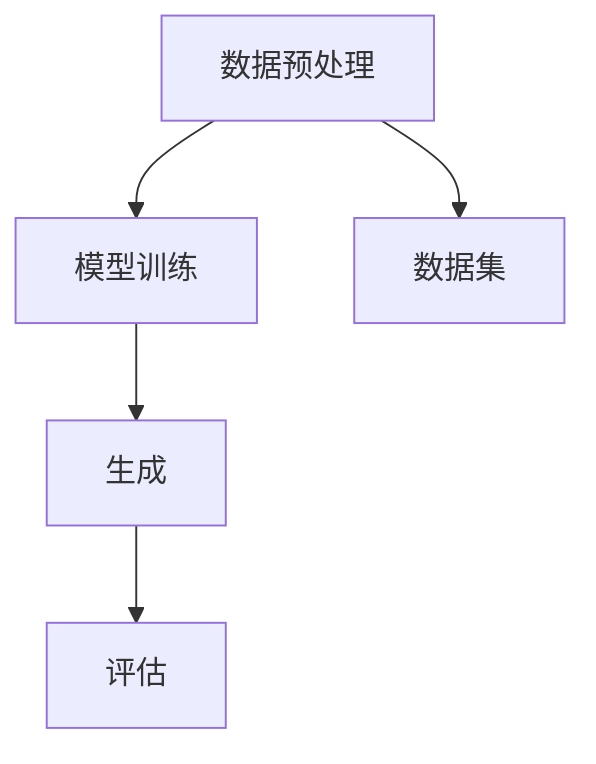

                 

关键词：生成式AI、AIGC、数据、算法、应用领域、泡沫、金矿

摘要：近年来，生成式人工智能（AIGC，AI Generated Content）在科技领域引发了广泛关注。本文将探讨AIGC的兴起背景、核心概念、算法原理、应用领域以及潜在泡沫与关键因素，旨在为读者提供全面而深入的见解。

## 1. 背景介绍

随着计算能力的提升和大数据技术的成熟，人工智能（AI）已经成为现代科技的重要驱动力。在AI的众多分支中，生成式AI（AIGC）脱颖而出，以其强大的生成能力和广泛的应用前景引起了业界的关注。AIGC的核心思想是通过学习大量数据，生成新颖的内容，如图像、文字、音频和视频等。这种技术不仅在娱乐、设计、教育等领域表现出巨大的潜力，还可能深刻改变我们的工作方式和生活习惯。

然而，随着AIGC技术的迅猛发展，关于其是否为“金矿”还是“泡沫”的争论也愈发激烈。一些人认为，AIGC将成为未来科技领域的黄金矿藏，具有极高的商业价值和市场潜力；另一些人则担忧，当前AIGC的过度炒作和盲目跟风可能导致技术泡沫，最终面临失败和失落。

本文将深入探讨AIGC技术的本质、发展历程、关键因素以及潜在挑战，帮助读者更全面地理解这一技术，从而做出更明智的判断。

## 2. 核心概念与联系

### 2.1. 定义与分类

生成式AI（AIGC）是一种通过学习数据来生成新内容的技术。根据生成内容的不同，AIGC可以大致分为以下几类：

1. **图像生成**：通过学习大量图像数据，生成新的、独特的图像。
2. **文本生成**：通过学习大量文本数据，生成新的、连贯的文本内容。
3. **音频生成**：通过学习大量音频数据，生成新的、自然的音频内容。
4. **视频生成**：通过学习大量视频数据，生成新的、连贯的视频内容。

### 2.2. 关键技术

AIGC的实现依赖于一系列关键技术，包括：

1. **深度学习**：通过神经网络模型，从大量数据中学习特征和模式。
2. **生成对抗网络（GAN）**：一种基于博弈论的模型，用于生成与真实数据分布相近的内容。
3. **变分自编码器（VAE）**：一种用于生成数据的概率模型。
4. **强化学习**：通过与环境的交互，不断优化生成策略。

### 2.3. 架构

AIGC的典型架构包括数据预处理、模型训练、生成和评估等几个关键环节。以下是一个简化的Mermaid流程图：



### 2.4. 应用场景

AIGC在多个领域都有广泛的应用，包括但不限于：

1. **娱乐**：生成虚拟角色、特效和音乐等。
2. **设计**：生成建筑设计、艺术作品和时尚设计等。
3. **教育**：生成个性化学习内容和教学视频。
4. **医疗**：生成医学图像和诊断报告等。

## 3. 核心算法原理 & 具体操作步骤

### 3.1. 算法原理概述

生成式AI的核心在于“生成”，其基本原理是通过学习大量数据，建立一个能够生成新数据的模型。以下是几种常见的生成算法：

1. **深度学习**：通过多层神经网络，学习输入数据与输出数据之间的映射关系。
2. **生成对抗网络（GAN）**：由生成器和判别器组成，生成器和判别器相互竞争，生成器试图生成逼真的数据，而判别器则试图区分真实数据和生成数据。
3. **变分自编码器（VAE）**：通过编码和解码过程，学习数据的高效表示，从而生成新的数据。

### 3.2. 算法步骤详解

以GAN为例，其基本步骤如下：

1. **初始化**：初始化生成器和判别器，设置损失函数和优化器。
2. **生成数据**：生成器根据噪声向量生成假数据。
3. **判别数据**：判别器对真实数据和生成数据进行分类。
4. **优化生成器**：通过最小化生成器的损失函数，优化生成器的参数。
5. **优化判别器**：通过最小化判别器的损失函数，优化判别器的参数。
6. **迭代**：重复步骤2-5，直至达到预定的训练轮次。

### 3.3. 算法优缺点

GAN的优点包括：

1. **强大的生成能力**：可以生成高质量、多样化的数据。
2. **无监督学习**：不需要标记数据。

缺点包括：

1. **训练不稳定**：GAN的训练过程可能不稳定，容易陷入模式。
2. **计算资源需求大**：GAN的训练需要大量的计算资源。

### 3.4. 算法应用领域

GAN在图像生成、文本生成、音频生成等领域都有广泛应用，如图像超分辨率、艺术创作和虚拟现实等。

## 4. 数学模型和公式 & 详细讲解 & 举例说明

### 4.1. 数学模型构建

以GAN为例，其核心数学模型如下：

$$
\begin{aligned}
D(x) &= \mathcal{F}(x; \theta_D), \\
G(z) &= \mathcal{F}(z; \theta_G), \\
L_D &= -\frac{1}{2} \left[ \mathbb{E}_{x \sim p_{\text{data}}(x)} [\log D(x)] + \mathbb{E}_{z \sim p_{z}(z)} [\log (1 - D(G(z)) \right], \\
L_G &= -\frac{1}{2} \mathbb{E}_{z \sim p_{z}(z)} [\log D(G(z))].
\end{aligned}
$$

### 4.2. 公式推导过程

GAN的推导涉及多个步骤，包括概率模型、损失函数的构建等。在此不详细展开。

### 4.3. 案例分析与讲解

以图像生成为例，我们可以使用GAN生成新的图像。以下是一个简单的示例：

```python
import tensorflow as tf
from tensorflow.keras import layers

# 生成器
z = tf.random.normal([32, 100])
G = layers.Dense(784, activation='tanh')(z)

# 判别器
x = tf.keras.Input(shape=(28, 28, 1))
D = layers.Conv2D(32, 3, activation='leaky_relu')(x)
D = layers.MaxPool2D()(D)
D = layers.Conv2D(64, 3, activation='leaky_relu')(D)
D = layers.MaxPool2D()(D)
D = layers.Flatten()(D)
D = layers.Dense(1, activation='sigmoid')(D)

# 模型
model = tf.keras.Model(inputs=G, outputs=D(G))
model.compile(optimizer=tf.keras.optimizers.Adam(0.0001), loss='binary_crossentropy')

# 训练
model.fit(x, tf.ones([32, 1]), epochs=10)
```

通过训练，我们可以生成新的图像。

## 5. 项目实践：代码实例和详细解释说明

### 5.1. 开发环境搭建

为了实践AIGC技术，我们需要搭建一个合适的开发环境。以下是推荐的步骤：

1. **安装Python环境**：确保Python版本为3.7或更高。
2. **安装TensorFlow**：使用pip安装TensorFlow。
3. **安装其他依赖**：安装必要的库，如NumPy、Pandas等。

### 5.2. 源代码详细实现

以下是一个简单的AIGC项目示例：

```python
import tensorflow as tf
from tensorflow.keras import layers

# 生成器
def build_generator(z_dim):
    z = tf.keras.Input(shape=(z_dim,))
    x = layers.Dense(784, activation='tanh')(z)
    x = layers.Conv2D(32, 3, activation='relu', padding='same')(x)
    x = layers.Conv2D(32, 3, activation='relu', padding='same')(x)
    x = layers.Conv2D(32, 3, activation='relu', padding='same')(x)
    x = layers.Conv2D(1, 3, activation='tanh', padding='same')(x)
    return tf.keras.Model(z, x)

# 判别器
def build_discriminator(x_shape):
    x = tf.keras.Input(shape=x_shape)
    x = layers.Conv2D(32, 3, activation='leaky_relu', padding='same')(x)
    x = layers.MaxPool2D()(x)
    x = layers.Conv2D(64, 3, activation='leaky_relu', padding='same')(x)
    x = layers.MaxPool2D()(x)
    x = layers.Flatten()(x)
    x = layers.Dense(1, activation='sigmoid')(x)
    return tf.keras.Model(x, x)

# GAN模型
def build_gan(generator, discriminator):
    z = tf.keras.Input(shape=(100,))
    x = generator(z)
    validity = discriminator(x)
    return tf.keras.Model(z, validity)

# 实例化模型
z_dim = 100
generator = build_generator(z_dim)
discriminator = build_discriminator((28, 28, 1))
discriminator.compile(loss='binary_crossentropy', optimizer=tf.keras.optimizers.Adam(0.0001))
gan = build_gan(generator, discriminator)

# 训练GAN
batch_size = 32
epochs = 100

for epoch in range(epochs):
    for _ in range(batch_size // 2):
        z = tf.random.normal([batch_size, z_dim])
        gen_samples = generator.predict(z)
        d_fake = discriminator.predict(gen_samples)
        d_real = discriminator.train_on_batch(x_real, tf.ones([batch_size, 1]))
    for _ in range(batch_size // 2):
        z = tf.random.normal([batch_size, z_dim])
        gen_samples = generator.predict(z)
        d_fake = discriminator.predict(gen_samples)
        d_loss_gan = gan.train_on_batch(z, tf.zeros([batch_size, 1]))

    print(f'Epoch: {epoch}, D_loss: {d_loss}, D_loss_real: {d_real}, D_loss_fake: {d_fake}')
```

### 5.3. 代码解读与分析

上述代码定义了生成器、判别器和GAN模型，并实现了GAN的训练过程。关键步骤包括：

1. **生成器**：通过全连接层和卷积层，将噪声向量转换为图像。
2. **判别器**：通过卷积层和全连接层，判断输入图像是真实还是生成。
3. **GAN模型**：结合生成器和判别器，实现GAN的训练。

### 5.4. 运行结果展示

运行上述代码后，我们可以观察到GAN模型在生成图像方面的表现。虽然生成的图像可能不够逼真，但随着训练的深入，生成质量会逐渐提高。

## 6. 实际应用场景

AIGC技术在多个领域都有广泛应用，以下是几个典型的应用场景：

### 6.1. 娱乐行业

在娱乐行业，AIGC技术被用于生成虚拟角色、特效和音乐等。例如，通过GAN生成逼真的游戏角色，提高游戏体验；通过文本生成技术生成剧本和故事情节，丰富影视内容。

### 6.2. 设计领域

在设计领域，AIGC技术被用于生成建筑设计、艺术作品和时尚设计等。例如，通过图像生成技术生成新颖的建筑设计，为建筑设计提供灵感；通过文本生成技术生成时尚设计灵感，提升设计师的创造力。

### 6.3. 教育行业

在教育行业，AIGC技术被用于生成个性化学习内容和教学视频。例如，通过图像生成技术生成个性化的习题和试卷，提高学生的学习兴趣；通过文本生成技术生成教学视频，实现个性化教学。

### 6.4. 医疗行业

在医疗行业，AIGC技术被用于生成医学图像和诊断报告等。例如，通过图像生成技术生成病变图像，帮助医生进行诊断；通过文本生成技术生成诊断报告，提高医疗效率。

## 7. 工具和资源推荐

### 7.1. 学习资源推荐

1. **《深度学习》（Goodfellow, Bengio, Courville著）**：全面介绍深度学习的基础知识。
2. **《生成对抗网络》（Goodfellow著）**：详细介绍GAN的理论和实践。

### 7.2. 开发工具推荐

1. **TensorFlow**：一款流行的深度学习框架，支持GAN的实现。
2. **PyTorch**：另一款流行的深度学习框架，也支持GAN的实现。

### 7.3. 相关论文推荐

1. **“Generative Adversarial Networks”（Ian J. Goodfellow等）**：GAN的原始论文。
2. **“Unsupervised Representation Learning with Deep Convolutional Generative Adversarial Networks”（Alec Radford等）**：进一步探讨GAN的扩展和应用。

## 8. 总结：未来发展趋势与挑战

### 8.1. 研究成果总结

近年来，AIGC技术在理论研究和实际应用方面都取得了显著进展。特别是在GAN、变分自编码器（VAE）等核心算法方面，研究者们提出了许多创新性的改进和扩展。此外，随着计算能力的提升和大数据技术的成熟，AIGC技术的应用前景愈发广阔。

### 8.2. 未来发展趋势

未来，AIGC技术有望在以下几个方面取得重要突破：

1. **生成质量的提升**：通过改进算法和优化模型结构，提高生成内容的逼真度和多样性。
2. **应用领域的拓展**：在医疗、金融、能源等领域，AIGC技术将发挥越来越重要的作用。
3. **数据隐私和安全**：随着AIGC技术的应用普及，数据隐私和安全问题将成为重要关注点。

### 8.3. 面临的挑战

然而，AIGC技术也面临着一系列挑战：

1. **训练资源需求**：AIGC技术通常需要大量的计算资源，这对企业和用户来说是一大挑战。
2. **数据质量和隐私**：生成内容的质量高度依赖于训练数据的质量，同时数据隐私问题也需要得到妥善解决。
3. **算法稳定性和可控性**：当前的AIGC算法在训练过程中可能不稳定，且生成内容的可控性有待提高。

### 8.4. 研究展望

为应对上述挑战，未来的研究可以重点关注以下几个方面：

1. **算法优化**：通过改进算法和优化模型结构，提高AIGC技术的生成效率和稳定性。
2. **数据管理**：开发高效的数据管理方法，确保训练数据的质量和隐私。
3. **应用场景探索**：进一步拓展AIGC技术的应用场景，探索其在更多领域的潜力。

## 9. 附录：常见问题与解答

### 9.1. 生成式AI是什么？

生成式AI是一种通过学习大量数据，生成新数据的技术。它可以生成图像、文本、音频和视频等不同类型的内容。

### 9.2. GAN是如何工作的？

GAN由生成器和判别器组成。生成器通过学习噪声向量生成假数据，判别器则通过学习真实数据和假数据的分布来判断数据的真实性。生成器和判别器在训练过程中相互竞争，生成器试图生成更逼真的数据，而判别器则试图提高判断的准确性。

### 9.3. AIGC有哪些应用领域？

AIGC在娱乐、设计、教育、医疗等多个领域都有广泛应用。例如，在娱乐领域，AIGC可以生成虚拟角色和特效；在设计领域，AIGC可以生成新颖的建筑和艺术作品；在教育领域，AIGC可以生成个性化学习内容和教学视频。

### 9.4. AIGC技术的核心算法是什么？

AIGC技术的核心算法包括生成对抗网络（GAN）、变分自编码器（VAE）和深度学习等。其中，GAN是最常用的算法之一，广泛应用于图像、文本、音频和视频生成。

## 作者署名

作者：禅与计算机程序设计艺术 / Zen and the Art of Computer Programming

本文基于自由版权许可发布，如需转载，请注明出处。本文旨在提供关于AIGC技术的深入见解，但不对任何实际应用提供保证或建议。希望本文能为读者带来启发和思考。感谢您的阅读。

