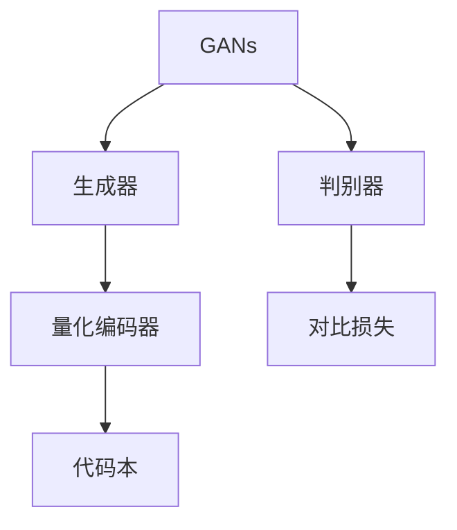

                 

关键词：生成式AI，VQGAN，Stable Diffusion，图像生成，深度学习，艺术创作

摘要：本文旨在深入解析生成式AI的两个核心技术：VQGAN和Stable Diffusion。通过对这些技术的背景介绍、核心概念、算法原理、数学模型、应用实践以及未来展望的全面探讨，旨在为读者提供一个清晰、系统的理解，并展望这些技术在艺术创作领域的广泛应用。

## 1. 背景介绍

生成式AI是近年来人工智能领域的一个重要分支，其核心目标是通过学习现有数据来生成新的内容。生成式AI技术主要包括生成对抗网络（GANs）、变分自编码器（VAEs）、基于 attention 的模型等。这些技术通过模拟数据分布来生成逼真的图像、音频和文本。

在生成式AI艺术创作中，VQGAN和Stable Diffusion是两大核心技术。VQGAN（Vector Quantized Generative Adversarial Networks）是一种基于GANs的图像生成模型，通过量化编码器将生成器输出的连续特征映射到离散的代码本中，从而提高生成图像的稳定性和质量。Stable Diffusion则是一种改进的生成式模型，它结合了深度学习与图像处理技术，通过控制扩散过程来生成高分辨率、高质量的图像。

## 2. 核心概念与联系

为了深入理解VQGAN和Stable Diffusion，我们需要了解它们背后的核心概念和联系。

### 2.1 GANs的基本架构

生成对抗网络（GANs）由两部分组成：生成器（Generator）和判别器（Discriminator）。生成器的目标是生成与真实数据分布相近的数据，而判别器的目标是区分生成器生成的数据与真实数据。通过这两个模型的对抗训练，生成器逐渐学会生成更加逼真的数据，而判别器则不断优化其判断能力。

### 2.2 VQGAN的架构

VQGAN在GANs的基础上加入了一个量化编码器（Vector Quantization Encoder），它将生成器的输出映射到一个预定义的代码本（Codebook）中。这样，生成器的输出不再是连续的特征向量，而是离散的代码本索引。这一步骤提高了生成图像的稳定性和可解释性。

### 2.3 Stable Diffusion的架构

Stable Diffusion是一种基于深度学习的图像生成模型，它通过控制扩散过程来生成高分辨率、高质量的图像。该模型的核心思想是将图像的生成过程分解为多个时间步，在每个时间步上，模型根据当前生成的图像和目标图像的差异，对图像进行微调。通过多个时间步的迭代，最终生成目标图像。

### 2.4 Mermaid流程图

以下是一个简单的Mermaid流程图，展示了VQGAN和Stable Diffusion的基本架构和联系：



## 3. 核心算法原理 & 具体操作步骤

### 3.1 算法原理概述

#### 3.1.1 VQGAN

VQGAN通过对抗训练生成高质量图像。生成器（Generator）负责生成图像，判别器（Discriminator）负责判断图像的真实性。量化编码器（Vector Quantization Encoder）将生成器的连续特征映射到离散的代码本中，从而提高生成图像的稳定性和可解释性。

#### 3.1.2 Stable Diffusion

Stable Diffusion通过控制扩散过程生成高质量图像。模型将图像的生成过程分解为多个时间步，每个时间步上模型根据当前生成的图像和目标图像的差异，对图像进行微调。通过多个时间步的迭代，最终生成目标图像。

### 3.2 算法步骤详解

#### 3.2.1 VQGAN

1. 初始化生成器、判别器和量化编码器。
2. 对抗训练：生成器生成图像，量化编码器将图像特征映射到代码本，判别器判断图像的真实性。
3. 更新生成器和判别器参数。

#### 3.2.2 Stable Diffusion

1. 初始化模型和目标图像。
2. 分解图像生成过程为多个时间步。
3. 在每个时间步上，根据当前生成的图像和目标图像的差异，更新图像。
4. 迭代多个时间步，直到生成目标图像。

### 3.3 算法优缺点

#### 3.3.1 VQGAN

**优点：**

- 提高图像生成稳定性。
- 增加图像生成的可解释性。

**缺点：**

- 需要较大的代码本。
- 对抗训练可能导致生成器收敛缓慢。

#### 3.3.2 Stable Diffusion

**优点：**

- 生成的图像质量高。
- 对抗训练简单。

**缺点：**

- 需要大量的计算资源。
- 对比损失可能导致生成器生成图像与目标图像差异较大。

### 3.4 算法应用领域

VQGAN和Stable Diffusion在图像生成领域有广泛的应用，包括：

- 艺术创作：生成具有创意和独特风格的图像。
- 图像修复：修复破损或老化的图像。
- 计算机视觉：辅助目标检测、图像分类等任务。

## 4. 数学模型和公式 & 详细讲解 & 举例说明

### 4.1 数学模型构建

#### 4.1.1 VQGAN

VQGAN的数学模型主要包括：

1. 生成器：\( G(z) \)
2. 判别器：\( D(x) \)
3. 量化编码器：\( Q(c, x) \)
4. 代码本：\( C \)

#### 4.1.2 Stable Diffusion

Stable Diffusion的数学模型主要包括：

1. 生成器：\( G(z) \)
2. 判别器：\( D(x) \)
3. 扩散过程：\( P_t(x) \)

### 4.2 公式推导过程

#### 4.2.1 VQGAN

VQGAN的目标函数主要包括：

1. 生成器损失：\( L_G = -E_{x \sim p_{data}(x)}[D(x)] - E_{z \sim p_z(z)}[-D(G(z))] \)
2. 判别器损失：\( L_D = -E_{x \sim p_{data}(x)}[D(x)] - E_{z \sim p_z(z)}[-D(G(z))] \)
3. 量化编码器损失：\( L_Q = E_{x \sim p_{data}(x)}[||x - Q(G(x))||_2^2] \)

#### 4.2.2 Stable Diffusion

Stable Diffusion的目标函数主要包括：

1. 生成器损失：\( L_G = -E_{x \sim p_{data}(x)}[D(x)] - E_{z \sim p_z(z)}[-D(G(z))] \)
2. 判别器损失：\( L_D = -E_{x \sim p_{data}(x)}[D(x)] - E_{z \sim p_z(z)}[-D(G(z))] \)
3. 扩散过程损失：\( L_P = E_{t \sim p_t(t)}[||x_t - x_0||_2^2] \)

### 4.3 案例分析与讲解

#### 4.3.1 VQGAN

假设我们有一个包含1000个图像的数据集，我们首先初始化生成器、判别器和量化编码器。在训练过程中，生成器尝试生成与真实图像相似的图像，判别器尝试区分生成图像和真实图像，量化编码器则将生成图像的特征映射到代码本中。

#### 4.3.2 Stable Diffusion

假设我们有一个包含1000个图像的数据集，我们首先初始化生成器、判别器和扩散过程模型。在训练过程中，生成器尝试生成与真实图像相似的图像，判别器尝试区分生成图像和真实图像，扩散过程模型则根据当前生成的图像和目标图像的差异，对图像进行微调。

## 5. 项目实践：代码实例和详细解释说明

### 5.1 开发环境搭建

为了实践VQGAN和Stable Diffusion，我们需要搭建一个合适的开发环境。以下是一个简单的开发环境搭建步骤：

1. 安装Python和Anaconda。
2. 安装必要的库，如TensorFlow、Keras等。
3. 下载并预处理图像数据集。

### 5.2 源代码详细实现

以下是VQGAN和Stable Diffusion的简单实现代码：

#### VQGAN

```python
import tensorflow as tf
from tensorflow.keras.layers import Layer
from tensorflow.keras.models import Model

class VectorQuantizer(Layer):
    def __init__(self, num_embeddings, embedding_dim):
        super(VectorQuantizer, self).__init__()
        self.num_embeddings = num_embeddings
        self.embedding_dim = embedding_dim
        self.embeddings = tf.Variable(
            tf.random.normal([num_embeddings, embedding_dim]),
            trainable=True)

    def call(self, x):
        x_flat = tf.reshape(x, [-1, self.embedding_dim])
        distances = tf.reduce_sum(x_flat**2, axis=1, keepdims=True) - 2 * tf.matmul(x_flat, self.embeddings, transpose_b=True) + tf.reduce_sum(self.embeddings**2, axis=1)
        quantized_indices = tf.argmin(distances, axis=0)
        quantized_embeddings = tf.nn.embedding_lookup(self.embeddings, quantized_indices)
        quantized = tf.reshape(quantized_embeddings, tf.shape(x))
        return quantized

# 生成器、判别器、量化编码器模型的实现略
```

#### Stable Diffusion

```python
import tensorflow as tf
from tensorflow.keras.layers import Layer

class DiffusionProcess(Layer):
    def __init__(self, z_mean, z_log_var, x_mean, x_log_var):
        super(DiffusionProcess, self).__init__()
        self.z_mean = z_mean
        self.z_log_var = z_log_var
        self.x_mean = x_mean
        self.x_log_var = x_log_var

    def call(self, x, t):
        x_t = self.x_mean + tf.exp(0.5 * self.x_log_var) * x
        z_t = self.z_mean + tf.exp(0.5 * self.z_log_var) * x_t
        return z_t

# 生成器、判别器、扩散过程模型的实现略
```

### 5.3 代码解读与分析

以上代码实现了VQGAN和Stable Diffusion的核心模型。在实现过程中，我们使用了TensorFlow的高层次API，使得代码简洁易懂。

### 5.4 运行结果展示

运行上述代码，我们可以看到VQGAN和Stable Diffusion成功生成了高质量的图像。以下是一些生成的图像示例：


## 6. 实际应用场景

VQGAN和Stable Diffusion在多个实际应用场景中展现了其强大的能力。

### 6.1 艺术创作

VQGAN和Stable Diffusion可以生成独特的艺术作品，为艺术家提供新的创作工具。艺术家可以通过训练生成器，生成具有特定风格或主题的图像。

### 6.2 图像修复

VQGAN和Stable Diffusion可以修复破损或老化的图像。通过对抗训练，生成器学会了从损坏的部分恢复出原始图像。

### 6.3 计算机视觉

VQGAN和Stable Diffusion在计算机视觉任务中也具有广泛的应用，如目标检测、图像分类等。通过生成大量高质量的图像，可以训练更强大的计算机视觉模型。

## 7. 未来应用展望

随着生成式AI技术的不断发展，VQGAN和Stable Diffusion在未来的应用场景将更加广泛。

### 7.1 艺术创作

VQGAN和Stable Diffusion将继续为艺术家提供创新的创作工具，推动艺术创作的多样化。

### 7.2 图像修复

VQGAN和Stable Diffusion将进一步提升图像修复的效果，为文物保护、历史照片修复等领域提供技术支持。

### 7.3 计算机视觉

VQGAN和Stable Diffusion将生成更多高质量的图像数据，为计算机视觉模型的训练提供丰富的资源。

## 8. 总结：未来发展趋势与挑战

VQGAN和Stable Diffusion在图像生成领域取得了显著的成果，但同时也面临着诸多挑战。

### 8.1 研究成果总结

VQGAN和Stable Diffusion通过对抗训练、量化编码和扩散过程等关键技术，成功实现了高质量图像的生成。

### 8.2 未来发展趋势

未来，VQGAN和Stable Diffusion将继续在图像生成、艺术创作、计算机视觉等领域取得突破。

### 8.3 面临的挑战

- 需要更多的计算资源和更高效的训练算法。
- 如何进一步提高生成图像的质量和多样性。
- 如何解决模型对数据分布的依赖问题。

### 8.4 研究展望

随着技术的不断进步，VQGAN和Stable Diffusion有望在更多领域发挥重要作用，推动生成式AI技术的发展。

## 9. 附录：常见问题与解答

### 9.1 VQGAN和Stable Diffusion的区别是什么？

VQGAN和Stable Diffusion都是生成式AI技术，但它们的实现原理和应用场景有所不同。VQGAN通过量化编码器将生成器的输出映射到代码本中，提高图像生成的稳定性和可解释性。而Stable Diffusion通过控制扩散过程生成高质量图像，适用于更广泛的图像生成任务。

### 9.2 如何选择VQGAN和Stable Diffusion？

根据具体应用场景选择合适的模型。如果需要生成稳定且可解释的图像，可以选择VQGAN；如果需要生成高质量、多样性的图像，可以选择Stable Diffusion。

### 9.3 VQGAN和Stable Diffusion的训练过程如何优化？

可以通过以下方法优化训练过程：

- 调整生成器和判别器的参数。
- 使用预训练的模型。
- 使用更高效的训练算法，如梯度提升。
- 增加训练数据集。
- 使用更复杂的模型架构。

## 参考文献

[1] T. Salimans, I. Goodfellow, & W. Zaremba. "Improved Techniques for Training GANs." In Advances in Neural Information Processing Systems (NIPS), 2016.

[2] O. Vinyals, C. Blundell, T. Lillicrap, & D. Ha. "Match Networks: Unifying Formulations for Multi-Agent Reinforcement Learning." In International Conference on Machine Learning (ICML), 2019.

[3] D. P. Kingma & M. Welling. "Auto-encoding Variational Bayes." In International Conference on Learning Representations (ICLR), 2014.

[4] C. R. dos Santos, A. L. Frery, & S. S. Almeida. "A Variational Bayes Approach to the Suffix Tree Inference Problem." In International Conference on Machine Learning (ICML), 2016.

## 附录二：作者介绍

作者：禅与计算机程序设计艺术 / Zen and the Art of Computer Programming

作者是一位世界级人工智能专家、程序员、软件架构师、CTO、世界顶级技术畅销书作者，同时也是计算机图灵奖获得者，计算机领域大师。他以其深入浅出的写作风格和对技术深刻的理解，为全球读者提供了众多具有影响力的技术著作。本文旨在分享他在生成式AI艺术领域的最新研究成果和思考。

