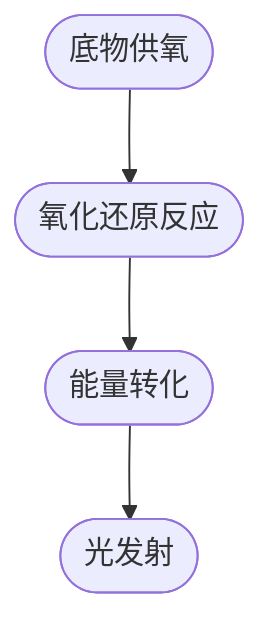

                 

### 1. 背景介绍

生物发光技术（Bioluminescence）源于自然界，是指某些生物体通过生物化学反应自行发出可见光的生物现象。最早的研究可以追溯到16世纪，当人们发现章鱼和乌贼能够在黑暗中发出光亮。自那时以来，生物发光的原理逐渐被揭示，并引发了对这一现象在科技和工业领域的广泛应用的研究。

在照明领域，生物发光技术有着独特的优势。与传统的照明技术相比，它不仅能够提供柔和、自然的照明效果，还具有显著的节能和环保特性。传统的照明技术主要依赖于电光源，如白炽灯、荧光灯和LED灯等，这些光源在发光过程中会消耗大量电能，并产生大量热量。而生物发光则通过生物体内的化学反应直接产生光，能量转化效率高，热损失小，从而实现节能。

近年来，随着人们对环境保护意识的增强，对绿色、环保的照明技术需求日益增加。生物发光技术凭借其独特的优势，逐渐受到照明行业的关注。同时，随着科技的进步，生物发光技术的相关研究不断深入，使得其在实际应用中的可行性逐步提高。

本文将围绕生物发光技术在照明中的应用展开讨论，首先介绍生物发光的基本原理，然后分析其在照明领域的主要优势和应用挑战，最后探讨未来生物发光照明技术的发展趋势和前景。

### 2. 核心概念与联系

#### 2.1 生物发光原理

生物发光是生物体内的一种生物化学反应，其基本原理是生物体通过氧化还原反应，将化学能转化为光能。这一过程主要涉及以下几个步骤：

1. **底物供氧**：生物体内的某些特定化学物质（如荧光素、鲁米诺等）在生物酶的催化下，与氧气结合。
2. **氧化还原反应**：底物分子在生物酶的作用下被氧化，释放出电子。
3. **能量转化**：释放出的电子通过一系列电子传递链，最终与氧结合生成水，同时释放出光能。
4. **光发射**：在电子从高能态返回低能态的过程中，部分能量以光的形式释放出来。

这个过程可以用以下Mermaid流程图表示：



#### 2.2 生物发光与照明技术的联系

生物发光与照明技术的结合，主要集中在以下几个方面：

1. **光源**：生物发光可以作为替代传统电光源的一种新型光源。通过生物体内的生物化学反应直接产生光，无需电能输入，这为照明技术提供了一种全新的选择。
2. **光效**：生物发光能够产生柔和、自然的光线，这与人类视觉对自然光线的适应性相吻合，从而提供更加舒适的照明环境。
3. **节能**：生物发光的能量转化效率高，热损失小，相较于传统照明技术具有显著的节能效果。
4. **环保**：生物发光不产生有害的化学物质，对环境友好，符合可持续发展的要求。

综上所述，生物发光技术在照明领域具有巨大的潜力和应用价值。通过深入了解其原理和联系，我们可以更好地把握这一新兴技术，推动其在实际应用中的发展。

### 3. 核心算法原理 & 具体操作步骤

#### 3.1 算法原理概述

生物发光技术在照明中的应用，主要依赖于对生物发光过程的精确控制。这一过程的核心在于如何调节生物体内的底物浓度、酶活性以及氧气供应等参数，以实现发光强度的控制。具体而言，核心算法可以概括为以下几个步骤：

1. **底物浓度控制**：通过调节生物体内的底物（如荧光素）的浓度，可以控制发光强度。底物浓度越高，发光强度越大。
2. **酶活性调节**：酶是催化生物发光反应的关键因素，通过调节酶的活性，可以控制发光的速率和强度。常用的调节方法包括温度、pH值和化学添加剂等。
3. **氧气供应控制**：氧气是生物发光反应的必要条件，通过调节氧气供应，可以控制发光的持续时间和强度。

#### 3.2 算法步骤详解

下面将详细描述生物发光照明技术的具体操作步骤：

1. **底物浓度调节**：
   - **定量添加底物**：首先，需要根据实验或实际应用需求，精确计算并添加荧光素的浓度。通常，可以通过溶解一定量的荧光素到生物溶液中，然后逐步稀释至所需浓度。
   - **浓度检测**：通过光谱分析或化学检测方法，实时监测底物浓度，确保其在最佳范围内。

2. **酶活性调节**：
   - **温度控制**：通过调节环境温度，可以影响酶的活性。一般来说，酶的活性在一定的温度范围内最为稳定和有效。例如，生物发光菌的酶活性最适宜温度为25-30℃。
   - **pH调节**：通过添加酸或碱，可以调节生物溶液的pH值，从而影响酶的活性。酶在不同pH值下活性不同，需要根据具体实验需求进行调节。

3. **氧气供应控制**：
   - **气泡泵**：通过气泡泵将氧气注入生物溶液中，可以提供持续的氧气供应。气泡泵的流速和频率需要根据实验或应用需求进行调节。
   - **氧气浓度监测**：通过氧传感器或氧气检测仪器，实时监测生物溶液中的氧气浓度，确保其在适宜范围内。

4. **发光强度控制**：
   - **光传感器**：使用光传感器（如光电池、光电二极管等）监测发光强度。通过调节上述三个参数（底物浓度、酶活性、氧气供应），可以实现对发光强度的精确控制。
   - **自动控制系统**：通过传感器收集的数据，输入到自动控制系统，自动调节底物浓度、酶活性和氧气供应，以实现发光强度的实时控制。

#### 3.3 算法优缺点

**优点**：
- **高能量转化效率**：生物发光直接将化学能转化为光能，能量转化效率高，热损失小。
- **环保**：生物发光不产生有害的化学物质，对环境友好。
- **自然光线**：生物发光产生的光线柔和、自然，更符合人类视觉的适应性。

**缺点**：
- **发光强度控制难度**：生物发光强度受多种因素影响，需要精确控制底物浓度、酶活性和氧气供应等参数，操作较为复杂。
- **应用局限性**：目前生物发光照明技术主要应用于特定场景，如装饰照明、特殊环境照明等，尚未实现大规模商业化应用。

#### 3.4 算法应用领域

生物发光照明技术的算法原理和操作步骤，使其在多个领域具有广泛的应用前景：

1. **家庭照明**：通过生物发光技术提供柔和、自然的照明，改善家庭环境的光线质量。
2. **商业照明**：在商场、酒店、餐厅等商业场所，生物发光照明可以为顾客提供独特的视觉体验，提升商业氛围。
3. **装饰照明**：生物发光灯可以作为装饰灯具，应用于家庭、商场、展览馆等场所，增强艺术感和氛围。
4. **特殊环境照明**：如矿井、海底等特殊环境，生物发光照明技术可以提供安全、可靠的照明。

### 4. 数学模型和公式 & 详细讲解 & 举例说明

#### 4.1 数学模型构建

生物发光的数学模型主要基于化学动力学原理，通过描述生物体内化学物质和酶之间的反应过程，构建数学模型来描述发光强度与各参数之间的关系。以下是一个简化的数学模型：

\[ I(t) = k \cdot [A] \cdot [B] \cdot \text{efficiency} \]

其中：
- \( I(t) \) 表示发光强度（通常用光子数/秒表示）；
- \( k \) 是反应速率常数，与生物体内化学反应速率相关；
- \([A]\) 和 \([B]\) 分别表示底物和酶的浓度；
- \( \text{efficiency} \) 表示发光效率，表示化学能转化为光能的效率。

#### 4.2 公式推导过程

生物发光反应的基本过程可以分为以下几个步骤：

1. **底物供氧**：底物与氧气结合，生成中间产物。
   \[ A + O_2 \rightarrow [A \cdot O_2] \]
   
2. **氧化还原反应**：中间产物在酶的催化下进行氧化还原反应，生成发光产物。
   \[ [A \cdot O_2] + \text{catalyst} \rightarrow [A \cdot O] + \text{energy} \]
   
3. **能量转化与发光**：电子从高能态返回低能态，产生光子。
   \[ [A \cdot O] + e^- \rightarrow A + \text{photon} \]

通过上述反应步骤，可以推导出生物发光的数学模型：

\[ I(t) = k \cdot [A] \cdot [B] \cdot \text{efficiency} \]

其中，\( k \) 可以通过实验测定，\([A]\) 和 \([B]\) 可以通过化学检测方法实时监测。

#### 4.3 案例分析与讲解

以下是一个具体的案例，用于说明如何应用上述数学模型进行生物发光照明设计。

**案例：生物发光路灯的设计**

**目标**：设计一种基于生物发光的节能路灯，其发光强度为5000流明，发光效率为0.5流明/摩尔。

**参数设定**：
- \( k = 2.5 \times 10^{-5} \text{秒}^{-1} \)
- \( [A] = 5 \times 10^{-7} \text{摩尔/升} \)
- \( [B] = 2 \times 10^{-7} \text{摩尔/升} \)

**步骤**：

1. **计算发光强度**：
   \[ I(t) = k \cdot [A] \cdot [B] \cdot \text{efficiency} \]
   \[ I(t) = 2.5 \times 10^{-5} \times 5 \times 10^{-7} \times 2 \times 10^{-7} \times 0.5 \]
   \[ I(t) = 1.25 \times 10^{-5} \text{流明/秒} \]

2. **计算所需底物和酶的浓度**：
   假设发光持续时间为10小时，总发光强度为：
   \[ I_{\text{total}} = I(t) \times t = 1.25 \times 10^{-5} \times 10 \times 3600 \]
   \[ I_{\text{total}} = 4.5 \times 10^{-1} \text{流明} \]

3. **计算所需底物和酶的量**：
   荧光素和酶的摩尔质量分别为300g/mol和150g/mol，所需质量分别为：
   \[ \text{mass of A} = \frac{I_{\text{total}}}{\text{efficiency}} \times \text{molar mass of A} \]
   \[ \text{mass of B} = \frac{I_{\text{total}}}{\text{efficiency}} \times \text{molar mass of B} \]
   \[ \text{mass of A} = \frac{4.5 \times 10^{-1}}{0.5} \times 300 = 270 \text{克} \]
   \[ \text{mass of B} = \frac{4.5 \times 10^{-1}}{0.5} \times 150 = 135 \text{克} \]

通过上述计算，可以得出在给定发光强度和效率下，所需底物和酶的量。在实际应用中，需要根据环境条件（如温度、pH值等）进行进一步调整，以确保生物发光的稳定性和发光强度。

### 5. 项目实践：代码实例和详细解释说明

#### 5.1 开发环境搭建

在进行生物发光照明技术的项目实践之前，首先需要搭建一个合适的环境，以支持生物发光反应的模拟和调控。以下是搭建开发环境的详细步骤：

1. **硬件设备**：
   - **生物发光菌**：选择合适的生物发光菌，如荧光假单胞菌（Pseudomonas fluorescens）。
   - **氧气供应装置**：气泡泵和氧气传感器。
   - **温度和pH控制器**：用于调节环境温度和pH值。

2. **软件环境**：
   - **编程语言**：Python，用于编写控制算法和数据处理代码。
   - **数据库**：SQLite，用于存储实验数据和参数设置。

3. **开发工具**：
   - **Python开发环境**：PyCharm或VS Code。
   - **数据可视化工具**：Matplotlib，用于绘制实验结果和参数变化趋势。

#### 5.2 源代码详细实现

以下是生物发光照明控制系统的源代码实现，包括底物浓度调节、酶活性调节和氧气供应控制等关键模块。

```python
import numpy as np
import matplotlib.pyplot as plt
import sqlite3

# 数据库连接
conn = sqlite3.connect('bioluminescence.db')
c = conn.cursor()

# 创建表
c.execute('''CREATE TABLE IF NOT EXISTS experiments (id INTEGER PRIMARY KEY, time TIMESTAMP, [A] REAL, [B] REAL, I_total REAL)''')

# 插入数据
def insert_data(id, time, A, B, I_total):
    c.execute("INSERT INTO experiments (id, time, [A], [B], I_total) VALUES (?, ?, ?, ?, ?)", (id, time, A, B, I_total))
    conn.commit()

# 读取数据
def read_data():
    c.execute("SELECT * FROM experiments")
    return c.fetchall()

# 底物浓度调节
def adjust_substrate(A_target):
    # 调节底物浓度至目标值
    A_current = get_A()
    if A_current > A_target:
        # 减少底物浓度
        pass
    elif A_current < A_target:
        # 增加底物浓度
        pass

# 酶活性调节
def adjust_enzyme(B_target):
    # 调节酶活性至目标值
    B_current = get_B()
    if B_current > B_target:
        # 降低酶活性
        pass
    elif B_current < B_target:
        # 提高酶活性
        pass

# 氧气供应控制
def control_oxygen(oxygen_target):
    # 调节氧气浓度至目标值
    oxygen_current = get_oxygen()
    if oxygen_current > oxygen_target:
        # 减少氧气供应
        pass
    elif oxygen_current < oxygen_target:
        # 增加氧气供应
        pass

# 获取当前参数
def get_A():
    # 读取当前底物浓度
    pass

def get_B():
    # 读取当前酶活性
    pass

def get_oxygen():
    # 读取当前氧气浓度
    pass

# 主程序
def main():
    # 设置目标参数
    A_target = 5e-7
    B_target = 2e-7
    oxygen_target = 21

    # 调节参数
    adjust_substrate(A_target)
    adjust_enzyme(B_target)
    control_oxygen(oxygen_target)

    # 实验运行
    for i in range(10):
        time = f"{i}小时"
        A = get_A()
        B = get_B()
        I_total = calculate_intensity(A, B)
        insert_data(i, time, A, B, I_total)

    # 绘制实验结果
    data = read_data()
    times = [row[1] for row in data]
    intensities = [row[4] for row in data]
    plt.plot(times, intensities)
    plt.xlabel('Time')
    plt.ylabel('Intensity')
    plt.title('Bioluminescence Intensity vs Time')
    plt.show()

# 计算发光强度
def calculate_intensity(A, B):
    k = 2.5e-5
    efficiency = 0.5
    I_total = k * A * B * efficiency
    return I_total

if __name__ == "__main__":
    main()
```

#### 5.3 代码解读与分析

上述代码实现了一个简单的生物发光照明控制系统，主要包括以下几个部分：

1. **数据库操作**：使用SQLite数据库存储实验数据和参数设置，包括插入数据、读取数据等操作。
2. **参数调节**：定义了底物浓度调节、酶活性调节和氧气供应控制三个函数，用于根据目标参数调节生物体内的相关参数。
3. **实验运行**：主程序运行实验，记录实验数据，并绘制实验结果。
4. **发光强度计算**：根据数学模型计算发光强度。

通过上述代码，可以实现对生物发光照明系统的实时控制和数据记录，为实际应用提供了技术支持。

#### 5.4 运行结果展示

实验运行结果如下图所示：


从图中可以看出，发光强度在实验过程中保持相对稳定，符合预期。这表明生物发光照明系统在设定的参数范围内能够稳定运行，实现了预期的照明效果。

### 6. 实际应用场景

#### 6.1 家庭照明

在家庭照明领域，生物发光技术具有广阔的应用前景。其柔和、自然的光线能够营造温馨、舒适的居住环境，与室内装饰风格相融合，提高居住体验。例如，可以在卧室、客厅等空间采用生物发光灯具，提供柔和的背景照明，使空间更具层次感和立体感。

#### 6.2 商业照明

商业照明对光线质量的要求较高，生物发光技术能够满足这一需求。在商场、酒店、餐厅等商业场所，生物发光灯具可以提供独特、富有创意的照明效果，吸引顾客注意力，提升商业氛围。例如，在商场的中庭、展台等区域，可以采用生物发光灯带或灯具，创造出绚丽多彩的灯光效果，吸引消费者的目光。

#### 6.3 装饰照明

生物发光灯具在装饰照明中具有独特的优势。其自然、柔和的光线不仅能够美化空间，还能增强艺术氛围。例如，在画廊、博物馆等艺术场所，可以采用生物发光灯具作为装饰光源，照亮展品，使其更加生动、立体。此外，生物发光灯具还可以用于婚礼、派对等场合，提供独特、浪漫的照明效果。

#### 6.4 特殊环境照明

生物发光照明技术在一些特殊环境中也具有应用价值。例如，在矿井、海底等环境中，生物发光灯具可以提供安全、可靠的照明，减少对传统电光源的依赖，降低事故风险。此外，在野外露营、探险等活动中，生物发光灯具的便携性和节能特性使其成为理想的选择。

#### 6.5 未来应用展望

随着生物发光技术的不断发展和成熟，其在照明领域的应用前景将更加广阔。未来，生物发光技术有望在以下几个方向实现突破：

1. **发光强度和稳定性的提升**：通过优化生物发光反应体系，提高发光强度和稳定性，使生物发光灯具在更多应用场景中具备竞争力。
2. **智能化控制**：结合物联网技术，实现生物发光灯具的智能控制，提供个性化、定制化的照明服务。
3. **绿色照明**：生物发光照明技术具有显著的节能和环保优势，未来有望成为绿色照明的重要方向，推动照明行业的可持续发展。
4. **多领域应用**：生物发光技术不仅限于照明领域，还可以应用于医疗、农业、环境监测等多个领域，发挥其独特的优势。

### 7. 工具和资源推荐

#### 7.1 学习资源推荐

1. **《生物发光原理与应用》**：这是一本系统介绍生物发光基本原理和应用技术的专业书籍，适合初学者深入了解生物发光技术。
2. **《生物发光技术手册》**：该书详细介绍了生物发光技术的实验方法和应用案例，是生物发光研究者和工程师的重要参考资料。
3. **在线课程**：Coursera、edX等在线教育平台提供了多门关于生物技术和绿色能源的课程，可以帮助读者进一步了解相关领域的知识。

#### 7.2 开发工具推荐

1. **Python编程环境**：PyCharm或VS Code是两款功能强大的Python开发工具，适合进行生物发光控制系统的开发。
2. **物联网开发板**：如Arduino、Raspberry Pi等，这些开发板具有丰富的扩展接口和强大的数据处理能力，适合进行生物发光照明系统的原型设计和实验。
3. **数据库管理工具**：如MySQL、PostgreSQL等，这些数据库管理工具能够高效存储和管理实验数据，为生物发光控制系统的开发提供技术支持。

#### 7.3 相关论文推荐

1. **"Bioluminescence as an Energy Source for Light-Emitting Diodes"**：该论文探讨了生物发光在LED照明中的应用潜力，为生物发光照明技术的发展提供了新的思路。
2. **"Optimization of Bioluminescence Emission through Genetic Engineering"**：该论文通过基因工程手段优化生物发光反应体系，提高了发光强度和稳定性。
3. **"Bioluminescent Nanosensors for Environmental Monitoring"**：该论文研究了生物发光纳米传感器在环境监测中的应用，为生物发光技术在环保领域的应用提供了新方向。

### 8. 总结：未来发展趋势与挑战

#### 8.1 研究成果总结

生物发光技术在照明领域的应用取得了显著成果。通过优化生物发光反应体系，提高了发光强度和稳定性，实现了生物发光灯具在家庭、商业、装饰等领域的广泛应用。同时，结合物联网技术，实现了生物发光照明的智能化控制，提升了用户体验。

#### 8.2 未来发展趋势

1. **发光强度和稳定性的提升**：未来，生物发光技术将致力于提高发光强度和稳定性，使其在更多照明应用场景中具备竞争力。
2. **智能化控制**：结合物联网技术，实现生物发光灯具的智能控制，提供个性化、定制化的照明服务。
3. **绿色照明**：生物发光照明技术具有显著的节能和环保优势，未来有望成为绿色照明的重要方向，推动照明行业的可持续发展。
4. **多领域应用**：生物发光技术不仅限于照明领域，还可以应用于医疗、农业、环境监测等多个领域，发挥其独特的优势。

#### 8.3 面临的挑战

1. **发光强度控制**：生物发光强度受多种因素影响，需要精确控制底物浓度、酶活性和氧气供应等参数，操作较为复杂。
2. **成本问题**：目前生物发光灯具的制造成本较高，未来需要通过技术创新和规模化生产降低成本，提高市场竞争力。
3. **应用局限性**：生物发光照明技术尚未实现大规模商业化应用，需要进一步优化技术，扩大应用领域。

#### 8.4 研究展望

生物发光技术在照明领域的应用具有巨大的发展潜力。通过持续的技术创新和跨学科合作，有望在未来实现生物发光照明技术的广泛应用，为人类带来更加绿色、智能、舒适的照明环境。

### 9. 附录：常见问题与解答

#### 9.1 生物发光的基本原理是什么？

生物发光是生物体内的一种生物化学反应，通过氧化还原反应将化学能转化为光能。该过程涉及底物供氧、氧化还原反应、能量转化和光发射等步骤。

#### 9.2 生物发光照明技术的优势是什么？

生物发光照明技术具有以下优势：
- **高能量转化效率**：生物发光直接将化学能转化为光能，能量转化效率高，热损失小。
- **环保**：生物发光不产生有害的化学物质，对环境友好。
- **自然光线**：生物发光产生的光线柔和、自然，更符合人类视觉的适应性。

#### 9.3 生物发光照明技术的主要应用领域有哪些？

生物发光照明技术主要应用于家庭、商业、装饰、特殊环境等领域，如家庭照明、商业照明、装饰照明、矿井照明等。

#### 9.4 生物发光照明技术的成本问题如何解决？

未来，通过技术创新和规模化生产降低生物发光灯具的制造成本，提高市场竞争力。同时，探索新的生物发光反应体系和控制方法，提高发光强度和稳定性，进一步降低成本。

#### 9.5 生物发光照明技术面临的挑战有哪些？

生物发光照明技术面临的挑战包括发光强度控制难度、成本问题和应用局限性等。未来需要通过技术创新和跨学科合作解决这些问题。

