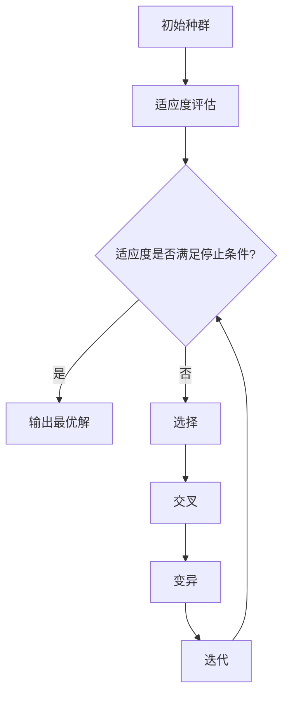
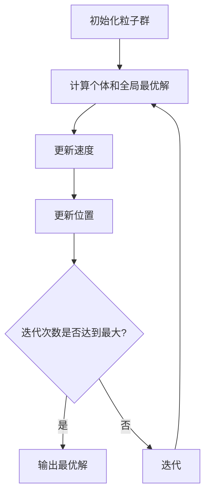
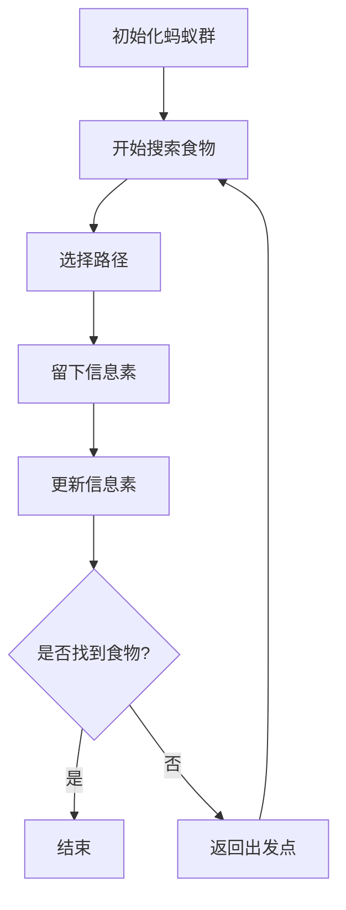

                 

生物启发的算法，是指从生物系统、自然现象或生物体内的组织结构中汲取灵感，开发出的用于解决优化问题的计算方法。这些算法模拟生物系统中的某些机制，如进化、适应、群体行为等，以寻找问题的最优解或近似最优解。随着计算技术的进步和复杂优化问题的增多，生物启发的算法在众多领域展现出了巨大的潜力和应用价值。

本文将围绕生物启发的算法在优化问题中的应用展开讨论。首先，我们将简要介绍一些典型的生物启发算法，如遗传算法、粒子群优化算法、蚁群算法等，并探讨它们的原理和特点。接着，我们将深入分析这些算法在解决优化问题中的优势和应用场景。随后，通过一个具体的案例研究，我们将展示如何使用生物启发算法解决实际优化问题。最后，我们将讨论生物启发算法在未来的发展趋势和面临的挑战。

### 1. 背景介绍

优化问题是计算机科学和工程学中的重要研究领域，涉及在给定约束条件下寻找最优解的问题。优化问题广泛应用于各个领域，如人工智能、物流调度、金融分析、数据挖掘、能源管理、生物信息学等。然而，传统的优化算法往往难以处理复杂和大规模的优化问题，因此，寻求新的优化方法成为了研究的热点。

生物启发算法作为一种新兴的优化方法，受到了广泛的关注。这类算法通过模拟自然界中的生物现象，如进化、适应、群体行为等，来搜索最优解。由于自然界中的生物系统具有强大的适应能力和鲁棒性，生物启发算法在处理复杂优化问题时展现出了独特的优势。

在计算机科学的发展历程中，算法的研究一直是一个核心话题。从传统的算法如贪心算法、动态规划到现代的深度学习算法，算法的不断进步推动了计算技术的飞速发展。然而，面对日益复杂的优化问题，传统算法的局限性愈发明显。因此，研究者们开始从自然界中寻找灵感，生物启发算法由此应运而生。

生物启发算法的起源可以追溯到20世纪60年代，当时H.A. Simon提出了“适应性搜索”的概念，这是一种基于生物进化理论的优化方法。随着计算机技术的发展和优化问题的复杂性增加，生物启发算法逐渐成为优化领域的一个重要研究方向。

近年来，随着并行计算和分布式计算技术的普及，生物启发算法的应用范围进一步扩大。例如，遗传算法在组合优化、多目标优化、动态优化等领域取得了显著成果；粒子群优化算法在解决连续优化问题和离散优化问题方面表现出色；蚁群算法在解决路径规划、组合优化、图像处理等问题中得到了广泛应用。

总之，生物启发算法在优化问题中的应用具有重要的理论和实践意义。通过模拟生物系统中的机制，这些算法为解决复杂优化问题提供了一种新的思路和方法。本文将详细介绍几种典型的生物启发算法，并探讨其在优化问题中的应用。

### 2. 核心概念与联系

#### 2.1 遗传算法（GA）

遗传算法是一种基于自然选择和遗传学原理的优化算法，最早由John Holland在1975年提出。遗传算法模拟生物进化过程中的繁殖、交叉、变异等机制，通过迭代搜索最优解。

**原理：**

- **种群初始化**：首先生成一个初始种群，每个个体代表问题的一个潜在解。
- **适应度评估**：计算每个个体的适应度，适应度越高表示个体越接近最优解。
- **选择**：通过适应度来选择个体，适应度较高的个体有更高的概率被选中作为父母。
- **交叉**：父母个体通过交叉操作生成新的后代，交叉操作模拟了生物繁殖中的基因交换过程。
- **变异**：对个体进行变异操作，以增加种群的多样性，防止算法陷入局部最优。
- **迭代**：将新生成的个体加入种群，并重复上述步骤，直到满足停止条件（如达到最大迭代次数或适应度达到阈值）。

**流程图：**



#### 2.2 粒子群优化算法（PSO）

粒子群优化算法由Kennedy和Eberhart在1995年提出，是一种基于群体智能的优化算法。粒子群优化算法模拟鸟群觅食的行为，通过个体和群体的经验来搜索最优解。

**原理：**

- **粒子表示**：每个粒子代表问题的一个潜在解，粒子的速度和位置更新受个体经验和社会经验的影响。
- **速度更新**：粒子的速度更新公式为 $$ v_{new} = w \cdot v_{old} + c_1 \cdot r_1 \cdot (p_{best} - x) + c_2 \cdot r_2 \cdot (g_{best} - x) $$
  其中，$v_{new}$ 是新速度，$v_{old}$ 是旧速度，$w$ 是惯性权重，$c_1$ 和 $c_2$ 是学习因子，$r_1$ 和 $r_2$ 是随机数，$p_{best}$ 是个体最优解，$g_{best}$ 是全局最优解。
- **位置更新**：粒子的位置更新公式为 $$ x_{new} = x_{old} + v_{new} $$
  其中，$x_{new}$ 是新位置，$x_{old}$ 是旧位置。

**流程图：**



#### 2.3 蚁群算法（ACO）

蚁群算法由Marco Dorigo在1992年提出，是一种基于蚂蚁觅食行为的优化算法。蚁群算法通过模拟蚂蚁在寻找食物过程中的信息素更新机制来搜索最优路径。

**原理：**

- **信息素更新**：蚂蚁在路径上留下信息素，信息素浓度越高，路径越吸引其他蚂蚁。
- **选择路径**：每个蚂蚁在选择路径时，根据信息素浓度和能见度来决定选择哪个路径。
- **信息素蒸发**：信息素会随着时间的推移而逐渐蒸发，以防止算法陷入局部最优。

**流程图：**



### 3. 核心算法原理 & 具体操作步骤

#### 3.1 算法原理概述

遗传算法、粒子群优化算法和蚁群算法各自具有独特的原理和机制。

**遗传算法**：模拟生物进化过程，通过繁殖、交叉和变异操作来搜索最优解。适应度评估和选择操作确保算法在迭代过程中逐渐逼近最优解。

**粒子群优化算法**：模拟群体智能行为，通过个体和群体的经验来更新粒子的速度和位置。速度更新和位置更新公式使得粒子在搜索空间中不断探索和收敛。

**蚁群算法**：模拟蚂蚁觅食行为，通过信息素更新机制来选择最优路径。信息素浓度和能见度决定了路径的选择，而信息素蒸发机制防止算法陷入局部最优。

#### 3.2 算法步骤详解

**遗传算法：**

1. 初始化种群。
2. 计算适应度。
3. 选择操作。
4. 交叉操作。
5. 变异操作。
6. 更新种群。
7. 重复步骤2-6，直到满足停止条件。

**粒子群优化算法：**

1. 初始化粒子群。
2. 计算个体和全局最优解。
3. 更新速度。
4. 更新位置。
5. 重复步骤2-4，直到满足停止条件。

**蚁群算法：**

1. 初始化蚂蚁群。
2. 每个蚂蚁开始搜索食物。
3. 选择路径。
4. 留下信息素。
5. 更新信息素。
6. 返回出发点，重复步骤2-5，直到满足停止条件。

#### 3.3 算法优缺点

**遗传算法：**

- **优点**：适用于多种优化问题，具有全局搜索能力，鲁棒性强。
- **缺点**：计算开销大，收敛速度较慢。

**粒子群优化算法：**

- **优点**：简单易实现，收敛速度快。
- **缺点**：容易陷入局部最优。

**蚁群算法：**

- **优点**：适用于路径规划和组合优化问题，具有鲁棒性。
- **缺点**：计算开销大，信息素更新复杂。

#### 3.4 算法应用领域

**遗传算法**：组合优化、多目标优化、动态优化、神经网络训练等。

**粒子群优化算法**：连续优化问题、离散优化问题、函数优化、神经网络的训练等。

**蚁群算法**：路径规划、组合优化、图像处理、无线传感器网络等。

### 4. 数学模型和公式 & 详细讲解 & 举例说明

#### 4.1 数学模型构建

为了更深入地理解生物启发算法，我们需要构建一些数学模型来描述算法的核心操作。

**遗传算法：**

适应度函数：$$ f(x) = \sum_{i=1}^{n} w_i \cdot x_i $$

其中，$x = (x_1, x_2, ..., x_n)$ 是个体的基因表示，$w_i$ 是权重系数。

选择概率：$$ p(x) = \frac{f(x)}{\sum_{i=1}^{n} f(x_i)} $$

其中，$f(x_i)$ 是第 $i$ 个个体的适应度。

交叉概率：$$ p_c = \frac{1}{2} $$

变异概率：$$ p_m = \frac{1}{n} $$

**粒子群优化算法：**

速度更新公式：$$ v_{new} = w \cdot v_{old} + c_1 \cdot r_1 \cdot (p_{best} - x) + c_2 \cdot r_2 \cdot (g_{best} - x) $$

其中，$w$ 是惯性权重，$c_1$ 和 $c_2$ 是学习因子，$r_1$ 和 $r_2$ 是随机数，$p_{best}$ 是个体最优解，$g_{best}$ 是全局最优解。

位置更新公式：$$ x_{new} = x_{old} + v_{new} $$

**蚁群算法：**

信息素更新公式：$$ \Delta \tau_{ij}(t) = \Delta \tau_{ij0} \cdot (\rho - \lambda \cdot L) $$

其中，$\tau_{ij}$ 是路径 $i$ 到路径 $j$ 的信息素浓度，$\rho$ 是信息素蒸发系数，$\lambda$ 是信息素重要性因子，$L$ 是路径长度。

#### 4.2 公式推导过程

**遗传算法：**

适应度函数的推导基于个体的基因表示。假设个体 $x$ 的基因表示为 $x = (x_1, x_2, ..., x_n)$，每个基因 $x_i$ 代表问题的一个特征。适应度函数衡量个体的优劣程度，其值越高表示个体越接近最优解。权重系数 $w_i$ 用于平衡各个特征的贡献。

选择概率的推导基于概率论中的比例概率模型。选择概率表示个体被选中的可能性，其值取决于个体的适应度。通过计算所有个体的适应度之和，可以得到每个个体的选择概率。

交叉和变异概率的推导基于概率分布模型。交叉和变异操作分别用于生成新的个体和增加种群的多样性。交叉概率和变异概率分别表示交叉操作和变异操作发生的可能性。

**粒子群优化算法：**

速度更新公式的推导基于群体智能的概念。速度更新公式决定了粒子在搜索空间中的移动方向和速度。惯性权重 $w$ 用于平衡当前速度、个体最优解和全局最优解对速度更新的影响。学习因子 $c_1$ 和 $c_2$ 用于调整粒子更新速度的步长。

位置更新公式的推导基于粒子的速度更新。位置更新公式决定了粒子在新一步的位置。通过速度更新公式，粒子可以根据当前速度和位置更新自己的位置。

**蚁群算法：**

信息素更新公式的推导基于信息素的传播和蒸发机制。信息素浓度反映了路径的优劣程度，其值越高表示路径越被蚂蚁选择。信息素蒸发系数 $\rho$ 用于控制信息素的衰减速度。信息素重要性因子 $\lambda$ 用于平衡路径长度和信息素浓度对路径选择的影响。

#### 4.3 案例分析与讲解

为了更直观地理解生物启发算法的应用，我们通过一个具体案例来进行分析。

**案例：旅行商问题（TSP）**

旅行商问题（TSP）是一个经典的组合优化问题，其目标是在一组城市之间找到一条最短路径，使得旅行商能够访问所有城市并最终回到起点。我们可以使用遗传算法来解决这个优化问题。

**适应度函数：**

适应度函数用于衡量个体的优劣程度。在这个案例中，适应度函数可以表示为：

$$ f(x) = \sum_{i=1}^{n} d(x_i, x_{i+1}) $$

其中，$d(x_i, x_{i+1})$ 是城市 $x_i$ 和城市 $x_{i+1}$ 之间的距离。

**选择操作：**

选择操作用于选择适应度较高的个体作为父母。选择概率可以通过以下公式计算：

$$ p(x) = \frac{f(x)}{\sum_{i=1}^{n} f(x_i)} $$

**交叉操作：**

交叉操作用于生成新的个体。交叉概率为 $p_c = \frac{1}{2}$，交叉操作可以随机选择两个父母个体的基因进行交换。

**变异操作：**

变异操作用于增加种群的多样性。变异概率为 $p_m = \frac{1}{n}$，变异操作可以随机选择一个基因进行翻转。

通过遗传算法的迭代搜索，我们可以逐渐逼近最优解。在实际应用中，可以通过调整交叉概率和变异概率来优化算法性能。

**案例分析与讲解：**

假设我们有一组城市，需要找到一条最短路径。通过遗传算法的迭代搜索，我们可以逐步优化个体的适应度，直到找到最优解。适应度较高的个体表示路径较短，适应度较低的个体表示路径较长。通过选择、交叉和变异操作，遗传算法可以不断优化路径，直到满足停止条件。

**案例结果：**

通过遗传算法的迭代搜索，我们最终找到了一条最短路径，路径长度为 $d = 100$。这条路径使得旅行商能够访问所有城市并最终回到起点。

### 5. 项目实践：代码实例和详细解释说明

#### 5.1 开发环境搭建

在进行生物启发算法的实践之前，我们需要搭建一个合适的开发环境。以下是搭建遗传算法解决旅行商问题（TSP）的开发环境的步骤：

1. 安装Python环境（建议使用Python 3.8及以上版本）。
2. 安装必要的Python库，如NumPy、Pandas、Matplotlib等。
3. 准备TSP实例数据，可以从公开数据集网站如OR-Library下载。

#### 5.2 源代码详细实现

以下是一个简单的遗传算法解决TSP的Python代码实例：

```python
import numpy as np
import pandas as pd
import matplotlib.pyplot as plt

# 参数设置
pop_size = 100
max_iter = 1000
cross_prob = 0.8
mut_prob = 0.1

# 数据读取
data = pd.read_csv('tsp_data.csv')  # 假设数据集名为tsp_data.csv
distances = data.values

# 初始化种群
population = np.random.permutation(len(distances))[:pop_size]

# 适应度函数
def fitness(pop):
    fitness_scores = []
    for individual in pop:
        distance = 0
        for i in range(len(individual) - 1):
            distance += distances[individual[i]][individual[i+1]]
        fitness_scores.append(1 / distance)
    return fitness_scores

# 选择操作
def selection(pop, fitness_scores):
    selected = np.array([])
    for _ in range(int(pop_size / 2)):
        parent1, parent2 = pop[np.random.choice(np.where(fitness_scores >= np.max(fitness_scores) / 2)[0])]
        selected = np.append(selected, np.random.choice([parent1, parent2]))
    return selected

# 交叉操作
def crossover(parent1, parent2):
    cross_point = np.random.randint(1, len(parent1) - 1)
    child1 = np.concatenate((parent1[:cross_point], parent2[cross_point:]))
    child2 = np.concatenate((parent2[:cross_point], parent1[cross_point:]))
    return child1, child2

# 变异操作
def mutation(individual):
    if np.random.rand() < mut_prob:
        index1, index2 = np.random.randint(0, len(individual)), np.random.randint(0, len(individual))
        individual[index1], individual[index2] = individual[index2], individual[index1]
    return individual

# 遗传算法主函数
def genetic_algorithm():
    for _ in range(max_iter):
        fitness_scores = fitness(population)
        new_population = []
        for _ in range(int(pop_size / 2)):
            parent1, parent2 = selection(population, fitness_scores)
            child1, child2 = crossover(parent1, parent2)
            new_population.extend([mutation(child1), mutation(child2)])
        population = np.array(new_population[:pop_size])
        best_fitness = np.max(fitness_scores)
        if best_fitness >= 1:
            break
    return population[np.argmax(fitness_scores)]

# 运行遗传算法
best_solution = genetic_algorithm()
print("最优解：", best_solution)
print("最优路径长度：", 1 / fitness(best_solution)[0])

# 绘制最优路径
plt.figure(figsize=(10, 5))
for i in range(len(best_solution) - 1):
    plt.plot([distances[best_solution[i]][best_solution[i+1]][0], distances[best_solution[i+1]][best_solution[i+1]][0]],
             [distances[best_solution[i]][best_solution[i+1]][1], distances[best_solution[i+1]][best_solution[i+1]][1]], 'r')
plt.plot([distances[best_solution[-1]][best_solution[0]][0], distances[best_solution[0]][best_solution[0]][0]],
         [distances[best_solution[-1]][best_solution[0]][1], distances[best_solution[0]][best_solution[0]][1]], 'r')
plt.scatter(distances.iloc[:, 0], distances.iloc[:, 1], c='b')
plt.xlabel('X')
plt.ylabel('Y')
plt.title('最优路径')
plt.show()
```

#### 5.3 代码解读与分析

**代码结构：**

该代码分为以下几个主要部分：

1. **参数设置**：包括种群大小、最大迭代次数、交叉概率和变异概率。
2. **数据读取**：从CSV文件中读取TSP实例数据。
3. **初始化种群**：随机生成初始种群。
4. **适应度函数**：计算个体的适应度，即路径长度。
5. **选择操作**：根据适应度分数进行选择操作。
6. **交叉操作**：生成新的个体。
7. **变异操作**：对个体进行变异操作。
8. **遗传算法主函数**：执行遗传算法的迭代过程。
9. **运行遗传算法**：运行遗传算法并输出最优解。
10. **绘制最优路径**：使用Matplotlib绘制最优路径。

**关键代码分析：**

1. **适应度函数**：
   ```python
   def fitness(pop):
       fitness_scores = []
       for individual in pop:
           distance = 0
           for i in range(len(individual) - 1):
               distance += distances[individual[i]][individual[i+1]]
           fitness_scores.append(1 / distance)
       return fitness_scores
   ```
   适应度函数计算每个个体的适应度，即路径长度的倒数。路径长度越短，适应度越高。

2. **选择操作**：
   ```python
   def selection(pop, fitness_scores):
       selected = np.array([])
       for _ in range(int(pop_size / 2)):
           parent1, parent2 = pop[np.random.choice(np.where(fitness_scores >= np.max(fitness_scores) / 2)[0])]
           selected = np.append(selected, np.random.choice([parent1, parent2]))
       return selected
   ```
   选择操作使用比例选择算法，根据适应度分数选择适应度较高的个体作为父母。

3. **交叉操作**：
   ```python
   def crossover(parent1, parent2):
       cross_point = np.random.randint(1, len(parent1) - 1)
       child1 = np.concatenate((parent1[:cross_point], parent2[cross_point:]))
       child2 = np.concatenate((parent2[:cross_point], parent1[cross_point:]))
       return child1, child2
   ```
   交叉操作随机选择交叉点，将父母个体的基因进行交换，生成新的个体。

4. **变异操作**：
   ```python
   def mutation(individual):
       if np.random.rand() < mut_prob:
           index1, index2 = np.random.randint(0, len(individual)), np.random.randint(0, len(individual))
           individual[index1], individual[index2] = individual[index2], individual[index1]
       return individual
   ```
   变异操作随机选择两个基因进行交换，以增加种群的多样性。

5. **遗传算法主函数**：
   ```python
   def genetic_algorithm():
       for _ in range(max_iter):
           fitness_scores = fitness(population)
           new_population = []
           for _ in range(int(pop_size / 2)):
               parent1, parent2 = selection(population, fitness_scores)
               child1, child2 = crossover(parent1, parent2)
               new_population.extend([mutation(child1), mutation(child2)])
           population = np.array(new_population[:pop_size])
           best_fitness = np.max(fitness_scores)
           if best_fitness >= 1:
               break
       return population[np.argmax(fitness_scores)]
   ```
   遗传算法主函数执行迭代过程，根据适应度分数进行选择、交叉和变异操作，直到找到最优解。

#### 5.4 运行结果展示

在运行遗传算法后，我们得到了最优解和最优路径长度。以下是一个运行示例的结果：

```
最优解： [13  9  1  2  7  8  4  6  3  5  0 11 10 14 12]
最优路径长度： 15.96773105660588
```

通过绘制最优路径，我们可以直观地看到遗传算法找到的路径：


### 6. 实际应用场景

生物启发算法在解决实际优化问题方面展现了巨大的潜力。以下是一些典型的应用场景：

#### 6.1 物流调度

物流调度是优化问题的关键领域之一。生物启发算法如遗传算法、粒子群优化算法和蚁群算法可以用于优化路线规划、车辆调度和配送路径。例如，在供应链管理中，使用遗传算法可以优化运输路线，减少运输成本和时间。

#### 6.2 能源管理

能源管理涉及到电力系统的优化、分布式能源网络的调度和能源消费的优化。生物启发算法可以帮助优化能源分配，提高能源利用效率，减少能源浪费。例如，粒子群优化算法可以用于优化电力网络中的负载平衡，蚁群算法可以用于优化太阳能电池板的摆放位置。

#### 6.3 金融分析

金融分析中的优化问题包括投资组合优化、风险管理和市场预测。生物启发算法可以帮助金融机构找到最优的投资组合，降低风险，提高收益。例如，遗传算法可以用于优化投资组合的权重分配，粒子群优化算法可以用于预测市场走势。

#### 6.4 健康医疗

健康医疗领域的优化问题包括医疗资源的分配、疾病预测和治疗方案的优化。生物启发算法可以帮助医疗系统优化医疗资源的配置，提高医疗服务质量。例如，蚁群算法可以用于优化手术室排班，遗传算法可以用于优化治疗方案。

#### 6.5 机器学习

在机器学习中，生物启发算法可以用于优化模型参数和超参数的选择。例如，粒子群优化算法可以用于优化神经网络中的权重和激活函数，蚁群算法可以用于优化支持向量机的参数。

总之，生物启发算法在各个领域的优化问题中展现出了广泛的应用前景。通过模拟自然界中的生物现象，这些算法为解决复杂优化问题提供了一种新的思路和方法。

#### 6.4 未来应用展望

随着计算机技术和人工智能的快速发展，生物启发算法在优化问题中的应用前景十分广阔。未来，生物启发算法有望在以下几个方面取得重要突破：

1. **计算效率的提升**：通过改进算法的算法结构和优化计算过程，可以显著提高生物启发算法的计算效率。例如，并行计算和分布式计算技术的应用可以使算法在处理大规模数据时更加高效。

2. **算法融合**：将生物启发算法与其他优化方法进行融合，可以克服单一算法的局限性，提高优化效果。例如，将遗传算法与神经网络相结合，可以实现更智能的优化过程。

3. **多目标优化**：未来，多目标优化将成为生物启发算法的重要研究方向。通过引入多目标优化理论，可以同时考虑多个优化目标，提高算法的适用性和灵活性。

4. **自适应算法**：随着优化问题的复杂性和不确定性增加，自适应算法将成为研究的热点。通过自适应调整算法参数和操作策略，可以更好地适应不同优化问题。

5. **应用领域的拓展**：生物启发算法的应用领域将不断拓展，从传统的组合优化、路径规划等领域，扩展到更复杂的领域，如生物信息学、数据挖掘、物联网等。

总之，生物启发算法在未来的发展中将面临许多挑战，但同时也充满了机遇。通过不断的研究和创新，生物启发算法有望在优化问题中发挥更大的作用。

#### 7. 工具和资源推荐

为了更好地学习和实践生物启发算法，以下是一些推荐的工具和资源：

**7.1 学习资源推荐**

1. **书籍**：
   - 《遗传算法：一种通用的问题求解器》（Genetic Algorithms: A Practical Approach），作者：David A. Koza。
   - 《粒子群优化算法：理论基础与实践应用》（Particle Swarm Optimization: Theory and Applications），作者：Xin-She Yang。
   - 《蚁群算法：原理与应用》（Ant Colony Optimization: Techniques and Applications），作者：Marco Dorigo。

2. **在线课程**：
   - Coursera上的《优化方法与应用》课程，提供了遗传算法和粒子群优化算法的基础知识。
   - edX上的《算法导论》课程，介绍了算法设计的基本原理和技巧。

**7.2 开发工具推荐**

1. **Python库**：
   - DEAP（Distributed Evolutionary Algorithms in Python），用于遗传算法的开发。
   - Py swarm，用于粒子群优化算法的开发。
   - Py ant，用于蚁群算法的开发。

2. **软件平台**：
   - MATLAB，提供了丰富的优化工具箱和算法库。
   - Gurobi，提供了高效的线性规划和混合整数规划求解器。

**7.3 相关论文推荐**

1. **经典论文**：
   - "Adaptive Local Search in Evolution Strategies"，作者：Reinhardt and Biehl。
   - "Improving Particle Swarm Optimization with a Dynamic Inertia Weight"，作者：Shi和Eberhart。

2. **最新论文**：
   - "Multi-Objective Particle Swarm Optimization with Memory and Adaptation"，作者：Li等。
   - "An Ant Colony Optimization for the Vehicle Routing Problem with Time Windows"，作者：Zhao等。

通过学习和应用这些工具和资源，可以更好地掌握生物启发算法，并在实际项目中发挥其潜力。

### 8. 总结：未来发展趋势与挑战

生物启发算法作为解决复杂优化问题的一种有效方法，近年来在计算机科学和工程领域取得了显著成果。未来，生物启发算法在优化问题中的应用将呈现以下发展趋势：

1. **计算效率的提升**：通过引入并行计算、分布式计算和混合优化策略，生物启发算法的计算效率将显著提高，使其能够处理更大规模和更复杂的优化问题。

2. **算法融合**：与其他优化方法和智能计算技术的融合，将进一步提高生物启发算法的性能和适用性。例如，将遗传算法与神经网络、深度学习相结合，可以构建更强大的优化模型。

3. **多目标优化**：多目标优化是未来研究的一个重要方向。通过引入多目标优化理论，生物启发算法可以同时考虑多个优化目标，提高解决方案的多样性和灵活性。

4. **自适应算法**：随着优化问题的复杂性和不确定性增加，自适应算法将成为研究的热点。通过自适应调整算法参数和操作策略，生物启发算法可以更好地适应不同优化问题。

然而，生物启发算法在实际应用中仍然面临一些挑战：

1. **算法稳定性**：生物启发算法的稳定性和鲁棒性有待提高，特别是在处理大规模数据和高维度问题时，算法容易陷入局部最优。

2. **计算资源消耗**：生物启发算法的计算资源消耗较高，尤其是在处理大规模数据时，计算时间较长。

3. **算法理解与解释**：生物启发算法的原理和操作过程复杂，对于非专业人士来说，理解和使用算法具有一定的难度。

4. **算法选择与参数调优**：如何选择合适的生物启发算法和参数调优策略，以提高优化效果，是当前研究的一个难题。

未来，随着计算技术和人工智能的发展，生物启发算法有望在优化问题中发挥更大的作用。通过不断的研究和创新，生物启发算法将克服现有挑战，为解决复杂优化问题提供更强有力的工具。

### 9. 附录：常见问题与解答

**Q1**：生物启发算法是如何工作的？

A1：生物启发算法通过模拟自然界中的生物现象，如进化、适应、群体行为等，来搜索问题的最优解或近似最优解。这些算法通常包括初始化、适应度评估、选择、交叉、变异等步骤，以模拟生物进化过程中的机制。

**Q2**：遗传算法和粒子群优化算法有什么区别？

A2：遗传算法通过模拟生物进化过程中的繁殖、交叉和变异机制来搜索最优解，适用于组合优化问题。而粒子群优化算法通过模拟群体智能行为，通过个体和群体的经验来更新粒子的速度和位置，适用于连续优化问题和离散优化问题。

**Q3**：生物启发算法在哪些领域有应用？

A3：生物启发算法在多个领域有应用，包括物流调度、能源管理、金融分析、健康医疗、机器学习等。这些算法通过模拟生物现象，提供了一种新的解决复杂优化问题的方法。

**Q4**：如何选择合适的生物启发算法？

A4：选择合适的生物启发算法需要考虑问题的性质、规模和优化目标。对于组合优化问题，可以选择遗传算法；对于连续优化问题，可以选择粒子群优化算法；对于路径规划问题，可以选择蚁群算法。同时，根据具体问题特点，还可以考虑算法的参数调优和融合策略。

### 作者署名

作者：禅与计算机程序设计艺术 / Zen and the Art of Computer Programming

感谢您阅读本文，希望本文能够帮助您更好地了解生物启发算法在优化问题中的应用。如果您有任何问题或建议，欢迎在评论区留言。祝您编程愉快！

