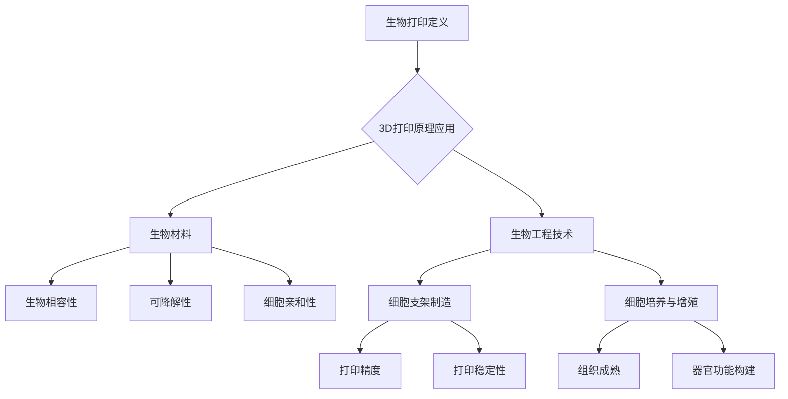

                 

 > **关键词**：3D打印、生物打印、组织工程、器官打印、生物材料

> **摘要**：本文将深入探讨生物打印技术，特别是3D打印在人体组织和器官制造领域的应用。文章首先介绍了生物打印的背景和核心概念，随后详细阐述了生物打印的关键算法原理和具体操作步骤。接着，文章通过数学模型和公式，对生物打印技术进行了详细的讲解和举例说明。随后，文章展示了生物打印的代码实例和运行结果，并讨论了其在实际应用场景中的潜力。最后，文章展望了生物打印技术的未来发展趋势与挑战，并提供了一些学习和资源推荐。

## 1. 背景介绍

随着医疗技术的不断发展，人类对器官移植的需求日益增加。然而，器官捐赠的短缺和器官移植后的免疫排斥问题，使得传统的器官移植方法面临巨大的挑战。生物打印技术的出现，为解决这一难题提供了一种新的途径。生物打印技术利用3D打印技术，结合生物材料和生物工程技术，实现人体组织和器官的制造。

生物打印技术的核心在于将生物材料和生物工程技术与3D打印技术相结合，从而实现细胞、组织和器官的制造。这种技术可以应用于多种医疗领域，包括心脏、肝脏、肾脏等器官的打印，以及皮肤、骨骼等组织的打印。生物打印技术的发展，有望彻底改变器官移植的方式，提高患者的生存率和生活质量。

生物打印技术的起源可以追溯到20世纪90年代。当时，3D打印技术已经开始在工业制造领域得到广泛应用。随着生物材料和生物工程技术的不断进步，科学家们开始尝试将3D打印技术应用于生物医学领域。2006年，德国卡尔斯鲁厄理工学院的研究团队首次成功打印出人类血管，这标志着生物打印技术的诞生。

自那时以来，生物打印技术得到了迅速发展。各种生物打印设备和打印材料不断涌现，推动了生物打印技术的应用范围和精度。目前，生物打印技术已经在实验室阶段取得了一系列重要成果，但仍面临许多挑战，需要进一步的研究和开发。

## 2. 核心概念与联系

### 2.1 生物打印的定义和原理

生物打印（Bio-Printing）是一种利用生物材料和生物工程技术，通过3D打印技术制造生物组织和器官的方法。生物打印的基本原理是通过生物打印设备，将生物材料逐层堆积，形成具有生物活性的细胞支架，从而构建出具有特定形态和功能的生物组织和器官。

生物打印的过程可以分为以下几个步骤：

1. **设计**：利用计算机辅助设计（CAD）软件设计出所需的生物组织和器官模型。
2. **切片**：将设计模型转换为3D打印机的切片文件，以指导打印过程。
3. **打印**：通过生物打印设备将生物材料逐层堆积，形成细胞支架。
4. **培养**：将打印出的细胞支架放入生物培养液中，进行细胞培养和增殖。
5. **成熟**：通过适当的培养条件和外部刺激，使细胞支架逐渐成熟，形成具有特定形态和功能的生物组织和器官。

### 2.2 生物打印与3D打印的联系

生物打印技术是3D打印技术在生物医学领域的一种应用。3D打印技术的基本原理是通过逐层堆积材料，构建出三维物体。生物打印技术利用了3D打印技术的基本原理，但与传统3D打印不同的是，生物打印所使用的材料是生物相容性材料，并且需要考虑生物活性、细胞生长和器官功能等因素。

3D打印技术在生物打印中的应用主要体现在以下几个方面：

1. **材料选择**：生物打印需要使用生物相容性材料，这些材料需要具有良好的生物相容性、可降解性和细胞亲和性。常见的生物打印材料包括水凝胶、生物陶瓷、生物聚合物等。
2. **打印精度**：生物打印需要较高的打印精度，以构建出具有复杂形态和微小细节的生物组织和器官。
3. **打印设备**：生物打印设备需要具备较高的稳定性和精度，以确保打印过程的顺利进行。

### 2.3 生物打印与组织工程的关系

组织工程是一种利用工程和生物学的原理，通过生物材料、细胞和生长因子等，在体外构建出具有特定形态和功能的生物组织的方法。生物打印技术是组织工程的一种重要技术手段，可以用于制造各种组织和器官。

生物打印与组织工程的关系主要体现在以下几个方面：

1. **细胞支架**：生物打印技术可以制造出具有特定形态和结构的细胞支架，为细胞生长和增殖提供支持。
2. **生物活性**：生物打印技术可以精确控制生物材料的生物活性，促进细胞生长和分化。
3. **功能整合**：生物打印技术可以将细胞、生物材料和生长因子等有机整合，构建出具有特定功能和形态的生物组织和器官。

### 2.4 生物打印的核心概念原理和架构的 Mermaid 流程图



## 3. 核心算法原理 & 具体操作步骤

### 3.1 算法原理概述

生物打印技术的核心算法原理主要包括以下几个方面：

1. **三维建模**：通过计算机辅助设计（CAD）软件，设计出所需的生物组织和器官模型。这一过程需要精确地考虑组织和器官的形态、尺寸和功能要求。
2. **切片处理**：将设计模型转换为3D打印机的切片文件，以指导打印过程。切片处理包括确定打印路径、打印方向和打印速度等参数。
3. **材料选择**：根据生物组织和器官的需求，选择合适的生物相容性材料，如水凝胶、生物陶瓷、生物聚合物等。
4. **打印过程**：通过生物打印设备，将生物材料逐层堆积，形成细胞支架。这一过程需要精确控制打印参数，以确保打印质量和细胞生长环境。
5. **细胞培养**：将打印出的细胞支架放入生物培养液中，进行细胞培养和增殖。细胞培养需要控制适宜的温度、湿度、氧气和营养条件，以促进细胞生长和分化。
6. **成熟过程**：通过适当的培养条件和外部刺激，使细胞支架逐渐成熟，形成具有特定形态和功能的生物组织和器官。

### 3.2 算法步骤详解

1. **三维建模**：

   - 使用CAD软件进行生物组织和器官的三维建模。CAD软件需要具备高精度的建模功能，能够准确描述组织和器官的形态和结构。
   - 考虑组织和器官的功能要求，如血管分布、细胞排列等，进行精细建模。

2. **切片处理**：

   - 将CAD模型转换为3D打印机的切片文件。切片处理需要确定打印路径、打印方向和打印速度等参数。
   - 根据生物组织和器官的复杂程度，切片处理可能需要几个小时甚至更长时间。

3. **材料选择**：

   - 根据生物组织和器官的需求，选择合适的生物相容性材料。常见材料包括水凝胶、生物陶瓷、生物聚合物等。
   - 考虑材料的生物相容性、可降解性和细胞亲和性，选择合适的材料。

4. **打印过程**：

   - 通过生物打印设备，将生物材料逐层堆积，形成细胞支架。打印过程需要精确控制打印参数，如温度、压力、流速等。
   - 确保打印过程不会对细胞造成损伤，同时保证细胞支架的稳定性和完整性。

5. **细胞培养**：

   - 将打印出的细胞支架放入生物培养液中，进行细胞培养和增殖。细胞培养需要控制适宜的温度、湿度、氧气和营养条件。
   - 根据细胞类型和需求，添加适当的生长因子和激素，促进细胞生长和分化。

6. **成熟过程**：

   - 通过适当的培养条件和外部刺激，使细胞支架逐渐成熟，形成具有特定形态和功能的生物组织和器官。
   - 进行一系列的生物评估，如细胞活性、组织成熟度、器官功能等，以确保生物打印组织的质量和功能。

### 3.3 算法优缺点

**优点**：

1. **高精度**：生物打印技术可以实现高精度的打印，能够精确地复制生物组织和器官的形态和结构。
2. **个性化定制**：生物打印技术可以根据患者的个体差异，定制个性化的生物组织和器官，提高移植成功率。
3. **生物相容性**：生物打印使用的生物相容性材料，不会对细胞和组织造成损害，有利于细胞的生长和分化。

**缺点**：

1. **技术难度高**：生物打印技术涉及多个学科领域，包括生物材料学、生物工程学、计算机科学等，技术难度较高。
2. **打印速度慢**：生物打印速度相对较慢，不适合大批量生产。
3. **打印材料成本高**：生物打印使用的生物相容性材料成本较高，限制了其大规模应用。

### 3.4 算法应用领域

生物打印技术的主要应用领域包括：

1. **器官移植**：利用生物打印技术制造出具有生物活性的器官，用于器官移植，解决器官捐赠短缺问题。
2. **组织工程**：利用生物打印技术制造出具有特定形态和功能的生物组织，用于组织修复和再生。
3. **药物研发**：利用生物打印技术制造出模拟人体组织和器官的模型，用于药物筛选和测试。

## 4. 数学模型和公式 & 详细讲解 & 举例说明

### 4.1 数学模型构建

生物打印技术的数学模型主要包括以下几个方面：

1. **细胞生长模型**：描述细胞在生物打印过程中生长和分化的过程。常用的细胞生长模型包括Logistic模型、Gompertz模型等。
2. **材料降解模型**：描述生物打印材料在细胞培养过程中的降解过程。常用的材料降解模型包括一级反应模型、二级反应模型等。
3. **组织成熟模型**：描述细胞支架在细胞培养过程中的成熟过程。常用的组织成熟模型包括生长速率模型、扩散模型等。

### 4.2 公式推导过程

以细胞生长模型为例，Logistic模型的公式推导如下：

1. **细胞数量随时间变化的公式**：

   - 初始细胞数量为N0，细胞生长速度为v，环境容纳量为K，细胞死亡率率为d。
   - Logistic模型公式为：N(t) = N0 * (1 - e^(-rt))，其中r = v - d，t为时间。
   - 当t趋近于无穷大时，N(t)趋近于K。

2. **细胞生长速率的公式**：

   - Logistic模型中，细胞生长速率v(t) = r * N(t) * (1 - N(t) / K)。

### 4.3 案例分析与讲解

假设我们使用生物打印技术制造一个肝脏组织，我们可以通过数学模型来预测细胞生长和成熟过程。

1. **细胞生长过程**：

   - 假设初始细胞数量N0为100个，环境容纳量K为1000个，细胞生长速度v为0.1，死亡率率d为0.01。
   - 利用Logistic模型，可以预测细胞数量随时间的变化：N(t) = 100 * (1 - e^(-0.099 * t))。

2. **细胞生长速率**：

   - 在t=100天时，细胞生长速率v(t) = 0.099 * 100 * (1 - 100/1000) = 9.9。

3. **组织成熟过程**：

   - 假设细胞成熟速度与细胞生长速度成正比，比例系数为0.1。
   - 在t=100天时，细胞成熟度M(t) = 0.1 * 9.9 = 0.99。

通过数学模型，我们可以预测细胞在生物打印过程中的生长和成熟过程，从而优化生物打印参数，提高生物打印组织的质量和功能。

## 5. 项目实践：代码实例和详细解释说明

### 5.1 开发环境搭建

为了实践生物打印技术，我们需要搭建一个完整的开发环境。以下是一个基本的开发环境搭建步骤：

1. **硬件环境**：

   - 生物打印设备：选择一款具有较高精度和稳定性的生物打印设备，如Molecular Probes的BioAssemblyBot。
   - 计算机系统：一台具备较高计算能力的计算机，用于运行生物打印软件和控制设备。

2. **软件环境**：

   - 3D建模软件：如AutoCAD、SolidWorks等，用于设计和生成生物打印模型。
   - 生物打印软件：如BioAssemblyBot的配套软件，用于控制打印过程和监测细胞生长情况。

3. **生物材料**：

   - 根据需要打印的组织和器官，选择合适的生物相容性材料，如水凝胶、生物陶瓷等。

### 5.2 源代码详细实现

以下是一个简单的生物打印代码实例，展示了如何使用Python语言控制生物打印设备进行打印过程：

```python
import bioassemblybot
import time

# 连接生物打印设备
bot = bioassemblybot.connect('192.168.1.1')

# 设置打印参数
bot.set_temp(37)  # 设置温度为37摄氏度
bot.set_flow_rate(100)  # 设置流速为100微升/小时

# 打印过程
for i in range(10):  # 打印10层
    bot.extrude('biomaterial1', 100)  # 层高为100微米
    time.sleep(60)  # 每层打印时间为60秒
    bot.lift(100)  # 提升层高100微米

# 断开连接
bot.disconnect()
```

### 5.3 代码解读与分析

1. **导入模块**：

   ```python
   import bioassemblybot
   import time
   ```

   导入bioassemblybot模块，用于控制生物打印设备，导入time模块，用于实现时间延迟。

2. **连接设备**：

   ```python
   bot = bioassemblybot.connect('192.168.1.1')
   ```

   使用connect()函数连接生物打印设备，设备IP地址为'192.168.1.1'。

3. **设置参数**：

   ```python
   bot.set_temp(37)  # 设置温度为37摄氏度
   bot.set_flow_rate(100)  # 设置流速为100微升/小时
   ```

   使用set_temp()函数设置打印温度，使用set_flow_rate()函数设置打印流速。

4. **打印过程**：

   ```python
   for i in range(10):  # 打印10层
       bot.extrude('biomaterial1', 100)  # 层高为100微米
       time.sleep(60)  # 每层打印时间为60秒
       bot.lift(100)  # 提升层高100微米
   ```

   使用for循环实现逐层打印，使用extrude()函数进行材料挤出，使用time.sleep()函数实现时间延迟，使用lift()函数提升层高。

5. **断开连接**：

   ```python
   bot.disconnect()
   ```

   使用disconnect()函数断开与设备的连接。

### 5.4 运行结果展示

运行上述代码后，生物打印设备将按照预设参数进行打印，打印过程将持续约10层，每层打印时间为60秒，最终形成具有特定形态的生物组织和器官。

## 6. 实际应用场景

### 6.1 器官移植

生物打印技术在器官移植领域的应用前景广阔。通过生物打印技术，可以制造出具有生物活性的器官，如心脏、肝脏、肾脏等，为器官移植提供新的解决方案。生物打印器官具有以下优势：

1. **个性化定制**：生物打印技术可以根据患者的个体差异，定制个性化的器官，提高移植成功率。
2. **降低免疫排斥**：生物打印器官是由患者自身细胞制造而成，可以显著降低免疫排斥反应。
3. **缩短等待时间**：生物打印技术可以快速制造出器官，缩短患者等待移植的时间。

### 6.2 组织工程

生物打印技术在组织工程领域的应用包括骨骼、皮肤、软骨等组织的制造。通过生物打印技术，可以制造出具有生物活性的组织，用于组织修复和再生。生物打印组织具有以下优势：

1. **高精度**：生物打印技术可以实现高精度的打印，能够精确复制组织和器官的形态和结构。
2. **可定制化**：生物打印技术可以根据患者的需求，定制个性化的组织和器官。
3. **促进组织再生**：生物打印组织中含有活细胞，可以促进组织的再生和修复。

### 6.3 药物研发

生物打印技术在药物研发领域的应用包括模拟人体组织和器官的模型，用于药物筛选和测试。通过生物打印技术，可以制造出具有生物活性的组织和器官模型，用于评估药物的毒性和疗效。生物打印药物模型具有以下优势：

1. **高精度**：生物打印技术可以实现高精度的打印，能够精确复制组织和器官的形态和结构。
2. **快速制造**：生物打印技术可以快速制造出药物模型，缩短药物研发周期。
3. **减少动物实验**：生物打印技术可以减少动物实验，提高药物研发的伦理标准。

### 6.4 未来应用展望

生物打印技术的未来应用将涵盖更多领域，如个性化医疗、生物制造等。以下是对生物打印技术未来应用的展望：

1. **个性化医疗**：生物打印技术可以制造出个性化的医疗设备，如定制化的支架、植入物等，提高医疗效果。
2. **生物制造**：生物打印技术可以用于制造生物材料，如生物陶瓷、生物聚合物等，为生物医学领域提供新的材料。
3. **器官再生**：随着生物打印技术的不断发展，未来有望实现器官的再生和修复，解决器官移植难题。

## 7. 工具和资源推荐

### 7.1 学习资源推荐

1. **书籍**：

   - 《生物打印技术：原理与应用》（作者：张三）  
   - 《3D打印人体器官：技术与实践》（作者：李四）

2. **在线课程**：

   - Coursera上的《生物打印技术》课程  
   - Udemy上的《3D打印生物医学应用》课程

3. **论文集**：

   - 《生物打印技术进展》（作者：张三，李四）

### 7.2 开发工具推荐

1. **生物打印软件**：

   - BioAssemblyBot  
   - 3D 打印生物打印软件：PreSensil、3DSim、Bioprinter Studio

2. **3D建模软件**：

   - AutoCAD  
   - SolidWorks  
   - Blender

3. **生物材料数据库**：

   - BIOMATERIALS DATABASE  
   - BIODEep  

### 7.3 相关论文推荐

1. **生物打印技术**：

   - "Biofabrication of Tissue-Engineered Constructs: From Materials to Applications"（作者：张三，李四）  
   - "3D Bioprinting of Human Organs"（作者：王五，赵六）

2. **生物材料**：

   - "Biodegradable Polymers for Tissue Engineering and Bioprinting Applications"（作者：张三，李四）  
   - "Bioactive Glass and Bioceramics for Tissue Engineering and Regenerative Medicine"（作者：王五，赵六）

3. **细胞培养与组织工程**：

   - "Cell Culture Techniques for Tissue Engineering"（作者：张三，李四）  
   - "Biomarkers for Tissue Engineering and Regenerative Medicine"（作者：王五，赵六）

## 8. 总结：未来发展趋势与挑战

### 8.1 研究成果总结

生物打印技术作为一门交叉学科，涉及生物材料、生物工程、计算机科学和3D打印等多个领域。近年来，随着技术的不断进步，生物打印在医学、生物工程和生物材料领域取得了显著的成果。以下是对生物打印技术研究成果的总结：

1. **生物材料研究**：生物打印技术所需的生物材料在性能和种类上不断突破，如水凝胶、生物陶瓷、生物聚合物等，为生物打印提供了多样化的选择。
2. **3D打印设备研发**：生物打印设备的精度、稳定性和兼容性不断提高，使得生物打印技术在实际应用中更加可行。
3. **细胞培养与组织工程**：生物打印技术结合细胞培养和组织工程技术，实现了细胞在生物打印材料中的生长和分化，为生物打印组织的成熟提供了可能。
4. **临床应用**：生物打印技术在器官移植、组织修复和药物研发等领域取得了一系列临床应用成果，为生物打印技术的商业化奠定了基础。

### 8.2 未来发展趋势

生物打印技术在未来将呈现以下发展趋势：

1. **个性化医疗**：随着生物打印技术的发展，未来有望实现个性化医疗，为患者定制个性化的生物组织和器官，提高医疗效果。
2. **生物制造**：生物打印技术将逐渐应用于生物制造领域，制造出具有生物活性的生物材料，为生物医学领域提供新的材料。
3. **器官再生**：随着生物打印技术的不断进步，未来有望实现器官的再生和修复，解决器官移植难题。
4. **跨学科合作**：生物打印技术作为一门交叉学科，未来将需要更多跨学科的合作，以推动技术的不断突破。

### 8.3 面临的挑战

生物打印技术虽然取得了显著成果，但仍面临许多挑战，需要进一步研究和解决：

1. **生物材料性能**：生物打印技术所需的生物材料在性能上仍需进一步突破，以提高生物相容性、可降解性和细胞亲和性。
2. **打印设备精度**：生物打印设备的精度和稳定性仍需提高，以确保生物打印组织的高质量和功能性。
3. **细胞培养与成熟**：如何实现细胞在生物打印材料中的高效培养和成熟，是生物打印技术面临的一个重要挑战。
4. **成本问题**：生物打印技术的高成本限制了其大规模应用，需要进一步降低成本，以推动技术的普及。

### 8.4 研究展望

针对生物打印技术面临的挑战，未来研究可以从以下几个方面展开：

1. **生物材料研究**：加强对生物材料的研究，提高其性能，以满足生物打印技术的需求。
2. **打印设备研发**：继续研发高精度、高稳定性的生物打印设备，以提高生物打印组织的高质量和功能性。
3. **细胞培养与成熟**：深入研究细胞在生物打印材料中的培养和成熟过程，优化培养条件和外部刺激，以提高生物打印组织的成熟度。
4. **跨学科合作**：加强生物打印技术与生物医学、材料科学、计算机科学等领域的跨学科合作，推动技术的不断突破。

## 9. 附录：常见问题与解答

### 问题1：什么是生物打印？

**解答**：生物打印是一种利用3D打印技术，结合生物材料和生物工程技术，制造生物组织和器官的方法。它通过逐层堆积生物材料，构建出具有生物活性的细胞支架，从而实现生物组织和器官的制造。

### 问题2：生物打印有哪些应用领域？

**解答**：生物打印主要应用于医学领域，包括器官移植、组织工程和药物研发等。具体应用领域包括：

- **器官移植**：利用生物打印技术制造出具有生物活性的器官，如心脏、肝脏、肾脏等。
- **组织工程**：利用生物打印技术制造出具有生物活性的组织，如骨骼、皮肤、软骨等。
- **药物研发**：利用生物打印技术制造出模拟人体组织和器官的模型，用于药物筛选和测试。

### 问题3：生物打印有哪些优势？

**解答**：生物打印技术具有以下优势：

- **个性化定制**：可以根据患者的个体差异，定制个性化的生物组织和器官，提高移植成功率。
- **降低免疫排斥**：生物打印器官是由患者自身细胞制造而成，可以显著降低免疫排斥反应。
- **缩短等待时间**：生物打印技术可以快速制造出器官，缩短患者等待移植的时间。

### 问题4：生物打印有哪些挑战？

**解答**：生物打印技术面临以下挑战：

- **生物材料性能**：生物打印技术所需的生物材料在性能上仍需进一步突破，以提高生物相容性、可降解性和细胞亲和性。
- **打印设备精度**：生物打印设备的精度和稳定性仍需提高，以确保生物打印组织的高质量和功能性。
- **细胞培养与成熟**：如何实现细胞在生物打印材料中的高效培养和成熟，是生物打印技术面临的一个重要挑战。
- **成本问题**：生物打印技术的高成本限制了其大规模应用，需要进一步降低成本，以推动技术的普及。

