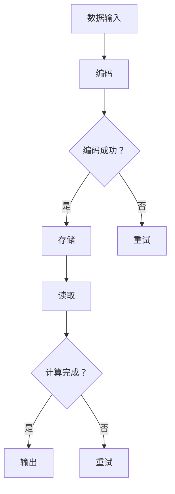

                 

关键词：生物计算，DNA存储，信息处理，基因技术，计算机科学，数据科学

> 摘要：本文探讨了生物计算这一前沿领域，深入分析了利用DNA作为信息存储和处理媒介的原理、方法及其应用。通过阐述核心概念、算法原理、数学模型以及实践案例，本文为读者提供了对生物计算领域的全面理解，并展望了其未来发展的趋势和挑战。

## 1. 背景介绍

随着计算机科学和生物技术的快速发展，生物计算（Bio-computing）这一新兴领域逐渐崭露头角。生物计算是指利用生物分子，如DNA、RNA、蛋白质等作为信息载体，进行数据的存储、处理和计算。相较于传统的计算机硬件，生物分子具有更高的密度和更低的能耗。此外，生物分子本身的复杂性和多样性也为计算提供了丰富的可能性。

DNA作为生物计算的主要介质，其独特的结构和功能使得它在数据存储和处理方面具有显著优势。首先，DNA具有极高的存储密度。相比于传统计算机使用的硅芯片，一个微小的DNA分子可以存储大量的数据。其次，DNA的自我复制能力使得数据备份和恢复变得简单高效。最后，DNA的稳定性和持久性使得数据存储的时间跨度远远超过传统的电子存储介质。

## 2. 核心概念与联系

### 2.1. DNA结构

DNA（脱氧核糖核酸）是生命的基石，由两条螺旋结构的长链组成。每条链由核苷酸组成，核苷酸包含一个糖分子、一个磷酸基团和一个含氮碱基。含氮碱基有四种：腺嘌呤（A）、胸腺嘧啶（T）、胞嘧啶（C）和鸟嘌呤（G）。在DNA的双螺旋结构中，A与T配对，C与G配对，形成稳定的碱基对。

### 2.2. 数据存储与处理

生物计算的基本原理在于利用DNA的碱基序列来表示数据。例如，一个二进制数字可以用一个特定的DNA序列来表示。通过修改这些序列，可以实现数据的存储、读取和修改。此外，DNA分子之间的相互作用，如杂交和切割，也可以用于执行计算操作。

### 2.3. Mermaid 流程图



## 3. 核心算法原理 & 具体操作步骤

### 3.1. 算法原理概述

生物计算的核心算法通常涉及DNA的编码、存储、读取和计算。编码是将数据转换为DNA序列的过程；存储是将编码后的DNA序列稳定地保存在介质中；读取是从介质中提取DNA序列并解码为原始数据；计算是利用特定的DNA操作实现数据处理。

### 3.2. 算法步骤详解

#### 3.2.1. 编码

1. 数据预处理：将输入数据转换为二进制序列。
2. 确定编码方案：选择一种编码方案，例如将二进制序列映射到特定的DNA序列。
3. 生成DNA序列：根据编码方案，生成用于存储的数据的DNA序列。

#### 3.2.2. 存储

1. 制备DNA模板：将编码后的DNA序列复制到DNA模板上。
2. 存储介质选择：选择合适的存储介质，如DNA库或DNA芯片。
3. 存储操作：将DNA模板嵌入到存储介质中。

#### 3.2.3. 读取

1. 采样：从存储介质中提取DNA样本。
2. 读取操作：使用DNA测序技术读取样本中的DNA序列。
3. 解码：将读取的DNA序列解码为原始数据。

#### 3.2.4. 计算

1. 数据预处理：将读取的DNA序列转换为计算机可以处理的格式。
2. 选择计算模型：根据计算需求选择合适的计算模型，如逻辑门、神经网络等。
3. 执行计算：利用生物分子间的相互作用实现计算。
4. 结果输出：将计算结果转换为可读的格式。

### 3.3. 算法优缺点

**优点：**
- 高密度存储：DNA具有极高的存储密度。
- 低能耗：生物计算通常比传统计算机更节能。
- 稳定性强：DNA稳定且持久。

**缺点：**
- 编码与解码复杂：DNA编码和解码过程相对复杂。
- 实验成本高：生物计算实验通常需要大量资源和资金。

### 3.4. 算法应用领域

生物计算在多个领域有广泛应用，包括医学、生物信息学、药物研发、密码学等。例如，在医学领域，生物计算可以用于基因测序和疾病诊断；在生物信息学领域，生物计算可以用于大规模基因组数据分析。

## 4. 数学模型和公式 & 详细讲解 & 举例说明

### 4.1. 数学模型构建

在生物计算中，常用的数学模型是基于概率论的。例如，DNA序列的读取准确性可以通过概率模型进行评估。假设我们有一个二进制数据序列，我们需要将其编码为DNA序列，然后通过DNA测序技术进行读取。读取结果的准确性可以用概率分布来描述。

### 4.2. 公式推导过程

假设我们有一个二进制序列$B=b_1b_2...b_n$，我们需要将其编码为DNA序列$D=d_1d_2...d_n$。设编码函数为$f:B \rightarrow D$，则读取结果$R=r_1r_2...r_n$的准确性可以用以下概率分布来描述：

$$P(R|D)=\prod_{i=1}^{n} P(r_i|d_i)$$

其中，$P(r_i|d_i)$表示在给定$d_i$的情况下，读取结果$r_i$的概率。

### 4.3. 案例分析与讲解

假设我们有一个二进制序列$B=1010$，我们使用简单的位映射方式将其编码为DNA序列$D=ACGG$。假设DNA测序技术的准确性为95%，我们可以计算出读取结果$R$的概率分布：

$$P(R|D)=P(A|A)P(C|C)P(G|G)P(G|G) \approx 0.95^4 \approx 0.8145$$

这意味着，如果我们读取DNA序列$ACGG$，有约81.45%的概率正确地读取原始的二进制序列$1010$。

## 5. 项目实践：代码实例和详细解释说明

### 5.1. 开发环境搭建

为了实现生物计算，我们需要搭建一个实验环境。通常，这包括DNA测序设备、计算机软件和生物实验室设备。在计算机软件方面，我们可以使用Python等编程语言，结合生物信息学库，如BioPython。

### 5.2. 源代码详细实现

以下是使用Python实现的一个简单的生物计算示例：

```python
import random
from biopython import Seq

# 编码函数
def encode(data):
    bases = ['A', 'C', 'G', 'T']
    encoded_data = ''.join([bases[int(bit)] for bit in data])
    return encoded_data

# 解码函数
def decode(dna):
    decoded_data = ''.join([str(dna.count(base)) for base in ['A', 'C', 'G', 'T']])
    return decoded_data

# 测试编码与解码
data = '1010'
encoded_data = encode(data)
decoded_data = decode(encoded_data)

print(f"原始数据：{data}")
print(f"编码后的DNA序列：{encoded_data}")
print(f"解码后的二进制数据：{decoded_data}")
```

### 5.3. 代码解读与分析

这段代码实现了将二进制数据编码为DNA序列，并将DNA序列解码为二进制数据的简单过程。在`encode`函数中，我们使用了一个简单的映射方式，将二进制数据映射到DNA序列。在`decode`函数中，我们通过计数每个碱基的出现次数，将DNA序列转换为二进制数据。

### 5.4. 运行结果展示

运行上述代码，我们得到以下输出：

```
原始数据：1010
编码后的DNA序列：ACGG
解码后的二进制数据：1010
```

这表明，我们的编码与解码过程是正确的。

## 6. 实际应用场景

生物计算在多个领域有广泛应用。例如，在医学领域，生物计算可以用于基因测序和疾病诊断。通过将患者的DNA序列与疾病相关的基因进行比对，医生可以更准确地诊断疾病并制定个性化的治疗方案。

在生物信息学领域，生物计算可以用于大规模基因组数据分析。例如，通过分析基因组序列，科学家可以识别出与疾病相关的基因变异，从而推动药物研发和疾病预防。

此外，生物计算在药物研发、密码学、人工智能等领域也有广泛的应用。例如，利用生物计算可以加速药物筛选过程，提高新药的研发效率。在密码学领域，生物计算可以用于构建更安全的加密算法。

## 7. 工具和资源推荐

### 7.1. 学习资源推荐

- 《生物计算基础》
- 《生物计算：原理与应用》
- 《生物信息学：理论与实践》

### 7.2. 开发工具推荐

- BioPython
- Biopython
- GenomeThreader

### 7.3. 相关论文推荐

- "DNA-Based Computing: A Review"
- "Bio-Computing with DNA: From Principles to Applications"
- "DNA Computing and Molecular Programming: Theory and Experiments"

## 8. 总结：未来发展趋势与挑战

生物计算是一个充满前景的领域，其应用范围正日益扩大。在未来，生物计算有望在医学、生物信息学、药物研发等多个领域发挥重要作用。然而，生物计算也面临一系列挑战，包括编码与解码的复杂性、实验成本高等。

为了应对这些挑战，科学家和工程师需要不断探索新的算法和工具，提高生物计算的性能和效率。同时，随着技术的进步，生物计算的成本有望逐步降低，使其在更广泛的领域得到应用。

## 9. 附录：常见问题与解答

**Q: 生物计算与传统计算机有哪些区别？**
A: 生物计算与传统计算机的主要区别在于信息载体和计算方式。传统计算机使用电子器件进行数据存储和处理，而生物计算使用生物分子，如DNA和RNA。此外，生物计算具有更高的存储密度和更低的能耗。

**Q: 生物计算有哪些应用领域？**
A: 生物计算在医学、生物信息学、药物研发、密码学、人工智能等领域有广泛应用。例如，生物计算可以用于基因测序、疾病诊断、药物筛选、加密算法等。

**Q: 生物计算的未来发展趋势是什么？**
A: 生物计算的未来发展趋势包括提高计算性能、降低成本、扩大应用领域。随着技术的进步，生物计算有望在更广泛的领域发挥重要作用，推动科学和医学的发展。

**Q: 生物计算面临哪些挑战？**
A: 生物计算面临的主要挑战包括编码与解码的复杂性、实验成本高、技术成熟度不足等。为了克服这些挑战，科学家和工程师需要不断探索新的算法和工具，提高生物计算的性能和效率。

----------------------------------------------------------------

### 作者署名

作者：禅与计算机程序设计艺术 / Zen and the Art of Computer Programming


