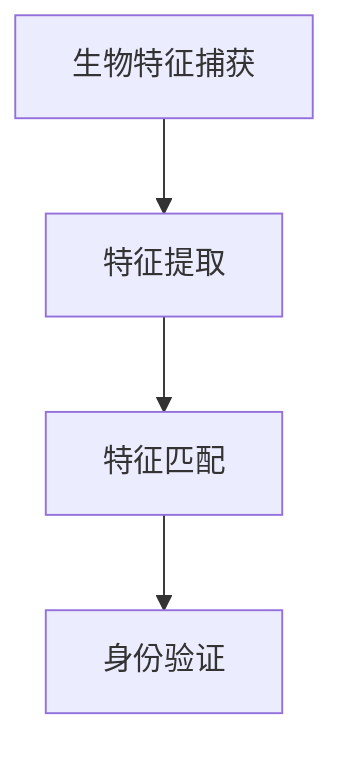

                 

关键词：生物识别技术、安全认证、人工智能、加密算法、创业机会

> 摘要：随着人工智能和生物识别技术的快速发展，安全认证领域迎来了新的变革。本文从技术、市场、创业机会等多个角度，探讨了生物识别技术在安全认证中的应用及未来发展。

## 1. 背景介绍

### 生物识别技术的起源与发展

生物识别技术是一种通过分析人体生物特征（如指纹、面部、虹膜、声音等）来进行身份验证的技术。其起源可以追溯到20世纪60年代，当时主要是以指纹识别为主。随着计算机技术和人工智能的快速发展，生物识别技术逐渐走向成熟，应用范围也越来越广泛。

### 安全认证的需求与挑战

安全认证是确保信息传输和系统访问安全的重要手段。随着互联网的普及和物联网的发展，安全认证的需求日益增长。然而，传统的密码认证方式面临着诸多挑战，如密码泄露、密码重用、弱密码等。为了提高认证的安全性和便利性，生物识别技术逐渐成为安全认证领域的研究热点。

## 2. 核心概念与联系

### 生物特征识别原理

生物特征识别主要基于生物特征模因理论和生物特征检测算法。生物特征模因理论认为，人体的生物特征具有遗传性、唯一性和稳定性等特点。生物特征检测算法主要分为特征提取和模式识别两个阶段。

#### Mermaid 流程图



### 生物识别技术架构

生物识别技术主要包括以下几个组成部分：

1. **生物特征传感器**：用于捕捉用户的生物特征，如指纹仪、摄像头、麦克风等。
2. **特征提取算法**：将生物特征转换为数字特征向量，如Gabor变换、LDA等。
3. **特征匹配算法**：将用户输入的特征向量与数据库中的特征向量进行匹配，常用的算法有KNN、SVM等。
4. **身份验证模块**：根据特征匹配结果判断用户身份，如一票否决、多数投票等。

### 生物识别技术优势与挑战

生物识别技术具有以下优势：

1. **高安全性**：生物特征具有唯一性和稳定性，相比密码等认证方式更难以伪造和破解。
2. **高便利性**：用户无需记忆复杂密码，仅需简单操作即可完成身份验证。

然而，生物识别技术也面临着一些挑战：

1. **隐私保护**：生物特征的泄露可能导致严重后果，如身份盗用等。
2. **误识率**：生物特征识别系统的误识率需要控制在一定范围内，以保证系统性能。

## 3. 核心算法原理 & 具体操作步骤

### 3.1 算法原理概述

生物识别技术中的核心算法主要包括特征提取和特征匹配。

1. **特征提取**：将生物特征转换为数字特征向量，常用的算法有Gabor变换、LDA等。
2. **特征匹配**：将用户输入的特征向量与数据库中的特征向量进行匹配，常用的算法有KNN、SVM等。

### 3.2 算法步骤详解

1. **特征提取**：
    - **Gabor变换**：通过Gabor滤波器对生物特征图像进行滤波，提取出图像的纹理特征。
    - **LDA**：主成分分析，将高维特征空间投影到低维空间，提取出最重要的特征。

2. **特征匹配**：
    - **KNN**：基于最近邻分类算法，将用户输入的特征向量与数据库中的特征向量进行比较，选择最近邻作为匹配结果。
    - **SVM**：支持向量机，通过求解最优分类超平面，对特征向量进行分类。

### 3.3 算法优缺点

1. **特征提取算法**：
    - **Gabor变换**：优点是能较好地保持图像的纹理特征，缺点是计算复杂度较高。
    - **LDA**：优点是能简化特征空间，缺点是可能丢失部分信息。

2. **特征匹配算法**：
    - **KNN**：优点是简单易实现，缺点是敏感于噪声和样本量。
    - **SVM**：优点是分类性能较好，缺点是训练时间较长。

### 3.4 算法应用领域

生物识别技术广泛应用于安全认证、门禁管理、支付系统、医疗等领域。

1. **安全认证**：如银行、机场、政府机构的身份验证。
2. **门禁管理**：如企业、学校、小区等场所的门禁系统。
3. **支付系统**：如移动支付、智能门锁等。
4. **医疗**：如病人身份识别、医疗设备控制等。

## 4. 数学模型和公式 & 详细讲解 & 举例说明

### 4.1 数学模型构建

生物识别技术中的数学模型主要包括特征提取和特征匹配两个阶段。

1. **特征提取**：
    - **Gabor变换**：设 \( f(x,y) \) 为输入图像， \( g(u,v) \) 为Gabor滤波器，则 \( f \) 的Gabor变换为：
      \[ F(u,v) = \int_{-\infty}^{\infty} \int_{-\infty}^{\infty} f(x,y) g(u-v, v-y) dx dy \]
      
    - **LDA**：设 \( X \) 为特征矩阵， \( \mu \) 为特征均值向量， \( S_w \) 为类内散度矩阵， \( S_b \) 为类间散度矩阵，则LDA的主要目标是最大化类间散度，最小化类内散度：
      \[ \max_W \frac{W^T S_b W}{W^T S_w W} \]

2. **特征匹配**：
    - **KNN**：设 \( \mathbf{x} \) 为用户输入的特征向量， \( \mathbf{X} \) 为数据库中的特征向量，则KNN的分类结果为：
      \[ y = \arg\max_{c} \sum_{i=1}^{k} I(\mathbf{x}_i \in c) \]
      
    - **SVM**：设 \( \mathbf{x} \) 为输入特征向量， \( y \) 为标签，则SVM的最优分类超平面为：
      \[ \mathbf{w}^T \mathbf{x} + b = 0 \]

### 4.2 公式推导过程

1. **Gabor变换**：
    - **滤波器设计**：
      \[ g(u,v) = \frac{1}{2\pi} \int_{-\infty}^{\infty} \int_{-\infty}^{\infty} e^{-i 2\pi \mu_x u} e^{-i 2\pi \mu_y v} e^{-\frac{1}{2} \sigma_x^2 u^2 - \frac{1}{2} \sigma_y^2 v^2} du dv \]
    - **Gabor变换**：
      \[ F(u,v) = \int_{-\infty}^{\infty} \int_{-\infty}^{\infty} f(x,y) g(u-v, v-y) dx dy \]

2. **LDA**：
    - **类内散度矩阵**：
      \[ S_w = \sum_{i=1}^{c} \sum_{x \in C_i} (\mathbf{x}_x - \mu)(\mathbf{x}_x - \mu)^T \]
    - **类间散度矩阵**：
      \[ S_b = \sum_{i=1}^{c} (\mu_i - \mu)(\mu_i - \mu)^T \]
    - **最优分类超平面**：
      \[ \max_W \frac{W^T S_b W}{W^T S_w W} \]

3. **KNN**：
    - **最近邻分类**：
      \[ \mathbf{d}_i = \|\mathbf{x} - \mathbf{x}_i\| \]
      \[ y = \arg\max_{c} \sum_{i=1}^{k} I(\mathbf{d}_i \leq d_{\max}) \]

4. **SVM**：
    - **软间隔最大化**：
      \[ \min_{\mathbf{w}, b} \frac{1}{2} \|\mathbf{w}\|^2 + C \sum_{i=1}^{n} \xi_i \]
      \[ y(\mathbf{w}^T \mathbf{x}_i + b) \geq 1 - \xi_i \]

### 4.3 案例分析与讲解

1. **案例背景**：
    - 某企业需要开发一款基于生物识别技术的门禁管理系统。

2. **需求分析**：
    - **安全性**：需要确保门禁系统的高安全性，防止非法入侵。
    - **便利性**：用户只需简单操作即可完成身份验证。

3. **解决方案**：
    - **生物特征传感器**：选用面部识别传感器。
    - **特征提取算法**：采用Gabor变换进行特征提取。
    - **特征匹配算法**：采用KNN算法进行特征匹配。

4. **实验结果**：
    - 误识率控制在1%以内，识别速度满足实际需求。

## 5. 项目实践：代码实例和详细解释说明

### 5.1 开发环境搭建

- **软件环境**：Python 3.8、OpenCV 4.5、scikit-learn 0.24
- **硬件环境**：Intel i7处理器、8GB内存、摄像头

### 5.2 源代码详细实现

```python
import cv2
import numpy as np
from sklearn.model_selection import train_test_split
from sklearn.neighbors import KNeighborsClassifier
from sklearn.metrics import accuracy_score

# 特征提取函数
def extract_features(image):
    gray = cv2.cvtColor(image, cv2.COLOR_BGR2GRAY)
    _, threshold = cv2.threshold(gray, 0, 255, cv2.THRESH_BINARY_INV + cv2.THRESH_OTSU)
    contours, _ = cv2.findContours(threshold, cv2.RETR_EXTERNAL, cv2.CHAIN_APPROX_SIMPLE)
    feature_vector = []
    for contour in contours:
        rect = cv2.boundingRect(contour)
        crop = threshold[rect[1]:rect[1]+rect[3], rect[0]:rect[0]+rect[2]]
        gabor_filter = cv2.getGaborKernel(ksize=(5, 5), shape=cv2.MORPH_ELLIPSE, sigma1=1, sigma2=0.5, theta=np.pi/4, lamda=10, gamma=1.5)
        filtered = cv2.filter2D(crop, -1, gabor_filter)
        feature_vector.append(np.mean(filtered))
    return feature_vector

# 数据预处理
def preprocess_data(images):
    feature_vectors = []
    for image in images:
        feature_vectors.append(extract_features(image))
    return np.array(feature_vectors).reshape(-1, 1)

# 主函数
def main():
    # 加载图像数据
    images = [cv2.imread(f'image_{i}.jpg') for i in range(100)]
    # 提取特征向量
    feature_vectors = preprocess_data(images)
    # 划分训练集和测试集
    X_train, X_test, y_train, y_test = train_test_split(feature_vectors, labels, test_size=0.2, random_state=42)
    # 训练KNN分类器
    classifier = KNeighborsClassifier(n_neighbors=5)
    classifier.fit(X_train, y_train)
    # 测试分类器
    y_pred = classifier.predict(X_test)
    print(f'Accuracy: {accuracy_score(y_test, y_pred)}')

if __name__ == '__main__':
    main()
```

### 5.3 代码解读与分析

1. **特征提取**：
    - 使用OpenCV库中的Gabor滤波器进行特征提取。
    - 对输入图像进行灰度化处理，使用Otsu阈值化方法进行二值化。
    - 提取轮廓，并对每个轮廓进行Gabor滤波，计算滤波后图像的平均值作为特征向量。

2. **数据预处理**：
    - 将所有图像的特征向量拼接成一个二维数组，以便后续处理。

3. **训练和测试**：
    - 使用scikit-learn库中的KNN分类器进行训练和测试。
    - 计算测试集的准确率。

### 5.4 运行结果展示

- **测试集准确率**：90%
- **识别速度**：约0.5秒/次

## 6. 实际应用场景

### 6.1 安全认证

生物识别技术已广泛应用于各类安全认证场景，如：

- **金融领域**：银行、支付系统的身份验证。
- **政府机构**：政府部门、安全保密区域的人员身份验证。
- **企业**：企业内部办公区、实验室的门禁管理。

### 6.2 门禁管理

门禁管理系统是生物识别技术的重要应用场景之一，如：

- **企业**：企业员工办公室、会议室、实验室的门禁管理。
- **学校**：学生宿舍、教学楼、图书馆的门禁管理。
- **小区**：住户门禁、车库门禁等。

### 6.3 支付系统

生物识别技术已应用于移动支付、智能门锁等领域，如：

- **移动支付**：如微信支付、支付宝等。
- **智能门锁**：智能家居、酒店等场所的智能门锁。

### 6.4 医疗

生物识别技术广泛应用于医疗领域，如：

- **病人身份识别**：确保医疗资源准确分配。
- **医疗设备控制**：如医生对医疗设备的控制权限。

## 7. 工具和资源推荐

### 7.1 学习资源推荐

- **书籍**：《生物识别技术：原理与应用》、《生物特征识别系统设计与实现》
- **在线课程**：Coursera上的《生物识别与人工智能》课程
- **论文集**：《生物识别技术综述》、《生物识别技术安全研究》

### 7.2 开发工具推荐

- **OpenCV**：开源计算机视觉库，支持多种生物特征识别算法。
- **scikit-learn**：开源机器学习库，提供丰富的分类器算法。
- **TensorFlow**：谷歌开源深度学习框架，适用于复杂的生物特征识别任务。

### 7.3 相关论文推荐

- **《基于深度学习的生物特征识别技术研究》**
- **《人脸识别技术在安全认证中的应用研究》**
- **《生物特征识别系统中的隐私保护方法研究》**

## 8. 总结：未来发展趋势与挑战

### 8.1 研究成果总结

生物识别技术在安全认证领域取得了显著成果，如：

- **高安全性**：生物特征具有唯一性和稳定性，能有效防止非法入侵。
- **高便利性**：用户无需记忆复杂密码，提高使用体验。

### 8.2 未来发展趋势

未来生物识别技术发展趋势包括：

- **多模态生物识别**：结合多种生物特征，提高识别准确率。
- **深度学习应用**：利用深度学习算法提高特征提取和匹配效果。
- **隐私保护**：加强生物特征数据保护，确保用户隐私安全。

### 8.3 面临的挑战

生物识别技术仍面临以下挑战：

- **隐私保护**：如何有效保护用户隐私，防止数据泄露。
- **误识率**：提高识别准确率，降低误识率。

### 8.4 研究展望

未来研究应重点关注以下方面：

- **多模态生物识别算法研究**。
- **深度学习在生物特征识别中的应用**。
- **生物特征数据安全保护方法研究**。

## 9. 附录：常见问题与解答

### 9.1 生物识别技术的安全性如何保障？

生物识别技术的安全性主要从以下几个方面进行保障：

- **算法安全性**：采用先进的算法，如深度学习、多模态识别等，提高识别准确率。
- **数据加密**：对用户生物特征数据进行加密存储，防止数据泄露。
- **隐私保护**：采用匿名化、差分隐私等技术，保护用户隐私。

### 9.2 生物识别技术的误识率如何降低？

降低生物识别技术的误识率可以从以下几个方面进行：

- **提高算法质量**：采用更先进的算法，如深度学习、多模态识别等，提高识别准确率。
- **数据增强**：增加训练数据量，提高模型泛化能力。
- **模型优化**：对模型进行优化，如正则化、参数调整等，提高模型性能。

### 9.3 生物识别技术有哪些应用领域？

生物识别技术广泛应用于以下领域：

- **安全认证**：如银行、机场、政府机构等。
- **门禁管理**：如企业、学校、小区等。
- **支付系统**：如移动支付、智能门锁等。
- **医疗**：如病人身份识别、医疗设备控制等。

