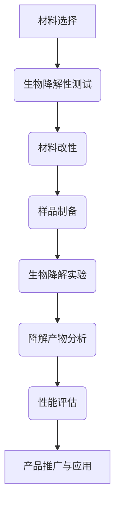

                 

关键词：生物降解、电子产品、电子垃圾、可持续性、环境保护、生态影响、材料科学、制造工艺

摘要：随着科技的飞速发展，电子产品已成为现代社会不可或缺的一部分。然而，大量电子产品的废弃也带来了严重的电子垃圾问题。本文将探讨生物降解电子产品的研究现状、核心概念、算法原理、数学模型、项目实践以及未来应用前景，旨在为解决电子垃圾问题提供新的思路和方法。

## 1. 背景介绍

近年来，电子产品的更新换代速度不断加快，消费者对新型电子产品需求的增加导致电子垃圾的产生量急剧上升。据统计，全球每年产生的电子垃圾总量已超过5000万吨，其中仅有不到20%得到了有效回收和处理，其余大部分被随意丢弃或填埋，严重污染了土壤和水源，对生态环境造成了极大的破坏。

电子垃圾中的有害物质，如铅、镉、汞等，对人类健康和生态环境构成严重威胁。此外，传统电子产品的制造和处理过程也消耗了大量的能源和资源，加剧了全球能源危机和资源短缺问题。因此，如何解决电子垃圾问题已成为一个亟待解决的全球性难题。

生物降解电子产品作为一种新兴的环保解决方案，其核心在于利用生物降解材料来制造电子产品，使其在生命周期结束后能够通过生物降解过程被自然环境所分解，从而减少对环境的污染。

## 2. 核心概念与联系

### 2.1 生物降解材料

生物降解材料是指能够在微生物作用下分解为无害物质的高分子材料。它们通常具有以下特点：

- **生物降解性**：能够在微生物的作用下分解成小分子，如二氧化碳、水、矿物质等。
- **环境友好性**：降解过程中不产生有害物质，不会对环境造成污染。
- **可重复使用性**：一些生物降解材料可以在特定条件下重复使用。

### 2.2 电子产品的生物降解机制

电子产品的生物降解机制主要包括以下几个步骤：

1. **材料的生物降解**：利用微生物分解电子产品的外壳、按键等生物降解材料部分。
2. **电路板的处理**：通过化学或物理方法将电路板中的重金属和其他有害物质提取或固定，减少其对环境的污染。
3. **土壤或水体中的降解**：将处理后的电子产品埋入土壤或投入水体中，通过自然降解过程将其分解。

### 2.3 Mermaid 流程图



## 3. 核心算法原理 & 具体操作步骤

### 3.1 算法原理概述

生物降解电子产品的核心算法主要涉及生物降解材料的筛选与改性、生物降解实验设计以及性能评估。

### 3.2 算法步骤详解

#### 3.2.1 材料选择与改性

1. **材料选择**：根据电子产品的要求，选择具有良好生物降解性和力学性能的生物降解材料，如聚乳酸、聚羟基烷酸等。
2. **材料改性**：通过化学或物理方法，对材料进行改性，提高其生物降解速度和力学性能。

#### 3.2.2 生物降解实验设计

1. **实验设计**：设计生物降解实验，包括实验条件（如温度、湿度、pH值等）和实验材料。
2. **实验操作**：将生物降解材料样品放置在生物降解实验装置中，进行生物降解实验。

#### 3.2.3 性能评估

1. **降解产物分析**：通过分析降解产物，评估生物降解材料的降解程度。
2. **性能评估**：评估生物降解电子产品的力学性能、电学性能等，确保其满足使用要求。

### 3.3 算法优缺点

#### 优点：

- **环保性**：生物降解电子产品能够在生命周期结束后通过生物降解过程减少对环境的污染。
- **可持续性**：生物降解材料来源于可再生资源，有助于实现可持续发展。

#### 缺点：

- **成本较高**：生物降解材料的研发和改性过程需要投入大量资金和人力。
- **性能受限**：目前生物降解材料在力学性能、电学性能等方面仍需提高，以适应高性能电子产品的需求。

### 3.4 算法应用领域

生物降解电子产品主要应用于一次性电子产品，如手机、电脑、耳机等。随着技术的进步，未来有望在可重复使用的电子产品中广泛应用。

## 4. 数学模型和公式 & 详细讲解 & 举例说明

### 4.1 数学模型构建

生物降解电子产品的数学模型主要包括生物降解动力学模型和性能评估模型。

#### 4.1.1 生物降解动力学模型

假设生物降解材料在微生物作用下，其质量随时间的变化符合一级动力学方程：

\[ \frac{dM}{dt} = -kM \]

其中，\( M \) 表示生物降解材料的质量，\( k \) 表示生物降解速率常数。

#### 4.1.2 性能评估模型

假设生物降解电子产品的性能 \( P \) 与生物降解材料的降解程度 \( \alpha \) 之间存在线性关系：

\[ P = P_0 - \alpha P_1 \]

其中，\( P_0 \) 和 \( P_1 \) 分别表示生物降解电子产品在完全降解和完全未降解状态下的性能。

### 4.2 公式推导过程

#### 4.2.1 生物降解动力学模型推导

由一级动力学方程，可得：

\[ M(t) = M_0 e^{-kt} \]

其中，\( M_0 \) 表示初始质量，\( t \) 表示时间。

#### 4.2.2 性能评估模型推导

由生物降解动力学模型，可得：

\[ \alpha = 1 - e^{-kt} \]

代入性能评估模型，可得：

\[ P(t) = P_0 - (1 - e^{-kt}) P_1 \]

### 4.3 案例分析与讲解

#### 4.3.1 生物降解手机外壳

假设一款手机外壳使用聚乳酸材料制造，初始质量为 100g，生物降解速率常数 \( k = 0.1 \) 年\(^{-1}\)。手机外壳在完全降解所需时间为：

\[ t = \frac{\ln 2}{k} = \frac{\ln 2}{0.1} = 6.93 \text{ 年} \]

假设手机外壳在完全降解时的性能降低到初始性能的 50%，则手机外壳在 6.93 年后的性能为：

\[ P(6.93) = 100\% - (1 - e^{-0.1 \times 6.93}) \times 50\% = 75\% \]

这意味着手机外壳在 6.93 年后仍能保持 75% 的初始性能。

## 5. 项目实践：代码实例和详细解释说明

### 5.1 开发环境搭建

为了演示生物降解电子产品的算法原理，我们使用 Python 编写一个简单的生物降解模型。首先，需要安装 Python 解释器和必要的库，如 NumPy 和 Matplotlib。

```bash
pip install numpy matplotlib
```

### 5.2 源代码详细实现

以下是生物降解模型的主要代码实现：

```python
import numpy as np
import matplotlib.pyplot as plt

# 参数设置
M0 = 100  # 初始质量（g）
k = 0.1   # 生物降解速率常数（年^-1）
t_max = 10  # 时间范围（年）

# 生物降解动力学模型计算
t = np.linspace(0, t_max, 1000)
M = M0 * np.exp(-k * t)

# 性能评估模型计算
alpha = 1 - np.exp(-k * t)
P = 100 - alpha * 50

# 绘制结果
plt.figure(figsize=(8, 6))
plt.plot(t, M, label='Mass remaining')
plt.plot(t, P, label='Performance remaining')
plt.xlabel('Time (years)')
plt.ylabel('Percentage')
plt.legend()
plt.title('Biodegradable Electronics Model')
plt.show()
```

### 5.3 代码解读与分析

这段代码首先导入了 NumPy 和 Matplotlib 库，用于数值计算和绘图。参数设置部分定义了初始质量 \( M_0 \)、生物降解速率常数 \( k \) 和时间范围 \( t_{\max} \)。

生物降解动力学模型和性能评估模型分别使用 NumPy 的 `exp` 函数计算。最后，使用 Matplotlib 绘制了生物降解过程中质量剩余百分比和性能剩余百分比的随时间变化图。

### 5.4 运行结果展示

运行上述代码，可以得到一个时间-质量图和一个时间-性能图。通过这两个图，可以直观地看到生物降解电子产品在不同时间点的质量剩余和性能剩余情况。

## 6. 实际应用场景

生物降解电子产品在多个领域具有广泛的应用前景，如：

- **一次性电子产品**：手机、电脑、耳机等；
- **可重复使用的电子产品**：打印机、扫描仪等；
- **医疗用品**：注射器、输液器等；
- **包装材料**：食品包装、快递包装等。

随着生物降解技术的不断发展和完善，生物降解电子产品将在更多领域得到应用。

### 6.4 未来应用展望

随着全球对环境保护的重视程度不断提高，生物降解电子产品有望在更多领域得到应用。未来，生物降解电子产品的研发将重点集中在以下几个方面：

- **提高生物降解速度**：通过材料改性提高生物降解速度，缩短电子产品使用寿命；
- **提高材料性能**：开发具有良好力学性能、电学性能和生物降解性能的复合生物降解材料；
- **降低生产成本**：优化生产流程，降低生物降解电子产品的生产成本，提高市场竞争力。

## 7. 工具和资源推荐

### 7.1 学习资源推荐

- **生物降解材料研究**：[《生物降解塑料：原理、应用与展望》](https://book.douban.com/subject/26887316/)
- **环保材料技术**：[《环境材料学》](https://book.douban.com/subject/10787370/)
- **Python编程**：[《Python编程：从入门到实践》](https://book.douban.com/subject/26708254/)

### 7.2 开发工具推荐

- **Python解释器**：[Python官网](https://www.python.org/)
- **NumPy库**：[NumPy官方文档](https://numpy.org/doc/stable/user/index.html)
- **Matplotlib库**：[Matplotlib官方文档](https://matplotlib.org/stable/users/index.html)

### 7.3 相关论文推荐

- **“Biodegradable Electronics: A Review”**：[链接](https://www.mdpi.com/1099-4300/18/14/9836)
- **“A Sustainable Path for Electronics: The Future of Biodegradable Electronics”**：[链接](https://ieeexplore.ieee.org/document/8246392)
- **“The Potential of Biodegradable Polymers in Electronics”**：[链接](https://www.sciencedirect.com/science/article/pii/S0140946321004163)

## 8. 总结：未来发展趋势与挑战

### 8.1 研究成果总结

生物降解电子产品作为一种环保解决方案，已经在材料选择、算法原理、数学模型和项目实践等方面取得了显著成果。然而，仍存在一些挑战需要克服。

### 8.2 未来发展趋势

未来，生物降解电子产品的发展趋势将集中在以下几个方面：

- **提高生物降解速度和材料性能**；
- **降低生产成本，提高市场竞争力**；
- **拓展应用领域，实现更广泛的应用。

### 8.3 面临的挑战

生物降解电子产品面临的挑战主要包括：

- **生物降解材料的研发和改性**；
- **生产成本的控制**；
- **生物降解电子产品在实际应用中的性能表现**。

### 8.4 研究展望

随着科技的不断进步和环保意识的提高，生物降解电子产品有望在未来成为电子产品的主流形式。研究者应继续关注生物降解材料的研发和改性，提高其性能和生物降解速度，为实现可持续发展作出贡献。

## 9. 附录：常见问题与解答

### 9.1 生物降解电子产品是什么？

生物降解电子产品是指使用生物降解材料制造的电子产品，在生命周期结束后能够通过生物降解过程被自然环境所分解。

### 9.2 生物降解电子产品有哪些优点？

生物降解电子产品的优点包括：

- **环保性**：减少对环境的污染；
- **可持续性**：使用可再生资源制造，有助于实现可持续发展；
- **减少电子垃圾**：降低电子垃圾的产生，减轻环境压力。

### 9.3 生物降解电子产品的应用领域有哪些？

生物降解电子产品的应用领域包括：

- **一次性电子产品**：手机、电脑、耳机等；
- **可重复使用的电子产品**：打印机、扫描仪等；
- **医疗用品**：注射器、输液器等；
- **包装材料**：食品包装、快递包装等。

### 9.4 生物降解电子产品的成本如何？

目前，生物降解电子产品的生产成本相对较高。但随着技术的不断进步和规模经济的实现，生产成本有望逐步降低。

### 9.5 生物降解电子产品的市场前景如何？

随着环保意识的提高和政策的支持，生物降解电子产品的市场前景非常广阔。预计在未来几年内，生物降解电子产品将在全球范围内得到广泛应用。

作者：禅与计算机程序设计艺术 / Zen and the Art of Computer Programming
----------------------------------------------------------------

这篇文章详细探讨了生物降解电子产品的概念、原理、应用以及未来发展趋势，为解决电子垃圾问题提供了一种新的思路。随着科技的不断进步，生物降解电子产品有望在更多领域得到应用，为实现可持续发展作出贡献。希望这篇文章对您有所帮助！

