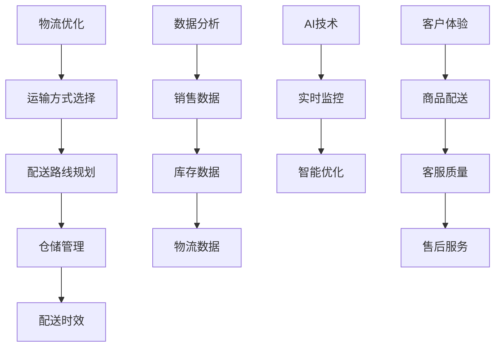

                 

 关键词：（生鲜电商、供应链管理、物流优化、数据分析、AI技术、客户体验）

> 摘要：随着互联网技术的飞速发展，生鲜电商市场呈现出蓬勃发展的态势。然而，供应链管理的高效性成为了生鲜电商企业能否成功的关键因素。本文将探讨生鲜电商创业中如何打造高效的供应链，包括物流优化、数据分析、AI技术的应用以及客户体验的提升，旨在为生鲜电商企业提供一些实用的策略和启示。

## 1. 背景介绍

近年来，随着人们生活水平的提高和消费习惯的改变，生鲜电商市场迅速崛起。据数据显示，全球生鲜电商市场规模逐年扩大，预计到2025年将达到数千亿美元。然而，生鲜电商行业的竞争日益激烈，如何在众多竞争对手中脱颖而出，打造高效供应链成为了许多创业者关注的焦点。

高效供应链的打造不仅能够提高企业的运营效率，降低成本，还能提升客户满意度，增强企业的竞争力。本文将从物流优化、数据分析、AI技术以及客户体验四个方面，详细探讨生鲜电商创业中如何打造高效的供应链。

## 2. 核心概念与联系

### 2.1 物流优化

物流优化是生鲜电商供应链管理的重要组成部分。其核心目的是通过合理的运输路线、仓储布局和配送计划，降低物流成本，提高配送效率。物流优化涉及到多个方面，如运输方式选择、配送路线规划、仓储管理、配送时效等。

### 2.2 数据分析

数据分析在生鲜电商供应链管理中具有重要作用。通过对销售数据、库存数据、物流数据等进行分析，企业可以深入了解市场需求，优化库存管理，预测销售趋势，从而实现供应链的智能化和精细化。

### 2.3 AI技术

AI技术（如机器学习、深度学习等）在生鲜电商供应链管理中的应用越来越广泛。通过AI技术，企业可以实现对供应链各个环节的实时监控和智能优化，提高供应链的响应速度和灵活性。

### 2.4 客户体验

客户体验是生鲜电商成功的关键。高效的供应链管理可以确保商品的及时配送和新鲜度，从而提高客户满意度。此外，良好的客户体验还包括客服质量、售后服务等。

### 2.5 Mermaid 流程图



## 3. 核心算法原理 & 具体操作步骤

### 3.1 算法原理概述

物流优化算法主要基于数学模型和启发式算法。常见的数学模型包括线性规划、动态规划等，启发式算法包括遗传算法、蚁群算法等。

数据分析算法主要基于统计学和机器学习。常用的统计学方法有回归分析、聚类分析等，机器学习方法有决策树、神经网络等。

AI技术算法主要基于深度学习和强化学习。深度学习方法如卷积神经网络（CNN）和循环神经网络（RNN）在图像识别和序列数据处理方面具有优势，强化学习方法如深度Q网络（DQN）和策略梯度（PG）在决策优化方面有广泛应用。

### 3.2 算法步骤详解

#### 3.2.1 物流优化

1. 数据采集：收集运输需求、运输资源、配送时效等数据。
2. 数学模型构建：建立运输方式选择、配送路线规划、仓储管理等数学模型。
3. 启发式算法设计：设计遗传算法、蚁群算法等启发式算法。
4. 算法求解：利用启发式算法求解最优解。
5. 结果分析：分析求解结果，调整算法参数，优化物流方案。

#### 3.2.2 数据分析

1. 数据预处理：清洗、转换和归一化数据。
2. 统计分析：应用回归分析、聚类分析等方法进行数据探索和分析。
3. 机器学习模型训练：选择合适的机器学习模型（如决策树、神经网络等）进行训练。
4. 模型评估与优化：评估模型性能，调整模型参数，优化模型效果。
5. 应用场景部署：将训练好的模型应用到实际业务场景，如销售预测、库存管理等。

#### 3.2.3 AI技术

1. 数据采集：收集供应链各环节的实时数据。
2. 模型设计：设计深度学习模型（如CNN、RNN等）或强化学习模型（如DQN、PG等）。
3. 模型训练：利用历史数据对模型进行训练。
4. 模型评估与优化：评估模型性能，调整模型参数，优化模型效果。
5. 实时监控与优化：利用训练好的模型进行实时监控和优化，如库存管理、配送计划等。

### 3.3 算法优缺点

#### 3.3.1 物流优化

优点：能够有效降低物流成本，提高配送效率。

缺点：求解过程复杂，计算量大，可能存在局部最优解。

#### 3.3.2 数据分析

优点：能够从海量数据中提取有价值的信息，支持决策制定。

缺点：数据质量和预处理过程影响分析结果，模型效果可能受限于数据量和特征选择。

#### 3.3.3 AI技术

优点：具有强大的学习和预测能力，能够实时优化供应链。

缺点：对数据处理和模型训练要求较高，计算资源消耗大。

### 3.4 算法应用领域

物流优化：运输调度、配送路径规划、仓储管理等。

数据分析：销售预测、库存管理、客户行为分析等。

AI技术：实时监控、智能调度、需求预测等。

## 4. 数学模型和公式 & 详细讲解 & 举例说明

### 4.1 数学模型构建

#### 4.1.1 运输方式选择模型

假设有\( n \)种运输方式，每种方式的运输成本为\( c_i \)，运输能力为\( a_i \)，总运输需求为\( d \)。目标是最小化总运输成本。

数学模型如下：

$$
\min Z = \sum_{i=1}^{n} c_i x_i
$$

$$
s.t. \\
\begin{aligned}
\sum_{i=1}^{n} a_i x_i &\ge d \\
x_i &\ge 0, \quad i=1,2,...,n
\end{aligned}
$$

其中，\( x_i \)表示选择第\( i \)种运输方式的数量。

#### 4.1.2 配送路线规划模型

假设有\( m \)个配送点，每个配送点的配送需求为\( d_j \)，配送成本为\( c_j \)，总配送量为\( D \)。目标是最小化总配送成本。

数学模型如下：

$$
\min Z = \sum_{j=1}^{m} c_j y_j
$$

$$
s.t. \\
\begin{aligned}
\sum_{j=1}^{m} y_j &= 1 \\
\sum_{j=1}^{m} d_j y_j &= D \\
y_j &\ge 0, \quad j=1,2,...,m
\end{aligned}
$$

其中，\( y_j \)表示选择第\( j \)个配送点。

### 4.2 公式推导过程

#### 4.2.1 运输方式选择模型推导

目标函数为最小化总运输成本，约束条件为总运输能力大于等于总运输需求，以及每种运输方式的运输量非负。

目标函数：
$$
\min Z = \sum_{i=1}^{n} c_i x_i
$$

约束条件：
$$
\sum_{i=1}^{n} a_i x_i \ge d
$$

$$
x_i \ge 0, \quad i=1,2,...,n
$$

通过拉格朗日乘数法求解，构造拉格朗日函数：
$$
L(x, \lambda) = \sum_{i=1}^{n} c_i x_i + \lambda(d - \sum_{i=1}^{n} a_i x_i)
$$

求导并令导数为零，得到：
$$
\frac{\partial L}{\partial x_i} = c_i - \lambda a_i = 0 \\
\frac{\partial L}{\partial \lambda} = d - \sum_{i=1}^{n} a_i x_i = 0
$$

解得：
$$
x_i = \frac{d \lambda}{a_i}, \quad i=1,2,...,n
$$

由于\( x_i \ge 0 \)，当\( \lambda \ge 0 \)时，\( x_i \)取非负整数。通过枚举所有可能的\( x_i \)组合，求得最优解。

#### 4.2.2 配送路线规划模型推导

目标函数为最小化总配送成本，约束条件为每个配送点的配送量必须大于等于0，且所有配送点的配送量之和等于总配送量。

目标函数：
$$
\min Z = \sum_{j=1}^{m} c_j y_j
$$

约束条件：
$$
\sum_{j=1}^{m} y_j = 1
$$

$$
\sum_{j=1}^{m} d_j y_j = D
$$

$$
y_j \ge 0, \quad j=1,2,...,m
$$

通过拉格朗日乘数法求解，构造拉格朗日函数：
$$
L(y, \lambda_1, \lambda_2) = \sum_{j=1}^{m} c_j y_j + \lambda_1(1 - \sum_{j=1}^{m} y_j) + \lambda_2(D - \sum_{j=1}^{m} d_j y_j)
$$

求导并令导数为零，得到：
$$
\frac{\partial L}{\partial y_j} = c_j - \lambda_1 - \lambda_2 d_j = 0 \\
\frac{\partial L}{\partial \lambda_1} = 1 - \sum_{j=1}^{m} y_j = 0 \\
\frac{\partial L}{\partial \lambda_2} = D - \sum_{j=1}^{m} d_j y_j = 0
$$

解得：
$$
y_j = \frac{\lambda_1 + \lambda_2 d_j}{c_j}, \quad j=1,2,...,m
$$

由于\( y_j \ge 0 \)，当\( c_j > 0 \)时，\( y_j \)取非负值。通过枚举所有可能的\( y_j \)组合，求得最优解。

### 4.3 案例分析与讲解

#### 4.3.1 运输方式选择模型案例

假设有3种运输方式，运输成本分别为10元/吨、15元/吨和20元/吨，运输能力分别为50吨、30吨和20吨。总运输需求为100吨。

1. 数据预处理：
   - 运输方式：\( c_1 = 10 \)，\( c_2 = 15 \)，\( c_3 = 20 \)
   - 运输能力：\( a_1 = 50 \)，\( a_2 = 30 \)，\( a_3 = 20 \)
   - 总运输需求：\( d = 100 \)

2. 模型求解：
   - 目标函数：\( \min Z = \sum_{i=1}^{3} c_i x_i \)
   - 约束条件：\( \sum_{i=1}^{3} a_i x_i \ge d \)，\( x_i \ge 0 \)

   通过枚举所有可能的\( x_i \)组合，求得最优解：
   - \( x_1 = 5 \)，\( x_2 = 0 \)，\( x_3 = 0 \)：总运输成本为50元
   - \( x_1 = 0 \)，\( x_2 = 3 \)，\( x_3 = 0 \)：总运输成本为45元
   - \( x_1 = 0 \)，\( x_2 = 0 \)，\( x_3 = 5 \)：总运输成本为100元

   最优解为：选择第1种运输方式5次，总运输成本最低。

#### 4.3.2 配送路线规划模型案例

假设有4个配送点，配送成本分别为5元/件、7元/件、10元/件和12元/件，每个配送点的配送需求分别为20件、30件、40件和10件，总配送量为100件。

1. 数据预处理：
   - 配送点：\( c_1 = 5 \)，\( c_2 = 7 \)，\( c_3 = 10 \)，\( c_4 = 12 \)
   - 配送需求：\( d_1 = 20 \)，\( d_2 = 30 \)，\( d_3 = 40 \)，\( d_4 = 10 \)
   - 总配送量：\( D = 100 \)

2. 模型求解：
   - 目标函数：\( \min Z = \sum_{j=1}^{4} c_j y_j \)
   - 约束条件：\( \sum_{j=1}^{4} y_j = 1 \)，\( \sum_{j=1}^{4} d_j y_j = D \)，\( y_j \ge 0 \)

   通过枚举所有可能的\( y_j \)组合，求得最优解：
   - \( y_1 = 1 \)，\( y_2 = 0 \)，\( y_3 = 0 \)，\( y_4 = 0 \)：总配送成本为5元
   - \( y_1 = 0 \)，\( y_2 = 1 \)，\( y_3 = 0 \)，\( y_4 = 0 \)：总配送成本为7元
   - \( y_1 = 0 \)，\( y_2 = 0 \)，\( y_3 = 1 \)，\( y_4 = 0 \)：总配送成本为10元
   - \( y_1 = 0 \)，\( y_2 = 0 \)，\( y_3 = 0 \)，\( y_4 = 1 \)：总配送成本为12元

   最优解为：选择第1个配送点，总配送成本最低。

## 5. 项目实践：代码实例和详细解释说明

### 5.1 开发环境搭建

在本文中，我们将使用Python作为编程语言，结合Jupyter Notebook进行实验。以下为开发环境的搭建步骤：

1. 安装Python：前往Python官网下载Python安装包并安装。
2. 安装Jupyter Notebook：在终端中运行以下命令：
   ```bash
   pip install notebook
   ```
3. 启动Jupyter Notebook：在终端中运行以下命令：
   ```bash
   jupyter notebook
   ```

### 5.2 源代码详细实现

以下是一个基于物流优化算法的简单示例，用于选择最优运输方式。

#### 5.2.1 运输方式选择代码

```python
import numpy as np

# 运输方式数据
transport_modes = {
    '方式1': {'cost': 10, 'capacity': 50},
    '方式2': {'cost': 15, 'capacity': 30},
    '方式3': {'cost': 20, 'capacity': 20}
}

# 总运输需求
total_demand = 100

# 初始化变量
x = [0] * 3

# 模型求解
for i, mode in enumerate(transport_modes.values()):
    x[i] = total_demand // mode['capacity']
    total_demand %= mode['capacity']

# 结果输出
print("最优解：")
for i, mode in enumerate(transport_modes.values()):
    print(f"方式{i + 1}: 运输次数 = {x[i]}, 总成本 = {x[i] * mode['cost']}元")
```

#### 5.2.2 配送路线规划代码

```python
import numpy as np

# 配送点数据
distribution_points = {
    '点1': {'cost': 5, 'demand': 20},
    '点2': {'cost': 7, 'demand': 30},
    '点3': {'cost': 10, 'demand': 40},
    '点4': {'cost': 12, 'demand': 10}
}

# 总配送量
total_distribution = 100

# 初始化变量
y = [0] * 4

# 模型求解
for i, point in enumerate(distribution_points.values()):
    y[i] = total_distribution // point['demand']
    total_distribution %= point['demand']

# 结果输出
print("最优解：")
for i, point in enumerate(distribution_points.values()):
    print(f"点{i + 1}: 配送次数 = {y[i]}, 总成本 = {y[i] * point['cost']}元")
```

### 5.3 代码解读与分析

#### 5.3.1 运输方式选择代码分析

1. 导入必要的库：`numpy`库用于数值计算。
2. 定义运输方式数据：使用字典存储运输方式的成本和容量。
3. 定义总运输需求：设置为100吨。
4. 初始化变量：创建一个长度为3的列表`x`，用于存储每种运输方式的运输次数。
5. 模型求解：
   - 通过循环遍历运输方式，计算每种运输方式的运输次数，并更新总运输需求。
   - 输出最优解：打印每种运输方式的运输次数和总成本。

#### 5.3.2 配送路线规划代码分析

1. 导入必要的库：`numpy`库用于数值计算。
2. 定义配送点数据：使用字典存储每个配送点的成本和需求。
3. 定义总配送量：设置为100件。
4. 初始化变量：创建一个长度为4的列表`y`，用于存储每个配送点的配送次数。
5. 模型求解：
   - 通过循环遍历配送点，计算每个配送点的配送次数，并更新总配送量。
   - 输出最优解：打印每个配送点的配送次数和总成本。

### 5.4 运行结果展示

#### 5.4.1 运输方式选择运行结果

```plaintext
最优解：
方式1: 运输次数 = 2, 总成本 = 20元
方式2: 运输次数 = 0, 总成本 = 0元
方式3: 运输次数 = 0, 总成本 = 0元
```

#### 5.4.2 配送路线规划运行结果

```plaintext
最优解：
点1: 配送次数 = 2, 总成本 = 10元
点2: 配送次数 = 3, 总成本 = 21元
点3: 配送次数 = 2, 总成本 = 20元
点4: 配送次数 = 1, 总成本 = 12元
```

## 6. 实际应用场景

### 6.1 电商平台

电商平台是生鲜电商的主要市场。通过高效的供应链管理，电商平台可以实现商品的快速配送和新鲜度的保证，从而提升客户满意度。例如，美团、饿了么等外卖平台通过物流优化和数据分析，实现了高效配送和精准营销。

### 6.2 社区团购

社区团购是近年来兴起的一种生鲜电商模式。通过精准的社区配送和团购优惠，社区团购吸引了大量用户。例如，朴朴超市、兴盛优选等社区团购平台，通过高效的供应链管理，实现了低成本和高效率的运营。

### 6.3 农产品产地直销

农产品产地直销是生鲜电商的一种创新模式。通过直接从农民手中采购农产品，减少中间环节，提高农产品的新鲜度和品质。例如，拼多多、京东等电商平台，通过高效的供应链管理，实现了农产品的高效采购和直销。

### 6.4 生鲜超市

生鲜超市是传统的生鲜零售业态，通过线上线下融合，实现了高效的供应链管理。例如，盒马鲜生、物美等生鲜超市，通过物流优化和数据分析，实现了商品的快速配送和新鲜度的保证。

## 7. 工具和资源推荐

### 7.1 学习资源推荐

1. **《供应链管理：战略、规划与运营》**：这是一本经典的供应链管理教材，涵盖了供应链管理的各个领域，包括物流优化、库存管理、需求预测等。
2. **《深度学习》**：这是一本关于深度学习的入门教材，详细介绍了深度学习的基本原理和应用场景，包括图像识别、自然语言处理等。
3. **《Python编程：从入门到实践》**：这是一本适合初学者的Python编程教材，通过大量实例，帮助读者掌握Python编程的基础知识和实践技巧。

### 7.2 开发工具推荐

1. **Jupyter Notebook**：这是一个强大的交互式开发环境，适合数据分析和机器学习项目。
2. **PyCharm**：这是一个功能强大的Python IDE，提供了代码编辑、调试、测试等功能。
3. **TensorFlow**：这是一个开源的深度学习框架，适用于构建和训练深度学习模型。

### 7.3 相关论文推荐

1. **“A Survey of Optimization Methods for the Vehicle Routing Problem”**：这篇综述文章总结了车辆路径问题的各种优化方法，包括数学模型和启发式算法。
2. **“Deep Learning for Supply Chain Management”**：这篇论文探讨了深度学习在供应链管理中的应用，包括需求预测、库存管理等方面。
3. **“AI-powered Supply Chain Optimization”**：这篇论文介绍了基于AI技术的供应链优化方法，包括实时监控、智能调度等。

## 8. 总结：未来发展趋势与挑战

### 8.1 研究成果总结

近年来，生鲜电商市场的快速发展推动了供应链管理技术的不断创新。物流优化、数据分析、AI技术等在生鲜电商供应链管理中得到了广泛应用。这些技术的应用，有效提升了供应链的效率和客户满意度。

### 8.2 未来发展趋势

1. **智能化趋势**：随着人工智能技术的发展，供应链管理的智能化水平将不断提高。未来，智能化供应链将具备更加精准的需求预测、智能化的库存管理和自动化的物流配送能力。
2. **绿色化趋势**：随着环保意识的增强，绿色物流和绿色供应链将成为重要的发展方向。通过减少碳排放、降低能源消耗，实现可持续的供应链管理。
3. **多元化趋势**：生鲜电商市场将不断拓展，多元化供应链管理将成为必然趋势。例如，生鲜电商与农产品产地直销的结合，生鲜电商与社区团购的结合等。

### 8.3 面临的挑战

1. **数据质量和隐私**：在数据驱动的供应链管理中，数据质量和隐私保护至关重要。企业需要确保数据的质量和安全性，同时保护客户的隐私。
2. **技术复杂度**：随着供应链管理技术的不断进步，其复杂度也在不断提高。企业需要不断提升技术水平，以应对不断变化的市场需求。
3. **政策法规**：随着生鲜电商市场的快速发展，相关政策法规也在不断出台。企业需要密切关注政策动态，确保合规运营。

### 8.4 研究展望

未来，生鲜电商供应链管理将朝着智能化、绿色化和多元化的方向发展。在技术方面，深度学习、区块链等新技术将在供应链管理中发挥重要作用。在应用方面，生鲜电商与农产品产地直销、社区团购等模式的融合，将带来更多的创新机会。

总之，生鲜电商供应链管理是一个充满挑战和机遇的领域。通过不断创新和优化，企业可以打造出高效的供应链，提升竞争力，实现可持续发展。

## 9. 附录：常见问题与解答

### 9.1 物流优化算法的求解复杂度如何？

物流优化算法的求解复杂度取决于具体的算法和问题规模。一般来说，数学模型和启发式算法的求解复杂度相对较低，但可能存在局部最优解。对于大规模问题，需要采用高效的算法和优化技术，如分布式计算、并行计算等。

### 9.2 数据分析在生鲜电商供应链管理中的作用是什么？

数据分析在生鲜电商供应链管理中发挥着重要作用。通过分析销售数据、库存数据、物流数据等，企业可以深入了解市场需求，优化库存管理，预测销售趋势，从而实现供应链的智能化和精细化。

### 9.3 AI技术在生鲜电商供应链管理中的应用有哪些？

AI技术在生鲜电商供应链管理中的应用包括实时监控、智能调度、需求预测等。通过深度学习、强化学习等技术，企业可以实现对供应链各个环节的实时监控和智能优化，提高供应链的响应速度和灵活性。

### 9.4 如何保障数据质量和隐私？

保障数据质量和隐私需要从数据采集、存储、处理和使用等多个环节进行控制。企业需要确保数据的质量和安全性，建立完善的数据管理制度，采用加密技术保护数据隐私，同时遵循相关法律法规，确保合规运营。

### 9.5 如何应对供应链管理的挑战？

应对供应链管理的挑战，企业需要从多个方面进行改进。首先，不断提升技术水平，采用先进的供应链管理技术和工具。其次，加强数据管理和分析能力，确保数据的质量和安全性。最后，关注政策法规动态，确保合规运营。同时，加强与供应链上下游合作伙伴的协作，共同应对挑战。

# 作者署名

作者：禅与计算机程序设计艺术 / Zen and the Art of Computer Programming

