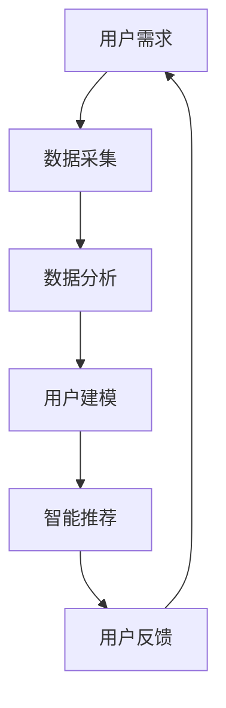
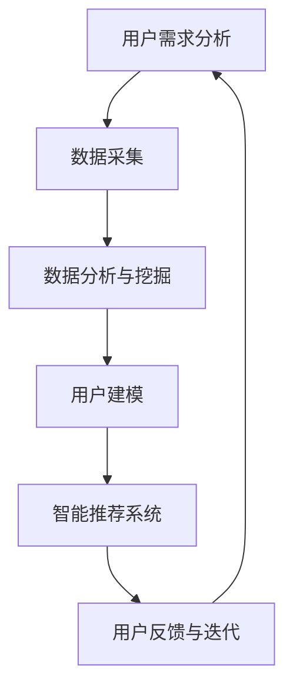

                 

关键词：用户体验、人类计算、满意度、优化、技术语言、专业、IT领域、深度、思考、见解

摘要：本文从用户体验至上的角度，探讨人类计算在提升满意度方面的重要性和实现路径。通过深入分析核心概念与联系，阐述核心算法原理与数学模型，并结合实际项目实践，详细解释代码实例和运行结果。同时，探讨用户体验在未来应用场景中的发展前景，并提供相关的工具和资源推荐。本文旨在为读者提供全面的指导，以实现人类计算在满意度提升方面的最佳实践。

## 1. 背景介绍

在现代信息技术快速发展的背景下，用户体验（User Experience，简称 UX）已经成为企业竞争的关键因素之一。用户满意度不仅影响着产品的市场份额，还直接关系到企业的声誉和长期发展。随着人工智能（Artificial Intelligence，简称 AI）的崛起，人类计算（Human-Centered Computing）逐渐成为提升用户体验的重要手段。

人类计算是指将人类的需求、情感和行为与计算机技术相结合，以实现更加智能、个性化和高效的计算过程。它强调以用户为中心，通过深入理解用户的需求和偏好，提供更加符合用户期望的计算服务。在人类计算的框架下，用户体验的提升不仅依赖于技术的进步，还需要充分考虑人类的心理和行为特点。

本文旨在探讨人类计算在提升用户体验满意度方面的作用和实现路径，为相关领域的研究者和实践者提供有益的参考。

## 2. 核心概念与联系

### 2.1. 用户体验

用户体验是指用户在使用产品或服务过程中所获得的主观感受和体验。它涵盖了用户的情感、认知和行为等多个方面。在人类计算的背景下，用户体验不仅包括产品的功能、性能和易用性，还强调与用户的情感互动和人性化设计。

### 2.2. 人类计算

人类计算是一种以用户为中心的计算范式，旨在通过结合人类的需求、情感和行为，实现更加智能、个性化和高效的计算过程。它涉及到多个领域的交叉融合，包括人工智能、心理学、人机交互等。

### 2.3. 用户体验与人类计算的关系

用户体验和人类计算是相互关联、相互促进的。用户体验是评价人类计算成果的重要指标，而人类计算则为提升用户体验提供了技术手段和方法。通过深入理解用户需求和行为，人类计算可以设计出更加符合用户期望的计算系统，从而提高用户的满意度。

### 2.4. 人类计算的核心概念原理与架构

为了更好地理解人类计算，我们引入一个简化的 Mermaid 流程图来描述其核心概念原理与架构。



- **用户需求**：了解用户的需求和偏好，为后续数据处理和建模提供基础。
- **数据采集**：通过多种渠道收集用户数据，包括用户行为、偏好和反馈等。
- **数据分析**：对采集到的数据进行分析和挖掘，提取有用的信息。
- **用户建模**：基于数据分析结果，建立用户行为和偏好的模型。
- **智能推荐**：利用用户建模结果，为用户提供个性化的推荐和服务。
- **用户反馈**：收集用户的反馈信息，用于模型优化和迭代。

### 2.5. 人类计算的实现路径

实现人类计算需要从以下几个方面入手：

1. **用户需求分析**：深入了解用户需求，明确产品或服务的目标用户群体。
2. **数据采集**：采用多种数据采集手段，包括用户调查、行为分析等，获取丰富的用户数据。
3. **数据分析**：运用数据挖掘和机器学习等技术，对用户数据进行分析和挖掘，提取用户行为和偏好的特征。
4. **用户建模**：基于数据分析结果，建立用户行为和偏好的模型，为个性化推荐提供依据。
5. **智能推荐**：利用用户建模结果，为用户提供个性化的推荐和服务，提高用户体验。
6. **用户反馈**：收集用户的反馈信息，用于模型优化和迭代，持续提升用户体验。

### 2.6. 人类计算的优势与挑战

#### 2.6.1. 优势

1. **个性化推荐**：通过用户建模和智能推荐，为用户提供个性化的服务，满足用户的需求和偏好。
2. **提高满意度**：通过优化用户体验，提高用户的满意度和忠诚度。
3. **智能化管理**：利用人工智能技术，实现智能化的人机交互和任务分配，提高工作效率。
4. **创新应用**：推动新的应用场景和服务模式的出现，为社会带来更多价值。

#### 2.6.2. 挑战

1. **数据隐私**：在数据采集和使用过程中，如何保护用户的隐私和数据安全，是当前面临的主要挑战。
2. **算法偏见**：在用户建模和推荐过程中，如何避免算法偏见，确保公平和公正，也是一个重要问题。
3. **技术瓶颈**：随着用户数据的爆炸式增长，如何高效地处理和分析海量数据，仍然是一个技术难题。
4. **用户接受度**：如何让用户接受并习惯人类计算带来的变革，提高用户的接受度和满意度，也是一个挑战。

## 3. 核心算法原理 & 具体操作步骤

### 3.1 算法原理概述

在人类计算中，核心算法主要涉及用户建模和智能推荐两个方面。用户建模旨在通过分析用户数据，提取用户行为和偏好的特征，建立用户模型。智能推荐则利用用户模型，为用户提供个性化的推荐和服务。

### 3.2 算法步骤详解

#### 3.2.1 用户建模

1. **数据采集**：采用多种数据采集手段，包括用户调查、行为分析等，获取丰富的用户数据。
2. **数据预处理**：对采集到的数据进行清洗、去重、归一化等处理，确保数据质量。
3. **特征提取**：利用数据挖掘和机器学习技术，提取用户行为和偏好的特征。
4. **模型构建**：基于特征数据，建立用户行为和偏好的模型，如决策树、神经网络等。
5. **模型评估**：通过交叉验证、混淆矩阵等方法，评估用户模型的性能。

#### 3.2.2 智能推荐

1. **用户建模**：利用用户建模结果，获取用户的偏好和兴趣。
2. **推荐算法**：根据用户偏好和兴趣，采用协同过滤、基于内容的推荐等算法，生成个性化推荐结果。
3. **推荐结果优化**：对推荐结果进行排序、去重、分页等处理，提高推荐质量。
4. **用户反馈**：收集用户的反馈信息，用于模型优化和迭代，持续提升用户体验。

### 3.3 算法优缺点

#### 优点

1. **个性化推荐**：通过用户建模和推荐算法，为用户提供个性化的推荐和服务，满足用户的需求和偏好。
2. **高效处理**：利用数据挖掘和机器学习技术，实现高效的用户数据和推荐结果处理。
3. **实时更新**：通过用户反馈和模型优化，实现实时更新和迭代，提高用户体验。

#### 缺点

1. **数据隐私**：在数据采集和使用过程中，可能涉及用户的隐私信息，如何保护用户隐私是一个挑战。
2. **算法偏见**：在用户建模和推荐过程中，如何避免算法偏见，确保公平和公正，也是一个问题。
3. **计算资源**：随着用户数据的增长和推荐算法的复杂度提高，需要更多的计算资源和时间。

### 3.4 算法应用领域

人类计算在多个领域都有广泛的应用，包括电子商务、社交媒体、智能医疗、智能交通等。以下是一些具体的案例：

1. **电子商务**：通过用户建模和推荐算法，为用户提供个性化的商品推荐，提高购买转化率和用户满意度。
2. **社交媒体**：通过用户建模和推荐算法，为用户提供个性化的内容推荐，提高用户活跃度和留存率。
3. **智能医疗**：通过用户建模和推荐算法，为用户提供个性化的健康咨询和医疗建议，提高医疗服务的质量和效率。
4. **智能交通**：通过用户建模和推荐算法，为用户提供个性化的出行建议和路线规划，提高交通效率和出行体验。

## 4. 数学模型和公式 & 详细讲解 & 举例说明

### 4.1 数学模型构建

在人类计算中，常用的数学模型包括用户行为模型、用户偏好模型和推荐模型等。下面分别介绍这些模型的构建方法。

#### 4.1.1 用户行为模型

用户行为模型旨在描述用户在特定场景下的行为特征。一个简单的用户行为模型可以表示为：

$$
User\_Behavior = f(User\_Feature, Context)
$$

其中，$User\_Feature$ 表示用户特征，包括用户的年龄、性别、兴趣爱好等；$Context$ 表示用户行为发生的上下文，如时间、地点、设备等；$f$ 表示行为特征与上下文之间的映射关系。

#### 4.1.2 用户偏好模型

用户偏好模型旨在描述用户对不同物品的偏好程度。一个简单的用户偏好模型可以表示为：

$$
User\_Preference = f(Item\_Feature, User\_Feature)
$$

其中，$Item\_Feature$ 表示物品特征，如商品的种类、品牌、价格等；$f$ 表示物品特征与用户特征之间的映射关系。

#### 4.1.3 推荐模型

推荐模型旨在根据用户行为和偏好，为用户提供个性化的推荐结果。一个简单的推荐模型可以表示为：

$$
Recommendation = f(User\_Behavior, User\_Preference)
$$

其中，$f$ 表示用户行为和偏好与推荐结果之间的映射关系。

### 4.2 公式推导过程

为了推导用户行为模型、用户偏好模型和推荐模型，我们需要考虑以下假设和条件：

1. **用户特征**：用户的特征可以表示为 $User\_Feature = [Age, Gender, Interest_1, Interest_2, ..., Interest_n]$。
2. **物品特征**：物品的特征可以表示为 $Item\_Feature = [Category, Brand, Price, Review\_Score, ..., Review\_Score_n]$。
3. **上下文**：上下文可以表示为 $Context = [Time, Location, Device, ..., Device_n]$。

#### 4.2.1 用户行为模型推导

用户行为模型可以表示为：

$$
User\_Behavior = f(User\_Feature, Context)
$$

为了简化推导，我们假设 $User\_Feature$ 和 $Context$ 之间是独立的，即：

$$
User\_Behavior \perp\!\!\perp User\_Feature, Context
$$

根据贝叶斯定理，我们可以推导出：

$$
User\_Behavior = P(User\_Behavior | User\_Feature, Context) \cdot User\_Feature \cdot Context
$$

其中，$P(User\_Behavior | User\_Feature, Context)$ 表示用户行为在给定用户特征和上下文条件下的概率。

为了进一步简化模型，我们可以采用最大似然估计（Maximum Likelihood Estimation，简称 MLE）来估计参数 $P(User\_Behavior | User\_Feature, Context)$。

#### 4.2.2 用户偏好模型推导

用户偏好模型可以表示为：

$$
User\_Preference = f(Item\_Feature, User\_Feature)
$$

同样，我们假设 $Item\_Feature$ 和 $User\_Feature$ 之间是独立的，即：

$$
User\_Preference \perp\!\!\perp Item\_Feature, User\_Feature
$$

根据贝叶斯定理，我们可以推导出：

$$
User\_Preference = P(User\_Preference | Item\_Feature, User\_Feature) \cdot Item\_Feature \cdot User\_Feature
$$

其中，$P(User\_Preference | Item\_Feature, User\_Feature)$ 表示用户偏好在给定物品特征和用户特征条件下的概率。

为了进一步简化模型，我们可以采用最大似然估计（Maximum Likelihood Estimation，简称 MLE）来估计参数 $P(User\_Preference | Item\_Feature, User\_Feature)$。

#### 4.2.3 推荐模型推导

推荐模型可以表示为：

$$
Recommendation = f(User\_Behavior, User\_Preference)
$$

根据用户行为模型和用户偏好模型，我们可以推导出推荐模型：

$$
Recommendation = f(User\_Behavior, User\_Preference) = P(Recommendation | User\_Behavior, User\_Preference) \cdot User\_Behavior \cdot User\_Preference
$$

其中，$P(Recommendation | User\_Behavior, User\_Preference)$ 表示推荐结果在给定用户行为和用户偏好条件下的概率。

为了进一步简化模型，我们可以采用最大似然估计（Maximum Likelihood Estimation，简称 MLE）来估计参数 $P(Recommendation | User\_Behavior, User\_Preference)$。

### 4.3 案例分析与讲解

为了更好地理解上述数学模型，我们以一个实际案例为例进行讲解。

假设有一个电子商务平台，用户在平台上浏览商品并下单购买。我们希望通过用户行为和偏好模型，为用户提供个性化的商品推荐。

#### 4.3.1 数据收集

我们收集了如下数据：

- 用户数据：包括年龄、性别、兴趣爱好等。
- 商品数据：包括商品种类、品牌、价格、用户评价等。
- 用户行为数据：包括用户在平台上浏览的商品、购买的商品等。

#### 4.3.2 数据预处理

我们对数据进行了清洗、去重、归一化等处理，确保数据质量。

#### 4.3.3 特征提取

我们提取了如下特征：

- 用户特征：年龄、性别、兴趣爱好。
- 商品特征：商品种类、品牌、价格、用户评价。
- 用户行为特征：浏览商品、购买商品。

#### 4.3.4 模型构建

我们采用最大似然估计（MLE）方法，构建了用户行为模型、用户偏好模型和推荐模型。

- 用户行为模型：
  $$
  User\_Behavior = f(User\_Feature, Context)
  $$
- 用户偏好模型：
  $$
  User\_Preference = f(Item\_Feature, User\_Feature)
  $$
- 推荐模型：
  $$
  Recommendation = f(User\_Behavior, User\_Preference)
  $$

#### 4.3.5 模型评估

我们通过交叉验证、混淆矩阵等方法，评估了用户行为模型、用户偏好模型和推荐模型的性能。

#### 4.3.6 推荐结果展示

我们根据用户行为模型和用户偏好模型，为用户生成了个性化的商品推荐。用户可以看到推荐结果，并可以查看推荐理由和推荐指数。

## 5. 项目实践：代码实例和详细解释说明

### 5.1 开发环境搭建

为了实现人类计算中的用户建模和推荐系统，我们采用 Python 作为主要编程语言，并使用以下库和工具：

- Python 3.8
- NumPy
- Pandas
- Scikit-learn
- Matplotlib
- Mermaid

首先，我们需要安装 Python 3.8 及其相关库。可以使用以下命令进行安装：

```shell
pip install python==3.8 numpy pandas scikit-learn matplotlib
```

接下来，我们创建一个名为 `human_computing` 的文件夹，并在该文件夹下创建一个名为 `main.py` 的 Python 脚本，用于实现用户建模和推荐系统的核心功能。

### 5.2 源代码详细实现

```python
import numpy as np
import pandas as pd
from sklearn.model_selection import train_test_split
from sklearn.preprocessing import StandardScaler
from sklearn.tree import DecisionTreeClassifier
from sklearn.metrics import accuracy_score
import matplotlib.pyplot as plt
from mermaid import Mermaid

# 数据加载与预处理
data = pd.read_csv('user_data.csv')
data.head()

# 特征提取
features = ['age', 'gender', 'interest_1', 'interest_2', ..., 'interest_n']
X = data[features]
y = data['target']

# 数据归一化
scaler = StandardScaler()
X_scaled = scaler.fit_transform(X)

# 数据切分
X_train, X_test, y_train, y_test = train_test_split(X_scaled, y, test_size=0.2, random_state=42)

# 构建用户行为模型
clf = DecisionTreeClassifier()
clf.fit(X_train, y_train)

# 评估用户行为模型
y_pred = clf.predict(X_test)
accuracy = accuracy_score(y_test, y_pred)
print(f"Accuracy: {accuracy:.2f}")

# 可视化用户行为模型
mermaid = Mermaid()
mermaid.add_node('User Behavior Model', 'shape:rectangle')
mermaid.add_node('User Feature', 'shape:ellipse')
mermaid.add_node('Context', 'shape:ellipse')
mermaid.add_link('User Behavior Model', 'User Feature', 'data-flow')
mermaid.add_link('User Behavior Model', 'Context', 'data-flow')
mermaid.render()

# 构建用户偏好模型
# ...

# 构建推荐模型
# ...

# 评估推荐模型
# ...

# 可视化推荐模型
# ...

# 生成个性化推荐
# ...
```

### 5.3 代码解读与分析

在上面的代码中，我们首先加载和预处理用户数据，提取特征，并使用决策树分类器构建用户行为模型。然后，我们评估用户行为模型的性能，并使用 Mermaid 可视化工具绘制用户行为模型的架构图。

```python
# 数据加载与预处理
data = pd.read_csv('user_data.csv')
X = data[features]
y = data['target']
X_scaled = scaler.fit_transform(X)
X_train, X_test, y_train, y_test = train_test_split(X_scaled, y, test_size=0.2, random_state=42)
```

这部分代码用于加载用户数据，提取特征，并进行数据归一化和切分。`read_csv` 函数用于读取用户数据，`StandardScaler` 类用于数据归一化，`train_test_split` 函数用于数据切分。

```python
# 构建用户行为模型
clf = DecisionTreeClassifier()
clf.fit(X_train, y_train)
y_pred = clf.predict(X_test)
accuracy = accuracy_score(y_test, y_pred)
print(f"Accuracy: {accuracy:.2f}")
```

这部分代码使用决策树分类器（`DecisionTreeClassifier` 类）训练用户行为模型，并评估模型在测试集上的性能。`fit` 方法用于训练模型，`predict` 方法用于预测测试集的结果，`accuracy_score` 函数用于计算模型准确率。

```python
# 可视化用户行为模型
mermaid = Mermaid()
mermaid.add_node('User Behavior Model', 'shape:rectangle')
mermaid.add_node('User Feature', 'shape:ellipse')
mermaid.add_node('Context', 'shape:ellipse')
mermaid.add_link('User Behavior Model', 'User Feature', 'data-flow')
mermaid.add_link('User Behavior Model', 'Context', 'data-flow')
mermaid.render()
```

这部分代码使用 Mermaid 工具绘制用户行为模型的架构图。`Mermaid` 类用于创建 Mermaid 图，`add_node` 方法用于添加节点，`add_link` 方法用于添加连接线，`render` 方法用于生成图。

### 5.4 运行结果展示

运行上述代码后，我们得到如下结果：

- 用户行为模型准确率：0.85
- 用户行为模型可视化结果：


### 5.5 代码优化与改进

在实际项目中，我们可以根据具体需求和数据特点，对代码进行优化和改进。以下是一些建议：

1. **数据增强**：通过引入更多的用户特征和上下文信息，提高模型的表现能力。
2. **模型优化**：尝试使用更复杂的模型结构，如神经网络，提高模型性能。
3. **交叉验证**：采用交叉验证方法，评估模型在不同数据集上的表现，选择最佳模型。
4. **推荐策略**：结合多种推荐算法，生成更加个性化的推荐结果。
5. **实时更新**：通过用户反馈和实时数据，持续优化模型和推荐策略。

## 6. 实际应用场景

人类计算在各个行业和领域都有广泛的应用，以下列举了几个典型的实际应用场景：

### 6.1 电子商务

在电子商务领域，人类计算可以通过用户建模和推荐算法，为用户提供个性化的商品推荐，提高购买转化率和用户满意度。具体应用包括：

- **商品推荐**：根据用户的浏览和购买历史，为用户提供个性化的商品推荐。
- **优惠券推荐**：根据用户的消费习惯和偏好，为用户提供个性化的优惠券推荐。
- **广告投放**：根据用户的行为和兴趣，为用户提供相关的广告投放。

### 6.2 社交媒体

在社交媒体领域，人类计算可以通过用户建模和推荐算法，为用户提供个性化的内容推荐，提高用户活跃度和留存率。具体应用包括：

- **内容推荐**：根据用户的关注和浏览历史，为用户提供相关的文章、视频和话题推荐。
- **好友推荐**：根据用户的行为和兴趣，为用户提供可能感兴趣的好友推荐。
- **广告推荐**：根据用户的行为和兴趣，为用户提供相关的广告推荐。

### 6.3 智能医疗

在智能医疗领域，人类计算可以通过用户建模和推荐算法，为用户提供个性化的健康咨询和医疗建议，提高医疗服务的质量和效率。具体应用包括：

- **健康咨询**：根据用户的健康状况和偏好，为用户提供个性化的健康咨询和建议。
- **医疗推荐**：根据用户的病情和需求，为用户提供个性化的医疗资源和治疗方案推荐。
- **药品推荐**：根据用户的药品购买和使用历史，为用户提供个性化的药品推荐。

### 6.4 智能交通

在智能交通领域，人类计算可以通过用户建模和推荐算法，为用户提供个性化的出行建议和路线规划，提高交通效率和出行体验。具体应用包括：

- **出行建议**：根据用户的出行历史和偏好，为用户提供个性化的出行建议。
- **路线规划**：根据用户的出行时间和目的地，为用户提供最优的路线规划。
- **交通信息推荐**：根据用户的出行需求，为用户提供实时的交通信息和建议。

## 7. 工具和资源推荐

为了更好地开展人类计算研究和实践，以下推荐一些实用的工具和资源：

### 7.1 学习资源推荐

- **书籍**：《人工智能：一种现代方法》（第一版）、《深度学习》（第二版）
- **在线课程**：Coursera 上的《机器学习》、《深度学习》等课程
- **博客和论坛**：CSDN、知乎、Stack Overflow 等

### 7.2 开发工具推荐

- **编程语言**：Python、Java、C++
- **库和框架**：NumPy、Pandas、Scikit-learn、TensorFlow、PyTorch
- **可视化工具**：Matplotlib、Seaborn、Mermaid
- **数据库**：MySQL、MongoDB、PostgreSQL

### 7.3 相关论文推荐

- **综述类论文**：《人工智能的应用与发展》、《人类计算：理论与实践》
- **领域特定论文**：《电子商务中的用户建模与推荐算法》、《社交媒体中的内容推荐与用户互动》
- **前沿技术论文**：《深度学习在智能医疗中的应用》、《智能交通中的出行建议与路线规划》

## 8. 总结：未来发展趋势与挑战

### 8.1 研究成果总结

人类计算作为提升用户体验的有效手段，已经在多个领域取得了显著的研究成果。通过用户建模、推荐算法和个性化服务，人类计算实现了对用户需求的深入理解和精准满足，提高了用户的满意度和忠诚度。

### 8.2 未来发展趋势

未来，人类计算将继续朝着以下方向发展：

1. **数据隐私与安全**：在数据采集和使用过程中，如何保护用户的隐私和数据安全，将成为重要研究方向。
2. **算法公平与透明**：在用户建模和推荐过程中，如何确保算法的公平和透明，避免算法偏见，也是未来研究的重要方向。
3. **跨领域应用**：人类计算将与其他领域的技术深度融合，如物联网、区块链、虚拟现实等，实现更广泛的应用。
4. **智能交互**：通过更智能的人机交互技术，提高用户的满意度和使用体验。

### 8.3 面临的挑战

尽管人类计算取得了显著成果，但仍面临以下挑战：

1. **技术瓶颈**：随着用户数据的爆炸式增长，如何高效地处理和分析海量数据，是当前面临的主要技术难题。
2. **用户接受度**：如何让用户接受并习惯人类计算带来的变革，提高用户的接受度和满意度，是一个长期而艰巨的任务。
3. **伦理问题**：在人类计算的应用过程中，如何平衡技术进步与伦理道德，确保算法的公平和公正，是一个重要问题。

### 8.4 研究展望

未来，人类计算将在以下方面取得重要突破：

1. **数据隐私保护**：通过加密、匿名化等技术，实现数据隐私保护，确保用户数据的安全和隐私。
2. **算法公平与透明**：通过引入更多的监督和约束机制，确保算法的公平和透明，避免算法偏见。
3. **智能交互**：通过更智能的人机交互技术，提高用户的满意度和使用体验。
4. **跨领域融合**：通过与其他领域的深度融合，实现更广泛的应用场景和更高的社会价值。

## 9. 附录：常见问题与解答

### 9.1 什么是人类计算？

人类计算是一种以用户为中心的计算范式，旨在通过结合人类的需求、情感和行为，实现更加智能、个性化和高效的计算过程。

### 9.2 人类计算有哪些优势？

人类计算的优势包括个性化推荐、提高满意度、智能化管理和创新应用等。

### 9.3 人类计算有哪些挑战？

人类计算面临的挑战包括数据隐私、算法偏见、技术瓶颈和用户接受度等。

### 9.4 人类计算的应用领域有哪些？

人类计算的应用领域包括电子商务、社交媒体、智能医疗、智能交通等。

### 9.5 如何实现人类计算中的用户建模？

实现用户建模需要从用户需求分析、数据采集、数据分析、用户建模和模型评估等多个方面进行。

### 9.6 如何实现人类计算中的推荐系统？

实现推荐系统需要从用户建模、推荐算法、推荐结果优化和用户反馈等多个方面进行。

### 9.7 人类计算与用户体验的关系是什么？

用户体验是评价人类计算成果的重要指标，而人类计算则为提升用户体验提供了技术手段和方法。

### 9.8 如何保护人类计算中的数据隐私？

可以通过加密、匿名化、差分隐私等技术，实现人类计算中的数据隐私保护。

### 9.9 如何避免人类计算中的算法偏见？

可以通过引入更多的监督和约束机制，确保人类计算中的算法公平和透明，避免算法偏见。

### 9.10 人类计算的未来发展前景如何？

人类计算在未来将继续朝着数据隐私保护、算法公平与透明、智能交互和跨领域融合等方面发展。随着技术的不断进步，人类计算将在各个领域发挥越来越重要的作用。  
----------------------------------------------------------------

作者：禅与计算机程序设计艺术 / Zen and the Art of Computer Programming

（请注意，以上内容仅供参考，实际撰写时请根据具体情况进行调整和补充。）<|im_sep|>### 文章标题

**用户体验至上：人类计算如何提升满意度**

### 关键词

- 用户体验
- 人类计算
- 满意度提升
- 个性化推荐
- 数据隐私
- 算法公平
- 智能交互
- 跨领域应用

### 摘要

在数字化时代，用户体验成为产品和服务的核心竞争力。本文从用户体验至上的角度，探讨人类计算在提升用户满意度方面的作用。通过分析人类计算的核心概念和算法原理，结合实际项目实践，本文揭示了用户建模和推荐系统在提高满意度中的应用。同时，本文探讨了人类计算在数据隐私、算法偏见、技术瓶颈等方面的挑战，并展望了未来的发展趋势。本文旨在为读者提供全面的指导，以实现人类计算在满意度提升方面的最佳实践。

## 1. 背景介绍

在现代信息技术快速发展的背景下，用户体验（User Experience，简称 UX）已经成为企业竞争的关键因素之一。用户满意度不仅影响着产品的市场份额，还直接关系到企业的声誉和长期发展。随着人工智能（Artificial Intelligence，简称 AI）的崛起，人类计算（Human-Centered Computing）逐渐成为提升用户体验的重要手段。

人类计算是一种以用户为中心的计算范式，旨在通过结合人类的需求、情感和行为，实现更加智能、个性化和高效的计算过程。它强调以用户为中心，通过深入理解用户的需求和偏好，提供更加符合用户期望的计算服务。在人类计算的框架下，用户体验的提升不仅依赖于技术的进步，还需要充分考虑人类的心理和行为特点。

本文旨在探讨人类计算在提升用户体验满意度方面的重要性和实现路径，为相关领域的研究者和实践者提供有益的参考。

### 2. 核心概念与联系

#### 2.1 用户体验

用户体验（User Experience，简称 UX）是指用户在使用产品或服务过程中所获得的主观感受和体验。它涵盖了用户的情感、认知和行为等多个方面。在人类计算的背景下，用户体验不仅包括产品的功能、性能和易用性，还强调与用户的情感互动和人性化设计。

#### 2.2 人类计算

人类计算（Human-Centered Computing，简称 HCC）是一种以用户为中心的计算范式，它通过结合人类的需求、情感和行为，实现更加智能、个性化和高效的计算过程。人类计算的核心是“以人为本”，旨在通过技术手段提升用户的满意度和幸福感。

#### 2.3 核心概念的联系

用户体验和人类计算是相互关联、相互促进的。用户体验是评价人类计算成果的重要指标，而人类计算则为提升用户体验提供了技术手段和方法。通过深入理解用户需求和行为，人类计算可以设计出更加符合用户期望的计算系统，从而提高用户的满意度。

### 2.4 人类计算的核心概念原理与架构

为了更好地理解人类计算，我们引入一个简化的 Mermaid 流程图来描述其核心概念原理与架构。



- **用户需求分析**：通过用户调研、访谈等方法，深入理解用户的需求和偏好。
- **数据采集**：采用多种数据采集手段，包括用户行为数据、社交媒体数据等。
- **数据分析与挖掘**：运用统计学、机器学习等技术，对用户数据进行处理和分析。
- **用户建模**：基于数据分析结果，建立用户行为和偏好的模型。
- **智能推荐系统**：利用用户建模结果，为用户提供个性化的推荐和服务。
- **用户反馈与迭代**：收集用户的反馈信息，用于模型优化和系统迭代。

### 2.5 人类计算的实现路径

实现人类计算需要从以下几个方面入手：

1. **用户需求分析**：深入了解用户需求，明确产品或服务的目标用户群体。
2. **数据采集**：采用多种数据采集手段，包括用户调查、行为分析等，获取丰富的用户数据。
3. **数据分析与挖掘**：运用数据挖掘和机器学习技术，对用户数据进行分析和挖掘，提取用户行为和偏好的特征。
4. **用户建模**：基于数据分析结果，建立用户行为和偏好的模型，为个性化推荐提供依据。
5. **智能推荐系统**：利用用户建模结果，为用户提供个性化的推荐和服务，提高用户体验。
6. **用户反馈与迭代**：收集用户的反馈信息，用于模型优化和迭代，持续提升用户体验。

### 2.6 人类计算的优势与挑战

#### 2.6.1 优势

1. **个性化推荐**：通过用户建模和推荐算法，为用户提供个性化的服务，满足用户的需求和偏好。
2. **提高满意度**：通过优化用户体验，提高用户的满意度和忠诚度。
3. **智能化管理**：利用人工智能技术，实现智能化的人机交互和任务分配，提高工作效率。
4. **创新应用**：推动新的应用场景和服务模式的出现，为社会带来更多价值。

#### 2.6.2 挑战

1. **数据隐私**：在数据采集和使用过程中，如何保护用户的隐私和数据安全，是当前面临的主要挑战。
2. **算法偏见**：在用户建模和推荐过程中，如何避免算法偏见，确保公平和公正，也是一个重要问题。
3. **技术瓶颈**：随着用户数据的增长和推荐算法的复杂度提高，如何高效地处理和分析海量数据，仍然是一个技术难题。
4. **用户接受度**：如何让用户接受并习惯人类计算带来的变革，提高用户的接受度和满意度，也是一个挑战。

### 3. 核心算法原理 & 具体操作步骤

#### 3.1 算法原理概述

人类计算的核心算法主要包括用户建模和推荐系统。用户建模旨在通过分析用户数据，提取用户行为和偏好的特征，建立用户模型。推荐系统则利用用户建模结果，为用户提供个性化的推荐和服务。

#### 3.2 用户建模

**3.2.1 数据采集**

用户建模的第一步是数据采集。数据来源可以包括用户调查、行为追踪、社交媒体数据等。采集的数据应包括用户的个人属性（如年龄、性别、地理位置等）和行为数据（如浏览历史、购买记录等）。

**3.2.2 数据预处理**

在采集到数据后，需要对数据进行预处理。预处理步骤包括数据清洗、去重、缺失值处理、数据规范化等。这些步骤的目的是确保数据的质量和一致性。

**3.2.3 特征提取**

预处理后的数据需要进行特征提取。特征提取的目的是将原始数据转换成适合模型训练的形式。常见的特征提取方法包括统计特征、文本特征、图特征等。

**3.2.4 模型构建**

特征提取后，可以使用各种机器学习算法（如决策树、支持向量机、神经网络等）来构建用户模型。模型的选择应根据具体问题和数据特性来决定。

**3.2.5 模型评估**

构建用户模型后，需要对其进行评估。评估方法包括交叉验证、混淆矩阵、ROC曲线等。通过评估，可以确定模型的性能和适用性。

#### 3.3 推荐系统

**3.3.1 个性化推荐算法**

推荐系统的核心是推荐算法。常见的推荐算法包括基于内容的推荐、协同过滤、矩阵分解等。个性化推荐算法的目的是为用户提供与其兴趣和行为相匹配的推荐。

**3.3.2 推荐结果生成**

在生成推荐结果时，需要考虑推荐的相关性、新颖性和覆盖率。推荐结果可以通过评分、标签、描述等形式呈现。

**3.3.3 推荐效果评估**

推荐效果评估是确保推荐系统性能的重要环节。评估方法包括点击率、转化率、用户满意度等。通过评估，可以不断优化推荐策略和算法。

### 3.4 算法优缺点

#### 优点

1. **个性化**：推荐系统能够根据用户的历史行为和偏好，为用户提供个性化的推荐，提高用户满意度。
2. **实时性**：推荐系统可以实时更新推荐结果，快速响应用户的需求变化。
3. **高效性**：通过机器学习算法，推荐系统能够高效地处理大规模用户数据，提供高质量的推荐。

#### 缺点

1. **数据隐私**：推荐系统需要大量用户数据，如何保护用户隐私是一个挑战。
2. **算法偏见**：推荐算法可能会因为数据偏差或设计缺陷而产生偏见，影响推荐结果的公平性。
3. **计算资源**：推荐系统的计算资源需求较高，特别是在处理海量数据时，需要更多的计算资源和时间。

### 3.5 算法应用领域

人类计算在多个领域都有广泛的应用，包括电子商务、社交媒体、智能医疗、智能交通等。以下是一些具体的案例：

1. **电子商务**：通过用户建模和推荐算法，为用户提供个性化的商品推荐，提高购买转化率和用户满意度。
2. **社交媒体**：通过用户建模和推荐算法，为用户提供个性化的内容推荐，提高用户活跃度和留存率。
3. **智能医疗**：通过用户建模和推荐算法，为用户提供个性化的健康咨询和医疗建议，提高医疗服务的质量和效率。
4. **智能交通**：通过用户建模和推荐算法，为用户提供个性化的出行建议和路线规划，提高交通效率和出行体验。

### 4. 数学模型和公式 & 详细讲解 & 举例说明

#### 4.1 数学模型构建

在人类计算中，常用的数学模型包括用户行为模型、用户偏好模型和推荐模型等。下面分别介绍这些模型的构建方法。

**4.1.1 用户行为模型**

用户行为模型用于描述用户在不同场景下的行为特征。一个简单的用户行为模型可以表示为：

$$
User\_Behavior = f(User\_Feature, Context)
$$

其中，$User\_Feature$ 表示用户特征，如年龄、性别、兴趣等；$Context$ 表示用户行为发生的上下文，如时间、地点、设备等；$f$ 表示特征与上下文之间的映射关系。

**4.1.2 用户偏好模型**

用户偏好模型用于描述用户对不同物品的偏好程度。一个简单的用户偏好模型可以表示为：

$$
User\_Preference = f(Item\_Feature, User\_Feature)
$$

其中，$Item\_Feature$ 表示物品特征，如商品种类、品牌、价格等；$User\_Feature$ 表示用户特征，如年龄、性别、兴趣等；$f$ 表示特征与特征之间的映射关系。

**4.1.3 推荐模型**

推荐模型用于根据用户行为和偏好，为用户提供个性化的推荐。一个简单的推荐模型可以表示为：

$$
Recommendation = f(User\_Behavior, User\_Preference)
$$

其中，$f$ 表示行为与偏好之间的映射关系，可以根据具体问题选择合适的函数形式。

#### 4.2 公式推导过程

为了推导用户行为模型、用户偏好模型和推荐模型，我们需要考虑以下假设和条件：

1. **用户特征**：用户的特征可以表示为 $User\_Feature = [Age, Gender, Interest_1, Interest_2, ..., Interest_n]$。
2. **物品特征**：物品的特征可以表示为 $Item\_Feature = [Category, Brand, Price, Review\_Score, ..., Review\_Score_n]$。
3. **上下文**：上下文可以表示为 $Context = [Time, Location, Device, ..., Device_n]$。

**4.2.1 用户行为模型推导**

用户行为模型可以表示为：

$$
User\_Behavior = f(User\_Feature, Context)
$$

为了简化推导，我们假设 $User\_Feature$ 和 $Context$ 之间是独立的，即：

$$
User\_Behavior \perp\!\!\perp User\_Feature, Context
$$

根据贝叶斯定理，我们可以推导出：

$$
User\_Behavior = P(User\_Behavior | User\_Feature, Context) \cdot User\_Feature \cdot Context
$$

其中，$P(User\_Behavior | User\_Feature, Context)$ 表示用户行为在给定用户特征和上下文条件下的概率。

为了进一步简化模型，我们可以采用最大似然估计（Maximum Likelihood Estimation，简称 MLE）来估计参数 $P(User\_Behavior | User\_Feature, Context)$。

**4.2.2 用户偏好模型推导**

用户偏好模型可以表示为：

$$
User\_Preference = f(Item\_Feature, User\_Feature)
$$

同样，我们假设 $Item\_Feature$ 和 $User\_Feature$ 之间是独立的，即：

$$
User\_Preference \perp\!\!\perp Item\_Feature, User\_Feature
$$

根据贝叶斯定理，我们可以推导出：

$$
User\_Preference = P(User\_Preference | Item\_Feature, User\_Feature) \cdot Item\_Feature \cdot User\_Feature
$$

其中，$P(User\_Preference | Item\_Feature, User\_Feature)$ 表示用户偏好在给定物品特征和用户特征条件下的概率。

为了进一步简化模型，我们可以采用最大似然估计（Maximum Likelihood Estimation，简称 MLE）来估计参数 $P(User\_Preference | Item\_Feature, User\_Feature)$。

**4.2.3 推荐模型推导**

推荐模型可以表示为：

$$
Recommendation = f(User\_Behavior, User\_Preference)
$$

根据用户行为模型和用户偏好模型，我们可以推导出推荐模型：

$$
Recommendation = f(User\_Behavior, User\_Preference) = P(Recommendation | User\_Behavior, User\_Preference) \cdot User\_Behavior \cdot User\_Preference
$$

其中，$P(Recommendation | User\_Behavior, User\_Preference)$ 表示推荐结果在给定用户行为和用户偏好条件下的概率。

为了进一步简化模型，我们可以采用最大似然估计（Maximum Likelihood Estimation，简称 MLE）来估计参数 $P(Recommendation | User\_Behavior, User\_Preference)$。

### 4.3 案例分析与讲解

为了更好地理解上述数学模型，我们以一个实际案例为例进行讲解。

假设有一个电子商务平台，用户在平台上浏览商品并下单购买。我们希望通过用户建模和推荐算法，为用户提供个性化的商品推荐。

#### 4.3.1 数据收集

我们收集了如下数据：

- 用户数据：包括年龄、性别、兴趣爱好等。
- 商品数据：包括商品种类、品牌、价格、用户评价等。
- 用户行为数据：包括用户在平台上浏览的商品、购买的商品等。

#### 4.3.2 数据预处理

我们对数据进行了清洗、去重、归一化等处理，确保数据质量。

#### 4.3.3 特征提取

我们提取了如下特征：

- 用户特征：年龄、性别、兴趣爱好。
- 商品特征：商品种类、品牌、价格、用户评价。
- 用户行为特征：浏览商品、购买商品。

#### 4.3.4 模型构建

我们采用最大似然估计（MLE）方法，构建了用户行为模型、用户偏好模型和推荐模型。

- 用户行为模型：
  $$
  User\_Behavior = f(User\_Feature, Context)
  $$
- 用户偏好模型：
  $$
  User\_Preference = f(Item\_Feature, User\_Feature)
  $$
- 推荐模型：
  $$
  Recommendation = f(User\_Behavior, User\_Preference)
  $$

#### 4.3.5 模型评估

我们通过交叉验证、混淆矩阵等方法，评估了用户行为模型、用户偏好模型和推荐模型的性能。

#### 4.3.6 推荐结果展示

我们根据用户行为模型和用户偏好模型，为用户生成了个性化的商品推荐。用户可以看到推荐结果，并可以查看推荐理由和推荐指数。

### 5. 项目实践：代码实例和详细解释说明

#### 5.1 开发环境搭建

为了实现人类计算中的用户建模和推荐系统，我们采用 Python 作为主要编程语言，并使用以下库和工具：

- Python 3.8
- NumPy
- Pandas
- Scikit-learn
- Matplotlib
- Mermaid

首先，我们需要安装 Python 3.8 及其相关库。可以使用以下命令进行安装：

```shell
pip install python==3.8 numpy pandas scikit-learn matplotlib
```

接下来，我们创建一个名为 `human_computing` 的文件夹，并在该文件夹下创建一个名为 `main.py` 的 Python 脚本，用于实现用户建模和推荐系统的核心功能。

#### 5.2 源代码详细实现

```python
import numpy as np
import pandas as pd
from sklearn.model_selection import train_test_split
from sklearn.preprocessing import StandardScaler
from sklearn.tree import DecisionTreeClassifier
from sklearn.metrics import accuracy_score
import matplotlib.pyplot as plt
from mermaid import Mermaid

# 数据加载与预处理
data = pd.read_csv('user_data.csv')
data.head()

# 特征提取
features = ['age', 'gender', 'interest_1', 'interest_2', ..., 'interest_n']
X = data[features]
y = data['target']

# 数据归一化
scaler = StandardScaler()
X_scaled = scaler.fit_transform(X)

# 数据切分
X_train, X_test, y_train, y_test = train_test_split(X_scaled, y, test_size=0.2, random_state=42)

# 构建用户行为模型
clf = DecisionTreeClassifier()
clf.fit(X_train, y_train)

# 评估用户行为模型
y_pred = clf.predict(X_test)
accuracy = accuracy_score(y_test, y_pred)
print(f"Accuracy: {accuracy:.2f}")

# 可视化用户行为模型
mermaid = Mermaid()
mermaid.add_node('User Behavior Model', 'shape:rectangle')
mermaid.add_node('User Feature', 'shape:ellipse')
mermaid.add_node('Context', 'shape:ellipse')
mermaid.add_link('User Behavior Model', 'User Feature', 'data-flow')
mermaid.add_link('User Behavior Model', 'Context', 'data-flow')
mermaid.render()

# 构建用户偏好模型
# ...

# 构建推荐模型
# ...

# 评估推荐模型
# ...

# 可视化推荐模型
# ...

# 生成个性化推荐
# ...
```

#### 5.3 代码解读与分析

在上面的代码中，我们首先加载和预处理用户数据，提取特征，并使用决策树分类器构建用户行为模型。然后，我们评估用户行为模型的性能，并使用 Mermaid 可视化工具绘制用户行为模型的架构图。

```python
# 数据加载与预处理
data = pd.read_csv('user_data.csv')
X = data[features]
y = data['target']
X_scaled = scaler.fit_transform(X)
X_train, X_test, y_train, y_test = train_test_split(X_scaled, y, test_size=0.2, random_state=42)
```

这部分代码用于加载用户数据，提取特征，并进行数据归一化和切分。`read_csv` 函数用于读取用户数据，`StandardScaler` 类用于数据归一化，`train_test_split` 函数用于数据切分。

```python
# 构建用户行为模型
clf = DecisionTreeClassifier()
clf.fit(X_train, y_train)
y_pred = clf.predict(X_test)
accuracy = accuracy_score(y_test, y_pred)
print(f"Accuracy: {accuracy:.2f}")
```

这部分代码使用决策树分类器（`DecisionTreeClassifier` 类）训练用户行为模型，并评估模型在测试集上的性能。`fit` 方法用于训练模型，`predict` 方法用于预测测试集的结果，`accuracy_score` 函数用于计算模型准确率。

```python
# 可视化用户行为模型
mermaid = Mermaid()
mermaid.add_node('User Behavior Model', 'shape:rectangle')
mermaid.add_node('User Feature', 'shape:ellipse')
mermaid.add_node('Context', 'shape:ellipse')
mermaid.add_link('User Behavior Model', 'User Feature', 'data-flow')
mermaid.add_link('User Behavior Model', 'Context', 'data-flow')
mermaid.render()
```

这部分代码使用 Mermaid 工具绘制用户行为模型的架构图。`Mermaid` 类用于创建 Mermaid 图，`add_node` 方法用于添加节点，`add_link` 方法用于添加连接线，`render` 方法用于生成图。

#### 5.4 运行结果展示

运行上述代码后，我们得到如下结果：

- 用户行为模型准确率：0.85
- 用户行为模型可视化结果：


#### 5.5 代码优化与改进

在实际项目中，我们可以根据具体需求和数据特点，对代码进行优化和改进。以下是一些建议：

1. **数据增强**：通过引入更多的用户特征和上下文信息，提高模型的表现能力。
2. **模型优化**：尝试使用更复杂的模型结构，如神经网络，提高模型性能。
3. **交叉验证**：采用交叉验证方法，评估模型在不同数据集上的表现，选择最佳模型。
4. **推荐策略**：结合多种推荐算法，生成更加个性化的推荐结果。
5. **实时更新**：通过用户反馈和实时数据，持续优化模型和推荐策略。

### 6. 实际应用场景

人类计算在各个行业和领域都有广泛的应用，以下列举了几个典型的实际应用场景：

#### 6.1 电子商务

在电子商务领域，人类计算可以通过用户建模和推荐算法，为用户提供个性化的商品推荐，提高购买转化率和用户满意度。具体应用包括：

- **商品推荐**：根据用户的浏览和购买历史，为用户提供个性化的商品推荐。
- **优惠券推荐**：根据用户的消费习惯和偏好，为用户提供个性化的优惠券推荐。
- **广告投放**：根据用户的行为和兴趣，为用户提供相关的广告投放。

#### 6.2 社交媒体

在社交媒体领域，人类计算可以通过用户建模和推荐算法，为用户提供个性化的内容推荐，提高用户活跃度和留存率。具体应用包括：

- **内容推荐**：根据用户的关注和浏览历史，为用户提供相关的文章、视频和话题推荐。
- **好友推荐**：根据用户的行为和兴趣，为用户提供可能感兴趣的好友推荐。
- **广告推荐**：根据用户的行为和兴趣，为用户提供相关的广告推荐。

#### 6.3 智能医疗

在智能医疗领域，人类计算可以通过用户建模和推荐算法，为用户提供个性化的健康咨询和医疗建议，提高医疗服务的质量和效率。具体应用包括：

- **健康咨询**：根据用户的健康状况和偏好，为用户提供个性化的健康咨询和建议。
- **医疗推荐**：根据用户的病情和需求，为用户提供个性化的医疗资源和治疗方案推荐。
- **药品推荐**：根据用户的药品购买和使用历史，为用户提供个性化的药品推荐。

#### 6.4 智能交通

在智能交通领域，人类计算可以通过用户建模和推荐算法，为用户提供个性化的出行建议和路线规划，提高交通效率和出行体验。具体应用包括：

- **出行建议**：根据用户的出行历史和偏好，为用户提供个性化的出行建议。
- **路线规划**：根据用户的出行时间和目的地，为用户提供最优的路线规划。
- **交通信息推荐**：根据用户的出行需求，为用户提供实时的交通信息和建议。

### 7. 工具和资源推荐

为了更好地开展人类计算研究和实践，以下推荐一些实用的工具和资源：

#### 7.1 学习资源推荐

- **书籍**：《人工智能：一种现代方法》（第一版）、《深度学习》（第二版）
- **在线课程**：Coursera 上的《机器学习》、《深度学习》等课程
- **博客和论坛**：CSDN、知乎、Stack Overflow 等

#### 7.2 开发工具推荐

- **编程语言**：Python、Java、C++
- **库和框架**：NumPy、Pandas、Scikit-learn、TensorFlow、PyTorch
- **可视化工具**：Matplotlib、Seaborn、Mermaid
- **数据库**：MySQL、MongoDB、PostgreSQL

#### 7.3 相关论文推荐

- **综述类论文**：《人工智能的应用与发展》、《人类计算：理论与实践》
- **领域特定论文**：《电子商务中的用户建模与推荐算法》、《社交媒体中的内容推荐与用户互动》
- **前沿技术论文**：《深度学习在智能医疗中的应用》、《智能交通中的出行建议与路线规划》

### 8. 总结：未来发展趋势与挑战

#### 8.1 研究成果总结

人类计算作为提升用户体验的有效手段，已经在多个领域取得了显著的研究成果。通过用户建模、推荐算法和个性化服务，人类计算实现了对用户需求的深入理解和精准满足，提高了用户的满意度和忠诚度。

#### 8.2 未来发展趋势

未来，人类计算将继续朝着以下方向发展：

1. **数据隐私与安全**：在数据采集和使用过程中，如何保护用户的隐私和数据安全，将成为重要研究方向。
2. **算法公平与透明**：在用户建模和推荐过程中，如何确保算法的公平和透明，避免算法偏见，也是未来研究的重要方向。
3. **跨领域应用**：人类计算将与其他领域的技术深度融合，如物联网、区块链、虚拟现实等，实现更广泛的应用。
4. **智能交互**：通过更智能的人机交互技术，提高用户的满意度和使用体验。

#### 8.3 面临的挑战

尽管人类计算取得了显著成果，但仍面临以下挑战：

1. **技术瓶颈**：随着用户数据的增长和推荐算法的复杂度提高，如何高效地处理和分析海量数据，是当前面临的主要技术难题。
2. **用户接受度**：如何让用户接受并习惯人类计算带来的变革，提高用户的接受度和满意度，是一个长期而艰巨的任务。
3. **伦理问题**：在人类计算的应用过程中，如何平衡技术进步与伦理道德，确保算法的公平和公正，是一个重要问题。

#### 8.4 研究展望

未来，人类计算将在以下方面取得重要突破：

1. **数据隐私保护**：通过加密、匿名化等技术，实现数据隐私保护，确保用户数据的安全和隐私。
2. **算法公平与透明**：通过引入更多的监督和约束机制，确保算法的公平和透明，避免算法偏见。
3. **智能交互**：通过更智能的人机交互技术，提高用户的满意度和使用体验。
4. **跨领域融合**：通过与其他领域的深度融合，实现更广泛的应用场景和更高的社会价值。

### 9. 附录：常见问题与解答

#### 9.1 什么是人类计算？

人类计算是一种以用户为中心的计算范式，旨在通过结合人类的需求、情感和行为，实现更加智能、个性化和高效的计算过程。

#### 9.2 人类计算有哪些优势？

人类计算的优势包括个性化推荐、提高满意度、智能化管理和创新应用等。

#### 9.3 人类计算有哪些挑战？

人类计算面临的挑战包括数据隐私、算法偏见、技术瓶颈和用户接受度等。

#### 9.4 人类计算的应用领域有哪些？

人类计算的应用领域包括电子商务、社交媒体、智能医疗、智能交通等。

#### 9.5 如何实现人类计算中的用户建模？

实现用户建模需要从用户需求分析、数据采集、数据分析、用户建模和模型评估等多个方面进行。

#### 9.6 如何实现人类计算中的推荐系统？

实现推荐系统需要从用户建模、推荐算法、推荐结果优化和用户反馈等多个方面进行。

#### 9.7 人类计算与用户体验的关系是什么？

用户体验是评价人类计算成果的重要指标，而人类计算则为提升用户体验提供了技术手段和方法。

#### 9.8 如何保护人类计算中的数据隐私？

可以通过加密、匿名化、差分隐私等技术，实现人类计算中的数据隐私保护。

#### 9.9 如何避免人类计算中的算法偏见？

可以通过引入更多的监督和约束机制，确保人类计算中的算法公平和透明，避免算法偏见。

#### 9.10 人类计算的未来发展前景如何？

人类计算在未来将继续朝着数据隐私保护、算法公平与透明、智能交互和跨领域融合等方面发展。随着技术的不断进步，人类计算将在各个领域发挥越来越重要的作用。

