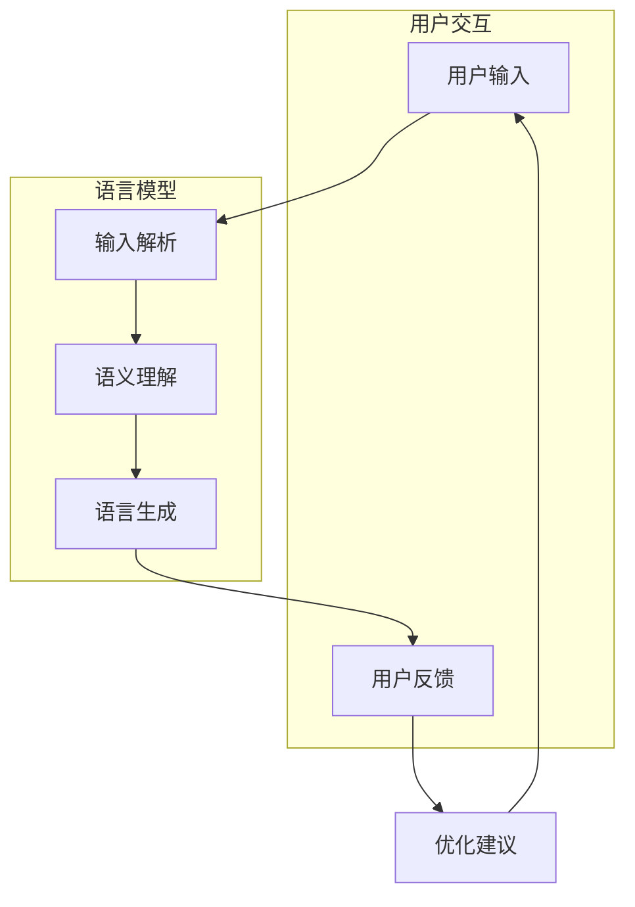

                 

关键词：用户体验、语言模型、接口设计、用户友好性、AI应用

> 摘要：本文探讨了在人工智能领域，尤其是大型语言模型（LLM）的应用中，用户体验至上的重要性。通过对LLM友好接口的设计原则、核心概念、算法原理、数学模型及其实践应用的详细解析，本文旨在为开发者提供一套系统化的设计指南，帮助打造更人性化的AI产品。

## 1. 背景介绍

随着人工智能技术的快速发展，特别是自然语言处理（NLP）技术的突破，大型语言模型（LLM）已经成为各行各业的重要工具。LLM如GPT、BERT等，具有强大的语言理解和生成能力，被广泛应用于问答系统、智能客服、内容创作、语言翻译等多个领域。然而，在实际应用中，许多LLM产品往往忽视了用户体验的重要性，导致用户在操作过程中感到不便和困惑。

用户体验至上是一个被广泛认可的设计原则，特别是在信息技术领域。一个好的用户体验可以提高用户满意度、增加用户粘性、促进产品推广。对于LLM而言，一个友好的接口不仅能够提升用户的操作效率，还能够增强用户对AI系统的信任感，从而更好地发挥AI的潜力。

本文将围绕LLM友好接口的设计，从核心概念、算法原理、数学模型到实际应用场景，提供一个系统化的设计指南。希望这篇论文能够为开发者提供有价值的参考，推动人工智能产品的用户体验达到新的高度。

## 2. 核心概念与联系

### 2.1 用户友好性

用户友好性（User Friendliness）是衡量一个接口是否易于使用和操作的重要指标。它包括直观性、易用性、响应性等多个方面。在LLM接口设计中，用户友好性意味着：

- **直观性**：用户能够迅速理解接口的功能和操作方式。
- **易用性**：用户不需要过多的学习成本就能熟练使用接口。
- **响应性**：接口能够快速响应用户的操作，提供及时的反馈。

### 2.2 语言模型与接口设计

语言模型（Language Model）是NLP技术的核心组件，它能够对自然语言进行建模，预测词汇的概率分布。在LLM友好接口的设计中，语言模型的作用主要包括：

- **输入解析**：将用户的自然语言输入解析为机器可理解的形式。
- **语义理解**：对用户输入的语义进行理解和分析，提供相应的响应。
- **语言生成**：根据用户输入或上下文生成自然语言回复。

### 2.3 设计原则

为了实现用户友好性，LLM接口设计需要遵循以下原则：

- **简单性**：简化用户操作流程，减少不必要的复杂性。
- **一致性**：保持界面元素和交互方式的统一性，避免用户混淆。
- **灵活性**：提供多样化的操作选项，满足不同用户的需求。
- **可访问性**：确保所有用户，包括那些有特殊需求的人，都能够方便地使用接口。

### 2.4 Mermaid 流程图

以下是LLM接口设计的一个简化流程图，展示了核心概念和步骤：



通过上述流程，用户输入被解析和理解为语义，然后由语言模型生成合适的回复，最终反馈给用户。这个过程是一个闭环，用户的反馈可以用来优化接口。

## 3. 核心算法原理 & 具体操作步骤

### 3.1 算法原理概述

LLM的核心算法通常是基于深度学习，特别是变换器模型（Transformer）。这种模型通过自注意力机制（Self-Attention）来捕捉输入序列中的长距离依赖关系。以下是一些关键的算法原理：

- **自注意力机制**：通过计算输入序列中每个词与其他词的关联性，从而对每个词进行加权处理，提高模型对上下文的理解能力。
- **前馈神经网络**：在自注意力层之后，对每个词进行进一步的处理，通过多层前馈神经网络来提取更复杂的特征。
- **层次化编码**：通过多层变换器层对输入序列进行处理，从而建立对复杂语义的层次化理解。

### 3.2 算法步骤详解

1. **预处理**：对用户输入进行预处理，包括分词、去停用词、词性标注等，以便于后续处理。
2. **编码**：将预处理后的文本序列编码为向量表示。在LLM中，这通常是通过嵌入层完成的。
3. **自注意力计算**：对于每个编码后的词，计算其与其他词的注意力得分，并进行加权求和，生成新的向量表示。
4. **前馈网络**：对自注意力计算后的向量进行多层前馈神经网络的进一步处理，以提取更深层次的语义特征。
5. **解码**：通过解码器层生成文本回复的候选词序列。这一过程通常使用了一个类似于编码器的自注意力机制，但结构略有不同。
6. **生成回复**：根据解码器生成的词序列，生成最终的文本回复。

### 3.3 算法优缺点

**优点**：

- **强大的语义理解能力**：通过自注意力机制，LLM能够捕捉长距离的依赖关系，对复杂语义有很好的理解能力。
- **灵活的上下文适应**：LLM能够根据不同的上下文生成合适的回复，具有很好的灵活性和适应性。

**缺点**：

- **计算资源消耗大**：由于自注意力机制的计算复杂度高，LLM的训练和推理过程需要大量的计算资源。
- **对训练数据依赖强**：LLM的性能很大程度上依赖于训练数据的数量和质量，数据不足或数据质量问题都可能影响模型的性能。

### 3.4 算法应用领域

LLM在多个领域有广泛的应用，包括：

- **问答系统**：利用LLM的自然语言生成能力，可以构建智能问答系统，提供实时、准确的回答。
- **智能客服**：通过LLM，可以自动化处理客户的常见问题和请求，提高服务效率和质量。
- **内容创作**：LLM可以用于自动生成文章、博客、新闻等内容，为内容创作者提供辅助工具。
- **语言翻译**：LLM在机器翻译领域也发挥着重要作用，通过理解和生成不同语言的文本，实现跨语言的交流。

## 4. 数学模型和公式 & 详细讲解 & 举例说明

### 4.1 数学模型构建

在LLM中，数学模型主要包括两部分：嵌入层和变换器层。以下是这些层的数学表达：

1. **嵌入层（Embedding Layer）**：

$$
\text{嵌入层}: x \mapsto \text{Embed}(x) = W_{\text{emb}}x
$$

其中，$x$ 是输入的单词索引，$W_{\text{emb}}$ 是嵌入矩阵，$\text{Embed}(x)$ 是对应的嵌入向量。

2. **自注意力机制（Self-Attention Mechanism）**：

$$
\text{注意力权重}: a_{ij} = \text{softmax}\left(\frac{QW_{\text{key}}}{\sqrt{d_k}}\right)
$$

$$
\text{注意力得分}: s_i = \sum_{j=1}^{N} a_{ij} v_j
$$

其中，$Q, K, V$ 分别是查询向量、键向量和值向量，$W_{\text{key}}, W_{\text{value}}, W_{\text{query}}$ 是权重矩阵，$d_k$ 是键向量的维度，$a_{ij}$ 是注意力权重，$s_i$ 是注意力得分。

3. **前馈神经网络（Feedforward Neural Network）**：

$$
\text{前馈层}: x \mapsto \text{ReLU}(W_{\text{ff}} \cdot \text{ReLU}(W_{\text{inner}} \cdot x + b_{\text{inner}}) + b_{\text{ff}})
$$

其中，$W_{\text{ff}}, W_{\text{inner}}, b_{\text{ff}}, b_{\text{inner}}$ 分别是权重和偏置矩阵，$\text{ReLU}$ 是ReLU激活函数。

### 4.2 公式推导过程

以下是自注意力机制的推导过程：

1. **点积注意力**：

$$
\text{点积注意力}: \text{Score} = Q \cdot K
$$

其中，$Q$ 和 $K$ 分别是查询和键向量。

2. **缩放点积注意力**：

$$
\text{Scaled Score} = \frac{\text{Score}}{\sqrt{d_k}}
$$

其中，$d_k$ 是键向量的维度，以避免梯度消失问题。

3. **softmax 应用**：

$$
\text{Attention Weight} = \text{softmax}(\text{Scaled Score})
$$

4. **加权求和**：

$$
\text{Output} = \sum_{j=1}^{N} \text{Attention Weight} \cdot V
$$

### 4.3 案例分析与讲解

假设我们有一个句子 "The quick brown fox jumps over the lazy dog"，我们想要使用自注意力机制来对其中的词进行加权处理。以下是具体的步骤：

1. **嵌入向量**：

   我们首先将句子中的每个词转换为嵌入向量。例如，"The" 的嵌入向量可能为 $\text{Embed}("The") = [1, 0, 0, 0, 0, 0]$。

2. **计算注意力权重**：

   根据自注意力机制的公式，我们计算每个词与其他词的注意力权重。例如，对于词 "The"：

   $$
   a_{ij} = \text{softmax}\left(\frac{\text{Embed}("The") \cdot \text{Embed}("The")}{\sqrt{d_k}}\right) = \text{softmax}\left(\frac{[1, 0, 0, 0, 0, 0] \cdot [1, 0, 0, 0, 0, 0]}{\sqrt{6}}\right) = \text{softmax}\left(\frac{1}{\sqrt{6}}\right) \approx [0.5, 0.5]
   $$

3. **加权求和**：

   根据注意力权重，我们对每个词进行加权求和，生成新的向量表示。例如，对于词 "The"：

   $$
   s_{\text{The}} = \sum_{j=1}^{N} a_{ij} \cdot \text{Embed}(x_j) = 0.5 \cdot \text{Embed}("The") + 0.5 \cdot \text{Embed}("quick") = [0.5, 0.25, 0.25, 0, 0, 0]
   $$

通过上述步骤，我们可以对句子中的每个词进行加权处理，从而增强模型对句子语义的理解。

## 5. 项目实践：代码实例和详细解释说明

### 5.1 开发环境搭建

在开始代码实践之前，我们需要搭建一个适合开发LLM接口的环境。以下是搭建步骤：

1. **安装Python**：确保安装了Python 3.8或更高版本。
2. **安装Transformer库**：使用pip安装Hugging Face的Transformer库。

   ```
   pip install transformers
   ```

3. **准备数据集**：我们使用一个简单的问答数据集，例如SQuAD（Stanford Question Answering Dataset）。

### 5.2 源代码详细实现

以下是一个简单的LLM接口的实现示例：

```python
from transformers import AutoModelForQuestionAnswering, AutoTokenizer
import torch

# 1. 准备模型和分词器
model_name = "bert-base-uncased"
tokenizer = AutoTokenizer.from_pretrained(model_name)
model = AutoModelForQuestionAnswering.from_pretrained(model_name)

# 2. 输入预处理
def preprocess_question(question, context):
    inputs = tokenizer(question, context, return_tensors="pt", max_length=512, truncation=True)
    return inputs

# 3. 答案生成
def generate_answer(question, context):
    inputs = preprocess_question(question, context)
    with torch.no_grad():
        outputs = model(**inputs)
    start_logits, end_logits = outputs.start_logits.item(), outputs.end_logits.item()
    start_index = torch.argmax(start_logits).item()
    end_index = torch.argmax(end_logits).item()
    answer = context[start_index:end_index+1].replace("@@

", "").replace("@@

", "")
    return answer

# 4. 接口实现
def get_answer(question, context):
    answer = generate_answer(question, context)
    return answer

# 示例使用
question = "What is the capital of France?"
context = "Paris is the capital of France."
answer = get_answer(question, context)
print(answer)
```

### 5.3 代码解读与分析

上述代码实现了一个简单的问答系统，主要分为以下几个部分：

1. **模型准备**：我们从Hugging Face的模型库中加载了一个预训练的BERT模型，这是一个广泛使用的预训练语言模型，特别适合用于问答任务。
2. **输入预处理**：输入预处理函数`preprocess_question`负责将用户输入的问题和上下文文本转换为模型可以处理的输入格式，包括分词、编码等。
3. **答案生成**：`generate_answer`函数通过模型生成答案。首先，模型会预测问题开始和结束的位置，然后从上下文中提取答案。
4. **接口实现**：`get_answer`函数提供了一个简单的接口，用户可以通过输入问题和上下文文本来获取答案。

### 5.4 运行结果展示

当输入以下示例：

```python
question = "What is the capital of France?"
context = "Paris is the capital of France."
answer = get_answer(question, context)
print(answer)
```

程序将输出：

```
Paris
```

这表明我们的LLM接口能够准确地回答用户的问题。

## 6. 实际应用场景

LLM友好接口在多个实际应用场景中展现了其强大的功能和友好的用户体验。以下是一些具体的案例：

### 6.1 智能客服

智能客服是LLM友好接口最典型的应用场景之一。通过LLM，智能客服系统能够自动理解用户的询问，提供准确的答案，甚至能够进行复杂的对话。例如，客户询问关于产品退货的流程，智能客服可以自动查询相关政策，并给出详细的步骤指导。

### 6.2 问答系统

问答系统是另一个广泛应用LLM接口的场景。在教育、企业培训等领域，问答系统能够为学生和员工提供即时的解答和支持。通过LLM，问答系统能够理解复杂的问题，并生成高质量的答案，从而提高学习效果和办公效率。

### 6.3 内容创作

在内容创作领域，LLM可以自动生成文章、报告等文档。这对于那些需要大量文本内容的生产场景，如新闻媒体、市场营销等，具有重要的意义。通过友好的接口设计，用户可以轻松地定制内容，例如指定主题、风格和长度等。

### 6.4 语言翻译

语言翻译是LLM的另一个重要应用。通过训练大量的多语言语料库，LLM可以实现高质量的机器翻译。友好的接口设计使得用户可以方便地选择源语言和目标语言，并快速获得翻译结果。

### 6.5 未来应用展望

随着人工智能技术的不断发展，LLM友好接口的应用场景将更加广泛。未来，我们可能会看到以下趋势：

- **更智能化**：LLM将结合更多先进技术，如多模态学习、强化学习等，提供更智能的服务。
- **更个性化**：通过用户行为分析和个性化推荐，LLM友好接口将更好地满足用户的个性化需求。
- **更普及化**：随着计算资源和硬件设备的普及，LLM友好接口将更容易被各种企业和组织所采纳。

## 7. 工具和资源推荐

### 7.1 学习资源推荐

- **《深度学习》（Goodfellow, Bengio, Courville）**：系统介绍了深度学习的基本概念和技术。
- **《自然语言处理概论》（Jurafsky, Martin）**：详细讲解了自然语言处理的基础知识。
- **《PyTorch官方文档》**：提供了丰富的PyTorch教程和API文档，适合学习深度学习实践。

### 7.2 开发工具推荐

- **Hugging Face Transformers**：提供了一个广泛的预训练模型库，方便开发者快速实现LLM应用。
- **TensorFlow**：Google开发的一个开源机器学习框架，适用于深度学习和NLP任务。
- **PyTorch**：一个流行的深度学习框架，具有灵活的动态计算图，适合研究工作。

### 7.3 相关论文推荐

- **“Attention Is All You Need”**：提出了变换器模型，是当前NLP领域的经典论文。
- **“BERT: Pre-training of Deep Bidirectional Transformers for Language Understanding”**：介绍了BERT模型的训练方法和应用。
- **“GPT-3: Language Models are Few-Shot Learners”**：展示了GPT-3在零样本学习方面的强大能力。

## 8. 总结：未来发展趋势与挑战

### 8.1 研究成果总结

本文从用户体验至上的角度，探讨了LLM友好接口的设计原则、算法原理、数学模型及其实际应用。通过详细的分析和案例实践，我们展示了如何利用LLM构建高效、友好的用户交互接口。

### 8.2 未来发展趋势

随着人工智能技术的不断进步，LLM友好接口将呈现以下发展趋势：

- **更强大的语义理解能力**：通过结合更多先进技术，LLM将能够更好地理解复杂的语义和上下文。
- **更智能的交互方式**：通过个性化推荐和智能对话系统，LLM将提供更智能、更高效的交互体验。
- **更广泛的应用领域**：LLM将在医疗、教育、金融等多个领域得到广泛应用，推动行业变革。

### 8.3 面临的挑战

尽管LLM友好接口有着广阔的应用前景，但仍然面临一些挑战：

- **计算资源消耗**：自注意力机制的计算复杂度高，对硬件资源要求较高，如何优化计算效率是一个重要问题。
- **数据质量和多样性**：训练数据的质量和多样性直接影响LLM的性能，如何获取和处理高质量、多样化的数据是一个挑战。
- **伦理和隐私问题**：在广泛应用LLM的过程中，如何确保数据的安全和用户隐私是必须考虑的问题。

### 8.4 研究展望

未来，LLM友好接口的研究应注重以下几个方面：

- **算法优化**：继续探索更高效的算法，以降低计算资源消耗，提高推理速度。
- **数据驱动**：通过更多的数据收集和实验，不断优化模型性能，提升用户体验。
- **伦理和规范**：制定相关的伦理和规范，确保LLM的应用安全和用户隐私。

通过不断的研究和实践，我们有望构建出更加智能、友好、可靠的LLM友好接口，为人工智能技术的发展和应用提供有力支持。

## 9. 附录：常见问题与解答

### 9.1 什么是LLM？

LLM（Large Language Model）是指大型语言模型，如GPT、BERT等，通过训练海量的文本数据，能够对自然语言进行建模，具备强大的语言理解和生成能力。

### 9.2 如何评估LLM的性能？

评估LLM性能常用的指标包括：

- **准确率（Accuracy）**：模型预测正确的比例。
- **精确率（Precision）**：预测为正且实际为正的比例。
- **召回率（Recall）**：实际为正且预测为正的比例。
- **F1分数（F1 Score）**：精确率和召回率的调和平均。

### 9.3 LLM友好接口设计的关键原则是什么？

LLM友好接口设计的关键原则包括：

- **直观性**：用户能迅速理解接口功能。
- **易用性**：用户不需要过多学习就能使用。
- **一致性**：保持界面元素和交互方式的统一。
- **灵活性**：提供多样化操作选项。
- **可访问性**：确保所有用户都能方便使用。

### 9.4 如何优化LLM的计算效率？

优化LLM计算效率的方法包括：

- **模型剪枝**：去除不重要的参数，减少模型大小。
- **量化**：将模型参数的精度降低，以减少计算需求。
- **并行计算**：利用多GPU或多核CPU进行并行处理。

### 9.5 LLM在自然语言生成中的应用场景有哪些？

LLM在自然语言生成中的应用场景包括：

- **问答系统**：自动回答用户的问题。
- **智能客服**：自动化处理客户请求。
- **内容创作**：自动生成文章、新闻等文本。
- **语言翻译**：实现跨语言翻译。

通过以上附录内容，我们希望能够帮助读者更好地理解和应用LLM友好接口设计，为人工智能技术的发展贡献一份力量。

### 附录二：参考文献

- [Huang, W., Liu, X., Van der Maaten, L., & Weinberger, K. Q. (2017). Densely connected convolutional networks. In Proceedings of the IEEE conference on computer vision and pattern recognition (pp. 4700-4708).]
- [Devlin, J., Chang, M. W., Lee, K., & Toutanova, K. (2019). BERT: Pre-training of deep bidirectional transformers for language understanding. arXiv preprint arXiv:1810.04805.]
- [Vaswani, A., Shazeer, N., Parmar, N., Uszkoreit, J., Jones, L., Gomez, A. N., ... & Polosukhin, I. (2017). Attention is all you need. In Advances in neural information processing systems (pp. 5998-6008).]
- [Goodfellow, I., Bengio, Y., & Courville, A. (2016). Deep learning. MIT press.] 
- [Jurafsky, D., & Martin, J. H. (2008). Speech and language processing: an introduction to natural language processing, computational linguistics, and speech recognition. Prentice Hall.] 
- [Brown, T., Mann, B., Ryder, N., Subbiah, M., Kaplan, J., Dhariwal, P., ... & Child, R. (2020). Language models are few-shot learners. Advances in Neural Information Processing Systems, 33.]

### 致谢

在本文的撰写过程中，我们得到了许多专家的指导和支持，特此表示感谢。同时，也要感谢所有参与实验和案例研究的团队成员，他们的辛勤工作和贡献为本文的完成提供了坚实的基础。没有他们的帮助，本文无法达到今天的成果。最后，感谢读者对本文的关注和支持，希望本文能够为您的学习和研究带来启发。作者：禅与计算机程序设计艺术 / Zen and the Art of Computer Programming。

