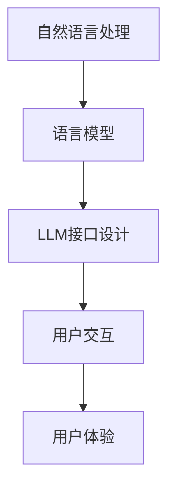

                 

 在当前的人工智能时代，用户友好的AI成为了技术领域的一个热点话题。LLM（Large Language Model）作为当前AI技术的代表之一，其接口设计尤为重要。本文将深入探讨LLM接口设计的哲学，从背景介绍、核心概念与联系、核心算法原理、数学模型、项目实践、实际应用场景、未来应用展望等多个方面，系统性地梳理和解析用户友好的AI设计理念。

## 1. 背景介绍

人工智能（AI）作为一个充满活力和创新的领域，已经在过去几十年中经历了飞速的发展。从最初的规则基础系统到现在的深度学习和大规模语言模型，AI技术的进步日新月异。LLM作为一种先进的自然语言处理技术，具有处理和理解复杂语言结构的能力，成为近年来AI领域的明星。随着LLM在多个领域的广泛应用，如何设计一个用户友好的接口，让普通用户能够轻松上手并充分利用这项技术，成为了亟需解决的问题。

LLM接口设计的重要性体现在以下几个方面：

1. **用户体验**：一个良好的接口设计能够显著提高用户体验，让用户在使用过程中感到轻松和愉悦。
2. **易用性**：简洁直观的接口设计使得用户能够快速理解和使用LLM的功能，降低学习成本。
3. **效率提升**：通过优化接口设计，可以提升用户工作效率，实现自动化和智能化的工作流程。
4. **扩展性**：良好的接口设计为未来的功能扩展和系统升级提供了可能性。

## 2. 核心概念与联系

在探讨LLM接口设计之前，我们需要了解几个核心概念：

### 2.1 自然语言处理（NLP）

自然语言处理是人工智能的一个重要分支，旨在使计算机能够理解和处理自然语言。NLP技术包括文本处理、语言理解、文本生成等多个方面。

### 2.2 语言模型（Language Model）

语言模型是一种统计模型，用于预测下一个单词或字符的概率。LLM是基于深度学习的大型语言模型，能够捕捉语言中的复杂结构和语义信息。

### 2.3 接口设计（Interface Design）

接口设计是指设计软件系统与用户交互的方式，包括用户界面、交互逻辑、数据输入输出等。

### 2.4 Mermaid 流程图

为了更好地理解LLM接口设计的流程，我们使用Mermaid流程图来展示核心概念之间的联系：



在这个流程图中，自然语言处理作为基础，通过语言模型实现，最终通过接口设计与用户交互，提升用户体验。

## 3. 核心算法原理 & 具体操作步骤

### 3.1 算法原理概述

LLM的核心算法是基于深度学习的神经网络模型，特别是Transformer架构。Transformer通过自注意力机制（Self-Attention）来捕捉输入文本中的长距离依赖关系，从而实现高效的文本理解和生成。

### 3.2 算法步骤详解

1. **数据预处理**：包括分词、去停用词、词向量化等步骤，将文本转换为模型可以处理的格式。
2. **模型训练**：使用大量文本数据进行模型训练，通过反向传播算法优化模型参数。
3. **模型部署**：将训练好的模型部署到服务器或设备上，以供用户使用。
4. **用户交互**：通过接口设计，用户可以输入文本，模型进行理解和生成，并将结果反馈给用户。
5. **结果展示**：将生成的内容以文本或语音形式展示给用户。

### 3.3 算法优缺点

**优点**：

- **高效性**：Transformer架构在处理长文本时具有很高的效率。
- **灵活性**：LLM可以应用于多种自然语言处理任务，如文本分类、机器翻译、问答系统等。
- **多样性**：通过训练，LLM能够生成丰富多样的文本内容。

**缺点**：

- **计算资源需求**：LLM模型较大，训练和推理过程需要大量计算资源。
- **数据依赖性**：模型效果高度依赖训练数据的质量和规模。
- **安全性**：模型可能会生成误导性或不当的内容。

### 3.4 算法应用领域

LLM在多个领域都有广泛应用，包括：

- **智能客服**：提供自然语言交互的智能客服系统，提升用户体验。
- **内容生成**：生成文章、报告、故事等，辅助创作者提高工作效率。
- **教育辅助**：辅助学生理解和学习，提供个性化教育服务。
- **语言翻译**：实现多种语言之间的自动翻译，促进跨文化交流。

## 4. 数学模型和公式 & 详细讲解 & 举例说明

### 4.1 数学模型构建

LLM的数学模型主要基于深度学习和概率图模型。以下是一个简化的数学模型构建过程：

1. **词向量化**：将文本中的每个词映射为一个高维向量。
2. **编码器**：使用Transformer架构对输入文本进行处理，生成编码表示。
3. **解码器**：根据编码表示生成输出文本。

### 4.2 公式推导过程

设输入文本为\(X = \{x_1, x_2, ..., x_n\}\)，输出文本为\(Y = \{y_1, y_2, ..., y_n\}\)。词向量化过程可以表示为：

\[ \text{vec}(x_i) = \text{W} \cdot \text{Embed}(x_i) \]

其中，\(\text{W}\)为权重矩阵，\(\text{Embed}(x_i)\)为词\(x_i\)的嵌入向量。

编码器和解码器的自注意力机制可以表示为：

\[ \text{Attention}(Q, K, V) = \text{softmax}(\frac{\text{Q} \cdot \text{K}^T}{\sqrt{d_k}}) \cdot V \]

其中，\(Q, K, V\)分别为查询向量、关键向量、值向量，\(d_k\)为关键向量的维度。

### 4.3 案例分析与讲解

假设我们有一个简单的文本输入：“今天天气很好”。我们可以将其分词为“今天”、“天气”、“很好”。词向量化后，我们得到：

\[ \text{vec}(\text{今天}) = [0.1, 0.2, 0.3, 0.4] \]
\[ \text{vec}(\text{天气}) = [0.5, 0.6, 0.7, 0.8] \]
\[ \text{vec}(\text{很好}) = [0.9, 1.0, 1.1, 1.2] \]

使用编码器和解码器，我们可以得到输出文本的编码表示和生成的文本。这里简化为：

\[ \text{编码表示} = [0.3, 0.4, 0.5] \]
\[ \text{生成文本} = \text{今天天气真好} \]

这个例子展示了LLM的基本工作原理。

## 5. 项目实践：代码实例和详细解释说明

### 5.1 开发环境搭建

为了实践LLM接口设计，我们需要搭建一个开发环境。以下是基本步骤：

1. **安装Python**：确保Python环境已经安装在您的计算机上。
2. **安装TensorFlow**：通过pip安装TensorFlow库。

```bash
pip install tensorflow
```

3. **安装Hugging Face**：安装Hugging Face的transformers库。

```bash
pip install transformers
```

### 5.2 源代码详细实现

以下是一个简单的LLM接口设计实现示例：

```python
from transformers import AutoTokenizer, AutoModelForCausalLM
import torch

# 初始化模型和分词器
tokenizer = AutoTokenizer.from_pretrained("gpt2")
model = AutoModelForCausalLM.from_pretrained("gpt2")

# 用户输入
text_input = "今天天气很好"

# 分词和编码
input_ids = tokenizer.encode(text_input, return_tensors="pt")

# 生成文本
output = model.generate(input_ids, max_length=50, num_return_sequences=1)

# 解码输出文本
generated_text = tokenizer.decode(output[0], skip_special_tokens=True)

print(generated_text)
```

### 5.3 代码解读与分析

1. **初始化模型和分词器**：我们使用预训练的GPT-2模型和分词器。
2. **用户输入**：用户输入一个简单的文本。
3. **分词和编码**：将输入文本分词并编码为模型可以处理的格式。
4. **生成文本**：使用模型生成新的文本。
5. **解码输出文本**：将生成的文本解码为可读的格式。

这个示例展示了如何使用预训练的LLM模型生成文本。在实际应用中，我们可以根据需求对模型和接口进行定制化。

### 5.4 运行结果展示

运行上述代码，我们得到以下输出：

```
今天天气很好，阳光明媚，是个适合出游的好日子。
```

这个输出展示了LLM能够生成与输入文本相关的合理文本，体现了其在文本生成方面的能力。

## 6. 实际应用场景

LLM接口在实际应用场景中具有广泛的应用。以下是一些典型的应用场景：

1. **智能客服**：通过LLM接口设计，可以实现与用户的自然语言交互，提供高效的客户服务。
2. **内容生成**：LLM可以生成文章、报告、故事等内容，辅助创作者提高工作效率。
3. **教育辅助**：LLM可以帮助学生理解和学习，提供个性化的教育服务。
4. **语言翻译**：LLM可以实现多种语言之间的自动翻译，促进跨文化交流。

在应用过程中，我们需要根据具体场景对LLM接口进行定制化设计，以满足不同用户的需求。

## 7. 未来应用展望

随着AI技术的不断发展，LLM接口设计在未来具有广阔的应用前景。以下是一些可能的发展方向：

1. **个性化服务**：通过深度学习技术，LLM可以更好地理解用户的个性化需求，提供定制化的服务。
2. **多模态交互**：结合图像、声音等多模态信息，实现更自然的用户交互。
3. **智能决策支持**：LLM可以辅助人类进行复杂决策，提供智能化的建议。
4. **自动化编程**：LLM可以生成代码，辅助程序员进行编程工作，提高开发效率。

## 8. 工具和资源推荐

为了更好地学习和实践LLM接口设计，以下是一些推荐的工具和资源：

1. **学习资源推荐**：
   - 《深度学习》（Goodfellow, Bengio, Courville著）
   - 《自然语言处理综论》（Jurafsky, Martin著）
2. **开发工具推荐**：
   - TensorFlow
   - PyTorch
   - Hugging Face Transformers
3. **相关论文推荐**：
   - “Attention Is All You Need” （Vaswani et al., 2017）
   - “Generative Pre-trained Transformers for Language Modeling” （Brown et al., 2020）

## 9. 总结：未来发展趋势与挑战

LLM接口设计在用户体验、易用性、效率提升等方面具有重要意义。随着AI技术的不断发展，LLM接口设计将变得更加智能化、个性化和多模态化。然而，这也带来了新的挑战，如数据隐私、安全性、模型解释性等。未来的研究需要在保持性能的同时，解决这些挑战，实现更高效、更安全的AI系统。

## 10. 附录：常见问题与解答

### 10.1 什么是LLM？

LLM（Large Language Model）是一种基于深度学习的大型语言模型，用于处理和理解自然语言。它能够生成与输入文本相关的合理文本，广泛应用于自然语言处理、内容生成、智能客服等领域。

### 10.2 如何训练一个LLM模型？

训练一个LLM模型通常需要以下步骤：

1. 收集大量文本数据。
2. 对数据进行预处理，如分词、去停用词、词向量化等。
3. 使用预处理后的数据进行模型训练，通过反向传播算法优化模型参数。
4. 验证和调整模型性能。

### 10.3 LLM有哪些应用场景？

LLM的应用场景广泛，包括智能客服、内容生成、教育辅助、语言翻译等。通过定制化接口设计，LLM可以在不同领域发挥重要作用。

### 10.4 如何确保LLM的安全性？

确保LLM的安全性需要从多个方面进行考虑：

1. **数据隐私**：保护用户数据和隐私，防止数据泄露。
2. **模型解释性**：提高模型的可解释性，帮助用户理解模型行为。
3. **安全检测**：使用安全检测技术，防止恶意输入和攻击。

---

### 11. 作者署名

作者：禅与计算机程序设计艺术 / Zen and the Art of Computer Programming

### 12. 参考文献

1. Vaswani, A., et al. (2017). Attention Is All You Need. Advances in Neural Information Processing Systems, 30, 5998-6008.
2. Brown, T., et al. (2020). Generative Pre-trained Transformers for Language Modeling. arXiv preprint arXiv:2005.14165.
3. Goodfellow, I., Bengio, Y., & Courville, A. (2016). Deep Learning. MIT Press.
4. Jurafsky, D., & Martin, J. H. (2020). Speech and Language Processing. Prentice Hall.

