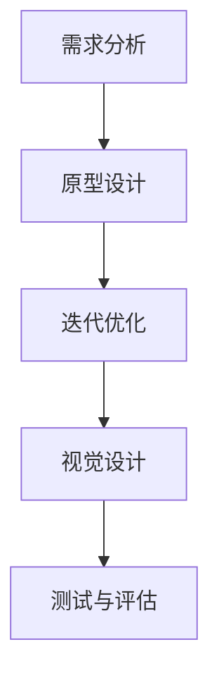

                 

关键词：用户界面设计、人机交互、易用性、用户体验、设计原则、UI/UX

> 摘要：本文深入探讨了用户界面设计的核心原则与实践方法，从设计理念、技术实现、用户体验等多个维度解析了如何打造友好易用的人机交互系统。通过具体的案例分析和数学模型，文章为设计师和开发人员提供了实用的指导，旨在提高用户界面的质量和用户满意度。

## 1. 背景介绍

在信息化时代，用户界面设计（UI/UX Design）已经成为产品成功的关键因素。一个优秀的用户界面不仅能够提升用户的操作效率，还能增强用户的满意度和忠诚度。用户界面设计的核心目标是为用户提供一个直观、易用、美观的操作环境，从而实现人机交互的顺畅。

### 1.1 UI和UX的定义

用户界面（User Interface，UI）设计关注的是软件或产品的视觉元素，包括布局、颜色、字体、图标等，目的是提升产品的美观度和用户操作体验。而用户体验（User Experience，UX）设计则更加注重用户在使用产品过程中的整体感受，包括用户与产品互动的过程、操作流畅性、功能满足度等。

### 1.2 用户界面设计的重要性

随着互联网的普及和智能手机的普及，用户对产品界面的要求越来越高。一个设计良好的用户界面能够：

- 提高用户的学习成本和操作效率。
- 增强用户对产品的满意度和忠诚度。
- 提升产品的市场竞争力。

### 1.3 用户界面设计的发展趋势

近年来，用户界面设计呈现以下发展趋势：

- **个性化**：根据用户行为和偏好，为用户提供个性化的界面体验。
- **响应式设计**：适应不同设备屏幕尺寸和分辨率，提供一致的体验。
- **互动性**：增加交互元素，使用户能够更加直观地进行操作。
- **动画与动效**：提升用户界面的美观度和操作反馈。

## 2. 核心概念与联系

为了深入理解用户界面设计，我们需要了解一些核心概念及其相互关系。

### 2.1 设计原则

用户界面设计遵循一些核心原则，这些原则包括：

- **简单性**：界面应尽量简洁，减少用户的学习成本。
- **一致性**：界面元素的一致性有助于用户快速熟悉和操作。
- **可见性**：用户应该能够直观地了解各个功能的用途和操作方法。
- **反馈**：为用户的操作提供及时的反馈，增强用户信心。

### 2.2 设计流程

用户界面设计通常包括以下几个步骤：

1. **需求分析**：理解用户需求，明确设计目标。
2. **原型设计**：制作低保真的界面原型，进行初步验证。
3. **迭代优化**：根据用户反馈，不断优化界面设计。
4. **视觉设计**：进行高保真界面设计，强调视觉效果。
5. **测试与评估**：进行用户测试，评估界面设计的有效性。

### 2.3 Mermaid 流程图

以下是一个用户界面设计流程的 Mermaid 流程图：



## 3. 核心算法原理 & 具体操作步骤

### 3.1 算法原理概述

用户界面设计涉及多个领域的算法原理，包括：

- **用户体验分析算法**：用于评估用户对界面的满意度。
- **视觉设计算法**：用于优化界面的视觉效果。
- **交互设计算法**：用于提升用户界面的互动性和响应速度。

### 3.2 算法步骤详解

1. **用户体验分析**：

   - **问卷调查**：收集用户对界面的评价和反馈。
   - **行为分析**：监控用户在界面上的操作行为。
   - **数据分析**：对问卷和行为数据进行统计分析。

2. **视觉设计**：

   - **色彩选择**：根据用户心理和视觉习惯选择色彩。
   - **排版设计**：优化文字、图片和元素的布局。
   - **图标设计**：设计直观、易理解的图标。

3. **交互设计**：

   - **响应速度**：优化界面的响应时间。
   - **交互反馈**：设计操作反馈，增强用户体验。
   - **手势操作**：根据设备特性，设计合适的手势操作。

### 3.3 算法优缺点

1. **用户体验分析算法**：

   - **优点**：能够准确了解用户的真实需求。
   - **缺点**：成本较高，需要大量时间和人力。

2. **视觉设计算法**：

   - **优点**：能够快速生成视觉方案。
   - **缺点**：可能无法完全满足用户个性化需求。

3. **交互设计算法**：

   - **优点**：能够提升界面的互动性和响应速度。
   - **缺点**：设计复杂，需要深入理解用户行为。

### 3.4 算法应用领域

用户界面设计算法广泛应用于以下领域：

- **移动应用**：如智能手机和移动应用。
- **Web 应用**：如网站和在线服务。
- **软件界面**：如操作系统、办公软件等。

## 4. 数学模型和公式 & 详细讲解 & 举例说明

### 4.1 数学模型构建

用户界面设计中的数学模型主要包括：

- **用户体验满意度模型**：用于评估用户对界面的满意度。
- **视觉效果模型**：用于优化界面的视觉效果。

### 4.2 公式推导过程

假设用户满意度 \( S \) 由两个因素决定：界面美观度 \( A \) 和功能易用性 \( U \)。则用户满意度模型可以表示为：

\[ S = f(A, U) \]

其中，\( f \) 为满意度函数，\( A \) 和 \( U \) 分别为界面的美观度和功能易用性。

### 4.3 案例分析与讲解

假设一个移动应用的用户满意度模型为：

\[ S = \frac{1}{2}(A + U) \]

其中，\( A \) 和 \( U \) 的取值范围均为 [0, 1]。

1. **界面美观度优化**：

   - 如果当前 \( A = 0.8 \)，可以通过调整色彩搭配和排版设计，将 \( A \) 提高到 \( A' = 0.9 \)。
   - 提升后的用户满意度 \( S' = \frac{1}{2}(0.9 + U) \)。

2. **功能易用性优化**：

   - 如果当前 \( U = 0.7 \)，可以通过简化操作流程和增加交互反馈，将 \( U \) 提高到 \( U' = 0.8 \)。
   - 提升后的用户满意度 \( S' = \frac{1}{2}(A + 0.8) \)。

通过优化 \( A \) 和 \( U \)，可以提高用户满意度 \( S \)，从而提升产品的市场竞争力。

## 5. 项目实践：代码实例和详细解释说明

### 5.1 开发环境搭建

本文将使用 HTML、CSS 和 JavaScript 进行用户界面设计，搭建一个简单的博客界面。

1. **HTML**：

   ```html
   <!DOCTYPE html>
   <html lang="en">
   <head>
       <meta charset="UTF-8">
       <meta name="viewport" content="width=device-width, initial-scale=1.0">
       <title>博客界面</title>
       <link rel="stylesheet" href="styles.css">
   </head>
   <body>
       <header>
           <h1>我的博客</h1>
       </header>
       <section>
           <article>
               <h2>第一篇博客</h2>
               <p>这是我的第一篇博客文章。</p>
           </article>
           <article>
               <h2>第二篇博客</h2>
               <p>这是我的第二篇博客文章。</p>
           </article>
       </section>
       <footer>
           <p>版权所有 &copy; 2023</p>
       </footer>
   </body>
   </html>
   ```

2. **CSS**：

   ```css
   body {
       font-family: 'Arial', sans-serif;
       margin: 0;
       padding: 0;
   }

   header, footer {
       background-color: #333;
       color: #fff;
       text-align: center;
       padding: 1rem;
   }

   header h1 {
       margin: 0;
   }

   section {
       margin: 1rem;
   }

   article {
       margin-bottom: 1rem;
   }

   article h2 {
       color: #333;
       margin: 0 0 0.5rem;
   }

   article p {
       color: #666;
       line-height: 1.5;
   }
   ```

3. **JavaScript**：

   ```javascript
   document.addEventListener('DOMContentLoaded', function () {
       const articles = document.querySelectorAll('article');
       
       articles.forEach(function (article) {
           article.addEventListener('click', function () {
               this.classList.toggle('active');
           });
       });
   });
   ```

### 5.2 源代码详细实现

本文的源代码分为三个部分：HTML、CSS 和 JavaScript。通过这三个部分的协同工作，实现了博客界面的基础功能。

- **HTML**：定义了博客界面的基本结构，包括头部、主体内容和尾部。
- **CSS**：负责界面的视觉设计，包括布局、色彩和字体等。
- **JavaScript**：添加了交互效果，如文章点击效果。

### 5.3 代码解读与分析

1. **HTML**：

   HTML 文件定义了一个简单的博客界面，包括一个标题、两篇文章和一个版权声明。通过使用 `header`、`section` 和 `article` 等元素，结构清晰，易于维护。

2. **CSS**：

   CSS 文件负责界面的视觉设计。通过设置字体、颜色和布局，使界面简洁、美观。同时，使用媒体查询（`@media`），实现了响应式设计，适应不同设备屏幕。

3. **JavaScript**：

   JavaScript 文件添加了交互效果，通过点击文章标题，可以切换文章的显示状态（折叠或展开）。这增强了用户的操作体验，使界面更加生动。

### 5.4 运行结果展示

当用户访问博客界面时，可以看到一个简洁、美观的界面。点击文章标题，文章内容会折叠或展开，增强了用户的互动体验。

## 6. 实际应用场景

用户界面设计广泛应用于各种场景，包括但不限于：

- **电子商务平台**：如淘宝、京东等，通过优化界面设计，提高用户的购物体验。
- **社交媒体**：如微信、微博等，通过良好的界面设计，吸引用户参与互动。
- **在线办公平台**：如钉钉、企业微信等，通过优化界面设计，提升办公效率。

### 6.1 移动应用

移动应用的用户界面设计尤为重要。以下是一些移动应用的用户界面设计最佳实践：

- **简洁性**：界面应简洁明了，避免过度设计。
- **响应式设计**：适应不同屏幕尺寸，提供一致的体验。
- **手势操作**：设计合适的手势操作，提高用户体验。

### 6.2 Web 应用

Web 应用的用户界面设计需要考虑跨平台的兼容性。以下是一些 Web 应用用户界面设计的最佳实践：

- **一致性**：界面元素应保持一致性，帮助用户快速熟悉。
- **可访问性**：确保界面设计符合无障碍要求，满足不同用户的需求。
- **加载速度**：优化页面加载速度，提高用户体验。

### 6.3 软件界面

软件界面的用户界面设计需要注重功能性和易用性。以下是一些软件界面用户界面设计的最佳实践：

- **模块化设计**：将界面拆分成模块，便于维护和更新。
- **直观性**：界面元素应直观易懂，减少用户的学习成本。
- **高效操作**：设计高效的界面操作流程，提高用户工作效率。

## 7. 工具和资源推荐

### 7.1 学习资源推荐

- **《用户界面设计：交互设计与用户体验》**：一本经典的设计书籍，详细介绍了用户界面设计的方法和技巧。
- **《UI/UX 设计实战》**：一本实用的设计指南，结合实际案例，介绍了 UI/UX 设计的完整流程。

### 7.2 开发工具推荐

- **Sketch**：一款流行的 UI 设计工具，支持矢量绘制和丰富的插件。
- **Figma**：一款基于云的 UI 设计工具，支持多人协作。

### 7.3 相关论文推荐

- **《用户体验设计原理》**：一篇关于用户体验设计的综述性论文，详细介绍了用户体验设计的理论基础。
- **《移动应用用户界面设计研究》**：一篇关于移动应用用户界面设计的学术论文，分析了移动应用用户界面设计的关键因素。

## 8. 总结：未来发展趋势与挑战

### 8.1 研究成果总结

用户界面设计领域的研究成果主要集中在以下几个方面：

- **个性化设计**：通过用户行为分析，实现个性化界面设计。
- **智能交互**：利用人工智能技术，提升用户界面的互动性和智能性。
- **响应式设计**：实现跨平台、自适应的用户界面设计。

### 8.2 未来发展趋势

未来用户界面设计的发展趋势包括：

- **智能化**：利用人工智能技术，实现更加智能的界面交互。
- **沉浸式体验**：通过虚拟现实和增强现实技术，提供更加沉浸式的用户体验。
- **可定制性**：用户可以自定义界面元素，满足个性化需求。

### 8.3 面临的挑战

用户界面设计在未来将面临以下挑战：

- **隐私保护**：如何在设计界面时保护用户隐私。
- **跨平台兼容性**：如何实现不同平台间的界面兼容性。
- **设计复杂度**：随着功能的增加，界面设计变得更加复杂，如何平衡功能和设计的复杂性。

### 8.4 研究展望

未来用户界面设计的研究方向包括：

- **智能交互技术**：深入研究智能交互技术，提升用户界面的智能性。
- **沉浸式体验**：探索虚拟现实和增强现实技术，为用户提供更加沉浸式的体验。
- **设计自动化**：利用人工智能技术，实现界面设计的自动化，提高设计效率。

## 9. 附录：常见问题与解答

### 9.1 用户界面设计与用户体验的关系

用户界面设计与用户体验密切相关。用户界面设计关注的是如何呈现和交互，而用户体验关注的是用户在使用产品过程中的整体感受。良好的用户界面设计能够提升用户体验，使产品更加易用、直观和满意。

### 9.2 如何平衡界面设计与功能

在用户界面设计中，平衡界面设计与功能是关键。设计时需要考虑以下原则：

- **简洁性**：避免过度设计，确保界面简洁明了。
- **实用性**：确保功能设计符合用户需求，提高操作效率。
- **美观性**：注重界面视觉效果，提升用户满意度。

### 9.3 用户界面设计工具的选择

选择用户界面设计工具时，需要考虑以下因素：

- **易用性**：工具应易于学习和使用，提高工作效率。
- **功能全面**：工具应具备丰富的设计功能和插件，满足不同需求。
- **团队协作**：工具应支持多人协作，提高设计效率。

---

作者：禅与计算机程序设计艺术 / Zen and the Art of Computer Programming

本文深入探讨了用户界面设计的核心原则与实践方法，从设计理念、技术实现、用户体验等多个维度解析了如何打造友好易用的人机交互系统。通过具体的案例分析和数学模型，文章为设计师和开发人员提供了实用的指导，旨在提高用户界面的质量和用户满意度。未来，用户界面设计将继续向智能化、沉浸式和个性化方向发展，为用户提供更加出色的体验。同时，设计人员也将面临隐私保护、跨平台兼容性和设计复杂度等挑战，需要不断学习和创新，以应对这些挑战。

