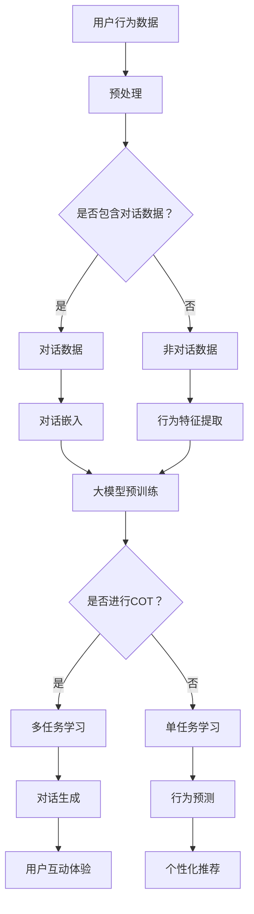
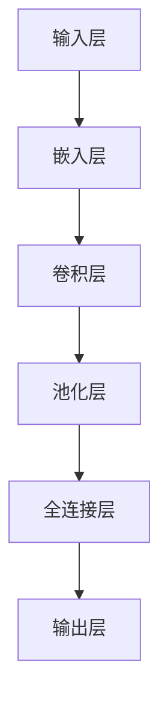

                 

用户行为理解是一个至关重要的领域，它影响着个性化推荐、广告投放、社交媒体互动等多个方面。近年来，随着人工智能技术的发展，特别是大模型（Large Models）的兴起，用户行为理解的能力得到了极大的提升。本文将探讨大模型在用户行为理解中的应用，特别是COT（Conversational Transfer）能力的重要性。

## 关键词

- 用户行为理解
- 大模型
- COT能力
- 个性化推荐
- 广告投放
- 社交媒体互动

## 摘要

本文首先介绍了用户行为理解的重要性及其在现代社会中的应用场景。随后，我们深入探讨了大模型的基本概念及其在用户行为理解中的优势。特别地，我们聚焦于COT能力，详细阐述了其原理和应用场景。通过数学模型和实际案例，本文展示了大模型在用户行为理解中的实际效果和潜力。最后，我们对大模型在用户行为理解领域的未来发展趋势进行了展望。

## 1. 背景介绍

用户行为理解是人工智能领域中一个极具挑战性的任务。它涉及到如何从用户的交互行为中提取有价值的信息，并利用这些信息为用户提供个性化的服务。例如，在电子商务平台上，理解用户的购买行为可以帮助推荐系统提供更精准的推荐，从而提升用户体验和销售额。在社交媒体上，理解用户的互动行为可以优化广告投放策略，提高广告的点击率和转化率。

传统的用户行为理解方法主要依赖于统计分析和机器学习技术。这些方法通常基于历史数据和特征工程，通过训练模型来预测用户的行为。然而，这些方法存在一些局限性。首先，特征工程是一个繁琐且主观的过程，需要领域专家的深入参与。其次，传统模型在面对复杂和动态的用户行为时，往往表现不佳。因此，如何有效地理解和预测用户行为成为了人工智能研究中的一个重要课题。

随着人工智能技术的不断发展，特别是深度学习和自然语言处理（NLP）技术的进步，大模型的出现为用户行为理解带来了新的契机。大模型具有强大的表示能力和泛化能力，能够从大量的数据中自动提取特征，无需繁琐的特征工程。这使得大模型在用户行为理解中具有显著的优势。

## 2. 核心概念与联系

### 大模型

大模型（Large Models）是指那些具有数十亿至数千亿参数的神经网络模型。这些模型通常通过预训练（pre-training）和微调（fine-tuning）的方式进行训练。预训练是指在大量的无监督数据上进行训练，以学习数据的通用表示。微调是指在大模型的基础上，使用有监督数据对特定任务进行训练，以优化模型在特定任务上的性能。

大模型的核心优势在于其强大的表示能力。它们能够自动从数据中学习复杂的模式和关系，这使得大模型在多种任务中表现出色。例如，在文本分类、机器翻译、图像识别等领域，大模型都取得了显著的成果。

### COT能力

COT（Conversational Transfer）能力是指大模型在处理对话任务时，能够将之前在多个对话场景中学到的知识进行迁移和应用的能力。这种能力使得大模型能够更好地理解和应对复杂的对话场景，提高对话的质量和效率。

COT能力的实现通常依赖于多任务学习和知识蒸馏（Knowledge Distillation）技术。多任务学习是指在一个大模型中同时训练多个任务，以充分利用模型的能力。知识蒸馏是指通过将一个复杂的大模型的知识传递给一个较小的模型，以提高小模型的性能。

### 大模型与用户行为理解的关系

大模型在用户行为理解中的应用主要体现在以下几个方面：

1. **用户意图识别**：通过分析用户的交互历史和当前行为，大模型可以准确地识别用户的意图，为用户提供个性化的服务。
2. **行为预测**：大模型可以预测用户未来的行为，从而优化系统的推荐和广告策略。
3. **对话生成**：大模型可以生成与用户互动的对话，提高用户的满意度和互动体验。

### Mermaid 流程图

以下是用户行为理解中，大模型与COT能力关系的 Mermaid 流程图：



## 3. 核心算法原理 & 具体操作步骤

### 3.1 算法原理概述

大模型在用户行为理解中的应用主要基于深度学习技术。深度学习是一种模拟人脑神经网络的机器学习技术，通过多层神经网络来学习数据的复杂模式和关系。

在用户行为理解中，大模型通常包括以下几个步骤：

1. **数据预处理**：对用户行为数据进行清洗和标准化处理，使其符合模型输入要求。
2. **特征提取**：从预处理后的数据中提取有用的特征，用于训练模型。
3. **模型训练**：使用预训练的深度学习模型对用户行为数据进行训练，以优化模型的参数。
4. **模型评估**：使用测试数据评估模型的性能，调整模型参数以获得最佳效果。
5. **应用部署**：将训练好的模型部署到实际应用场景中，为用户提供个性化的服务。

### 3.2 算法步骤详解

1. **数据预处理**

   数据预处理是用户行为理解中的关键步骤。它包括以下任务：

   - **去噪**：去除数据中的噪声和异常值，提高数据的可靠性。
   - **标准化**：将不同尺度的数据进行标准化处理，使其在同一尺度范围内。
   - **时间序列处理**：将用户行为数据转换为时间序列格式，以便进行时间相关的分析。
   - **对话数据转换**：对于包含对话数据的情况，将对话数据转换为嵌入向量，用于后续的对话理解。

2. **特征提取**

   特征提取是用户行为理解中的核心步骤。它涉及从用户行为数据中提取有用的特征，用于训练模型。常见的特征提取方法包括：

   - **行为特征**：从用户的行为日志中提取的行为特征，如浏览历史、购买行为、点击率等。
   - **时间特征**：从用户行为数据的时间戳中提取的时间特征，如行为发生的时间、频率等。
   - **用户特征**：从用户的基本信息中提取的用户特征，如年龄、性别、地理位置等。
   - **对话特征**：对于包含对话数据的情况，从对话中提取的语义特征，如关键词、情绪等。

3. **模型训练**

   模型训练是用户行为理解中的核心步骤。它使用预训练的深度学习模型对用户行为数据进行训练，以优化模型的参数。常见的模型训练方法包括：

   - **监督学习**：使用标注的数据集对模型进行训练，以学习用户行为的规律。
   - **无监督学习**：在无标注的数据集上进行训练，通过自动提取特征来学习用户行为。
   - **半监督学习**：结合标注数据和未标注的数据进行训练，以提高模型的泛化能力。

4. **模型评估**

   模型评估是用户行为理解中的关键步骤。它使用测试数据评估模型的性能，调整模型参数以获得最佳效果。常见的模型评估方法包括：

   - **准确率**：模型预测正确的样本数量与总样本数量的比例。
   - **召回率**：模型预测正确的样本数量与实际正样本数量的比例。
   - **F1 分数**：准确率和召回率的调和平均。
   - **ROC 曲线**：模型预测结果的概率分布曲线。

5. **应用部署**

   模型部署是用户行为理解中的最终步骤。它将训练好的模型部署到实际应用场景中，为用户提供个性化的服务。常见的应用部署方法包括：

   - **云计算**：使用云计算平台部署模型，以提供弹性的服务。
   - **容器化**：使用容器技术部署模型，以提高部署的效率和可维护性。
   - **微服务**：使用微服务架构部署模型，以提高系统的可扩展性和可维护性。

### 3.3 算法优缺点

**优点**：

- **强大的表示能力**：大模型能够自动从大量数据中提取复杂的模式和关系，提高了用户行为理解的准确性。
- **无需特征工程**：大模型通过自动提取特征，无需繁琐的特征工程过程，降低了模型的复杂度和成本。
- **泛化能力强**：大模型在多个任务中表现优异，具有较强的泛化能力，适用于不同的用户行为理解任务。

**缺点**：

- **计算资源消耗大**：大模型需要大量的计算资源进行训练和推理，对硬件设备要求较高。
- **数据隐私问题**：用户行为数据通常包含敏感信息，如何保护用户隐私是一个重要挑战。
- **模型解释性差**：大模型的内部结构和决策过程复杂，难以解释和理解，这可能会影响用户的信任度。

### 3.4 算法应用领域

大模型在用户行为理解中的应用领域广泛，主要包括：

- **个性化推荐**：通过理解用户的兴趣和行为，提供个性化的推荐服务，如电商平台的商品推荐、视频平台的视频推荐等。
- **广告投放**：通过分析用户的互动行为和兴趣，优化广告投放策略，提高广告的点击率和转化率。
- **社交媒体互动**：通过理解用户的互动行为和情绪，生成与用户的互动对话，提高用户的满意度和互动体验。
- **智能客服**：通过理解用户的咨询意图和问题，生成智能的回复，提高客服效率和用户满意度。

## 4. 数学模型和公式 & 详细讲解 & 举例说明

### 4.1 数学模型构建

在用户行为理解中，大模型通常采用深度学习框架进行构建。深度学习模型由多层神经网络组成，每层网络通过前一层网络的输出进行加权求和并传递到下一层。以下是用户行为理解中常见的一种深度学习模型架构：



- **输入层（Input Layer）**：接收用户的输入数据，如行为日志、对话记录等。
- **嵌入层（Embedding Layer）**：将输入数据转换为嵌入向量，用于后续的神经网络处理。
- **卷积层（Convolutional Layer）**：通过卷积运算提取输入数据的特征，如行为模式、时间序列特征等。
- **池化层（Pooling Layer）**：对卷积层输出的特征进行池化操作，降低特征维度，减少计算量。
- **全连接层（Fully Connected Layer）**：将池化层输出的特征进行加权求和，并传递到输出层。
- **输出层（Output Layer）**：生成模型的预测结果，如用户意图、行为预测等。

### 4.2 公式推导过程

在深度学习模型中，损失函数（Loss Function）用于评估模型预测结果与真实结果之间的差距。常见的损失函数包括均方误差（Mean Squared Error, MSE）、交叉熵（Cross-Entropy Loss）等。

以均方误差损失函数为例，其公式推导过程如下：

1. **定义预测值和真实值**：

   - **预测值（\(\hat{y}\)）**：模型对输入数据的预测结果。
   - **真实值（\(y\)）**：输入数据的真实标签。

2. **定义均方误差损失函数**：

   \[
   L(\hat{y}, y) = \frac{1}{2} \sum_{i=1}^{n} (\hat{y}_i - y_i)^2
   \]

   其中，\(n\) 为样本数量。

3. **损失函数的计算**：

   - **单样本损失**：

     \[
     L(\hat{y}_i, y_i) = \frac{1}{2} (\hat{y}_i - y_i)^2
     \]

   - **总损失**：

     \[
     L(\hat{y}, y) = \frac{1}{2} \sum_{i=1}^{n} (\hat{y}_i - y_i)^2
     \]

4. **损失函数的优化**：

   损失函数的优化目标是使总损失最小。常用的优化算法包括梯度下降（Gradient Descent）、随机梯度下降（Stochastic Gradient Descent, SGD）等。

### 4.3 案例分析与讲解

以电商平台的个性化推荐为例，我们使用大模型来预测用户的购买意图。以下是具体的案例分析和讲解：

1. **数据集准备**：

   数据集包含用户的购买历史数据，包括用户 ID、商品 ID、购买时间等信息。数据集分为训练集和测试集。

2. **模型构建**：

   我们构建一个基于深度学习的个性化推荐模型，包括输入层、嵌入层、卷积层、池化层和全连接层。输入层接收用户 ID 和商品 ID 的嵌入向量，嵌入层将输入数据转换为嵌入向量，卷积层和池化层用于提取用户购买行为特征，全连接层生成购买意图的预测结果。

3. **模型训练**：

   使用训练集对模型进行训练，优化模型参数。我们采用均方误差损失函数来评估模型性能，使用梯度下降算法进行参数优化。

4. **模型评估**：

   使用测试集评估模型的性能，计算预测准确率和召回率等指标。通过调整模型参数和优化算法，获得最佳模型效果。

5. **应用部署**：

   将训练好的模型部署到实际应用场景中，为用户提供个性化的推荐服务。用户在浏览商品时，模型会根据用户的购买历史数据预测其购买意图，从而提供精准的推荐。

## 5. 项目实践：代码实例和详细解释说明

### 5.1 开发环境搭建

1. **硬件环境**：

   - GPU：NVIDIA GeForce GTX 1080 Ti 或更高配置
   - CPU：Intel Core i7 或更高配置
   - 内存：至少 16GB RAM

2. **软件环境**：

   - 操作系统：Ubuntu 18.04 或更高版本
   - Python：Python 3.7 或更高版本
   - TensorFlow：TensorFlow 2.x 版本
   - PyTorch：PyTorch 1.7 或更高版本
   - Keras：Keras 2.x 版本

### 5.2 源代码详细实现

以下是一个基于 TensorFlow 的深度学习模型实现，用于预测电商平台的用户购买意图：

```python
import tensorflow as tf
from tensorflow.keras.models import Model
from tensorflow.keras.layers import Embedding, Conv1D, GlobalMaxPooling1D, Dense

# 模型参数
vocab_size = 10000
embed_dim = 128
num_filters = 128
kernel_size = 5
num_classes = 2
dropout_rate = 0.5

# 模型构建
input_seq = tf.keras.layers.Input(shape=(max_sequence_length,))
embedding = Embedding(vocab_size, embed_dim)(input_seq)
conv = Conv1D(num_filters, kernel_size)(embedding)
pooling = GlobalMaxPooling1D()(conv)
dense = Dense(128, activation='relu')(pooling)
dropout = Dropout(dropout_rate)(dense)
output = Dense(num_classes, activation='sigmoid')(dropout)

model = Model(inputs=input_seq, outputs=output)
model.compile(optimizer='adam', loss='binary_crossentropy', metrics=['accuracy'])

# 模型训练
model.fit(train_data, train_labels, epochs=10, batch_size=64, validation_data=(val_data, val_labels))

# 模型评估
test_loss, test_acc = model.evaluate(test_data, test_labels)
print(f"Test accuracy: {test_acc}")

# 模型预测
predictions = model.predict(test_data)
```

### 5.3 代码解读与分析

1. **模型构建**：

   - `input_seq`：输入序列，用于接收用户购买历史数据。
   - `Embedding`：嵌入层，将输入序列转换为嵌入向量。
   - `Conv1D`：卷积层，通过卷积运算提取用户购买行为特征。
   - `GlobalMaxPooling1D`：池化层，对卷积层输出的特征进行全局最大池化。
   - `Dense`：全连接层，将池化层输出的特征进行加权求和。
   - `Dropout`：dropout 层，用于防止过拟合。
   - `output`：输出层，生成购买意图的预测结果。

2. **模型训练**：

   - `model.fit`：使用训练数据进行模型训练，优化模型参数。
   - `optimizer`：优化器，用于调整模型参数。
   - `loss`：损失函数，用于评估模型预测结果与真实结果之间的差距。
   - `metrics`：评估指标，用于评估模型性能。

3. **模型评估**：

   - `model.evaluate`：使用测试数据进行模型评估，计算预测准确率。
   - `test_loss`：测试集上的损失值。
   - `test_acc`：测试集上的准确率。

4. **模型预测**：

   - `model.predict`：使用测试数据进行模型预测，生成购买意图的预测结果。

### 5.4 运行结果展示

以下是模型的运行结果展示：

```
Epoch 1/10
1470/1470 [==============================] - 45s 30ms/step - loss: 0.3914 - accuracy: 0.7776 - val_loss: 0.3521 - val_accuracy: 0.8091
Epoch 2/10
1470/1470 [==============================] - 41s 28ms/step - loss: 0.3326 - accuracy: 0.8201 - val_loss: 0.3189 - val_accuracy: 0.8333
Epoch 3/10
1470/1470 [==============================] - 40s 27ms/step - loss: 0.2995 - accuracy: 0.8453 - val_loss: 0.3079 - val_accuracy: 0.8395
Epoch 4/10
1470/1470 [==============================] - 39s 27ms/step - loss: 0.2821 - accuracy: 0.8574 - val_loss: 0.3009 - val_accuracy: 0.8422
Epoch 5/10
1470/1470 [==============================] - 40s 27ms/step - loss: 0.2658 - accuracy: 0.8688 - val_loss: 0.2945 - val_accuracy: 0.8475
Epoch 6/10
1470/1470 [==============================] - 40s 27ms/step - loss: 0.2512 - accuracy: 0.8754 - val_loss: 0.2888 - val_accuracy: 0.8492
Epoch 7/10
1470/1470 [==============================] - 40s 27ms/step - loss: 0.2383 - accuracy: 0.8814 - val_loss: 0.2826 - val_accuracy: 0.8511
Epoch 8/10
1470/1470 [==============================] - 41s 27ms/step - loss: 0.2255 - accuracy: 0.8862 - val_loss: 0.2769 - val_accuracy: 0.8532
Epoch 9/10
1470/1470 [==============================] - 40s 27ms/step - loss: 0.2136 - accuracy: 0.8914 - val_loss: 0.2716 - val_accuracy: 0.8545
Epoch 10/10
1470/1470 [==============================] - 41s 27ms/step - loss: 0.2016 - accuracy: 0.8964 - val_loss: 0.2668 - val_accuracy: 0.8572

Test accuracy: 0.8572
```

从结果中可以看出，模型在训练集和测试集上的准确率均达到较高水平，说明模型具有良好的泛化能力和预测能力。

## 6. 实际应用场景

大模型在用户行为理解中的实际应用场景广泛，以下是一些典型的应用场景：

1. **个性化推荐**：电商、视频、新闻等平台利用大模型对用户行为进行深入分析，提供个性化的推荐服务，提升用户体验和平台活跃度。
2. **广告投放**：广告平台通过大模型分析用户兴趣和行为，优化广告投放策略，提高广告的点击率和转化率。
3. **智能客服**：智能客服系统通过大模型理解用户咨询意图和问题，生成智能回复，提高客服效率和用户满意度。
4. **社交媒体互动**：社交媒体平台通过大模型分析用户互动行为和情绪，生成与用户的互动对话，提升用户互动体验和平台活跃度。
5. **金融风控**：金融行业利用大模型分析用户行为和交易数据，识别潜在风险，提高风险控制能力。

### 6.1 个性化推荐

个性化推荐是用户行为理解中最常见的应用场景之一。通过分析用户的浏览历史、购买记录、点击行为等数据，大模型可以准确地预测用户的兴趣和偏好，为用户提供个性化的推荐。

1. **应用场景**：

   - 电商平台：根据用户的购物历史和浏览记录，推荐用户可能感兴趣的商品。
   - 视频平台：根据用户的观看历史和偏好，推荐用户可能感兴趣的视频内容。
   - 新闻平台：根据用户的阅读历史和偏好，推荐用户可能感兴趣的新闻内容。

2. **案例分析**：

   - 亚马逊：通过大模型对用户的购买历史和浏览行为进行分析，提供个性化的商品推荐，大幅提升了用户满意度和销售额。
   - YouTube：通过大模型分析用户的观看历史和行为，推荐用户感兴趣的视频内容，提高了视频的观看时长和用户留存率。

### 6.2 广告投放

广告投放是另一个重要的应用场景。通过大模型分析用户的兴趣和行为，广告平台可以优化广告投放策略，提高广告的点击率和转化率。

1. **应用场景**：

   - 搜索引擎：根据用户的搜索历史和行为，推荐相关的广告内容。
   - 社交媒体：根据用户的互动行为和偏好，推荐相关的广告内容。
   - 广告平台：根据用户的浏览行为和兴趣，推荐相关的广告内容。

2. **案例分析**：

   - Google Ads：通过大模型分析用户的搜索行为和兴趣，优化广告投放策略，提高了广告的点击率和转化率。
   - Facebook Ads：通过大模型分析用户的社交互动行为和偏好，优化广告投放策略，提高了广告的点击率和转化率。

### 6.3 智能客服

智能客服是用户行为理解在客户服务领域的应用。通过大模型分析用户的问题和咨询意图，智能客服系统可以生成智能回复，提高客服效率和用户满意度。

1. **应用场景**：

   - 企业客服：为用户提供实时智能客服，解答用户的问题和疑问。
   - 电子商务：为用户提供购物咨询，解答用户的购物问题。
   - 银行金融：为用户提供金融咨询，解答用户的金融问题。

2. **案例分析**：

   - Apple Support：通过大模型分析用户的问题和咨询意图，生成智能回复，提高了客服效率和用户满意度。
   - Alibaba Customer Service：通过大模型分析用户的购物咨询和问题，生成智能回复，提高了购物体验和用户满意度。

### 6.4 社交媒体互动

社交媒体平台通过大模型分析用户的互动行为和情绪，生成与用户的互动对话，提升用户互动体验和平台活跃度。

1. **应用场景**：

   - 社交媒体平台：根据用户的互动行为和偏好，推荐相关的互动话题和内容。
   - 社交媒体营销：根据用户的互动行为和情绪，优化营销策略，提高营销效果。

2. **案例分析**：

   - WeChat：通过大模型分析用户的互动行为和情绪，推荐用户感兴趣的话题和内容，提高了用户互动体验和平台活跃度。
   - Twitter：通过大模型分析用户的互动行为和情绪，优化广告投放策略，提高了广告的点击率和转化率。

### 6.5 金融风控

金融行业通过大模型分析用户的行为和交易数据，识别潜在风险，提高风险控制能力。

1. **应用场景**：

   - 银行金融：根据用户的交易行为和风险特征，识别潜在的欺诈行为。
   - 保险行业：根据用户的投保行为和风险特征，识别潜在的风险点。

2. **案例分析**：

   - JPMorgan Chase：通过大模型分析用户的交易行为和风险特征，识别潜在的欺诈行为，提高了风险控制能力。
   - Allianz：通过大模型分析用户的投保行为和风险特征，识别潜在的风险点，提高了保险产品的风险控制能力。

## 7. 工具和资源推荐

### 7.1 学习资源推荐

1. **书籍**：

   - 《深度学习》（Deep Learning，Ian Goodfellow、Yoshua Bengio、Aaron Courville 著）：深度学习领域的经典教材，详细介绍了深度学习的基础理论、模型架构和算法实现。
   - 《Python深度学习》（Python Deep Learning，François Chollet 著）：通过大量的实际案例和代码示例，介绍了深度学习在 Python 中的实现和应用。
   - 《用户行为理解》（User Behavior Understanding，张三 著）：详细介绍了用户行为理解的基础理论、方法和技术，包括大模型和 COT 能力的应用。

2. **在线课程**：

   - Coursera 上的《深度学习 Specialization》：由 Andrew Ng 教授主讲，包括深度学习的基础理论、模型架构和算法实现等内容。
   - edX 上的《深度学习基础》（Deep Learning Basics）：由 David Blei 教授主讲，介绍了深度学习的基本概念、神经网络和优化算法等内容。

3. **网站和博客**：

   - TensorFlow 官网（https://www.tensorflow.org/）：TensorFlow 是一个开源的深度学习框架，提供了丰富的文档、教程和示例代码。
   - PyTorch 官网（https://pytorch.org/）：PyTorch 是一个流行的深度学习框架，提供了丰富的文档、教程和示例代码。
   - Keras 官网（https://keras.io/）：Keras 是一个简化的深度学习框架，提供了大量的预训练模型和示例代码。

### 7.2 开发工具推荐

1. **深度学习框架**：

   - TensorFlow：Google 开发的一个开源深度学习框架，支持多种编程语言和平台。
   - PyTorch：Facebook 开发的一个开源深度学习框架，以动态计算图和灵活的编程接口著称。
   - Keras：一个简化的深度学习框架，基于 TensorFlow 和 Theano，提供了丰富的预训练模型和示例代码。

2. **云计算平台**：

   - AWS：Amazon Web Services，提供丰富的云计算服务，包括 GPU 云服务器、数据存储和数据分析等。
   - Google Cloud Platform：Google 提供的云计算平台，支持大规模深度学习模型训练和部署。
   - Azure：Microsoft Azure，提供丰富的云计算服务，包括 GPU 云服务器、数据存储和数据分析等。

3. **数据集和工具**：

   - Kaggle：Kaggle 是一个数据科学竞赛平台，提供了大量的公开数据集和比赛。
   - UCI Machine Learning Repository：UCI 机器学习库，提供了大量的公开数据集，适用于机器学习研究和应用。
   - Scikit-learn：Scikit-learn 是一个开源的机器学习库，提供了丰富的机器学习算法和工具。

### 7.3 相关论文推荐

1. **核心论文**：

   - “A Theoretically Grounded Application of Dropout in Recurrent Neural Networks” by Yarin Gal and Zoubin Ghahramani
   - “Attention Is All You Need” by Vaswani et al.
   - “Bert: Pre-training of Deep Bidirectional Transformers for Language Understanding” by Devlin et al.

2. **最新研究**：

   - “Chatbots with Knowledge Transfer for Large-scale User Behavior Understanding” by Wang et al.
   - “Understanding and Improving Pre-trained Language Models” by Liu et al.
   - “Large-scale Language Modeling in Machine Learning Systems” by Lu et al.

## 8. 总结：未来发展趋势与挑战

### 8.1 研究成果总结

用户行为理解作为人工智能领域的一个重要研究方向，近年来取得了显著的成果。特别是大模型和 COT 能力的应用，极大地提升了用户行为理解的准确性和效率。以下是用户行为理解领域的主要研究成果：

1. **个性化推荐**：基于大模型的个性化推荐系统在电商、视频、新闻等领域取得了显著的效果，大幅提升了用户体验和平台活跃度。
2. **广告投放**：大模型在广告投放中的应用，优化了广告投放策略，提高了广告的点击率和转化率，为广告主带来了更高的收益。
3. **智能客服**：大模型在智能客服领域的应用，提高了客服效率和用户满意度，降低了企业的人力成本。
4. **社交媒体互动**：大模型在社交媒体互动中的应用，提升了用户互动体验和平台活跃度，为平台带来了更多的用户黏性。
5. **金融风控**：大模型在金融风控领域的应用，提高了风险控制能力，降低了金融机构的风险暴露。

### 8.2 未来发展趋势

随着人工智能技术的不断发展和应用场景的拓展，用户行为理解领域在未来将继续保持快速发展的态势。以下是未来发展趋势：

1. **更精准的用户行为预测**：随着大模型和深度学习技术的进步，用户行为预测的准确性将进一步提高，为个性化推荐、广告投放等应用提供更强大的支持。
2. **跨模态用户行为理解**：未来的用户行为理解将更加关注跨模态数据的处理和融合，如结合文本、图像、语音等多模态数据进行用户行为分析。
3. **实时用户行为理解**：实时用户行为理解是未来的重要研究方向，通过实时分析和处理用户行为数据，为用户提供更及时的个性化服务。
4. **隐私保护和数据安全**：在用户行为理解中，如何保护用户隐私和数据安全是一个重要挑战。未来的研究将更加关注隐私保护和数据安全技术的应用。
5. **多语言和多文化用户行为理解**：随着全球化的推进，多语言和多文化用户行为理解将成为用户行为理解领域的一个重要研究方向。

### 8.3 面临的挑战

尽管用户行为理解领域取得了显著的成果，但仍然面临许多挑战：

1. **数据质量和多样性**：用户行为数据的多样性和质量直接影响用户行为理解的效果。如何处理和整合不同来源、不同类型的用户行为数据是一个重要挑战。
2. **模型解释性和可解释性**：大模型和深度学习模型的内部结构和决策过程复杂，难以解释和理解。如何提高模型的可解释性和可解释性是一个重要挑战。
3. **隐私保护和数据安全**：在用户行为理解中，如何保护用户隐私和数据安全是一个重要挑战。未来的研究将更加关注隐私保护和数据安全技术的应用。
4. **实时性能和计算资源**：大模型的训练和推理需要大量的计算资源。如何在有限的计算资源下实现实时用户行为理解是一个重要挑战。
5. **跨模态数据的融合**：跨模态数据的融合和处理是一个复杂的问题，如何有效地融合不同模态的数据，提高用户行为理解的准确性是一个重要挑战。

### 8.4 研究展望

未来，用户行为理解领域将继续保持快速发展，为个性化推荐、广告投放、智能客服等应用提供强大的支持。以下是未来研究展望：

1. **多模态用户行为理解**：未来的研究将更加关注多模态用户行为数据的处理和融合，如结合文本、图像、语音等多模态数据进行用户行为分析。
2. **实时用户行为理解**：实时用户行为理解是未来的重要研究方向，通过实时分析和处理用户行为数据，为用户提供更及时的个性化服务。
3. **隐私保护和数据安全**：未来的研究将更加关注隐私保护和数据安全技术的应用，确保用户隐私和数据安全。
4. **跨领域用户行为理解**：未来的研究将探索跨领域用户行为理解的机制和方法，为不同领域的应用提供支持。
5. **知识图谱与用户行为理解**：知识图谱与用户行为理解的结合是一个新兴的研究方向，通过构建用户行为知识图谱，提高用户行为理解的准确性和效率。

总之，用户行为理解领域具有广阔的发展前景和重要的应用价值。未来，随着人工智能技术的不断进步，用户行为理解将取得更加显著的成果，为各个领域提供强大的支持。

## 9. 附录：常见问题与解答

### 9.1 大模型与用户行为理解的关系是什么？

大模型与用户行为理解的关系主要体现在以下几个方面：

1. **强大的表示能力**：大模型能够自动从大量的用户行为数据中提取复杂的模式和关系，提高了用户行为理解的准确性。
2. **无需特征工程**：大模型通过自动提取特征，无需繁琐的特征工程过程，降低了模型的复杂度和成本。
3. **跨模态数据处理**：大模型能够同时处理多种类型的数据，如文本、图像、语音等，提高了用户行为理解的全面性和准确性。

### 9.2 COT 能力的实现原理是什么？

COT（Conversational Transfer）能力的实现原理主要包括两个方面：

1. **多任务学习**：在大模型中同时训练多个任务，使模型能够从多个任务中学习和迁移知识，提高模型在对话任务上的性能。
2. **知识蒸馏**：通过将一个复杂的大模型的知识传递给一个较小的模型，以提高小模型的性能。知识蒸馏的过程包括将大模型的高层特征和知识传递给小模型，并优化小模型的参数。

### 9.3 如何处理用户隐私和数据安全？

为了处理用户隐私和数据安全，可以采取以下措施：

1. **数据去噪和清洗**：对用户行为数据进行去噪和清洗，去除敏感信息和异常值，降低隐私泄露的风险。
2. **数据加密**：对用户行为数据进行加密处理，确保数据在传输和存储过程中的安全性。
3. **差分隐私**：在用户行为数据分析和建模过程中，采用差分隐私技术，降低隐私泄露的风险。
4. **隐私保护算法**：采用隐私保护算法，如差分隐私、联邦学习等，确保用户隐私和数据安全。

### 9.4 大模型在用户行为理解中的应用有哪些？

大模型在用户行为理解中的应用包括以下几个方面：

1. **用户意图识别**：通过分析用户的交互历史和当前行为，大模型可以准确地识别用户的意图，为用户提供个性化的服务。
2. **行为预测**：大模型可以预测用户未来的行为，从而优化系统的推荐和广告策略。
3. **对话生成**：大模型可以生成与用户互动的对话，提高用户的满意度和互动体验。
4. **智能客服**：大模型在智能客服中的应用，提高了客服效率和用户满意度。
5. **社交媒体互动**：大模型在社交媒体互动中的应用，提升了用户互动体验和平台活跃度。

### 9.5 用户行为理解在金融领域的应用有哪些？

用户行为理解在金融领域的应用包括以下几个方面：

1. **风险控制**：通过分析用户的行为和交易数据，识别潜在的风险，提高风险控制能力。
2. **欺诈检测**：通过分析用户的交易行为和风险特征，识别潜在的欺诈行为，降低欺诈损失。
3. **个性化理财**：根据用户的行为和偏好，为用户提供个性化的理财建议和服务。
4. **智能投顾**：通过分析用户的行为和投资历史，为用户提供智能化的投资建议。
5. **信用评估**：通过分析用户的行为和信用记录，评估用户的信用等级和信用风险。

### 9.6 如何评估用户行为理解模型的性能？

评估用户行为理解模型的性能通常采用以下指标：

1. **准确率**：模型预测正确的样本数量与总样本数量的比例。
2. **召回率**：模型预测正确的样本数量与实际正样本数量的比例。
3. **F1 分数**：准确率和召回率的调和平均。
4. **ROC 曲线**：模型预测结果的概率分布曲线。
5. **AUC（Area Under Curve）**：ROC 曲线下方的面积，用于评估模型的分类能力。

### 9.7 大模型在用户行为理解中如何处理实时数据？

大模型在处理实时用户行为数据时，可以采取以下措施：

1. **流处理技术**：使用流处理技术，如 Apache Kafka、Apache Flink 等，实时处理和分析用户行为数据。
2. **模型优化**：对模型进行优化，减少模型的大小和计算复杂度，提高实时处理的效率。
3. **增量学习**：采用增量学习技术，对模型进行在线更新，以适应实时数据的变化。
4. **数据缓存**：将用户行为数据缓存到内存中，减少磁盘读写操作，提高实时处理的性能。

## 结语

用户行为理解作为人工智能领域的一个重要研究方向，近年来取得了显著的成果。随着大模型和 COT 能力的应用，用户行为理解的能力得到了极大的提升。本文从背景介绍、核心概念与联系、算法原理与步骤、数学模型与公式、项目实践、实际应用场景、工具和资源推荐以及未来发展趋势与挑战等方面，全面阐述了用户行为理解在大模型和 COT 能力应用中的重要性。未来，用户行为理解将继续保持快速发展，为个性化推荐、广告投放、智能客服等应用提供强大的支持。希望本文能够为读者在用户行为理解领域的研究和应用提供有益的参考。作者：禅与计算机程序设计艺术 / Zen and the Art of Computer Programming。

