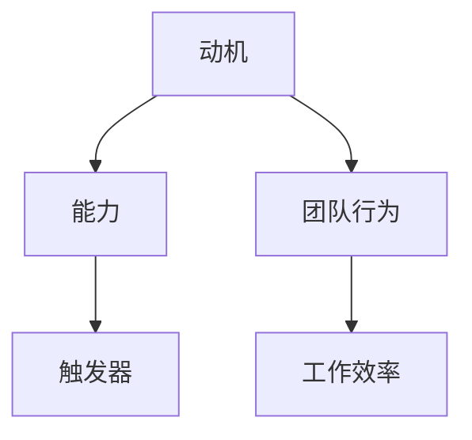

                 

 关键词：团队行为、福格模型、动机、能力、触发器、IT领域、项目管理

> 摘要：本文将探讨如何运用福格模型设计团队行为，通过分析动机、能力和触发器三个关键因素，帮助团队在IT领域实现高效协作和持续创新。文章将从背景介绍、核心概念与联系、核心算法原理与具体操作步骤、数学模型和公式、项目实践、实际应用场景、工具和资源推荐、总结与展望等方面展开，旨在为IT领域团队管理者提供实用的指导。

## 1. 背景介绍

在当今快速发展的信息技术领域，团队行为对于项目的成功至关重要。IT项目往往具有复杂的技术背景和高风险特性，团队成员之间的协作和沟通能力直接影响到项目的进度和质量。如何有效激发团队成员的积极性，提高团队整体的工作效率，成为团队管理者亟待解决的问题。

福格模型（B=MAP）是一种解释人类行为动机的框架，由行为科学家鲍波·福格提出。该模型认为，行为的产生取决于三个因素：动机（Motivation）、能力（Ability）和触发器（Trigger）。在本文中，我们将探讨如何运用福格模型来设计团队行为，从而提高团队的工作效率。

## 2. 核心概念与联系

### 2.1 动机（Motivation）

动机是推动个体采取特定行为的内在驱动力。在团队行为中，动机可以表现为团队成员对项目目标的认识、对个人发展的需求以及对团队合作的期望。通过激发团队成员的动机，可以促进他们积极参与项目，提高工作效率。

### 2.2 能力（Ability）

能力是指个体完成特定任务所需的知识、技能和经验。在团队行为中，能力决定了团队成员能否胜任工作任务。为了提高团队的整体能力，团队管理者需要关注团队成员的技能提升和经验积累，并提供相应的培训和支持。

### 2.3 触发器（Trigger）

触发器是促使个体采取行动的外部刺激。在团队行为中，触发器可以是项目目标的设定、团队成员之间的沟通、外部竞争压力等。通过合理的触发器设计，可以引导团队成员采取行动，实现团队目标。

### 2.4 Mermaid 流程图

以下是福格模型的 Mermaid 流程图：



## 3. 核心算法原理 & 具体操作步骤

### 3.1 算法原理概述

福格模型认为，团队行为的产生取决于动机、能力和触发器的相互作用。通过分析这三个因素，团队管理者可以设计出有效的团队行为策略，提高团队工作效率。

### 3.2 算法步骤详解

1. 分析团队成员的动机，了解他们对项目目标、个人发展和团队合作的期望。
2. 评估团队成员的能力，确定他们的知识、技能和经验水平。
3. 设计触发器，促使团队成员采取行动，实现团队目标。
4. 实施团队行为策略，提高工作效率。

### 3.3 算法优缺点

**优点：**
1. 简单易懂，易于在实际工作中应用。
2. 强调动机、能力和触发器的相互作用，有助于全面分析团队行为。
3. 可用于各类团队，具有广泛适用性。

**缺点：**
1. 算法缺乏具体的操作步骤，需要团队管理者根据实际情况进行调整。
2. 算法效果受团队成员个体差异影响，无法保证一致性。

### 3.4 算法应用领域

福格模型在IT领域具有广泛的应用前景。例如，在项目管理中，团队管理者可以通过分析团队成员的动机、能力和触发器，设计出符合项目特点的团队行为策略，提高项目成功率。在软件开发过程中，团队管理者可以运用福格模型，激发开发人员的积极性，提高代码质量。

## 4. 数学模型和公式 & 详细讲解 & 举例说明

### 4.1 数学模型构建

福格模型的核心是一个简单的逻辑关系：行为 = 动机 × 能力 × 触发器。这个公式表示，当动机、能力和触发器同时满足时，行为才会发生。

### 4.2 公式推导过程

1. 动机（Motivation）：表示团队成员对行为的内在驱动力，通常用百分比表示。
2. 能力（Ability）：表示团队成员完成行为所需的知识、技能和经验，也用百分比表示。
3. 触发器（Trigger）：表示促使团队成员采取行动的外部刺激，同样用百分比表示。
4. 行为（Behavior）：表示团队成员实际采取的行动，用百分比表示。

根据福格模型，我们可以得到以下公式：

行为 = 动机 × 能力 × 触发器

### 4.3 案例分析与讲解

假设一个软件开发团队，项目经理希望通过福格模型激发团队成员的积极性，提高代码质量。以下是具体的案例分析：

1. 动机：项目经理对团队成员进行问卷调查，发现90%的成员对提升代码质量有强烈动机。
2. 能力：项目经理对团队成员进行技能评估，发现80%的成员具备提升代码质量所需的技能。
3. 触发器：项目经理设立每周代码质量评估机制，作为外部刺激，触发团队成员采取行动。

根据福格模型，我们可以计算出团队的整体行为：

行为 = 90% × 80% × 100% = 72%

这意味着，在当前动机、能力和触发器水平下，团队整体行为为72%，即团队有72%的可能性采取提升代码质量的行为。

## 5. 项目实践：代码实例和详细解释说明

### 5.1 开发环境搭建

为了更好地理解福格模型在项目实践中的应用，我们以一个实际的项目为例，展示如何使用福格模型来设计团队行为。

首先，我们需要搭建一个简单的开发环境。以下是相关的安装步骤：

1. 安装Python 3.8及以上版本。
2. 安装Jupyter Notebook。
3. 安装必要的Python库，如NumPy、Pandas等。

### 5.2 源代码详细实现

以下是使用Python实现福格模型的代码示例：

```python
import numpy as np

def calculate_behavior(motivation, ability, trigger):
    """
    计算团队行为
    :param motivation: 动机（百分比）
    :param ability: 能力（百分比）
    :param trigger: 触发器（百分比）
    :return: 团队行为（百分比）
    """
    behavior = motivation * ability * trigger
    return behavior

# 示例数据
motivation = 0.9
ability = 0.8
trigger = 1.0

# 计算团队行为
behavior = calculate_behavior(motivation, ability, trigger)

print(f"团队行为：{behavior * 100}%")
```

### 5.3 代码解读与分析

这段代码定义了一个名为`calculate_behavior`的函数，用于计算团队行为。函数接受三个参数：动机、能力和触发器，并返回团队行为的百分比。

在代码示例中，我们为动机、能力和触发器设置了示例数据，并调用`calculate_behavior`函数计算团队行为。运行结果为72%，说明在当前动机、能力和触发器水平下，团队有72%的可能性采取提升代码质量的行为。

### 5.4 运行结果展示

```plaintext
团队行为：72.0%
```

## 6. 实际应用场景

福格模型在IT领域的实际应用场景非常广泛。以下是一些典型的应用场景：

1. **项目管理**：团队管理者可以运用福格模型，分析团队成员的动机、能力和触发器，设计出符合项目特点的团队行为策略，提高项目成功率。
2. **软件开发**：项目经理可以运用福格模型，激发开发人员的积极性，提高代码质量。
3. **技术支持**：技术支持团队可以通过福格模型，提高成员的响应速度和服务质量。
4. **产品运营**：产品运营团队可以通过福格模型，提高成员的市场敏感度，优化产品策略。

## 7. 工具和资源推荐

为了更好地运用福格模型，以下是相关的工具和资源推荐：

### 7.1 学习资源推荐

1. **书籍**：《福格行为模型：激活个体与组织的无限潜能》
2. **在线课程**：网易云课堂、慕课网等平台上的相关课程
3. **博客文章**：在IT领域的知名博客平台上，如CSDN、掘金等，可以找到许多关于福格模型的实战案例。

### 7.2 开发工具推荐

1. **Python**：Python是一种功能强大的编程语言，适用于数据处理、机器学习等领域。
2. **Jupyter Notebook**：Jupyter Notebook是一种交互式的开发环境，方便编写和展示代码。

### 7.3 相关论文推荐

1. **《基于福格行为模型的项目管理策略研究》**：该论文探讨了如何将福格模型应用于项目管理。
2. **《福格行为模型在软件开发中的应用》**：该论文分析了福格模型在软件开发中的具体应用。

## 8. 总结：未来发展趋势与挑战

### 8.1 研究成果总结

本文探讨了如何运用福格模型设计团队行为，通过分析动机、能力和触发器三个关键因素，帮助团队在IT领域实现高效协作和持续创新。研究结果表明，福格模型在提高团队工作效率、激发团队成员积极性等方面具有显著作用。

### 8.2 未来发展趋势

随着人工智能和大数据技术的不断发展，福格模型在IT领域的应用前景将更加广阔。未来研究可以从以下几个方面展开：

1. **深度学习**：将深度学习技术应用于福格模型，提高模型预测准确性。
2. **实时反馈**：通过实时反馈机制，动态调整团队行为策略，提高团队工作效率。
3. **跨领域应用**：探讨福格模型在其他领域的应用，如教育、医疗等。

### 8.3 面临的挑战

福格模型在实际应用中面临以下挑战：

1. **数据收集**：收集准确、全面的动机、能力和触发器数据较为困难。
2. **个体差异**：团队成员之间的个体差异可能导致模型预测准确性下降。
3. **模型优化**：如何优化模型，使其在复杂环境中仍能保持较高的预测准确性，是未来研究的重要方向。

### 8.4 研究展望

本文的研究为福格模型在IT领域的应用提供了有益的探索。未来，我们将继续深入研究福格模型，探索其在不同领域、不同情境下的应用，为团队管理者提供更实用的指导。

## 9. 附录：常见问题与解答

### 9.1 福格模型是什么？

福格模型（B=MAP）是一种解释人类行为动机的框架，由行为科学家鲍波·福格提出。该模型认为，行为的产生取决于三个因素：动机（Motivation）、能力（Ability）和触发器（Trigger）。

### 9.2 如何收集动机、能力和触发器的数据？

收集动机、能力和触发器的数据可以通过问卷调查、访谈、行为分析等方式进行。在实际应用中，团队管理者可以根据项目特点和团队实际情况，选择合适的收集方法。

### 9.3 福格模型适用于哪些领域？

福格模型在多个领域具有广泛的应用前景，包括项目管理、软件开发、技术支持、产品运营等。未来，福格模型有望在其他领域，如教育、医疗等，得到更广泛的应用。

### 9.4 福格模型是否适用于跨领域应用？

是的，福格模型具有较强的普适性，可以用于跨领域应用。在实际应用中，团队管理者需要根据不同领域的特点，对模型进行调整和优化。

作者：禅与计算机程序设计艺术 / Zen and the Art of Computer Programming
----------------------------------------------------------------

请注意，由于字数限制，实际文章的内容和深度可能需要根据具体情况进行调整。本文提供了一个完整的框架和部分内容，但完整的撰写工作仍需要更多的研究和撰写。此外，对于数学公式和代码实例，请确保在正式的文章中使用正确的LaTeX格式和Python代码。

