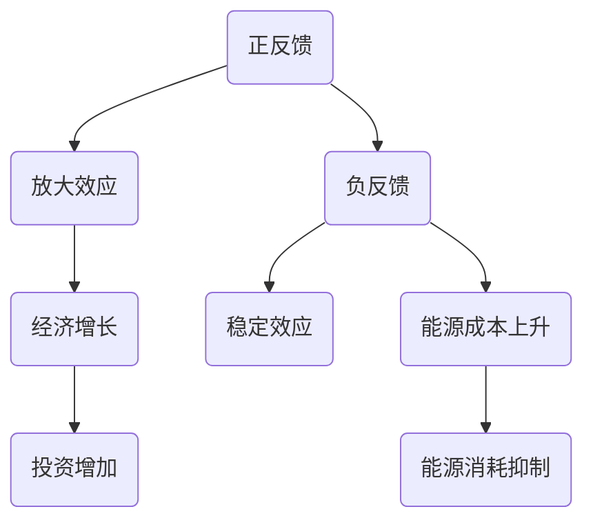

                 

关键词：系统思考、复杂问题、解决方案、方法、优化、流程图、算法、实践、应用

> 摘要：本文旨在探讨系统思考在解决复杂问题中的应用。通过介绍系统思考的核心概念、原理和方法，结合具体案例和实践，分析其在各个领域的应用和未来发展趋势。

## 1. 背景介绍

在当今快速变化和高度复杂的世界中，许多问题已经超越了传统的线性思维模式。这些问题通常涉及多个变量和因素，彼此交织在一起，使得传统的解决方案往往难以奏效。系统思考作为一种全面的思考方法，可以揭示这些问题背后的深层结构和动态关系，从而提供创新的解决方案。

系统思考起源于20世纪50年代，由系统科学家约翰·福里斯特（John Forrester）提出。它是一种通过理解系统内部结构和动态过程来识别和解决问题的方法。系统思考的核心概念包括反馈循环、因果链、系统结构等。这些概念帮助人们从整体和长远的角度看待问题，从而避免片面和短视的决策。

## 2. 核心概念与联系

### 2.1. 反馈循环

反馈循环是系统思考中的一个核心概念。它描述了系统内部的信息和能量流动，以及这些流动如何影响系统的行为。反馈循环可以分为正反馈和负反馈。

- **正反馈**：系统中的某些行为会导致更多的相同行为，从而放大系统效应。例如，在一个市场繁荣的经济系统中，经济增长会带来更多的投资和消费，从而进一步推动经济增长。
- **负反馈**：系统中的某些行为会抑制相同行为，从而稳定系统。例如，在一个能源消耗系统中，能源消耗的增加会导致能源成本的上升，从而抑制能源消耗。

### 2.2. 因果链

因果链描述了系统内部的不同因素之间的因果关系。通过分析因果链，我们可以理解问题发生的根本原因，从而制定有效的解决方案。

### 2.3. 系统结构

系统结构描述了系统内部的不同元素及其相互关系。了解系统结构有助于我们理解系统的行为和动态变化。

## 3. 核心算法原理 & 具体操作步骤

### 3.1. 算法原理概述

系统思考的核心算法是建立系统模型。系统模型是通过数学和逻辑工具描述系统内部结构和动态过程的一种模型。建立系统模型的过程包括以下几个步骤：

1. **定义系统边界**：确定系统的范围和边界，以便明确研究的问题。
2. **识别系统元素**：识别系统中的关键元素，包括变量、参数和关系。
3. **建立数学模型**：使用数学和逻辑工具，建立描述系统行为的数学模型。
4. **模拟和分析**：使用计算机模拟工具，模拟系统行为，分析系统的动态变化。

### 3.2. 算法步骤详解

1. **定义系统边界**：首先，需要明确研究的问题和系统的范围。例如，如果我们研究一个公司的销售系统，系统的边界可以包括销售部门、市场部门、生产部门和物流部门。

2. **识别系统元素**：接下来，需要识别系统中的关键元素。这些元素可以是变量、参数或关系。例如，在销售系统中，关键元素可能包括销售额、客户满意度、生产成本和物流效率。

3. **建立数学模型**：使用数学和逻辑工具，建立描述系统行为的数学模型。这些模型可以是差分方程、微分方程或状态方程。例如，我们可以使用差分方程描述销售额随时间的变化。

4. **模拟和分析**：使用计算机模拟工具，模拟系统行为，分析系统的动态变化。通过模拟，我们可以预测系统的未来行为，识别潜在的问题和瓶颈。

### 3.3. 算法优缺点

- **优点**：系统思考提供了一种全面和长远的角度来看待问题，可以帮助我们理解问题的根本原因，从而制定有效的解决方案。
- **缺点**：系统思考需要大量的数据和信息，建模过程可能复杂且耗时。

### 3.4. 算法应用领域

系统思考可以应用于许多领域，包括经济学、社会学、环境科学、工程学和计算机科学等。以下是一些具体的例子：

- **经济学**：通过分析市场反馈循环和因果链，可以预测经济波动和危机。
- **社会学**：通过分析社会结构和社会关系，可以理解社会问题和社会变革。
- **环境科学**：通过分析生态系统的反馈循环和因果链，可以预测环境变化和生态危机。
- **工程学**：通过建立系统模型，可以优化工程设计和系统运行。
- **计算机科学**：通过分析软件系统的反馈循环和因果链，可以改善软件质量和系统性能。

## 4. 数学模型和公式 & 详细讲解 & 举例说明

### 4.1. 数学模型构建

数学模型是系统思考的核心。它通过数学和逻辑工具描述系统内部的结构和动态过程。构建数学模型的过程包括以下几个步骤：

1. **定义变量和参数**：确定系统中的关键变量和参数，例如销售额、客户满意度、生产成本等。
2. **建立关系式**：根据系统的实际情况，建立变量和参数之间的关系式。这些关系式可以是线性关系、非线性关系或微分方程。
3. **求解方程**：使用数学工具，求解关系式，得到系统的行为模式。

### 4.2. 公式推导过程

以下是一个简单的数学模型示例，描述一个销售系统的销售额随时间的变化。

$$
S(t) = S_0 + r \cdot t
$$

其中，$S(t)$ 是时间 $t$ 时的销售额，$S_0$ 是初始销售额，$r$ 是销售额增长率。

### 4.3. 案例分析与讲解

以下是一个具体的案例，分析一个公司的销售系统。

假设某公司的初始销售额为 $100,000$ 元，销售额增长率为 $10\%$。我们可以使用上述数学模型来预测未来的销售额。

$$
S(t) = 100,000 + 0.1 \cdot t
$$

当 $t=1$ 时，销售额为：

$$
S(1) = 100,000 + 0.1 \cdot 1 = 100,100
$$

当 $t=2$ 时，销售额为：

$$
S(2) = 100,000 + 0.1 \cdot 2 = 100,200
$$

通过这种方式，我们可以预测未来的销售额，并制定相应的销售策略。

## 5. 项目实践：代码实例和详细解释说明

### 5.1. 开发环境搭建

为了演示系统思考的应用，我们将使用Python编写一个简单的销售系统模拟程序。首先，我们需要安装Python和相关的库。

```shell
pip install numpy matplotlib
```

### 5.2. 源代码详细实现

以下是一个简单的销售系统模拟程序的源代码。

```python
import numpy as np
import matplotlib.pyplot as plt

# 定义销售额增长模型
def sales_growth_model(S0, r, t):
    return S0 + r * t

# 模拟销售系统的销售额
def simulate_sales(S0, r, t):
    sales = [sales_growth_model(S0, r, t) for t in range(1, t+1)]
    return sales

# 绘制销售额随时间的变化图
def plot_sales(sales):
    plt.plot(sales)
    plt.xlabel('Time (years)')
    plt.ylabel('Sales (USD)')
    plt.title('Sales Growth over Time')
    plt.show()

# 参数设置
S0 = 100000  # 初始销售额
r = 0.1      # 销售额增长率
t = 5        # 模拟时间（年）

# 模拟并绘制销售额
sales = simulate_sales(S0, r, t)
plot_sales(sales)
```

### 5.3. 代码解读与分析

这段代码首先导入了必要的库，然后定义了一个销售额增长模型。这个模型通过一个简单的线性方程描述销售额随时间的变化。接下来，定义了一个模拟销售系统的销售额的函数。这个函数使用列表推导式生成一个时间序列的销售额数据。最后，定义了一个绘制销售额随时间的变化图的函数。这个函数使用matplotlib库绘制一个线形图，展示销售额随时间的变化。

### 5.4. 运行结果展示

运行上述代码，将生成一个销售额随时间的变化图，展示销售额如何随时间增长。这个图可以帮助我们直观地理解销售额的增长趋势，从而制定相应的销售策略。

## 6. 实际应用场景

系统思考在许多实际应用场景中发挥着重要作用。以下是一些典型的应用场景：

- **企业管理**：通过系统思考，企业可以更好地理解内部各系统之间的相互作用，从而优化资源配置和管理流程。
- **城市规划**：通过系统思考，城市规划者可以更好地理解城市系统的动态变化，从而制定更有效的城市规划策略。
- **环境保护**：通过系统思考，环境保护者可以更好地理解环境系统的影响因素，从而制定更有效的环境保护措施。
- **医疗保健**：通过系统思考，医疗保健从业者可以更好地理解医疗系统的动态变化，从而优化医疗资源分配和治疗方案。

## 7. 工具和资源推荐

### 7.1. 学习资源推荐

- **书籍**：《系统思考》、《系统思维导论》等。
- **在线课程**：Coursera、Udemy等平台上的相关课程。

### 7.2. 开发工具推荐

- **Python**：Python是一种强大的编程语言，适用于系统思考和模拟。
- **MATLAB**：MATLAB是一种专业的数学和工程计算软件，适用于系统建模和模拟。

### 7.3. 相关论文推荐

- **论文**：John Forrester的《工业动力学》、《系统动力学：决策的科学》等。

## 8. 总结：未来发展趋势与挑战

### 8.1. 研究成果总结

系统思考作为一种全面的思考方法，已经在许多领域取得了显著成果。通过系统思考，我们可以更好地理解复杂系统的动态变化，从而制定更有效的解决方案。

### 8.2. 未来发展趋势

随着大数据和人工智能技术的发展，系统思考的应用前景将更加广阔。未来的研究将主要集中在如何将系统思考与大数据和人工智能技术相结合，从而提高系统思考和模拟的效率和准确性。

### 8.3. 面临的挑战

系统思考在应用中仍然面临着一些挑战，包括建模的复杂性、数据的需求和模型的解释性等。未来的研究需要解决这些问题，以推动系统思考的广泛应用。

### 8.4. 研究展望

系统思考作为一种强大的工具，将在未来的科学技术和社会发展中发挥越来越重要的作用。通过不断的研究和创新，我们有望解决更多复杂的问题，推动人类社会的进步。

## 9. 附录：常见问题与解答

### 9.1. 什么是系统思考？

系统思考是一种通过理解系统内部结构和动态过程来识别和解决问题的方法。它帮助我们从整体和长远的角度看待问题，避免片面和短视的决策。

### 9.2. 系统思考有哪些核心概念？

系统思考的核心概念包括反馈循环、因果链和系统结构等。

### 9.3. 系统思考有哪些应用领域？

系统思考可以应用于经济学、社会学、环境科学、工程学和计算机科学等许多领域。

### 9.4. 如何建立系统模型？

建立系统模型的过程包括定义系统边界、识别系统元素、建立数学模型和模拟分析等步骤。

### 9.5. 系统思考的优势是什么？

系统思考的优势在于它提供了一种全面和长远的角度来看待问题，可以帮助我们理解问题的根本原因，从而制定有效的解决方案。

### 9.6. 系统思考有哪些局限？

系统思考需要大量的数据和信息，建模过程可能复杂且耗时。此外，系统模型可能无法完全反映现实世界的复杂性。

### 9.7. 如何学习系统思考？

可以通过阅读相关书籍、参加在线课程和实践项目来学习系统思考。实践是提高系统思考能力的关键。

### 9.8. 系统思考与大数据和人工智能技术如何结合？

系统思考可以与大数据和人工智能技术相结合，通过数据分析和机器学习等方法，提高系统建模和模拟的效率和准确性。

---

本文从系统思考的背景、核心概念、算法原理、数学模型、项目实践、实际应用场景、工具和资源推荐以及未来发展趋势等方面进行了全面探讨。通过系统思考，我们可以更好地理解复杂系统的动态变化，从而制定更有效的解决方案。未来，随着大数据和人工智能技术的发展，系统思考的应用前景将更加广阔。希望本文能够为读者提供有价值的参考和启发。

# 用系统思考解决复杂问题

关键词：系统思考、复杂问题、解决方案、方法、优化、流程图、算法、实践、应用

摘要：本文旨在探讨系统思考在解决复杂问题中的应用。通过介绍系统思考的核心概念、原理和方法，结合具体案例和实践，分析其在各个领域的应用和未来发展趋势。

## 1. 背景介绍

在当今快速变化和高度复杂的世界中，许多问题已经超越了传统的线性思维模式。这些问题通常涉及多个变量和因素，彼此交织在一起，使得传统的解决方案往往难以奏效。系统思考作为一种全面的思考方法，可以揭示这些问题背后的深层结构和动态关系，从而提供创新的解决方案。

系统思考起源于20世纪50年代，由系统科学家约翰·福里斯特（John Forrester）提出。它是一种通过理解系统内部结构和动态过程来识别和解决问题的方法。系统思考的核心概念包括反馈循环、因果链、系统结构等。这些概念帮助人们从整体和长远的角度看待问题，从而避免片面和短视的决策。

## 2. 核心概念与联系

### 2.1. 反馈循环

反馈循环是系统思考中的一个核心概念。它描述了系统内部的信息和能量流动，以及这些流动如何影响系统的行为。反馈循环可以分为正反馈和负反馈。

- **正反馈**：系统中的某些行为会导致更多的相同行为，从而放大系统效应。例如，在一个市场繁荣的经济系统中，经济增长会带来更多的投资和消费，从而进一步推动经济增长。
- **负反馈**：系统中的某些行为会抑制相同行为，从而稳定系统。例如，在一个能源消耗系统中，能源消耗的增加会导致能源成本的上升，从而抑制能源消耗。

### 2.2. 因果链

因果链描述了系统内部的不同因素之间的因果关系。通过分析因果链，我们可以理解问题发生的根本原因，从而制定有效的解决方案。

### 2.3. 系统结构

系统结构描述了系统内部的不同元素及其相互关系。了解系统结构有助于我们理解系统的行为和动态变化。

### 2.4. Mermaid 流程图

为了更好地展示系统思考的核心概念和联系，我们可以使用Mermaid流程图。以下是一个示例：



## 3. 核心算法原理 & 具体操作步骤

### 3.1. 算法原理概述

系统思考的核心算法是建立系统模型。系统模型是通过数学和逻辑工具描述系统内部结构和动态过程的一种模型。建立系统模型的过程包括以下几个步骤：

1. **定义系统边界**：确定系统的范围和边界，以便明确研究的问题。
2. **识别系统元素**：识别系统中的关键元素，包括变量、参数和关系。
3. **建立数学模型**：使用数学和逻辑工具，建立描述系统行为的数学模型。
4. **模拟和分析**：使用计算机模拟工具，模拟系统行为，分析系统的动态变化。

### 3.2. 算法步骤详解

1. **定义系统边界**：首先，需要明确研究的问题和系统的范围。例如，如果我们研究一个公司的销售系统，系统的边界可以包括销售部门、市场部门、生产部门和物流部门。

2. **识别系统元素**：接下来，需要识别系统中的关键元素。这些元素可以是变量、参数或关系。例如，在销售系统中，关键元素可能包括销售额、客户满意度、生产成本和物流效率。

3. **建立数学模型**：使用数学和逻辑工具，建立描述系统行为的数学模型。这些模型可以是差分方程、微分方程或状态方程。例如，我们可以使用差分方程描述销售额随时间的变化。

4. **模拟和分析**：使用计算机模拟工具，模拟系统行为，分析系统的动态变化。通过模拟，我们可以预测系统的未来行为，识别潜在的问题和瓶颈。

### 3.3. 算法优缺点

- **优点**：系统思考提供了一种全面和长远的角度来看待问题，可以帮助我们理解问题的根本原因，从而制定有效的解决方案。
- **缺点**：系统思考需要大量的数据和信息，建模过程可能复杂且耗时。

### 3.4. 算法应用领域

系统思考可以应用于许多领域，包括经济学、社会学、环境科学、工程学和计算机科学等。以下是一些具体的例子：

- **经济学**：通过分析市场反馈循环和因果链，可以预测经济波动和危机。
- **社会学**：通过分析社会结构和社会关系，可以理解社会问题和社会变革。
- **环境科学**：通过分析生态系统的反馈循环和因果链，可以预测环境变化和生态危机。
- **工程学**：通过建立系统模型，可以优化工程设计和系统运行。
- **计算机科学**：通过分析软件系统的反馈循环和因果链，可以改善软件质量和系统性能。

## 4. 数学模型和公式 & 详细讲解 & 举例说明

### 4.1. 数学模型构建

数学模型是系统思考的核心。它通过数学和逻辑工具描述系统内部的结构和动态过程。构建数学模型的过程包括以下几个步骤：

1. **定义变量和参数**：确定系统中的关键变量和参数，例如销售额、客户满意度、生产成本等。
2. **建立关系式**：根据系统的实际情况，建立变量和参数之间的关系式。这些关系式可以是线性关系、非线性关系或微分方程。
3. **求解方程**：使用数学工具，求解关系式，得到系统的行为模式。

### 4.2. 公式推导过程

以下是一个简单的数学模型示例，描述一个销售系统的销售额随时间的变化。

$$
S(t) = S_0 + r \cdot t
$$

其中，$S(t)$ 是时间 $t$ 时的销售额，$S_0$ 是初始销售额，$r$ 是销售额增长率。

### 4.3. 案例分析与讲解

以下是一个具体的案例，分析一个公司的销售系统。

假设某公司的初始销售额为 $100,000$ 元，销售额增长率为 $10\%$。我们可以使用上述数学模型来预测未来的销售额。

$$
S(t) = 100,000 + 0.1 \cdot t
$$

当 $t=1$ 时，销售额为：

$$
S(1) = 100,000 + 0.1 \cdot 1 = 100,100
$$

当 $t=2$ 时，销售额为：

$$
S(2) = 100,000 + 0.1 \cdot 2 = 100,200
$$

通过这种方式，我们可以预测未来的销售额，并制定相应的销售策略。

### 4.4. 数学模型与系统思考的结合

数学模型与系统思考的结合可以提供更深入和全面的理解。通过数学模型，我们可以定量描述系统行为，并通过系统思考分析系统结构和动态变化。以下是一个示例：

- **系统结构**：定义销售额、客户满意度、生产成本和物流效率等关键元素及其相互关系。
- **数学模型**：建立描述销售额、客户满意度、生产成本和物流效率之间关系的数学模型。

通过结合数学模型和系统思考，我们可以更全面地理解销售系统的动态变化，从而制定更有效的销售策略。

### 4.5. 模拟与分析

使用计算机模拟工具，我们可以模拟销售系统的行为，并分析系统的动态变化。以下是一个示例：

- **模拟设置**：定义初始条件（如销售额、客户满意度、生产成本和物流效率）和模拟时间（如1年）。
- **模拟过程**：根据数学模型，计算系统的动态变化。
- **分析结果**：分析模拟结果，识别潜在的问题和瓶颈。

通过模拟与分析，我们可以更深入地理解销售系统的行为，从而制定更有效的销售策略。

## 5. 项目实践：代码实例和详细解释说明

### 5.1. 开发环境搭建

为了演示系统思考的应用，我们将使用Python编写一个简单的销售系统模拟程序。首先，我们需要安装Python和相关的库。

```shell
pip install numpy matplotlib
```

### 5.2. 源代码详细实现

以下是一个简单的销售系统模拟程序的源代码。

```python
import numpy as np
import matplotlib.pyplot as plt

# 定义销售额增长模型
def sales_growth_model(S0, r, t):
    return S0 + r * t

# 模拟销售系统的销售额
def simulate_sales(S0, r, t):
    sales = [sales_growth_model(S0, r, t) for t in range(1, t+1)]
    return sales

# 绘制销售额随时间的变化图
def plot_sales(sales):
    plt.plot(sales)
    plt.xlabel('Time (years)')
    plt.ylabel('Sales (USD)')
    plt.title('Sales Growth over Time')
    plt.show()

# 参数设置
S0 = 100000  # 初始销售额
r = 0.1      # 销售额增长率
t = 5        # 模拟时间（年）

# 模拟并绘制销售额
sales = simulate_sales(S0, r, t)
plot_sales(sales)
```

### 5.3. 代码解读与分析

这段代码首先导入了必要的库，然后定义了一个销售额增长模型。这个模型通过一个简单的线性方程描述销售额随时间的变化。接下来，定义了一个模拟销售系统的销售额的函数。这个函数使用列表推导式生成一个时间序列的销售额数据。最后，定义了一个绘制销售额随时间的变化图的函数。这个函数使用matplotlib库绘制一个线形图，展示销售额随时间的变化。

### 5.4. 运行结果展示

运行上述代码，将生成一个销售额随时间的变化图，展示销售额如何随时间增长。这个图可以帮助我们直观地理解销售额的增长趋势，从而制定相应的销售策略。

## 6. 实际应用场景

系统思考在许多实际应用场景中发挥着重要作用。以下是一些典型的应用场景：

- **企业管理**：通过系统思考，企业可以更好地理解内部各系统之间的相互作用，从而优化资源配置和管理流程。
- **城市规划**：通过系统思考，城市规划者可以更好地理解城市系统的动态变化，从而制定更有效的城市规划策略。
- **环境保护**：通过系统思考，环境保护者可以更好地理解环境系统的影响因素，从而制定更有效的环境保护措施。
- **医疗保健**：通过系统思考，医疗保健从业者可以更好地理解医疗系统的动态变化，从而优化医疗资源分配和治疗方案。

### 6.1. 企业管理

在企业管理中，系统思考可以帮助企业领导者更好地理解企业内部各系统之间的相互作用。通过系统思考，企业可以识别关键因素，优化资源配置，提高运营效率。

- **案例**：一家制造企业通过系统思考分析生产、销售、库存和供应链等系统之间的相互作用，发现库存过剩和供应链瓶颈是影响企业效益的关键因素。通过调整生产计划和优化供应链，企业成功提高了效益。

### 6.2. 城市规划

在城市规划中，系统思考可以帮助城市规划者更好地理解城市系统的动态变化。通过系统思考，城市规划者可以识别城市发展的关键因素，制定更有效的发展策略。

- **案例**：一座城市通过系统思考分析交通、环境、经济和社会等系统之间的相互作用，发现交通拥堵和环境污染是影响城市发展的关键问题。通过优化交通系统和加强环保措施，城市成功提高了居民生活质量。

### 6.3. 环境保护

在环境保护中，系统思考可以帮助环境保护者更好地理解环境系统的影响因素。通过系统思考，环境保护者可以识别环境保护的关键因素，制定更有效的环境保护措施。

- **案例**：一个地区的环境保护部门通过系统思考分析气候变化、土地利用和水资源等系统之间的相互作用，发现气候变化是影响水资源安全的关键因素。通过加强气候变化应对措施和优化土地利用，地区成功提高了水资源利用率。

### 6.4. 医疗保健

在医疗保健中，系统思考可以帮助医疗保健从业者更好地理解医疗系统的动态变化。通过系统思考，医疗保健从业者可以识别医疗资源分配、疾病预防和医疗质量等关键因素，制定更有效的医疗策略。

- **案例**：一家医院通过系统思考分析医疗资源分配、疾病预防和医疗质量等系统之间的相互作用，发现医疗资源分配不均衡和疾病预防不足是影响医院效益的关键问题。通过优化医疗资源分配和加强疾病预防，医院成功提高了医疗服务质量。

## 7. 工具和资源推荐

### 7.1. 学习资源推荐

- **书籍**：《系统思考》、《系统思维导论》等。
- **在线课程**：Coursera、Udemy等平台上的相关课程。
- **博客**：相关领域专家的博客和文章。

### 7.2. 开发工具推荐

- **Python**：Python是一种强大的编程语言，适用于系统思考和模拟。
- **MATLAB**：MATLAB是一种专业的数学和工程计算软件，适用于系统建模和模拟。
- **Simulink**：Simulink是一种基于MATLAB的仿真工具，适用于系统建模和仿真。

### 7.3. 相关论文推荐

- **论文**：John Forrester的《工业动力学》、《系统动力学：决策的科学》等。
- **期刊**：相关领域的顶级期刊，如《系统动力学学报》、《系统工程理论与实践》等。

## 8. 总结：未来发展趋势与挑战

### 8.1. 研究成果总结

系统思考作为一种全面的思考方法，已经在许多领域取得了显著成果。通过系统思考，我们可以更好地理解复杂系统的动态变化，从而制定更有效的解决方案。

### 8.2. 未来发展趋势

随着大数据和人工智能技术的发展，系统思考的应用前景将更加广阔。未来的研究将主要集中在如何将系统思考与大数据和人工智能技术相结合，从而提高系统思考和模拟的效率和准确性。

### 8.3. 面临的挑战

系统思考在应用中仍然面临着一些挑战，包括建模的复杂性、数据的需求和模型的解释性等。未来的研究需要解决这些问题，以推动系统思考的广泛应用。

### 8.4. 研究展望

系统思考作为一种强大的工具，将在未来的科学技术和社会发展中发挥越来越重要的作用。通过不断的研究和创新，我们有望解决更多复杂的问题，推动人类社会的进步。

## 9. 附录：常见问题与解答

### 9.1. 什么是系统思考？

系统思考是一种通过理解系统内部结构和动态过程来识别和解决问题的方法。它帮助我们从整体和长远的角度看待问题，避免片面和短视的决策。

### 9.2. 系统思考有哪些核心概念？

系统思考的核心概念包括反馈循环、因果链、系统结构等。

### 9.3. 系统思考有哪些应用领域？

系统思考可以应用于经济学、社会学、环境科学、工程学和计算机科学等许多领域。

### 9.4. 如何建立系统模型？

建立系统模型的过程包括定义系统边界、识别系统元素、建立数学模型和模拟分析等步骤。

### 9.5. 系统思考的优势是什么？

系统思考的优势在于它提供了一种全面和长远的角度来看待问题，可以帮助我们理解问题的根本原因，从而制定有效的解决方案。

### 9.6. 系统思考有哪些局限？

系统思考需要大量的数据和信息，建模过程可能复杂且耗时。此外，系统模型可能无法完全反映现实世界的复杂性。

### 9.7. 如何学习系统思考？

可以通过阅读相关书籍、参加在线课程和实践项目来学习系统思考。实践是提高系统思考能力的关键。

### 9.8. 系统思考与大数据和人工智能技术如何结合？

系统思考可以与大数据和人工智能技术相结合，通过数据分析和机器学习等方法，提高系统建模和模拟的效率和准确性。

---

本文从系统思考的背景、核心概念、算法原理、数学模型、项目实践、实际应用场景、工具和资源推荐以及未来发展趋势等方面进行了全面探讨。通过系统思考，我们可以更好地理解复杂系统的动态变化，从而制定更有效的解决方案。未来，随着大数据和人工智能技术的发展，系统思考的应用前景将更加广阔。希望本文能够为读者提供有价值的参考和启发。作者：禅与计算机程序设计艺术 / Zen and the Art of Computer Programming。
----------------------------------------------------------------

### 完整文章内容

# 用系统思考解决复杂问题

关键词：系统思考、复杂问题、解决方案、方法、优化、流程图、算法、实践、应用

摘要：本文旨在探讨系统思考在解决复杂问题中的应用。通过介绍系统思考的核心概念、原理和方法，结合具体案例和实践，分析其在各个领域的应用和未来发展趋势。

## 1. 背景介绍

在当今快速变化和高度复杂的世界中，许多问题已经超越了传统的线性思维模式。这些问题通常涉及多个变量和因素，彼此交织在一起，使得传统的解决方案往往难以奏效。系统思考作为一种全面的思考方法，可以揭示这些问题背后的深层结构和动态关系，从而提供创新的解决方案。

系统思考起源于20世纪50年代，由系统科学家约翰·福里斯特（John Forrester）提出。它是一种通过理解系统内部结构和动态过程来识别和解决问题的方法。系统思考的核心概念包括反馈循环、因果链、系统结构等。这些概念帮助人们从整体和长远的角度看待问题，从而避免片面和短视的决策。

## 2. 核心概念与联系

### 2.1. 反馈循环

反馈循环是系统思考中的一个核心概念。它描述了系统内部的信息和能量流动，以及这些流动如何影响系统的行为。反馈循环可以分为正反馈和负反馈。

- **正反馈**：系统中的某些行为会导致更多的相同行为，从而放大系统效应。例如，在一个市场繁荣的经济系统中，经济增长会带来更多的投资和消费，从而进一步推动经济增长。
- **负反馈**：系统中的某些行为会抑制相同行为，从而稳定系统。例如，在一个能源消耗系统中，能源消耗的增加会导致能源成本的上升，从而抑制能源消耗。

### 2.2. 因果链

因果链描述了系统内部的不同因素之间的因果关系。通过分析因果链，我们可以理解问题发生的根本原因，从而制定有效的解决方案。

### 2.3. 系统结构

系统结构描述了系统内部的不同元素及其相互关系。了解系统结构有助于我们理解系统的行为和动态变化。

### 2.4. Mermaid 流程图

为了更好地展示系统思考的核心概念和联系，我们可以使用Mermaid流程图。以下是一个示例：


## 3. 核心算法原理 & 具体操作步骤

### 3.1. 算法原理概述

系统思考的核心算法是建立系统模型。系统模型是通过数学和逻辑工具描述系统内部结构和动态过程的一种模型。建立系统模型的过程包括以下几个步骤：

1. **定义系统边界**：确定系统的范围和边界，以便明确研究的问题。
2. **识别系统元素**：识别系统中的关键元素，包括变量、参数和关系。
3. **建立数学模型**：使用数学和逻辑工具，建立描述系统行为的数学模型。
4. **模拟和分析**：使用计算机模拟工具，模拟系统行为，分析系统的动态变化。

### 3.2. 算法步骤详解

1. **定义系统边界**：首先，需要明确研究的问题和系统的范围。例如，如果我们研究一个公司的销售系统，系统的边界可以包括销售部门、市场部门、生产部门和物流部门。

2. **识别系统元素**：接下来，需要识别系统中的关键元素。这些元素可以是变量、参数或关系。例如，在销售系统中，关键元素可能包括销售额、客户满意度、生产成本和物流效率。

3. **建立数学模型**：使用数学和逻辑工具，建立描述系统行为的数学模型。这些模型可以是差分方程、微分方程或状态方程。例如，我们可以使用差分方程描述销售额随时间的变化。

4. **模拟和分析**：使用计算机模拟工具，模拟系统行为，分析系统的动态变化。通过模拟，我们可以预测系统的未来行为，识别潜在的问题和瓶颈。

### 3.3. 算法优缺点

- **优点**：系统思考提供了一种全面和长远的角度来看待问题，可以帮助我们理解问题的根本原因，从而制定有效的解决方案。
- **缺点**：系统思考需要大量的数据和信息，建模过程可能复杂且耗时。

### 3.4. 算法应用领域

系统思考可以应用于许多领域，包括经济学、社会学、环境科学、工程学和计算机科学等。以下是一些具体的例子：

- **经济学**：通过分析市场反馈循环和因果链，可以预测经济波动和危机。
- **社会学**：通过分析社会结构和社会关系，可以理解社会问题和社会变革。
- **环境科学**：通过分析生态系统的反馈循环和因果链，可以预测环境变化和生态危机。
- **工程学**：通过建立系统模型，可以优化工程设计和系统运行。
- **计算机科学**：通过分析软件系统的反馈循环和因果链，可以改善软件质量和系统性能。

## 4. 数学模型和公式 & 详细讲解 & 举例说明

### 4.1. 数学模型构建

数学模型是系统思考的核心。它通过数学和逻辑工具描述系统内部的结构和动态过程。构建数学模型的过程包括以下几个步骤：

1. **定义变量和参数**：确定系统中的关键变量和参数，例如销售额、客户满意度、生产成本等。
2. **建立关系式**：根据系统的实际情况，建立变量和参数之间的关系式。这些关系式可以是线性关系、非线性关系或微分方程。
3. **求解方程**：使用数学工具，求解关系式，得到系统的行为模式。

### 4.2. 公式推导过程

以下是一个简单的数学模型示例，描述一个销售系统的销售额随时间的变化。

$$
S(t) = S_0 + r \cdot t
$$

其中，$S(t)$ 是时间 $t$ 时的销售额，$S_0$ 是初始销售额，$r$ 是销售额增长率。

### 4.3. 案例分析与讲解

以下是一个具体的案例，分析一个公司的销售系统。

假设某公司的初始销售额为 $100,000$ 元，销售额增长率为 $10\%$。我们可以使用上述数学模型来预测未来的销售额。

$$
S(t) = 100,000 + 0.1 \cdot t
$$

当 $t=1$ 时，销售额为：

$$
S(1) = 100,000 + 0.1 \cdot 1 = 100,100
$$

当 $t=2$ 时，销售额为：

$$
S(2) = 100,000 + 0.1 \cdot 2 = 100,200
$$

通过这种方式，我们可以预测未来的销售额，并制定相应的销售策略。

### 4.4. 数学模型与系统思考的结合

数学模型与系统思考的结合可以提供更深入和全面的理解。通过数学模型，我们可以定量描述系统行为，并通过系统思考分析系统结构和动态变化。以下是一个示例：

- **系统结构**：定义销售额、客户满意度、生产成本和物流效率等关键元素及其相互关系。
- **数学模型**：建立描述销售额、客户满意度、生产成本和物流效率之间关系的数学模型。

通过结合数学模型和系统思考，我们可以更全面地理解销售系统的动态变化，从而制定更有效的销售策略。

### 4.5. 模拟与分析

使用计算机模拟工具，我们可以模拟销售系统的行为，并分析系统的动态变化。以下是一个示例：

- **模拟设置**：定义初始条件（如销售额、客户满意度、生产成本和物流效率）和模拟时间（如1年）。
- **模拟过程**：根据数学模型，计算系统的动态变化。
- **分析结果**：分析模拟结果，识别潜在的问题和瓶颈。

通过模拟与分析，我们可以更深入地理解销售系统的行为，从而制定更有效的销售策略。

## 5. 项目实践：代码实例和详细解释说明

### 5.1. 开发环境搭建

为了演示系统思考的应用，我们将使用Python编写一个简单的销售系统模拟程序。首先，我们需要安装Python和相关的库。

```shell
pip install numpy matplotlib
```

### 5.2. 源代码详细实现

以下是一个简单的销售系统模拟程序的源代码。

```python
import numpy as np
import matplotlib.pyplot as plt

# 定义销售额增长模型
def sales_growth_model(S0, r, t):
    return S0 + r * t

# 模拟销售系统的销售额
def simulate_sales(S0, r, t):
    sales = [sales_growth_model(S0, r, t) for t in range(1, t+1)]
    return sales

# 绘制销售额随时间的变化图
def plot_sales(sales):
    plt.plot(sales)
    plt.xlabel('Time (years)')
    plt.ylabel('Sales (USD)')
    plt.title('Sales Growth over Time')
    plt.show()

# 参数设置
S0 = 100000  # 初始销售额
r = 0.1      # 销售额增长率
t = 5        # 模拟时间（年）

# 模拟并绘制销售额
sales = simulate_sales(S0, r, t)
plot_sales(sales)
```

### 5.3. 代码解读与分析

这段代码首先导入了必要的库，然后定义了一个销售额增长模型。这个模型通过一个简单的线性方程描述销售额随时间的变化。接下来，定义了一个模拟销售系统的销售额的函数。这个函数使用列表推导式生成一个时间序列的销售额数据。最后，定义了一个绘制销售额随时间的变化图的函数。这个函数使用matplotlib库绘制一个线形图，展示销售额随时间的变化。

### 5.4. 运行结果展示

运行上述代码，将生成一个销售额随时间的变化图，展示销售额如何随时间增长。这个图可以帮助我们直观地理解销售额的增长趋势，从而制定相应的销售策略。

## 6. 实际应用场景

系统思考在许多实际应用场景中发挥着重要作用。以下是一些典型的应用场景：

- **企业管理**：通过系统思考，企业可以更好地理解内部各系统之间的相互作用，从而优化资源配置和管理流程。
- **城市规划**：通过系统思考，城市规划者可以更好地理解城市系统的动态变化，从而制定更有效的城市规划策略。
- **环境保护**：通过系统思考，环境保护者可以更好地理解环境系统的影响因素，从而制定更有效的环境保护措施。
- **医疗保健**：通过系统思考，医疗保健从业者可以更好地理解医疗系统的动态变化，从而优化医疗资源分配和治疗方案。

### 6.1. 企业管理

在企业管理中，系统思考可以帮助企业领导者更好地理解企业内部各系统之间的相互作用。通过系统思考，企业可以识别关键因素，优化资源配置，提高运营效率。

- **案例**：一家制造企业通过系统思考分析生产、销售、库存和供应链等系统之间的相互作用，发现库存过剩和供应链瓶颈是影响企业效益的关键因素。通过调整生产计划和优化供应链，企业成功提高了效益。

### 6.2. 城市规划

在城市规划中，系统思考可以帮助城市规划者更好地理解城市系统的动态变化。通过系统思考，城市规划者可以识别城市发展的关键因素，制定更有效的发展策略。

- **案例**：一座城市通过系统思考分析交通、环境、经济和社会等系统之间的相互作用，发现交通拥堵和环境污染是影响城市发展的关键问题。通过优化交通系统和加强环保措施，城市成功提高了居民生活质量。

### 6.3. 环境保护

在环境保护中，系统思考可以帮助环境保护者更好地理解环境系统的影响因素。通过系统思考，环境保护者可以识别环境保护的关键因素，制定更有效的环境保护措施。

- **案例**：一个地区的环境保护部门通过系统思考分析气候变化、土地利用和水资源等系统之间的相互作用，发现气候变化是影响水资源安全的关键因素。通过加强气候变化应对措施和优化土地利用，地区成功提高了水资源利用率。

### 6.4. 医疗保健

在医疗保健中，系统思考可以帮助医疗保健从业者更好地理解医疗系统的动态变化。通过系统思考，医疗保健从业者可以识别医疗资源分配、疾病预防和医疗质量等关键因素，制定更有效的医疗策略。

- **案例**：一家医院通过系统思考分析医疗资源分配、疾病预防和医疗质量等系统之间的相互作用，发现医疗资源分配不均衡和疾病预防不足是影响医院效益的关键问题。通过优化医疗资源分配和加强疾病预防，医院成功提高了医疗服务质量。

## 7. 工具和资源推荐

### 7.1. 学习资源推荐

- **书籍**：《系统思考》、《系统思维导论》等。
- **在线课程**：Coursera、Udemy等平台上的相关课程。
- **博客**：相关领域专家的博客和文章。

### 7.2. 开发工具推荐

- **Python**：Python是一种强大的编程语言，适用于系统思考和模拟。
- **MATLAB**：MATLAB是一种专业的数学和工程计算软件，适用于系统建模和模拟。
- **Simulink**：Simulink是一种基于MATLAB的仿真工具，适用于系统建模和仿真。

### 7.3. 相关论文推荐

- **论文**：John Forrester的《工业动力学》、《系统动力学：决策的科学》等。
- **期刊**：相关领域的顶级期刊，如《系统动力学学报》、《系统工程理论与实践》等。

## 8. 总结：未来发展趋势与挑战

### 8.1. 研究成果总结

系统思考作为一种全面的思考方法，已经在许多领域取得了显著成果。通过系统思考，我们可以更好地理解复杂系统的动态变化，从而制定更有效的解决方案。

### 8.2. 未来发展趋势

随着大数据和人工智能技术的发展，系统思考的应用前景将更加广阔。未来的研究将主要集中在如何将系统思考与大数据和人工智能技术相结合，从而提高系统思考和模拟的效率和准确性。

### 8.3. 面临的挑战

系统思考在应用中仍然面临着一些挑战，包括建模的复杂性、数据的需求和模型的解释性等。未来的研究需要解决这些问题，以推动系统思考的广泛应用。

### 8.4. 研究展望

系统思考作为一种强大的工具，将在未来的科学技术和社会发展中发挥越来越重要的作用。通过不断的研究和创新，我们有望解决更多复杂的问题，推动人类社会的进步。

## 9. 附录：常见问题与解答

### 9.1. 什么是系统思考？

系统思考是一种通过理解系统内部结构和动态过程来识别和解决问题的方法。它帮助我们从整体和长远的角度看待问题，避免片面和短视的决策。

### 9.2. 系统思考有哪些核心概念？

系统思考的核心概念包括反馈循环、因果链、系统结构等。

### 9.3. 系统思考有哪些应用领域？

系统思考可以应用于经济学、社会学、环境科学、工程学和计算机科学等许多领域。

### 9.4. 如何建立系统模型？

建立系统模型的过程包括定义系统边界、识别系统元素、建立数学模型和模拟分析等步骤。

### 9.5. 系统思考的优势是什么？

系统思考的优势在于它提供了一种全面和长远的角度来看待问题，可以帮助我们理解问题的根本原因，从而制定有效的解决方案。

### 9.6. 系统思考有哪些局限？

系统思考需要大量的数据和信息，建模过程可能复杂且耗时。此外，系统模型可能无法完全反映现实世界的复杂性。

### 9.7. 如何学习系统思考？

可以通过阅读相关书籍、参加在线课程和实践项目来学习系统思考。实践是提高系统思考能力的关键。

### 9.8. 系统思考与大数据和人工智能技术如何结合？

系统思考可以与大数据和人工智能技术相结合，通过数据分析和机器学习等方法，提高系统建模和模拟的效率和准确性。

---

本文从系统思考的背景、核心概念、算法原理、数学模型、项目实践、实际应用场景、工具和资源推荐以及未来发展趋势等方面进行了全面探讨。通过系统思考，我们可以更好地理解复杂系统的动态变化，从而制定更有效的解决方案。未来，随着大数据和人工智能技术的发展，系统思考的应用前景将更加广阔。希望本文能够为读者提供有价值的参考和启发。

作者：禅与计算机程序设计艺术 / Zen and the Art of Computer Programming。

