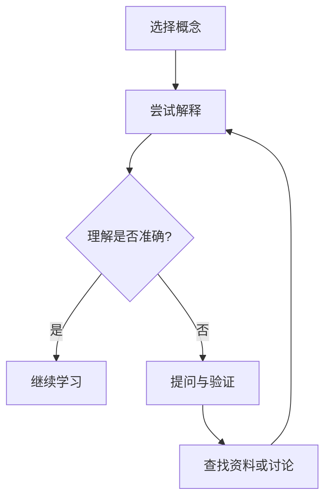

                 

关键词：费曼提问法、学习深度、技术理解、问题解决、教育方法

> 摘要：本文旨在探讨费曼提问法在提升学习深度方面的应用。通过详细阐述费曼提问法的原理、实践方法及其在技术学习中的优势，帮助读者掌握一种有效的学习方法，以深化对复杂技术的理解。

## 1. 背景介绍

在信息技术飞速发展的今天，掌握复杂的技术概念和原理变得尤为重要。然而，许多人在学习过程中容易陷入表面化的理解，难以深入掌握知识的内在联系。为了提升学习深度，我们需要找到一种能够促使我们主动思考、解决问题的学习方法。费曼提问法，作为一种基于问题解决的教育方法，正是为此而生。

费曼提问法由著名物理学家理查德·费曼提出。其核心思想是通过提问的方式，帮助学习者深入理解复杂概念，并将所学知识以最简单的方式解释给他人。这种方法不仅能够加深学习者的理解，还能提高其沟通能力。

## 2. 核心概念与联系

### 2.1 费曼提问法的基本原理

费曼提问法的基本原理可以概括为以下几个步骤：

1. **选择概念**：选择你想要深入理解的技术概念或原理。
2. **尝试解释**：用自己的语言尝试解释这个概念，就好像你在向一个初学者解释一样。
3. **提问与验证**：在解释过程中，如果遇到不理解的地方，及时提出问题，查找资料或与他人讨论，以验证你的理解是否准确。
4. **简化表达**：在解释过程中，不断简化你的表达方式，以确保你的解释尽可能通俗易懂。

### 2.2 费曼提问法在技术学习中的应用

在技术学习中，费曼提问法可以帮助我们：

- **加深理解**：通过尝试解释概念，我们可以发现自己对知识的理解是否真正深入。
- **发现问题**：在解释过程中，可能会发现一些难以解释的地方，这表明我们对这部分知识还有欠缺。
- **提高沟通能力**：费曼提问法不仅可以提高我们的技术理解，还能提升我们的沟通能力。

### 2.3 费曼提问法的 Mermaid 流程图

下面是一个简单的 Mermaid 流程图，描述了费曼提问法的流程：



## 3. 核心算法原理 & 具体操作步骤

### 3.1 算法原理概述

费曼提问法的核心在于通过提问与验证，促进学习者对知识的深入理解。其基本原理可以概括为：

- **主动学习**：学习者主动选择要理解的概念，并尝试用自己的语言进行解释。
- **问题解决**：在解释过程中，遇到不理解的地方，及时提出问题，并通过查找资料或与他人讨论来解决问题。
- **反馈与修正**：通过提问与验证，学习者可以及时了解自己对知识的理解程度，并进行必要的修正。

### 3.2 算法步骤详解

1. **选择概念**：选择一个你想要深入理解的技术概念或原理。
2. **尝试解释**：用自己的语言尝试解释这个概念，就好像你在向一个初学者解释一样。
3. **提问与验证**：在解释过程中，如果遇到不理解的地方，及时提出问题。
4. **查找资料或讨论**：通过查找资料或与他人讨论，解决问题，验证你的理解。
5. **简化表达**：在解释过程中，不断简化你的表达方式，以确保你的解释尽可能通俗易懂。
6. **重复步骤**：重复上述步骤，直到你对概念有了深入的理解。

### 3.3 算法优缺点

**优点**：

- **深入理解**：通过提问与验证，可以帮助学习者深入理解复杂概念。
- **提高沟通能力**：在解释过程中，可以提高学习者的沟通能力。
- **适应性强**：适用于各种技术领域的学习。

**缺点**：

- **耗时较长**：费曼提问法需要一定的时间和精力，对于急于求成的学习者可能不太适用。
- **需要一定的基础**：学习者需要具备一定的基础知识，否则在解释过程中可能会遇到很多困难。

### 3.4 算法应用领域

费曼提问法可以广泛应用于各种技术领域，如计算机科学、数学、物理等。特别是在计算机科学领域，费曼提问法可以帮助学习者深入理解算法、数据结构、操作系统等核心概念。

## 4. 数学模型和公式 & 详细讲解 & 举例说明

### 4.1 数学模型构建

在技术学习中，许多概念和原理都可以通过数学模型来描述。费曼提问法在数学学习中的应用，可以帮助学习者理解这些数学模型。

例如，在学习微积分时，我们可以通过费曼提问法来理解导数和积分的概念。首先，选择一个具体的函数，尝试解释其导数和积分的含义。然后，在解释过程中，遇到不理解的地方，提出问题，并通过查找资料或讨论来解决问题。

### 4.2 公式推导过程

例如，对于导数的定义，我们可以使用以下公式：

$$f'(x) = \lim_{h \to 0} \frac{f(x+h) - f(x)}{h}$$

通过费曼提问法，我们可以这样解释这个公式：

- **分子部分**：$f(x+h) - f(x)$表示函数在$x$点附近的一个小变化量。
- **分母部分**：$h$表示这个变化量的大小。
- **极限部分**：$\lim_{h \to 0}$表示我们让这个变化量越来越小，直到它趋近于0。

### 4.3 案例分析与讲解

假设我们想要理解函数$f(x) = x^2$的导数。我们可以这样使用费曼提问法：

1. **选择概念**：选择函数$f(x) = x^2$的导数。
2. **尝试解释**：尝试用自己的语言解释导数$f'(x)$的含义。
3. **提问与验证**：在解释过程中，遇到不理解的地方，如“为什么$f'(x) = 2x$？”。
4. **查找资料或讨论**：通过查找资料或与他人讨论，了解为什么$f'(x) = 2x$。
5. **简化表达**：简化解释，如“导数表示函数的变化率，对于$f(x) = x^2$，其变化率是2x”。

## 5. 项目实践：代码实例和详细解释说明

### 5.1 开发环境搭建

为了更好地理解费曼提问法在编程学习中的应用，我们可以搭建一个简单的编程环境。以Python为例，首先需要安装Python解释器和相关开发工具。

### 5.2 源代码详细实现

下面是一个简单的Python代码实例，用于计算两个数的和：

```python
def add(a, b):
    return a + b

# 测试代码
result = add(3, 5)
print("3 + 5 = ", result)
```

### 5.3 代码解读与分析

通过费曼提问法，我们可以这样理解这段代码：

1. **选择概念**：选择函数`add(a, b)`的实现。
2. **尝试解释**：尝试用自己的语言解释这个函数的实现。
3. **提问与验证**：在解释过程中，如“为什么`return a + b`？”。
4. **查找资料或讨论**：通过查找资料或与他人讨论，了解`return a + b`的含义。
5. **简化表达**：简化解释，如“这个函数接收两个参数a和b，然后返回它们的和”。

### 5.4 运行结果展示

运行上面的代码，我们可以得到如下结果：

```
3 + 5 =  8
```

这表明我们的费曼提问法解释是正确的。

## 6. 实际应用场景

费曼提问法在技术学习中有着广泛的应用。以下是一些实际应用场景：

- **算法学习**：在学习算法时，使用费曼提问法可以帮助我们深入理解算法的原理和实现。
- **编程实践**：在编程实践中，使用费曼提问法可以帮助我们理解代码的执行过程和逻辑结构。
- **知识分享**：在知识分享时，使用费曼提问法可以帮助我们更好地与他人沟通和交流。

## 7. 未来应用展望

随着技术的不断发展，费曼提问法在技术学习中的应用前景将更加广阔。未来，我们可以期待以下发展方向：

- **智能化**：通过人工智能技术，为费曼提问法提供智能化的支持，如自动生成问题、分析解答等。
- **多样化**：开发更多适应不同技术领域的费曼提问法工具和资源。
- **普及化**：推广费曼提问法，使其成为普及化的学习方法，帮助更多人提升学习深度。

## 8. 总结：未来发展趋势与挑战

### 8.1 研究成果总结

费曼提问法作为一种有效的学习方法，已经在技术学习中取得了显著成果。通过实践证明，费曼提问法可以帮助学习者深入理解复杂概念，提高沟通能力，增强问题解决能力。

### 8.2 未来发展趋势

未来，费曼提问法有望在以下几个方面取得进一步发展：

- **智能化**：结合人工智能技术，为费曼提问法提供更加智能化、个性化的支持。
- **多样化**：开发更多适应不同技术领域的费曼提问法工具和资源。
- **普及化**：推广费曼提问法，使其成为普及化的学习方法，帮助更多人提升学习深度。

### 8.3 面临的挑战

尽管费曼提问法在技术学习中具有显著优势，但仍面临一些挑战：

- **学习成本**：费曼提问法需要一定的时间和精力投入，对于部分学习者可能存在一定的学习成本。
- **基础要求**：学习者需要具备一定的基础知识，否则在解释过程中可能会遇到很多困难。
- **个性化支持**：目前费曼提问法在智能化、个性化支持方面仍有待进一步研究和发展。

### 8.4 研究展望

未来，研究者在费曼提问法领域可以关注以下几个方面：

- **算法优化**：研究如何通过算法优化，提高费曼提问法的效率和应用效果。
- **教育应用**：探索费曼提问法在不同教育场景中的应用，如在线教育、职业教育等。
- **跨学科融合**：研究费曼提问法与其他教育方法的融合，以实现更好的学习效果。

## 9. 附录：常见问题与解答

### Q1. 费曼提问法适合所有学习场景吗？

A1. 费曼提问法作为一种问题解决型的学习方法，主要适用于需要深入理解复杂概念的场景。对于一些简单的知识或技能学习，其他学习方法可能更加适用。

### Q2. 如何确保费曼提问法的有效性？

A2. 为了确保费曼提问法的有效性，需要注意以下几点：

- 选择合适的概念或原理进行解释。
- 保持耐心和持续的学习态度。
- 主动提问和解决问题。
- 不断反思和修正自己的理解。

### Q3. 费曼提问法需要大量时间投入吗？

A3. 费曼提问法需要一定的时间和精力投入，但其效果往往值得这种投入。通过持续实践，可以提高费曼提问法的效率，减少时间成本。

### Q4. 费曼提问法是否适用于团队合作？

A4. 费曼提问法可以应用于团队合作。在团队学习中，成员可以互相提问、解答问题，共同提升对知识的理解。

### Q5. 费曼提问法与其他学习方法如何结合？

A5. 费曼提问法可以与其他学习方法结合，如主动学习、协作学习、探究学习等。结合不同学习方法，可以发挥各自的优势，提高学习效果。

---

作者：禅与计算机程序设计艺术 / Zen and the Art of Computer Programming

通过本文的探讨，我们希望读者能够认识到费曼提问法在提升学习深度方面的优势，并将其应用于实际学习过程中。费曼提问法不仅可以帮助我们深入理解技术概念，还能提高我们的沟通能力和问题解决能力。让我们一起实践费曼提问法，迈向更深入的技术理解之路。|

