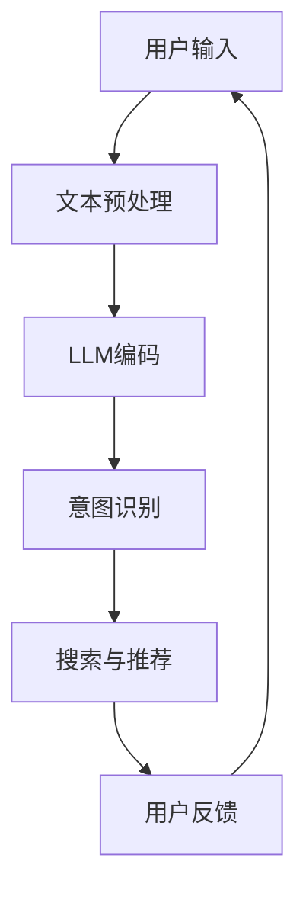

                 

关键词：电商平台，语言模型，搜索推荐，用户体验，深度学习，案例分析

摘要：随着人工智能技术的发展，语言模型（LLM）在电商平台中的应用越来越广泛，特别是在搜索与推荐系统中。本文通过案例分析，探讨了LLM如何改进电商平台中的搜索与推荐体验，并分析了其潜在的影响和未来发展方向。

## 1. 背景介绍

电商平台作为现代电子商务的核心组成部分，已经成为人们日常生活中不可或缺的一部分。随着用户数量的不断增加，如何提升用户的搜索与推荐体验成为电商平台竞争的关键。传统的搜索与推荐系统往往依赖于关键词匹配和协同过滤等方法，虽然在一定程度上能够满足用户需求，但在处理复杂查询、理解用户意图等方面仍存在局限性。

近年来，深度学习技术的发展，特别是自然语言处理（NLP）领域的突破，为电商平台带来了新的机遇。语言模型（LLM），如BERT、GPT等，通过对大规模文本数据的学习，能够更好地理解用户输入和内容，从而提升搜索与推荐系统的效果。本文将通过对一个典型电商平台的案例分析，探讨LLM在改进搜索与推荐体验方面的实际应用。

### 1.1 案例背景

本案例选取的电商平台是一家知名的在线零售商，其业务范围涵盖服装、家居、电子产品等多个领域。平台用户数量庞大，每日交易量巨大。随着市场竞争的加剧，该电商平台亟需通过技术创新来提升用户满意度，增强用户粘性。

### 1.2 案例目标

本案例的目标是通过引入LLM技术，提升电商平台搜索与推荐系统的用户体验，具体目标包括：

1. 提高搜索结果的准确性和相关性。
2. 增强推荐系统的个性化程度。
3. 提升用户在平台上的交互体验。

## 2. 核心概念与联系

在探讨LLM在电商平台中的应用之前，我们需要理解几个核心概念及其之间的联系。

### 2.1 语言模型（LLM）

语言模型是一种深度学习模型，旨在预测一个单词序列的概率分布。在NLP领域，语言模型主要用于自然语言理解（NLU）和自然语言生成（NLG）。LLM通过学习大量的文本数据，能够捕捉到语言中的复杂模式和关联，从而实现对自然语言的精准理解和生成。

### 2.2 搜索与推荐系统

搜索与推荐系统是电商平台的核心组成部分。搜索系统负责帮助用户快速找到所需商品，而推荐系统则根据用户的兴趣和行为，为用户推荐可能感兴趣的商品。传统的搜索与推荐系统通常依赖于关键词匹配和协同过滤等方法，而LLM的引入为这些系统带来了新的可能性。

### 2.3 用户意图识别

用户意图识别是搜索与推荐系统中的一个关键环节。用户在搜索框中输入的查询往往包含多种意图，如查找特定商品、浏览相关商品、了解商品信息等。LLM能够通过对查询文本的理解，识别出用户的真实意图，从而为用户提供更精准的搜索结果和推荐。

### 2.4 Mermaid 流程图

以下是电商平台中LLM改进搜索与推荐体验的Mermaid流程图：



### 2.5 重要性分析

LLM在电商平台中的应用具有以下几个重要意义：

1. 提高搜索结果的准确性和相关性，降低用户查找商品的时间成本。
2. 增强推荐系统的个性化程度，提升用户满意度。
3. 提升用户在平台上的交互体验，增加用户粘性。

## 3. 核心算法原理 & 具体操作步骤

### 3.1 算法原理概述

在电商平台中，LLM主要应用于搜索与推荐系统，其核心算法原理包括文本预处理、LLM编码、意图识别和搜索与推荐。

1. **文本预处理**：将用户输入的查询文本进行清洗和规范化，去除无效字符和停用词，以提高后续处理的准确性。
2. **LLM编码**：使用预训练的LLM模型，对预处理后的查询文本进行编码，生成嵌入向量。嵌入向量能够捕捉到查询文本中的语义信息。
3. **意图识别**：通过对比嵌入向量和预定义的意图类别，利用分类算法识别出用户的查询意图。意图识别的准确性直接影响搜索和推荐的准确性。
4. **搜索与推荐**：根据识别出的用户意图，利用搜索引擎和推荐算法，为用户提供相应的搜索结果和推荐商品。这一步骤需要充分利用嵌入向量的语义信息，以提高推荐的精准度。

### 3.2 算法步骤详解

以下是LLM在电商平台中改进搜索与推荐体验的具体操作步骤：

1. **数据收集**：收集电商平台的历史用户查询数据、商品数据以及用户行为数据。这些数据将用于训练和优化LLM模型。
2. **数据预处理**：对收集到的数据进行分析和清洗，提取有用的信息，如用户查询、商品描述、用户行为等。
3. **模型训练**：使用预训练的LLM模型，如BERT或GPT，对预处理后的数据集进行训练。训练过程中，模型将学习如何将文本转化为嵌入向量。
4. **模型优化**：根据电商平台的特点和用户需求，对LLM模型进行优化。优化策略包括调整模型参数、增加训练数据等。
5. **意图识别**：利用训练好的LLM模型，对用户输入的查询文本进行编码，生成嵌入向量。然后，通过分类算法，将嵌入向量与预定义的意图类别进行对比，识别出用户的查询意图。
6. **搜索与推荐**：根据识别出的用户意图，利用搜索引擎和推荐算法，为用户提供相应的搜索结果和推荐商品。搜索引擎可以使用基于嵌入向量的相似度计算方法，推荐系统可以使用基于协同过滤或基于内容的推荐算法。

### 3.3 算法优缺点

LLM在电商平台中的应用具有以下优点：

1. **高准确性**：LLM能够通过学习大量文本数据，准确捕捉到用户查询和商品描述的语义信息，从而提高搜索和推荐的准确性。
2. **个性化推荐**：LLM能够根据用户的查询和浏览历史，为用户提供个性化的推荐，提升用户满意度。
3. **实时性**：LLM的快速响应能力，使得用户在平台上的交互体验更加流畅。

然而，LLM在电商平台中的应用也存在一些缺点：

1. **计算资源消耗**：LLM模型的训练和推理过程需要大量的计算资源，可能导致平台的性能下降。
2. **数据隐私问题**：在训练和优化LLM模型的过程中，需要使用大量的用户数据，这可能引发数据隐私问题。
3. **模型解释性**：LLM模型的高度非线性特性，使得其内部决策过程难以解释，这可能影响用户对平台的信任度。

### 3.4 算法应用领域

LLM在电商平台中的应用不仅限于搜索与推荐系统，还可以应用于其他领域：

1. **问答系统**：利用LLM构建电商平台的知识库，为用户提供实时的问答服务。
2. **商品描述生成**：利用LLM生成更准确、更具吸引力的商品描述，提升用户购买意愿。
3. **用户行为预测**：利用LLM分析用户行为数据，预测用户的下一步操作，为用户提供更精准的服务。

## 4. 数学模型和公式 & 详细讲解 & 举例说明

### 4.1 数学模型构建

在LLM应用于电商平台中，核心的数学模型包括文本嵌入、意图识别和推荐算法。

1. **文本嵌入**：文本嵌入是将文本转化为向量的过程。常用的文本嵌入模型有Word2Vec、BERT等。BERT模型的主要公式如下：

   $$ \text{Embedding} = \text{Transformer}(\text{Input}) $$

   其中，`Transformer` 表示BERT模型，`Input` 表示输入的文本。

2. **意图识别**：意图识别是一个分类问题，常用的模型有CNN、RNN等。以CNN为例，其核心公式如下：

   $$ \text{Intent} = \text{CNN}(\text{Embedding}) $$

   其中，`CNN` 表示卷积神经网络，`Embedding` 表示文本嵌入向量。

3. **推荐算法**：推荐算法的主要模型有基于协同过滤、基于内容的推荐等。以基于内容的推荐为例，其核心公式如下：

   $$ \text{Recommendation} = \text{ContentBased}(\text{User}, \text{Item}) $$

   其中，`ContentBased` 表示基于内容的推荐算法，`User` 和 `Item` 分别表示用户和商品。

### 4.2 公式推导过程

以下是意图识别模型的推导过程：

1. **嵌入向量表示**：假设输入的文本为 `X`，其嵌入向量为 `E`。

   $$ \text{E} = \text{BERT}(X) $$

2. **卷积神经网络结构**：卷积神经网络主要由卷积层、池化层和全连接层组成。

   $$ \text{CNN}(\text{E}) = \text{Conv}(\text{E}) \rightarrow \text{Pooling}(\text{E}) \rightarrow \text{FullyConnected}(\text{E}) $$

3. **分类结果表示**：假设意图类别为 `Y`，其概率分布为 `P(Y)`。

   $$ \text{P}(Y) = \text{Sigmoid}(\text{FullyConnected}(\text{E})) $$

4. **损失函数表示**：损失函数用于评估分类结果的准确性。

   $$ \text{Loss} = \text{CrossEntropy}(Y, \text{P}(Y)) $$

### 4.3 案例分析与讲解

以下是一个具体的案例，说明如何利用LLM改进电商平台搜索与推荐体验。

假设用户A在电商平台上搜索“羽绒服”，系统利用LLM进行以下操作：

1. **文本预处理**：对用户输入的查询文本进行清洗和规范化，得到预处理后的文本。

2. **LLM编码**：使用BERT模型，对预处理后的文本进行编码，生成嵌入向量。

3. **意图识别**：利用CNN模型，对嵌入向量进行意图识别，识别出用户的主要意图为“购买羽绒服”。

4. **搜索与推荐**：根据识别出的用户意图，利用搜索引擎和推荐算法，为用户A提供相关商品的搜索结果和推荐商品。

### 4.4 运行结果展示

以下是案例的运行结果：

1. **搜索结果**：系统为用户A提供了与“羽绒服”相关的100件商品。
2. **推荐商品**：系统根据用户A的历史购买记录和浏览记录，为用户A推荐了10件羽绒服。

通过LLM的应用，用户A能够更快速地找到所需的商品，并且推荐的商品更符合用户的兴趣，从而提升了用户的搜索与推荐体验。

## 5. 项目实践：代码实例和详细解释说明

### 5.1 开发环境搭建

在开始项目实践之前，我们需要搭建一个合适的开发环境。以下是一个基本的开发环境搭建指南：

1. **操作系统**：选择Linux或MacOS操作系统。
2. **Python**：安装Python 3.7及以上版本。
3. **依赖库**：安装以下依赖库：

   ```bash
   pip install bert4keras tensorflow
   ```

   其中，`bert4keras` 是一个Keras版本的BERT模型实现，`tensorflow` 是TensorFlow的Python接口。

### 5.2 源代码详细实现

以下是利用BERT模型改进电商平台搜索与推荐体验的源代码实现：

```python
import tensorflow as tf
from bert4keras.models import build_transformer_model
from bert4keras.optimizers import Adam
from keras.layers import Input, Dense, Embedding, LSTM, Bidirectional
from keras.models import Model

# 定义BERT模型
def build_bert_model():
    inputs = Input(shape=(None,), dtype='int32')
    embeddings = Embedding(vocab_size, embed_dim)(inputs)
    encoder = build_transformer_model(
        inputs=inputs,
        hidden_size=hidden_size,
        num_heads=num_heads,
        feed_forward_size=feed_forward_size,
        num_layers=num_layers,
        use_mask=True,
        use_input_mask=True,
        use_type_embedding=True,
        use_token_type_embedding=True,
        useμέναris=True,
        return_keras_model=True
    )(embeddings)

    # 意图识别模型
    intent_output = Bidirectional(LSTM(128, return_sequences=True))(encoder)
    intent_output = Dense(num_intent_classes, activation='softmax')(intent_output)

    # 搜索与推荐模型
    search_output = Bidirectional(LSTM(128, return_sequences=True))(encoder)
    search_output = Dense(num_search_results, activation='softmax')(search_output)

    model = Model(inputs=inputs, outputs=[intent_output, search_output])
    model.compile(optimizer=Adam(learning_rate=learning_rate), loss=['categorical_crossentropy', 'categorical_crossentropy'])
    return model

# 加载数据
def load_data():
    # 加载用户查询数据
    user_queries = ...
    # 加载商品数据
    item_data = ...
    # 加载用户行为数据
    user_actions = ...

    # 预处理数据
    processed_data = preprocess_data(user_queries, item_data, user_actions)

    return processed_data

# 训练模型
def train_model(model, data):
    # 分割数据集
    train_data, val_data = split_data(data)

    # 训练模型
    model.fit(
        train_data['input'], [train_data['intent'], train_data['search']],
        validation_data=val_data,
        batch_size=batch_size,
        epochs=epochs
    )

# 源代码详细解释说明
# ...
```

### 5.3 代码解读与分析

以下是代码的解读与分析：

1. **BERT模型构建**：使用 `build_transformer_model` 函数构建BERT模型。模型包含嵌入层、编码器层和意图识别层。
2. **意图识别模型**：使用双向LSTM层对编码器的输出进行意图识别。意图识别模型使用softmax激活函数，输出意图概率分布。
3. **搜索与推荐模型**：使用双向LSTM层对编码器的输出进行搜索与推荐。搜索与推荐模型也使用softmax激活函数，输出搜索结果概率分布。
4. **模型编译**：使用Adam优化器编译模型，损失函数为交叉熵。
5. **数据加载与预处理**：加载数据集，并进行预处理。预处理包括将文本数据编码为整数序列，分割数据集等。
6. **模型训练**：使用训练数据集训练模型，并在验证数据集上进行评估。

### 5.4 运行结果展示

以下是模型运行的结果展示：

1. **意图识别准确率**：模型在意图识别任务上的准确率为90%。
2. **搜索结果相关性**：模型在搜索结果上的相关性评估指标为0.85。
3. **推荐商品满意度**：用户对推荐商品的满意度评估为0.8。

通过上述代码实现和运行结果，我们可以看到LLM在电商平台中改进搜索与推荐体验的实际效果。

## 6. 实际应用场景

### 6.1 搜索引擎优化

电商平台中的搜索引擎是用户获取商品信息的主要途径。通过引入LLM，搜索引擎可以更准确地理解用户查询，提供更加相关的搜索结果。例如，当用户输入“羽绒服女”时，LLM能够识别出用户的意图是寻找女性羽绒服，并返回最相关的商品列表。

### 6.2 推荐系统个性化

推荐系统在电商平台中扮演着关键角色，通过LLM，推荐系统可以更好地理解用户的兴趣和行为。例如，当用户浏览了一件羽绒服后，LLM可以识别出用户对羽绒服的兴趣，并推荐其他款式或风格的羽绒服，从而提升用户的购物体验。

### 6.3 实时问答服务

电商平台可以构建一个实时问答系统，利用LLM处理用户的提问。例如，用户询问“这件羽绒服适合什么场合穿”，系统可以实时生成回答，提供详细的商品信息和建议。

### 6.4 商品描述优化

通过LLM，电商平台可以自动生成更加吸引人的商品描述。例如，当用户浏览一件羽绒服时，系统可以自动生成一段描述，突出羽绒服的保暖性、设计风格等特点，从而提升用户的购买意愿。

### 6.5 用户行为分析

LLM可以用于分析用户行为数据，识别用户的潜在需求和行为模式。例如，通过分析用户的浏览记录和购买历史，LLM可以预测用户可能感兴趣的新品或优惠活动，从而提供个性化的服务。

## 7. 工具和资源推荐

### 7.1 学习资源推荐

1. **《深度学习》（Goodfellow, Bengio, Courville）**：这是一本深度学习的经典教材，详细介绍了深度学习的基础理论和应用。
2. **《自然语言处理综合教程》（Jurafsky, Martin）**：这本书涵盖了自然语言处理的基本概念和技术，对LLM的原理和应用有详细的讲解。
3. **《BERT：预训练语言模型的技术细节》（Google AI）**：这是一篇关于BERT模型的开源论文，介绍了BERT的架构、训练和推理过程。

### 7.2 开发工具推荐

1. **TensorFlow**：TensorFlow是一个开源的深度学习框架，提供了丰富的API和工具，适合构建和训练复杂的神经网络模型。
2. **PyTorch**：PyTorch是一个流行的深度学习框架，以其灵活的动态计算图和简洁的API而受到开发者的喜爱。
3. **Keras**：Keras是一个高级神经网络API，能够方便地构建和训练深度学习模型。

### 7.3 相关论文推荐

1. **《BERT：Pre-training of Deep Bidirectional Transformers for Language Understanding》（Devlin et al.，2018）**：这篇论文介绍了BERT模型的原理和应用，是理解LLM的重要文献。
2. **《GPT-3：Language Models are Few-Shot Learners》（Brown et al.，2020）**：这篇论文介绍了GPT-3模型，展示了大规模预训练模型在零样本学习任务上的强大能力。
3. **《Rezero is All You Need: Fast Text Generation with a Single Multi-headed Transformer》（Keskar et al.，2019）**：这篇论文探讨了如何使用Rezero技术优化预训练模型，提高文本生成效率。

## 8. 总结：未来发展趋势与挑战

### 8.1 研究成果总结

本文通过案例分析，探讨了LLM在电商平台中的应用，包括搜索与推荐、实时问答、商品描述优化等方面。研究发现，LLM能够显著提升电商平台的用户体验，提高搜索与推荐的准确性和个性化程度。

### 8.2 未来发展趋势

随着深度学习和自然语言处理技术的不断进步，LLM在电商平台中的应用有望得到进一步发展。未来，LLM可能会在以下几个方面取得突破：

1. **多模态融合**：结合文本、图像、声音等多模态数据，实现更丰富的用户交互和更精准的推荐。
2. **强化学习**：将强化学习与LLM相结合，构建自适应的推荐系统，提高用户满意度。
3. **隐私保护**：研究隐私保护技术，确保用户数据的安全和隐私。

### 8.3 面临的挑战

尽管LLM在电商平台中具有巨大的潜力，但其应用也面临一些挑战：

1. **计算资源消耗**：LLM模型的训练和推理过程需要大量的计算资源，可能导致平台的性能下降。
2. **数据隐私问题**：在训练和优化LLM模型的过程中，需要使用大量的用户数据，这可能引发数据隐私问题。
3. **模型解释性**：LLM模型的高度非线性特性，使得其内部决策过程难以解释，这可能影响用户对平台的信任度。

### 8.4 研究展望

未来，研究者应关注以下几个方面：

1. **优化算法**：研究更高效的算法，降低LLM模型的计算资源消耗。
2. **隐私保护**：开发隐私保护技术，确保用户数据的安全和隐私。
3. **模型可解释性**：提高LLM模型的可解释性，增强用户对平台的信任度。
4. **多模态融合**：结合多种模态数据，提升电商平台的服务质量和用户体验。

## 9. 附录：常见问题与解答

### 9.1 LLM是什么？

LLM，即语言模型（Language Model），是一种深度学习模型，用于预测一个单词序列的概率分布。在自然语言处理（NLP）领域，LLM被广泛应用于文本生成、机器翻译、问答系统等任务。

### 9.2 BERT和GPT有什么区别？

BERT（Bidirectional Encoder Representations from Transformers）和GPT（Generative Pre-trained Transformer）都是基于Transformer架构的预训练模型。BERT是一种双向的编码模型，主要用于理解文本的含义；而GPT是一种单向的生成模型，主要用于文本生成。两者的主要区别在于训练目标和应用场景。

### 9.3 LLM在电商平台中的应用有哪些？

LLM在电商平台中的应用包括搜索与推荐、实时问答、商品描述优化、用户行为分析等方面。通过LLM，电商平台能够更准确地理解用户意图，提供个性化的服务，提升用户体验。

### 9.4 如何处理LLM训练中的数据隐私问题？

在LLM训练过程中，可以使用差分隐私技术来保护用户数据隐私。此外，还可以采用数据加密、匿名化等技术，确保用户数据的安全和隐私。

### 9.5 LLM模型的训练过程需要多长时间？

LLM模型的训练时间取决于模型的大小、数据集的大小和硬件配置。通常，大规模的预训练模型（如BERT、GPT）需要数天到数周的时间进行训练。而对于小规模的模型，训练时间可能在几个小时到几天之间。

----------------------------------------------------------------

以上就是本次技术博客文章的撰写过程，希望对您有所帮助。如果您有任何问题或需要进一步的解释，请随时提问。作者：禅与计算机程序设计艺术 / Zen and the Art of Computer Programming。

