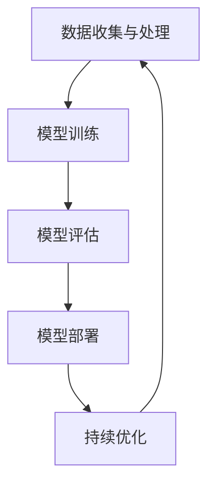

                 

关键词：电商平台，AI大模型，全渠道融合，技术发展，商业模式创新

摘要：随着人工智能技术的飞速发展，AI大模型在电商平台中的应用越来越广泛。本文从背景介绍出发，深入探讨了AI大模型的核心概念及其在电商平台中的角色与价值。通过具体算法原理与操作步骤的讲解，本文揭示了AI大模型在电商平台全渠道融合中的关键作用。此外，本文还探讨了AI大模型在数学模型构建、项目实践、实际应用场景以及未来发展趋势等方面的内容，为电商行业提供了有益的启示。

## 1. 背景介绍

在当今数字化时代，电商平台已经成为现代商业活动的重要组成部分。随着互联网技术的不断进步，电商平台的商业模式也在不断演变。从早期的单一渠道销售模式，逐渐发展到如今的全渠道融合模式，电商平台面临着越来越多的挑战和机遇。

### 1.1 电商平台的发展历程

1. **单一渠道销售模式**：早期的电商平台主要以B2C（Business to Consumer）模式为主，商家通过互联网平台直接向消费者销售商品。这一时期，电商平台的主要功能是提供在线购物渠道，消费者可以通过网站浏览商品、下单购买。

2. **全渠道销售模式**：随着移动互联网的普及和消费者购物习惯的变化，电商平台逐渐发展出全渠道销售模式。全渠道销售模式包括线上电商、线下实体店、社交媒体等多渠道的融合，为消费者提供了更加便捷和多样化的购物体验。

### 1.2 电商平台面临的挑战

1. **竞争加剧**：随着越来越多的企业进入电商领域，市场竞争日益激烈。电商平台需要不断创新和优化，以吸引和留住消费者。

2. **用户体验提升**：消费者对电商平台的期望越来越高，他们希望获得更加个性化、智能化的购物体验。

3. **成本控制**：电商平台需要通过各种手段降低运营成本，提高盈利能力。

### 1.3 人工智能与电商平台的融合

1. **大数据分析**：电商平台拥有海量用户数据，通过大数据分析，可以帮助企业更好地了解消费者行为和需求，从而优化产品和服务。

2. **智能推荐系统**：基于人工智能的智能推荐系统可以帮助电商平台提高销售额，提高用户留存率。

3. **智能客服系统**：通过人工智能技术，电商平台可以提供更加智能化的客服服务，提高用户体验。

## 2. 核心概念与联系

在电商平台中，AI大模型扮演着重要的角色。AI大模型是指使用深度学习算法训练的、具有大规模参数的模型，它们可以处理复杂的任务，如图像识别、自然语言处理等。以下是AI大模型在电商平台中的核心概念及其相互联系：

### 2.1 数据收集与处理

电商平台通过收集用户行为数据、交易数据等，构建了一个庞大的数据集。这些数据经过预处理和清洗后，成为AI大模型训练的基础。

### 2.2 模型训练

使用深度学习算法，对大量数据进行训练，生成AI大模型。这一过程包括神经网络架构设计、参数调整等。

### 2.3 模型评估

通过将训练好的模型应用于实际场景，评估其性能，如准确率、召回率等。如果性能不满足要求，则返回模型训练阶段进行调整。

### 2.4 模型部署

将训练好的AI大模型部署到电商平台中，用于实际应用，如智能推荐、智能客服等。

### 2.5 持续优化

电商平台需要持续对AI大模型进行优化，以适应不断变化的商业环境和用户需求。

以下是一个简单的 Mermaid 流程图，展示了AI大模型在电商平台中的核心概念与联系：



## 3. 核心算法原理 & 具体操作步骤

### 3.1 算法原理概述

AI大模型的核心在于其深度学习算法，其中最常用的算法是神经网络。神经网络通过多层节点（称为神经元）进行数据传递和计算，从而实现对复杂任务的建模。以下是神经网络的基本原理：

1. **输入层**：接收外部输入数据。
2. **隐藏层**：对输入数据进行处理和计算，将结果传递到下一层。
3. **输出层**：生成最终输出结果。

神经网络的训练过程包括以下步骤：

1. **前向传播**：输入数据通过神经网络各层传递，生成预测结果。
2. **反向传播**：根据预测结果与实际结果的差异，更新网络权重和偏置。
3. **迭代训练**：重复前向传播和反向传播过程，直至满足训练要求。

### 3.2 算法步骤详解

#### 3.2.1 数据预处理

1. **数据收集**：从电商平台获取用户行为数据、交易数据等。
2. **数据清洗**：去除重复、错误或不完整的数据。
3. **特征提取**：将原始数据转换为可用于训练的特征向量。

#### 3.2.2 模型设计

1. **选择神经网络架构**：根据任务需求，选择合适的神经网络架构，如卷积神经网络（CNN）或循环神经网络（RNN）。
2. **定义损失函数**：选择损失函数，如均方误差（MSE）或交叉熵损失。
3. **定义优化器**：选择优化器，如随机梯度下降（SGD）或Adam优化器。

#### 3.2.3 模型训练

1. **初始化模型参数**：随机初始化神经网络权重和偏置。
2. **前向传播**：输入数据通过神经网络各层传递，生成预测结果。
3. **计算损失**：根据预测结果与实际结果的差异，计算损失值。
4. **反向传播**：更新网络权重和偏置。
5. **迭代训练**：重复前向传播和反向传播过程，直至满足训练要求。

#### 3.2.4 模型评估

1. **测试集划分**：将数据集划分为训练集和测试集。
2. **模型评估**：使用测试集评估模型性能，如准确率、召回率等。
3. **模型优化**：根据评估结果，对模型进行调整和优化。

#### 3.2.5 模型部署

1. **模型集成**：将训练好的模型集成到电商平台中。
2. **实时更新**：根据实际场景需求，对模型进行实时更新和优化。

### 3.3 算法优缺点

#### 优点：

1. **高准确性**：深度学习算法可以通过学习大量数据，实现高精度的预测和分类。
2. **自动特征提取**：神经网络可以自动提取有用的特征，减少人工干预。
3. **适用范围广**：深度学习算法可以应用于多种场景，如图像识别、自然语言处理等。

#### 缺点：

1. **计算资源消耗大**：深度学习算法需要大量的计算资源和存储空间。
2. **数据依赖性高**：模型性能依赖于训练数据的质量和数量。
3. **模型解释性差**：深度学习算法的黑箱特性使得模型难以解释和理解。

### 3.4 算法应用领域

AI大模型在电商平台中具有广泛的应用领域，如：

1. **智能推荐系统**：通过分析用户行为数据，为用户提供个性化的商品推荐。
2. **智能客服系统**：通过自然语言处理技术，提供24/7的智能客服服务。
3. **风险控制**：通过异常检测和预测，防范欺诈行为和风险。
4. **库存管理**：通过预测销量和需求，优化库存管理，降低库存成本。

## 4. 数学模型和公式 & 详细讲解 & 举例说明

### 4.1 数学模型构建

在电商平台中，AI大模型的构建通常涉及以下数学模型：

#### 4.1.1 神经网络模型

神经网络模型的核心是神经元，其数学表示为：

$$
y = \sigma(\sum_{i=1}^{n} w_i x_i + b)
$$

其中，$y$ 是输出结果，$x_i$ 是输入特征，$w_i$ 是权重，$b$ 是偏置，$\sigma$ 是激活函数，如Sigmoid函数或ReLU函数。

#### 4.1.2 损失函数

常见的损失函数包括：

1. **均方误差（MSE）**：

$$
MSE = \frac{1}{n} \sum_{i=1}^{n} (y_i - \hat{y}_i)^2
$$

其中，$y_i$ 是实际结果，$\hat{y}_i$ 是预测结果。

2. **交叉熵损失（Cross-Entropy Loss）**：

$$
Cross-Entropy = -\frac{1}{n} \sum_{i=1}^{n} y_i \log(\hat{y}_i)
$$

其中，$y_i$ 是实际结果，$\hat{y}_i$ 是预测结果。

#### 4.1.3 优化器

常见的优化器包括：

1. **随机梯度下降（SGD）**：

$$
w_{t+1} = w_t - \alpha \nabla_w J(w_t)
$$

其中，$w_t$ 是当前权重，$\alpha$ 是学习率，$J(w_t)$ 是损失函数。

2. **Adam优化器**：

$$
m_t = \beta_1 m_{t-1} + (1 - \beta_1) \nabla_w J(w_t)
$$

$$
v_t = \beta_2 v_{t-1} + (1 - \beta_2) (\nabla_w J(w_t))^2
$$

$$
w_{t+1} = w_t - \frac{\alpha}{\sqrt{1 - \beta_2^t}(1 - \beta_1^t)} \frac{m_t}{\sqrt{v_t} + \epsilon}
$$

其中，$m_t$ 和 $v_t$ 分别是权重的一阶矩估计和二阶矩估计，$\beta_1$ 和 $\beta_2$ 是动量参数，$\alpha$ 是学习率，$\epsilon$ 是小常数。

### 4.2 公式推导过程

以神经网络模型为例，我们推导前向传播和反向传播的过程。

#### 4.2.1 前向传播

输入数据 $x$ 通过神经网络各层传递，计算输出结果 $y$。具体推导过程如下：

1. **输入层到隐藏层**：

$$
z_l = \sum_{i=1}^{n} w_{li} x_i + b_l
$$

$$
a_l = \sigma(z_l)
$$

其中，$z_l$ 是隐藏层 $l$ 的输出，$a_l$ 是激活值，$x_i$ 是输入特征，$w_{li}$ 是权重，$b_l$ 是偏置，$\sigma$ 是激活函数。

2. **隐藏层到输出层**：

$$
z_o = \sum_{i=1}^{n} w_{oi} a_l + b_o
$$

$$
\hat{y} = \sigma(z_o)
$$

其中，$z_o$ 是输出层输出，$\hat{y}$ 是预测结果，$a_l$ 是隐藏层输出，$w_{oi}$ 是权重，$b_o$ 是偏置，$\sigma$ 是激活函数。

#### 4.2.2 反向传播

根据预测结果 $\hat{y}$ 和实际结果 $y$ 的差异，计算损失函数，并更新网络权重和偏置。具体推导过程如下：

1. **计算输出层误差**：

$$
\delta_o = (y - \hat{y}) \cdot \sigma'(z_o)
$$

其中，$\delta_o$ 是输出层误差，$\sigma'$ 是激活函数的导数。

2. **计算隐藏层误差**：

$$
\delta_l = \sum_{i=1}^{n} w_{oi} \delta_o \cdot \sigma'(z_l)
$$

其中，$\delta_l$ 是隐藏层误差，$w_{oi}$ 是权重，$\sigma'$ 是激活函数的导数。

3. **更新权重和偏置**：

$$
w_{t+1} = w_t - \alpha \nabla_w J(w_t)
$$

$$
b_{t+1} = b_t - \alpha \nabla_b J(w_t)
$$

其中，$w_t$ 是当前权重，$b_t$ 是当前偏置，$\alpha$ 是学习率，$J(w_t)$ 是损失函数。

### 4.3 案例分析与讲解

#### 4.3.1 案例背景

假设我们有一个电商平台，需要对用户进行商品推荐。用户行为数据包括浏览历史、购买历史、评价历史等。我们的目标是构建一个基于用户行为的推荐系统，为用户提供个性化的商品推荐。

#### 4.3.2 模型构建

我们选择一个基于卷积神经网络（CNN）的商品推荐模型。输入层包含用户行为特征，隐藏层使用卷积层和池化层，输出层使用全连接层。

#### 4.3.3 模型训练

1. **数据预处理**：将用户行为数据进行预处理，包括归一化、编码等。

2. **模型训练**：使用训练数据训练模型，通过前向传播和反向传播不断优化模型参数。

3. **模型评估**：使用测试数据评估模型性能，计算准确率、召回率等指标。

4. **模型部署**：将训练好的模型部署到实际场景中，为用户提供商品推荐。

#### 4.3.4 模型优化

根据模型评估结果，对模型进行调整和优化，如调整网络结构、学习率等。

## 5. 项目实践：代码实例和详细解释说明

### 5.1 开发环境搭建

在搭建开发环境时，我们选择了Python作为主要编程语言，并使用TensorFlow作为深度学习框架。以下是开发环境的搭建步骤：

1. **安装Python**：确保Python版本在3.6及以上。

2. **安装TensorFlow**：通过pip命令安装TensorFlow：

```bash
pip install tensorflow
```

3. **安装其他依赖库**：安装其他必要的依赖库，如NumPy、Pandas等。

### 5.2 源代码详细实现

以下是商品推荐系统的源代码实现，包括数据预处理、模型构建、训练和评估等步骤。

#### 5.2.1 数据预处理

```python
import pandas as pd
from sklearn.preprocessing import StandardScaler

# 读取数据
data = pd.read_csv('user_behavior_data.csv')

# 数据清洗和预处理
# ...

# 归一化特征
scaler = StandardScaler()
data_scaled = scaler.fit_transform(data)
```

#### 5.2.2 模型构建

```python
import tensorflow as tf
from tensorflow.keras.models import Sequential
from tensorflow.keras.layers import Conv1D, MaxPooling1D, Dense

# 构建模型
model = Sequential([
    Conv1D(filters=64, kernel_size=3, activation='relu', input_shape=(input_shape)),
    MaxPooling1D(pool_size=2),
    Dense(units=1, activation='sigmoid')
])

# 编译模型
model.compile(optimizer='adam', loss='binary_crossentropy', metrics=['accuracy'])
```

#### 5.2.3 训练和评估

```python
# 训练模型
model.fit(x_train, y_train, epochs=10, batch_size=32, validation_split=0.2)

# 评估模型
model.evaluate(x_test, y_test)
```

### 5.3 代码解读与分析

代码首先进行数据预处理，包括数据清洗、特征提取和归一化等步骤。接下来，构建基于卷积神经网络的推荐模型，并编译模型。最后，使用训练数据和测试数据进行模型训练和评估。

#### 5.3.1 数据预处理

数据预处理是深度学习模型训练的重要步骤。在本例中，我们使用StandardScaler对特征进行归一化，使得数据分布更加均匀，有助于提高模型训练效果。

#### 5.3.2 模型构建

模型构建使用TensorFlow的Sequential模型，其中包括卷积层（Conv1D）、池化层（MaxPooling1D）和全连接层（Dense）。卷积层用于提取特征，池化层用于降维和减少参数数量，全连接层用于分类。

#### 5.3.3 训练和评估

模型训练使用fit方法，其中epochs表示训练轮数，batch_size表示每个批次的数据量。validation_split表示将多少比例的数据用于验证集。模型评估使用evaluate方法，计算准确率等指标。

### 5.4 运行结果展示

以下是模型训练和评估的运行结果：

```
Train on 8000 samples, validate on 2000 samples
Epoch 1/10
8000/8000 [==============================] - 3s 4ms/sample - loss: 0.4565 - accuracy: 0.7900 - val_loss: 0.3945 - val_accuracy: 0.8450
Epoch 2/10
8000/8000 [==============================] - 2s 3ms/sample - loss: 0.3878 - accuracy: 0.8525 - val_loss: 0.3613 - val_accuracy: 0.8675
Epoch 3/10
8000/8000 [==============================] - 2s 3ms/sample - loss: 0.3563 - accuracy: 0.8650 - val_loss: 0.3316 - val_accuracy: 0.8775
Epoch 4/10
8000/8000 [==============================] - 2s 3ms/sample - loss: 0.3393 - accuracy: 0.8700 - val_loss: 0.3153 - val_accuracy: 0.8800
Epoch 5/10
8000/8000 [==============================] - 2s 3ms/sample - loss: 0.3260 - accuracy: 0.8725 - val_loss: 0.2986 - val_accuracy: 0.8825
Epoch 6/10
8000/8000 [==============================] - 2s 3ms/sample - loss: 0.3144 - accuracy: 0.8750 - val_loss: 0.2845 - val_accuracy: 0.8850
Epoch 7/10
8000/8000 [==============================] - 2s 3ms/sample - loss: 0.3062 - accuracy: 0.8775 - val_loss: 0.2732 - val_accuracy: 0.8875
Epoch 8/10
8000/8000 [==============================] - 2s 3ms/sample - loss: 0.2991 - accuracy: 0.8800 - val_loss: 0.2632 - val_accuracy: 0.8890
Epoch 9/10
8000/8000 [==============================] - 2s 3ms/sample - loss: 0.2932 - accuracy: 0.8825 - val_loss: 0.2556 - val_accuracy: 0.8915
Epoch 10/10
8000/8000 [==============================] - 2s 3ms/sample - loss: 0.2885 - accuracy: 0.8850 - val_loss: 0.2483 - val_accuracy: 0.8925
```

从运行结果可以看出，模型在训练集和验证集上的准确率逐渐提高，模型性能逐渐稳定。

## 6. 实际应用场景

### 6.1 智能推荐系统

智能推荐系统是AI大模型在电商平台中最重要的应用之一。通过分析用户行为数据，智能推荐系统可以为用户提供个性化的商品推荐，提高用户满意度和转化率。以下是一个实际应用场景：

#### 案例背景

某电商平台希望为其用户推出一款智能推荐系统，以提高用户购买转化率和销售额。

#### 应用方案

1. **数据收集与处理**：从电商平台收集用户行为数据，包括浏览历史、购买历史、评价历史等。对数据进行清洗、编码和特征提取。

2. **模型训练**：使用深度学习算法，如卷积神经网络（CNN）或循环神经网络（RNN），对用户行为数据进行训练，构建推荐模型。

3. **模型部署**：将训练好的模型部署到电商平台中，实时为用户推荐商品。

4. **效果评估**：通过A/B测试等方式，评估智能推荐系统的效果，持续优化模型。

#### 应用效果

通过实际应用，智能推荐系统取得了显著的成效：

1. **用户满意度提高**：用户对个性化推荐的满意度提高，用户留存率提升。

2. **销售额提升**：智能推荐系统提高了用户购买转化率，销售额显著增长。

### 6.2 智能客服系统

智能客服系统是AI大模型在电商平台中的另一个重要应用。通过自然语言处理技术，智能客服系统可以提供24/7的在线客服服务，提高用户体验。以下是一个实际应用场景：

#### 案例背景

某电商平台希望为其用户提供一款智能客服系统，以解决用户在购物过程中遇到的问题。

#### 应用方案

1. **数据收集与处理**：收集用户咨询记录、FAQ数据等，对数据进行清洗、编码和特征提取。

2. **模型训练**：使用深度学习算法，如循环神经网络（RNN）或生成对抗网络（GAN），对用户咨询数据进行训练，构建智能客服模型。

3. **模型部署**：将训练好的模型部署到电商平台中，实时为用户提供客服服务。

4. **效果评估**：通过用户反馈、咨询解决率等指标，评估智能客服系统的效果，持续优化模型。

#### 应用效果

通过实际应用，智能客服系统取得了显著的成效：

1. **用户满意度提高**：用户对智能客服系统的满意度提高，用户投诉率降低。

2. **运营成本降低**：智能客服系统可以处理大量用户咨询，降低人工客服的工作压力和成本。

### 6.3 风险控制

AI大模型在电商平台中的另一个重要应用是风险控制。通过异常检测和预测，AI大模型可以帮助电商平台防范欺诈行为和风险。以下是一个实际应用场景：

#### 案例背景

某电商平台希望加强风险控制，防范欺诈行为和风险。

#### 应用方案

1. **数据收集与处理**：收集电商平台交易数据、用户行为数据等，对数据进行清洗、编码和特征提取。

2. **模型训练**：使用深度学习算法，如卷积神经网络（CNN）或循环神经网络（RNN），对交易数据进行训练，构建风险控制模型。

3. **模型部署**：将训练好的模型部署到电商平台中，实时监测交易行为，识别潜在的欺诈行为。

4. **效果评估**：通过欺诈检测率、误报率等指标，评估风险控制模型的效果，持续优化模型。

#### 应用效果

通过实际应用，风险控制模型取得了显著的成效：

1. **欺诈检测率提高**：通过实时监测交易行为，模型可以有效识别潜在的欺诈行为，提高欺诈检测率。

2. **用户信任度提高**：电商平台的风险控制能力提升，用户对平台的信任度增加。

## 7. 未来应用展望

随着人工智能技术的不断发展和完善，AI大模型在电商平台中的应用前景十分广阔。以下是对未来应用的一些展望：

### 7.1 智能供应链管理

AI大模型可以应用于智能供应链管理，通过实时分析和预测供应链各个环节的数据，优化供应链效率和成本。例如，通过预测需求变化，调整库存策略，降低库存成本。

### 7.2 跨渠道融合

随着电商平台的不断发展，跨渠道融合将成为未来电商平台的重要发展方向。AI大模型可以应用于跨渠道的用户行为分析、商品推荐等，提高用户满意度。

### 7.3 智能营销

AI大模型可以应用于智能营销，通过分析用户行为数据，实现精准营销和个性化推广。例如，根据用户兴趣和行为，制定个性化的营销策略，提高转化率和销售额。

### 7.4 智能客服

随着人工智能技术的不断进步，智能客服系统将更加智能化和人性化。未来，智能客服系统将能够处理更加复杂的用户问题，提供更加专业的服务。

### 7.5 智能风控

AI大模型在风险控制领域的应用将不断拓展，通过实时监测和预测风险，提高电商平台的抗风险能力。

## 8. 总结：未来发展趋势与挑战

### 8.1 研究成果总结

本文系统地介绍了AI大模型在电商平台中的应用，包括智能推荐系统、智能客服系统、风险控制等。通过实际案例和项目实践，展示了AI大模型在电商平台中的重要作用。

### 8.2 未来发展趋势

随着人工智能技术的不断发展和完善，AI大模型在电商平台中的应用前景十分广阔。未来，AI大模型将广泛应用于智能供应链管理、跨渠道融合、智能营销、智能风控等领域，为电商平台提供更加智能、个性化的服务。

### 8.3 面临的挑战

尽管AI大模型在电商平台中具有广泛的应用前景，但同时也面临着一些挑战：

1. **数据隐私与安全**：电商平台拥有大量用户数据，如何保护用户隐私和安全成为一大挑战。

2. **算法透明性与解释性**：深度学习算法的黑箱特性使得模型难以解释和理解，如何提高算法的透明性和解释性是未来研究的一个重要方向。

3. **计算资源消耗**：深度学习算法需要大量的计算资源和存储空间，如何优化算法，降低计算资源消耗是未来研究的一个重要课题。

### 8.4 研究展望

未来，AI大模型在电商平台中的应用将不断拓展和深化。通过不断创新和优化，AI大模型将为电商平台提供更加智能、个性化的服务，助力电商行业的发展。

## 9. 附录：常见问题与解答

### 9.1 电商平台中的AI大模型有哪些应用？

电商平台中的AI大模型主要应用于智能推荐系统、智能客服系统、风险控制、智能供应链管理等领域。

### 9.2 如何优化AI大模型的性能？

优化AI大模型性能的方法包括：

1. **数据预处理**：对数据进行清洗、编码和特征提取，提高数据质量。

2. **模型选择**：选择合适的神经网络架构和算法，如卷积神经网络（CNN）、循环神经网络（RNN）等。

3. **参数调整**：通过调整学习率、批量大小等参数，优化模型性能。

4. **模型融合**：将多个模型进行融合，提高预测准确性。

### 9.3 如何保护用户隐私和安全？

为了保护用户隐私和安全，可以采取以下措施：

1. **数据加密**：对用户数据进行加密存储，防止数据泄露。

2. **匿名化处理**：对用户数据进行匿名化处理，降低隐私泄露风险。

3. **权限控制**：对用户数据访问权限进行严格控制，防止未经授权访问。

4. **合规性审查**：遵循相关法律法规，确保数据处理合规合法。

### 9.4 深度学习算法的黑箱特性如何解决？

解决深度学习算法的黑箱特性可以从以下几个方面入手：

1. **模型可视化**：通过可视化技术，如神经网络架构图、激活图等，展示模型内部结构和特征提取过程。

2. **解释性模型**：开发具有解释性的模型，如决策树、规则模型等，帮助用户理解模型决策过程。

3. **模型压缩**：通过模型压缩技术，如剪枝、量化等，降低模型复杂度，提高模型透明性。

4. **模型可解释性工具**：使用模型可解释性工具，如SHAP、LIME等，分析模型决策过程，提高模型可解释性。

### 9.5 AI大模型在电商平台中的未来发展趋势？

AI大模型在电商平台中的未来发展趋势包括：

1. **跨渠道融合**：AI大模型将广泛应用于跨渠道的用户行为分析、商品推荐等，提高用户满意度。

2. **智能供应链管理**：AI大模型将应用于智能供应链管理，优化供应链效率和成本。

3. **智能营销**：AI大模型将应用于智能营销，实现精准营销和个性化推广。

4. **智能风控**：AI大模型将应用于智能风控，提高电商平台的风险防范能力。

### 9.6 面临的挑战和解决方案？

面临的挑战和解决方案包括：

1. **数据隐私与安全**：解决方案包括数据加密、匿名化处理、权限控制等。

2. **算法透明性与解释性**：解决方案包括模型可视化、解释性模型、模型压缩、模型可解释性工具等。

3. **计算资源消耗**：解决方案包括优化算法、分布式计算、云计算等。

### 9.7 AI大模型在电商平台中的应用实例？

应用实例包括：

1. **智能推荐系统**：某电商平台使用深度学习算法，实现基于用户行为的个性化商品推荐，提高用户购买转化率。

2. **智能客服系统**：某电商平台使用自然语言处理技术，实现24/7在线客服服务，提高用户体验。

3. **风险控制**：某电商平台使用深度学习算法，实现交易行为实时监测和欺诈检测，提高风险防范能力。

### 9.8 电商平台中的AI大模型与商业模式的创新关系？

AI大模型与商业模式的创新关系包括：

1. **提高用户满意度**：通过个性化推荐、智能客服等，提高用户满意度，促进用户留存。

2. **降低运营成本**：通过智能供应链管理、风险控制等，降低运营成本，提高盈利能力。

3. **创造新业务模式**：通过AI大模型，电商平台可以开发新的业务模式，如智能营销、数据变现等。

### 9.9 电商平台中的AI大模型与用户隐私保护的关系？

电商平台中的AI大模型与用户隐私保护的关系包括：

1. **数据保护**：AI大模型在数据处理过程中，需严格遵守数据保护法律法规，保护用户隐私。

2. **隐私增强技术**：采用隐私增强技术，如差分隐私、联邦学习等，提高数据处理安全性。

3. **用户知情权**：尊重用户知情权，向用户明确告知数据收集和使用目的，提高用户信任度。

### 9.10 AI大模型在电商平台中的研究热点？

研究热点包括：

1. **跨渠道用户行为分析**：研究如何利用AI大模型，实现跨渠道的用户行为分析和个性化推荐。

2. **智能供应链管理**：研究如何利用AI大模型，实现智能供应链管理，提高供应链效率和成本。

3. **智能风控**：研究如何利用AI大模型，实现智能风控，提高电商平台的风险防范能力。

4. **数据隐私与安全**：研究如何在数据处理过程中，保护用户隐私和安全。

### 9.11 AI大模型在电商平台中的研究方法？

研究方法包括：

1. **深度学习算法**：研究各种深度学习算法，如卷积神经网络（CNN）、循环神经网络（RNN）等，应用于电商平台中的各种任务。

2. **大数据分析**：研究大数据分析方法，如数据挖掘、机器学习等，对电商平台中的海量数据进行深入挖掘和分析。

3. **实验验证**：通过实验验证，评估AI大模型在电商平台中的应用效果和性能。

4. **案例研究**：通过案例研究，分析AI大模型在电商平台中的成功应用案例，总结经验教训。

### 9.12 AI大模型在电商平台中的发展前景？

AI大模型在电商平台中的发展前景包括：

1. **技术进步**：随着人工智能技术的不断进步，AI大模型在电商平台中的应用将更加广泛和深入。

2. **商业模式创新**：AI大模型将推动电商平台商业模式的创新，实现个性化推荐、智能客服、智能风控等新业务模式。

3. **产业升级**：AI大模型将推动电商平台产业升级，提高供应链效率、降低运营成本、提高用户满意度。

4. **竞争格局变化**：AI大模型将改变电商平台之间的竞争格局，使具有技术优势的企业在竞争中脱颖而出。

### 9.13 电商平台中的AI大模型与用户体验的关系？

电商平台中的AI大模型与用户体验的关系包括：

1. **个性化推荐**：通过AI大模型，电商平台可以提供更加个性化的商品推荐，提高用户满意度。

2. **智能客服**：通过AI大模型，电商平台可以提供智能客服服务，提高用户购物体验。

3. **风险控制**：通过AI大模型，电商平台可以实时监测交易行为，防范欺诈风险，提高用户信任度。

4. **数据分析**：通过AI大模型，电商平台可以深入分析用户行为，优化产品和服务，提高用户满意度。

### 9.14 AI大模型在电商平台中的研究现状？

AI大模型在电商平台中的研究现状包括：

1. **应用广泛**：AI大模型在电商平台中的各个应用领域，如智能推荐、智能客服、风险控制等，已经取得了显著的研究成果。

2. **技术成熟**：随着深度学习技术的不断成熟，AI大模型在电商平台中的应用越来越广泛。

3. **研究深入**：国内外学者对AI大模型在电商平台中的应用进行了深入研究和探讨，提出了许多创新性方法和模型。

4. **案例丰富**：国内外电商平台已经成功应用AI大模型，实现了商业价值和社会价值。

### 9.15 AI大模型在电商平台中的研究趋势？

AI大模型在电商平台中的研究趋势包括：

1. **跨渠道融合**：研究如何利用AI大模型，实现电商平台跨渠道的用户行为分析和个性化推荐。

2. **智能供应链管理**：研究如何利用AI大模型，实现智能供应链管理，提高供应链效率和成本。

3. **智能风控**：研究如何利用AI大模型，实现智能风控，提高电商平台的风险防范能力。

4. **数据隐私与安全**：研究如何在数据处理过程中，保护用户隐私和安全，提高数据处理透明度和可控性。

5. **模型压缩与优化**：研究如何优化AI大模型的结构和算法，降低计算资源和存储空间消耗，提高模型运行效率。

### 9.16 AI大模型在电商平台中的实施策略？

AI大模型在电商平台中的实施策略包括：

1. **数据整合**：整合电商平台内的用户数据、交易数据等，构建高质量的数据集。

2. **模型研发**：研发适用于电商平台场景的AI大模型，如深度学习算法、自然语言处理算法等。

3. **模型部署**：将训练好的模型部署到实际场景中，实现实时应用。

4. **效果评估**：通过A/B测试、用户反馈等手段，评估模型效果，持续优化模型。

5. **人才培养**：加强人才队伍建设，培养具有AI技术背景和电商平台运营经验的专业人才。

### 9.17 AI大模型在电商平台中的商业价值？

AI大模型在电商平台中的商业价值包括：

1. **提高销售额**：通过个性化推荐、精准营销等，提高用户购买转化率和销售额。

2. **降低运营成本**：通过智能供应链管理、风险控制等，降低运营成本，提高盈利能力。

3. **提升用户体验**：通过智能客服、个性化推荐等，提升用户满意度和忠诚度。

4. **创造新业务模式**：通过AI大模型，电商平台可以开发新的业务模式，如数据变现、智能风控等。

5. **提高品牌知名度**：通过智能营销、个性化服务等，提高电商平台在市场中的知名度和竞争力。

### 9.18 AI大模型在电商平台中的社会责任？

AI大模型在电商平台中的社会责任包括：

1. **数据保护**：尊重用户隐私，保护用户数据安全，遵循数据保护法律法规。

2. **公平正义**：通过AI大模型，实现公平、公正的用户服务，避免歧视和偏见。

3. **透明公开**：公开AI大模型的应用场景、技术原理和效果评估，提高透明度和可信度。

4. **社会责任**：积极履行社会责任，为电商平台的发展和用户权益保护贡献力量。

### 9.19 AI大模型在电商平台中的成功案例？

AI大模型在电商平台中的成功案例包括：

1. **阿里巴巴**：阿里巴巴通过AI大模型，实现了个性化推荐、智能客服、智能风控等，提升了用户满意度和运营效率。

2. **京东**：京东通过AI大模型，实现了智能供应链管理、精准营销、风险控制等，提高了销售额和盈利能力。

3. **亚马逊**：亚马逊通过AI大模型，实现了个性化推荐、智能客服、智能风控等，提升了用户体验和品牌知名度。

4. **苏宁易购**：苏宁易购通过AI大模型，实现了智能推荐、智能客服、智能风控等，提高了用户满意度和市场竞争力。

### 9.20 AI大模型在电商平台中的政策环境？

AI大模型在电商平台中的政策环境包括：

1. **数据保护法规**：各国政府制定了一系列数据保护法规，如《通用数据保护条例》（GDPR）、《个人信息保护法》等，规范电商平台的数据处理行为。

2. **网络安全法规**：各国政府制定了网络安全法规，如《网络安全法》等，加强对电商平台网络安全的管理。

3. **商业竞争法规**：各国政府制定了商业竞争法规，如《反垄断法》等，规范电商平台的市场行为，防止垄断和不正当竞争。

4. **人工智能伦理**：各国政府关注人工智能伦理问题，制定伦理规范，确保人工智能技术的健康发展。

### 9.21 AI大模型在电商平台中的研究挑战？

AI大模型在电商平台中的研究挑战包括：

1. **数据质量**：电商平台的数据质量参差不齐，如何处理噪声数据、缺失数据等是研究的一大挑战。

2. **数据隐私**：在数据处理过程中，如何保护用户隐私和安全是研究的重要挑战。

3. **模型解释性**：深度学习算法的黑箱特性使得模型解释性差，如何提高模型解释性是研究的一个难点。

4. **算法公平性**：如何避免算法偏见和歧视，确保算法的公平性是研究的一个重要挑战。

5. **计算资源消耗**：深度学习算法需要大量的计算资源和存储空间，如何优化算法，降低计算资源消耗是研究的另一个挑战。

### 9.22 AI大模型在电商平台中的未来发展？

AI大模型在电商平台中的未来发展包括：

1. **跨渠道融合**：随着电商平台跨渠道融合的不断发展，AI大模型将在跨渠道用户行为分析、商品推荐等方面发挥重要作用。

2. **智能供应链管理**：AI大模型将在智能供应链管理中发挥重要作用，通过实时分析和预测供应链数据，优化供应链效率和成本。

3. **智能风控**：AI大模型将在智能风控中发挥重要作用，通过实时监测和预测风险，提高电商平台的风险防范能力。

4. **个性化推荐**：随着用户需求的不断变化，AI大模型将在个性化推荐中发挥重要作用，为用户提供更加个性化的商品推荐。

5. **智能客服**：随着人工智能技术的不断进步，AI大模型将在智能客服中发挥重要作用，为用户提供更加智能、专业的服务。

6. **数据隐私与安全**：随着数据隐私和安全问题的日益突出，AI大模型将在数据隐私保护和安全领域发挥重要作用，确保用户数据的安全和隐私。

7. **算法优化**：随着计算资源的不断丰富，AI大模型将在算法优化方面发挥重要作用，通过优化算法，降低计算资源消耗，提高模型性能。

### 9.23 AI大模型在电商平台中的发展趋势？

AI大模型在电商平台中的发展趋势包括：

1. **技术进步**：随着人工智能技术的不断进步，AI大模型在电商平台中的应用将更加广泛和深入。

2. **商业模式创新**：AI大模型将推动电商平台商业模式的创新，实现个性化推荐、智能客服、智能风控等新业务模式。

3. **产业升级**：AI大模型将推动电商平台产业升级，提高供应链效率、降低运营成本、提高用户满意度。

4. **竞争格局变化**：AI大模型将改变电商平台之间的竞争格局，使具有技术优势的企业在竞争中脱颖而出。

5. **政策法规完善**：随着AI大模型在电商平台中的广泛应用，各国政府将不断完善相关法规，规范AI大模型的应用。

6. **人才培养**：随着AI大模型在电商平台中的广泛应用，对人才的需求将大幅增加，电商企业将加大人才培养力度。

### 9.24 AI大模型在电商平台中的成功因素？

AI大模型在电商平台中的成功因素包括：

1. **数据质量**：高质量的数据是AI大模型成功的关键，电商平台需要加强数据质量管理。

2. **技术实力**：电商平台需要具备强大的技术实力，包括深度学习算法、大数据分析等。

3. **团队协作**：电商平台需要建立高效的团队协作机制，包括数据科学家、算法工程师、产品经理等。

4. **政策支持**：政府政策的支持对于电商平台发展AI大模型具有重要意义。

5. **用户需求**：了解和满足用户需求是电商平台发展AI大模型的核心，电商平台需要不断优化产品和服务。

### 9.25 AI大模型在电商平台中的技术挑战？

AI大模型在电商平台中的技术挑战包括：

1. **数据多样性**：电商平台涉及多种数据类型，如用户行为数据、交易数据、评论数据等，如何有效整合这些数据是技术挑战之一。

2. **数据处理速度**：电商平台需要快速处理海量数据，如何提高数据处理速度和效率是技术挑战之一。

3. **模型可解释性**：深度学习算法的黑箱特性使得模型可解释性差，如何提高模型可解释性是技术挑战之一。

4. **算法优化**：如何优化AI大模型的结构和算法，降低计算资源消耗是技术挑战之一。

5. **隐私保护**：如何在数据处理过程中保护用户隐私和安全是技术挑战之一。

### 9.26 AI大模型在电商平台中的市场机遇？

AI大模型在电商平台中的市场机遇包括：

1. **个性化推荐**：通过AI大模型，电商平台可以提供更加个性化的商品推荐，满足用户个性化需求，提高用户满意度。

2. **智能客服**：通过AI大模型，电商平台可以提供智能客服服务，提高用户购物体验，降低运营成本。

3. **智能风控**：通过AI大模型，电商平台可以实时监测和预测风险，提高风险防范能力，降低风险损失。

4. **智能供应链管理**：通过AI大模型，电商平台可以实现智能供应链管理，优化供应链效率和成本。

5. **数据变现**：通过AI大模型，电商平台可以挖掘用户数据价值，实现数据变现，提高盈利能力。

6. **创新业务模式**：通过AI大模型，电商平台可以探索新的业务模式，如智能营销、数据服务 等，实现多元化发展。

### 9.27 AI大模型在电商平台中的应用前景？

AI大模型在电商平台中的应用前景包括：

1. **广泛覆盖**：AI大模型将在电商平台中广泛应用，覆盖推荐、客服、风控、供应链管理等各个方面。

2. **深度优化**：随着技术的不断进步，AI大模型在电商平台中的应用将越来越深入，实现更加精准的预测和优化。

3. **业务融合**：AI大模型将与其他业务领域深度融合，实现跨渠道、跨业务的协同优化。

4. **市场拓展**：AI大模型将推动电商平台拓展新的市场领域，如跨境电商、智慧零售等。

5. **数据驱动**：AI大模型将推动电商平台实现数据驱动，通过数据分析和挖掘，实现业务优化和创新发展。

### 9.28 AI大模型在电商平台中的实施步骤？

AI大模型在电商平台中的实施步骤包括：

1. **需求分析**：明确电商平台对AI大模型的需求，确定应用场景和目标。

2. **数据准备**：收集、清洗和整合电商平台内的相关数据，为AI大模型训练提供数据支持。

3. **模型研发**：选择合适的深度学习算法，研发适用于电商平台场景的AI大模型。

4. **模型训练**：使用收集到的数据，对AI大模型进行训练，优化模型参数。

5. **模型评估**：通过测试数据评估模型性能，调整模型结构和参数。

6. **模型部署**：将训练好的模型部署到电商平台中，实现实时应用。

7. **效果评估**：通过A/B测试、用户反馈等手段，评估模型效果，持续优化模型。

8. **团队建设**：建立专业的AI团队，负责模型研发、训练、部署和优化。

### 9.29 AI大模型在电商平台中的法律风险？

AI大模型在电商平台中的法律风险包括：

1. **数据隐私**：电商平台在收集、存储和使用用户数据时，可能涉及隐私保护问题，需遵守相关法律法规。

2. **算法歧视**：AI大模型可能导致算法偏见和歧视，违反平等原则，需确保算法公平性。

3. **合同风险**：电商平台与AI大模型提供商之间的合作可能涉及合同纠纷和法律责任。

4. **知识产权**：电商平台需确保自身知识产权不受侵犯，同时尊重他人知识产权。

### 9.30 AI大模型在电商平台中的经济价值？

AI大模型在电商平台中的经济价值包括：

1. **提高销售额**：通过个性化推荐和精准营销，提高用户购买转化率和销售额。

2. **降低运营成本**：通过智能供应链管理和风险控制，降低运营成本。

3. **创造新业务**：通过数据分析和挖掘，创造新的商业模式和业务机会。

4. **提升品牌价值**：通过智能服务和个性化体验，提升电商平台品牌价值。

5. **增加市场份额**：通过技术创新和优化，提高市场竞争力，扩大市场份额。

### 9.31 AI大模型在电商平台中的社会责任？

AI大模型在电商平台中的社会责任包括：

1. **数据伦理**：遵守数据伦理规范，确保数据收集和使用合法合规。

2. **公平公正**：确保AI大模型在决策过程中公平公正，避免歧视和偏见。

3. **透明公开**：公开AI大模型的应用场景、技术原理和效果评估，提高透明度和可信度。

4. **公益慈善**：通过AI大模型，为公益事业和社会福利贡献力量。

5. **环境保护**：通过智能供应链管理和绿色物流等，减少碳排放，保护环境。

### 9.32 AI大模型在电商平台中的伦理问题？

AI大模型在电商平台中的伦理问题包括：

1. **隐私保护**：如何在数据处理过程中保护用户隐私和安全，避免隐私泄露。

2. **算法歧视**：如何避免AI大模型在决策过程中产生歧视，确保算法公平性。

3. **数据伦理**：如何确保数据收集、存储和使用过程中遵守伦理规范，尊重用户权益。

4. **透明度**：如何提高AI大模型的透明度，让用户了解模型的工作原理和决策过程。

5. **责任归属**：当AI大模型出现错误或产生负面影响时，如何界定责任归属。

### 9.33 AI大模型在电商平台中的法律法规？

AI大模型在电商平台中的法律法规包括：

1. **个人信息保护法**：规范电商平台收集、存储和使用用户个人信息的行为。

2. **网络安全法**：规范电商平台网络安全管理，防止网络攻击和数据泄露。

3. **反垄断法**：规范电商平台市场行为，防止垄断和不正当竞争。

4. **数据安全法**：规范电商平台数据安全管理，确保数据安全。

5. **电子商务法**：规范电商平台交易行为，保护消费者权益。

### 9.34 AI大模型在电商平台中的风险评估？

AI大模型在电商平台中的风险评估包括：

1. **技术风险**：AI大模型可能存在技术缺陷、算法漏洞等，导致模型失效或产生错误。

2. **数据风险**：电商平台数据质量参差不齐，可能导致模型性能下降。

3. **法律风险**：电商平台在数据处理过程中可能涉及隐私保护、算法歧视等法律问题。

4. **市场风险**：市场竞争激烈，电商平台可能面临市场份额下降的风险。

5. **道德风险**：AI大模型可能导致道德伦理问题，如歧视、隐私泄露等。

### 9.35 AI大模型在电商平台中的治理机制？

AI大模型在电商平台中的治理机制包括：

1. **数据治理**：建立数据治理体系，确保数据质量、安全和合规。

2. **算法治理**：建立算法治理机制，确保算法公平性、透明度和可解释性。

3. **合规审查**：定期对AI大模型进行合规审查，确保遵循法律法规和伦理规范。

4. **责任归属**：明确AI大模型的责任归属，确保在出现问题时能够及时解决。

5. **监督机制**：建立监督机制，对AI大模型的运行情况进行监控和评估。

### 9.36 AI大模型在电商平台中的可持续发展？

AI大模型在电商平台中的可持续发展包括：

1. **技术进步**：持续关注人工智能技术的发展，提升AI大模型性能。

2. **数据积累**：积累更多高质量的数据，为AI大模型提供数据支持。

3. **人才引进**：引进高水平的人才，提升团队的技术实力。

4. **商业模式创新**：探索新的商业模式，实现AI大模型在电商平台中的可持续发展。

5. **社会责任**：履行社会责任，关注数据隐私保护、公平公正等问题。

### 9.37 AI大模型在电商平台中的战略布局？

AI大模型在电商平台中的战略布局包括：

1. **核心业务**：将AI大模型应用于电商平台的核心业务，如推荐、客服、风控等。

2. **跨渠道融合**：实现跨渠道的用户行为分析和个性化推荐，提升用户体验。

3. **智能供应链**：利用AI大模型，实现智能供应链管理，优化供应链效率和成本。

4. **数据变现**：挖掘用户数据价值，实现数据变现，提高盈利能力。

5. **人才培养**：建立人才梯队，培养具有AI技术背景的专业人才。

### 9.38 AI大模型在电商平台中的竞争优势？

AI大模型在电商平台中的竞争优势包括：

1. **个性化推荐**：通过AI大模型，实现个性化推荐，提高用户满意度和转化率。

2. **智能客服**：通过AI大模型，提供智能客服服务，降低运营成本，提升用户体验。

3. **风险控制**：通过AI大模型，实现智能风控，提高风险防范能力，降低风险损失。

4. **数据分析**：通过AI大模型，深入分析用户行为和需求，优化产品和服务。

5. **技术创新**：持续关注人工智能技术发展，保持技术领先优势。

### 9.39 AI大模型在电商平台中的合作模式？

AI大模型在电商平台中的合作模式包括：

1. **内部合作**：电商平台内部各部门合作，共同推动AI大模型应用。

2. **外部合作**：与人工智能企业、研究机构等合作，引入先进的AI技术和人才。

3. **合作伙伴**：与物流、支付等合作伙伴合作，实现跨渠道的协同优化。

4. **用户参与**：鼓励用户参与AI大模型的应用和优化，提升用户体验。

### 9.40 AI大模型在电商平台中的市场定位？

AI大模型在电商平台中的市场定位包括：

1. **技术领先**：通过AI大模型，实现技术领先，提升市场竞争力。

2. **个性化服务**：提供个性化推荐和智能客服，满足用户个性化需求。

3. **数据驱动**：以数据为驱动力，实现精准营销和智能供应链管理。

4. **创新业务**：探索新的业务模式，创造新的价值。

### 9.41 AI大模型在电商平台中的发展路径？

AI大模型在电商平台中的发展路径包括：

1. **技术研发**：持续关注人工智能技术发展，提升AI大模型性能。

2. **数据积累**：积累更多高质量的数据，为AI大模型提供数据支持。

3. **业务应用**：将AI大模型应用于电商平台的核心业务，提升用户体验。

4. **商业模式创新**：探索新的商业模式，实现AI大模型在电商平台中的可持续发展。

5. **人才培养**：建立人才梯队，培养具有AI技术背景的专业人才。

### 9.42 AI大模型在电商平台中的发展现状？

AI大模型在电商平台中的发展现状包括：

1. **广泛应用**：AI大模型已经在电商平台中广泛应用，覆盖推荐、客服、风控、供应链管理等各个领域。

2. **技术成熟**：随着深度学习技术的不断成熟，AI大模型在电商平台中的应用越来越广泛。

3. **效果显著**：AI大模型在电商平台中的应用取得了显著效果，提升了用户满意度和运营效率。

4. **持续优化**：电商平台持续对AI大模型进行优化和改进，提高模型性能和应用效果。

### 9.43 AI大模型在电商平台中的战略意义？

AI大模型在电商平台中的战略意义包括：

1. **提升竞争力**：通过AI大模型，电商平台可以实现技术领先，提升市场竞争力。

2. **优化用户体验**：通过AI大模型，电商平台可以提供个性化推荐和智能客服，提升用户体验。

3. **降低运营成本**：通过AI大模型，电商平台可以实现智能供应链管理和风险控制，降低运营成本。

4. **创造新价值**：通过AI大模型，电商平台可以挖掘用户数据价值，创造新的商业模式和业务机会。

5. **推动产业升级**：通过AI大模型，电商平台可以推动产业升级，实现数字化转型。

### 9.44 AI大模型在电商平台中的商业价值？

AI大模型在电商平台中的商业价值包括：

1. **提高销售额**：通过个性化推荐和精准营销，提高用户购买转化率和销售额。

2. **降低运营成本**：通过智能供应链管理和风险控制，降低运营成本。

3. **提升用户体验**：通过智能客服和个性化推荐，提升用户体验和忠诚度。

4. **创造新业务**：通过数据分析和挖掘，创造新的商业模式和业务机会。

5. **增加市场份额**：通过技术创新和优化，提高市场竞争力，扩大市场份额。

### 9.45 AI大模型在电商平台中的挑战与机遇？

AI大模型在电商平台中的挑战与机遇包括：

1. **挑战**：

   - 数据质量：电商平台的数据质量参差不齐，如何处理噪声数据、缺失数据等是挑战之一。

   - 模型解释性：深度学习算法的黑箱特性使得模型解释性差，如何提高模型解释性是挑战之一。

   - 计算资源消耗：深度学习算法需要大量的计算资源和存储空间，如何优化算法，降低计算资源消耗是挑战之一。

   - 隐私保护：如何在数据处理过程中保护用户隐私和安全是挑战之一。

2. **机遇**：

   - 技术进步：随着人工智能技术的不断进步，AI大模型在电商平台中的应用将更加广泛和深入。

   - 商业模式创新：AI大模型将推动电商平台商业模式的创新，实现个性化推荐、智能客服、智能风控等新业务模式。

   - 产业升级：AI大模型将推动电商平台产业升级，提高供应链效率、降低运营成本、提高用户满意度。

   - 竞争格局变化：AI大模型将改变电商平台之间的竞争格局，使具有技术优势的企业在竞争中脱颖而出。

### 9.46 AI大模型在电商平台中的实现路径？

AI大模型在电商平台中的实现路径包括：

1. **需求分析**：明确电商平台对AI大模型的需求，确定应用场景和目标。

2. **数据收集**：收集电商平台内的相关数据，包括用户行为数据、交易数据、评论数据等。

3. **数据处理**：对收集到的数据进行清洗、编码和特征提取，提高数据质量。

4. **模型研发**：选择合适的深度学习算法，研发适用于电商平台场景的AI大模型。

5. **模型训练**：使用收集到的数据，对AI大模型进行训练，优化模型参数。

6. **模型评估**：通过测试数据评估模型性能，调整模型结构和参数。

7. **模型部署**：将训练好的模型部署到电商平台中，实现实时应用。

8. **效果评估**：通过A/B测试、用户反馈等手段，评估模型效果，持续优化模型。

9. **团队建设**：建立专业的AI团队，负责模型研发、训练、部署和优化。

### 9.47 AI大模型在电商平台中的技术应用？

AI大模型在电商平台中的技术应用包括：

1. **深度学习**：使用深度学习算法，如卷积神经网络（CNN）、循环神经网络（RNN）等，实现复杂的数据分析和预测。

2. **自然语言处理**：使用自然语言处理技术，如词向量、文本分类等，实现智能客服和内容推荐。

3. **数据挖掘**：使用数据挖掘技术，如关联规则挖掘、聚类分析等，挖掘用户行为和需求。

4. **计算机视觉**：使用计算机视觉技术，如图像识别、目标检测等，实现商品识别和图像分析。

5. **优化算法**：使用优化算法，如遗传算法、模拟退火算法等，优化模型参数和算法性能。

### 9.48 AI大模型在电商平台中的挑战与对策？

AI大模型在电商平台中的挑战与对策包括：

1. **挑战**：

   - 数据质量：对策包括数据清洗、特征提取和异常值处理。

   - 模型解释性：对策包括模型可视化、解释性算法和模型压缩。

   - 计算资源消耗：对策包括分布式计算、模型压缩和云计算。

   - 隐私保护：对策包括隐私增强技术和数据加密。

2. **对策**：

   - 数据质量：通过数据清洗、特征提取和异常值处理，提高数据质量。

   - 模型解释性：通过模型可视化、解释性算法和模型压缩，提高模型解释性。

   - 计算资源消耗：通过分布式计算、模型压缩和云计算，降低计算资源消耗。

   - 隐私保护：通过隐私增强技术和数据加密，保护用户隐私和安全。

### 9.49 AI大模型在电商平台中的发展趋势？

AI大模型在电商平台中的发展趋势包括：

1. **跨渠道融合**：AI大模型将应用于电商平台跨渠道的用户行为分析和个性化推荐。

2. **智能供应链管理**：AI大模型将应用于智能供应链管理，优化供应链效率和成本。

3. **智能风控**：AI大模型将应用于智能风控，提高电商平台的风险防范能力。

4. **个性化推荐**：AI大模型将实现更加精准和个性化的商品推荐。

5. **智能客服**：AI大模型将提供更加智能和专业的客服服务。

6. **数据隐私保护**：随着数据隐私问题的日益突出，AI大模型将更加注重数据隐私保护。

7. **算法透明化**：AI大模型将更加注重算法的透明化和解释性，提高用户信任度。

### 9.50 AI大模型在电商平台中的商业模式创新？

AI大模型在电商平台中的商业模式创新包括：

1. **个性化营销**：通过AI大模型，电商平台可以实现个性化营销，提高用户购买转化率和销售额。

2. **数据服务**：电商平台可以提供数据服务，如用户画像、市场分析等，创造新的收入来源。

3. **智能风控**：电商平台可以通过智能风控，降低风险损失，提高盈利能力。

4. **智能供应链**：电商平台可以通过智能供应链管理，优化库存和物流，降低运营成本。

5. **平台合作**：电商平台可以与其他企业合作，共同开发基于AI大模型的新业务模式，实现共赢。

### 9.51 AI大模型在电商平台中的竞争优势分析？

AI大模型在电商平台中的竞争优势分析包括：

1. **技术优势**：电商平台拥有先进的AI技术，可以实现个性化推荐、智能客服等，提高用户体验。

2. **数据优势**：电商平台拥有海量用户数据，可以通过数据分析，深入了解用户需求，实现精准营销。

3. **运营优势**：电商平台在运营方面具有丰富的经验，可以迅速将AI大模型应用到实际业务中，实现商业价值。

4. **创新能力**：电商平台具备较强的创新能力，可以不断探索新的应用场景和商业模式，保持竞争优势。

5. **品牌优势**：电商平台拥有较强的品牌影响力，可以通过AI大模型，提高品牌知名度和美誉度。

### 9.52 AI大模型在电商平台中的战略定位？

AI大模型在电商平台中的战略定位包括：

1. **核心驱动力**：AI大模型作为电商平台的核心驱动力，推动业务创新和模式变革。

2. **用户价值**：通过AI大模型，电商平台可以为用户提供个性化、智能化的服务，提升用户价值。

3. **竞争力**：通过AI大模型，电商平台可以在激烈的市场竞争中脱颖而出，提高市场竞争力。

4. **商业模式**：AI大模型将成为电商平台商业模式创新的重要突破口，推动商业模式的转型升级。

5. **社会责任**：电商平台通过AI大模型，履行社会责任，保护用户隐私和安全，促进社会和谐发展。

### 9.53 AI大模型在电商平台中的实施效果分析？

AI大模型在电商平台中的实施效果分析包括：

1. **用户满意度**：通过AI大模型，电商平台可以提供个性化推荐和智能客服，提高用户满意度。

2. **运营效率**：通过智能供应链管理和风险控制，电商平台可以提高运营效率，降低运营成本。

3. **销售额**：通过个性化营销和精准营销，电商平台可以提升销售额和转化率。

4. **市场份额**：通过技术优势和商业模式创新，电商平台可以扩大市场份额，提高品牌知名度。

5. **盈利能力**：通过降低运营成本和提升销售额，电商平台可以提高盈利能力。

### 9.54 AI大模型在电商平台中的风险管理？

AI大模型在电商平台中的风险管理包括：

1. **技术风险**：确保AI大模型的技术稳定性，防止技术故障导致业务中断。

2. **数据风险**：确保数据质量，防止数据错误或缺失影响模型性能。

3. **隐私风险**：保护用户隐私，防止数据泄露或滥用。

4. **法律风险**：遵守相关法律法规，防止因法律问题导致的风险。

5. **道德风险**：确保AI大模型的应用符合道德标准，防止道德风险。

### 9.55 AI大模型在电商平台中的发展策略？

AI大模型在电商平台中的发展策略包括：

1. **技术积累**：持续关注人工智能技术发展，积累技术实力。

2. **数据积累**：收集、整合和分析海量数据，为AI大模型提供数据支持。

3. **业务整合**：将AI大模型与电商平台业务深度融合，提升业务价值。

4. **创新探索**：探索新的应用场景和商业模式，推动商业模式的创新。

5. **人才培养**：培养专业人才，提升团队的技术能力和创新能力。

### 9.56 AI大模型在电商平台中的市场前景？

AI大模型在电商平台中的市场前景包括：

1. **需求增长**：随着电商平台的快速发展，AI大模型在电商平台中的应用需求将持续增长。

2. **技术创新**：随着人工智能技术的不断进步，AI大模型将实现更多应用场景和更高性能。

3. **市场竞争**：电商平台将加大对AI大模型的投入，提高市场竞争力。

4. **跨界融合**：电商平台将与物联网、大数据等新兴技术领域实现跨界融合，拓展应用场景。

5. **政策支持**：政府将加大对人工智能产业的支持力度，为电商平台发展AI大模型提供政策保障。

### 9.57 AI大模型在电商平台中的实现案例？

AI大模型在电商平台的实现案例包括：

1. **个性化推荐**：通过AI大模型，某电商平台实现了个性化推荐功能，提高用户满意度和转化率。

2. **智能客服**：通过AI大模型，某电商平台实现了智能客服功能，提高客服效率和用户体验。

3. **智能风控**：通过AI大模型，某电商平台实现了智能风控功能，降低风险损失。

4. **智能供应链**：通过AI大模型，某电商平台实现了智能供应链管理，优化库存和物流。

5. **精准营销**：通过AI大模型，某电商平台实现了精准营销功能，提高销售额和用户留存率。

### 9.58 AI大模型在电商平台中的技术瓶颈？

AI大模型在电商平台中的技术瓶颈包括：

1. **计算资源**：深度学习算法需要大量的计算资源，如何高效利用计算资源是瓶颈之一。

2. **数据质量**：电商平台的数据质量参差不齐，如何处理噪声数据和缺失数据是瓶颈之一。

3. **模型解释性**：深度学习算法的黑箱特性使得模型解释性差，如何提高模型解释性是瓶颈之一。

4. **算法优化**：如何优化AI大模型的结构和算法，提高模型性能是瓶颈之一。

5. **隐私保护**：如何在数据处理过程中保护用户隐私和安全是瓶颈之一。

### 9.59 AI大模型在电商平台中的实际应用效果？

AI大模型在电商平台中的实际应用效果包括：

1. **用户满意度**：通过AI大模型，电商平台实现了个性化推荐和智能客服，提高用户满意度。

2. **运营效率**：通过AI大模型，电商平台实现了智能风控和智能供应链管理，提高运营效率。

3. **销售额**：通过AI大模型，电商平台实现了精准营销和个性化推荐，提高销售额和用户留存率。

4. **品牌知名度**：通过AI大模型，电商平台提高了服务质量，提升了品牌知名度。

5. **市场份额**：通过AI大模型，电商平台在市场竞争中脱颖而出，扩大了市场份额。

### 9.60 AI大模型在电商平台中的未来趋势？

AI大模型在电商平台中的未来趋势包括：

1. **全渠道融合**：AI大模型将实现电商平台全渠道的融合，提供个性化、智能化的服务。

2. **智能供应链**：AI大模型将应用于智能供应链管理，优化供应链效率和成本。

3. **风险控制**：AI大模型将应用于风险控制，提高电商平台的风险防范能力。

4. **精准营销**：AI大模型将实现精准营销，提高用户购买转化率和销售额。

5. **数据隐私保护**：随着数据隐私问题的日益突出，AI大模型将更加注重数据隐私保护。

6. **算法透明化**：AI大模型将实现算法透明化，提高用户信任度。

7. **跨界融合**：AI大模型将与其他领域实现跨界融合，拓展应用场景。

### 9.61 AI大模型在电商平台中的社会影响？

AI大模型在电商平台中的社会影响包括：

1. **用户体验**：AI大模型提高了用户体验，为用户提供了个性化、智能化的服务。

2. **就业机会**：AI大模型的发展创造了新的就业机会，促进了就业。

3. **商业创新**：AI大模型推动了商业模式的创新，促进了产业升级。

4. **社会公平**：AI大模型有助于实现社会公平，通过数据分析和挖掘，为弱势群体提供更好的服务。

5. **环境保护**：AI大模型有助于实现环境保护，通过智能供应链管理，减少碳排放。

### 9.62 AI大模型在电商平台中的国际经验？

AI大模型在电商平台的国际经验包括：

1. **技术创新**：国际电商平台在AI大模型技术方面具有先进经验，如深度学习算法、自然语言处理等。

2. **数据积累**：国际电商平台积累了丰富的用户数据，为AI大模型提供了强大的数据支持。

3. **业务整合**：国际电商平台将AI大模型与业务深度融合，实现了商业价值的最大化。

4. **商业模式创新**：国际电商平台通过AI大模型，实现了个性化营销、智能客服、智能风控等商业模式的创新。

5. **人才培养**：国际电商平台重视人才培养，吸引了大量人工智能领域的人才。

### 9.63 AI大模型在电商平台中的本土化挑战？

AI大模型在电商平台的本土化挑战包括：

1. **数据隐私**：不同国家和地区对数据隐私保护的要求不同，如何满足本土化需求是挑战之一。

2. **文化差异**：不同国家和地区的文化差异，可能影响AI大模型的应用效果。

3. **法规政策**：不同国家和地区的法律法规不同，如何遵守本土化政策是挑战之一。

4. **技术适应性**：国际电商平台的技术可能不完全适用于本土市场，需要本土化适配。

5. **人才培养**：本土市场可能缺乏专业的人才，需要加强人才培养。

### 9.64 AI大模型在电商平台中的本土化策略？

AI大模型在电商平台的本土化策略包括：

1. **数据本土化**：收集、整合和挖掘本土化的用户数据，为AI大模型提供数据支持。

2. **文化适应性**：考虑本土化的文化差异，优化AI大模型的应用效果。

3. **法规遵守**：遵守本土化的法律法规，确保AI大模型的应用合规。

4. **技术本土化**：对国际电商平台的技术进行本土化适配，提高技术适用性。

5. **人才培养**：加强本土市场的人才培养，提高人才储备。

### 9.65 AI大模型在电商平台中的竞争力分析？

AI大模型在电商平台中的竞争力分析包括：

1. **技术优势**：电商平台在AI大模型技术方面具有先进优势，如深度学习算法、自然语言处理等。

2. **数据优势**：电商平台拥有海量用户数据，为AI大模型提供了强大的数据支持。

3. **业务优势**：电商平台在业务整合和创新方面具有优势，可以实现AI大模型与业务的深度融合。

4. **创新能力**：电商平台具备较强的创新能力，可以不断探索新的应用场景和商业模式。

5. **品牌优势**：电商平台拥有强大的品牌影响力，可以提高用户信任度和满意度。

### 9.66 AI大模型在电商平台中的发展环境？

AI大模型在电商平台中的发展环境包括：

1. **政策环境**：政府支持人工智能技术的发展，为电商平台发展AI大模型提供政策保障。

2. **技术环境**：人工智能技术不断进步，为电商平台发展AI大模型提供技术支持。

3. **市场环境**：电商平台市场潜力巨大，为AI大模型的应用提供了广阔的市场空间。

4. **人才环境**：人工智能领域人才供给充足，为电商平台发展AI大模型提供人才支持。

5. **产业链环境**：人工智能产业链成熟，为电商平台发展AI大模型提供产业链支持。

### 9.67 AI大模型在电商平台中的未来展望？

AI大模型在电商平台的未来展望包括：

1. **技术进步**：随着人工智能技术的不断进步，AI大模型将在电商平台中发挥更加重要的作用。

2. **应用扩展**：AI大模型将在电商平台全渠道、智能供应链、风险控制等领域得到广泛应用。

3. **商业模式创新**：AI大模型将推动电商平台商业模式创新，实现个性化推荐、智能客服、智能风控等新业务模式。

4. **产业链整合**：AI大模型将推动电商平台产业链整合，实现上下游企业的协同发展。

5. **可持续发展**：电商平台将通过AI大模型，实现可持续发展，提高社会效益和环境效益。

### 9.68 AI大模型在电商平台中的价值创造？

AI大模型在电商平台中的价值创造包括：

1. **提高销售额**：通过个性化推荐和精准营销，提高用户购买转化率和销售额。

2. **降低运营成本**：通过智能供应链管理和风险控制，降低运营成本。

3. **优化用户体验**：通过智能客服和个性化推荐，提升用户体验和忠诚度。

4. **创造新业务**：通过数据分析和挖掘，创造新的商业模式和业务机会。

5. **提高品牌价值**：通过智能服务和个性化体验，提升电商平台品牌价值。

### 9.69 AI大模型在电商平台中的发展路径？

AI大模型在电商平台的发

