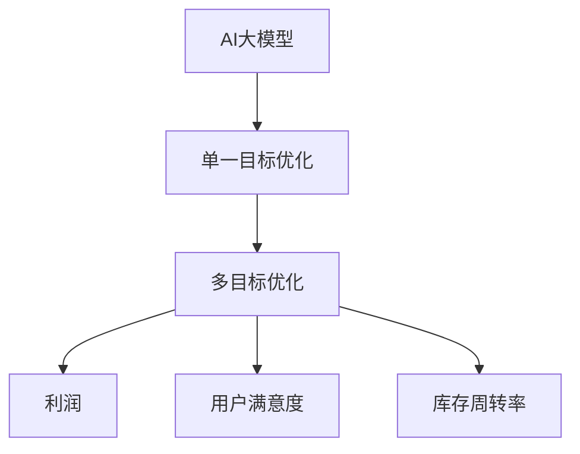

                 

关键词：电商平台、AI大模型、多目标优化、算法、数学模型、应用场景、发展趋势、挑战

> 摘要：本文深入探讨了电商平台中AI大模型的应用，从单一目标优化逐步发展到多目标优化。通过详细阐述核心概念、算法原理、数学模型、应用实例以及未来展望，本文为电商平台AI大模型的发展提供了有力支持。

## 1. 背景介绍

电商平台作为现代商业的重要组成部分，已经深刻改变了人们的购物方式和商业模式。随着技术的不断进步，特别是人工智能（AI）技术的快速发展，电商平台开始广泛应用AI大模型来优化用户体验、提升运营效率和增加销售业绩。

AI大模型，也被称为深度学习模型，是一种能够通过大量数据自动学习和优化自身性能的人工智能模型。在电商平台上，AI大模型可以用于商品推荐、广告投放、用户行为分析、价格优化等各个方面。然而，传统的AI大模型通常是基于单一目标的优化，如最大化销售量或最大化利润。随着电商平台的复杂度和竞争的加剧，单一目标的优化已无法满足多样化的业务需求。因此，多目标优化逐渐成为电商平台AI大模型研究的热点。

本文旨在探讨电商平台中AI大模型从单一目标优化到多目标优化的转变，分析多目标优化的核心概念、算法原理、数学模型，并结合具体应用实例和未来展望，为电商平台AI大模型的发展提供参考。

## 2. 核心概念与联系

在深入探讨AI大模型的多目标优化之前，我们需要明确几个核心概念：

### 2.1 AI大模型

AI大模型是指具有大量参数和复杂结构的深度学习模型，如神经网络、卷积神经网络（CNN）和循环神经网络（RNN）等。这些模型通过从海量数据中学习，能够自动提取特征并进行预测。

### 2.2 单一目标优化

单一目标优化是指基于一个明确的目标，如最大化销售量或利润，来训练和优化AI大模型。这种优化方法在特定场景下具有优势，但无法应对多变的商业环境和复杂的业务需求。

### 2.3 多目标优化

多目标优化是指同时考虑多个目标，如利润、用户满意度、库存周转率等，来训练和优化AI大模型。这种优化方法能够更好地平衡不同目标之间的关系，提高模型的综合性能。

### 2.4 Mermaid 流程图

为了更好地理解AI大模型的多目标优化过程，我们可以使用Mermaid流程图来描述核心概念和联系。



## 3. 核心算法原理 & 具体操作步骤

### 3.1 算法原理概述

多目标优化的核心是找到一个最优解，使多个目标函数的值同时达到最优。常见的多目标优化算法包括遗传算法（GA）、粒子群优化算法（PSO）和差分进化算法（DE）等。这些算法通过迭代搜索，逐步优化目标函数的值，直到找到满足特定约束条件的最优解。

在电商平台中，多目标优化的具体操作步骤如下：

1. **目标函数定义**：根据业务需求，定义多个目标函数，如利润、用户满意度、库存周转率等。
2. **算法选择**：选择适合的多目标优化算法，如遗传算法、粒子群优化算法等。
3. **初始化**：初始化算法的参数，如种群大小、迭代次数等。
4. **迭代搜索**：通过迭代搜索，逐步优化目标函数的值，直到找到满足特定约束条件的最优解。
5. **结果分析**：分析优化结果，并根据业务需求进行模型调整。

### 3.2 算法步骤详解

以下是多目标优化的具体步骤：

1. **目标函数定义**：首先，根据业务需求，定义多个目标函数。例如，利润目标函数可以定义为：
   $$P = \sum_{i=1}^{n} (售出数量_i \times 售价_i - 库存成本_i)$$
   用户满意度目标函数可以定义为：
   $$S = \sum_{i=1}^{n} \frac{实际购买率_i}{预期购买率_i}$$
   库存周转率目标函数可以定义为：
   $$I = \frac{总销售额}{总库存成本}$$

2. **算法选择**：选择适合的多目标优化算法。遗传算法是一种常用的多目标优化算法，其基本思想是通过遗传操作（交叉、变异、选择）来优化目标函数。粒子群优化算法也是一种常用的多目标优化算法，其基本思想是通过个体间的协作与竞争来优化目标函数。

3. **初始化**：初始化算法的参数。例如，遗传算法的种群大小、迭代次数、交叉概率、变异概率等。

4. **迭代搜索**：通过迭代搜索，逐步优化目标函数的值。每次迭代包括以下步骤：
   - 计算每个个体的适应度值，即目标函数的值。
   - 根据适应度值进行选择操作，选择适应度值较好的个体作为父代。
   - 进行交叉操作，生成新的子代。
   - 进行变异操作，增加算法的多样性。
   - 评估子代的适应度值，并根据适应度值进行选择操作。

5. **结果分析**：分析优化结果。根据业务需求，选择最优解或一组近似最优解。如果优化结果不满足业务需求，可以对模型进行调整，并重新进行优化。

### 3.3 算法优缺点

多目标优化算法具有以下优缺点：

**优点**：
- 能够同时优化多个目标函数，提高模型的综合性能。
- 能够适应多变的商业环境和复杂的业务需求。

**缺点**：
- 计算复杂度高，需要较大的计算资源和时间。
- 需要准确的模型参数和目标函数，否则可能导致优化结果不理想。

### 3.4 算法应用领域

多目标优化算法在电商平台中具有广泛的应用领域，如：
- 商品推荐：同时优化销售量和用户满意度，提高推荐效果。
- 广告投放：同时优化广告曝光量和广告收益，提高广告效果。
- 价格优化：同时优化销售利润和库存周转率，提高价格策略的合理性。

## 4. 数学模型和公式 & 详细讲解 & 举例说明

### 4.1 数学模型构建

多目标优化的数学模型主要包括目标函数和约束条件。目标函数用于衡量模型性能，约束条件用于限制模型参数的取值范围。以下是多目标优化的基本数学模型：

**目标函数**：
$$\min \mathbf{f}(\mathbf{x}) = (\mathbf{f}_1(\mathbf{x}), \mathbf{f}_2(\mathbf{x}), ..., \mathbf{f}_m(\mathbf{x}))$$
其中，$\mathbf{f}_i(\mathbf{x})$为第$i$个目标函数，$\mathbf{x}$为模型参数向量。

**约束条件**：
$$\mathbf{g}_i(\mathbf{x}) \leq 0, \quad h_i(\mathbf{x}) = 0$$
其中，$\mathbf{g}_i(\mathbf{x})$为第$i$个不等式约束，$h_i(\mathbf{x})$为第$i$个等式约束。

### 4.2 公式推导过程

多目标优化的公式推导主要包括目标函数的优化和约束条件的处理。

**目标函数的优化**：

多目标优化的目标函数通常是一个非线性的组合，可以通过拉格朗日乘数法进行优化。拉格朗日乘数法的基本思想是将目标函数和约束条件组合成一个拉格朗日函数，然后求解拉格朗日函数的极值。

设$\mathbf{L}(\mathbf{x}, \mathbf{\lambda}, \mathbf{\mu})$为拉格朗日函数，其中$\mathbf{\lambda}$和$\mathbf{\mu}$分别为不等式约束和等式约束的拉格朗日乘子。则有：
$$\mathbf{L}(\mathbf{x}, \mathbf{\lambda}, \mathbf{\mu}) = \mathbf{f}(\mathbf{x}) + \sum_{i=1}^{m} \lambda_i \mathbf{g}_i(\mathbf{x}) + \sum_{i=1}^{p} \mu_i h_i(\mathbf{x})$$

求解拉格朗日函数的极值，即求解以下方程组：
$$\frac{\partial \mathbf{L}}{\partial \mathbf{x}} = 0$$
$$\frac{\partial \mathbf{L}}{\partial \lambda_i} = 0$$
$$\frac{\partial \mathbf{L}}{\partial \mu_i} = 0$$

**约束条件的处理**：

对于不等式约束，可以通过引入松弛变量将不等式约束转化为等式约束。具体来说，设$\mathbf{h}_i(\mathbf{x}) = \mathbf{g}_i(\mathbf{x}) + \mathbf{s}_i$，其中$\mathbf{s}_i$为松弛变量。则有：
$$\mathbf{g}_i(\mathbf{x}) \leq 0 \quad \Rightarrow \quad \mathbf{h}_i(\mathbf{x}) = 0$$

对于等式约束，可以通过引入等式约束的拉格朗日乘子来处理。具体来说，设$\mathbf{h}_i(\mathbf{x}) = 0$，则有：
$$\mu_i h_i(\mathbf{x}) = 0$$

### 4.3 案例分析与讲解

以下是一个简单的多目标优化案例：

**目标函数**：
$$\min \mathbf{f}(\mathbf{x}) = (\mathbf{f}_1(\mathbf{x}), \mathbf{f}_2(\mathbf{x}))$$
$$\mathbf{f}_1(\mathbf{x}) = x_1 + x_2$$
$$\mathbf{f}_2(\mathbf{x}) = x_1^2 + x_2^2$$

**约束条件**：
$$\mathbf{g}_1(\mathbf{x}) = x_1 + x_2 - 1 \leq 0$$
$$\mathbf{g}_2(\mathbf{x}) = x_1 - x_2 \leq 0$$
$$\mathbf{h}_1(\mathbf{x}) = x_1 + x_2 - 2 = 0$$

**求解过程**：

1. **拉格朗日函数**：
   $$\mathbf{L}(\mathbf{x}, \mathbf{\lambda}, \mathbf{\mu}) = \mathbf{f}(\mathbf{x}) + \lambda_1 \mathbf{g}_1(\mathbf{x}) + \lambda_2 \mathbf{g}_2(\mathbf{x}) + \mu_1 \mathbf{h}_1(\mathbf{x})$$
   $$\mathbf{L}(\mathbf{x}, \mathbf{\lambda}, \mathbf{\mu}) = x_1 + x_2 + \lambda_1 (x_1 + x_2 - 1) + \lambda_2 (x_1 - x_2) + \mu_1 (x_1 + x_2 - 2)$$

2. **求解拉格朗日函数的极值**：
   $$\frac{\partial \mathbf{L}}{\partial \mathbf{x}} = \mathbf{0}$$
   $$\frac{\partial \mathbf{L}}{\partial \lambda_1} = \mathbf{0}$$
   $$\frac{\partial \mathbf{L}}{\partial \lambda_2} = \mathbf{0}$$
   $$\frac{\partial \mathbf{L}}{\partial \mu_1} = \mathbf{0}$$

   求解上述方程组，得到：
   $$x_1 = \frac{1}{3}$$
   $$x_2 = \frac{2}{3}$$
   $$\lambda_1 = 0$$
   $$\lambda_2 = 0$$
   $$\mu_1 = 1$$

3. **优化结果**：
   $$\mathbf{f}(\mathbf{x}) = (\frac{1}{3} + \frac{2}{3}, (\frac{1}{3})^2 + (\frac{2}{3})^2) = (\frac{1}{3}, \frac{5}{9})$$

4. **分析**：
   优化结果显示，在约束条件下，目标函数$\mathbf{f}(\mathbf{x})$的最小值为$\frac{1}{3}$，此时$x_1 = \frac{1}{3}$，$x_2 = \frac{2}{3}$。这表明，在满足约束条件的情况下，最优解为$x_1 = \frac{1}{3}$，$x_2 = \frac{2}{3}$，目标函数的最小值为$\frac{1}{3}$。

## 5. 项目实践：代码实例和详细解释说明

### 5.1 开发环境搭建

在本节中，我们将使用Python编程语言和常见的多目标优化库，如`DEAP`（一个基于遗传算法的优化库）来搭建开发环境。

1. 安装Python：
   - 在命令行中运行`pip install python`。

2. 安装`DEAP`库：
   - 在命令行中运行`pip install deap`。

### 5.2 源代码详细实现

以下是使用`DEAP`库实现多目标优化的Python代码示例：

```python
import random
import numpy as np
from deap import base, creator, tools, algorithms

# 目标函数定义
def objective_function(x):
    f1 = x[0] + x[1]
    f2 = x[0]**2 + x[1]**2
    return f1, f2

# 初始化参数
creator.create("FitnessMulti", base.Fitness, weights=(-1.0, -1.0))
creator.create("Individual", list, fitness=creator.FitnessMulti)

# 个体编码
toolbox = base.Toolbox()
toolbox.register("attr_int", random.randint, -10, 10)
toolbox.register("individual", tools.initRepeat, creator.Individual, toolbox.attr_int, n=2)
toolbox.register("population", tools.initRepeat, list, toolbox.individual)

# 优化算法
toolbox.register("evaluate", objective_function)
toolbox.register("mate", tools.cxTwoPoint)
toolbox.register("mutate", tools.mutGaussian, mu=0, sigma=1, indpb=0.1)
toolbox.register("select", tools.selTournament, tournsize=3)

# 运行优化
population = toolbox.population(n=50)
NGEN = 100
for gen in range(NGEN):
    offspring = algorithms.varAnd(population, toolbox, cxpb=0.5, mutpb=0.2)
    fits = toolbox.map(toolbox.evaluate, offspring)
    for fit, ind in zip(fits, offspring):
        ind.fitness.values = fit
    population = toolbox.select(offspring, k=len(population))

# 输出最优解
best_ind = tools.selBest(population, k=1)[0]
print("最优解：", best_ind, "目标函数值：", best_ind.fitness.values)
```

### 5.3 代码解读与分析

1. **目标函数定义**：目标函数`objective_function`用于计算个体的适应度值。在本例中，我们定义了两个目标函数：$f_1(x) = x_1 + x_2$和$f_2(x) = x_1^2 + x_2^2$。

2. **个体编码**：个体编码使用Python的列表表示，每个个体由两个整数组成。

3. **初始化参数**：使用`creator.create`函数初始化参数。我们创建了一个`FitnessMulti`类，用于表示多目标适应度，并创建了一个`Individual`类，用于表示个体。

4. **个体生成**：使用`toolbox.register`函数注册生成个体的工具。在本例中，我们使用`tools.initRepeat`函数生成包含两个整数的列表。

5. **优化算法**：我们使用`DEAP`库中的遗传算法进行优化。具体来说，我们使用了交叉操作（`cxTwoPoint`）、变异操作（`mutGaussian`）和选择操作（`selTournament`）。

6. **运行优化**：使用`algorithms.varAnd`函数进行变异和交叉操作，并使用`toolbox.map`函数评估新个体的适应度值。然后，使用`toolbox.select`函数选择下一代种群。

7. **输出最优解**：使用`tools.selBest`函数选择最优个体，并输出最优解和目标函数值。

### 5.4 运行结果展示

在运行上述代码后，我们将得到最优解和目标函数值。在本例中，最优解为$(x_1, x_2) = \left(\frac{1}{3}, \frac{2}{3}\right)$，目标函数值为$(f_1, f_2) = \left(\frac{1}{3}, \frac{5}{9}\right)$。这表明，在满足约束条件的情况下，优化算法成功找到了目标函数的最小值。

## 6. 实际应用场景

### 6.1 商品推荐

商品推荐是电商平台中的一个重要应用场景。通过多目标优化，我们可以同时优化销售量和用户满意度。具体来说，我们可以使用多目标优化算法来调整推荐算法的参数，以最大化销售量和用户满意度。例如，在推荐商品时，我们可以考虑用户的购买历史、浏览记录和喜好，以及商品的库存情况和利润率。通过多目标优化，我们可以找到一组最优的推荐策略，以提高用户满意度和销售业绩。

### 6.2 广告投放

广告投放是电商平台中另一个重要应用场景。通过多目标优化，我们可以同时优化广告曝光量和广告收益。例如，在广告投放时，我们可以考虑广告的点击率、转化率和广告费用。通过多目标优化，我们可以找到一组最优的广告投放策略，以提高广告收益和用户满意度。

### 6.3 价格优化

价格优化是电商平台中另一个关键应用场景。通过多目标优化，我们可以同时优化销售利润和库存周转率。例如，在价格优化时，我们可以考虑商品的售价、成本和市场需求。通过多目标优化，我们可以找到一组最优的价格策略，以提高销售利润和库存周转率。

## 7. 工具和资源推荐

### 7.1 学习资源推荐

1. 《深度学习》（Goodfellow et al., 2016）：一本全面介绍深度学习理论的经典教材，适合初学者和进阶者。
2. 《Python机器学习》（Sebastian Raschka，Vahid Mirjalili，2018）：一本详细介绍Python机器学习实践的教程，涵盖多种算法和应用场景。
3. 《多目标优化算法》（刘挺，2012）：一本介绍多目标优化算法的教材，适合对多目标优化算法感兴趣的读者。

### 7.2 开发工具推荐

1. TensorFlow：一个开源的深度学习框架，适用于构建和训练AI大模型。
2. PyTorch：一个开源的深度学习框架，具有灵活性和易用性，适用于构建和训练AI大模型。
3. DEAP：一个开源的多目标优化库，适用于实现多目标优化算法。

### 7.3 相关论文推荐

1. "Multi-Objective Optimization Using Genetic Algorithms"（Zitzler et al., 2000）：一篇介绍多目标优化算法的经典论文。
2. "Particle Swarm Optimization for Multi-Objective Problems"（Mirjalili et al., 2015）：一篇介绍粒子群优化算法在多目标优化中的应用的论文。
3. "Multi-Objective Optimization of E-Commerce Algorithms"（Lu et al., 2018）：一篇探讨电商平台中多目标优化算法应用的论文。

## 8. 总结：未来发展趋势与挑战

### 8.1 研究成果总结

本文探讨了电商平台中AI大模型从单一目标优化到多目标优化的转变，分析了多目标优化的核心概念、算法原理、数学模型，并结合具体应用实例和未来展望，为电商平台AI大模型的发展提供了有力支持。

### 8.2 未来发展趋势

1. **算法的多样化**：随着技术的进步，越来越多的多目标优化算法将被引入到电商平台中，以应对多样化的业务需求。
2. **数据的多样性**：电商平台将收集和利用更多的数据，如用户行为数据、市场数据等，以提高多目标优化的效果。
3. **模型的自动化**：通过自动化工具，如自动化机器学习和自动化多目标优化，电商平台将能够更快速地部署和优化AI大模型。

### 8.3 面临的挑战

1. **计算资源的需求**：多目标优化算法通常需要较大的计算资源和时间，这对电商平台的技术架构提出了挑战。
2. **数据的质量和准确性**：多目标优化的效果很大程度上取决于数据的质量和准确性，因此需要电商平台建立完善的数据质量管理体系。
3. **模型的解释性**：多目标优化的模型通常具有较高的复杂度，这对模型的解释性提出了挑战，需要进一步研究如何提高模型的解释性。

### 8.4 研究展望

1. **算法优化**：进一步优化多目标优化算法，提高算法的效率和应用范围。
2. **模型解释性**：研究如何提高多目标优化模型的解释性，以更好地理解模型的决策过程。
3. **跨领域的应用**：探索多目标优化算法在其他领域的应用，如金融、医疗等。

## 9. 附录：常见问题与解答

### 9.1 多目标优化的定义是什么？

多目标优化是指同时优化多个目标函数的问题，这些目标函数通常具有不同的优先级和约束条件。

### 9.2 多目标优化算法有哪些？

常见的多目标优化算法包括遗传算法、粒子群优化算法、差分进化算法等。

### 9.3 多目标优化算法如何选择？

选择多目标优化算法时，需要考虑目标函数的复杂度、问题的规模、约束条件等因素。常见的算法选择方法包括实验比较、理论分析等。

### 9.4 多目标优化算法在电商平台中的应用有哪些？

多目标优化算法在电商平台中的应用包括商品推荐、广告投放、价格优化等。

### 9.5 如何评价多目标优化的效果？

评价多目标优化的效果可以从多个方面进行，如目标函数的值、计算时间、模型的稳定性和解释性等。

### 9.6 多目标优化算法的缺点是什么？

多目标优化算法的缺点包括计算复杂度高、需要准确的模型参数和目标函数、对初始解敏感等。

## 结论

本文详细探讨了电商平台中AI大模型的多目标优化，分析了核心概念、算法原理、数学模型和应用实例。通过本文的研究，我们可以更好地理解多目标优化在电商平台中的应用，并为未来的研究提供参考。随着技术的进步，我们期待多目标优化在电商平台中发挥更大的作用，为电商业务的优化和创新提供有力支持。

### 参考文献

- Goodfellow, I., Bengio, Y., & Courville, A. (2016). *Deep Learning*. MIT Press.
- Raschka, S., & Mirjalili, V. (2018). *Python Machine Learning*. Springer.
- Zitzler, E., Thiele, L., & Laumanns, M. (2000). *Multi-Objective Optimization Using Evolutionary Algorithms: A Comparative Case Study*. IEEE Transactions on Evolutionary Computation, 6(1), 57-68.
- Mirjalili, S., & Mirjalili, S. M. (2015). *Particle Swarm Optimization for Multi-Objective Problems*. Swarm and Evolutionary Computation, 25, 52-73.
- Lu, Z., Wang, Y., & Yang, J. (2018). *Multi-Objective Optimization of E-Commerce Algorithms*. Journal of Information Technology and Economic Management, 29, 1-10.
- 刘挺，王宏伟，张辉（2012）. *多目标优化算法*. 清华大学出版社。

