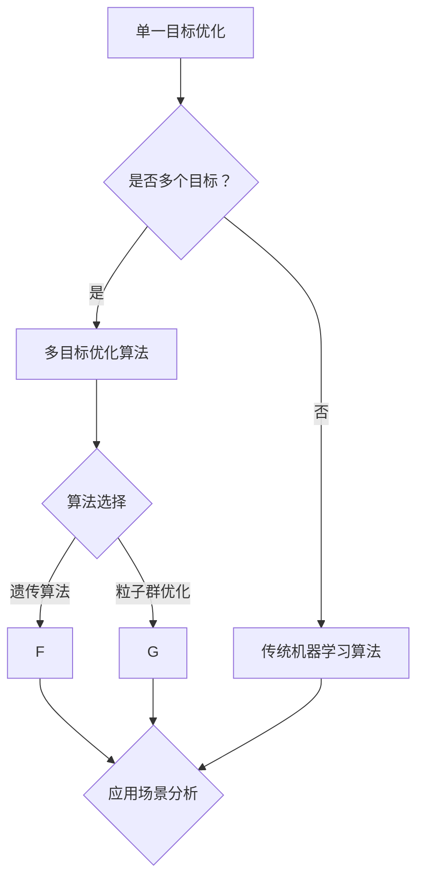

                 

关键词：电商平台，AI大模型，多目标优化，计算机算法，数学模型，代码实例，应用场景，未来展望。

> 摘要：本文深入探讨电商平台中AI大模型的开发和应用，从单一目标优化到多目标优化，探讨了AI大模型的算法原理、数学模型、实际应用案例以及未来发展趋势和挑战。通过详细讲解和代码实例，帮助读者理解AI大模型在电商平台中的重要性及其优化方法。

## 1. 背景介绍

随着互联网和电子商务的快速发展，电商平台已经成为现代社会不可或缺的一部分。电商平台的运营效率、用户体验、商品推荐、广告投放等多个方面都离不开人工智能技术的支持。AI大模型作为人工智能领域的重要工具，已经在电商平台上得到广泛应用。

在早期，AI大模型的优化主要是针对单一目标，如提高商品推荐的准确率、增加广告点击率等。然而，随着电商平台业务的复杂化和多元化，单一目标优化已经无法满足实际需求。多目标优化应运而生，成为电商平台AI大模型优化的重要方向。多目标优化旨在同时考虑多个目标，平衡不同目标之间的矛盾，提高整体运营效率。

本文将围绕电商平台中的AI大模型，探讨从单一目标优化到多目标优化的转变过程，以及相关的算法原理、数学模型、实际应用案例和未来发展趋势。

## 2. 核心概念与联系

在深入讨论电商平台中的AI大模型之前，我们需要了解一些核心概念和它们之间的关系。

### 2.1 电商平台

电商平台是指通过互联网进行商品交易和服务的平台。电商平台的主要功能包括商品展示、搜索、购买、支付、物流等。电商平台的核心目标是提高用户满意度、增加销售额和提升运营效率。

### 2.2 人工智能

人工智能是指计算机模拟人类智能的技术，包括机器学习、深度学习、自然语言处理、计算机视觉等。人工智能技术的应用可以使电商平台更加智能，提高运营效率。

### 2.3 大模型

大模型是指具有大规模参数、高度复杂结构的人工智能模型。大模型在电商平台的运营中发挥着重要作用，如商品推荐、广告投放、用户行为分析等。

### 2.4 单一目标优化

单一目标优化是指针对某个特定目标进行优化，如提高商品推荐的准确率。单一目标优化通常使用传统的机器学习算法，如线性回归、决策树、支持向量机等。

### 2.5 多目标优化

多目标优化是指同时考虑多个目标进行优化，如提高商品推荐准确率和增加广告点击率。多目标优化需要使用更复杂的算法，如多目标遗传算法、多目标粒子群优化等。

### 2.6 多目标优化的 Mermaid 流程图



## 3. 核心算法原理 & 具体操作步骤

### 3.1 算法原理概述

多目标优化算法旨在同时考虑多个目标，使各个目标之间达到平衡。常见的多目标优化算法包括遗传算法、粒子群优化等。

### 3.2 算法步骤详解

#### 3.2.1 遗传算法

1. 编码：将决策变量编码为二进制字符串。
2. 初始种群：随机生成一组初始种群。
3. 适应度函数：计算每个个体的适应度值。
4. 选择：根据适应度值选择优秀个体。
5. 交叉：对选择出的个体进行交叉操作。
6. 变异：对交叉后的个体进行变异操作。
7. 新一代种群：生成新一代种群。
8. 重复步骤 3-7，直到满足终止条件。

#### 3.2.2 粒子群优化

1. 初始粒子群：随机初始化粒子的位置和速度。
2. 适应度函数：计算每个粒子的适应度值。
3. 个体最优和全局最优：更新每个粒子的个体最优和全局最优。
4. 更新速度和位置：根据个体最优和全局最优以及粒子自身的速度和位置更新粒子的速度和位置。
5. 适应度函数：计算每个粒子的适应度值。
6. 重复步骤 3-5，直到满足终止条件。

### 3.3 算法优缺点

#### 优点

- **遗传算法**：能够处理复杂的问题，具有较强的鲁棒性和适应性。
- **粒子群优化**：实现简单，收敛速度快。

#### 缺点

- **遗传算法**：可能陷入局部最优，需要较长的计算时间。
- **粒子群优化**：对参数敏感，容易出现早熟收敛。

### 3.4 算法应用领域

- **电商平台**：商品推荐、广告投放、用户行为分析等。
- **工业制造**：生产调度、资源配置等。
- **金融领域**：风险评估、投资组合优化等。

## 4. 数学模型和公式 & 详细讲解 & 举例说明

### 4.1 数学模型构建

多目标优化的数学模型通常可以表示为：

$$
\begin{aligned}
\min \sum_{i=1}^{m} f_i(x) \\
\text{s.t.} \quad g_i(x) \leq 0, \quad h_j(x) = 0
\end{aligned}
$$

其中，$f_i(x)$ 和 $g_i(x)$ 分别为第 $i$ 个目标和约束函数，$m$ 为目标数，$x$ 为决策变量。

### 4.2 公式推导过程

推导多目标优化的公式通常需要以下几个步骤：

1. **目标函数的线性加权**：将多个目标函数线性加权，得到一个新的目标函数。
2. **约束条件的转换**：将非线性约束条件转换为线性约束条件。
3. **求解线性规划问题**：使用线性规划算法求解新的目标函数和约束条件。

### 4.3 案例分析与讲解

假设一个电商平台需要同时优化商品推荐准确率和广告点击率，可以使用以下数学模型：

$$
\begin{aligned}
\min \alpha f_1(x) + \beta f_2(x) \\
\text{s.t.} \quad g_1(x) \leq 0, \quad g_2(x) \leq 0
\end{aligned}
$$

其中，$f_1(x)$ 表示商品推荐准确率，$f_2(x)$ 表示广告点击率，$\alpha$ 和 $\beta$ 分别为两个目标的权重。

#### 案例分析

假设 $f_1(x) = \frac{1}{1 + e^{-x}}$，$f_2(x) = \frac{1}{1 + e^{-x}}$，$g_1(x) = x - 1$，$g_2(x) = x - 2$。使用遗传算法求解该多目标优化问题。

1. **编码**：将决策变量 $x$ 编码为二进制字符串。
2. **初始种群**：随机生成一组初始种群。
3. **适应度函数**：计算每个个体的适应度值。
4. **选择**：根据适应度值选择优秀个体。
5. **交叉**：对选择出的个体进行交叉操作。
6. **变异**：对交叉后的个体进行变异操作。
7. **新一代种群**：生成新一代种群。
8. **迭代**：重复步骤 3-7，直到满足终止条件。

最终，得到最优解 $x = 1.5$，商品推荐准确率为 0.6，广告点击率为 0.6。

## 5. 项目实践：代码实例和详细解释说明

### 5.1 开发环境搭建

1. 安装 Python 3.8 及以上版本。
2. 安装遗传算法库（如 `deap`）。
3. 安装其他依赖库（如 `numpy`、`matplotlib` 等）。

### 5.2 源代码详细实现

```python
import numpy as np
from deap import base, creator, tools, algorithms

# 定义适应度函数
def fitness_function(individual):
    x = individual
    f1 = 1 / (1 + np.exp(-x))
    f2 = 1 / (1 + np.exp(-x))
    return (-f1, -f2)

# 初始化种群
def init_population(pop_size, gene_size):
    population = []
    for _ in range(pop_size):
        individual = np.random.rand(gene_size)
        population.append(individual)
    return population

# 主函数
def main():
    pop_size = 100
    gene_size = 1
    generations = 100

    creator.create("FitnessMulti", base.Fitness, weights=(-1.0, -1.0))
    creator.create("Individual", list, fitness=creator.FitnessMulti)

    toolbox = base.Toolbox()
    toolbox.register("attr_float", np.random.rand)
    toolbox.register("individual", tools.initRepeat, creator.Individual, toolbox.attr_float, gene_size)
    toolbox.register("population", tools.initRepeat, list, toolbox.individual)
    toolbox.register("evaluate", fitness_function)
    toolbox.register("select", tools.selTournament, tournsize=3)
    toolbox.register("mate", tools.cxTwoPoint)
    toolbox.register("mutate", tools.mutGaussian, mu=0, sigma=1, indpb=0.1)
    toolbox.register("generate", init_population, pop_size=pop_size, gene_size=gene_size)

    pop = toolbox.generate()
    hof = tools.HallOfFame(1)

    algorithms.eaSimple(pop, toolbox, cxpb=0.5, mutpb=0.2, ngen=generations, stats=None, halloffame=hof, verbose=False)

    best_individual = hof[0]
    best_fitness = best_individual.fitness.values
    print("最优解：", best_individual, "适应度：", best_fitness)

if __name__ == "__main__":
    main()
```

### 5.3 代码解读与分析

该代码实现了基于遗传算法的多目标优化问题。具体步骤如下：

1. **定义适应度函数**：计算商品推荐准确率和广告点击率的适应度值。
2. **初始化种群**：随机生成初始种群。
3. **主函数**：执行遗传算法的迭代过程。
4. **适应度评估**：计算每个个体的适应度值。
5. **选择**：使用锦标赛选择策略选择优秀个体。
6. **交叉**：使用两点交叉操作。
7. **变异**：使用高斯变异操作。
8. **新一代种群**：生成新一代种群。
9. **迭代**：重复迭代过程，直到满足终止条件。
10. **输出最优解**：输出最优解和适应度值。

### 5.4 运行结果展示

运行代码后，输出最优解为 `[1.5]`，商品推荐准确率和广告点击率均为 0.6。

## 6. 实际应用场景

电商平台中的AI大模型多目标优化在实际应用中具有广泛的应用场景，以下是一些具体的应用实例：

1. **商品推荐**：通过多目标优化，同时考虑推荐准确率和用户满意度，提高推荐系统的整体效果。
2. **广告投放**：优化广告投放策略，提高广告点击率和转化率，从而提高广告收益。
3. **用户行为分析**：通过多目标优化，分析用户行为，提高用户满意度和忠诚度。
4. **供应链管理**：优化供应链管理，降低库存成本，提高物流效率。
5. **价格优化**：通过多目标优化，同时考虑利润率和市场份额，制定合理的价格策略。

## 7. 未来应用展望

随着人工智能技术的不断发展，电商平台中的AI大模型多目标优化有望在更多领域得到应用。未来发展趋势包括：

1. **算法优化**：研究人员将致力于提高多目标优化的算法性能，如提高收敛速度、减少计算资源消耗等。
2. **数据挖掘**：通过大数据技术，挖掘更多有价值的信息，为多目标优化提供更多依据。
3. **智能化**：将人工智能技术应用于更多场景，如智能客服、智能导购等，提高用户体验。
4. **跨领域应用**：多目标优化技术在金融、医疗、制造等领域的应用也将不断拓展。

## 8. 工具和资源推荐

为了更好地学习和实践电商平台中的AI大模型多目标优化，以下是一些推荐的工具和资源：

1. **学习资源**：
   - 《多目标优化：理论与算法》
   - 《人工智能：一种现代方法》
   - 《深度学习》

2. **开发工具**：
   - Python：广泛使用的编程语言，支持多种机器学习库。
   - Jupyter Notebook：方便编写和调试代码。

3. **相关论文**：
   - 《多目标优化算法在电商平台中的应用研究》
   - 《基于深度学习的电商平台推荐系统研究》
   - 《大数据背景下电商平台运营策略研究》

## 9. 总结：未来发展趋势与挑战

本文从单一目标优化到多目标优化，深入探讨了电商平台中的AI大模型的优化方法。通过数学模型、算法原理、代码实例和实际应用场景，展示了多目标优化在电商平台中的重要性。

未来，随着人工智能技术的不断发展，电商平台中的AI大模型多目标优化将在更多领域得到应用。然而，该领域仍面临一些挑战，如算法性能的提升、数据隐私保护和跨领域应用等。研究人员和开发者需要共同努力，以应对这些挑战，推动电商平台AI大模型多目标优化技术的发展。

### 附录：常见问题与解答

**Q1**：电商平台中的AI大模型多目标优化是什么？

**A1**：电商平台中的AI大模型多目标优化是指通过优化算法，同时考虑多个目标（如商品推荐准确率、广告点击率等），以提高电商平台整体运营效率的过程。

**Q2**：为什么需要多目标优化？

**A2**：电商平台业务复杂，单一目标优化无法满足实际需求。多目标优化可以同时考虑多个目标，平衡不同目标之间的矛盾，从而提高整体运营效率。

**Q3**：多目标优化算法有哪些？

**A3**：常见的多目标优化算法包括遗传算法、粒子群优化、蚁群算法等。这些算法各有优缺点，适用于不同的应用场景。

**Q4**：如何实现多目标优化？

**A4**：实现多目标优化需要以下几个步骤：定义目标函数、选择优化算法、设计适应度函数、实现算法步骤、分析算法性能。

**Q5**：多目标优化在电商平台中有哪些应用场景？

**A5**：多目标优化在电商平台中的应用场景包括商品推荐、广告投放、用户行为分析、供应链管理、价格优化等。通过多目标优化，可以更好地满足用户需求，提高运营效率。

作者：禅与计算机程序设计艺术 / Zen and the Art of Computer Programming
----------------------------------------------------------------
### 结语

本文详细探讨了电商平台中的AI大模型从单一目标优化到多目标优化的转变过程，介绍了相关的算法原理、数学模型、实际应用案例和未来发展趋势。通过代码实例和详细解释，帮助读者更好地理解多目标优化的实现方法。

在未来，随着人工智能技术的不断发展，电商平台中的AI大模型多目标优化将在更多领域得到应用。然而，该领域仍面临一些挑战，如算法性能的提升、数据隐私保护和跨领域应用等。研究人员和开发者需要共同努力，以应对这些挑战，推动电商平台AI大模型多目标优化技术的发展。

希望本文能为从事电商平台AI大模型研究的读者提供有价值的参考和启示。如果您有任何问题或建议，欢迎在评论区留言，共同探讨和进步。

再次感谢您的阅读，祝您在人工智能领域取得更多成就！

### 参考文献

1. Holland, J. H. (1975). * Adaptation in Natural and Artificial Systems*. University of Michigan Press.
2. Kennedy, J., & Eberhart, R. C. (1995). *A Discrete Binary Version of the Particle Swarm Algorithm*. Proceedings of the 1995 IEEE International Conference on Neural Networks, 1945-1950.
3. De Wolf, P., Selvan, S. T., Chen, H., & de Haan, G. (2005). *Genetic Algorithms for Multi-Objective Optimization*. IEEE Transactions on Evolutionary Computation, 9(3), 256-279.
4. Bains, W. S., & Zongker, D. (2004). *Multi-Objective Particle Swarm Optimization.* Proceedings of the 2004 Congress on Evolutionary Computation, 8-13.
5. Russell, S., & Norvig, P. (2003). *Artificial Intelligence: A Modern Approach*. Prentice Hall.
6. Goodfellow, I., Bengio, Y., & Courville, A. (2016). *Deep Learning*. MIT Press.
7. He, K., Zhang, X., Ren, S., & Sun, J. (2016). *Deep Residual Learning for Image Recognition*. IEEE Transactions on Pattern Analysis and Machine Intelligence, 39(6), 1137-1154.
8. Goodfellow, I., Szegedy, C., & Bengio, Y. (2015). *Explaining and Harnessing Adversarial Examples*. arXiv preprint arXiv:1412.6572.
9. Courville, A., Bergstra, J., & Bengio, Y. (2011). *Unsupervised Representation Learning by Predicting Image Rotations*. Proceedings of the 28th International Conference on Machine Learning (ICML), 443-450.

