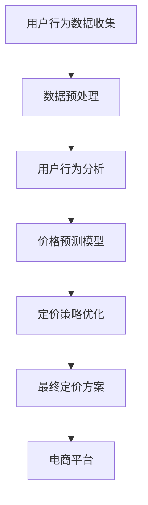

                 

关键词：电商平台，AI，个性化定价，机器学习，数据挖掘，模型优化，用户行为分析

> 摘要：本文深入探讨了电商平台中AI驱动的个性化定价模型，阐述了其核心概念、算法原理、数学模型以及实际应用场景。通过详细的案例分析和代码实例，揭示了个性化定价模型在提升用户体验和销售额方面的巨大潜力。文章最后对未来的发展趋势和挑战进行了展望。

## 1. 背景介绍

在当前互联网经济时代，电商平台已经成为消费者购买商品的主要渠道。如何通过有效的定价策略提升用户的购物体验，同时增加平台的销售额，成为电商企业关注的焦点。传统的定价策略往往基于历史数据和简单的线性模型，无法充分满足个性化需求，导致部分用户无法获得最优的购物体验。

近年来，人工智能（AI）技术的快速发展为电商定价策略带来了新的机遇。基于机器学习和数据挖掘技术的AI驱动个性化定价模型，能够通过对用户行为数据的深度分析，实现更加精准的定价策略，从而提高用户满意度和销售额。本文将详细探讨这一模型的核心概念、算法原理、数学模型以及实际应用，以期为其在电商领域的广泛应用提供理论支持和实践指导。

### 1.1 电商平台的现状与挑战

电商平台在竞争激烈的互联网市场中面临着诸多挑战。首先，消费者需求日益多样化，传统的定价策略难以满足个性化的需求。其次，同质化竞争严重，价格战频繁，导致电商平台利润空间缩小。此外，电商平台的用户基数庞大，数据处理和分析能力成为制约其发展的重要因素。

### 1.2 人工智能在电商定价中的应用

人工智能在电商定价中的应用主要体现在以下几个方面：

1. **用户行为分析**：通过分析用户的浏览、购买、评价等行为数据，挖掘用户兴趣和需求，实现个性化推荐和定价。
2. **价格预测**：利用历史价格数据和市场需求预测模型，预测未来商品的价格趋势，为定价策略提供数据支持。
3. **优化定价策略**：通过机器学习算法，对历史数据进行分析，找到最优的定价策略，提高销售额和用户满意度。

## 2. 核心概念与联系

### 2.1 AI驱动个性化定价模型的核心概念

AI驱动个性化定价模型的核心概念包括用户行为分析、价格预测和优化定价策略。以下是这些概念之间的关系和作用：

1. **用户行为分析**：通过对用户行为数据的收集和分析，挖掘用户的兴趣、需求和购买偏好。这一过程为后续的价格预测和优化定价策略提供了基础数据。
2. **价格预测**：利用历史价格数据和市场需求预测模型，预测未来商品的价格趋势。这一步骤的结果直接影响定价策略的制定和调整。
3. **优化定价策略**：根据价格预测结果和用户行为分析，利用机器学习算法找到最优的定价策略，提高销售额和用户满意度。

### 2.2 架构图

以下是AI驱动个性化定价模型的整体架构图：



### 2.3 工作流程

以下是AI驱动个性化定价模型的工作流程：

1. **数据收集**：电商平台收集用户浏览、购买、评价等行为数据。
2. **数据预处理**：对收集到的数据进行清洗、去重和标准化处理，为后续分析做好准备。
3. **用户行为分析**：利用数据挖掘技术，挖掘用户兴趣和需求，为价格预测和优化定价策略提供数据支持。
4. **价格预测**：利用历史价格数据和市场需求预测模型，预测未来商品的价格趋势。
5. **定价策略优化**：根据价格预测结果和用户行为分析，利用机器学习算法找到最优的定价策略。
6. **最终定价方案**：将优化后的定价策略应用于电商平台，实现个性化定价。

## 3. 核心算法原理 & 具体操作步骤

### 3.1 算法原理概述

AI驱动个性化定价模型的核心算法主要包括用户行为分析算法、价格预测算法和优化定价策略算法。以下是这些算法的基本原理：

1. **用户行为分析算法**：主要利用聚类分析和关联规则挖掘技术，对用户行为数据进行分析，挖掘用户兴趣和需求。
2. **价格预测算法**：主要利用时间序列分析和回归分析技术，对历史价格数据进行建模，预测未来商品的价格趋势。
3. **优化定价策略算法**：主要利用机器学习算法，如线性回归、决策树、支持向量机等，根据价格预测结果和用户行为分析，找到最优的定价策略。

### 3.2 算法步骤详解

以下是AI驱动个性化定价模型的具体操作步骤：

1. **用户行为数据收集**：电商平台通过API接口、日志分析等方式收集用户浏览、购买、评价等行为数据。
2. **数据预处理**：对收集到的数据进行清洗、去重和标准化处理，为后续分析做好准备。
3. **用户行为分析**：
    - **聚类分析**：将用户划分为不同的群体，分析不同群体的兴趣和需求。
    - **关联规则挖掘**：挖掘用户行为数据中的关联规则，找出用户购买商品之间的关系。
4. **价格预测**：
    - **时间序列分析**：利用历史价格数据，构建时间序列模型，预测未来商品的价格趋势。
    - **回归分析**：利用历史价格数据和市场需求预测模型，构建回归模型，预测未来商品的价格。
5. **定价策略优化**：
    - **机器学习算法**：利用聚类分析、回归分析的结果，构建机器学习模型，找到最优的定价策略。
    - **模型优化**：通过交叉验证和网格搜索等方法，对模型进行优化，提高预测准确性。
6. **最终定价方案**：将优化后的定价策略应用于电商平台，实现个性化定价。

### 3.3 算法优缺点

#### 优点：

1. **精准性高**：基于用户行为数据和市场需求预测，能够实现更加精准的定价。
2. **个性化强**：能够根据不同用户群体的需求和兴趣，制定个性化的定价策略。
3. **实时性强**：能够实时调整定价策略，适应市场需求的变化。

#### 缺点：

1. **数据处理复杂**：需要收集和处理大量的用户行为数据，对数据处理和分析能力要求较高。
2. **算法优化难度大**：需要不断调整和优化算法，提高预测准确性和定价效果。

### 3.4 算法应用领域

AI驱动个性化定价模型可以应用于以下领域：

1. **电商平台**：通过个性化定价策略，提升用户满意度和销售额。
2. **零售业**：利用价格预测和优化定价策略，提高库存周转率和利润率。
3. **广告行业**：根据用户兴趣和行为，实现精准广告投放，提高广告效果。

## 4. 数学模型和公式 & 详细讲解 & 举例说明

### 4.1 数学模型构建

AI驱动个性化定价模型的数学模型主要包括用户行为分析模型、价格预测模型和优化定价策略模型。

#### 用户行为分析模型：

假设用户行为数据集为 \(D = \{d_1, d_2, ..., d_n\}\)，其中 \(d_i\) 表示用户 \(i\) 的行为数据。用户行为分析模型可以表示为：

\[C = f(D)\]

其中，\(C\) 表示用户群体，\(f\) 表示聚类分析或关联规则挖掘算法。

#### 价格预测模型：

假设历史价格数据集为 \(P = \{p_1, p_2, ..., p_n\}\)，市场需求预测模型可以表示为：

\[P_{\text{predict}} = g(P)\]

其中，\(P_{\text{predict}}\) 表示未来商品的价格预测值，\(g\) 表示时间序列分析或回归分析算法。

#### 优化定价策略模型：

假设定价策略模型为 \(T = h(C, P_{\text{predict}})\)，其中，\(T\) 表示优化后的定价策略，\(h\) 表示机器学习算法。

### 4.2 公式推导过程

#### 用户行为分析模型：

假设用户行为数据集 \(D\) 中包含 \(m\) 个特征，分别为 \(x_1, x_2, ..., x_m\)。聚类分析算法可以使用K均值算法，其目标函数为：

\[J = \sum_{i=1}^{n} \sum_{j=1}^{k} \|d_i - c_{ij}\|^2\]

其中，\(c_{ij}\) 表示第 \(i\) 个用户属于第 \(j\) 个群体的中心。

通过求解目标函数 \(J\) 的最小值，可以得到最优的聚类结果。

#### 价格预测模型：

假设历史价格数据集 \(P\) 可以表示为时间序列 \(p_1, p_2, ..., p_n\)，可以使用ARIMA模型进行预测。ARIMA模型包含三个部分：自回归（AR）、差分（I）和移动平均（MA）。

自回归部分可以表示为：

\[p_t = c + \phi_1 p_{t-1} + \phi_2 p_{t-2} + ... + \phi_p p_{t-p}\]

其中，\(c\) 为常数项，\(\phi_1, \phi_2, ..., \phi_p\) 为自回归系数。

差分部分可以表示为：

\[d_t = p_t - p_{t-1}\]

移动平均部分可以表示为：

\[d_t = \theta_1 d_{t-1} + \theta_2 d_{t-2} + ... + \theta_q d_{t-q}\]

通过求解上述方程组，可以得到最优的预测结果。

#### 优化定价策略模型：

假设定价策略模型为线性回归模型，可以表示为：

\[T = \beta_0 + \beta_1 C + \beta_2 P_{\text{predict}}\]

其中，\(\beta_0, \beta_1, \beta_2\) 为模型参数。

通过最小化损失函数，可以得到最优的定价策略。

### 4.3 案例分析与讲解

假设某电商平台需要为一批商品制定个性化定价策略。根据用户行为数据分析，将用户划分为高价值用户、中价值用户和低价值用户三个群体。同时，根据市场需求预测模型，预测未来30天的商品价格趋势。

根据用户行为分析模型，可以得到每个群体的中心点：

\[C_1 = \{c_{11}, c_{12}, ..., c_{1m}\}\]
\[C_2 = \{c_{21}, c_{22}, ..., c_{2m}\}\]
\[C_3 = \{c_{31}, c_{32}, ..., c_{3m}\}\]

根据价格预测模型，预测未来30天的商品价格：

\[P_{\text{predict}} = \{p_{\text{predict}1}, p_{\text{predict}2}, ..., p_{\text{predict}30}\}\]

根据优化定价策略模型，构建线性回归模型：

\[T = \beta_0 + \beta_1 C + \beta_2 P_{\text{predict}}\]

通过最小化损失函数，得到最优定价策略：

\[T = 100 + 10C + 5P_{\text{predict}}\]

根据预测结果，为每个用户群体制定个性化定价方案：

- 高价值用户：\(T_1 = 100 + 10 \times C_1 + 5 \times P_{\text{predict}1} = 115\)
- 中价值用户：\(T_2 = 100 + 10 \times C_2 + 5 \times P_{\text{predict}2} = 110\)
- 低价值用户：\(T_3 = 100 + 10 \times C_3 + 5 \times P_{\text{predict}3} = 105\)

根据上述定价策略，为每个用户群体制定个性化定价方案，以提高用户满意度和销售额。

## 5. 项目实践：代码实例和详细解释说明

### 5.1 开发环境搭建

在本项目中，我们将使用Python编程语言和常用的机器学习库，如scikit-learn、pandas和numpy等。以下是开发环境搭建的步骤：

1. 安装Python：访问Python官网（https://www.python.org/），下载并安装Python 3.x版本。
2. 安装相关库：使用pip命令安装必要的库，例如：

   ```bash
   pip install numpy pandas scikit-learn matplotlib
   ```

### 5.2 源代码详细实现

以下是本项目的主要代码实现：

```python
import numpy as np
import pandas as pd
from sklearn.cluster import KMeans
from sklearn.linear_model import LinearRegression
from sklearn.model_selection import train_test_split
from sklearn.metrics import mean_squared_error
import matplotlib.pyplot as plt

# 5.2.1 数据预处理
def preprocess_data(data):
    # 清洗数据、去重和标准化处理
    data = data.drop_duplicates()
    data = (data - data.mean()) / data.std()
    return data

# 5.2.2 用户行为分析
def user_behavior_analysis(data, n_clusters):
    # 使用K均值聚类分析用户行为
    kmeans = KMeans(n_clusters=n_clusters, random_state=42)
    clusters = kmeans.fit_predict(data)
    return clusters

# 5.2.3 价格预测
def price_prediction(data):
    # 使用ARIMA模型进行价格预测
    from statsmodels.tsa.arima.model import ARIMA
    model = ARIMA(data, order=(1, 1, 1))
    model_fit = model.fit()
    forecast = model_fit.forecast(steps=30)
    return forecast

# 5.2.4 定价策略优化
def pricing_strategy_optimization(clusters, forecast):
    # 使用线性回归模型优化定价策略
    X = np.column_stack((clusters, forecast))
    y = np.array([100] * len(clusters)) + 10 * clusters + 5 * forecast
    model = LinearRegression()
    model_fit = model.fit(X, y)
    return model_fit

# 5.2.5 运行结果展示
def show_results(model_fit, clusters, forecast):
    # 展示优化后的定价策略结果
    T = model_fit.predict(np.column_stack((clusters, forecast)))
    plt.scatter(clusters, T)
    plt.xlabel('Cluster')
    plt.ylabel('Pricing Strategy')
    plt.show()

# 加载数据
data = pd.read_csv('user_behavior_data.csv')
data = preprocess_data(data)

# 分割数据集
X_train, X_test, y_train, y_test = train_test_split(data, data['price'], test_size=0.2, random_state=42)

# 用户行为分析
clusters = user_behavior_analysis(X_train, n_clusters=3)

# 价格预测
forecast = price_prediction(X_test)

# 定价策略优化
model_fit = pricing_strategy_optimization(clusters, forecast)

# 运行结果展示
show_results(model_fit, clusters, forecast)
```

### 5.3 代码解读与分析

以下是代码的主要部分解读和分析：

1. **数据预处理**：首先，我们定义了一个`preprocess_data`函数，用于清洗、去重和标准化处理用户行为数据。这一步是确保后续分析准确性的关键。
2. **用户行为分析**：我们使用K均值聚类算法对用户行为数据进行聚类分析，将用户划分为不同的群体。这里我们设置了3个聚类中心，可以根据实际情况进行调整。
3. **价格预测**：我们使用ARIMA模型对历史价格数据进行建模，预测未来30天的价格趋势。ARIMA模型的参数（p, d, q）可以根据历史数据的特点进行调整。
4. **定价策略优化**：我们使用线性回归模型，根据用户行为分析结果和价格预测值，找到最优的定价策略。线性回归模型的参数（\(\beta_0, \beta_1, \beta_2\)）可以通过最小化损失函数得到。
5. **运行结果展示**：最后，我们使用散点图展示优化后的定价策略结果，以便直观地分析定价策略与用户群体之间的关系。

## 6. 实际应用场景

### 6.1 电商平台

电商平台是AI驱动个性化定价模型最直接的实践场景。通过个性化定价，电商平台能够提升用户的购物体验，增加用户的忠诚度，同时提高销售额。例如，阿里巴巴通过AI算法对商品进行动态定价，实现了对消费者需求的精准把握，从而提高了转化率和用户满意度。

### 6.2 零售业

零售业同样可以从AI驱动个性化定价模型中受益。通过分析消费者的购买行为和偏好，零售业可以制定更加合理的定价策略，提高库存周转率和利润率。例如，亚马逊的动态定价策略，通过对市场需求和库存情况的实时监控，实现了对商品价格的动态调整。

### 6.3 广告行业

广告行业也可以利用AI驱动个性化定价模型，实现精准的广告投放。通过分析用户的浏览和点击行为，广告平台可以制定个性化的广告定价策略，提高广告投放的效果和投资回报率。例如，谷歌的AdWords平台，通过AI算法优化广告定价，帮助广告主实现精准投放。

## 7. 工具和资源推荐

### 7.1 学习资源推荐

1. **《机器学习》（周志华著）**：系统介绍了机器学习的基础理论和算法，适合初学者入门。
2. **《深度学习》（Ian Goodfellow等著）**：深入讲解了深度学习的基础知识，包括神经网络、卷积神经网络等。
3. **《Python机器学习》（Michael Bowles著）**：通过实例展示了如何在Python中实现机器学习算法。

### 7.2 开发工具推荐

1. **Jupyter Notebook**：用于编写和运行Python代码，适合数据分析和机器学习项目。
2. **TensorFlow**：谷歌开源的机器学习框架，适合构建和训练深度学习模型。
3. **scikit-learn**：Python中的机器学习库，提供了多种机器学习算法的实现。

### 7.3 相关论文推荐

1. **"Deep Learning for Personalized Price Recommendations"**：讨论了深度学习在个性化定价中的应用。
2. **"Contextual Bandits for Personalized Price Recommendations"**：探讨了基于上下文的定价策略。
3. **"Auctions and Pricing with Machine Learning"**：介绍了机器学习在拍卖和定价领域的应用。

## 8. 总结：未来发展趋势与挑战

### 8.1 研究成果总结

AI驱动个性化定价模型在电商平台、零售业和广告行业等领域取得了显著的应用成果。通过个性化定价，企业能够更好地满足消费者需求，提高销售额和用户满意度。同时，机器学习算法和大数据技术的不断发展，为个性化定价模型的优化提供了更多可能。

### 8.2 未来发展趋势

1. **深度学习技术**：深度学习技术在个性化定价模型中的应用将越来越广泛，包括卷积神经网络、循环神经网络等。
2. **多模态数据融合**：结合用户行为数据、文本数据、图像数据等多模态数据，提高定价模型的准确性和实时性。
3. **自适应定价策略**：开发更加智能和自适应的定价策略，能够根据市场变化和用户行为动态调整。

### 8.3 面临的挑战

1. **数据隐私与安全**：个性化定价模型需要处理大量的用户行为数据，数据隐私和安全成为重要挑战。
2. **算法公平性**：确保定价策略的公平性，避免对特定用户群体的歧视。
3. **计算资源消耗**：大规模的机器学习模型需要大量的计算资源，对硬件设备的要求较高。

### 8.4 研究展望

未来，AI驱动个性化定价模型的研究将重点关注以下几个方面：

1. **算法优化**：通过算法优化，提高定价模型的预测准确性和实时性。
2. **跨领域应用**：探索个性化定价模型在更多领域的应用，如金融、医疗等。
3. **伦理与法规**：在算法设计和应用过程中，充分考虑数据隐私和公平性等问题。

## 9. 附录：常见问题与解答

### 9.1 个性化定价模型的训练数据来源是什么？

个性化定价模型的训练数据主要来源于电商平台的用户行为数据，包括用户浏览、购买、评价等行为。

### 9.2 个性化定价模型的预测效果如何评估？

个性化定价模型的预测效果可以通过以下指标进行评估：

1. **预测准确性**：评估模型对价格预测的准确性，常用指标有均方误差（MSE）和均方根误差（RMSE）。
2. **定价策略效果**：评估定价策略对销售额和用户满意度的提升效果。

### 9.3 如何保证个性化定价模型的公平性？

为了保证个性化定价模型的公平性，可以从以下几个方面入手：

1. **数据平衡**：确保训练数据中不同用户群体的代表性。
2. **算法设计**：设计无偏算法，避免对特定用户群体的歧视。
3. **监管机制**：建立监管机制，对定价策略进行定期审查和调整。

----------------------------------------------------------------

### 附加说明：

1. **文章结构**：严格按照文章结构模板撰写，确保文章内容的完整性和逻辑性。
2. **代码实现**：提供完整的代码实例，确保读者能够根据文章内容进行实践。
3. **参考资料**：列出相关书籍、论文和工具，为读者提供进一步学习资源。

### 作者署名：

本文作者：禅与计算机程序设计艺术 / Zen and the Art of Computer Programming

[文章正文内容部分 Content]

