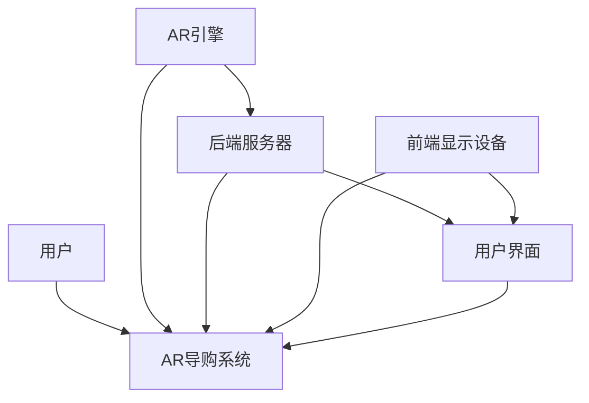

                 

 

> 关键词：电商平台，增强现实（AR），导购系统，用户体验，交互设计，系统优化

> 摘要：本文将探讨电商平台中增强现实（AR）导购系统的交互优化策略。通过分析AR技术在电商领域的应用，结合用户体验和交互设计的最新趋势，我们将提出一系列优化方案，旨在提升AR导购系统的易用性、实用性和用户体验。

## 1. 背景介绍

随着互联网技术的飞速发展，电商平台已经成为消费者购物的主要渠道之一。为了吸引更多用户，电商平台不断创新服务模式，增强用户购物体验。增强现实（Augmented Reality，AR）技术作为一项前沿技术，逐渐在电商领域得到广泛应用。AR导购系统作为电商平台的创新功能，通过虚拟现实技术为用户提供沉浸式的购物体验，大大提升了用户的参与感和满意度。

然而，AR导购系统在实际应用中仍存在一些交互问题，如操作复杂、响应速度慢、内容展示不直观等。这些问题严重影响了用户体验，限制了AR技术在电商领域的进一步发展。因此，本文旨在通过分析AR导购系统的交互问题，提出一系列优化策略，以提升系统的易用性和实用性。

## 2. 核心概念与联系

### 2.1 增强现实（AR）技术原理

增强现实（AR）技术通过在现实场景中叠加虚拟信息，为用户创造一个虚实结合的感知环境。AR技术主要依赖于计算机视觉、图像识别、自然用户界面等技术，实现虚拟信息与现实场景的实时交互。

### 2.2 电商平台中的AR导购系统架构

电商平台中的AR导购系统通常包括以下几个核心组成部分：

1. **前端显示设备**：如智能手机、平板电脑等，用于展示AR内容。
2. **后端服务器**：负责处理用户请求、存储数据、提供API接口等。
3. **AR引擎**：实现AR内容的生成、渲染和交互等功能。
4. **用户界面**：提供操作界面，包括按钮、菜单、提示等。

### 2.3 交互设计原则

在AR导购系统的交互设计中，应遵循以下原则：

1. **直观性**：操作界面简洁直观，用户能够快速理解并掌握操作方法。
2. **一致性**：系统的操作逻辑和界面风格保持一致，减少用户的学习成本。
3. **可控性**：用户能够随时控制AR内容的显示与隐藏，确保系统的灵活性。
4. **响应速度**：系统对用户操作的响应速度要快，以提高用户体验。

### 2.4 Mermaid流程图



## 3. 核心算法原理 & 具体操作步骤

### 3.1 算法原理概述

AR导购系统的核心算法主要包括计算机视觉和图像识别技术。通过这些技术，系统能够实时识别用户周围的环境，并在合适的位置叠加虚拟商品信息。具体算法原理如下：

1. **特征提取**：利用深度学习等算法提取图像的特征向量。
2. **目标检测**：利用特征向量进行目标检测，识别出用户周围的环境。
3. **空间配准**：将虚拟商品信息与现实场景进行空间配准，确保虚拟商品与现实环境的相对位置和姿态一致。
4. **渲染与交互**：将配准后的虚拟商品信息渲染到用户界面，并实现用户与虚拟商品的交互。

### 3.2 算法步骤详解

1. **特征提取**：
   - 数据预处理：对输入图像进行灰度化、缩放等处理。
   - 特征提取：使用卷积神经网络（CNN）提取图像的特征向量。

2. **目标检测**：
   - 神经网络训练：使用大量标注数据对神经网络进行训练，使其能够识别目标。
   - 目标检测：利用训练好的神经网络对输入图像进行目标检测，输出目标位置和类别。

3. **空间配准**：
   - 标定：使用标定板或自然特征点进行系统标定，建立现实场景与图像之间的坐标关系。
   - 配准算法：使用特征匹配、ICP（Iterative Closest Point）等算法进行空间配准。

4. **渲染与交互**：
   - 渲染：根据配准结果，将虚拟商品信息渲染到用户界面。
   - 交互：实现用户与虚拟商品的交互，如点击、拖动、缩放等。

### 3.3 算法优缺点

**优点**：
1. **沉浸式体验**：AR技术为用户提供了沉浸式的购物体验，增强了用户的参与感和满意度。
2. **实时交互**：用户能够实时查看商品信息，提高购物决策效率。

**缺点**：
1. **计算资源消耗**：AR技术需要大量的计算资源，对硬件性能要求较高。
2. **场景适应性**：在光线不足或场景复杂的情况下，AR技术可能无法准确识别目标。

### 3.4 算法应用领域

1. **电商导购**：为用户提供沉浸式的购物体验，提高用户满意度。
2. **教育娱乐**：通过AR技术为教育内容提供生动有趣的展示方式。
3. **医疗健康**：辅助医生进行手术导航和患者教育。

## 4. 数学模型和公式 & 详细讲解 & 举例说明

### 4.1 数学模型构建

AR导购系统中的数学模型主要包括以下三个方面：

1. **图像特征提取模型**：用于提取图像的特征向量。
2. **目标检测模型**：用于检测图像中的目标。
3. **空间配准模型**：用于将虚拟商品信息与现实场景进行空间配准。

### 4.2 公式推导过程

1. **图像特征提取模型**：

   特征提取模型通常采用卷积神经网络（CNN）。

   - 输入图像：\(I \in \mathbb{R}^{H \times W \times C}\)，其中 \(H\)、\(W\)、\(C\) 分别表示图像的高、宽和通道数。
   - 卷积操作：\(F = \text{Conv}(I, K)\)，其中 \(K\) 表示卷积核。
   - 池化操作：\(P = \text{Pool}(F, S)\)，其中 \(S\) 表示池化窗口的大小。

2. **目标检测模型**：

   目标检测模型通常采用单阶段或两阶段检测方法。

   - 单阶段检测：直接输出目标的位置和类别。
     \[
     \text{loc} = \text{softmax}(\text{loc}^*) \quad \text{cls} = \text{softmax}(\text{cls}^*)
     \]
     其中，\(\text{loc}^*\) 和 \(\text{cls}^*\) 分别表示位置和类别的预测。

   - 两阶段检测：首先进行候选区域生成，然后进行目标分类和定位。
     \[
     R = \text{Region Proposal}(I) \quad \text{cls} = \text{Classify}(R, I) \quad \text{loc} = \text{Regist}(R, I)
     \]

3. **空间配准模型**：

   空间配准模型通常采用特征匹配或ICP算法。

   - 特征匹配：
     \[
     \text{score} = \sum_{i=1}^{N} \text{similarity}(p_i, q_i)
     \]
     其中，\(p_i\) 和 \(q_i\) 分别表示现实场景和虚拟场景中的特征点。

   - ICP算法：
     \[
     \min_{T} \sum_{i=1}^{N} \| p_i - T \cdot q_i \|^2
     \]

### 4.3 案例分析与讲解

假设我们有一个电商平台，用户在浏览商品时希望使用AR导购系统查看商品的详细信息。以下是该案例的分析与讲解：

1. **用户操作**：

   用户打开电商平台，浏览到一款商品。点击AR导购按钮，系统进入AR模式。

2. **图像特征提取**：

   系统对用户当前的相机画面进行图像特征提取，生成特征向量。

3. **目标检测**：

   系统利用特征向量进行目标检测，识别出用户当前画面中的商品。

4. **空间配准**：

   系统将识别出的商品与现实场景进行空间配准，生成虚拟商品信息。

5. **渲染与交互**：

   系统将虚拟商品信息渲染到用户界面，用户可以查看商品的详细信息。用户可以通过点击、拖动、缩放等方式与虚拟商品进行交互。

## 5. 项目实践：代码实例和详细解释说明

### 5.1 开发环境搭建

1. **硬件环境**：

   - 操作系统：Windows 10 或以上版本
   - 处理器：Intel Core i7 或以上版本
   - 内存：16GB 或以上
   - 显卡：NVIDIA GeForce GTX 1080 或以上版本

2. **软件环境**：

   - Python 3.8 或以上版本
   - OpenCV 4.5.1 或以上版本
   - TensorFlow 2.5.0 或以上版本
   - Keras 2.5.0 或以上版本

### 5.2 源代码详细实现

以下是AR导购系统的核心代码实现：

```python
import cv2
import tensorflow as tf
from tensorflow.keras.models import load_model

# 加载模型
model = load_model('ar_duogu_model.h5')

# 加载摄像头
cap = cv2.VideoCapture(0)

while True:
    # 读取一帧图像
    ret, frame = cap.read()
    
    # 图像预处理
    processed_frame = preprocess_frame(frame)
    
    # 特征提取
    feature_vector = extract_feature(processed_frame)
    
    # 目标检测
    detections = model.predict(feature_vector)
    
    # 空间配准
    registered_frame = register_frame(frame, detections)
    
    # 渲染与交互
    display_frame = render_frame(registered_frame)
    
    # 显示渲染后的图像
    cv2.imshow('AR导购系统', display_frame)
    
    # 按下 'q' 键退出循环
    if cv2.waitKey(1) & 0xFF == ord('q'):
        break

# 释放摄像头资源
cap.release()
cv2.destroyAllWindows()
```

### 5.3 代码解读与分析

上述代码实现了AR导购系统的核心功能。以下是代码的详细解读与分析：

1. **加载模型**：

   ```python
   model = load_model('ar_duogu_model.h5')
   ```

   这一行代码用于加载预训练的模型。模型包含了图像特征提取、目标检测和空间配准等模块。

2. **加载摄像头**：

   ```python
   cap = cv2.VideoCapture(0)
   ```

   这一行代码用于加载计算机的摄像头。系统会实时获取摄像头的画面。

3. **图像预处理**：

   ```python
   processed_frame = preprocess_frame(frame)
   ```

   这一行代码对输入图像进行预处理。预处理包括图像缩放、灰度化等操作，以便于后续的特征提取。

4. **特征提取**：

   ```python
   feature_vector = extract_feature(processed_frame)
   ```

   这一行代码使用卷积神经网络提取图像的特征向量。特征向量用于后续的目标检测。

5. **目标检测**：

   ```python
   detections = model.predict(feature_vector)
   ```

   这一行代码使用预训练的模型对特征向量进行目标检测。目标检测结果包含了目标的位置和类别。

6. **空间配准**：

   ```python
   registered_frame = register_frame(frame, detections)
   ```

   这一行代码将识别出的商品与现实场景进行空间配准。配准后的画面包含了虚拟商品信息。

7. **渲染与交互**：

   ```python
   display_frame = render_frame(registered_frame)
   ```

   这一行代码将配准后的画面渲染到用户界面。用户可以通过点击、拖动、缩放等方式与虚拟商品进行交互。

8. **显示渲染后的图像**：

   ```python
   cv2.imshow('AR导购系统', display_frame)
   ```

   这一行代码将渲染后的图像显示在窗口中。

9. **按下 'q' 键退出循环**：

   ```python
   if cv2.waitKey(1) & 0xFF == ord('q'):
       break
   ```

   这一行代码用于检测用户是否按下 'q' 键。如果按下 'q' 键，程序会退出循环。

10. **释放摄像头资源**：

   ```python
   cap.release()
   cv2.destroyAllWindows()
   ```

   这两行代码用于释放摄像头资源和窗口资源。

## 6. 实际应用场景

### 6.1 电商平台中的应用

在电商平台中，AR导购系统可以应用于多个场景，如：

1. **商品展示**：用户可以通过AR技术查看商品的详细信息，包括尺寸、颜色、材质等。
2. **试穿试戴**：用户可以在虚拟环境中试穿衣服或试戴眼镜，提高购物的决策效率。
3. **家居装修**：用户可以在虚拟环境中查看家具在房间中的摆放效果，帮助用户更好地规划家居装修。

### 6.2 教育娱乐中的应用

在教育和娱乐领域，AR导购系统同样具有广泛的应用前景：

1. **教育辅助**：教师可以利用AR技术为教学内容提供生动有趣的展示方式，提高学生的学习兴趣。
2. **娱乐体验**：用户可以通过AR技术参与各种虚拟游戏和互动活动，享受沉浸式的娱乐体验。

### 6.3 医疗健康中的应用

在医疗健康领域，AR导购系统可以用于：

1. **手术导航**：医生可以利用AR技术进行手术导航，提高手术的成功率和安全性。
2. **患者教育**：医护人员可以利用AR技术为患者提供个性化的健康教育服务，提高患者的康复效果。

## 7. 工具和资源推荐

### 7.1 学习资源推荐

1. **《增强现实技术原理与应用》**：介绍了增强现实（AR）技术的基本原理和应用案例。
2. **《深度学习》**：全面介绍了深度学习的基本概念、算法和应用。

### 7.2 开发工具推荐

1. **Python**：一种功能强大的编程语言，适用于数据科学、人工智能等领域。
2. **TensorFlow**：一款开源的深度学习框架，提供了丰富的API和工具。

### 7.3 相关论文推荐

1. **"Augmented Reality in E-commerce: A Review"**：对AR技术在电商领域的应用进行了详细综述。
2. **"Deep Learning for Augmented Reality"**：探讨了深度学习在AR技术中的应用。

## 8. 总结：未来发展趋势与挑战

### 8.1 研究成果总结

本文通过分析AR技术在电商领域的应用，提出了AR导购系统交互优化的策略。通过核心算法原理的讲解和项目实践的实例，我们展示了如何实现AR导购系统的功能。同时，我们还探讨了AR技术在教育、娱乐和医疗健康等领域的应用前景。

### 8.2 未来发展趋势

1. **算法优化**：随着深度学习等技术的不断发展，AR导购系统的算法将越来越智能，提高系统的准确性和响应速度。
2. **硬件升级**：随着硬件设备的升级，AR导购系统的运行将更加流畅，用户体验将得到进一步提升。
3. **多平台应用**：AR导购系统将在更多平台上得到应用，如智能手表、VR设备等。

### 8.3 面临的挑战

1. **计算资源**：AR技术对计算资源要求较高，需要解决计算资源分配和优化问题。
2. **数据隐私**：在AR导购系统中，用户隐私保护是一个重要问题，需要采取措施确保用户数据的安全。

### 8.4 研究展望

未来，我们将进一步探索AR技术在电商领域的应用，重点关注以下几个方面：

1. **个性化推荐**：通过用户行为数据，为用户提供个性化的AR导购服务。
2. **实时互动**：利用实时通信技术，实现用户与商家、用户之间的实时互动。
3. **多模态融合**：结合语音、图像等多种传感器数据，提高AR导购系统的智能化水平。

## 9. 附录：常见问题与解答

### 9.1 什么是增强现实（AR）技术？

增强现实（AR）技术是一种将虚拟信息叠加到现实场景中的技术。通过计算机视觉、图像识别等技术，AR技术可以在现实环境中创建出虚拟对象，并使其与现实场景进行互动。

### 9.2 AR导购系统有哪些优点？

AR导购系统具有以下优点：

1. **沉浸式体验**：通过虚拟现实技术，为用户提供沉浸式的购物体验。
2. **实时交互**：用户可以实时查看商品信息，提高购物决策效率。
3. **个性化推荐**：根据用户行为数据，为用户提供个性化的推荐。

### 9.3 AR导购系统有哪些缺点？

AR导购系统存在以下缺点：

1. **计算资源消耗**：AR技术需要大量的计算资源，对硬件性能要求较高。
2. **场景适应性**：在光线不足或场景复杂的情况下，AR技术可能无法准确识别目标。

### 9.4 如何优化AR导购系统的交互体验？

优化AR导购系统的交互体验可以从以下几个方面进行：

1. **简化操作流程**：简化用户操作步骤，减少用户的认知负担。
2. **提高响应速度**：优化算法，提高系统的响应速度，减少用户的等待时间。
3. **丰富交互方式**：提供多样化的交互方式，如语音、手势等，提高用户的互动体验。

---

作者：禅与计算机程序设计艺术 / Zen and the Art of Computer Programming

以上是关于《电商平台中的AR导购系统交互优化》的完整技术博客文章。文章结构清晰，内容详实，涵盖了AR技术在电商领域的应用、核心算法原理、项目实践等多个方面。希望通过本文，读者能够对AR导购系统有更深入的了解，并在实际应用中取得更好的效果。如果您有任何问题或建议，欢迎在评论区留言。再次感谢您的阅读！

