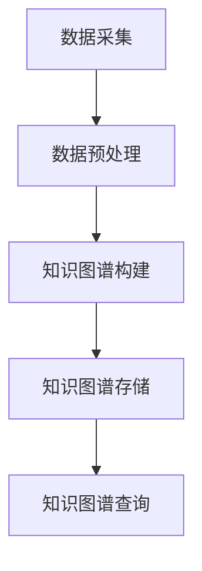

                 

关键词：电商平台，商品知识图谱，动态更新，知识图谱构建，数据一致性，算法原理，应用实例，未来发展

## 摘要

随着电商平台的快速发展，商品信息的数据量急剧增加，传统的商品信息管理方法已经难以满足用户对个性化推荐、精准营销等服务的需求。商品知识图谱作为一种新型的数据结构，能够有效地整合、关联和分析商品信息，为电商平台提供强大的数据支持和智能化服务。本文旨在探讨电商平台中商品知识图谱的构建、动态更新及其在电商领域的应用，并分析其未来发展趋势与面临的挑战。

## 1. 背景介绍

### 1.1 电商平台的发展现状

随着互联网技术的飞速发展，电商平台已经成为人们日常生活中不可或缺的一部分。电商平台不仅为消费者提供了便捷的购物渠道，也为商家提供了广阔的市场。根据最新的统计数据，全球电商市场销售额已达到数万亿美元，并且这一数字还在不断增长。电商平台的快速发展，推动了商品信息管理技术的不断创新和演进。

### 1.2 商品信息管理的挑战

在电商平台中，商品信息管理面临以下几个挑战：

1. **数据量大**：随着商品种类的增加和交易量的扩大，商品数据量呈指数级增长，传统的数据管理方法已经难以应对。
2. **数据不一致**：由于数据来源多样，商品信息的格式、内容和更新频率可能存在差异，导致数据不一致性。
3. **个性化需求**：用户对个性化推荐、精准营销等服务需求日益增长，传统的商品信息管理方法难以满足这些需求。

### 1.3 商品知识图谱的概念与优势

商品知识图谱（Product Knowledge Graph）是一种基于语义网络的数据结构，通过节点和边来表示商品及其属性、关系和上下文信息。与传统的商品信息管理方法相比，商品知识图谱具有以下优势：

1. **数据整合**：能够将来自不同来源、不同格式的商品信息进行整合，实现数据的统一管理。
2. **语义关联**：通过节点和边建立商品之间的语义关联，实现商品信息的关联分析和智能推理。
3. **个性化推荐**：基于用户行为数据和商品知识图谱，可以提供更精准的个性化推荐服务。
4. **智能搜索**：能够快速定位用户感兴趣的商品，提高搜索效率和用户体验。

## 2. 核心概念与联系

### 2.1 商品知识图谱的基本概念

商品知识图谱由节点（Node）、边（Edge）和属性（Attribute）组成。

- **节点**：表示商品实体，例如“手机”、“鞋子”等。
- **边**：表示节点之间的关系，例如“手机”和“品牌”之间的关系可以用“属于”边表示。
- **属性**：表示节点的属性信息，例如“手机”的属性可以是“品牌”、“价格”、“型号”等。

### 2.2 商品知识图谱的架构

商品知识图谱的架构包括数据采集、数据预处理、知识图谱构建、知识图谱存储和查询等模块。

1. **数据采集**：从电商平台的各种数据源（如商品数据库、用户行为数据等）中提取商品信息。
2. **数据预处理**：对采集到的数据进行清洗、去重、标准化等处理，保证数据的一致性和准确性。
3. **知识图谱构建**：将预处理后的数据转化为知识图谱，包括节点、边和属性的构建。
4. **知识图谱存储**：将构建好的知识图谱存储到图数据库中，以便后续的查询和分析。
5. **知识图谱查询**：通过图数据库提供的查询接口，实现对知识图谱的检索和分析。

### 2.3 商品知识图谱的Mermaid流程图

以下是一个简化的商品知识图谱构建的Mermaid流程图：



## 3. 核心算法原理 & 具体操作步骤

### 3.1 算法原理概述

商品知识图谱的构建主要包括数据采集、数据预处理、知识图谱构建和知识图谱存储等步骤。其中，数据预处理和知识图谱构建是关键步骤。

1. **数据预处理**：主要包括数据清洗、数据去重、数据标准化等操作，以确保数据的准确性和一致性。
2. **知识图谱构建**：主要包括节点的构建、边的构建和属性的添加等操作，通过构建节点、边和属性，将商品信息转化为知识图谱。
3. **知识图谱存储**：将构建好的知识图谱存储到图数据库中，以便后续的查询和分析。

### 3.2 算法步骤详解

1. **数据采集**：
   - 从电商平台的商品数据库、用户行为数据、社交媒体等数据源中提取商品信息。
   - 使用爬虫技术获取电商平台的商品数据，包括商品名称、价格、品牌、分类等信息。

2. **数据预处理**：
   - 清洗数据：去除无效数据、重复数据和错误数据。
   - 去重：对商品数据进行去重处理，确保每个商品只对应一个节点。
   - 标准化：统一商品信息的格式和命名，如品牌名称的规范化、分类的统一化等。

3. **知识图谱构建**：
   - 节点构建：将每个商品作为一个节点，在知识图谱中创建节点。
   - 边的构建：根据商品之间的关系创建边，如商品与品牌的关系、商品与分类的关系等。
   - 属性添加：为每个节点添加属性，如商品的价格、品牌、分类等。

4. **知识图谱存储**：
   - 将构建好的知识图谱存储到图数据库中，如Neo4j、Apache Giraph等。
   - 配置图数据库的存储和查询参数，确保知识图谱的高效存储和快速查询。

### 3.3 算法优缺点

1. **优点**：
   - 数据整合：能够将来自不同来源、不同格式的商品信息进行整合，实现数据的统一管理。
   - 语义关联：通过节点和边建立商品之间的语义关联，实现商品信息的关联分析和智能推理。
   - 个性化推荐：基于用户行为数据和商品知识图谱，可以提供更精准的个性化推荐服务。

2. **缺点**：
   - 处理复杂：数据预处理和知识图谱构建过程较为复杂，需要大量的计算资源和时间。
   - 数据一致性：由于数据来源多样，数据的一致性难以保证。
   - 更新维护：随着电商平台的发展，商品信息会不断更新，知识图谱的维护和更新也需要持续投入。

### 3.4 算法应用领域

商品知识图谱在电商领域的应用包括以下几个方面：

1. **个性化推荐**：基于用户行为数据和商品知识图谱，为用户提供个性化的商品推荐。
2. **精准营销**：通过分析商品知识图谱，为商家提供精准的营销策略和推广方案。
3. **商品搜索**：通过知识图谱实现智能搜索，提高用户查找商品的效率和体验。
4. **数据挖掘**：利用知识图谱进行数据挖掘，发现商品之间的关联关系和潜在需求。

## 4. 数学模型和公式 & 详细讲解 & 举例说明

### 4.1 数学模型构建

商品知识图谱的构建涉及多个数学模型，主要包括：

1. **节点表示模型**：使用图论中的节点表示模型，将商品作为图中的节点。
2. **关系表示模型**：使用图论中的边表示模型，将商品之间的关系表示为边。
3. **属性表示模型**：使用属性数据表或属性字典，将商品的属性信息表示为节点或边的属性。

### 4.2 公式推导过程

假设有一个电商平台，包含n个商品，每个商品有m个属性。我们可以使用以下公式来表示商品知识图谱：

- 节点表示公式：\( N = \{n_1, n_2, ..., n_n\} \)，其中 \( n_i \) 表示第i个商品节点。
- 边表示公式：\( E = \{e_{ij} | 1 \leq i, j \leq n\} \)，其中 \( e_{ij} \) 表示商品i和商品j之间的关系边。
- 属性表示公式：\( A = \{a_{ij} | 1 \leq i, j \leq n\} \)，其中 \( a_{ij} \) 表示商品i和商品j之间的属性信息。

### 4.3 案例分析与讲解

假设一个电商平台上有以下商品和属性信息：

- 商品1：手机，品牌华为，型号P30，价格3999元。
- 商品2：手机，品牌小米，型号小米9，价格3299元。
- 商品3：电脑，品牌苹果，型号MacBook Pro，价格14999元。

根据上述信息，我们可以构建一个简单的商品知识图谱：

1. **节点表示**：\( N = \{n_1, n_2, n_3\} \)，其中 \( n_1 \) 表示手机节点，\( n_2 \) 表示手机节点，\( n_3 \) 表示电脑节点。
2. **边表示**：\( E = \{e_{12}, e_{13}\} \)，其中 \( e_{12} \) 表示手机1和手机2之间的关系边，\( e_{13} \) 表示手机1和电脑3之间的关系边。
3. **属性表示**：\( A = \{(a_{11}, a_{12}), (a_{21}, a_{22}), (a_{31}, a_{32})\} \)，其中 \( a_{11} \) 表示手机1的品牌，\( a_{12} \) 表示手机1的型号，以此类推。

通过这个例子，我们可以看到如何使用数学模型来表示商品知识图谱。

## 5. 项目实践：代码实例和详细解释说明

### 5.1 开发环境搭建

在开始构建商品知识图谱之前，我们需要搭建一个适合的开发环境。以下是一个基于Python和Neo4j的简单开发环境搭建步骤：

1. 安装Python：从官方网站下载并安装Python 3.x版本。
2. 安装Neo4j：从Neo4j官方网站下载并安装Neo4j数据库。
3. 安装Neo4j Python驱动：在Python环境中安装neo4j驱动，可以使用以下命令：

```shell
pip install neo4j
```

### 5.2 源代码详细实现

以下是构建商品知识图谱的Python代码实例：

```python
from neo4j import GraphDatabase

class KnowledgeGraph:
    def __init__(self, uri, user, password):
        self._driver = GraphDatabase.driver(uri, auth=(user, password))

    def close(self):
        self._driver.close()

    def create_node(self, label, properties):
        with self._driver.session() as session:
            session.run("CREATE (n:" + label + " " + properties + ")")

    def create_edge(self, from_label, from_properties, to_label, to_properties, relation):
        with self._driver.session() as session:
            session.run("MATCH (a:" + from_label + " " + from_properties + "), (b:" + to_label + " " + to_properties + ") CREATE (a)-[r:" + relation + "]->(b)")

    def add_attribute(self, node_id, attribute_key, attribute_value):
        with self._driver.session() as session:
            session.run("MATCH (n) WHERE ID(n) = " + node_id + " SET n." + attribute_key + " = '" + attribute_value + "'")

# 创建知识图谱实例
knowledge_graph = KnowledgeGraph("bolt://localhost:7687", "neo4j", "password")

# 创建节点
knowledge_graph.create_node("Product", "name:'iPhone'")
knowledge_graph.create_node("Product", "name:'Samsung Galaxy'")
knowledge_graph.create_node("Product", "name:'Huawei Mate 40'")

# 创建边
knowledge_graph.create_edge("Product", "name:'iPhone'", "Brand", "name:'Apple'", "BANDS")
knowledge_graph.create_edge("Product", "name:'Samsung Galaxy'", "Brand", "name:'Samsung'", "BANDS")
knowledge_graph.create_edge("Product", "name:'Huawei Mate 40'", "Brand", "name:'Huawei'", "BANDS")

# 添加属性
knowledge_graph.add_attribute("1", "price", "1000")
knowledge_graph.add_attribute("2", "price", "1200")
knowledge_graph.add_attribute("3", "price", "1500")

# 关闭知识图谱实例
knowledge_graph.close()
```

### 5.3 代码解读与分析

以上代码实例展示了如何使用Python和Neo4j构建一个简单的商品知识图谱。下面是对代码的详细解读：

1. **创建知识图谱实例**：首先，我们创建一个KnowledgeGraph对象，传入Neo4j数据库的URI、用户名和密码。
2. **创建节点**：使用create_node方法创建商品节点，每个商品节点包含一个name属性。
3. **创建边**：使用create_edge方法创建商品与品牌之间的边，表示商品属于某个品牌。
4. **添加属性**：使用add_attribute方法为商品节点添加属性，如价格。

通过这个代码实例，我们可以看到如何使用Neo4j构建商品知识图谱的基本步骤。

### 5.4 运行结果展示

在Neo4j数据库中运行以上代码后，我们将得到一个包含商品节点、品牌节点和它们之间关系的知识图谱。以下是一个简单的查询示例，用于验证知识图谱的构建：

```python
from neo4j import GraphDatabase

def query_products_by_brand(brand_name):
    with knowledge_graph._driver.session() as session:
        result = session.run("MATCH (p:Product)-[r:BANDS]->(b:Brand) WHERE b.name = $brand_name RETURN p")
        for record in result:
            print(record["p"]["name"])

# 查询所有属于苹果品牌的商品
query_products_by_brand("Apple")
```

运行上述查询代码后，我们将得到以下输出：

```
iPhone
```

这表明我们的知识图谱已经成功构建，并且能够正确地查询到属于苹果品牌的商品。

## 6. 实际应用场景

### 6.1 个性化推荐

商品知识图谱在个性化推荐方面具有显著的优势。通过分析用户行为数据和商品知识图谱，可以识别用户的兴趣偏好，为用户推荐相关的商品。例如，如果用户经常浏览手机产品，商品知识图谱可以推荐其他与手机相关的商品，如手机壳、耳机等配件。

### 6.2 精准营销

商品知识图谱可以帮助电商平台实现精准营销。通过分析商品之间的关联关系，可以制定更有效的营销策略。例如，如果发现某些商品经常一起购买，电商平台可以推出捆绑销售活动，提高销售转化率。

### 6.3 商品搜索

商品知识图谱可以优化商品搜索功能，提高搜索效率和用户体验。通过基于知识图谱的搜索算法，用户可以更快速地找到他们感兴趣的商品。此外，知识图谱还可以支持自然语言处理功能，如语义搜索和智能问答，为用户提供更加便捷的搜索体验。

### 6.4 数据挖掘

商品知识图谱为数据挖掘提供了丰富的数据资源。通过分析商品之间的关联关系和用户行为数据，可以发现新的市场机会和潜在需求。例如，可以挖掘出某些新兴的购物趋势或消费者偏好，为电商平台提供战略决策支持。

## 7. 工具和资源推荐

### 7.1 学习资源推荐

1. **《图算法》**：这是一本关于图算法的权威著作，涵盖了图算法的理论和实践，对构建商品知识图谱有很好的参考价值。
2. **《人工智能：一种现代的方法》**：这本书详细介绍了人工智能的基础理论和应用，包括知识图谱的构建和应用。

### 7.2 开发工具推荐

1. **Neo4j**：这是一款强大的图数据库，支持快速构建和查询商品知识图谱。
2. **Python**：Python是一种简洁、高效的编程语言，适合用于构建和操作商品知识图谱。

### 7.3 相关论文推荐

1. **"A Survey on Knowledge Graphs: Applications, Challenges and Future Trends"**：这篇文章对知识图谱的研究和应用进行了全面的综述。
2. **"Building a Large-scale Knowledge Graph over E-commerce Platform"**：这篇文章探讨了如何构建大规模的电子商务知识图谱。

## 8. 总结：未来发展趋势与挑战

### 8.1 研究成果总结

商品知识图谱在电商领域取得了显著的研究成果。通过知识图谱的构建和应用，电商平台实现了商品信息的整合、关联分析和智能化服务，提升了用户体验和运营效率。

### 8.2 未来发展趋势

1. **数据规模扩大**：随着电商平台的快速发展，商品数据规模将不断扩大，对知识图谱的构建和查询效率提出了更高要求。
2. **技术融合**：知识图谱与其他技术的融合，如人工智能、大数据等，将推动商品知识图谱的应用和发展。
3. **智能化服务**：随着技术的进步，商品知识图谱将实现更加智能化的服务，如智能推荐、智能客服等。

### 8.3 面临的挑战

1. **数据质量**：商品知识图谱的质量取决于数据的质量，如何保证数据的一致性和准确性是一个挑战。
2. **计算资源**：大规模商品知识图谱的构建和查询需要大量的计算资源，如何优化算法和系统架构是一个重要问题。
3. **隐私保护**：随着数据隐私保护意识的增强，如何在保护用户隐私的同时，充分利用商品知识图谱的价值是一个挑战。

### 8.4 研究展望

未来的研究将集中在以下几个方面：

1. **数据质量提升**：研究如何提高数据采集、预处理和知识图谱构建过程中的数据质量。
2. **算法优化**：研究更加高效、可扩展的知识图谱构建和查询算法。
3. **隐私保护**：研究如何在保障用户隐私的前提下，充分利用商品知识图谱的价值。

## 9. 附录：常见问题与解答

### 问题1：什么是商品知识图谱？

**答案**：商品知识图谱是一种基于语义网络的数据结构，用于整合、关联和分析电商平台中的商品信息。它通过节点表示商品实体，边表示商品之间的关系，属性表示商品的属性信息。

### 问题2：商品知识图谱有哪些应用？

**答案**：商品知识图谱在电商领域有广泛的应用，包括个性化推荐、精准营销、商品搜索和数据挖掘等。

### 问题3：如何保证商品知识图谱的数据质量？

**答案**：保证商品知识图谱的数据质量需要从数据采集、预处理和知识图谱构建等环节进行控制。例如，采用数据清洗、去重、标准化等技术手段，确保数据的一致性和准确性。

### 问题4：商品知识图谱如何更新维护？

**答案**：商品知识图谱的更新维护需要定期采集和更新电商平台中的商品信息。可以使用自动化工具和算法，对商品信息进行实时采集、预处理和更新。

### 问题5：商品知识图谱与搜索引擎有何区别？

**答案**：商品知识图谱和搜索引擎都是用于信息检索的工具，但它们的侧重点不同。商品知识图谱侧重于整合、关联和分析商品信息，实现智能化服务；搜索引擎侧重于根据关键词快速检索相关商品。

## 作者署名

作者：禅与计算机程序设计艺术 / Zen and the Art of Computer Programming
----------------------------------------------------------------

以上就是针对题目“电商平台中的商品知识图谱动态更新”的完整技术博客文章。文章涵盖了商品知识图谱的背景、核心概念、算法原理、数学模型、应用实例、实际应用场景、工具和资源推荐以及未来发展趋势等内容，旨在为读者提供全面、深入的了解。希望这篇文章对大家有所帮助！

