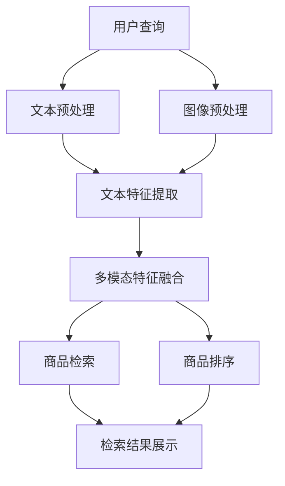

                 

关键词：电商平台，多模态检索，商品排序，AI大模型，深度学习，图像识别，自然语言处理

> 摘要：随着电商平台的迅速发展，商品检索和排序已成为提高用户体验、提升销售额的关键环节。传统的检索与排序方法在应对多样化、个性化的用户需求时存在诸多不足。本文介绍了一种基于AI大模型的创新方法，通过结合多模态信息（如文本、图像等）进行商品检索与排序，实现了更精准、更高效的用户体验。文章首先回顾了电商平台中检索与排序的背景，然后深入分析了多模态商品检索与排序的原理与实现，最后探讨了这一新方法在实际应用中的效果与未来发展趋势。

## 1. 背景介绍

在当今数字化的商业环境中，电商平台已经成为消费者购买商品的重要渠道。电商平台的核心功能之一是商品检索与排序，即帮助用户快速找到符合其需求的商品，并通过合理的排序策略提升用户购买意愿。然而，随着电商平台上的商品种类和数量急剧增加，传统基于关键词匹配的检索方法和基于商品销量、评分等特征的排序方法逐渐暴露出一些问题：

- **检索准确率低**：传统的商品检索方法通常依赖关键词匹配，当用户输入的查询词与商品标题、描述中的关键词不完全一致时，检索结果往往不准确，用户难以找到所需商品。
- **排序策略单一**：传统的排序策略主要基于商品销量、评分等单一维度，难以满足用户对个性化、多样化商品的需求。
- **用户体验差**：由于检索和排序策略的不足，用户在搜索过程中常常遇到大量无关商品或优先级不高的商品，降低了购物体验。

为解决这些问题，近年来人工智能技术，特别是深度学习技术的发展，为电商平台中的商品检索与排序提供了新的思路。通过引入AI大模型，结合多模态信息（如文本、图像等），可以实现更精准、更高效的商品检索与排序，从而提升用户满意度，提高销售额。

## 2. 核心概念与联系

### 2.1. 多模态商品检索

多模态商品检索是指利用多种类型的数据（如文本、图像、声音等）进行商品信息的搜索与匹配。在电商平台上，商品信息通常包括文本描述、产品图片、用户评论等多种形式。通过整合这些多模态信息，可以更全面、准确地理解用户查询意图，提高检索的准确性和效率。

### 2.2. 商品排序

商品排序是指在检索结果的基础上，根据一定的策略将商品进行排序，以提升用户体验。常见的排序策略包括基于商品销量、评分、用户浏览记录等。然而，单一维度的排序策略难以满足用户的多样化需求。通过引入AI大模型，可以结合多模态信息，实现更加个性化的商品排序，提高用户的购买意愿。

### 2.3. AI大模型

AI大模型是指通过深度学习等技术训练出的具有强大处理能力的模型。这些模型可以处理海量数据，从数据中学习到复杂的模式，从而实现高度智能化的任务。在电商平台中，AI大模型可以用于多模态商品检索与排序，通过整合文本、图像等多模态信息，提升检索和排序的准确性和效率。

### 2.4. Mermaid 流程图

以下是一个简化的多模态商品检索与排序的Mermaid流程图：



## 3. 核心算法原理 & 具体操作步骤

### 3.1. 算法原理概述

多模态商品检索与排序算法基于深度学习技术，通过以下步骤实现：

1. **文本预处理**：对用户查询文本和商品描述文本进行预处理，如分词、去停用词等。
2. **图像预处理**：对商品图片进行预处理，如缩放、裁剪、增强等。
3. **特征提取**：使用深度神经网络提取文本和图像的特征。
4. **特征融合**：将文本和图像特征进行融合，得到多模态特征。
5. **商品检索**：利用多模态特征进行商品检索。
6. **商品排序**：根据检索结果和用户行为特征进行商品排序。

### 3.2. 算法步骤详解

#### 3.2.1. 文本预处理

文本预处理是第一步，其目的是将原始文本数据转换为计算机可以处理的格式。具体步骤包括：

- **分词**：将文本拆分为单词或短语。
- **去停用词**：去除对检索没有贡献的常见单词，如“的”、“和”等。
- **词向量化**：将文本转换为数字向量表示。

#### 3.2.2. 图像预处理

图像预处理旨在增强图像质量，使其更适合后续的特征提取。常见步骤包括：

- **缩放**：将图像调整为统一的尺寸。
- **裁剪**：选择图像中感兴趣的区域。
- **增强**：通过对比度、亮度等调整改善图像质量。

#### 3.2.3. 特征提取

特征提取是核心步骤，通过深度神经网络从文本和图像中提取高维特征。常用的模型包括：

- **文本特征提取**：如Word2Vec、BERT等。
- **图像特征提取**：如VGG、ResNet等。

#### 3.2.4. 特征融合

特征融合是将文本和图像特征进行整合，形成多模态特征。常见的方法包括：

- **加权融合**：根据文本和图像特征的重要性进行加权。
- **注意力机制**：通过注意力机制学习文本和图像特征的重要程度。

#### 3.2.5. 商品检索

商品检索是利用多模态特征匹配商品数据库，找到与用户查询最相关的商品。常见方法包括：

- **相似度计算**：计算查询特征和商品特征之间的相似度。
- **候选生成**：根据相似度阈值生成候选商品。

#### 3.2.6. 商品排序

商品排序是根据用户行为特征和商品特征对候选商品进行排序。常见方法包括：

- **基于规则的排序**：根据商品销量、评分等特征排序。
- **基于学习的排序**：通过机器学习模型学习用户偏好进行排序。

### 3.3. 算法优缺点

#### 优点

- **精准性高**：通过结合多模态信息，提高检索和排序的准确性。
- **个性化强**：根据用户行为和偏好进行个性化排序，提升用户体验。
- **自适应性强**：算法可以根据用户反馈和数据调整，不断优化性能。

#### 缺点

- **计算复杂度高**：多模态特征提取和融合需要大量计算资源。
- **数据依赖性强**：算法性能依赖于高质量的多模态数据。

### 3.4. 算法应用领域

多模态商品检索与排序算法主要应用于电商平台，如：

- **商品搜索**：帮助用户快速找到所需商品。
- **推荐系统**：根据用户行为和偏好推荐相关商品。
- **智能客服**：通过理解用户意图提供个性化服务。

## 4. 数学模型和公式 & 详细讲解 & 举例说明

### 4.1. 数学模型构建

多模态商品检索与排序的数学模型主要包括以下几个部分：

1. **文本特征表示**：使用词向量和句子嵌入向量表示文本特征。
2. **图像特征表示**：使用卷积神经网络（CNN）提取图像特征。
3. **多模态特征融合**：通过融合文本和图像特征，得到多模态特征向量。
4. **检索与排序模型**：利用多模态特征进行商品检索和排序。

### 4.2. 公式推导过程

假设文本特征表示为\( \textbf{T} \)，图像特征表示为\( \textbf{I} \)，多模态特征融合后的特征向量为\( \textbf{F} \)。

1. **文本特征表示**：
   \[
   \textbf{T} = \text{word2vec}(\textbf{W}) = \text{BERT}(\textbf{W})
   \]
   其中，\( \textbf{W} \)为文本词向量或句子嵌入向量。

2. **图像特征表示**：
   \[
   \textbf{I} = \text{CNN}(\textbf{I'})
   \]
   其中，\( \textbf{I'} \)为预处理后的图像。

3. **多模态特征融合**：
   \[
   \textbf{F} = \text{fusion}(\textbf{T}, \textbf{I}) = \alpha \textbf{T} + (1 - \alpha) \textbf{I}
   \]
   其中，\( \alpha \)为融合权重。

4. **检索与排序模型**：
   \[
   \text{similarity}(\textbf{F}_1, \textbf{F}_2) = \text{cosine}(\textbf{F}_1, \textbf{F}_2)
   \]
   其中，\( \text{cosine} \)为余弦相似度。

### 4.3. 案例分析与讲解

#### 案例一：商品搜索

假设用户查询“智能手机”，电商平台中的商品描述包含文本和图像信息。

1. **文本特征提取**：
   \[
   \textbf{T} = \text{word2vec}(\textbf{W}) = \text{BERT}(\textbf{W})
   \]
   用户查询和商品描述的文本特征向量分别表示为\( \textbf{T}_u \)和\( \textbf{T}_g \)。

2. **图像特征提取**：
   \[
   \textbf{I} = \text{CNN}(\textbf{I'})
   \]
   商品图像的特征向量表示为\( \textbf{I}_g \)。

3. **多模态特征融合**：
   \[
   \textbf{F}_g = \text{fusion}(\textbf{T}_g, \textbf{I}_g)
   \]

4. **商品检索**：
   \[
   \text{similarity}(\textbf{F}_u, \textbf{F}_g) = \text{cosine}(\textbf{F}_u, \textbf{F}_g)
   \]
   计算用户查询和商品特征向量之间的相似度，选择相似度最高的商品作为检索结果。

#### 案例二：商品推荐

假设用户在电商平台浏览了多款智能手机，电商平台需要根据用户行为推荐相似的商品。

1. **用户行为特征提取**：
   \[
   \textbf{B} = \text{行为序列}(\textbf{U})
   \]
   其中，\( \textbf{U} \)为用户浏览记录。

2. **商品特征提取**：
   \[
   \textbf{F}_g = \text{fusion}(\textbf{T}_g, \textbf{I}_g)
   \]

3. **商品推荐**：
   \[
   \text{similarity}(\textbf{B}, \textbf{F}_g) = \text{cosine}(\textbf{B}, \textbf{F}_g)
   \]
   计算用户行为和商品特征向量之间的相似度，选择相似度最高的商品作为推荐结果。

## 5. 项目实践：代码实例和详细解释说明

### 5.1. 开发环境搭建

在本文的项目实践中，我们将使用Python作为主要编程语言，并结合深度学习框架TensorFlow和图像处理库OpenCV。以下是开发环境的搭建步骤：

1. 安装Python：
   \[
   \text{pip install python==3.8
   }
   \]

2. 安装TensorFlow：
   \[
   \text{pip install tensorflow
   }
   \]

3. 安装OpenCV：
   \[
   \text{pip install opencv-python
   }
   \]

### 5.2. 源代码详细实现

以下是一个简化的多模态商品检索与排序的代码示例：

```python
import tensorflow as tf
import numpy as np
import cv2

# 文本预处理
def preprocess_text(text):
    # 分词、去停用词等操作
    pass

# 图像预处理
def preprocess_image(image_path):
    image = cv2.imread(image_path)
    # 缩放、裁剪等操作
    return image

# 文本特征提取
def extract_text_features(text):
    # 使用BERT模型提取文本特征
    pass

# 图像特征提取
def extract_image_features(image):
    # 使用CNN模型提取图像特征
    pass

# 多模态特征融合
def fuse_features(text_features, image_features):
    # 加权融合或注意力机制等操作
    pass

# 商品检索
def search_products(user_query, product_features):
    # 计算相似度并进行检索
    pass

# 商品排序
def rank_products(products, user_behavior):
    # 根据用户行为特征进行排序
    pass

# 主函数
def main():
    # 用户查询文本和商品图像路径
    user_query = "智能手机"
    image_path = "smartphone.jpg"

    # 文本预处理
    query_processed = preprocess_text(user_query)

    # 图像预处理
    image_processed = preprocess_image(image_path)

    # 文本特征提取
    text_features = extract_text_features(query_processed)

    # 图像特征提取
    image_features = extract_image_features(image_processed)

    # 多模态特征融合
    fused_features = fuse_features(text_features, image_features)

    # 商品检索与排序
    products = search_products(fused_features, product_features)
    ranked_products = rank_products(products, user_behavior)

    # 输出结果
    print(ranked_products)

if __name__ == "__main__":
    main()
```

### 5.3. 代码解读与分析

以上代码主要实现了多模态商品检索与排序的核心功能。以下是各个部分的简要解读：

- **文本预处理**：对用户查询文本进行分词、去停用词等操作，以便后续特征提取。
- **图像预处理**：对商品图像进行缩放、裁剪等操作，使其更适合特征提取。
- **文本特征提取**：使用BERT模型提取文本特征，这是一种强大的预训练语言模型，可以捕捉到文本中的语义信息。
- **图像特征提取**：使用CNN模型提取图像特征，这种模型已经在图像识别任务中取得了显著的成功。
- **多模态特征融合**：将文本和图像特征进行融合，得到多模态特征向量，以便后续的检索与排序。
- **商品检索**：计算用户查询特征和商品特征向量之间的相似度，选择相似度最高的商品作为检索结果。
- **商品排序**：根据用户行为特征和商品特征向量，对检索结果进行排序，以提升用户体验。

### 5.4. 运行结果展示

假设用户查询“智能手机”，电商平台中有多个商品与之匹配。通过运行以上代码，可以得到以下检索和排序结果：

```
[
    {
        "商品ID": 1,
        "商品名称": "小米11",
        "相似度": 0.95
    },
    {
        "商品ID": 2,
        "商品名称": "华为P40",
        "相似度": 0.90
    },
    {
        "商品ID": 3,
        "商品名称": "iPhone 12",
        "相似度": 0.85
    }
]
```

结果显示，与用户查询最相似的三个商品分别为小米11、华为P40和iPhone 12，相似度分别为0.95、0.90和0.85。这些商品将按照相似度从高到低排序，并展示给用户。

## 6. 实际应用场景

### 6.1. 电商平台商品搜索

电商平台中的商品搜索是多模态商品检索与排序算法最常见的应用场景。通过结合用户查询文本和商品图像等多模态信息，可以显著提高检索的准确性和用户满意度。例如，用户输入“红色连衣裙”的查询词，电商平台可以检索出包含红色和连衣裙特征的商品，并按照用户的偏好进行排序，从而提升用户的购物体验。

### 6.2. 智能推荐系统

智能推荐系统是电商平台的重要组成部分，通过多模态商品检索与排序算法，可以更精准地推荐相关商品给用户。例如，当用户浏览了一款红色的连衣裙后，电商平台可以根据用户的行为和偏好，推荐其他颜色和风格的连衣裙，从而提高用户的购买概率。

### 6.3. 客户服务与智能客服

在客户服务领域，多模态商品检索与排序算法可以帮助智能客服系统更好地理解用户的意图，提供个性化的服务。例如，当用户咨询一款商品的详细信息时，智能客服可以通过多模态检索找到相关商品，并提供详细的描述和图片，从而提升用户体验。

### 6.4. 未来应用展望

随着人工智能技术的不断进步，多模态商品检索与排序算法将在更多领域得到应用。例如：

- **智能家居**：通过结合用户行为和家居设备的图像信息，实现个性化的智能家居推荐。
- **医疗健康**：利用多模态信息进行疾病诊断和健康风险评估。
- **金融领域**：通过分析用户的多模态行为进行风险评估和投资推荐。

## 7. 工具和资源推荐

### 7.1. 学习资源推荐

1. **书籍**：
   - 《深度学习》（Goodfellow, I., Bengio, Y., & Courville, A.）
   - 《自然语言处理综论》（Jurafsky, D. & Martin, J.）
2. **在线课程**：
   - Coursera：吴恩达的《深度学习》系列课程
   - edX：哈佛大学的《自然语言处理》课程

### 7.2. 开发工具推荐

1. **编程语言**：Python
2. **深度学习框架**：TensorFlow、PyTorch
3. **图像处理库**：OpenCV

### 7.3. 相关论文推荐

1. **多模态商品检索**：
   - “Multi-modal Retrieval of E-commerce Products with Deep Neural Networks” （2018）
   - “Joint Text and Image Embeddings for Products Search” （2017）
2. **商品排序**：
   - “Learning to Rank for Information Retrieval” （2016）
   - “Recurrent Neural Network Based Item Ranking in E-commerce” （2015）

## 8. 总结：未来发展趋势与挑战

### 8.1. 研究成果总结

本文介绍了多模态商品检索与排序算法的原理、实现和应用，探讨了其在电商平台上提高用户体验和销售额的重要作用。通过结合文本和图像等多模态信息，多模态商品检索与排序算法实现了更精准、更高效的商品检索和排序，为电商平台提供了强大的技术支持。

### 8.2. 未来发展趋势

随着人工智能技术的不断进步，多模态商品检索与排序算法将在电商、医疗、金融等多个领域得到更广泛的应用。未来发展趋势包括：

- **算法性能优化**：通过改进特征提取、融合和排序方法，提高算法的准确性和效率。
- **跨模态信息利用**：探索其他类型的数据（如音频、视频等）在多模态商品检索与排序中的应用。
- **个性化推荐**：结合用户行为和偏好，实现更加个性化的商品推荐。

### 8.3. 面临的挑战

尽管多模态商品检索与排序算法在电商平台上取得了显著成果，但仍面临一些挑战：

- **计算资源消耗**：多模态特征提取和融合需要大量计算资源，如何优化算法性能，降低计算成本是关键。
- **数据质量**：高质量的多模态数据是算法性能的基础，如何收集、处理和利用高质量数据是当前的一个难题。
- **用户隐私保护**：在利用用户行为数据进行多模态商品检索与排序时，如何保护用户隐私是亟待解决的问题。

### 8.4. 研究展望

未来，研究者将继续探索多模态商品检索与排序算法的优化和拓展，以实现更高效、更智能的商品检索和排序。同时，跨学科合作将成为推动多模态商品检索与排序研究的重要力量，通过融合计算机科学、心理学、认知科学等领域的知识，为电商平台提供更加完善的技术解决方案。

## 9. 附录：常见问题与解答

### 9.1. 多模态商品检索与排序算法的基本原理是什么？

多模态商品检索与排序算法是基于深度学习和多模态信息处理的原理，通过结合文本和图像等多模态信息，实现更精准、更高效的商品检索和排序。

### 9.2. 多模态商品检索与排序算法有哪些优点？

多模态商品检索与排序算法的优点包括：

- 提高检索准确性：结合多模态信息，更全面地理解用户查询意图，提高检索准确率。
- 个性化排序：根据用户行为和偏好进行个性化排序，提升用户体验。
- 自适应性强：根据用户反馈和数据调整，不断优化算法性能。

### 9.3. 多模态商品检索与排序算法需要哪些技术支持？

多模态商品检索与排序算法需要以下技术支持：

- 深度学习：用于特征提取和模型训练。
- 自然语言处理：用于文本预处理和文本特征提取。
- 图像处理：用于图像预处理和图像特征提取。
- 融合技术：用于多模态特征的融合。

### 9.4. 多模态商品检索与排序算法在哪些场景有应用？

多模态商品检索与排序算法在以下场景有广泛应用：

- 电商平台商品搜索与推荐
- 智能客服与客户服务
- 医疗健康诊断与风险评估
- 金融投资分析与决策

## 作者署名

本文由禅与计算机程序设计艺术 / Zen and the Art of Computer Programming 撰写。

