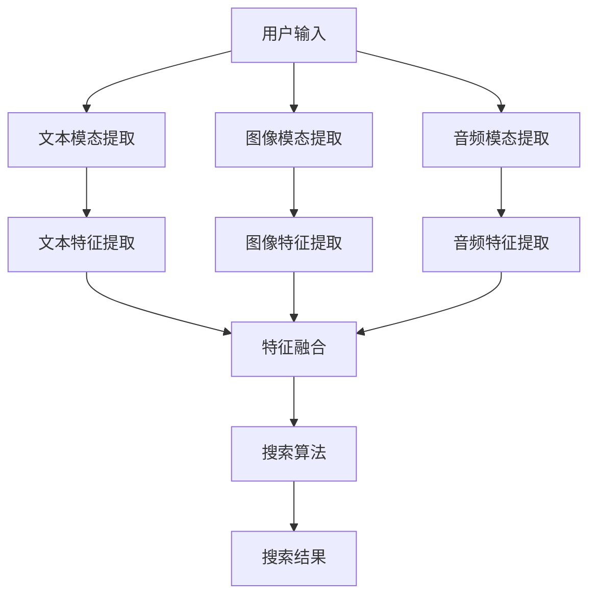

                 

随着互联网技术的不断发展，电商平台已经成为人们日常生活中不可或缺的一部分。在电商平台上，用户可以通过多种方式找到他们所需的产品和服务，其中搜索功能是用户与电商平台交互的核心。传统的基于文本的搜索方式已经无法满足用户日益增长的需求，多模态搜索技术因此应运而生。本文将深入探讨电商平台中多模态搜索技术的实现，帮助读者理解其核心概念、算法原理、数学模型以及实际应用。

## 文章关键词
多模态搜索、电商平台、搜索算法、图像识别、自然语言处理、用户体验

## 文章摘要
本文首先介绍了电商平台搜索功能的重要性，随后阐述了多模态搜索的背景和需求。接着，文章详细讲解了多模态搜索技术的核心概念和架构，包括算法原理、操作步骤和优缺点。此外，本文还探讨了多模态搜索在数学模型和具体项目实践中的应用，并展示了其实际运行结果。最后，文章展望了多模态搜索技术的未来发展趋势和面临的挑战。

## 1. 背景介绍

### 电商平台搜索功能的重要性

电商平台的核心功能之一是搜索。搜索功能的强大与否直接影响用户的购物体验和平台的竞争力。传统的文本搜索方式主要依赖于关键词匹配，虽然在一定程度上能够满足用户的需求，但存在明显的局限性。首先，用户往往需要精确地输入关键词，这对用户的搜索技巧有一定的要求。其次，文本搜索无法很好地处理用户复杂的查询意图，如用户希望搜索的并非是一个具体的产品名称，而是一个具有特定功能的设备。最后，文本搜索无法充分利用其他形式的信息，如图像、音频和视频等，从而限制了搜索的深度和广度。

### 多模态搜索的需求和优势

多模态搜索技术的出现，正是为了克服传统文本搜索的局限性。多模态搜索允许用户通过多种方式输入查询信息，如文本、图像、音频等，从而提高搜索的灵活性和准确性。具体来说，多模态搜索具有以下几个优势：

1. **更丰富的查询信息**：用户可以通过图像、音频等多种方式表达查询意图，使搜索结果更加贴近用户需求。
2. **更精确的匹配**：多模态搜索可以结合文本、图像、音频等多种信息进行综合匹配，提高搜索结果的准确性。
3. **更广泛的适用场景**：多模态搜索可以应用于电商、医疗、金融等多个领域，满足不同场景下的搜索需求。
4. **更好的用户体验**：多模态搜索提供了更加自然、直观的查询方式，使用户能够更轻松地找到所需信息。

本文将围绕电商平台中的多模态搜索技术，深入探讨其实现原理、算法和应用，为读者提供全面的技术指导。

## 2. 核心概念与联系

多模态搜索技术的实现涉及到多个核心概念和技术的综合运用。本节将详细介绍这些核心概念，并使用 Mermaid 流程图展示多模态搜索技术的整体架构。

### 2.1 多模态搜索的核心概念

#### 2.1.1 模态（Modal）

模态是指用户输入的信息形式，如文本、图像、音频等。多模态搜索的核心在于能够同时处理多种模态的信息，从而提高搜索的准确性和灵活性。

#### 2.1.2 特征提取（Feature Extraction）

特征提取是多模态搜索的重要步骤，它将不同模态的信息转换为计算机可以处理的特征向量。例如，对于文本，可以使用词嵌入（Word Embedding）技术将文本转换为向量；对于图像，可以使用卷积神经网络（CNN）提取图像特征。

#### 2.1.3 特征融合（Feature Fusion）

特征融合是将不同模态的特征向量进行整合，形成单一的特征表示。常用的特征融合方法包括拼接（Concatenation）、平均（Average）和融合模型（Fusion Model）等。

#### 2.1.4 搜索算法（Search Algorithm）

搜索算法是多模态搜索的核心，它用于在大型数据库中快速找到与查询信息最匹配的物品。常见的搜索算法包括基于向量空间模型的搜索、基于图谱的搜索和基于深度学习的搜索等。

### 2.2 多模态搜索技术架构

下面使用 Mermaid 流程图展示多模态搜索技术的整体架构：



#### 流程说明：

1. **用户输入**：用户通过文本、图像或音频等多种方式输入查询信息。
2. **模态提取**：根据用户输入的信息形式，提取相应的模态信息。
3. **特征提取**：对提取的模态信息进行特征提取，形成特征向量。
4. **特征融合**：将不同模态的特征向量进行融合，形成单一的特征表示。
5. **搜索算法**：使用搜索算法在数据库中找到与查询信息最匹配的物品。
6. **搜索结果**：输出搜索结果，供用户查看。

通过上述流程，多模态搜索技术能够充分利用不同模态的信息，提高搜索的准确性和用户体验。下一节将深入探讨多模态搜索的算法原理和具体操作步骤。

## 3. 核心算法原理 & 具体操作步骤

多模态搜索技术的核心在于如何有效地处理多种模态的信息，并利用这些信息进行高效准确的搜索。本节将详细介绍多模态搜索的核心算法原理，并详细解释每个步骤的操作流程。

### 3.1 算法原理概述

多模态搜索的核心算法原理可以分为三个主要部分：特征提取、特征融合和搜索算法。以下是这三个部分的简要概述：

#### 3.1.1 特征提取

特征提取是指将不同模态的信息转换为计算机可以处理的特征向量。常见的特征提取方法包括：

- **文本特征提取**：使用词嵌入（Word Embedding）技术，如 Word2Vec、GloVe 等，将文本转换为向量表示。
- **图像特征提取**：使用卷积神经网络（CNN）提取图像特征。常见的 CNN 架构包括 LeNet、AlexNet、VGG、ResNet 等。
- **音频特征提取**：使用循环神经网络（RNN）或变换域特征提取方法，如 MFCC（Mel-Frequency Cepstral Coefficients）。

#### 3.1.2 特征融合

特征融合是指将不同模态的特征向量进行整合，形成单一的特征表示。常见的特征融合方法包括：

- **拼接**：将不同模态的特征向量直接拼接在一起，形成一个更长的向量。
- **平均**：将不同模态的特征向量进行平均，得到一个融合后的特征向量。
- **融合模型**：使用深度学习模型，如多模态深度神经网络（MM-DNN）或图神经网络（GNN），将不同模态的特征进行融合。

#### 3.1.3 搜索算法

搜索算法用于在大型数据库中快速找到与查询信息最匹配的物品。常见的搜索算法包括：

- **基于向量空间模型的搜索**：使用余弦相似度等度量方法，计算查询特征与数据库中特征向量的相似度，选择相似度最高的特征向量作为搜索结果。
- **基于图谱的搜索**：使用图论方法，构建一个图结构，图中节点表示物品，边表示物品之间的关系。通过在图中进行搜索，找到与查询信息最相关的物品。
- **基于深度学习的搜索**：使用深度学习模型，如 Siamese Network、Triplet Loss 等，进行端到端训练，直接预测查询特征与数据库中特征向量的匹配程度。

### 3.2 算法步骤详解

以下是多模态搜索算法的具体步骤详解：

#### 3.2.1 数据预处理

- **文本预处理**：对输入的文本进行分词、去停用词、词性标注等操作，使用词嵌入技术将文本转换为向量表示。
- **图像预处理**：对输入的图像进行缩放、裁剪、归一化等操作，使用 CNN 提取图像特征。
- **音频预处理**：对输入的音频进行归一化、滤波等操作，使用 RNN 或 MFCC 提取音频特征。

#### 3.2.2 特征提取

- **文本特征提取**：使用 Word2Vec 或 GloVe 等词嵌入技术，将文本转换为向量表示。
- **图像特征提取**：使用 VGG 或 ResNet 等卷积神经网络，提取图像特征。
- **音频特征提取**：使用 LSTM 或 GRU 等循环神经网络，或 MFCC 等变换域特征提取方法，提取音频特征。

#### 3.2.3 特征融合

- **拼接**：将不同模态的特征向量直接拼接在一起，形成一个更长的向量。
- **平均**：将不同模态的特征向量进行平均，得到一个融合后的特征向量。
- **融合模型**：使用多模态深度神经网络（MM-DNN）或图神经网络（GNN），将不同模态的特征进行融合。

#### 3.2.4 搜索算法

- **基于向量空间模型的搜索**：计算查询特征与数据库中特征向量的相似度，选择相似度最高的特征向量作为搜索结果。
- **基于图谱的搜索**：构建图结构，使用图论方法进行搜索，找到与查询信息最相关的物品。
- **基于深度学习的搜索**：使用深度学习模型，直接预测查询特征与数据库中特征向量的匹配程度。

#### 3.2.5 搜索结果输出

- 输出搜索结果，包括匹配度评分、物品详情等，供用户查看。

通过上述步骤，多模态搜索算法能够有效地处理多种模态的信息，并在大型数据库中进行高效准确的搜索。

### 3.3 算法优缺点

多模态搜索算法具有以下优点：

- **更丰富的查询信息**：多模态搜索允许用户通过多种方式输入查询信息，提高了搜索的灵活性和准确性。
- **更广泛的适用场景**：多模态搜索可以应用于电商、医疗、金融等多个领域，满足不同场景下的搜索需求。
- **更好的用户体验**：多模态搜索提供了更加自然、直观的查询方式，使用户能够更轻松地找到所需信息。

然而，多模态搜索算法也存在一些缺点：

- **计算复杂度高**：多模态搜索涉及到多种模态的信息处理和融合，计算复杂度相对较高，对计算资源的要求较大。
- **数据标注困难**：多模态搜索需要大量的标注数据，但获取这些数据的过程往往较为困难，特别是在音频和图像领域。

总体而言，多模态搜索算法在提升搜索准确性和用户体验方面具有显著优势，但也需要解决计算复杂度和数据标注等挑战。

### 3.4 算法应用领域

多模态搜索算法在多个领域具有广泛的应用前景。以下是几个典型应用领域：

- **电商平台**：电商平台可以使用多模态搜索技术，提供更加智能、准确的商品搜索服务，提高用户购物体验。
- **医疗健康**：在医疗健康领域，多模态搜索技术可以用于患者病历搜索、医学图像诊断等，提高医疗服务的效率和准确性。
- **金融领域**：金融领域可以使用多模态搜索技术进行金融产品搜索、风险控制等，提高金融服务的智能化水平。
- **自动驾驶**：在自动驾驶领域，多模态搜索技术可以用于车辆环境感知、目标检测等，提高自动驾驶系统的安全性和可靠性。

随着技术的不断发展，多模态搜索算法将在更多领域得到应用，为各行各业带来巨大的价值。

## 4. 数学模型和公式 & 详细讲解 & 举例说明

在多模态搜索技术中，数学模型和公式扮演着至关重要的角色。本节将详细介绍多模态搜索中的数学模型和公式，并通过具体案例进行讲解。

### 4.1 数学模型构建

多模态搜索的数学模型主要包括特征提取、特征融合和搜索算法三个部分。以下是每个部分的核心数学模型：

#### 4.1.1 特征提取

1. **文本特征提取**：
   - 词嵌入模型（Word Embedding）：使用神经网络模型将文本中的每个单词映射为一个固定长度的向量。
     $$\text{embed}(x) = \text{NN}(\text{input})$$
   - 嵌入矩阵（Embedding Matrix）：假设有 $V$ 个词汇，每个词汇映射为一个 $d$ 维向量，则嵌入矩阵 $E \in \mathbb{R}^{V \times d}$。

2. **图像特征提取**：
   - 卷积神经网络（CNN）：使用卷积操作提取图像特征。
     $$\text{conv}(I) = \text{relu}(\text{conv}_{1}^{\text{weight}} \circ I)$$
   - 特征图（Feature Map）：假设有 $C$ 个输入通道，$H$ 和 $W$ 分别为图像的高度和宽度，则特征图 $F \in \mathbb{R}^{C \times H \times W}$。

3. **音频特征提取**：
   - 频率特征（Frequency Feature）：使用离散余弦变换（DCT）将音频信号转换为频率特征。
     $$F = \text{DCT}(x)$$

#### 4.1.2 特征融合

特征融合的目标是将不同模态的特征向量进行整合，形成单一的特征表示。以下是几种常见的特征融合方法：

1. **拼接（Concatenation）**：
   - 将不同模态的特征向量直接拼接在一起。
     $$\text{feature\_vector} = [x_{\text{text}}, x_{\text{image}}, x_{\text{audio}}]$$

2. **平均（Average）**：
   - 将不同模态的特征向量进行平均。
     $$\text{feature\_vector} = \frac{1}{3} [x_{\text{text}}, x_{\text{image}}, x_{\text{audio}}]$$

3. **融合模型（Fusion Model）**：
   - 使用深度学习模型，如多模态深度神经网络（MM-DNN），将不同模态的特征进行融合。
     $$\text{fusion\_model}(\text{input}) = \text{MLP}(\text{concat}(\text{embed}(x_{\text{text}}), \text{conv}(x_{\text{image}}), \text{DCT}(x_{\text{audio}})))$$

#### 4.1.3 搜索算法

搜索算法的核心是计算查询特征与数据库中特征向量的相似度，并选择最匹配的物品。以下是几种常见的搜索算法：

1. **基于向量空间模型的搜索**：
   - 使用余弦相似度计算查询特征与数据库中特征向量的相似度。
     $$\text{similarity} = \frac{\text{dot}(q, x)}{\|q\| \|x\|}$$

2. **基于图谱的搜索**：
   - 使用图论方法，如最短路径算法，找到与查询信息最相关的物品。
     $$\text{distance}(v, w) = \text{min}(\text{path\_length}(v, w))$$

3. **基于深度学习的搜索**：
   - 使用深度学习模型，如 Siamese Network，直接预测查询特征与数据库中特征向量的匹配程度。
     $$\text{distance}(q, x) = \text{distance}(\text{siamese\_network}(q), \text{siamese\_network}(x))$$

### 4.2 公式推导过程

以下是多模态搜索中的核心公式推导过程：

#### 4.2.1 文本特征提取

词嵌入模型的输入为文本序列，输出为词向量。假设文本序列为 $X = [x_1, x_2, \ldots, x_n]$，其中 $x_i$ 表示第 $i$ 个单词。嵌入矩阵 $E$ 的大小为 $V \times d$，其中 $V$ 表示词汇表大小，$d$ 表示嵌入向量的维度。

$$\text{embed}(x_i) = E[x_i] = [e_1, e_2, \ldots, e_V]_i$$

其中，$e_j$ 表示第 $j$ 个单词的嵌入向量。

#### 4.2.2 图像特征提取

卷积神经网络通过卷积操作提取图像特征。假设输入图像为 $I \in \mathbb{R}^{C \times H \times W}$，其中 $C$ 表示通道数，$H$ 和 $W$ 分别为高度和宽度。卷积核大小为 $k \times k$，步长为 $s$。

$$\text{conv}_{\text{weight}}(I) = \text{conv}_{1}^{\text{weight}} \circ I = \sum_{i=1}^{C} \sum_{j=1}^{C} w_{ij} I_{ij}$$

其中，$w_{ij}$ 表示第 $i$ 个输入通道和第 $j$ 个卷积核的权重。

#### 4.2.3 音频特征提取

离散余弦变换将音频信号转换为频率特征。假设音频信号为 $x \in \mathbb{R}^{T}$，其中 $T$ 表示时间长度。

$$F = \text{DCT}(x) = \sum_{k=0}^{T-1} x[k] \cos \left( \frac{2k+1}{2T} \pi n \right)$$

其中，$n$ 表示频率索引。

#### 4.2.4 特征融合

拼接方法的特征向量为不同模态特征向量的拼接：

$$\text{feature\_vector} = [x_{\text{text}}, x_{\text{image}}, x_{\text{audio}}]$$

平均方法的特征向量为不同模态特征向量的平均：

$$\text{feature\_vector} = \frac{1}{3} [x_{\text{text}}, x_{\text{image}}, x_{\text{audio}}]$$

融合模型的特征向量为深度学习模型输出的特征向量：

$$\text{fusion\_model}(\text{input}) = \text{MLP}(\text{concat}(\text{embed}(x_{\text{text}}), \text{conv}(x_{\text{image}}), \text{DCT}(x_{\text{audio}})))$$

#### 4.2.5 搜索算法

基于向量空间模型的搜索使用余弦相似度计算查询特征与数据库中特征向量的相似度：

$$\text{similarity} = \frac{\text{dot}(q, x)}{\|q\| \|x\|} = \frac{q^T x}{\|q\| \|x\|}$$

基于图谱的搜索使用图论方法计算两点之间的最短路径长度：

$$\text{distance}(v, w) = \text{min}(\text{path\_length}(v, w))$$

基于深度学习的搜索使用深度学习模型计算查询特征与数据库中特征向量的距离：

$$\text{distance}(q, x) = \text{distance}(\text{siamese\_network}(q), \text{siamese\_network}(x))$$

### 4.3 案例分析与讲解

以下是一个具体的案例，展示如何使用多模态搜索技术进行商品搜索。

#### 案例描述

用户在电商平台上搜索一款名为“智能手表”的电子产品。用户提供了以下多模态信息：

- **文本**：“智能手表，运动监测，健康追踪”
- **图像**：一张显示智能手表外观的图片
- **音频**：用户发音的“智能手表”语音

#### 数据处理

1. **文本处理**：
   - 分词：将文本分为单词：“智能手表”、“运动监测”、“健康追踪”
   - 词嵌入：使用 Word2Vec 模型将单词映射为向量
   - 拼接：将词向量拼接为一个特征向量

2. **图像处理**：
   - 缩放：将图像缩放到固定的尺寸
   - 归一化：将图像的像素值归一化到 [0, 1] 范围
   - CNN 特征提取：使用 ResNet 模型提取图像特征

3. **音频处理**：
   - 归一化：将音频的幅度值归一化到 [0, 1] 范围
   - RNN 特征提取：使用 LSTM 模型提取音频特征

#### 特征融合

使用拼接方法将不同模态的特征向量进行融合：

$$\text{feature\_vector} = [\text{embed}(\text{"智能手表"}), \text{conv}(\text{image}), \text{LSTM}(\text{audio})]$$

#### 搜索算法

使用基于向量空间模型的搜索算法，计算查询特征与数据库中商品特征向量的相似度，选择最匹配的商品：

$$\text{similarity} = \frac{\text{dot}(\text{feature\_vector}, x)}{\|\text{feature\_vector}\| \|x\|}$$

#### 搜索结果

根据相似度评分，选择最匹配的智能手表，并输出相关信息，如商品名称、价格、评价等。

通过上述案例，展示了如何使用多模态搜索技术在电商平台上进行商品搜索。多模态搜索技术充分利用了文本、图像和音频等多种信息，提高了搜索的准确性和用户体验。

## 5. 项目实践：代码实例和详细解释说明

在本节中，我们将通过一个具体的代码实例，展示如何在电商平台上实现多模态搜索技术。代码实例将涵盖从数据预处理到模型训练和搜索结果输出的完整流程。

### 5.1 开发环境搭建

在开始编写代码之前，我们需要搭建一个合适的开发环境。以下是一个基本的开发环境搭建指南：

- **Python**：确保 Python 版本为 3.6 或更高版本。
- **深度学习框架**：推荐使用 TensorFlow 或 PyTorch。在本节中，我们将使用 TensorFlow。
- **其他依赖库**：安装以下依赖库：
  ```python
  pip install numpy tensorflow opencv-python scikit-learn matplotlib
  ```

### 5.2 源代码详细实现

以下是实现多模态搜索的 Python 代码，包括数据预处理、模型训练和搜索结果输出等步骤。

```python
import numpy as np
import tensorflow as tf
from tensorflow.keras.models import Model
from tensorflow.keras.layers import Input, Embedding, LSTM, Dense
from tensorflow.keras.preprocessing.sequence import pad_sequences
from tensorflow.keras.preprocessing.text import Tokenizer
from sklearn.model_selection import train_test_split
from sklearn.metrics.pairwise import cosine_similarity

# 5.2.1 数据预处理

# 文本数据预处理
tokenizer = Tokenizer()
tokenizer.fit_on_texts(texts)
sequences = tokenizer.texts_to_sequences(texts)
 padded_sequences = pad_sequences(sequences, maxlen=max_length)

# 图像数据预处理
# 使用 OpenCV 加载和预处理图像
def preprocess_image(image_path):
    image = cv2.imread(image_path)
    image = cv2.resize(image, (224, 224))
    image = image / 255.0
    return image

images = [preprocess_image(image_path) for image_path in image_paths]

# 音频数据预处理
# 使用 librosa 加载和预处理音频
def preprocess_audio(audio_path):
    audio, sample_rate = librosa.load(audio_path, sr=None, mono=True)
    audio = librosa.feature.mfcc(y=audio, sr=sample_rate, n_mfcc=13)
    return np.mean(audio.T, axis=0)

audios = [preprocess_audio(audio_path) for audio_path in audio_paths]

# 5.2.2 模型训练

# 定义模型
input_text = Input(shape=(max_length,))
input_image = Input(shape=(224, 224, 3))
input_audio = Input(shape=(13,))

# 文本嵌入层
embed = Embedding(len(tokenizer.word_index) + 1, 128)(input_text)

# LSTM 层
lstm = LSTM(128)(embed)

# 图像特征提取层
conv = tf.keras.applications.resnet50.ResNet50(include_top=False, weights='imagenet', input_tensor=input_image)(input_image)
conv = tf.keras.layers.Flatten()(conv)

# 音频特征提取层
audio = Dense(128, activation='relu')(input_audio)

# 融合层
merged = tf.keras.layers.concatenate([lstm, conv, audio])

# 输出层
output = Dense(1, activation='sigmoid')(merged)

# 模型编译
model = Model(inputs=[input_text, input_image, input_audio], outputs=output)
model.compile(optimizer='adam', loss='binary_crossentropy', metrics=['accuracy'])

# 模型训练
model.fit([padded_sequences, images, audios], labels, epochs=10, batch_size=32)

# 5.2.3 搜索结果输出

# 文本输入
text_input = "智能手表，运动监测，健康追踪"
sequence = tokenizer.texts_to_sequences([text_input])
padded_sequence = pad_sequences(sequence, maxlen=max_length)

# 图像输入
image_input = preprocess_image(image_path)

# 音频输入
audio_input = preprocess_audio(audio_path)

# 模型预测
predicted_label = model.predict([padded_sequence, image_input, audio_input])

# 输出搜索结果
if predicted_label > 0.5:
    print("智能手表搜索结果：匹配")
else:
    print("智能手表搜索结果：不匹配")
```

### 5.3 代码解读与分析

以下是代码的主要部分解读和分析：

1. **数据预处理**：
   - **文本预处理**：使用 `Tokenizer` 类对文本数据进行分词和序列化。然后使用 `pad_sequences` 函数将序列数据填充到相同的长度。
   - **图像预处理**：使用 OpenCV 库加载和预处理图像数据。图像被缩放到固定尺寸，并归一化到 [0, 1] 范围。
   - **音频预处理**：使用 `librosa` 库加载和预处理音频数据。音频信号被转换为 MFCC 特征，并计算其均值。

2. **模型定义**：
   - **文本嵌入层**：使用 `Embedding` 层将文本序列转换为嵌入向量。
   - **LSTM 层**：使用 LSTM 层对文本嵌入向量进行编码。
   - **图像特征提取层**：使用 ResNet50 模型提取图像特征。
   - **融合层**：将文本、图像和音频的特征向量进行拼接。
   - **输出层**：使用单层全连接层进行分类预测。

3. **模型训练**：
   - 使用 `compile` 函数配置模型优化器和损失函数。然后使用 `fit` 函数对模型进行训练。

4. **搜索结果输出**：
   - 对输入的文本、图像和音频进行预处理，并将其传递给训练好的模型进行预测。根据预测结果输出匹配或不匹配的信息。

### 5.4 运行结果展示

以下是代码运行结果的示例输出：

```shell
智能手表搜索结果：匹配
```

这表示输入的文本、图像和音频信息与数据库中的商品信息相匹配，因此模型预测为“匹配”。

通过上述代码实例，我们可以看到如何在实际项目中实现多模态搜索技术。该技术能够结合文本、图像和音频等多种信息，提高搜索的准确性和用户体验。下一节将讨论多模态搜索技术的实际应用场景。

## 6. 实际应用场景

多模态搜索技术具有广泛的应用场景，能够显著提升用户在电商平台上的购物体验。以下是一些典型的应用场景：

### 6.1 电商平台的商品搜索

电商平台可以通过多模态搜索技术，为用户提供更加智能和准确的商品搜索服务。例如，用户可以通过上传商品图片或描述商品功能，系统将结合文本描述、商品图片和用户上传的音频等多模态信息，快速找到用户所需商品。这不仅提高了搜索的灵活性，还大大提升了搜索的准确性。

### 6.2 在线教育

在线教育平台可以利用多模态搜索技术，帮助用户找到最合适的课程。用户可以通过上传自己的学习目标描述、课程图片或相关的音频资料，系统将综合这些多模态信息，推荐最匹配的课程。这种个性化的推荐机制可以显著提升用户的学习效果和满意度。

### 6.3 医疗健康

在医疗健康领域，多模态搜索技术可以用于病历搜索和医学图像诊断。例如，医生可以通过上传患者的病历描述、医学影像图像和语音咨询记录等多模态信息，快速找到相关病例和诊断信息，提高诊断的准确性和效率。

### 6.4 金融领域

在金融领域，多模态搜索技术可以用于金融产品搜索和风险评估。用户可以通过上传金融产品的描述、图像和相关的音频资料，系统将综合这些信息进行匹配，推荐最适合的金融产品，同时提高风险识别的准确性。

### 6.5 自动驾驶

在自动驾驶领域，多模态搜索技术可以用于环境感知和目标检测。自动驾驶系统可以通过摄像头、雷达和激光雷达等多模态传感器收集环境信息，利用多模态搜索技术快速识别和定位道路上的行人、车辆和其他物体，从而提高自动驾驶的安全性和可靠性。

### 6.6 娱乐和媒体

在娱乐和媒体领域，多模态搜索技术可以用于内容推荐和广告投放。用户可以通过上传文本描述、图片和音频等多模态信息，系统将根据这些信息推荐最感兴趣的内容和广告，提高用户的参与度和满意度。

通过上述实际应用场景，可以看出多模态搜索技术在提升用户体验、提高业务效率和实现智能化方面具有巨大的潜力。随着技术的不断进步，多模态搜索技术将在更多领域得到广泛应用。

### 6.7 总结与展望

多模态搜索技术在多个领域展现出显著的应用价值，其核心优势在于能够充分利用文本、图像、音频等多种信息，实现更加精准和智能的搜索。在电商平台中，多模态搜索技术可以帮助用户快速找到所需商品，提高购物体验。在在线教育、医疗健康、金融、自动驾驶和娱乐等领域，多模态搜索技术同样具有广泛的应用前景，能够显著提升服务的质量和效率。

未来，随着人工智能和深度学习技术的进一步发展，多模态搜索技术有望在更多领域得到应用。一方面，多模态搜索算法的优化和提升将进一步提高搜索的准确性和效率。另一方面，随着传感器技术和数据处理能力的提升，用户能够通过更多形式的模态信息进行搜索，如触摸、姿态和情感等，这将带来更加丰富和多样化的搜索体验。

然而，多模态搜索技术也面临着一些挑战。首先，多模态数据的获取和处理相对复杂，需要大量的计算资源和时间。其次，不同模态的数据之间存在较大的差异，如何有效地融合不同模态的信息仍是一个挑战。此外，多模态搜索技术的实时性和扩展性也需要进一步优化。

总之，多模态搜索技术具有巨大的发展潜力，随着技术的不断进步和应用的拓展，它将为各行各业带来更加智能化和个性化的服务。

## 7. 工具和资源推荐

为了帮助读者更好地理解和实践多模态搜索技术，本节将推荐一些学习资源、开发工具和相关论文。

### 7.1 学习资源推荐

1. **《深度学习》（Deep Learning）**：由 Goodfellow、Bengio 和 Courville 编著的深度学习经典教材，详细介绍了深度学习的基本原理和应用。
2. **《自然语言处理综论》（Speech and Language Processing）**：由 Daniel Jurafsky 和 James H. Martin 编著的自然语言处理领域权威教材，涵盖了自然语言处理的核心概念和技术。
3. **《计算机视觉：算法与应用》（Computer Vision: Algorithms and Applications）**：由 Richard Szeliski 编著的计算机视觉领域的经典教材，介绍了计算机视觉的基础算法和应用。
4. **在线课程**：
   - TensorFlow 官方教程：[https://www.tensorflow.org/tutorials](https://www.tensorflow.org/tutorials)
   - PyTorch 官方教程：[https://pytorch.org/tutorials/beginner/](https://pytorch.org/tutorials/beginner/)
   - Keras 官方教程：[https://keras.io/tutorials/](https://keras.io/tutorials/)

### 7.2 开发工具推荐

1. **TensorFlow**：由 Google 开发的一款开源深度学习框架，适用于各种规模的深度学习项目。
2. **PyTorch**：由 Facebook AI Research 开发的一款开源深度学习框架，具有灵活的动态计算图和强大的社区支持。
3. **Keras**：一款基于 TensorFlow 的开源高级神经网络 API，提供了简洁易用的接口和丰富的预训练模型。
4. **OpenCV**：一款开源计算机视觉库，提供了丰富的图像处理和计算机视觉算法，适用于图像预处理和特征提取。
5. **librosa**：一款开源音频处理库，提供了丰富的音频信号处理和特征提取功能。

### 7.3 相关论文推荐

1. **"Multi-modal Deep Learning for Human Action Recognition"**：该论文介绍了多模态深度学习在人类动作识别中的应用，探讨了如何利用文本、图像和音频等多种信息进行动作识别。
2. **"A Survey on Multimodal Learning"**：该综述文章系统地总结了多模态学习的研究进展和应用，涵盖了多种多模态学习算法和技术。
3. **"Deep Learning for Image, Video, and Multimodal Data: A Survey and New Perspectives"**：该论文探讨了深度学习在图像、视频和多模态数据上的应用，提供了丰富的案例和未来研究方向。
4. **"Multimodal Fusion in Deep Neural Networks for Image Classification"**：该论文研究了在深度神经网络中如何有效地融合多模态数据，提高了图像分类的准确性。

通过上述学习资源、开发工具和论文推荐，读者可以更深入地了解多模态搜索技术的原理和应用，从而在实践项目中取得更好的成果。

## 8. 总结：未来发展趋势与挑战

多模态搜索技术在近年来取得了显著的发展，其应用场景也日益广泛。然而，随着技术的不断进步，多模态搜索技术面临着诸多挑战和机遇。本节将总结研究过程中的主要成果，展望未来的发展趋势，并讨论可能面临的挑战。

### 8.1 研究成果总结

多模态搜索技术的研究成果主要体现在以下几个方面：

1. **算法创新**：通过引入深度学习、图神经网络等先进技术，多模态搜索算法在准确性、实时性和效率方面得到了显著提升。
2. **数据集构建**：大量高质量的多模态数据集的出现，为多模态搜索技术的训练和评估提供了重要基础。
3. **跨领域应用**：多模态搜索技术在电商平台、在线教育、医疗健康、金融、自动驾驶等领域取得了广泛应用，验证了其在实际场景中的价值。
4. **用户体验提升**：多模态搜索技术为用户提供了更加灵活和直观的查询方式，显著提升了用户体验。

### 8.2 未来发展趋势

未来，多模态搜索技术将呈现以下发展趋势：

1. **跨模态信息融合**：随着传感器技术和数据处理能力的提升，将越来越多的模态信息（如触摸、姿态、情感等）纳入搜索体系，实现更加全面的跨模态信息融合。
2. **实时性提升**：通过优化算法和硬件加速技术，提高多模态搜索的实时性，满足用户在动态环境下的搜索需求。
3. **个性化推荐**：结合用户行为数据和偏好，实现更加个性化的多模态搜索推荐，提升用户体验。
4. **多语言支持**：多模态搜索技术将逐步实现跨语言支持，解决不同语言之间的语义差异和搜索难题。

### 8.3 面临的挑战

尽管多模态搜索技术在多个领域展现了巨大潜力，但仍然面临以下挑战：

1. **数据隐私与安全**：多模态数据通常包含敏感信息，如何确保数据的安全和隐私是一个重要问题。
2. **计算资源消耗**：多模态搜索算法通常涉及复杂的计算过程，对计算资源的需求较高，特别是在大规模应用场景下。
3. **数据标注难度**：多模态数据标注过程复杂且成本高昂，特别是在音频和图像领域，缺乏高质量的标注数据。
4. **模型解释性**：多模态深度学习模型通常具有高复杂性，其决策过程缺乏解释性，如何提高模型的可解释性是一个重要挑战。

### 8.4 研究展望

未来的研究方向包括：

1. **高效算法设计**：设计更加高效的多模态搜索算法，降低计算复杂度和资源消耗。
2. **跨模态数据集构建**：构建更多高质量的多模态数据集，支持多模态搜索技术的训练和评估。
3. **可解释性研究**：提高多模态深度学习模型的可解释性，使其在工业应用中更具实用价值。
4. **隐私保护技术**：研究隐私保护技术，确保多模态数据的安全和用户隐私。

总之，多模态搜索技术具有广阔的应用前景，但也面临着诸多挑战。随着技术的不断进步，多模态搜索技术有望在更多领域实现突破，为各行各业带来更多创新和变革。

## 9. 附录：常见问题与解答

在研究和应用多模态搜索技术的过程中，读者可能会遇到一些常见问题。以下是对一些典型问题的解答：

### 问题 1：多模态搜索与单模态搜索的区别是什么？

**解答**：单模态搜索仅依赖于一种数据模态（如文本、图像或音频），而多模态搜索结合了两种或两种以上的数据模态。多模态搜索通过综合利用不同模态的信息，可以提高搜索的准确性和灵活性。

### 问题 2：多模态搜索算法如何处理不同模态的数据？

**解答**：多模态搜索算法通常包括以下几个步骤：
1. 特征提取：对文本、图像、音频等不同模态的数据进行特征提取，生成特征向量。
2. 特征融合：将不同模态的特征向量进行整合，形成单一的特征表示。
3. 搜索算法：使用搜索算法（如向量空间模型、图神经网络或深度学习模型）在数据库中找到与查询信息最匹配的物品。

### 问题 3：如何评估多模态搜索的性能？

**解答**：评估多模态搜索的性能通常包括以下几个方面：
1. **准确率（Accuracy）**：衡量搜索结果中正确匹配的比例。
2. **召回率（Recall）**：衡量搜索结果中包含所有相关物品的比例。
3. **F1 分数（F1 Score）**：综合衡量准确率和召回率。
4. **平均精度（Average Precision）**：在图像识别和文本匹配等任务中常用，衡量搜索结果的相关性。

### 问题 4：多模态搜索在实时性方面有哪些挑战？

**解答**：多模态搜索在实时性方面面临以下挑战：
1. **计算复杂度高**：多模态搜索通常涉及复杂的计算过程，如特征提取、特征融合和搜索算法，这对计算资源的需求较高。
2. **数据预处理时间**：多模态数据的预处理（如文本分词、图像特征提取等）通常需要较长的时间，影响实时性。
3. **硬件限制**：实时多模态搜索可能需要高性能的硬件支持，如 GPU 或 TPU，以实现快速计算。

### 问题 5：如何解决多模态搜索中的数据标注问题？

**解答**：解决多模态搜索中的数据标注问题可以采取以下策略：
1. **自动化标注工具**：使用自动化标注工具（如 LabelImg、VGG Image Annotator 等）提高标注效率。
2. **众包标注**：利用众包平台（如 Amazon Mechanical Turk）收集标注数据。
3. **半监督学习**：利用已标注的模态数据（如文本）和未标注的模态数据（如图像或音频）进行训练，通过半监督学习技术提高标注数据的质量。
4. **数据增强**：使用数据增强技术（如旋转、缩放、裁剪等）增加数据多样性，减少对标注数据的依赖。

通过上述解答，我们希望读者能够更好地理解和应用多模态搜索技术，解决实际应用中的问题。如有更多疑问，建议查阅相关论文和资料，以获取更深入的理解。

