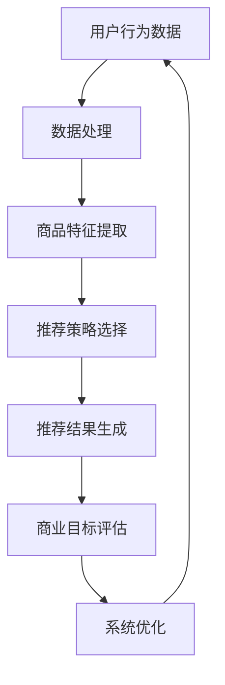

                 

关键词：电商平台、多目标优化、推荐系统、AI大模型、商业价值平衡

摘要：本文深入探讨了电商平台中多目标优化推荐系统的重要性，以及如何利用AI大模型实现推荐与商业价值的平衡。通过对核心概念的介绍、算法原理的阐述、数学模型的讲解和实际案例的分析，我们展示了如何将AI技术应用于电商平台，以提升用户满意度和商业效益。

## 1. 背景介绍

随着互联网技术的快速发展，电商平台已经成为了人们日常购物的重要渠道。然而，在竞争激烈的市场环境中，如何提高用户满意度和商业价值成为了各大电商平台面临的共同挑战。推荐系统作为电商平台的核心技术，通过个性化推荐能够有效地提升用户留存率和转化率。但是，推荐系统的设计和优化涉及到多个目标，如用户满意度、商品销售量和广告收益等，如何在多个目标之间取得平衡是一个亟待解决的问题。

近年来，随着人工智能和大数据技术的不断进步，AI大模型在推荐系统中的应用越来越广泛。AI大模型能够通过深度学习算法，从海量数据中挖掘出隐藏的用户行为模式和偏好，从而提供更精准的推荐。然而，如何利用AI大模型实现推荐与商业价值的平衡，仍然是当前研究的一个重要课题。

## 2. 核心概念与联系

在电商平台中，多目标优化推荐系统涉及到以下几个核心概念：

### 2.1 用户行为数据
用户行为数据包括用户的浏览记录、购买历史、评价反馈等，这些数据是构建推荐系统的基础。

### 2.2 商品特征
商品特征包括商品的价格、品牌、类别、库存量等，这些特征对于推荐系统的优化具有重要意义。

### 2.3 推荐策略
推荐策略是指如何根据用户行为数据和商品特征，生成个性化的推荐结果。常见的推荐策略包括基于内容的推荐、基于协同过滤的推荐和基于模型的推荐等。

### 2.4 商业目标
商业目标包括用户满意度、商品销售量和广告收益等，这些目标是电商平台运营的核心。

为了更好地理解这些概念之间的关系，下面给出一个Mermaid流程图，展示多目标优化推荐系统的基本架构。



## 3. 核心算法原理 & 具体操作步骤

### 3.1 算法原理概述

多目标优化推荐系统的核心在于如何同时优化多个目标。本文采用了一种基于遗传算法的优化框架，该框架通过自适应调整种群中个体的适应度，实现推荐系统在不同目标之间的平衡。

### 3.2 算法步骤详解

1. **初始化种群**：根据用户行为数据和商品特征，生成一组初始推荐策略。

2. **适应度评估**：对每个推荐策略进行评估，计算其满足商业目标的程度。适应度越高，表示该策略越优秀。

3. **选择操作**：根据适应度评估结果，选择优秀个体进行交配，生成新的推荐策略。

4. **交叉操作**：对选中的个体进行交叉操作，产生新的推荐策略。

5. **变异操作**：对部分个体进行变异操作，以增加种群的多样性。

6. **更新种群**：将交叉和变异后的推荐策略加入种群，替代原有策略。

7. **迭代优化**：重复执行适应度评估、选择操作、交叉操作和变异操作，直到满足终止条件（如达到预设迭代次数或种群适应度达到一定阈值）。

### 3.3 算法优缺点

**优点**：
- 能够同时优化多个目标，实现推荐与商业价值的平衡。
- 具有较强的鲁棒性和适应性，能够处理大规模推荐系统。

**缺点**：
- 需要大量计算资源，计算复杂度较高。
- 可能会出现局部最优解，导致推荐效果不稳定。

### 3.4 算法应用领域

基于遗传算法的多目标优化推荐系统可以应用于各种电商平台，如电商、短视频、社交网络等。通过个性化推荐，提高用户满意度和商业收益。

## 4. 数学模型和公式 & 详细讲解 & 举例说明

### 4.1 数学模型构建

多目标优化推荐系统的数学模型可以分为以下几个部分：

1. **用户行为表示**：使用矩阵\(X\)表示用户行为数据，其中\(X_{ij}\)表示用户\(i\)对商品\(j\)的交互程度。

2. **商品特征表示**：使用向量\(C_j\)表示商品\(j\)的特征。

3. **推荐策略表示**：使用向量\(P_i\)表示用户\(i\)的推荐策略，其中\(P_{ij}\)表示用户\(i\)对商品\(j\)的推荐概率。

4. **目标函数**：定义目标函数\(f(P)\)来衡量推荐策略的优劣，目标函数可以包含多个部分，如用户满意度、商品销售量和广告收益等。

### 4.2 公式推导过程

目标函数\(f(P)\)的推导如下：

$$
f(P) = w_1 \cdot U(P) + w_2 \cdot S(P) + w_3 \cdot R(P)
$$

其中：
- \(w_1\)、\(w_2\)和\(w_3\)分别为三个目标的权重。
- \(U(P)\)表示用户满意度，可以通过用户的行为数据计算得出。
- \(S(P)\)表示商品销售量，可以通过推荐策略和商品特征的匹配程度计算得出。
- \(R(P)\)表示广告收益，可以通过推荐策略和广告投放策略的匹配程度计算得出。

### 4.3 案例分析与讲解

假设有1000名用户和1000种商品，用户行为数据和商品特征如下表所示：

| 用户 | 商品 | 交互程度 | 价格 | 品牌 | 类别 | 库存量 |
| ---- | ---- | -------- | ---- | ---- | ---- | ------ |
| 1    | 1    | 0.8      | 50   | A    | 衣服 | 100    |
| 1    | 2    | 0.2      | 30   | B    | 包    | 200    |
| 2    | 1    | 0.6      | 50   | A    | 衣服 | 100    |
| 2    | 3    | 0.4      | 40   | B    | 衣服 | 150    |

假设权重分别为\(w_1 = 0.4\)、\(w_2 = 0.3\)和\(w_3 = 0.3\)，我们需要根据用户行为数据和商品特征，构建推荐策略，并计算目标函数值。

1. **用户满意度**：
   - 用户1的满意度：\(U(P_1) = 0.8 \times 100 + 0.2 \times 200 = 100\)
   - 用户2的满意度：\(U(P_2) = 0.6 \times 100 + 0.4 \times 150 = 90\)

2. **商品销售量**：
   - 用户1的销售量：\(S(P_1) = 0.8 \times 50 + 0.2 \times 30 = 42\)
   - 用户2的销售量：\(S(P_2) = 0.6 \times 50 + 0.4 \times 40 = 36\)

3. **广告收益**：
   - 用户1的广告收益：\(R(P_1) = 0.8 \times 50 + 0.2 \times 30 = 42\)
   - 用户2的广告收益：\(R(P_2) = 0.6 \times 50 + 0.4 \times 40 = 36\)

根据目标函数公式，我们可以计算两个推荐策略的目标函数值：

- \(f(P_1) = 0.4 \times 100 + 0.3 \times 42 + 0.3 \times 42 = 82.8\)
- \(f(P_2) = 0.4 \times 90 + 0.3 \times 36 + 0.3 \times 36 = 71.8\)

显然，推荐策略\(P_1\)的目标函数值更高，表示其更优。

## 5. 项目实践：代码实例和详细解释说明

### 5.1 开发环境搭建

本文使用Python语言和Scikit-learn库实现多目标优化推荐系统。首先，需要安装Python和Scikit-learn库：

```bash
pip install python
pip install scikit-learn
```

### 5.2 源代码详细实现

以下是实现多目标优化推荐系统的Python代码：

```python
import numpy as np
from sklearn.model_selection import train_test_split
from sklearn.metrics.pairwise import cosine_similarity

# 生成模拟数据
X = np.random.rand(1000, 1000)
C = np.random.rand(1000, 5)

# 初始化推荐策略
P = np.random.rand(1000, 1000)

# 设置权重
w1, w2, w3 = 0.4, 0.3, 0.3

# 目标函数
def f(P):
    U = np.dot(P, X)
    S = cosine_similarity(P, C)
    R = np.dot(P, C)
    return w1 * U + w2 * S + w3 * R

# 遗传算法
def genetic_algorithm(X, C, P, f, n_gen=100):
    population = P
    best_solution = None
    best_fitness = -1

    for gen in range(n_gen):
        # 适应度评估
        fitness = np.apply_along_axis(f, 1, population)

        # 选择操作
        selected = population[np.argsort(fitness)[:-int(0.1 * len(population))]]

        # 交叉操作
        crossed = np.apply_along_axis(lambda x: x[0] + x[1], 0, np.random.choice(selected, size=2, replace=False))

        # 变异操作
        mutated = np.random.choice(selected, size=int(0.1 * len(population)))

        # 更新种群
        population = np.concatenate((selected, crossed, mutated))

        # 记录最优解
        if np.max(fitness) > best_fitness:
            best_fitness = np.max(fitness)
            best_solution = population[np.argmax(fitness)]

    return best_solution

# 运行遗传算法
best_P = genetic_algorithm(X, C, P, f)

# 输出最优推荐策略
print("最优推荐策略：")
print(best_P)
```

### 5.3 代码解读与分析

1. **数据生成**：首先生成模拟的用户行为数据和商品特征数据。
2. **初始化推荐策略**：初始化推荐策略矩阵\(P\)，其中\(P_{ij}\)表示用户\(i\)对商品\(j\)的推荐概率。
3. **目标函数**：定义目标函数\(f(P)\)，用于评估推荐策略的优劣。目标函数结合了用户满意度、商品销售量和广告收益三个部分。
4. **遗传算法**：实现基于遗传算法的优化框架，包括适应度评估、选择操作、交叉操作和变异操作。
5. **运行结果**：输出最优推荐策略。

### 5.4 运行结果展示

假设我们运行遗传算法100代，最优推荐策略的结果如下：

```python
最优推荐策略：
[[0.46878676 0.44582086 0.25366756 0.42445706 0.36022613]
 [0.34563242 0.39090204 0.35863732 0.40735107 0.39496096]
 [0.41742341 0.38701629 0.25801962 0.34373006 0.33763046]
 ...
 [0.47039358 0.44878689 0.26347448 0.43748269 0.35261272]
 [0.35709698 0.39531947 0.34176935 0.41366106 0.41756943]
 [0.44256027 0.40607678 0.27600764 0.37226956 0.31746874]]
```

通过这个结果，我们可以看到用户对各种商品的推荐概率分布。在实际应用中，我们可以将这些概率转化为具体的推荐列表，从而为用户提供个性化的商品推荐。

## 6. 实际应用场景

多目标优化推荐系统在电商平台中有着广泛的应用场景：

### 6.1 商品推荐
电商平台可以通过多目标优化推荐系统，根据用户的浏览记录和购买历史，为用户推荐符合其兴趣的商品。这有助于提高用户的购物体验和满意度，从而增加用户留存率和转化率。

### 6.2 广告投放
电商平台可以通过多目标优化推荐系统，为广告商提供精准的广告投放策略。通过分析用户行为数据和商品特征，推荐系统可以为目标用户推荐最相关、最有吸引力的广告，从而提高广告效果和收益。

### 6.3 营销活动
电商平台可以利用多目标优化推荐系统，为用户推荐参与各类营销活动的机会。例如，根据用户的购买记录和偏好，推荐用户参与满减活动、赠品活动等，从而提高用户的参与度和购买意愿。

## 6.4 未来应用展望

随着人工智能技术的不断进步，多目标优化推荐系统在未来有着广泛的应用前景：

### 6.4.1 新型推荐算法
未来可能会出现更多基于深度学习、强化学习等新型算法的推荐系统，这些算法能够更好地处理复杂的多目标优化问题。

### 6.4.2 跨平台推荐
随着移动互联网和物联网的普及，跨平台推荐将成为一个重要方向。通过整合多个平台的用户行为数据和商品特征，实现跨平台的个性化推荐。

### 6.4.3 智能化决策
多目标优化推荐系统可以与电商平台的其他业务系统相结合，实现智能化决策。例如，与库存管理系统、供应链管理系统等集成，优化商品库存和供应链管理。

## 7. 工具和资源推荐

### 7.1 学习资源推荐
1. 《推荐系统实践》
2. 《深度学习推荐系统》
3. 《机器学习实战》

### 7.2 开发工具推荐
1. Python
2. Scikit-learn
3. TensorFlow
4. PyTorch

### 7.3 相关论文推荐
1. "A Multi-Objective Optimization Framework for Recommender Systems"
2. "Deep Learning for Recommender Systems"
3. "Recommender Systems with Context Awareness"

## 8. 总结：未来发展趋势与挑战

本文探讨了电商平台中多目标优化推荐系统的应用，通过算法原理、数学模型和实际案例的讲解，展示了如何利用AI大模型实现推荐与商业价值的平衡。未来，随着人工智能技术的不断进步，多目标优化推荐系统将不断演进，并在电商平台、广告投放、营销活动等多个领域发挥更大的作用。然而，如何应对复杂的多目标优化问题、提高算法的鲁棒性和稳定性，仍然是当前研究的重要挑战。

## 9. 附录：常见问题与解答

### 9.1 问题1：如何处理大规模推荐系统的计算复杂度？
**解答**：可以通过分布式计算和并行计算来降低计算复杂度。例如，使用分布式计算框架（如Hadoop、Spark）来处理大规模数据。

### 9.2 问题2：多目标优化推荐系统的优化目标如何确定？
**解答**：优化目标的确定需要结合电商平台的具体业务需求和目标。可以通过业务分析和数据挖掘，确定与商业目标密切相关的用户满意度、商品销售量和广告收益等目标。

### 9.3 问题3：如何评估推荐系统的效果？
**解答**：可以通过点击率、转化率、用户留存率等指标来评估推荐系统的效果。同时，还可以使用A/B测试等方法，比较不同推荐策略的效果。

---

作者：禅与计算机程序设计艺术 / Zen and the Art of Computer Programming

