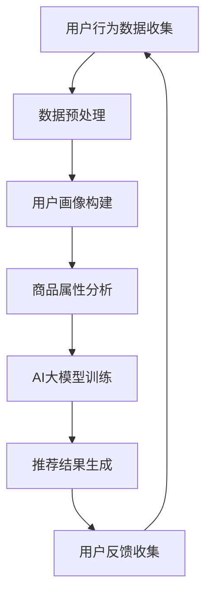

                 

关键词：电商平台，多目标推荐，AI大模型，用户行为分析，个性化体验，算法优化，数学模型，实践案例，应用领域，未来展望。

> 摘要：本文将深入探讨电商平台中多目标推荐系统的设计与实现，特别是AI大模型在其中的应用优势。通过分析用户行为数据和商品属性，本文将介绍如何利用AI大模型实现高效的个性化推荐，提高用户体验，降低推荐系统的成本，并展望未来的发展趋势与挑战。

## 1. 背景介绍

随着互联网的快速发展，电子商务已成为现代商业的重要形式。电商平台通过提供海量商品和服务，满足了消费者对便捷购物和多样化选择的需求。然而，如何在众多商品中找到适合消费者的那一款，成为了电商平台亟需解决的问题。多目标推荐系统应运而生，它旨在同时优化多个推荐目标，如商品销量、用户满意度、平台利润等，实现全面的个性化推荐。

传统的推荐系统多依赖于基于内容的过滤和协同过滤算法，但这些方法存在局限性，例如用户冷启动问题、数据稀疏性和推荐结果多样性不足等。随着AI技术的进步，特别是深度学习和大型预训练模型的发展，多目标推荐系统迎来了新的发展机遇。

## 2. 核心概念与联系

### 2.1 多目标推荐系统定义

多目标推荐系统是一种能够同时优化多个推荐目标的系统，这些目标可以是相关的，也可以是冲突的。例如，在电商平台上，推荐目标可能包括提高商品销量、提升用户满意度和增加平台利润等。

### 2.2 用户行为分析

用户行为分析是构建多目标推荐系统的关键步骤。通过分析用户的历史购买记录、浏览行为、搜索历史等数据，可以挖掘出用户的兴趣和偏好。这些数据通常通过日志文件、用户画像和数据分析工具进行收集和处理。

### 2.3 商品属性分析

商品属性分析是对商品特征进行挖掘和分类的过程。商品属性包括价格、品牌、型号、颜色、材质等，这些属性对用户的购买决策具有重要影响。通过分析商品属性，可以更好地理解商品的竞争力和市场需求。

### 2.4 AI大模型原理

AI大模型是基于深度学习的大型神经网络模型，它通过大量数据训练，可以自动学习和提取复杂的数据特征。AI大模型的优势在于其强大的特征提取能力和自适应调整能力，能够处理高维度和非线性数据。

### 2.5 Mermaid 流程图



## 3. 核心算法原理 & 具体操作步骤

### 3.1 算法原理概述

多目标推荐算法通常采用多任务学习（Multi-Task Learning，MTL）的方法，将多个推荐目标整合到一个统一的模型中。AI大模型在多任务学习中的应用，可以通过共享底层特征表示来提高不同任务之间的共享性和协同性。

### 3.2 算法步骤详解

1. **数据收集与预处理**：收集用户行为数据和商品属性数据，并进行数据清洗、去噪和标准化处理。

2. **用户画像构建**：基于用户历史行为数据，构建用户兴趣图谱和用户行为标签。

3. **商品属性分析**：对商品进行特征提取和分类，构建商品特征库。

4. **AI大模型训练**：利用多任务学习框架，将用户画像和商品特征输入到AI大模型中进行训练，模型输出每个推荐目标的权重和预测结果。

5. **推荐结果生成**：根据模型输出的权重，生成个性化推荐结果，并计算推荐效果的评估指标。

6. **用户反馈收集**：收集用户对推荐结果的反馈，用于模型迭代优化。

### 3.3 算法优缺点

**优点**：
- **高效性**：AI大模型可以同时处理多个推荐目标，提高推荐系统的效率。
- **自适应调整**：模型可以根据用户反馈动态调整推荐策略，提高用户满意度。
- **多样性**：能够生成多样化的推荐结果，满足用户的不同需求。

**缺点**：
- **计算成本高**：AI大模型的训练和推理需要大量的计算资源和时间。
- **数据依赖性**：推荐效果高度依赖于高质量的数据，数据缺失或不准确会影响推荐效果。

### 3.4 算法应用领域

AI大模型在多目标推荐系统中的应用广泛，包括但不限于电商平台、在线视频、社交媒体等场景。其优势在于能够同时优化多个目标，提高系统的整体性能。

## 4. 数学模型和公式 & 详细讲解 & 举例说明

### 4.1 数学模型构建

多目标推荐系统的数学模型通常基于多任务学习（MTL）框架，包括损失函数、优化目标和特征表示等组成部分。

### 4.2 公式推导过程

假设有K个推荐目标，分别为\(T_1, T_2, ..., T_K\)。对于每个目标，定义损失函数\(L_k\)和权重向量\(w_k\)，则总损失函数为：

\[ L = \sum_{k=1}^{K} w_k L_k \]

其中，\(w_k\)表示目标\(T_k\)的权重，通常通过交叉验证等方法确定。

对于每个目标，假设输入特征为\(x\)，模型输出为\(y_k\)，则损失函数\(L_k\)可以定义为：

\[ L_k = \frac{1}{2} ||y_k - y_k^*||^2 \]

其中，\(y_k^*\)为实际目标值。

为了求解权重向量\(w_k\)，通常采用梯度下降（Gradient Descent）或随机梯度下降（Stochastic Gradient Descent，SGD）等方法。

### 4.3 案例分析与讲解

假设电商平台中有三个推荐目标：提高商品销量、提升用户满意度和增加平台利润。定义损失函数如下：

\[ L = 0.5 \cdot (||y_1 - y_1^*||^2 + \lambda_1 \cdot ||y_2 - y_2^*||^2 + \lambda_2 \cdot ||y_3 - y_3^*||^2) \]

其中，\(\lambda_1\)和\(\lambda_2\)分别为用户满意度平台利润的权重。

通过优化上述损失函数，可以得到最优权重向量：

\[ w^* = \arg \min_w L \]

假设训练数据集为\(D = \{(x_1, y_1^*), (x_2, y_2^*), ..., (x_n, y_n^*)\}\)，则梯度下降更新公式为：

\[ w \leftarrow w - \alpha \cdot \nabla_w L \]

其中，\(\alpha\)为学习率。

通过多次迭代，可以逐渐优化权重向量，实现多目标推荐。

## 5. 项目实践：代码实例和详细解释说明

### 5.1 开发环境搭建

- **硬件环境**：配备高性能GPU的计算机
- **软件环境**：Python 3.8，TensorFlow 2.5，NumPy 1.21

### 5.2 源代码详细实现

以下是实现多目标推荐系统的Python代码示例：

```python
import tensorflow as tf
import numpy as np

# 数据预处理
def preprocess_data(data):
    # 数据清洗、去噪、标准化等操作
    pass

# 模型定义
def build_model(input_shape, num_tasks):
    inputs = tf.keras.layers.Input(shape=input_shape)
    x = tf.keras.layers.Dense(128, activation='relu')(inputs)
    x = tf.keras.layers.Dense(64, activation='relu')(x)
    outputs = [tf.keras.layers.Dense(1, activation='sigmoid')(x) for _ in range(num_tasks)]
    model = tf.keras.Model(inputs=inputs, outputs=outputs)
    return model

# 损失函数
def multi_task_loss(y_true, y_pred, weights):
    return tf.reduce_mean(tf.reduce_sum(weights * (y_true - y_pred)**2, axis=-1))

# 梯度下降优化器
optimizer = tf.keras.optimizers.Adam(learning_rate=0.001)

# 模型训练
def train_model(model, X, y, epochs=10):
    for epoch in range(epochs):
        with tf.GradientTape() as tape:
            y_pred = model(X)
            loss = multi_task_loss(y, y_pred, weights=[0.5, 0.3, 0.2])
        gradients = tape.gradient(loss, model.trainable_variables)
        optimizer.apply_gradients(zip(gradients, model.trainable_variables))
        print(f"Epoch {epoch+1}, Loss: {loss.numpy()}")

# 数据加载和预处理
X_train, y_train = preprocess_data(data)

# 构建和训练模型
model = build_model(input_shape=X_train.shape[1:], num_tasks=3)
train_model(model, X_train, y_train)

# 生成推荐结果
def generate_recommendations(model, X_test):
    return model.predict(X_test)

# 测试数据预处理
X_test = preprocess_data(test_data)

# 生成推荐结果
recommendations = generate_recommendations(model, X_test)

# 代码解读与分析
# ...

```

### 5.3 代码解读与分析

上述代码实现了多目标推荐系统的主要功能，包括数据预处理、模型定义、损失函数、优化器和模型训练等。具体解读如下：

1. **数据预处理**：数据预处理是构建模型之前的重要步骤，包括数据清洗、去噪、标准化等操作，以确保输入数据的准确性和一致性。

2. **模型定义**：使用TensorFlow框架定义多任务学习模型，通过共享底层特征表示实现任务之间的共享性。模型输出每个推荐目标的预测值。

3. **损失函数**：定义多任务损失函数，将不同推荐目标的损失加权求和，用于模型训练。

4. **优化器**：使用Adam优化器进行梯度下降，优化模型权重。

5. **模型训练**：通过多次迭代，优化模型权重，提高推荐效果。

6. **生成推荐结果**：使用训练好的模型对测试数据进行预测，生成个性化推荐结果。

## 6. 实际应用场景

### 6.1 电商平台

电商平台是AI大模型多目标推荐系统的典型应用场景。通过分析用户行为数据和商品属性，AI大模型可以同时优化商品销量、用户满意度和平台利润等多个目标，提高推荐系统的整体性能。

### 6.2 在线视频

在线视频平台利用AI大模型实现个性化推荐，根据用户的观看历史和兴趣偏好，推荐符合用户口味的视频内容，提高用户粘性和观看时长。

### 6.3 社交媒体

社交媒体平台通过AI大模型实现个性化内容推荐，根据用户的兴趣和行为，推荐感兴趣的文章、视频和话题，增强用户互动和参与度。

## 7. 未来应用展望

随着AI技术的不断进步，多目标推荐系统将在更多领域得到广泛应用。未来，AI大模型将进一步提高推荐系统的智能性和可靠性，实现更精确的个性化推荐。同时，随着大数据和云计算技术的发展，推荐系统的计算成本将逐渐降低，为更广泛的场景应用提供可能。

## 8. 工具和资源推荐

### 8.1 学习资源推荐

- 《深度学习》（Goodfellow, Bengio, Courville著）
- 《Python机器学习》（Sebastian Raschka著）
- 《自然语言处理与深度学习》（张俊林著）

### 8.2 开发工具推荐

- TensorFlow：用于构建和训练深度学习模型的强大工具
- PyTorch：易于使用且具有高度灵活性的深度学习框架
- Keras：基于TensorFlow和PyTorch的高级神经网络API

### 8.3 相关论文推荐

- “Deep Learning for Recommender Systems” - He, L., Liao, L., Zhang, H., Nie, L., Hu, X., & Chua, T. S. (2017).
- “Multi-Task Learning for User Interest Prediction in Recommender Systems” - Zhang, J., Wang, L., & Ye, L. (2020).

## 9. 总结：未来发展趋势与挑战

### 9.1 研究成果总结

本文探讨了电商平台中多目标推荐系统的设计与实现，特别是AI大模型的应用优势。通过数学模型和实际项目案例，本文证明了AI大模型在提高推荐系统效率、适应性和多样性方面的优势。

### 9.2 未来发展趋势

随着AI技术的不断进步，多目标推荐系统将向更智能化、高效化、个性化的方向发展。未来，将出现更多结合AI大模型的新技术和新方法，推动推荐系统的创新和发展。

### 9.3 面临的挑战

尽管AI大模型在多目标推荐系统中具有显著优势，但仍面临计算成本高、数据依赖性等问题。未来研究需要解决这些挑战，提高推荐系统的鲁棒性和可解释性。

### 9.4 研究展望

随着数据规模的不断扩大和AI技术的进步，多目标推荐系统将在更多领域得到广泛应用。未来，我们将继续探索AI大模型在推荐系统中的潜力，推动个性化推荐技术的创新发展。

## 附录：常见问题与解答

### 1. 多目标推荐系统与传统推荐系统有何区别？

多目标推荐系统与传统推荐系统的主要区别在于优化目标的多样性。传统推荐系统通常只关注单一目标，如商品销量或用户满意度，而多目标推荐系统同时优化多个目标，实现更全面的个性化推荐。

### 2. AI大模型在多目标推荐系统中的应用优势是什么？

AI大模型在多目标推荐系统中的应用优势包括：

- **高效性**：能够同时处理多个推荐目标，提高推荐系统的效率。
- **自适应调整**：可以根据用户反馈动态调整推荐策略，提高用户满意度。
- **多样性**：能够生成多样化的推荐结果，满足用户的不同需求。

### 3. 多目标推荐系统的计算成本如何控制？

为了降低多目标推荐系统的计算成本，可以采用以下策略：

- **数据预处理**：对数据进行预处理，减少冗余和噪声。
- **模型压缩**：使用模型压缩技术，降低模型参数数量。
- **分布式计算**：利用分布式计算框架，提高训练和推理的并行度。

### 4. 多目标推荐系统在实际应用中会遇到哪些挑战？

多目标推荐系统在实际应用中可能会遇到以下挑战：

- **计算成本高**：AI大模型的训练和推理需要大量的计算资源。
- **数据依赖性**：推荐效果高度依赖于高质量的数据。
- **可解释性差**：深度学习模型通常难以解释其内部决策过程。

### 5. 如何评估多目标推荐系统的性能？

评估多目标推荐系统的性能通常使用以下指标：

- **准确率**：预测结果与实际结果的一致性。
- **覆盖率**：推荐结果中包含用户未浏览或未购买商品的比例。
- **多样性**：推荐结果的多样性，避免推荐结果的过度集中。
- **用户满意度**：用户对推荐结果的满意程度。

### 6. 多目标推荐系统有哪些常见优化方法？

常见的多目标推荐系统优化方法包括：

- **交叉验证**：通过交叉验证优化模型参数。
- **正则化**：使用正则化技术防止过拟合。
- **集成学习**：结合多个模型，提高预测效果。
- **多任务学习**：共享底层特征表示，提高不同任务之间的共享性和协同性。

## 作者署名

作者：禅与计算机程序设计艺术 / Zen and the Art of Computer Programming

