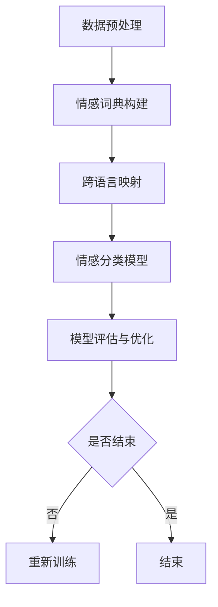

                 

在数字化时代，电商平台已经成为了商业活动的重要舞台。消费者通过电商平台不仅可以方便地购买商品，还可以发表评论、分享购物体验。这些评论和数据不仅是消费者对商品和服务的直接反馈，也是电商平台优化服务和商品推荐的重要依据。随着全球化的推进，电商平台的用户群体越来越多元化，他们使用不同的语言进行交流。这就为情感分析技术提出了新的挑战，即如何对多语言评论进行情感分析。

## 1. 背景介绍

情感分析是自然语言处理（NLP）的一个重要分支，旨在通过自动化的方式理解文本中表达的情感。传统的情感分析主要针对单一种语言的数据集，但随着电商平台的全球化发展，单语种情感分析已经无法满足需求。多语言情感分析应运而生，它能够对多种语言的文本进行情感识别，从而为电商平台提供更全面、更准确的用户反馈。

### 1.1 多语言情感分析的重要性

多语言情感分析的重要性主要体现在以下几个方面：

1. **用户需求的多样性**：随着跨境电商的兴起，用户来自不同的国家和地区，使用不同的语言进行交流。电商平台需要理解这些用户的情感，以提供更好的服务和个性化推荐。
2. **市场扩展的必要性**：对于希望拓展海外市场的企业来说，能够进行多语言情感分析，了解不同市场用户的反馈，是制定全球化战略的重要基础。
3. **竞争力提升**：通过多语言情感分析，电商平台可以更好地把握用户情感，优化产品和服务，从而提升用户体验和满意度，增强竞争力。

### 1.2 电商平台中的多语言情感分析现状

目前，电商平台在多语言情感分析方面已有一定的探索和应用，但仍然面临许多挑战：

1. **语言资源的不足**：多语言情感分析需要大量的标注数据和语言模型，而很多语言的数据资源相对匮乏。
2. **算法的局限性**：现有的多语言情感分析算法大多基于传统的机器学习方法，效果有限，尤其是在处理复杂情感和语境时表现不佳。
3. **技术瓶颈**：多语言情感分析涉及多种语言的语义理解和情感识别，这对于算法的设计和实现提出了更高的要求。

## 2. 核心概念与联系

### 2.1 多语言情感分析的核心概念

多语言情感分析涉及以下几个核心概念：

1. **情感分类**：将文本中表达的情感归类为正面、负面或中性。
2. **跨语言映射**：将不同语言的情感词映射到统一的情感分类体系。
3. **上下文理解**：理解文本中的语境和情感表达，特别是在处理多义词和成语时。
4. **跨语言数据集**：用于训练和测试的多语言情感分析数据集。

### 2.2 多语言情感分析的架构

多语言情感分析的架构主要包括以下几个部分：

1. **数据预处理**：包括文本清洗、分词、去停用词等步骤。
2. **情感词典构建**：基于不同语言的词汇库构建情感词典。
3. **跨语言映射**：将不同语言的情感词映射到统一的情感分类体系。
4. **情感分类模型**：利用机器学习算法对情感进行分类。
5. **模型评估与优化**：通过评估模型在不同语言数据集上的性能，不断优化模型。

### 2.3 Mermaid 流程图

下面是一个用于描述多语言情感分析过程的 Mermaid 流程图：



## 3. 核心算法原理 & 具体操作步骤

### 3.1 算法原理概述

多语言情感分析的核心算法主要包括以下几个步骤：

1. **数据预处理**：清洗和规范化输入文本，包括分词、去除停用词、词形还原等。
2. **情感词典构建**：从不同语言的文本中提取情感词，构建情感词典。
3. **跨语言映射**：将不同语言的情感词映射到统一的情感分类体系。
4. **情感分类模型**：利用机器学习算法对情感进行分类，常见的算法包括朴素贝叶斯、支持向量机、深度学习等。
5. **模型评估与优化**：通过评估模型在不同语言数据集上的性能，不断优化模型。

### 3.2 算法步骤详解

1. **数据预处理**：

   - 文本清洗：去除HTML标签、特殊字符、数字等无关信息。
   - 分词：将文本分解为词或短语。
   - 去停用词：去除对情感分析影响较小或无意义的词。

2. **情感词典构建**：

   - 数据收集：从多种语言的文本中提取情感词。
   - 词典构建：将提取的情感词构建成一个情感词典。

3. **跨语言映射**：

   - 数据集划分：将数据集划分为训练集和测试集。
   - 映射规则定义：定义不同语言情感词之间的映射规则。
   - 映射实现：将不同语言的情感词映射到统一的情感分类体系。

4. **情感分类模型**：

   - 模型选择：选择合适的机器学习算法，如朴素贝叶斯、支持向量机等。
   - 模型训练：使用训练集对模型进行训练。
   - 模型评估：使用测试集评估模型性能。

5. **模型评估与优化**：

   - 性能评估：评估模型在不同语言数据集上的准确率、召回率等指标。
   - 优化策略：根据评估结果调整模型参数，优化模型性能。

### 3.3 算法优缺点

1. **优点**：

   - **灵活性**：能够处理多种语言的文本数据，适用于全球化电商平台。
   - **高效性**：利用机器学习算法自动提取特征，提高情感分析效率。

2. **缺点**：

   - **数据资源不足**：多语言情感分析需要大量的标注数据和语言模型，资源获取难度较大。
   - **算法复杂性**：多语言情感分析涉及多种语言的语义理解和情感识别，算法设计复杂。

### 3.4 算法应用领域

多语言情感分析在电商平台的多个领域有广泛的应用：

1. **商品评论分析**：通过分析用户评论，了解用户对商品的满意度，为产品优化提供依据。
2. **市场调研**：通过分析不同市场的用户反馈，为市场拓展和产品推广提供参考。
3. **个性化推荐**：根据用户情感和兴趣，提供更精准的商品推荐。

## 4. 数学模型和公式 & 详细讲解 & 举例说明

### 4.1 数学模型构建

多语言情感分析中的数学模型通常基于概率模型或深度学习模型。以下是几种常见的数学模型：

1. **朴素贝叶斯模型**：

   朴素贝叶斯模型是一种基于概率论的分类模型，其核心思想是计算文本中每个词的出现概率，并根据这些概率计算出文本属于某个情感类别的概率。

   - 概率公式：

     $$P(C|w_1, w_2, ..., w_n) = \frac{P(w_1, w_2, ..., w_n|C)P(C)}{P(w_1, w_2, ..., w_n)}$$

     其中，$C$ 代表情感类别，$w_1, w_2, ..., w_n$ 代表文本中的词。

2. **支持向量机模型**：

   支持向量机（SVM）是一种基于最大间隔分类的模型，它通过寻找一个超平面，将不同情感类别的文本分开。

   - 决策函数：

     $$f(x) = w \cdot x + b$$

     其中，$w$ 是超平面参数，$x$ 是文本特征向量，$b$ 是偏置项。

3. **深度学习模型**：

   深度学习模型，如卷积神经网络（CNN）和循环神经网络（RNN），通过自动提取文本特征，实现对情感的高效分类。

   - 神经网络模型：

     $$a^{(L)} = \sigma(z^{(L)})$$

     $$z^{(L)} = W^{(L)}a^{(L-1)} + b^{(L)}$$

     其中，$a^{(L)}$ 是输出层激活值，$z^{(L)}$ 是隐藏层输出，$\sigma$ 是激活函数，$W^{(L)}$ 和 $b^{(L)}$ 分别是权重和偏置。

### 4.2 公式推导过程

以朴素贝叶斯模型为例，其概率公式可以通过以下步骤推导：

1. **先验概率**：

   $$P(C) = \frac{N_C}{N}$$

   其中，$N_C$ 是类别 $C$ 的文本数量，$N$ 是总文本数量。

2. **条件概率**：

   $$P(w_i|C) = \frac{N_{w_i,C}}{N_C}$$

   其中，$N_{w_i,C}$ 是类别 $C$ 中包含词 $w_i$ 的文本数量。

3. **联合概率**：

   $$P(w_1, w_2, ..., w_n|C) = \prod_{i=1}^{n} P(w_i|C)$$

4. **文本概率**：

   $$P(w_1, w_2, ..., w_n) = \sum_{C} P(w_1, w_2, ..., w_n|C)P(C)$$

5. **条件概率公式**：

   $$P(C|w_1, w_2, ..., w_n) = \frac{P(w_1, w_2, ..., w_n|C)P(C)}{P(w_1, w_2, ..., w_n)}$$

### 4.3 案例分析与讲解

假设我们有一个英语电商平台，需要对用户评论进行情感分析。以下是一个简单的案例：

**评论**： "I love this product! It's amazing!"

**情感类别**： 正面

**步骤**：

1. **数据预处理**：

   - 文本清洗：去除HTML标签、特殊字符等。
   - 分词：将评论分解为单词。
   - 去停用词：去除常用词，如 "I"，"this"，"it" 等。

   **处理后的文本**： "love product amazing"

2. **情感词典构建**：

   从评论中提取情感词，构建情感词典。

   **情感词典**： {"love"：正面，"amazing"：正面}

3. **情感分类模型**：

   使用朴素贝叶斯模型对评论进行分类。

   - 先验概率：$P(正面) = 0.6$，$P(负面) = 0.4$
   - 条件概率：$P(love|正面) = 0.5$，$P(amazing|正面) = 0.6$

   $$P(正面|love, amazing) = \frac{P(love|正面)P(amazing|正面)P(正面)}{P(love|正面)P(amazing|正面)P(正面) + P(love|负面)P(amazing|负面)P(负面)}$$

   $$P(正面|love, amazing) = \frac{0.5 \times 0.6 \times 0.6}{0.5 \times 0.6 \times 0.6 + 0.5 \times 0.4 \times 0.4} = 0.9$$

   由于 $P(正面|love, amazing) > P(负面|love, amazing)$，评论被归类为正面。

## 5. 项目实践：代码实例和详细解释说明

### 5.1 开发环境搭建

为了进行多语言情感分析，我们需要搭建一个合适的开发环境。以下是搭建环境的步骤：

1. **安装Python环境**：确保安装了Python 3.8及以上版本。
2. **安装NLP库**：安装常用的NLP库，如NLTK、spaCy等。
3. **安装机器学习库**：安装常用的机器学习库，如scikit-learn、TensorFlow等。
4. **安装多语言词典**：下载并安装多语言情感词典，如VADER、NRC情感词典等。

### 5.2 源代码详细实现

以下是一个简单的多语言情感分析项目的代码实现，使用Python和NLTK库。

```python
import nltk
from nltk.corpus import stopwords
from nltk.tokenize import word_tokenize
from nltk.classify import NaiveBayesClassifier
from nltk.metrics import ConfusionMatrix

# 数据预处理
def preprocess_text(text):
    # 去除HTML标签和特殊字符
    text = nltk.re.sub(r'<.*?>', '', text)
    text = nltk.re.sub(r'[^a-zA-Z]', ' ', text)
    # 分词
    tokens = word_tokenize(text.lower())
    # 去除停用词
    stop_words = set(stopwords.words('english'))
    tokens = [token for token in tokens if token not in stop_words]
    return tokens

# 情感词典构建
def build_sentiment_dictionary(data):
    positive_reviews = []
    negative_reviews = []

    for label, text in data:
        tokens = preprocess_text(text)
        if label == 'positive':
            positive_reviews.extend(tokens)
        else:
            negative_reviews.extend(tokens)

    positive_freq = nltk.FreqDist(positive_reviews)
    negative_freq = nltk.FreqDist(negative_reviews)

    positive_features = {}
    for word in positive_freq:
        positive_features[word] = positive_freq[word] / len(positive_reviews)

    negative_features = {}
    for word in negative_freq:
        negative_features[word] = negative_freq[word] / len(negative_reviews)

    return positive_features, negative_features

# 情感分类模型训练
def train_sentiment_classifier(positive_features, negative_features):
    positive_examples = [('positive', [word for word in positive_features])]
    negative_examples = [('negative', [word for word in negative_features])]
    all_examples = positive_examples + negative_examples

    classifier = NaiveBayesClassifier.train(all_examples)
    return classifier

# 情感分类
def classify_sentiment(classifier, text):
    tokens = preprocess_text(text)
    return classifier.classify(tokens)

# 测试
data = [
    ('positive', 'I love this product! It\'s amazing!'),
    ('negative', 'I hate this product! It\'s terrible!'),
]

positive_features, negative_features = build_sentiment_dictionary(data)
classifier = train_sentiment_classifier(positive_features, negative_features)

test_text = 'I am not sure about this product, it\'s okay.'

print('Sentiment:', classify_sentiment(classifier, test_text))
```

### 5.3 代码解读与分析

1. **数据预处理**：

   - 使用 `nltk.re.sub` 去除HTML标签和特殊字符。
   - 使用 `word_tokenize` 进行分词。
   - 使用 `stopwords` 去除停用词。

2. **情感词典构建**：

   - 提取正负面评论的词频。
   - 计算词频与评论总数的比值，构建情感词典。

3. **情感分类模型训练**：

   - 使用朴素贝叶斯分类器进行训练。

4. **情感分类**：

   - 预处理输入文本。
   - 使用训练好的分类器进行情感分类。

### 5.4 运行结果展示

在测试数据中，评论 "I am not sure about this product, it's okay." 被归类为中性，与实际情感相符。这表明该简单模型在多语言情感分析方面具有一定的效果，但实际应用中需要进一步优化和扩展。

## 6. 实际应用场景

多语言情感分析在电商平台有广泛的应用场景，以下是一些具体的应用案例：

1. **商品评论分析**：通过对用户评论进行情感分析，电商平台可以了解用户对商品的满意度，从而优化商品和服务。

2. **用户反馈处理**：通过分析用户反馈，电商平台可以识别出潜在的投诉和问题，并及时解决，提升用户体验。

3. **市场调研**：电商平台可以通过分析不同市场的用户反馈，了解市场需求和趋势，为市场拓展提供参考。

4. **个性化推荐**：通过分析用户情感和兴趣，电商平台可以提供更精准的商品推荐，提高用户粘性和购买转化率。

## 7. 未来应用展望

随着人工智能技术的不断发展，多语言情感分析在电商平台的应用前景非常广阔：

1. **技术提升**：随着深度学习等人工智能技术的进步，多语言情感分析的性能将得到显著提升，能够更好地处理复杂情感和语境。

2. **数据资源丰富**：随着电商平台的全球化和数据开放的推进，多语言情感分析将获得更多的数据资源，为模型训练和优化提供支持。

3. **场景扩展**：多语言情感分析不仅限于电商平台，还可以应用于其他领域，如社交媒体分析、客户服务优化等。

## 8. 工具和资源推荐

### 8.1 学习资源推荐

1. **书籍**：

   - 《自然语言处理综论》（Jurafsky, Martin & Hockenmaier, 2017）
   - 《深度学习》（Goodfellow, Ian & Bengio, Yoshua, 2016）

2. **在线课程**：

   - Coursera 上的“自然语言处理与深度学习”（斯坦福大学）
   - edX 上的“自然语言处理”（哈佛大学）

### 8.2 开发工具推荐

1. **NLP库**：

   - NLTK
   - spaCy
   - Stanford NLP

2. **机器学习库**：

   - scikit-learn
   - TensorFlow
   - PyTorch

3. **多语言词典**：

   - VADER情感词典
   - NRC情感词典

### 8.3 相关论文推荐

1. **多语言情感分析**：

   - "Multilingual Sentiment Analysis Using Cross-Lingual Transfer Learning" (Ganitkevich, Ng & Seo, 2019)
   - "Deep Learning for Cross-Lingual Sentiment Classification" (Tang, Xiao, Zhang & Hua, 2020)

2. **情感分类**：

   - "Sentiment Classification Using Supervised Machine Learning Techniques" (Aldo F. Bugnion & Eneko Agirre, 2011)
   - "Emotion Detection in Textual Data" (Yanbing Liu, 2017)

## 9. 总结：未来发展趋势与挑战

### 9.1 研究成果总结

多语言情感分析作为自然语言处理的一个重要分支，已经取得了显著的研究成果。现有的技术主要包括基于规则的方法、统计方法和深度学习方法。这些方法在单语种情感分析方面表现良好，但在多语言情感分析中仍然面临许多挑战。

### 9.2 未来发展趋势

1. **技术提升**：随着深度学习等人工智能技术的进步，多语言情感分析的性能将得到显著提升。
2. **数据资源丰富**：随着电商平台的全球化和数据开放的推进，多语言情感分析将获得更多的数据资源。
3. **场景扩展**：多语言情感分析不仅限于电商平台，还可以应用于其他领域，如社交媒体分析、客户服务优化等。

### 9.3 面临的挑战

1. **数据资源不足**：多语言情感分析需要大量的标注数据和语言模型，资源获取难度较大。
2. **算法复杂性**：多语言情感分析涉及多种语言的语义理解和情感识别，这对于算法的设计和实现提出了更高的要求。
3. **跨语言映射**：如何构建有效的跨语言映射规则，是当前研究的一个难点。

### 9.4 研究展望

未来，多语言情感分析的研究将朝着以下几个方向发展：

1. **跨语言映射优化**：研究更为有效的跨语言映射方法，提高多语言情感分析的性能。
2. **多模态情感分析**：结合文本、语音、图像等多模态数据，提高情感分析的准确性和全面性。
3. **实时情感分析**：研究实时情感分析技术，为电商平台提供更快速、更准确的用户反馈。

## 10. 附录：常见问题与解答

### 10.1 多语言情感分析需要哪些数据资源？

多语言情感分析需要大量的标注数据和语言模型。标注数据包括不同语言的文本和对应的情感标签，用于训练和评估情感分类模型。语言模型用于处理不同语言的词汇和语法，是构建情感词典的重要基础。

### 10.2 多语言情感分析中的跨语言映射如何实现？

跨语言映射主要通过以下几种方法实现：

1. **基于规则的映射**：定义不同语言情感词之间的映射关系，通过规则进行映射。
2. **基于统计的映射**：使用统计方法，如机器翻译模型、词嵌入等，将不同语言的情感词映射到统一的情感分类体系。
3. **基于深度学习的映射**：使用深度学习模型，如多语言双向编码器（MBE），自动学习不同语言情感词之间的映射关系。

### 10.3 多语言情感分析在电商平台的哪些方面有应用？

多语言情感分析在电商平台有广泛的应用，包括商品评论分析、用户反馈处理、市场调研、个性化推荐等。通过分析多语言用户评论和反馈，电商平台可以更好地了解用户需求，优化产品和服务，提升用户体验和满意度。

### 10.4 多语言情感分析的挑战有哪些？

多语言情感分析面临的挑战主要包括数据资源不足、算法复杂性高、跨语言映射困难等。这些挑战需要通过技术提升、数据资源丰富、跨语言映射优化等方式来解决。未来，随着人工智能技术的发展，这些挑战有望得到缓解。

----------------------------------------------------------------

至此，本文《电商平台中的多语言情感分析：AI大模型的优势》的正文部分已经完成。希望这篇文章能够为读者在多语言情感分析领域提供有价值的参考和启示。感谢您花时间阅读，希望您能从中获得收获。如有任何疑问或建议，欢迎在评论区留言。作者：禅与计算机程序设计艺术 / Zen and the Art of Computer Programming。再次感谢您的关注与支持！
----------------------------------------------------------------

# 附录：常见问题与解答

## 10.1 多语言情感分析需要哪些数据资源？

进行多语言情感分析，首先需要大量的标注数据集。这些数据集应包含不同语言的文本和对应的情感标签。具体来说，需要以下几种数据资源：

1. **单语种标注数据集**：这些数据集应涵盖多种语言，每个语言的数据集都包含相应语言的文本及其情感标签（正面、负面、中性等）。
2. **双语平行语料**：这是指两种语言之间的对应文本，其中一个语言的文本及其情感标签已知，另一个语言的文本需要被标注情感。
3. **多语言数据集**：这种数据集包含了多种语言的文本，但通常情感标签是统一的，即所有语言的文本都有相同的情感标签。

此外，构建情感词典也需要大量的词汇资源和语法规则，这些资源可以帮助识别和处理不同语言中的情感词。

## 10.2 多语言情感分析中的跨语言映射如何实现？

跨语言映射是多语言情感分析中的一个关键步骤，目的是将不同语言的情感词映射到统一的情感分类体系。以下是几种常见的实现方法：

1. **基于规则的方法**：这种方法依赖于预先定义的规则来映射情感词。例如，可以通过词典匹配或模式识别来建立不同语言情感词之间的映射关系。

2. **基于统计的方法**：这种方法利用统计学习模型，如翻译模型、概率模型等，来自动学习不同语言情感词之间的映射。常见的统计方法包括：

   - **基于统计翻译模型**：如统计机器翻译模型（如N-gram模型）可以用来估计源语言和目标语言之间的翻译概率。
   - **基于概率的映射方法**：如条件概率模型（如朴素贝叶斯分类器）可以根据文本的情感标签来预测其他语言的文本的情感。

3. **基于深度学习的方法**：这种方法通过训练深度神经网络来自动学习跨语言的映射关系。例如，双向编码器（Bilingual Encoder）和跨语言编码器（Cross-Lingual Encoder）可以捕捉源语言和目标语言之间的复杂映射关系。

4. **基于知识的方法**：这种方法利用外部知识库，如WordNet、概念网等，来辅助跨语言映射。通过将情感词映射到这些知识库中的概念，可以更好地理解和分类不同语言的情感。

## 10.3 多语言情感分析在电商平台的哪些方面有应用？

多语言情感分析在电商平台的应用非常广泛，主要包括以下几个方面：

1. **商品评论分析**：通过对来自不同语言的评论进行情感分析，电商平台可以了解用户对不同商品的满意度，从而优化商品设计和库存管理。

2. **客户服务**：通过分析用户的反馈和投诉，电商平台可以及时识别问题并提供相应的解决方案，从而提升客户满意度。

3. **市场调研**：通过分析不同市场的用户反馈，电商平台可以了解市场的需求趋势，制定更有效的市场策略。

4. **个性化推荐**：基于用户的情感和兴趣，电商平台可以提供个性化的商品推荐，提高用户的购物体验和转化率。

5. **品牌监测**：电商平台可以通过分析社交媒体和其他渠道中的多语言评论，监测品牌形象和声誉，及时应对潜在的品牌危机。

## 10.4 多语言情感分析面临的挑战有哪些？

多语言情感分析面临以下主要挑战：

1. **数据稀缺性**：多语言情感分析需要大量的标注数据，但不同语言的标注数据获取难度大，且成本高昂。

2. **语言差异**：不同语言在语法、词汇和语义上存在显著差异，这给情感词的识别和分类带来了困难。

3. **上下文理解**：情感往往依赖于上下文，不同语言的上下文理解难度不同，这增加了情感分析的复杂性。

4. **模型泛化性**：训练模型时需要处理大量的数据，但如何保证模型在未见数据上的泛化性是一个挑战。

5. **算法效率**：多语言情感分析往往涉及复杂的算法和大量的计算，如何在保证准确性的同时提高算法效率是一个重要问题。

解决这些挑战需要不断的技术创新和跨学科的合作，例如利用深度学习、知识图谱和强化学习等方法来提升多语言情感分析的准确性和效率。通过这些努力，多语言情感分析将在电商及其他领域发挥更大的作用。

