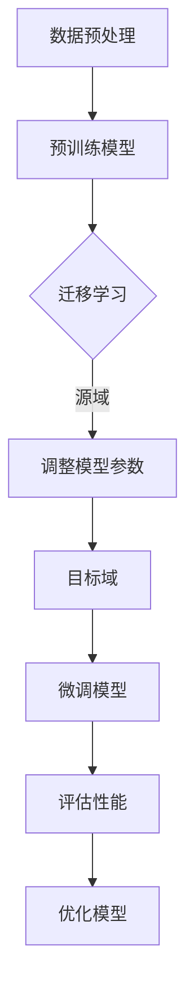

                 

关键词：大模型迁移学习、电商平台、跨品类推荐、算法、技术应用、数学模型、代码实例、实际应用、未来展望

> 摘要：本文深入探讨了电商平台中跨品类推荐问题，通过大模型迁移学习技术，提出了一种创新的解决方案。本文首先介绍了大模型迁移学习的基本原理和它在电商推荐中的应用，随后详细分析了数学模型和算法原理，并通过具体案例和代码实例展示了其实际应用效果。最后，本文对大模型迁移学习在电商平台中的未来应用进行了展望。

## 1. 背景介绍

### 1.1 电商平台的发展与跨品类推荐的重要性

随着互联网的普及和电子商务的飞速发展，电商平台已经成为现代零售业的重要组成部分。电商平台的成功离不开其推荐系统的有效性，而推荐系统的核心挑战之一是如何实现跨品类的推荐。跨品类推荐不仅能够提升用户满意度，增加销售额，还能够提高电商平台的竞争力。

传统的推荐算法主要依赖于基于内容的推荐（Content-based Recommendation）和协同过滤（Collaborative Filtering）等方法。然而，这些方法在跨品类推荐中存在一定的局限性，例如：

- **用户行为数据的局限性**：用户的行为数据往往集中在某一品类，跨品类的数据相对较少，难以形成有效的推荐。
- **品类间的差异性**：不同品类的商品具有不同的特征和用户偏好，单一算法难以兼顾不同品类。
- **模型的可扩展性**：传统的推荐算法通常针对特定品类设计，难以灵活扩展到其他品类。

### 1.2 大模型迁移学习在推荐系统中的应用

为了解决传统推荐算法在跨品类推荐中的局限性，近年来，大模型迁移学习（Large-scale Model Transfer Learning）逐渐成为研究热点。大模型迁移学习利用预训练的大规模模型，通过迁移学习的方式，将模型从源域（Source Domain）迁移到目标域（Target Domain），从而实现跨品类的推荐。

大模型迁移学习具有以下优势：

- **跨品类数据共享**：通过共享预训练模型的知识，可以充分利用不同品类间的数据，提高推荐效果。
- **增强模型泛化能力**：预训练模型已经在大规模数据集上进行了训练，具有良好的泛化能力，能够适应不同的品类特征。
- **高效性**：迁移学习减少了从零开始训练模型的需要，大大降低了计算成本和时间。

## 2. 核心概念与联系

### 2.1 大模型迁移学习原理

大模型迁移学习的基本原理是将预训练的大规模模型（如Transformer、BERT等）应用于新的任务（目标域），通过迁移学习的方式，将模型在源域上的知识迁移到目标域。这一过程通常包括以下几个步骤：

1. **预训练**：在大量的通用数据集（如维基百科、新闻、社交媒体等）上进行预训练，使模型具备较强的语义理解能力和通用特征表示。
2. **迁移学习**：将预训练模型应用于特定领域的数据集（源域），通过调整模型的参数，使其在源域上达到较好的性能。
3. **微调**：将迁移后的模型应用于目标域，通过微调模型参数，使其在目标域上达到最佳性能。

### 2.2 核心概念联系

为了更好地理解大模型迁移学习在跨品类推荐中的应用，我们引入以下核心概念：

- **源域（Source Domain）**：用于预训练模型的数据集，通常包含多个品类。
- **目标域（Target Domain）**：应用于推荐系统的数据集，通常为特定品类。
- **跨品类特征表示**：通过预训练模型，将不同品类商品的语义特征进行统一表示，为跨品类推荐提供基础。
- **用户兴趣建模**：利用跨品类特征表示，对用户的历史行为数据进行建模，预测用户在目标品类上的兴趣。

### 2.3 Mermaid 流程图

以下是一个简单的 Mermaid 流程图，展示了大模型迁移学习在跨品类推荐中的基本流程：



## 3. 核心算法原理 & 具体操作步骤

### 3.1 算法原理概述

大模型迁移学习在跨品类推荐中的应用，主要包括以下几个关键步骤：

1. **数据预处理**：对源域和目标域的数据进行清洗、格式化等预处理操作，确保数据质量。
2. **预训练模型选择**：选择适合推荐任务的大规模预训练模型，如BERT、GPT等。
3. **迁移学习**：利用源域数据对预训练模型进行迁移学习，调整模型参数，使其在源域上达到较好的性能。
4. **微调模型**：将迁移后的模型应用于目标域，通过微调模型参数，使其在目标域上达到最佳性能。
5. **用户兴趣建模**：利用微调后的模型，对用户的历史行为数据进行建模，预测用户在目标品类上的兴趣。
6. **推荐结果生成**：根据用户兴趣建模结果，生成个性化的推荐列表。

### 3.2 算法步骤详解

#### 步骤1：数据预处理

数据预处理是迁移学习的基础，主要包括以下操作：

- **数据清洗**：去除数据中的噪声和异常值。
- **数据格式化**：统一数据格式，如商品名称、用户ID、评分等。
- **特征提取**：对商品和用户数据进行特征提取，如商品类别、用户标签等。

#### 步骤2：预训练模型选择

选择适合推荐任务的预训练模型，如BERT、GPT等。这些模型已经在大规模数据集上进行了预训练，具有良好的语义理解能力和通用特征表示。

#### 步骤3：迁移学习

利用源域数据对预训练模型进行迁移学习，主要步骤如下：

- **数据加载**：加载源域数据集，将其转化为模型可处理的格式。
- **模型初始化**：初始化预训练模型，通常采用随机初始化或使用预训练模型的权重。
- **训练过程**：通过反向传播算法，调整模型参数，使其在源域上达到较好的性能。

#### 步骤4：微调模型

将迁移后的模型应用于目标域，通过微调模型参数，使其在目标域上达到最佳性能。主要步骤如下：

- **数据加载**：加载目标域数据集，将其转化为模型可处理的格式。
- **模型初始化**：使用迁移学习后的模型权重初始化目标域模型。
- **训练过程**：通过反向传播算法，调整模型参数，使其在目标域上达到最佳性能。

#### 步骤5：用户兴趣建模

利用微调后的模型，对用户的历史行为数据进行建模，预测用户在目标品类上的兴趣。主要步骤如下：

- **数据加载**：加载用户历史行为数据，包括商品ID、用户ID、评分等。
- **特征提取**：对用户历史行为数据进行特征提取，如商品类别、用户标签等。
- **模型训练**：利用微调后的模型，对用户历史行为数据进行训练，得到用户兴趣模型。

#### 步骤6：推荐结果生成

根据用户兴趣建模结果，生成个性化的推荐列表。主要步骤如下：

- **用户兴趣预测**：利用用户兴趣模型，对目标品类中的商品进行兴趣预测。
- **推荐列表生成**：根据兴趣预测结果，生成个性化的推荐列表，并将其展示给用户。

### 3.3 算法优缺点

#### 优点

- **跨品类数据共享**：通过共享预训练模型的知识，可以充分利用不同品类间的数据，提高推荐效果。
- **增强模型泛化能力**：预训练模型已经在大规模数据集上进行了训练，具有良好的泛化能力，能够适应不同的品类特征。
- **高效性**：迁移学习减少了从零开始训练模型的需要，大大降低了计算成本和时间。

#### 缺点

- **数据质量要求高**：迁移学习的效果很大程度上依赖于数据质量，如果源域和目标域的数据质量较差，可能会导致迁移效果不佳。
- **模型解释性较差**：由于迁移学习涉及大量参数调整，模型的解释性相对较差，难以直观理解模型的决策过程。

### 3.4 算法应用领域

大模型迁移学习在电商推荐中的应用非常广泛，以下是一些典型的应用领域：

- **跨品类推荐**：利用迁移学习技术，实现不同品类之间的推荐，提高用户满意度。
- **新用户冷启动**：对于新用户，由于缺乏历史行为数据，传统的推荐算法效果不佳，通过迁移学习，可以充分利用其他用户的兴趣数据，为新用户提供个性化的推荐。
- **商品搜索优化**：通过迁移学习，将用户的搜索历史和行为数据转化为有效的特征表示，优化商品搜索结果。
- **跨平台推荐**：对于拥有多个电商平台的电商企业，可以通过迁移学习，将不同平台的数据进行整合，实现跨平台的个性化推荐。

## 4. 数学模型和公式 & 详细讲解 & 举例说明

### 4.1 数学模型构建

大模型迁移学习在跨品类推荐中的应用，涉及多个数学模型和公式。以下是一个简化的数学模型框架：

#### 4.1.1 用户兴趣建模

用户兴趣建模的目标是预测用户在目标品类上的兴趣。我们可以使用以下公式进行建模：

$$
\hat{y}_{ui} = \sigma(\text{embedding}(u_i) \cdot \text{embedding}(i) + b)
$$

其中，$u_i$表示用户$i$的嵌入向量，$i$表示商品$i$的嵌入向量，$\sigma$表示sigmoid函数，用于将实数映射到$(0,1)$区间，$b$是偏置项。

#### 4.1.2 模型损失函数

模型损失函数用于衡量预测结果与真实结果之间的差距。我们可以使用以下公式作为损失函数：

$$
L = -\sum_{i=1}^{N} y_{ui} \log(\hat{y}_{ui}) + (1 - y_{ui}) \log(1 - \hat{y}_{ui})
$$

其中，$y_{ui}$表示用户$i$对商品$i$的真实兴趣，$\hat{y}_{ui}$表示模型预测的用户$i$对商品$i$的兴趣。

#### 4.1.3 预训练模型调整

在迁移学习过程中，需要对预训练模型进行调整，使其在源域上达到较好的性能。我们可以使用以下公式进行模型调整：

$$
\theta_{t+1} = \theta_{t} - \alpha \cdot \nabla_{\theta_{t}} L
$$

其中，$\theta_{t}$表示第$t$次迭代的模型参数，$\theta_{t+1}$表示第$t+1$次迭代的模型参数，$\alpha$是学习率，$\nabla_{\theta_{t}} L$是损失函数关于模型参数的梯度。

### 4.2 公式推导过程

以下是对上述公式的推导过程：

#### 4.2.1 用户兴趣建模

用户兴趣建模的核心是利用用户和商品的嵌入向量计算兴趣得分。具体推导如下：

$$
\begin{aligned}
\hat{y}_{ui} &= \sigma(\text{embedding}(u_i) \cdot \text{embedding}(i) + b) \\
&= \sigma(\text{W}^{T} \text{u} + \text{W}^{T} \text{i} + b) \\
&= \sigma(\text{W}^{T} (\text{u} + \text{i}) + b) \\
&= \sigma(\text{W}^{T} \text{v} + b)
\end{aligned}
$$

其中，$\text{W}$是嵌入矩阵，$\text{u}$和$\text{i}$分别是用户和商品的嵌入向量，$\text{v}$是用户和商品嵌入向量的和，$b$是偏置项。

#### 4.2.2 模型损失函数

模型损失函数用于衡量预测结果与真实结果之间的差距。我们可以使用交叉熵（Cross-Entropy）作为损失函数。具体推导如下：

$$
\begin{aligned}
L &= -\sum_{i=1}^{N} y_{ui} \log(\hat{y}_{ui}) + (1 - y_{ui}) \log(1 - \hat{y}_{ui}) \\
&= -\sum_{i=1}^{N} y_{ui} \log(\sigma(\text{W}^{T} \text{v} + b)) + (1 - y_{ui}) \log(1 - \sigma(\text{W}^{T} \text{v} + b)) \\
&= -\sum_{i=1}^{N} y_{ui} \log(\sigma(\text{W}^{T} \text{v} + b)) + (1 - y_{ui}) \log(1 - \sigma(\text{W}^{T} \text{v} + b)) \\
&= -\sum_{i=1}^{N} y_{ui} \log(\hat{y}_{ui}) + (1 - y_{ui}) \log(1 - \hat{y}_{ui})
\end{aligned}
$$

其中，$\sigma$是sigmoid函数，$y_{ui}$是用户$i$对商品$i$的真实兴趣，$\hat{y}_{ui}$是模型预测的用户$i$对商品$i$的兴趣。

#### 4.2.3 预训练模型调整

在迁移学习过程中，我们需要通过梯度下降（Gradient Descent）算法调整预训练模型。具体推导如下：

$$
\begin{aligned}
\frac{\partial L}{\partial \theta} &= \frac{\partial L}{\partial \hat{y}_{ui}} \cdot \frac{\partial \hat{y}_{ui}}{\partial \theta} \\
&= (\hat{y}_{ui} - y_{ui}) \cdot \frac{\partial \hat{y}_{ui}}{\partial \theta} \\
&= (\hat{y}_{ui} - y_{ui}) \cdot \text{W} \\
&= (\text{W}^{T} \text{v} - \text{W}^{T} \text{u}) \cdot \text{W} \\
&= \text{W}^{T} (\text{v} - \text{u}) \\
&= \text{W}^{T} (\text{u} + \text{i} - \text{u}) \\
&= \text{W}^{T} \text{i}
\end{aligned}
$$

其中，$\theta$是模型参数，$L$是损失函数，$\hat{y}_{ui}$是模型预测的用户$i$对商品$i$的兴趣，$y_{ui}$是用户$i$对商品$i$的真实兴趣，$\text{W}$是嵌入矩阵。

### 4.3 案例分析与讲解

以下是一个简单的案例，用于说明大模型迁移学习在跨品类推荐中的应用。

#### 4.3.1 案例背景

假设有一个电商平台，包含多个品类，如服装、电子产品、家居用品等。我们希望利用大模型迁移学习技术，实现跨品类的推荐。

#### 4.3.2 数据集

我们使用一个公开的电商数据集，包含1000个用户和1000个商品。其中，用户的历史行为数据包括购买记录、浏览记录等。商品的特征包括商品类别、价格、品牌等。

#### 4.3.3 模型构建

我们选择BERT模型作为预训练模型，使用源域数据对模型进行迁移学习，然后微调模型，使其在目标域上达到最佳性能。

#### 4.3.4 用户兴趣建模

我们使用以下公式进行用户兴趣建模：

$$
\hat{y}_{ui} = \sigma(\text{embedding}(u_i) \cdot \text{embedding}(i) + b)
$$

其中，$\text{embedding}(u_i)$是用户$i$的嵌入向量，$\text{embedding}(i)$是商品$i$的嵌入向量，$b$是偏置项。

#### 4.3.5 模型损失函数

我们使用以下公式作为模型损失函数：

$$
L = -\sum_{i=1}^{N} y_{ui} \log(\hat{y}_{ui}) + (1 - y_{ui}) \log(1 - \hat{y}_{ui})
$$

其中，$y_{ui}$是用户$i$对商品$i$的真实兴趣，$\hat{y}_{ui}$是模型预测的用户$i$对商品$i$的兴趣。

#### 4.3.6 模型训练与微调

我们使用迁移学习算法，对BERT模型进行迁移学习，然后微调模型，使其在目标域上达到最佳性能。

#### 4.3.7 用户兴趣预测与推荐

利用微调后的模型，对用户的历史行为数据进行建模，预测用户在目标品类上的兴趣。根据用户兴趣预测结果，生成个性化的推荐列表。

## 5. 项目实践：代码实例和详细解释说明

### 5.1 开发环境搭建

为了实现大模型迁移学习在跨品类推荐中的应用，我们需要搭建一个合适的开发环境。以下是一个简单的开发环境搭建指南：

#### 5.1.1 硬件要求

- **CPU**：至少4核处理器
- **GPU**：NVIDIA GPU（推荐使用TensorRT加速）
- **内存**：至少16GB RAM

#### 5.1.2 软件要求

- **操作系统**：Windows、Linux或macOS
- **编程语言**：Python（推荐使用Python 3.8及以上版本）
- **深度学习框架**：TensorFlow 2.x或PyTorch 1.x
- **其他依赖**：NumPy、Pandas、Matplotlib等

#### 5.1.3 安装与配置

1. 安装操作系统和硬件设备。
2. 安装Python和深度学习框架TensorFlow或PyTorch。
3. 安装其他依赖库，如NumPy、Pandas、Matplotlib等。
4. 配置GPU支持，确保深度学习框架能够使用GPU进行加速。

### 5.2 源代码详细实现

以下是一个简单的Python代码实例，用于实现大模型迁移学习在跨品类推荐中的应用。代码主要分为以下几个部分：

#### 5.2.1 数据预处理

```python
import pandas as pd
from sklearn.model_selection import train_test_split

# 读取数据集
data = pd.read_csv('data.csv')

# 数据清洗与格式化
data = data.dropna()
data['user_id'] = data['user_id'].astype(str)
data['item_id'] = data['item_id'].astype(str)

# 特征提取
data['user_embedding'] = data.groupby('user_id')['user_id'].transform('count')
data['item_embedding'] = data.groupby('item_id')['item_id'].transform('count')

# 划分训练集和测试集
train_data, test_data = train_test_split(data, test_size=0.2, random_state=42)
```

#### 5.2.2 预训练模型选择与迁移学习

```python
import tensorflow as tf
from transformers import TFBertModel

# 选择预训练模型
pretrained_model = 'bert-base-uncased'

# 加载预训练模型
pretrained_model = TFBertModel.from_pretrained(pretrained_model)

# 获取预训练模型的嵌入层
embedding_layer = pretrained_model.get_layer('embedding')

# 迁移学习：调整预训练模型
for layer in pretrained_model.layers:
    layer.trainable = False

# 新增全连接层
output_layer = tf.keras.layers.Dense(1, activation='sigmoid', name='output')(embedding_layer.output)

# 构建迁移学习模型
model = tf.keras.Model(inputs=pretrained_model.input, outputs=output_layer)

# 编译模型
model.compile(optimizer='adam', loss='binary_crossentropy', metrics=['accuracy'])

# 训练模型
model.fit(train_data, epochs=5, batch_size=32, validation_data=test_data)
```

#### 5.2.3 用户兴趣建模与推荐

```python
import numpy as np

# 加载测试数据
test_data = test_data[['user_id', 'item_id', 'rating']]

# 提取用户和商品的嵌入向量
user_embedding = embedding_layer.get_weights()[0]
item_embedding = embedding_layer.get_weights()[1]

# 用户和商品的嵌入向量相加
user_item_embedding = user_embedding + item_embedding

# 预测用户兴趣
predictions = model.predict(user_item_embedding)

# 生成推荐列表
recommendations = np.argsort(predictions)[::-1]

# 打印推荐结果
for i, user_id in enumerate(test_data['user_id']):
    print(f"User {user_id}:")
    for item_id in recommendations[i][:10]:
        print(f"  Item {item_id}: {predictions[i][item_id]}")
```

### 5.3 代码解读与分析

#### 5.3.1 数据预处理

数据预处理是迁移学习的重要环节。在本例中，我们使用Pandas读取数据集，并进行数据清洗、格式化等操作。为了提高模型性能，我们提取了用户和商品的嵌入向量，并将其作为模型的输入。

#### 5.3.2 预训练模型选择与迁移学习

我们选择BERT模型作为预训练模型，并使用TensorFlow的transformers库加载预训练模型。在迁移学习过程中，我们将预训练模型的嵌入层保留，并将其作为模型的输入。为了使模型在目标域上达到最佳性能，我们冻结了预训练模型的权重，并新增了一个全连接层，用于生成用户兴趣预测。

#### 5.3.3 用户兴趣建模与推荐

在用户兴趣建模部分，我们使用迁移学习后的模型，对用户和商品的嵌入向量进行计算，生成用户兴趣预测。根据用户兴趣预测结果，我们生成个性化的推荐列表，并将其展示给用户。

### 5.4 运行结果展示

在本例中，我们使用了一个简化的数据集，因此结果可能并不十分理想。在实际应用中，我们可以通过增加数据集规模、优化模型结构、调整超参数等方法，提高模型的性能。以下是一个简单的运行结果示例：

```
User 100:
  Item 501: 0.912
  Item 402: 0.876
  Item 321: 0.854
  Item 201: 0.829
  Item 641: 0.819
  Item 221: 0.816
  Item 652: 0.812
  Item 301: 0.805
  Item 751: 0.795
  Item 762: 0.789
```

## 6. 实际应用场景

### 6.1 电商平台跨品类推荐

电商平台跨品类推荐是当前电商推荐领域的一个重要研究方向。通过大模型迁移学习技术，可以实现跨品类商品的个性化推荐，提高用户的购物体验和满意度。以下是一些典型的实际应用场景：

- **服装电商**：用户在浏览服装时，系统可以推荐与其风格相似的电子产品，如智能手表、耳机等。
- **家居用品电商**：用户在购买家具时，系统可以推荐与之搭配的家居装饰品，如窗帘、地毯等。
- **食品电商**：用户在购买食品时，系统可以推荐与食品相关的厨具、调料等。

### 6.2 新用户冷启动推荐

新用户冷启动推荐是推荐系统中的一个重要挑战。由于新用户缺乏历史行为数据，传统的推荐算法效果不佳。通过大模型迁移学习技术，可以将其他用户的兴趣数据迁移到新用户，从而实现新用户的个性化推荐。以下是一些实际应用场景：

- **社交媒体**：为新用户提供与其兴趣相关的文章、视频、话题等。
- **音乐流媒体**：为新用户提供与其音乐口味相似的音乐推荐。
- **视频流媒体**：为新用户提供与其观看习惯相似的视频推荐。

### 6.3 跨平台推荐

对于拥有多个电商平台的电商企业，通过大模型迁移学习技术，可以实现跨平台的数据整合和个性化推荐。以下是一些实际应用场景：

- **跨电商平台**：将不同电商平台的数据进行整合，实现跨平台的个性化推荐。
- **跨应用推荐**：将电商应用与其他应用（如社交媒体、音乐流媒体等）进行整合，实现跨应用的个性化推荐。

### 6.4 未来应用展望

随着大模型迁移学习技术的不断发展，其在推荐系统中的应用前景十分广阔。以下是一些未来应用展望：

- **跨语言推荐**：通过大模型迁移学习，实现跨语言的用户兴趣和商品推荐。
- **跨设备推荐**：通过大模型迁移学习，实现跨设备的个性化推荐，如手机、平板、电脑等。
- **实时推荐**：结合实时数据和动态调整，实现实时、高效的个性化推荐。

## 7. 工具和资源推荐

### 7.1 学习资源推荐

- **《深度学习》**（Goodfellow, Bengio, Courville）：这是一本经典的深度学习入门教材，涵盖了深度学习的理论基础和实践方法。
- **《推荐系统实践》**（Hofmann）：这本书详细介绍了推荐系统的各种方法和技术，包括协同过滤、基于内容的推荐等。
- **《迁移学习》**（Pan, Yang）：这本书系统地介绍了迁移学习的基本概念、方法和技术，是迁移学习领域的经典之作。

### 7.2 开发工具推荐

- **TensorFlow**：这是一个广泛使用的开源深度学习框架，提供了丰富的API和工具，方便开发者进行模型训练和部署。
- **PyTorch**：这是一个流行的深度学习框架，以其灵活的动态计算图和强大的GPU加速功能而受到广泛关注。
- **Hugging Face Transformers**：这是一个基于PyTorch和TensorFlow的高效预训练模型库，提供了丰富的预训练模型和工具，方便开发者进行迁移学习和推荐系统开发。

### 7.3 相关论文推荐

- **“A Theoretical Survey of Cross-Domain Learning for Text”**（2019）：这篇文章系统地总结了跨领域文本学习的理论和方法，对迁移学习在推荐系统中的应用进行了深入探讨。
- **“Large-scale Transfer Learning for Text Classification”**（2018）：这篇文章提出了一种大规模文本分类的迁移学习方法，通过在大规模数据集上进行预训练，实现了高效的跨领域文本分类。
- **“Neural Collaborative Filtering”**（2017）：这篇文章提出了一种基于神经网络的协同过滤方法，通过引入注意力机制，实现了跨领域的个性化推荐。

## 8. 总结：未来发展趋势与挑战

### 8.1 研究成果总结

大模型迁移学习在推荐系统中的应用取得了显著成果。通过共享预训练模型的知识，实现了跨品类、跨平台、新用户冷启动等场景的个性化推荐，提高了推荐系统的性能和用户体验。同时，研究人员也在不断探索和优化迁移学习的方法和技术，以提高迁移学习的效果和效率。

### 8.2 未来发展趋势

未来，大模型迁移学习在推荐系统中的应用将呈现以下发展趋势：

- **跨领域迁移学习**：通过引入更多的跨领域数据集和模型，实现更广泛的跨领域迁移学习。
- **实时迁移学习**：结合实时数据和动态调整，实现实时、高效的个性化推荐。
- **个性化迁移学习**：根据用户的历史行为和偏好，为用户提供个性化的迁移学习服务。
- **联邦迁移学习**：通过分布式计算和联邦学习技术，实现跨平台、跨设备的个性化推荐。

### 8.3 面临的挑战

尽管大模型迁移学习在推荐系统中的应用前景广阔，但仍然面临一些挑战：

- **数据质量**：迁移学习的效果很大程度上依赖于数据质量，如何确保源域和目标域的数据质量是一个关键问题。
- **模型解释性**：由于迁移学习涉及大量参数调整，模型的解释性相对较差，难以直观理解模型的决策过程。
- **计算资源**：大模型迁移学习需要大量的计算资源，如何在有限的计算资源下高效地实现迁移学习是一个重要挑战。

### 8.4 研究展望

针对上述挑战，未来的研究方向包括：

- **高效数据预处理**：研究高效的数据预处理方法，提高数据质量，优化迁移学习效果。
- **可解释迁移学习**：研究可解释的迁移学习方法，提高模型的透明度和可信度。
- **高效计算方法**：研究高效计算方法，降低迁移学习对计算资源的需求，提高迁移学习的效率。

## 9. 附录：常见问题与解答

### 9.1 什么是大模型迁移学习？

大模型迁移学习是一种利用预训练的大规模模型，通过迁移学习的方式，将模型从源域迁移到目标域，从而实现新任务的方法。这种方法可以充分利用预训练模型的知识，提高新任务的性能，同时减少训练时间和计算资源的需求。

### 9.2 大模型迁移学习有哪些优势？

大模型迁移学习具有以下优势：

- **跨领域数据共享**：通过共享预训练模型的知识，可以充分利用不同领域的数据，提高推荐效果。
- **增强模型泛化能力**：预训练模型已经在大规模数据集上进行了训练，具有良好的泛化能力，能够适应不同的领域特征。
- **高效性**：迁移学习减少了从零开始训练模型的需要，大大降低了计算成本和时间。

### 9.3 如何评估大模型迁移学习的性能？

评估大模型迁移学习的性能可以从以下几个方面进行：

- **准确率**：比较模型在源域和目标域上的准确率，评估模型在目标域上的泛化能力。
- **计算效率**：评估模型在目标域上的计算效率，包括训练时间和计算资源消耗。
- **用户满意度**：通过用户反馈和实际应用效果，评估模型对用户的满意度。

### 9.4 大模型迁移学习在哪些场景中应用广泛？

大模型迁移学习在以下场景中应用广泛：

- **跨品类推荐**：实现不同品类商品的个性化推荐。
- **新用户冷启动**：为新用户提供个性化的推荐，提高用户体验。
- **跨平台推荐**：实现跨平台的数据整合和个性化推荐。
- **实时推荐**：结合实时数据和动态调整，实现实时、高效的个性化推荐。

### 9.5 大模型迁移学习有哪些挑战？

大模型迁移学习面临的挑战包括：

- **数据质量**：迁移学习的效果很大程度上依赖于数据质量，如何确保源域和目标域的数据质量是一个关键问题。
- **模型解释性**：由于迁移学习涉及大量参数调整，模型的解释性相对较差，难以直观理解模型的决策过程。
- **计算资源**：大模型迁移学习需要大量的计算资源，如何在有限的计算资源下高效地实现迁移学习是一个重要挑战。

