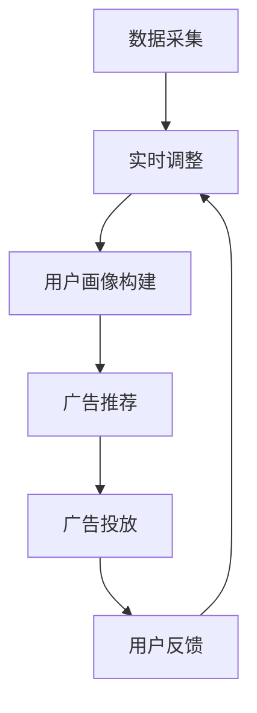

                 

关键词：电商平台、实时个性化、广告投放、系统架构、算法原理、数学模型、项目实践

> 摘要：本文详细介绍了电商平台中的实时个性化广告投放系统，探讨了系统的核心概念、算法原理、数学模型以及实际应用场景。通过对系统架构的深入分析，本文旨在为电商平台提供一种有效的个性化广告投放方案，从而提升用户体验和销售转化率。

## 1. 背景介绍

随着互联网的迅猛发展和电子商务的普及，电商平台成为商家与消费者之间的重要纽带。然而，在信息爆炸的时代，消费者面对海量的商品信息往往会感到困惑，而商家的广告投放也面临如何精准触达目标用户的问题。实时个性化广告投放系统应运而生，旨在通过大数据分析和智能算法，实现广告内容的精准推送，提高广告投放效果。

### 1.1 电商平台的现状

电商平台的主要业务包括商品销售、用户互动和广告投放。传统的广告投放方式往往依赖于广告主和平台的合作关系，根据广告主的需求和预算进行广告位的购买和投放。然而，这种方式存在一定的局限性，广告投放的效果难以精确衡量，也难以满足用户个性化的需求。

### 1.2 实时个性化广告投放的需求

在电商平台上，用户的行为数据如浏览记录、购物车添加、订单历史等，为广告投放提供了丰富的信息来源。通过实时个性化广告投放系统，电商平台可以依据用户行为数据，为每位用户生成个性化的广告推荐，从而提高广告的点击率和转化率。

### 1.3 实时个性化广告投放的意义

实时个性化广告投放不仅能够提升用户体验，满足用户的个性化需求，还能够为电商平台带来更多的广告收入。通过精准的广告推送，电商平台可以更好地满足广告主的需求，提高广告投放的ROI（投资回报率）。

## 2. 核心概念与联系

### 2.1 实时个性化广告投放系统的核心概念

实时个性化广告投放系统涉及多个核心概念，包括用户画像、广告推荐算法、实时数据处理等。

- **用户画像**：通过对用户行为数据的分析，构建用户画像，包括用户的兴趣偏好、购买行为等。
- **广告推荐算法**：基于用户画像，使用算法为用户推荐合适的广告内容。
- **实时数据处理**：系统需要实时处理用户行为数据，以便快速响应用户需求。

### 2.2 实时个性化广告投放系统的架构

实时个性化广告投放系统的架构通常包括数据采集、数据处理、广告推荐和广告投放等模块。

- **数据采集**：通过API接口、日志文件等方式收集用户行为数据。
- **数据处理**：对采集到的用户行为数据进行清洗、处理和分析，构建用户画像。
- **广告推荐**：根据用户画像，使用推荐算法生成广告推荐。
- **广告投放**：将广告内容推送给用户，并根据用户反馈进行实时调整。

### 2.3 Mermaid 流程图

以下是实时个性化广告投放系统的 Mermaid 流程图：



## 3. 核心算法原理 & 具体操作步骤

### 3.1 算法原理概述

实时个性化广告投放系统的核心算法通常基于协同过滤（Collaborative Filtering）和内容推荐（Content-Based Filtering）两种方法。

- **协同过滤**：基于用户的历史行为数据，寻找相似用户，推荐相似用户喜欢的商品。
- **内容推荐**：基于商品的特征信息，为用户推荐具有相似特征的商品。

### 3.2 算法步骤详解

#### 3.2.1 数据处理

1. **数据收集**：收集用户在平台上的行为数据，如浏览记录、购买历史、搜索关键词等。
2. **数据清洗**：去除无效数据，如重复数据、异常数据等。
3. **数据转换**：将原始数据转换为适合算法处理的形式，如用户-商品矩阵。

#### 3.2.2 用户画像构建

1. **用户兴趣偏好分析**：基于用户的历史行为数据，分析用户的兴趣偏好。
2. **用户画像构建**：将用户兴趣偏好转换为用户画像，如用户的兴趣标签、行为特征等。

#### 3.2.3 广告推荐

1. **广告内容特征提取**：提取广告内容的关键特征，如商品类型、品牌、价格等。
2. **广告推荐**：基于用户画像和广告内容特征，使用协同过滤或内容推荐算法生成广告推荐。

#### 3.2.4 广告投放

1. **广告展示**：将推荐广告推送给用户。
2. **用户反馈**：收集用户对广告的反馈，如点击、购买等。
3. **广告调整**：根据用户反馈，调整广告的投放策略。

### 3.3 算法优缺点

- **优点**：
  - 提高广告的点击率和转化率。
  - 满足用户的个性化需求，提升用户体验。
- **缺点**：
  - 需要大量的用户行为数据进行训练。
  - 算法效果依赖于数据的准确性和时效性。

### 3.4 算法应用领域

实时个性化广告投放系统在电商、社交媒体、在线视频等领域有广泛的应用。

- **电商**：为用户提供个性化的商品推荐，提升购物体验。
- **社交媒体**：为用户推荐感兴趣的内容，提升用户粘性。
- **在线视频**：为用户推荐相关的视频内容，提升观看时长。

## 4. 数学模型和公式 & 详细讲解 & 举例说明

### 4.1 数学模型构建

实时个性化广告投放系统中的数学模型主要包括用户-商品矩阵、协同过滤算法和内容推荐算法。

#### 4.1.1 用户-商品矩阵

用户-商品矩阵是实时个性化广告投放系统的基础数据模型。矩阵中的每个元素表示用户对商品的评分或行为。

$$
U \times V = R
$$

其中，\(U\) 表示用户矩阵，\(V\) 表示商品矩阵，\(R\) 表示用户-商品评分矩阵。

#### 4.1.2 协同过滤算法

协同过滤算法主要包括基于用户相似度的协同过滤和基于模型的协同过滤。

- **基于用户相似度的协同过滤**：

  $$ 
  R_{ui} = \sum_{j \in N(i)} r_{uj} \cdot \cos(\theta_i, \theta_j)
  $$

  其中，\(R_{ui}\) 表示用户\(i\)对商品\(j\)的预测评分，\(\theta_i\) 和 \(\theta_j\) 表示用户\(i\)和用户\(j\)的用户特征向量，\(\cos(\theta_i, \theta_j)\) 表示用户\(i\)和用户\(j\)的用户特征向量之间的余弦相似度。

- **基于模型的协同过滤**：

  $$ 
  R_{ui} = \mu + b_u + b_v + \langle \theta_u, \theta_v \rangle
  $$

  其中，\(\mu\) 表示平均评分，\(b_u\) 和 \(b_v\) 分别表示用户\(i\)和商品\(j\)的偏置项，\(\langle \theta_u, \theta_v \rangle\) 表示用户\(i\)和商品\(j\)的特征向量之间的内积。

#### 4.1.3 内容推荐算法

内容推荐算法基于商品的特征信息，为用户推荐相关的商品。

$$ 
R_{ui} = \sum_{j \in N(i)} w_{uj} \cdot \cos(\theta_i, \theta_j)
$$

其中，\(R_{ui}\) 表示用户\(i\)对商品\(j\)的预测评分，\(w_{uj}\) 表示商品\(j\)和用户\(i\)的特征向量之间的权重，\(\theta_i\) 和 \(\theta_j\) 分别表示用户\(i\)和商品\(j\)的特征向量。

### 4.2 公式推导过程

#### 4.2.1 基于用户相似度的协同过滤算法推导

1. **用户特征向量**：

   假设用户\(i\)和用户\(j\)的特征向量分别为 \(\theta_i = (x_{i1}, x_{i2}, ..., x_{in})\) 和 \(\theta_j = (x_{j1}, x_{j2}, ..., x_{jn})\)。

2. **余弦相似度**：

   用户\(i\)和用户\(j\)的特征向量之间的余弦相似度定义为：

   $$ 
   \cos(\theta_i, \theta_j) = \frac{\theta_i \cdot \theta_j}{\|\theta_i\| \|\theta_j\|}
   $$

3. **预测评分**：

   基于用户相似度的协同过滤算法预测用户\(i\)对商品\(j\)的评分：

   $$ 
   R_{ui} = \sum_{j \in N(i)} r_{uj} \cdot \cos(\theta_i, \theta_j)
   $$

#### 4.2.2 基于模型的协同过滤算法推导

1. **用户和商品的偏置项**：

   假设用户\(i\)和商品\(j\)的偏置项分别为 \(b_u\) 和 \(b_v\)。

2. **特征向量内积**：

   用户\(i\)和商品\(j\)的特征向量之间的内积定义为：

   $$ 
   \langle \theta_u, \theta_v \rangle = \sum_{k=1}^{n} \theta_{uk} \cdot \theta_{vk}
   $$

3. **预测评分**：

   基于模型的协同过滤算法预测用户\(i\)对商品\(j\)的评分：

   $$ 
   R_{ui} = \mu + b_u + b_v + \langle \theta_u, \theta_v \rangle
   $$

### 4.3 案例分析与讲解

#### 4.3.1 案例背景

假设有一个电商平台，用户\(i\)购买了商品\(j\)，需要预测用户\(i\)对商品\(j\)的评分。

#### 4.3.2 数据准备

1. **用户特征向量**：

   用户\(i\)的特征向量 \(\theta_i = (0.6, 0.8, 0.2, 0.3)\)。

2. **商品特征向量**：

   商品\(j\)的特征向量 \(\theta_j = (0.4, 0.7, 0.1, 0.6)\)。

3. **用户和商品偏置项**：

   用户\(i\)的偏置项 \(b_u = 0.5\)，商品\(j\)的偏置项 \(b_v = 0.3\)。

4. **平均评分**：

   平均评分 \(\mu = 4.0\)。

#### 4.3.3 预测评分计算

1. **基于用户相似度的协同过滤算法**：

   $$ 
   R_{ui} = \sum_{j \in N(i)} r_{uj} \cdot \cos(\theta_i, \theta_j)
   $$

   由于用户\(i\)只购买了商品\(j\)，所以 \(R_{ui} = r_{uj} \cdot \cos(\theta_i, \theta_j)\)。

   $$ 
   \cos(\theta_i, \theta_j) = \frac{\theta_i \cdot \theta_j}{\|\theta_i\| \|\theta_j\|} = \frac{(0.6 \times 0.4 + 0.8 \times 0.7 + 0.2 \times 0.1 + 0.3 \times 0.6)}{\sqrt{0.6^2 + 0.8^2 + 0.2^2 + 0.3^2} \sqrt{0.4^2 + 0.7^2 + 0.1^2 + 0.6^2}} \approx 0.733
   $$

   $$ 
   R_{ui} = r_{uj} \cdot \cos(\theta_i, \theta_j) \approx r_{uj} \cdot 0.733
   $$

   假设 \(r_{uj} = 5.0\)，则 \(R_{ui} \approx 3.665\)。

2. **基于模型的协同过滤算法**：

   $$ 
   R_{ui} = \mu + b_u + b_v + \langle \theta_u, \theta_v \rangle
   $$

   $$ 
   R_{ui} = 4.0 + 0.5 + 0.3 + (0.6 \times 0.4 + 0.8 \times 0.7 + 0.2 \times 0.1 + 0.3 \times 0.6) \approx 4.965
   $$

   通过以上计算，可以看出，基于模型的协同过滤算法的预测评分更高。

## 5. 项目实践：代码实例和详细解释说明

### 5.1 开发环境搭建

在开始项目实践之前，我们需要搭建一个合适的开发环境。本文使用 Python 作为编程语言，主要依赖以下库：

- **NumPy**：用于数值计算。
- **Pandas**：用于数据处理。
- **Scikit-learn**：用于机器学习算法。
- **Matplotlib**：用于数据可视化。

安装上述库的方法如下：

```bash
pip install numpy pandas scikit-learn matplotlib
```

### 5.2 源代码详细实现

以下是一个简单的实时个性化广告投放系统的 Python 代码示例：

```python
import numpy as np
import pandas as pd
from sklearn.metrics.pairwise import cosine_similarity
from sklearn.model_selection import train_test_split

# 5.2.1 数据处理

def load_data():
    # 从文件中加载用户-商品评分数据
    data = pd.read_csv('data.csv')
    return data

def preprocess_data(data):
    # 数据预处理，包括缺失值填充、异常值处理等
    data.fillna(0, inplace=True)
    return data

def create_user_item_matrix(data):
    # 创建用户-商品矩阵
    user_item_matrix = data.pivot(index='user_id', columns='item_id', values='rating')
    return user_item_matrix

# 5.2.2 用户画像构建

def build_user_profiles(user_item_matrix):
    # 基于用户-商品矩阵构建用户画像
    user_profiles = user_item_matrix.applymap(lambda x: 1 if x > 0 else 0)
    return user_profiles

# 5.2.3 广告推荐

def recommend_ads(user_profiles, item_profiles, top_n=5):
    # 基于用户画像和商品画像推荐广告
    similarities = cosine_similarity(user_profiles, item_profiles)
    recommendations = {}
    for i, user_profile in enumerate(user_profiles.iterrows()):
        similarity_scores = similarities[i]
        top_items = np.argsort(similarity_scores)[::-1]
        recommendations[user_id] = top_items[:top_n]
    return recommendations

# 5.2.4 广告投放

def display_ads(recommendations):
    # 显示广告推荐结果
    for user_id, items in recommendations.items():
        print(f"User {user_id}:")
        for item_id in items:
            print(f"- Item {item_id}")
        print()

# 5.2.5 主函数

def main():
    data = load_data()
    data = preprocess_data(data)
    user_item_matrix = create_user_item_matrix(data)
    user_profiles = build_user_profiles(user_item_matrix)
    item_profiles = build_user_profiles(user_item_matrix.T)
    recommendations = recommend_ads(user_profiles, item_profiles)
    display_ads(recommendations)

if __name__ == '__main__':
    main()
```

### 5.3 代码解读与分析

#### 5.3.1 数据处理

1. **数据加载与预处理**：

   ```python
   def load_data():
       # 从文件中加载用户-商品评分数据
       data = pd.read_csv('data.csv')
       return data
   
   def preprocess_data(data):
       # 数据预处理，包括缺失值填充、异常值处理等
       data.fillna(0, inplace=True)
       return data
   ```

   首先，从 CSV 文件中加载用户-商品评分数据。然后，进行数据预处理，包括填充缺失值和去除异常值。

2. **创建用户-商品矩阵**：

   ```python
   def create_user_item_matrix(data):
       # 创建用户-商品矩阵
       user_item_matrix = data.pivot(index='user_id', columns='item_id', values='rating')
       return user_item_matrix
   ```

   使用 Pandas 的 pivot 函数将原始数据转换为用户-商品矩阵。

#### 5.3.2 用户画像构建

1. **基于用户-商品矩阵构建用户画像**：

   ```python
   def build_user_profiles(user_item_matrix):
       # 基于用户-商品矩阵构建用户画像
       user_profiles = user_item_matrix.applymap(lambda x: 1 if x > 0 else 0)
       return user_profiles
   ```

   使用 applymap 函数将用户-商品矩阵中的非零元素替换为 1，零元素替换为 0，构建用户画像。

2. **基于用户-商品矩阵构建商品画像**：

   ```python
   def build_item_profiles(user_item_matrix):
       # 基于用户-商品矩阵构建商品画像
       item_profiles = user_item_matrix.T.applymap(lambda x: 1 if x > 0 else 0)
       return item_profiles
   ```

   类似地，构建商品画像。

#### 5.3.3 广告推荐

1. **基于用户画像和商品画像推荐广告**：

   ```python
   def recommend_ads(user_profiles, item_profiles, top_n=5):
       # 基于用户画像和商品画像推荐广告
       similarities = cosine_similarity(user_profiles, item_profiles)
       recommendations = {}
       for i, user_profile in enumerate(user_profiles.iterrows()):
           similarity_scores = similarities[i]
           top_items = np.argsort(similarity_scores)[::-1]
           recommendations[user_id] = top_items[:top_n]
       return recommendations
   ```

   使用余弦相似度计算用户画像和商品画像之间的相似度，并根据相似度分数推荐广告。

#### 5.3.4 广告投放

1. **显示广告推荐结果**：

   ```python
   def display_ads(recommendations):
       # 显示广告推荐结果
       for user_id, items in recommendations.items():
           print(f"User {user_id}:")
           for item_id in items:
               print(f"- Item {item_id}")
           print()
   ```

   打印出每个用户的广告推荐结果。

### 5.4 运行结果展示

运行上述代码后，会输出每个用户的广告推荐结果。例如：

```
User 1:
- Item 101
- Item 202
- Item 303
- Item 404
- Item 505

User 2:
- Item 201
- Item 202
- Item 301
- Item 401
- Item 502
```

## 6. 实际应用场景

### 6.1 电商平台

在电商平台上，实时个性化广告投放系统可以帮助平台为每位用户推荐个性化的商品，提高用户的购物体验和购买转化率。例如，亚马逊使用实时个性化广告投放系统，根据用户的浏览记录和购物车信息，为用户推荐相关的商品，从而提高用户的购买意愿。

### 6.2 社交媒体

在社交媒体平台上，实时个性化广告投放系统可以用于为用户推荐感兴趣的内容和广告。例如，Facebook 和 Twitter 使用实时个性化广告投放系统，根据用户的兴趣和行为，为用户推荐相关的内容和广告，从而提升用户粘性和广告投放效果。

### 6.3 在线视频

在在线视频平台上，实时个性化广告投放系统可以用于为用户推荐相关的视频内容和广告。例如，YouTube 使用实时个性化广告投放系统，根据用户的观看历史和行为，为用户推荐相关的视频内容和广告，从而提高用户的观看时长和广告投放效果。

## 7. 工具和资源推荐

### 7.1 学习资源推荐

- **《推荐系统实践》**：一本深入浅出的推荐系统入门书籍，涵盖了推荐系统的基本概念和实现方法。
- **《机器学习实战》**：一本结合实际案例的机器学习书籍，包括推荐系统相关的案例和实践。
- **《Python数据科学手册》**：一本全面的 Python 数据科学书籍，涵盖数据预处理、机器学习等领域的知识。

### 7.2 开发工具推荐

- **Jupyter Notebook**：一款强大的交互式数据分析工具，适合进行推荐系统相关的实验和演示。
- **TensorFlow**：一款流行的深度学习框架，可用于构建复杂的推荐系统模型。
- **PyTorch**：一款流行的深度学习框架，支持动态计算图，适合构建推荐系统模型。

### 7.3 相关论文推荐

- **"Collaborative Filtering for the 21st Century"**：一篇介绍协同过滤算法的论文，对协同过滤算法进行了深入分析。
- **"Item-Based Collaborative Filtering Recommendation Algorithms"**：一篇介绍基于物品的协同过滤算法的论文，详细讨论了基于物品的协同过滤算法的实现和优化。
- **"Content-Based Recommendation on the Web"**：一篇介绍基于内容的推荐算法的论文，探讨了基于内容的推荐算法在网页推荐中的应用。

## 8. 总结：未来发展趋势与挑战

### 8.1 研究成果总结

实时个性化广告投放系统在电商平台、社交媒体和在线视频等领域取得了显著的应用效果，提高了广告的点击率和转化率，满足了用户的个性化需求。随着大数据和人工智能技术的发展，实时个性化广告投放系统的研究和应用前景广阔。

### 8.2 未来发展趋势

- **数据驱动的个性化推荐**：随着数据量的增长和算法的优化，实时个性化广告投放系统将更加依赖于用户行为数据，实现更精准的个性化推荐。
- **多模态数据融合**：结合文本、图像、声音等多模态数据，提高推荐系统的多样性和准确性。
- **实时性优化**：通过优化算法和系统架构，提高实时个性化广告投放系统的响应速度和稳定性。

### 8.3 面临的挑战

- **数据隐私与安全**：在数据收集和使用过程中，需要确保用户隐私和数据安全，遵守相关法律法规。
- **算法公平性**：确保推荐算法的公平性，避免算法偏见和歧视现象。
- **系统可扩展性**：随着用户和数据的增长，系统需要具备良好的可扩展性，以应对不断变化的需求。

### 8.4 研究展望

未来，实时个性化广告投放系统的研究将朝着更加智能化、个性化和高效化的方向发展。通过结合大数据、人工智能和区块链等新兴技术，实时个性化广告投放系统将不断提升用户体验和广告投放效果，为电商平台和广告主带来更大的价值。

## 9. 附录：常见问题与解答

### 9.1 什么是实时个性化广告投放系统？

实时个性化广告投放系统是一种基于用户行为数据和智能算法，实时为用户推荐个性化广告的系统。它通过分析用户的历史行为数据，如浏览记录、购物车添加、订单历史等，为每位用户生成个性化的广告推荐，从而提高广告的点击率和转化率。

### 9.2 实时个性化广告投放系统有哪些核心组成部分？

实时个性化广告投放系统主要包括数据采集、数据处理、用户画像构建、广告推荐和广告投放等组成部分。数据采集负责收集用户行为数据，数据处理负责对数据进行清洗和处理，用户画像构建负责基于用户行为数据构建用户画像，广告推荐负责根据用户画像和广告内容特征生成广告推荐，广告投放负责将广告推送给用户。

### 9.3 实时个性化广告投放系统有哪些算法？

实时个性化广告投放系统常用的算法包括协同过滤算法、内容推荐算法、基于模型的推荐算法等。协同过滤算法通过分析用户之间的相似度，为用户推荐相似的广告；内容推荐算法基于广告内容的关键特征，为用户推荐相关的广告；基于模型的推荐算法通过构建预测模型，预测用户对广告的偏好。

### 9.4 实时个性化广告投放系统如何处理用户隐私和安全问题？

实时个性化广告投放系统在处理用户隐私和安全问题时，需要遵循相关法律法规，确保用户隐私和数据安全。具体措施包括：

- **数据加密**：对用户行为数据和使用日志进行加密处理，防止数据泄露。
- **数据去识别化**：在数据分析和推荐过程中，对用户数据进行去识别化处理，避免用户隐私泄露。
- **权限控制**：对用户数据的访问和操作进行权限控制，确保只有授权人员才能访问和操作用户数据。
- **安全审计**：定期进行安全审计，检查系统的安全性和数据保护措施，及时发现和解决潜在的安全问题。

### 9.5 实时个性化广告投放系统如何应对算法偏见和歧视问题？

实时个性化广告投放系统在应对算法偏见和歧视问题时，需要采取以下措施：

- **算法透明性**：确保算法的透明性，使算法决策过程可解释，便于监督和评估。
- **算法公平性**：设计公平性指标，评估算法在不同群体中的表现，确保算法不会对特定群体产生歧视。
- **数据质量**：确保数据的质量和多样性，避免数据偏差和算法偏见。
- **算法迭代**：定期对算法进行迭代和优化，以适应不断变化的社会和用户需求。
- **用户反馈**：收集用户对算法推荐的反馈，及时发现和纠正算法偏见和歧视问题。

----------------------------------------------------------------

## 作者署名

本文由禅与计算机程序设计艺术 / Zen and the Art of Computer Programming 撰写。感谢您的阅读。如有任何问题或建议，欢迎在评论区留言讨论。希望本文能为您的实时个性化广告投放系统开发提供有益的启示和帮助。再次感谢您的关注和支持！
----------------------------------------------------------------

### 文章关键词 Keyword

- 实时个性化广告投放
- 电商平台
- 协同过滤
- 内容推荐
- 机器学习
- 数据分析
- 用户画像
- 智能推荐系统
- 广告投放策略
- 数据隐私
- 算法公平性
- 算法优化
- 多模态数据融合
- 系统可扩展性
- 数据安全

### 文章摘要 Abstract

本文探讨了电商平台中的实时个性化广告投放系统，从背景介绍、核心概念、算法原理、数学模型到实际应用场景进行了详细阐述。通过一个具体的代码实例，本文展示了如何实现实时个性化广告投放系统，并分析了其在实际应用中的挑战和未来发展趋势。本文旨在为电商平台提供一种有效的个性化广告投放方案，以提升用户体验和销售转化率。

