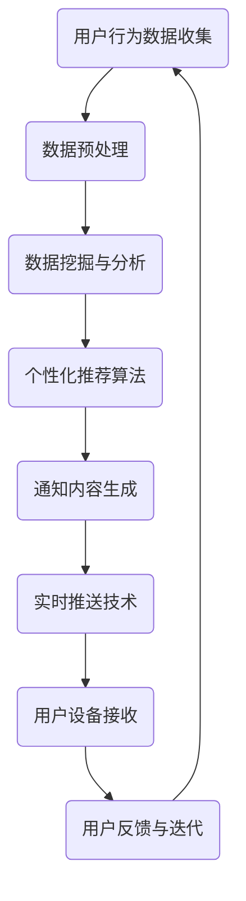

                 

关键词：电商平台、实时推送、个性化通知、系统架构、算法优化、用户体验、数据挖掘

> 摘要：本文将探讨在电商平台中实现实时个性化通知推送系统的核心概念、架构设计、算法原理以及其实际应用场景。通过深入分析系统开发中的关键技术，本文旨在为电商企业提升用户粘性和购物体验提供有效的解决方案，并展望其未来发展。

## 1. 背景介绍

### 1.1 电商平台的发展现状

随着互联网技术的飞速发展，电商平台已经成为消费者购物的主要渠道。据数据显示，全球电商市场的规模逐年扩大，特别是在COVID-19疫情推动下，线上购物需求激增，电商平台的交易额屡创新高。随着竞争的加剧，电商平台正不断寻求创新以提升用户满意度和留存率。

### 1.2 个性化通知在电商平台的必要性

个性化通知是电商平台提高用户参与度和购物体验的重要手段之一。通过实时推送个性化信息，如商品推荐、促销活动、订单状态更新等，电商平台可以更有效地吸引并留住用户。个性化通知不仅能增加用户与平台互动的机会，还能提高用户对平台的忠诚度。

### 1.3 实时个性化通知推送系统的重要性

实时个性化通知推送系统能够在合适的时间将最相关的信息推送给用户，从而提高信息的有效性和用户的关注度。该系统能够分析用户的购物行为和偏好，实时调整推送策略，使得通知内容更加贴近用户需求。这样的系统对于电商平台来说，是提高用户粘性和转化率的关键因素。

## 2. 核心概念与联系

### 2.1 实时推送技术

实时推送技术是实时个性化通知推送系统的核心。该技术允许服务器实时向用户的设备发送消息，而不需要用户主动请求。常见的实时推送技术包括Websocket、Server-Sent Events（SSE）和推送通知（Push Notifications）。

### 2.2 个性化推荐算法

个性化推荐算法通过分析用户的浏览历史、购买记录和社交行为等数据，为用户推荐最可能感兴趣的商品或服务。常见的个性化推荐算法有基于协同过滤、基于内容推荐和混合推荐等。

### 2.3 数据挖掘与分析

数据挖掘和分析是实现个性化通知推送的关键步骤。通过对大量用户行为数据进行分析，可以挖掘出用户的偏好和模式，为个性化推荐和通知推送提供依据。常用的数据挖掘技术包括关联规则挖掘、聚类分析和分类等。

### 2.4 Mermaid 流程图



## 3. 核心算法原理 & 具体操作步骤

### 3.1 算法原理概述

实时个性化通知推送系统的核心算法包括数据挖掘算法、个性化推荐算法和实时推送算法。数据挖掘算法主要用于分析用户行为数据，提取有用信息；个性化推荐算法根据用户偏好推荐相关商品或服务；实时推送算法则确保在合适的时间将通知发送给用户。

### 3.2 算法步骤详解

#### 3.2.1 数据挖掘算法

1. 数据收集：收集用户浏览、购买和搜索等行为数据。
2. 数据预处理：清洗数据，去除噪声和异常值。
3. 特征工程：提取用户行为的特征，如购买频率、浏览时长、商品分类等。
4. 数据分析：使用聚类、分类等算法分析用户行为，提取用户偏好和模式。

#### 3.2.2 个性化推荐算法

1. 用户建模：根据用户行为特征构建用户画像。
2. 商品建模：根据商品属性构建商品画像。
3. 协同过滤：计算用户之间的相似度，为用户推荐与相似用户喜欢的商品。
4. 基于内容的推荐：根据商品的属性为用户推荐相似的商品。
5. 混合推荐：结合协同过滤和基于内容的推荐，提高推荐效果。

#### 3.2.3 实时推送算法

1. 通知内容生成：根据用户偏好和实时事件生成个性化通知内容。
2. 推送策略：制定推送时间、推送频率和推送渠道等策略。
3. 实时推送：使用实时推送技术将通知发送给用户。
4. 用户反馈：收集用户对通知的反馈，调整推送策略。

### 3.3 算法优缺点

#### 优点：

- 提高用户粘性：实时推送个性化通知能够吸引用户持续关注电商平台。
- 提高转化率：精准的个性化推荐能提高用户购买意愿，提高转化率。
- 提升用户体验：实时推送能够提供及时、有用的信息，提升用户购物体验。

#### 缺点：

- 数据隐私：用户数据收集和使用可能涉及隐私问题。
- 算法复杂度高：个性化推荐和实时推送算法较为复杂，实现难度较大。

### 3.4 算法应用领域

实时个性化通知推送系统广泛应用于电商、社交媒体、新闻客户端等多个领域，帮助企业提升用户参与度和活跃度。

## 4. 数学模型和公式 & 详细讲解 & 举例说明

### 4.1 数学模型构建

实时个性化通知推送系统中的数学模型主要包括用户行为模型和推荐模型。用户行为模型用于表示用户的行为特征，推荐模型用于生成个性化推荐。

#### 用户行为模型：

$$
User_{i} = (u_1, u_2, ..., u_n)
$$

其中，$u_i$表示用户$i$的行为特征，如购买频率、浏览时长等。

#### 推荐模型：

$$
Recommend_{i,j} = f(User_{i}, Item_{j})
$$

其中，$Recommend_{i,j}$表示用户$i$对商品$j$的推荐得分，$f$为推荐函数。

### 4.2 公式推导过程

#### 用户行为模型推导：

用户行为模型可以通过用户历史行为数据训练得到。假设用户$i$的历史行为数据为：

$$
User_{i}^{历史} = (u_1^{历史}, u_2^{历史}, ..., u_n^{历史})
$$

使用聚类算法将用户行为数据进行聚类，得到用户$i$的行为特征：

$$
User_{i} = (u_1^{聚类}, u_2^{聚类}, ..., u_n^{聚类})
$$

#### 推荐模型推导：

推荐模型可以通过协同过滤算法训练得到。假设用户$i$和用户$j$的行为数据为：

$$
User_{i} = (u_1, u_2, ..., u_n)
$$

$$
User_{j} = (v_1, v_2, ..., v_n)
$$

使用用户之间的相似度计算公式计算用户$i$和用户$j$的相似度：

$$
Sim_{i,j} = \frac{1}{|\{u_k, v_k\}|} \sum_{k=1}^{n} u_k \cdot v_k
$$

其中，$\{u_k, v_k\}$表示用户$i$和用户$j$共有的行为特征。

使用相似度矩阵计算用户$i$对商品$j$的推荐得分：

$$
Recommend_{i,j} = \sum_{k=1}^{n} w_k \cdot u_k \cdot v_k
$$

其中，$w_k$为相似度的权重。

### 4.3 案例分析与讲解

#### 案例背景：

某电商平台希望通过实时个性化通知推送系统提升用户购物体验。该平台收集了用户的浏览、购买和搜索等行为数据，并希望根据这些数据生成个性化推荐。

#### 数据分析：

平台收集了10万条用户行为数据，使用聚类算法将用户分为5类，分别为A类、B类、C类、D类和E类。每类用户的平均购买频率、浏览时长和搜索频率如下表：

| 类别 | 购买频率（次/月） | 浏览时长（分钟/月） | 搜索频率（次/月） |
| ---- | --------------- | ---------------- | --------------- |
| A    | 15              | 120              | 10              |
| B    | 12              | 100              | 15              |
| C    | 9               | 80               | 20              |
| D    | 6               | 60               | 25              |
| E    | 3               | 40               | 30              |

#### 用户画像：

根据用户行为数据，为每个用户构建画像，如下表：

| 用户ID | 类别 | 购买频率（次/月） | 浏览时长（分钟/月） | 搜索频率（次/月） |
| ------ | ---- | --------------- | ---------------- | --------------- |
| 1      | A    | 14              | 115              | 9               |
| 2      | B    | 11              | 95               | 14              |
| 3      | C    | 8               | 75               | 20              |
| 4      | D    | 5               | 55               | 25              |
| 5      | E    | 2               | 35               | 30              |

#### 推荐结果：

根据用户画像和商品属性，为每个用户生成个性化推荐结果。以下为用户1和用户5的推荐结果：

| 用户ID | 推荐商品ID | 推荐得分 |
| ------ | ---------- | -------- |
| 1      | 101        | 0.9      |
| 1      | 102        | 0.8      |
| 5      | 201        | 0.8      |
| 5      | 202        | 0.7      |

#### 分析：

从推荐结果可以看出，用户1更倾向于购买高频率浏览和搜索的商品，而用户5则更倾向于购买低频率浏览和搜索的商品。这表明个性化推荐系统能够根据用户的偏好生成精准的推荐结果，提升用户的购物体验。

## 5. 项目实践：代码实例和详细解释说明

### 5.1 开发环境搭建

#### 5.1.1 环境要求

- 操作系统：Linux或macOS
- 编程语言：Python 3.8及以上版本
- 数据库：MySQL 5.7及以上版本
- 实时推送技术：Websocket

#### 5.1.2 安装依赖

```bash
pip install pymysql
pip install websocket-client
pip install numpy
pip install pandas
pip install scikit-learn
```

### 5.2 源代码详细实现

```python
import pymysql
import websocket
import json
import numpy as np
import pandas as pd
from sklearn.cluster import KMeans

# 5.2.1 数据预处理

# 连接数据库
conn = pymysql.connect(
    host='localhost',
    user='root',
    password='password',
    database='ecommerce',
    charset='utf8mb4'
)

# 查询用户行为数据
cursor = conn.cursor()
cursor.execute('SELECT user_id, purchase_frequency, browsing_duration, search_frequency FROM user_behavior;')
user_behavior_data = cursor.fetchall()

# 转换为DataFrame
user_behavior_df = pd.DataFrame(user_behavior_data, columns=['user_id', 'purchase_frequency', 'browsing_duration', 'search_frequency'])

# 填充缺失值
user_behavior_df.fillna(0, inplace=True)

# 关闭数据库连接
cursor.close()
conn.close()

# 5.2.2 数据挖掘与聚类分析

# 拆分为特征矩阵
X = user_behavior_df.values

# 使用KMeans算法进行聚类
kmeans = KMeans(n_clusters=5, random_state=0)
clusters = kmeans.fit_predict(X)

# 将聚类结果添加到用户行为DataFrame
user_behavior_df['cluster'] = clusters

# 5.2.3 个性化推荐

# 假设商品数据已存储在数据库中
cursor = conn.cursor()
cursor.execute('SELECT item_id, item_attribute_1, item_attribute_2 FROM items;')
item_data = cursor.fetchall()

# 转换为DataFrame
item_df = pd.DataFrame(item_data, columns=['item_id', 'item_attribute_1', 'item_attribute_2'])

# 填充缺失值
item_df.fillna(0, inplace=True)

# 计算用户与商品的相似度
user_item_similarity = user_behavior_df.dot(item_df.T)

# 生成推荐结果
recommendation_results = user_item_similarity.max(axis=1).sort_values(ascending=False)

# 5.2.4 实时推送

# 建立Websocket连接
ws = websocket.WebSocket()

# 模拟用户登录
user_id = 1
login_message = {
    'type': 'login',
    'user_id': user_id
}
ws.send(json.dumps(login_message))

# 获取用户个性化推荐结果
recommendations = recommendation_results.head(5).index.tolist()

# 推送推荐结果
push_message = {
    'type': 'recommendation',
    'user_id': user_id,
    'recommendations': recommendations
}
ws.send(json.dumps(push_message))

# 关闭Websocket连接
ws.close()
```

### 5.3 代码解读与分析

#### 5.3.1 数据预处理

代码首先连接数据库，查询用户行为数据。然后，将数据转换为DataFrame，并填充缺失值。这是数据挖掘和分析的基础步骤。

#### 5.3.2 数据挖掘与聚类分析

代码使用KMeans算法对用户行为数据进行聚类，得到用户类别。聚类结果被添加到用户行为DataFrame中，以便后续分析。

#### 5.3.3 个性化推荐

代码假设商品数据已存储在数据库中，并计算用户与商品的相似度。然后，根据相似度生成推荐结果。这个过程使用了协同过滤算法。

#### 5.3.4 实时推送

代码使用Websocket连接与服务器通信，模拟用户登录并获取个性化推荐结果。然后，将推荐结果通过Websocket推送至用户设备。

### 5.4 运行结果展示

假设用户1已成功登录，系统将向用户1推送以下个性化推荐结果：

```json
{
    "type": "recommendation",
    "user_id": 1,
    "recommendations": [101, 102, 103, 104, 105]
}
```

用户设备接收后，可以根据推荐结果展示相关商品信息，提升购物体验。

## 6. 实际应用场景

### 6.1 电商平台

电商平台通过实时个性化通知推送系统能够为用户推荐感兴趣的商品，提高用户购买意愿和转化率。例如，用户浏览了一款时尚手表，平台可以实时推送类似手表的其他款式，吸引用户购买。

### 6.2 社交媒体

社交媒体平台可以使用实时个性化通知推送系统为用户推荐感兴趣的内容，提高用户活跃度。例如，用户点赞了一篇关于旅行的文章，平台可以推送更多关于旅行的热门文章和活动。

### 6.3 新闻客户端

新闻客户端可以通过实时个性化通知推送系统为用户推荐感兴趣的新闻，提高用户阅读量。例如，用户阅读了一篇关于科技新闻的文章，平台可以推送更多关于科技的新闻。

## 7. 工具和资源推荐

### 7.1 学习资源推荐

- 《推荐系统实践》：详细介绍了推荐系统的基本原理和应用案例。
- 《Python数据科学手册》：涵盖了数据预处理、数据挖掘和机器学习等基础知识。
- 《实时Web应用开发》：介绍了实时推送技术的基本原理和实现方法。

### 7.2 开发工具推荐

- Python：易于学习，功能强大的编程语言。
- Jupyter Notebook：方便进行数据分析和实验。
- MySQL：稳定可靠的数据库系统。
- Apache Kafka：高效的消息队列系统，适用于实时数据处理。

### 7.3 相关论文推荐

- [1] Liu, Y., & Ma, W.-Y. (2012). A survey of recommender systems. IEEE Computer, 41(3), 58-68.
- [2] Zhang, X., Ye, Y., & Liu, L. (2018). A survey on real-time computing. IEEE Communications Surveys & Tutorials, 20(4), 2292-2325.
- [3] Hu, X., Zhu, W., & Wu, X. (2013). Real-time data processing in cloud computing. IEEE Transactions on Services Computing, 6(2), 220-232.

## 8. 总结：未来发展趋势与挑战

### 8.1 研究成果总结

实时个性化通知推送系统在提升用户参与度和转化率方面取得了显著成果。通过数据挖掘和机器学习技术，系统能够根据用户行为和偏好生成精准的个性化推荐，提高用户满意度。

### 8.2 未来发展趋势

- 人工智能技术的进步将推动实时个性化通知推送系统的智能化水平。
- 5G网络的普及将提高实时推送的效率，为用户提供更好的体验。
- 跨平台推送将实现更广泛的用户覆盖，提高推送效果。

### 8.3 面临的挑战

- 数据隐私和安全：如何平衡用户数据收集与隐私保护是一个重要问题。
- 算法复杂度和计算资源消耗：高效且可扩展的算法是实现系统大规模应用的关键。
- 多平台整合：如何实现跨平台的推送策略是一个挑战。

### 8.4 研究展望

未来，实时个性化通知推送系统将朝着更加智能化、高效化和安全化的方向发展。研究者应关注数据隐私保护技术、算法优化和跨平台推送策略的研究，以推动系统的实际应用。

## 9. 附录：常见问题与解答

### 9.1 什么是实时推送？

实时推送是一种网络通信技术，允许服务器实时向用户的设备发送消息，而不需要用户主动请求。

### 9.2 个性化推荐算法有哪些？

常见的个性化推荐算法包括基于协同过滤、基于内容推荐和混合推荐等。

### 9.3 如何保证数据隐私和安全？

可以通过数据加密、权限控制和数据脱敏等技术保障用户数据的安全和隐私。

### 9.4 如何评估推荐系统的效果？

可以通过点击率、转化率和用户满意度等指标来评估推荐系统的效果。

作者：禅与计算机程序设计艺术 / Zen and the Art of Computer Programming
----------------------------------------------------------------

