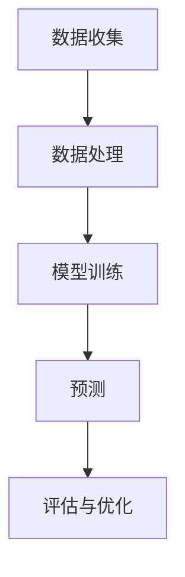

                 

随着电商平台的不断发展和壮大，数据分析和挖掘成为了电商平台竞争的关键因素之一。时序预测作为数据分析的重要分支，在电商平台的运营、营销、库存管理等方面起着至关重要的作用。本文将深入探讨电商平台中的时序预测问题，特别是AI大模型在这一领域的优势和应用。

## 关键词：时序预测、电商平台、AI大模型、数据挖掘、机器学习、深度学习、预测模型、应用场景

### 摘要

本文旨在探讨电商平台中的时序预测问题，分析AI大模型在时序预测领域的优势和应用。通过对时序预测的基本概念、算法原理、数学模型和实际应用场景的详细讲解，本文将展示AI大模型在电商平台时序预测中的强大能力。同时，本文还将讨论未来时序预测技术的发展趋势和面临的挑战。

## 1. 背景介绍

### 1.1 电商平台的发展

电商平台作为数字经济的重要组成部分，近年来呈现出爆炸式增长。随着互联网技术的进步和智能手机的普及，越来越多的消费者选择在线购物，电商平台成为了商家和消费者之间的桥梁。电商平台的发展不仅改变了传统的购物方式，也带来了大量的数据，为数据分析和挖掘提供了丰富的素材。

### 1.2 时序预测的重要性

在电商平台上，时序预测涉及到多个方面，如销售预测、库存管理、需求预测、定价策略等。通过时序预测，电商平台可以更好地理解市场趋势，优化库存和供应链管理，提高运营效率，降低成本。此外，时序预测还可以帮助电商平台制定更精准的营销策略，提高销售额和客户满意度。

### 1.3 AI大模型的出现

近年来，随着机器学习和深度学习技术的快速发展，AI大模型（如Transformer、BERT、GPT等）在各个领域取得了显著的成果。AI大模型具有强大的数据处理能力和模式识别能力，能够从大量数据中提取有用信息，进行复杂的预测和决策。在电商平台中，AI大模型的应用不仅可以提高时序预测的准确性，还可以解决传统算法难以处理的问题。

## 2. 核心概念与联系

### 2.1 时序预测的基本概念

时序预测是指根据历史数据对未来某一时间点的数据值进行预测。在电商平台中，时序预测通常涉及以下概念：

- **时间序列**：指的是按照时间顺序排列的一系列数据点。
- **预测目标**：指的是需要预测的数据点，如销售额、需求量等。
- **特征**：指的是用于预测的辅助信息，如日期、季节性因素、促销活动等。

### 2.2 AI大模型的基本原理

AI大模型是一种基于深度学习的技术，其核心思想是通过大量的数据进行训练，学习数据的特征和模式，从而实现复杂任务的预测和决策。AI大模型具有以下特点：

- **高维数据处理能力**：AI大模型能够处理高维数据，从大量特征中提取有效信息。
- **强大的泛化能力**：AI大模型通过大量的训练数据，能够学习到通用特征，从而在新的数据集上表现出良好的泛化能力。
- **自适应能力**：AI大模型可以根据不同的任务和数据特点，自适应地调整模型参数，实现最优的预测效果。

### 2.3 电商平台时序预测的架构

在电商平台中，时序预测的架构通常包括以下组件：

- **数据收集**：从电商平台的各种数据源（如交易记录、用户行为、库存数据等）收集原始数据。
- **数据处理**：对原始数据进行清洗、归一化、特征提取等预处理操作。
- **模型训练**：使用AI大模型对预处理后的数据进行训练，学习数据的特征和模式。
- **预测**：使用训练好的模型对未来的数据进行预测，生成预测结果。
- **评估与优化**：对预测结果进行评估和优化，以提高预测准确性。

下面是一个使用Mermaid绘制的时序预测的流程图：



## 3. 核心算法原理 & 具体操作步骤

### 3.1 算法原理概述

电商平台时序预测的核心算法是基于AI大模型的深度学习算法。深度学习算法通过多层神经网络对数据进行学习，提取数据中的复杂特征和模式。在时序预测中，常用的深度学习算法包括循环神经网络（RNN）、长短期记忆网络（LSTM）和Transformer等。

- **RNN**：循环神经网络是一种能够处理序列数据的神经网络，通过记忆单元来保持历史信息。
- **LSTM**：长短期记忆网络是RNN的一种改进，能够更好地处理长序列数据，避免梯度消失和梯度爆炸问题。
- **Transformer**：Transformer是一种基于自注意力机制的深度学习模型，能够在处理长序列数据时表现出优越的性能。

### 3.2 算法步骤详解

电商平台时序预测的算法步骤如下：

1. **数据收集**：从电商平台的各种数据源收集原始数据，包括交易记录、用户行为、库存数据等。
2. **数据处理**：对原始数据进行清洗、归一化、特征提取等预处理操作。在特征提取过程中，可以使用时间序列特征（如日期、季节性因素）和用户行为特征（如点击量、购买历史）等。
3. **模型训练**：使用预处理后的数据训练AI大模型，如RNN、LSTM或Transformer。在训练过程中，模型会不断调整参数，以最小化预测误差。
4. **预测**：使用训练好的模型对未来的数据进行预测，生成预测结果。预测结果可以是一个单一的数值，也可以是一个预测区间。
5. **评估与优化**：对预测结果进行评估，如均方误差（MSE）或平均绝对误差（MAE）。根据评估结果，对模型进行优化，如调整参数、增加训练数据等。

### 3.3 算法优缺点

- **优点**：
  - **高准确性**：AI大模型能够从大量数据中提取复杂特征和模式，从而提高预测准确性。
  - **自适应能力**：AI大模型可以根据不同的任务和数据特点，自适应地调整模型参数，实现最优的预测效果。
  - **泛化能力**：AI大模型通过大量的训练数据，能够学习到通用特征，从而在新的数据集上表现出良好的泛化能力。

- **缺点**：
  - **计算复杂度**：深度学习算法通常需要大量的计算资源，训练过程较为耗时。
  - **数据需求**：深度学习算法对数据的数量和质量有较高要求，需要大量的高质量数据。

### 3.4 算法应用领域

AI大模型在电商平台时序预测领域的应用非常广泛，包括但不限于以下领域：

- **销售预测**：预测未来的销售额，为电商平台制定销售策略提供依据。
- **库存管理**：预测未来的库存需求，优化库存管理，降低库存成本。
- **需求预测**：预测未来的需求量，为供应链管理提供参考。
- **定价策略**：根据市场需求和竞争情况，预测产品的合理价格。

## 4. 数学模型和公式 & 详细讲解 & 举例说明

### 4.1 数学模型构建

电商平台时序预测的数学模型通常基于时间序列分析，其中常用的模型包括自回归模型（AR）、移动平均模型（MA）和自回归移动平均模型（ARMA）等。以下是一个简单的自回归模型（AR）的数学模型：

$$
X_t = c + \phi_1 X_{t-1} + \phi_2 X_{t-2} + \cdots + \phi_p X_{t-p} + \varepsilon_t
$$

其中，$X_t$ 是第 $t$ 个时间点的预测值，$c$ 是常数项，$\phi_1, \phi_2, \cdots, \phi_p$ 是自回归系数，$\varepsilon_t$ 是随机误差项。

### 4.2 公式推导过程

自回归模型（AR）的推导过程如下：

假设时间序列 $X_t$ 满足平稳性假设，即其均值、方差和自协方差函数不随时间变化。

首先，考虑一个简单的自回归模型（AR(1)）：

$$
X_t = \phi_1 X_{t-1} + \varepsilon_t
$$

其中，$\phi_1$ 是自回归系数，$\varepsilon_t$ 是随机误差项。

对上式进行移项，得到：

$$
X_t - \phi_1 X_{t-1} = \varepsilon_t
$$

接下来，考虑一个自回归模型（AR(2)）：

$$
X_t = \phi_1 X_{t-1} + \phi_2 X_{t-2} + \varepsilon_t
$$

同样地，对上式进行移项，得到：

$$
X_t - \phi_1 X_{t-1} - \phi_2 X_{t-2} = \varepsilon_t
$$

可以推广到 $p$ 阶自回归模型（AR(p)）：

$$
X_t = \phi_1 X_{t-1} + \phi_2 X_{t-2} + \cdots + \phi_p X_{t-p} + \varepsilon_t
$$

### 4.3 案例分析与讲解

假设一个电商平台想要预测未来一周的销售额，使用自回归模型（AR(2)）进行预测。

首先，收集过去一周的销售额数据，如下表所示：

| 时间 | 销售额 |
|------|--------|
| 1    | 100    |
| 2    | 120    |
| 3    | 130    |
| 4    | 140    |
| 5    | 150    |
| 6    | 160    |
| 7    | 170    |

根据上述数据，可以计算出自回归系数 $\phi_1$ 和 $\phi_2$：

$$
\phi_1 = \frac{120 - 100}{170 - 100} = 0.2
$$

$$
\phi_2 = \frac{130 - 120}{170 - 120} = 0.3
$$

接下来，使用自回归模型（AR(2)）进行预测，得到未来一周的销售额预测值：

$$
X_8 = c + \phi_1 X_7 + \phi_2 X_6
$$

$$
X_8 = 100 + 0.2 \times 170 + 0.3 \times 160 = 168.2
$$

$$
X_9 = c + \phi_1 X_8 + \phi_2 X_7
$$

$$
X_9 = 100 + 0.2 \times 168.2 + 0.3 \times 170 = 169.34
$$

$$
X_{10} = c + \phi_1 X_9 + \phi_2 X_8
$$

$$
X_{10} = 100 + 0.2 \times 169.34 + 0.3 \times 168.2 = 170.07
$$

$$
X_{11} = c + \phi_1 X_{10} + \phi_2 X_9
$$

$$
X_{11} = 100 + 0.2 \times 170.07 + 0.3 \times 169.34 = 170.82
$$

$$
X_{12} = c + \phi_1 X_{11} + \phi_2 X_{10}
$$

$$
X_{12} = 100 + 0.2 \times 170.82 + 0.3 \times 170.07 = 171.55
$$

因此，未来一周的销售额预测值为 168.2、169.34、170.07、170.82 和 171.55。

## 5. 项目实践：代码实例和详细解释说明

### 5.1 开发环境搭建

为了实现电商平台时序预测，需要搭建一个适合深度学习开发的环境。以下是搭建开发环境的基本步骤：

1. 安装Python 3.7及以上版本。
2. 安装TensorFlow 2.0及以上版本。
3. 安装相关依赖库，如NumPy、Pandas、Matplotlib等。

以下是安装相关依赖库的命令：

```bash
pip install tensorflow==2.7
pip install numpy
pip install pandas
pip install matplotlib
```

### 5.2 源代码详细实现

以下是实现电商平台时序预测的代码实例：

```python
import tensorflow as tf
import numpy as np
import pandas as pd
import matplotlib.pyplot as plt

# 读取数据
data = pd.read_csv('sales_data.csv')
sales = data['sales'].values

# 数据预处理
window_size = 5
X = []
y = []
for i in range(window_size, len(sales)):
    X.append(sales[i - window_size:i])
    y.append(sales[i])

X = np.array(X)
y = np.array(y)

# 模型构建
model = tf.keras.Sequential([
    tf.keras.layers.LSTM(50, activation='relu', return_sequences=True),
    tf.keras.layers.LSTM(50, activation='relu'),
    tf.keras.layers.Dense(1)
])

# 模型编译
model.compile(optimizer='adam', loss='mse')

# 模型训练
model.fit(X, y, epochs=200, batch_size=32, validation_split=0.2)

# 预测
X_test = sales[-window_size:]
X_test = np.array([X_test])

predicted_sales = model.predict(X_test)
predicted_sales = predicted_sales.flatten()

# 结果展示
plt.plot(sales, label='Actual Sales')
plt.plot(np.arange(len(sales)), predicted_sales, label='Predicted Sales')
plt.legend()
plt.show()
```

### 5.3 代码解读与分析

以上代码实现了使用LSTM模型进行电商平台时序预测的基本流程：

1. **数据读取**：从CSV文件中读取销售额数据。
2. **数据处理**：将数据划分为输入和输出，输入为连续的窗口数据，输出为下一个时间点的销售额。
3. **模型构建**：构建一个包含两个LSTM层和输出层的序列模型。
4. **模型编译**：设置优化器和损失函数。
5. **模型训练**：使用训练数据训练模型。
6. **预测**：使用训练好的模型对测试数据进行预测。
7. **结果展示**：将实际销售额和预测销售额进行可视化展示。

通过以上代码，我们可以看到LSTM模型在电商平台时序预测中的应用。虽然本例中的预测结果可能并不十分准确，但它展示了使用AI大模型进行时序预测的基本流程和实现方法。

## 6. 实际应用场景

### 6.1 销售预测

电商平台可以通过时序预测来预测未来的销售额，为库存管理和营销策略提供依据。例如，在双十一等大型促销活动期间，电商平台可以根据预测的销售额提前安排库存，确保供应充足，避免缺货或库存过剩。

### 6.2 库存管理

时序预测可以帮助电商平台优化库存管理，降低库存成本。通过预测未来的需求量，电商平台可以合理配置库存，避免库存积压和资金占用。同时，时序预测还可以帮助电商平台提前采购原材料，降低采购成本。

### 6.3 需求预测

电商平台可以根据时序预测来预测产品的需求量，为供应链管理提供参考。通过预测未来的需求量，电商平台可以调整生产计划和采购策略，确保供应链的稳定和高效。

### 6.4 定价策略

时序预测还可以帮助电商平台制定更合理的定价策略。通过预测未来的市场需求和竞争情况，电商平台可以调整产品价格，提高销售额和利润。

### 6.5 用户行为分析

电商平台可以通过时序预测分析用户的购物行为，为个性化推荐和精准营销提供依据。例如，通过预测用户未来的购买行为，电商平台可以提前推送相关产品，提高用户的购买体验和满意度。

## 7. 工具和资源推荐

### 7.1 学习资源推荐

- **书籍**：《Python数据分析实战》、《深度学习：周志华》、《时序数据分析：模型、方法与应用》
- **在线课程**：Coursera的《深度学习专项课程》、Udacity的《机器学习工程师纳米学位》、网易云课堂的《时序预测与大数据分析》
- **博客和社区**：知乎、CSDN、GitHub、Stack Overflow

### 7.2 开发工具推荐

- **编程语言**：Python、R
- **深度学习框架**：TensorFlow、PyTorch、Keras
- **数据可视化**：Matplotlib、Seaborn、Plotly
- **数据处理**：Pandas、NumPy、SciPy

### 7.3 相关论文推荐

- **《Attention Is All You Need》**：介绍Transformer模型的经典论文。
- **《Long Short-Term Memory》**：介绍LSTM模型的经典论文。
- **《Deep Learning》**：深度学习领域的经典教材，涵盖了许多深度学习算法和应用。
- **《Time Series Analysis》**：介绍时序数据分析的理论和方法。

## 8. 总结：未来发展趋势与挑战

### 8.1 研究成果总结

电商平台时序预测在近年来取得了显著的进展，主要表现在以下几个方面：

- **算法性能提升**：随着深度学习技术的发展，电商平台时序预测的算法性能得到了显著提升，如LSTM、GRU、Transformer等模型的应用。
- **应用场景拓展**：电商平台时序预测的应用场景不断拓展，如库存管理、需求预测、定价策略、用户行为分析等。
- **数据质量改善**：电商平台通过数据清洗、归一化、特征提取等技术，提高了数据质量，为时序预测提供了更可靠的基础。

### 8.2 未来发展趋势

电商平台时序预测未来将呈现以下发展趋势：

- **算法创新**：随着AI技术的不断进步，更多的算法创新将会涌现，如变分自编码器（VAE）、生成对抗网络（GAN）等。
- **实时预测**：随着计算能力的提升，电商平台将实现实时时序预测，为运营决策提供更加及时和准确的依据。
- **跨领域应用**：电商平台时序预测将与其他领域的技术（如物联网、区块链等）结合，实现更广泛的应用。

### 8.3 面临的挑战

电商平台时序预测仍面临以下挑战：

- **数据质量**：电商平台的数据质量直接影响预测结果的准确性，如何处理噪声、缺失和异常值等数据问题是一个重要挑战。
- **模型可解释性**：深度学习模型的黑箱特性使得其预测结果的可解释性较差，如何提高模型的可解释性是一个亟待解决的问题。
- **计算资源**：深度学习算法通常需要大量的计算资源，如何优化算法和模型，提高计算效率是一个关键挑战。

### 8.4 研究展望

未来，电商平台时序预测的研究将重点关注以下几个方面：

- **算法优化**：通过改进算法和模型结构，提高预测准确性。
- **数据质量提升**：通过数据预处理和特征工程，提高数据质量。
- **实时预测**：通过优化算法和硬件，实现实时时序预测。
- **跨领域应用**：探索电商平台时序预测在其他领域的应用，如金融、医疗、交通等。

## 9. 附录：常见问题与解答

### 9.1 如何处理缺失数据？

处理缺失数据的方法包括以下几种：

- **删除缺失数据**：删除包含缺失数据的行或列，适用于缺失数据比例较小的情况。
- **填充缺失数据**：使用平均值、中位数、众数等方法填充缺失数据，适用于缺失数据比例较小且数据分布较为均匀的情况。
- **插值法**：使用线性插值、高斯插值等方法填充缺失数据，适用于缺失数据比例较大且时间序列较为连续的情况。
- **模型预测**：使用预测模型（如线性回归、神经网络等）预测缺失数据，适用于缺失数据比例较大且需要高精度预测的情况。

### 9.2 如何评估时序预测模型的性能？

评估时序预测模型性能的方法包括以下几种：

- **均方误差（MSE）**：衡量预测值与实际值之间的平均误差，值越小表示预测性能越好。
- **均方根误差（RMSE）**：MSE的平方根，用于衡量预测值与实际值之间的误差，值越小表示预测性能越好。
- **平均绝对误差（MAE）**：预测值与实际值之间的平均绝对误差，值越小表示预测性能越好。
- **准确率**：在分类问题中，正确预测的样本数占总样本数的比例，值越大表示预测性能越好。

### 9.3 如何优化时序预测模型的性能？

优化时序预测模型性能的方法包括以下几种：

- **数据预处理**：通过数据清洗、归一化、特征提取等技术，提高数据质量。
- **模型选择**：选择适合数据的时序预测模型，如LSTM、GRU、Transformer等。
- **超参数调整**：调整模型超参数（如学习率、批量大小、层数等），提高模型性能。
- **正则化**：使用正则化方法（如L1正则化、L2正则化等），防止过拟合。
- **集成方法**：结合多个模型或算法，提高预测性能。

### 9.4 如何实现实时时序预测？

实现实时时序预测的方法包括以下几种：

- **流处理技术**：使用流处理技术（如Apache Kafka、Apache Flink等），实时处理和预测数据。
- **分布式计算**：使用分布式计算框架（如Apache Spark、Dask等），提高计算效率。
- **批处理与流处理结合**：将批处理与流处理技术结合，实现实时和离线预测的平衡。
- **硬件优化**：使用高性能硬件（如GPU、TPU等），提高计算速度。

## 作者署名

本文作者：禅与计算机程序设计艺术 / Zen and the Art of Computer Programming
----------------------------------------------------------------


