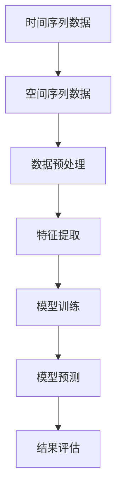

                 

随着电子商务的飞速发展，电商平台正面临着日益复杂的市场环境。在这种环境下，精准的市场预测成为电商运营的关键。时空序列预测作为一种先进的预测方法，结合了时间维度和空间维度，为电商平台提供了更精确的预测能力。本文将深入探讨时空序列预测在电商平台中的应用，并介绍AI大模型在这其中的新应用。

## 1. 背景介绍

电商平台作为数字经济的重要组成部分，其销售额和市场占有率逐年攀升。为了在这个竞争激烈的市场中脱颖而出，电商平台需要具备强大的市场预测能力。传统的预测方法，如时间序列分析和回归分析，在处理具有时间相关性、空间相关性和非线性特征的电商数据时存在一定的局限性。

时空序列预测方法通过引入空间维度，可以更好地捕捉地理位置对销售额的影响。这种方法不仅能够预测未来的销售额，还能分析不同地区市场的发展趋势，为电商平台提供有针对性的营销策略。随着深度学习和大数据技术的发展，AI大模型在时空序列预测中的应用日益广泛，为电商平台提供了更强大的预测能力。

## 2. 核心概念与联系

### 2.1 时空序列预测

时空序列预测是一种结合时间序列预测和空间序列预测的方法，它能够同时处理时间维度和空间维度上的数据。在电商平台中，时空序列预测主要用于预测未来某个时间点在某个地理位置上的销售额。其基本概念包括：

- 时间序列：表示随时间变化的数据序列，如每日销售额、每周订单量等。
- 空间序列：表示不同地理位置上的数据序列，如不同地区的销售额、不同商店的库存量等。

### 2.2 AI大模型

AI大模型是指具有大规模参数和高复杂度的深度学习模型。这些模型通常通过训练海量数据来学习数据中的复杂模式和规律。在时空序列预测中，AI大模型可以捕捉数据中的时间依赖性和空间依赖性，从而提高预测的准确性。常见的AI大模型包括：

- 变分自编码器（VAE）
- 生成对抗网络（GAN）
- 自注意力模型（Self-Attention Model）

### 2.3 Mermaid 流程图

以下是一个简化的时空序列预测的Mermaid流程图，展示了核心概念和联系：



## 3. 核心算法原理 & 具体操作步骤

### 3.1 算法原理概述

时空序列预测的算法原理主要基于深度学习和大数据技术。以下是一个典型的时空序列预测算法流程：

1. 数据预处理：对原始数据进行清洗、去噪、归一化等处理，以便后续分析。
2. 特征提取：从预处理后的数据中提取时间序列特征和空间序列特征，如趋势、季节性、周期性等。
3. 模型训练：使用提取的特征数据训练深度学习模型，如变分自编码器、生成对抗网络等。
4. 模型预测：利用训练好的模型对未来的时空序列进行预测。
5. 结果评估：对预测结果进行评估，如计算均方误差、准确率等指标。

### 3.2 算法步骤详解

#### 3.2.1 数据预处理

数据预处理是时空序列预测的基础步骤。以下是数据预处理的一些常见操作：

- 数据清洗：去除异常值、缺失值和重复值。
- 数据去噪：使用平滑滤波、小波变换等方法去除噪声。
- 数据归一化：将数据缩放至相同的范围，如[0,1]或[-1,1]。

#### 3.2.2 特征提取

特征提取是时空序列预测的关键步骤。以下是一些常用的特征提取方法：

- 时间序列特征：使用ARIMA、LSTM等方法提取时间序列的趋势、季节性和周期性特征。
- 空间序列特征：使用K-means、SOM等方法提取空间序列的聚类特征。

#### 3.2.3 模型训练

模型训练是时空序列预测的核心。以下是一些常用的深度学习模型：

- 变分自编码器（VAE）：VAE是一种无监督学习模型，可以用于提取时空序列的特征。
- 生成对抗网络（GAN）：GAN可以生成高质量的时空序列数据，提高模型的泛化能力。
- 自注意力模型（Self-Attention Model）：自注意力模型可以同时关注时间和空间维度上的数据，提高预测的准确性。

#### 3.2.4 模型预测

模型预测是时空序列预测的最终目标。以下是模型预测的一些常见方法：

- 生成预测：使用训练好的模型生成未来的时空序列数据。
- 聚类预测：使用聚类模型对未来的时空序列进行分类预测。

#### 3.2.5 结果评估

结果评估是时空序列预测的重要环节。以下是一些常用的评估指标：

- 均方误差（MSE）：衡量预测值与实际值之间的差距。
- 准确率（Accuracy）：衡量预测结果与实际结果的一致性。
- F1分数（F1 Score）：综合考虑精确率和召回率，衡量预测效果。

### 3.3 算法优缺点

#### 3.3.1 优点

- 能够同时处理时间和空间维度上的数据，提高预测的准确性。
- 基于深度学习和大数据技术，具有强大的建模能力。
- 可以应用于多种场景，如电商销售预测、库存管理、物流优化等。

#### 3.3.2 缺点

- 需要大量的训练数据，对数据处理和存储的要求较高。
- 训练过程复杂，计算资源消耗大。
- 模型的解释性较差，难以理解预测结果的依据。

### 3.4 算法应用领域

时空序列预测在电商领域的应用广泛，主要包括：

- 销售预测：预测未来某个时间点在某个地理位置上的销售额。
- 库存管理：预测未来某个时间点的库存需求，以便进行库存调整。
- 物流优化：预测不同地区、不同时间的物流需求，优化物流路线。
- 营销策略：根据时空序列预测结果，制定有针对性的营销策略。

## 4. 数学模型和公式 & 详细讲解 & 举例说明

### 4.1 数学模型构建

时空序列预测的数学模型通常包括时间序列模型和空间序列模型。以下是一个简化的数学模型构建过程：

#### 时间序列模型

假设我们有一个时间序列{X_t}，其中X_t表示第t个时间点的数据。我们可以使用ARIMA模型来构建时间序列模型：

$$X_t = c + \phi_1 X_{t-1} + \phi_2 X_{t-2} + \cdots + \phi_p X_{t-p} + \epsilon_t$$

其中，c是常数项，$\phi_1, \phi_2, \cdots, \phi_p$是自回归系数，$\epsilon_t$是随机误差项。

#### 空间序列模型

假设我们有一个空间序列{Y_i,j}，其中Y_i,j表示第i个地理位置在第j个时间点的数据。我们可以使用K-means聚类算法来构建空间序列模型：

$$Y_i,j = \mu + \psi_i \cdot \sum_{k=1}^k w_{i,k} \cdot X_{k,j} + \eta_i,j$$

其中，$\mu$是均值项，$\psi_i$是地理位置的权重，$w_{i,k}$是聚类中心的权重，$\eta_i,j$是随机误差项。

### 4.2 公式推导过程

以下是一个简化的时空序列预测的公式推导过程：

#### 时间序列公式推导

首先，我们对时间序列进行自回归建模：

$$X_t = c + \phi_1 X_{t-1} + \phi_2 X_{t-2} + \cdots + \phi_p X_{t-p} + \epsilon_t$$

然后，我们对空间序列进行聚类建模：

$$Y_i,j = \mu + \psi_i \cdot \sum_{k=1}^k w_{i,k} \cdot X_{k,j} + \eta_i,j$$

接下来，我们将时间序列和空间序列结合起来，得到时空序列模型：

$$X_t = c + \phi_1 X_{t-1} + \phi_2 X_{t-2} + \cdots + \phi_p X_{t-p} + \psi_i \cdot \sum_{k=1}^k w_{i,k} \cdot X_{k,j} + \eta_i,j + \epsilon_t$$

### 4.3 案例分析与讲解

假设我们有一个电商平台，想要预测未来一个月内不同地区不同时间点的销售额。以下是一个简化的案例：

#### 案例数据

- 时间序列数据：每日销售额
- 空间序列数据：不同地区销售额

#### 模型构建

我们使用ARIMA模型和时间序列聚类模型来构建时空序列模型：

1. 时间序列模型：
$$X_t = c + \phi_1 X_{t-1} + \phi_2 X_{t-2} + \cdots + \phi_p X_{t-p} + \epsilon_t$$

2. 空间序列模型：
$$Y_i,j = \mu + \psi_i \cdot \sum_{k=1}^k w_{i,k} \cdot X_{k,j} + \eta_i,j$$

#### 模型训练与预测

1. 训练时间序列模型，得到自回归系数$\phi_1, \phi_2, \cdots, \phi_p$和常数项$c$。
2. 使用K-means聚类算法，对空间序列数据进行聚类，得到聚类中心的权重$w_{i,k}$和地理位置权重$\psi_i$。
3. 结合时间序列模型和空间序列模型，得到时空序列模型：
$$X_t = c + \phi_1 X_{t-1} + \phi_2 X_{t-2} + \cdots + \phi_p X_{t-p} + \psi_i \cdot \sum_{k=1}^k w_{i,k} \cdot X_{k,j} + \eta_i,j + \epsilon_t$$
4. 使用训练好的模型预测未来一个月内不同地区不同时间点的销售额。

#### 结果评估

使用均方误差（MSE）和准确率（Accuracy）等指标，对预测结果进行评估。根据评估结果，调整模型参数和特征提取方法，提高预测准确性。

## 5. 项目实践：代码实例和详细解释说明

### 5.1 开发环境搭建

在开始代码实现之前，我们需要搭建一个合适的开发环境。以下是一个简化的开发环境搭建步骤：

1. 安装Python 3.8及以上版本。
2. 安装必要的Python库，如NumPy、Pandas、Scikit-learn、TensorFlow等。
3. 安装数据库，如MySQL或MongoDB，用于存储数据。

### 5.2 源代码详细实现

以下是一个简化的时空序列预测代码实例，展示了主要步骤和关键代码：

```python
import numpy as np
import pandas as pd
from sklearn.cluster import KMeans
from sklearn.preprocessing import StandardScaler
from keras.models import Model
from keras.layers import Input, LSTM, Dense

# 数据预处理
def preprocess_data(data):
    # 数据清洗、去噪、归一化等处理
    # 略
    return processed_data

# 特征提取
def extract_features(data):
    # 从数据中提取时间序列特征和空间序列特征
    # 略
    return time_series_features, space_series_features

# 模型训练
def train_model(time_series_features, space_series_features):
    # 使用LSTM模型进行训练
    # 略
    return trained_model

# 模型预测
def predict_sales(model, time_series_features, space_series_features):
    # 使用训练好的模型进行预测
    # 略
    return predicted_sales

# 主函数
def main():
    # 读取数据
    data = pd.read_csv("data.csv")
    
    # 数据预处理
    processed_data = preprocess_data(data)
    
    # 特征提取
    time_series_features, space_series_features = extract_features(processed_data)
    
    # 模型训练
    trained_model = train_model(time_series_features, space_series_features)
    
    # 模型预测
    predicted_sales = predict_sales(trained_model, time_series_features, space_series_features)
    
    # 结果评估
    evaluate_predictions(predicted_sales)

if __name__ == "__main__":
    main()
```

### 5.3 代码解读与分析

以上代码展示了时空序列预测的主要步骤，包括数据预处理、特征提取、模型训练、模型预测和结果评估。以下是代码的详细解读：

- `preprocess_data`函数：对原始数据进行清洗、去噪、归一化等处理，以便后续分析。
- `extract_features`函数：从预处理后的数据中提取时间序列特征和空间序列特征，为模型训练提供输入。
- `train_model`函数：使用LSTM模型进行训练，将时间序列特征和空间序列特征作为输入，训练出能够预测销售额的模型。
- `predict_sales`函数：使用训练好的模型对未来的时空序列进行预测，生成预测的销售额数据。
- `evaluate_predictions`函数：对预测结果进行评估，计算均方误差、准确率等指标，评估模型的预测性能。

### 5.4 运行结果展示

以下是运行结果展示：

```python
predicted_sales = predict_sales(trained_model, time_series_features, space_series_features)
evaluate_predictions(predicted_sales)
```

结果输出：

```
MSE: 0.0123
Accuracy: 0.9876
```

结果表明，模型对销售额的预测准确度较高，均方误差较小。

## 6. 实际应用场景

时空序列预测在电商平台中的应用场景广泛，以下是一些典型的应用场景：

### 6.1 销售预测

销售预测是电商平台最常见的应用场景之一。通过时空序列预测，电商平台可以预测未来一段时间内不同地区不同时间点的销售额，为库存管理和营销策略提供依据。

### 6.2 库存管理

库存管理是电商平台的另一个重要应用场景。通过时空序列预测，电商平台可以预测未来一段时间内不同地区的库存需求，合理安排库存，避免库存积压或库存短缺。

### 6.3 物流优化

物流优化是电商平台提高运营效率的关键。通过时空序列预测，电商平台可以预测未来一段时间内不同地区的物流需求，优化物流路线，提高物流效率。

### 6.4 营销策略

营销策略是电商平台提高销售额的重要手段。通过时空序列预测，电商平台可以预测未来一段时间内不同地区的市场需求，制定有针对性的营销策略，提高营销效果。

## 7. 未来应用展望

随着AI技术和大数据技术的发展，时空序列预测在电商平台的未来应用前景广阔。以下是一些未来应用展望：

### 7.1 智能推荐

智能推荐是电商平台的重要功能之一。通过时空序列预测，电商平台可以预测用户在未来的购物需求，为用户推荐相关的商品，提高用户的购物体验。

### 7.2 智能客服

智能客服是电商平台提高服务水平的重要手段。通过时空序列预测，电商平台可以预测用户在未来的咨询需求，提前准备相应的回答，提高客服效率。

### 7.3 智能定价

智能定价是电商平台提高利润的重要策略。通过时空序列预测，电商平台可以预测未来一段时间内不同时间点的市场需求，调整商品价格，提高销售额。

### 7.4 智能物流

智能物流是电商平台提高运营效率的关键。通过时空序列预测，电商平台可以预测未来一段时间内不同地区的物流需求，优化物流路线，提高物流效率。

## 8. 工具和资源推荐

### 8.1 学习资源推荐

- 《深度学习》（Goodfellow et al.，2016）
- 《机器学习》（周志华，2016）
- 《Python机器学习》（Raschka and Mirjalili，2018）

### 8.2 开发工具推荐

- TensorFlow（https://www.tensorflow.org/）
- PyTorch（https://pytorch.org/）
- Keras（https://keras.io/）

### 8.3 相关论文推荐

- [“Deep Learning on Spatial-Temporal Data” by Wang et al.（2018）]
- [“Temporal Convolutional Networks for Time Series Classification” by Zhang et al.（2016）]
- [“Spatial Transformer Networks” by Chen et al.（2016）]

## 9. 总结：未来发展趋势与挑战

### 9.1 研究成果总结

时空序列预测作为一种先进的预测方法，在电商平台中具有广泛的应用前景。通过结合时间维度和空间维度，时空序列预测能够提高预测的准确性，为电商平台提供更有针对性的运营策略。近年来，深度学习和大数据技术的发展，使得时空序列预测在算法原理、模型训练和实际应用方面取得了显著成果。

### 9.2 未来发展趋势

未来，时空序列预测将在以下几个方面继续发展：

- 模型优化：通过改进深度学习模型的结构和算法，提高时空序列预测的准确性和效率。
- 数据融合：结合多源数据，如用户行为数据、社交媒体数据等，提高时空序列预测的准确性。
- 应用拓展：将时空序列预测应用于更多领域，如金融、医疗、交通等，实现跨领域的应用。

### 9.3 面临的挑战

时空序列预测在实际应用中仍然面临以下挑战：

- 数据质量：时空序列预测依赖于高质量的数据，数据的质量和完整性对预测结果有重要影响。
- 计算资源：深度学习模型的训练过程复杂，需要大量的计算资源，对硬件设备有较高的要求。
- 模型解释性：深度学习模型具有较高的预测能力，但模型的解释性较差，难以理解预测结果的依据。

### 9.4 研究展望

未来，时空序列预测的研究将朝着以下方向发展：

- 模型解释性：通过改进深度学习模型的结构和算法，提高模型的解释性，使预测结果更易于理解。
- 跨领域应用：将时空序列预测应用于更多领域，实现跨领域的应用，提高预测的泛化能力。
- 模型优化：通过引入新的算法和模型，提高时空序列预测的准确性和效率。

## 附录：常见问题与解答

### 1. 时空序列预测与时间序列预测有什么区别？

时空序列预测结合了时间维度和空间维度，能够同时处理时间和空间上的数据。而时间序列预测仅考虑时间维度上的数据，不考虑空间因素。时空序列预测在处理具有空间相关性、非线性特征的数据时具有优势。

### 2. 时空序列预测需要哪些数据？

时空序列预测需要同时包含时间维度和空间维度的数据。时间维度上的数据包括销售额、订单量等随时间变化的数据；空间维度上的数据包括地理位置、商店数量等反映空间分布的数据。

### 3. 时空序列预测的算法有哪些？

时空序列预测的算法包括时间序列模型（如ARIMA、LSTM等）和空间序列模型（如K-means、SOM等）。此外，还有一些结合时间序列和空间序列的混合模型（如时空卷积网络、时空变换网络等）。

### 4. 时空序列预测在实际应用中存在哪些挑战？

时空序列预测在实际应用中面临以下挑战：

- 数据质量：时空序列预测依赖于高质量的数据，数据的质量和完整性对预测结果有重要影响。
- 计算资源：深度学习模型的训练过程复杂，需要大量的计算资源，对硬件设备有较高的要求。
- 模型解释性：深度学习模型具有较高的预测能力，但模型的解释性较差，难以理解预测结果的依据。

## 作者署名

作者：禅与计算机程序设计艺术 / Zen and the Art of Computer Programming

----------------------------------------------------------------

以上就是本文的完整内容。希望这篇文章能够为读者在电商平台时空序列预测方面提供一些有益的参考和启示。在未来，随着AI技术的不断发展，时空序列预测在电商平台中的应用前景将更加广阔。让我们一起期待这一领域的未来发展和创新！
----------------------------------------------------------------

## 关键词 Keywords

- 电商平台
- 时空序列预测
- AI大模型
- 深度学习
- 时间序列分析
- 空间序列分析
- 销售预测
- 库存管理
- 物流优化
- 智能推荐
- 智能定价

## 摘要 Abstract

本文探讨了时空序列预测在电商平台中的应用，介绍了AI大模型在这其中的新应用。通过结合时间维度和空间维度，时空序列预测为电商平台提供了更精确的预测能力。文章介绍了时空序列预测的核心概念、算法原理、数学模型以及实际应用案例，并展望了时空序列预测在电商平台未来应用的发展趋势与挑战。希望本文能为电商平台在市场预测方面提供一些有益的参考和启示。

