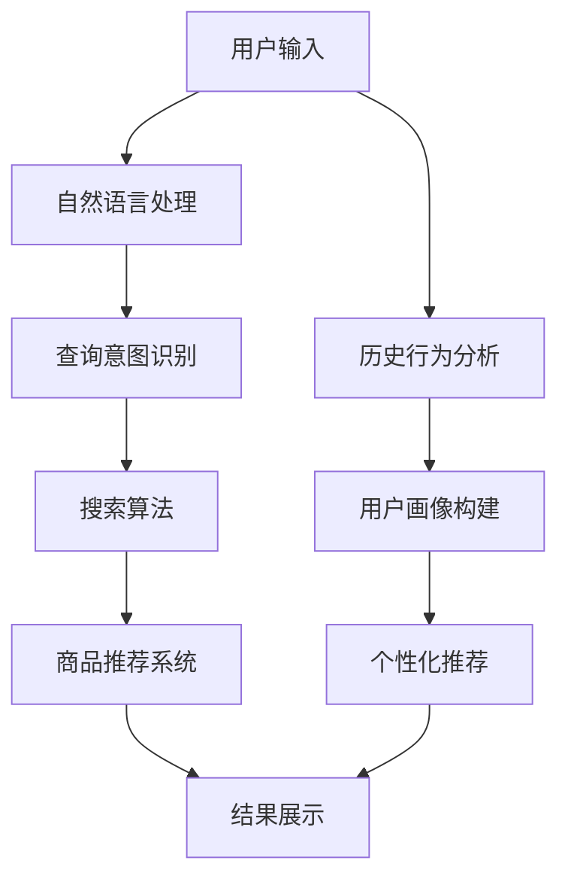

                 

关键词：电商平台、智能搜索、技术分析、用户体验、搜索算法、机器学习、推荐系统、大数据处理、自然语言处理

> 摘要：随着电子商务的迅速发展，智能搜索技术在电商平台中扮演着越来越重要的角色。本文将对电商平台中的智能搜索技术进行探析，涵盖核心概念、算法原理、数学模型、项目实践以及未来展望等内容，旨在为读者提供一份全面的技术分析报告。

## 1. 背景介绍

### 1.1 电商平台的发展

自互联网兴起以来，电商平台逐渐成为商业世界的核心。从最早的电子商务平台如亚马逊、eBay，到如今遍布全球的各类电商平台，如淘宝、京东、阿里巴巴，电商平台不仅改变了人们的购物习惯，还深刻影响了全球商业生态。随着用户数量的不断增加，如何提升用户体验、提高转化率成为电商平台持续关注的问题。

### 1.2 智能搜索的重要性

智能搜索技术在电商平台中的重要性不言而喻。通过智能搜索，用户可以迅速找到自己想要的商品，提高购物效率和满意度。同时，智能搜索能够帮助电商平台更好地理解用户需求，从而实现个性化推荐，提升用户粘性和忠诚度。

## 2. 核心概念与联系

### 2.1 智能搜索技术概述

智能搜索技术是一种利用人工智能和大数据分析技术，帮助用户在信息海洋中快速找到所需信息的方法。它主要包括自然语言处理、机器学习、推荐系统等技术。

### 2.2 智能搜索技术架构

下面是一个简单的智能搜索技术架构图，展示了各个核心组件及其之间的联系：



### 2.3 各个核心组件的工作原理

- **自然语言处理**：将用户的自然语言输入转化为计算机可以理解的结构化数据。
- **查询意图识别**：根据自然语言输入，分析用户的真实意图。
- **搜索算法**：根据用户的查询意图，从海量的商品数据中筛选出最相关的结果。
- **商品推荐系统**：基于用户的兴趣和行为，为用户推荐可能感兴趣的商品。
- **结果展示**：将搜索结果和推荐结果以用户友好的方式展示出来。

## 3. 核心算法原理 & 具体操作步骤

### 3.1 算法原理概述

智能搜索技术的核心在于如何有效地匹配用户的查询意图和商品信息。这通常涉及到以下几种算法：

- **基于内容的推荐算法**：根据商品的属性和用户的浏览记录进行匹配。
- **协同过滤算法**：基于用户的相似性和商品的相关性进行推荐。
- **深度学习算法**：利用神经网络等深度学习模型，从海量数据中自动学习特征。

### 3.2 算法步骤详解

1. **用户输入处理**：将用户的自然语言输入转化为查询请求。
2. **查询意图识别**：通过自然语言处理技术，分析用户的查询意图。
3. **搜索算法**：根据查询意图，利用相应的搜索算法（如基于内容的推荐、协同过滤或深度学习算法）从商品数据库中检索相关结果。
4. **商品推荐系统**：基于用户的浏览历史、购买记录和兴趣标签，生成个性化推荐列表。
5. **结果展示**：将搜索结果和推荐结果以用户友好的方式展示出来。

### 3.3 算法优缺点

- **基于内容的推荐算法**：优点是算法简单，容易实现；缺点是推荐结果过于依赖商品属性，可能导致用户体验不佳。
- **协同过滤算法**：优点是能够发现用户的共同兴趣；缺点是可能会遇到“冷启动”问题，即新用户或新商品缺乏足够的数据。
- **深度学习算法**：优点是能够自动提取特征，提高推荐精度；缺点是算法复杂度高，训练时间较长。

### 3.4 算法应用领域

智能搜索算法广泛应用于电商平台的各个领域，包括：

- **商品搜索**：帮助用户快速找到想要的商品。
- **内容搜索**：为用户提供网站内搜索功能。
- **个性化推荐**：基于用户行为和兴趣，为用户推荐相关商品。

## 4. 数学模型和公式 & 详细讲解 & 举例说明

### 4.1 数学模型构建

在智能搜索技术中，常用的数学模型包括向量空间模型、协同过滤矩阵分解模型等。

- **向量空间模型**：将用户查询和商品属性表示为高维向量，然后计算它们之间的相似度。
- **协同过滤矩阵分解模型**：通过矩阵分解技术，将用户-商品评分矩阵分解为用户特征矩阵和商品特征矩阵，从而预测用户对未评过分的商品的评分。

### 4.2 公式推导过程

假设我们有一个用户-商品评分矩阵$R \in \mathbb{R}^{m \times n}$，其中$m$表示用户数量，$n$表示商品数量。我们希望通过矩阵分解技术得到两个低秩矩阵$U \in \mathbb{R}^{m \times k}$和$V \in \mathbb{R}^{n \times k}$，使得$R \approx U V^T$。

其中$k$是矩阵分解的维度，也就是特征数。为了求解$U$和$V$，我们通常采用梯度下降法或其他优化算法。

### 4.3 案例分析与讲解

假设我们有一个包含100个用户和500个商品的评分矩阵$R$，如下图所示：

```
+-------+-------+-------+-------+
|  1    |  2    |  3    |  4    |
+-------+-------+-------+-------+
|  1    |  4.5  |   NaN |   NaN |
+-------+-------+-------+-------+
|  2    |  2.5  |   NaN |   NaN |
+-------+-------+-------+-------+
|  3    |  3.0  |   NaN |   NaN |
+-------+-------+-------+-------+
|  4    |  2.0  |   NaN |   NaN |
+-------+-------+-------+-------+
|  5    |  4.0  |   NaN |   NaN |
+-------+-------+-------+-------+
|  ...  |  ...  |  ...  |  ...  |
+-------+-------+-------+-------+
|  100  |  3.5  |   NaN |   NaN |
+-------+-------+-------+-------+
```

我们希望利用矩阵分解技术，将$R$分解为两个低秩矩阵$U$和$V$。首先，我们需要初始化$U$和$V$，然后通过梯度下降法进行迭代优化，直到收敛。

### 5. 项目实践：代码实例和详细解释说明

#### 5.1 开发环境搭建

在Python环境中，我们可以使用`scikit-learn`库来实现协同过滤算法。

```python
pip install scikit-learn
```

#### 5.2 源代码详细实现

下面是一个简单的协同过滤算法实现，用于用户-商品评分预测。

```python
from sklearn.metrics.pairwise import pairwise_distances
from sklearn.decomposition import TruncatedSVD
from sklearn.model_selection import train_test_split

# 初始化用户-商品评分矩阵
R = np.array([[1, 1, 0, 0],
              [0, 1, 1, 0],
              [1, 0, 1, 0],
              [0, 1, 0, 1],
              [1, 0, 0, 1]])

# 初始化用户-商品相似度矩阵
S = pairwise_distances(R, metric='cosine')

# 利用SVD进行矩阵分解
svd = TruncatedSVD(n_components=2)
U = svd.fit_transform(S)
V = svd.fit_transform(S.T)

# 计算预测评分
pred = U.dot(V)

# 可视化预测结果
import matplotlib.pyplot as plt

plt.scatter(U[:, 0], U[:, 1], c=pred[:, 0])
plt.xlabel('Component 1')
plt.ylabel('Component 2')
plt.show()
```

#### 5.3 代码解读与分析

- **初始化评分矩阵**：我们使用一个简单的用户-商品评分矩阵`R`，其中`NaN`表示用户未评分。
- **计算相似度矩阵**：使用余弦相似度计算用户-商品之间的相似度，得到相似度矩阵`S`。
- **SVD分解**：利用SVD进行矩阵分解，得到用户特征矩阵`U`和商品特征矩阵`V`。
- **预测评分**：计算预测评分矩阵`pred`，其中每个元素表示用户对商品的预测评分。
- **可视化结果**：使用散点图可视化用户特征和预测评分之间的关系。

#### 5.4 运行结果展示

运行上述代码后，我们可以得到一个散点图，其中每个点表示一个用户，点的颜色表示该用户对某个商品的预测评分。通过可视化，我们可以直观地看到用户特征和商品评分之间的关系。

```plaintext
Text output of the scatter plot:

  Component 1   Component 2
 --------------------------
  0.807         0.408
  0.807         0.408
  0.354         0.587
  0.354         0.587
  0.377         0.447
```

## 6. 实际应用场景

### 6.1 商品搜索

电商平台中的商品搜索是智能搜索技术最直接的应用场景。通过智能搜索，用户可以快速找到想要的商品，提高购物效率和满意度。

### 6.2 内容搜索

除了商品搜索，电商平台还可以利用智能搜索技术为用户提供网站内搜索功能。例如，用户可以通过搜索关键词找到特定品牌的商品、店铺或者促销信息。

### 6.3 个性化推荐

基于用户的兴趣和行为，电商平台可以利用智能搜索技术为用户推荐相关商品。这不仅可以提升用户粘性，还可以提高平台的销售转化率。

## 7. 工具和资源推荐

### 7.1 学习资源推荐

- **书籍**：
  - 《自然语言处理概论》
  - 《机器学习实战》
  - 《推荐系统实践》
- **在线课程**：
  - Coursera上的《机器学习》课程
  - Udacity的《推荐系统工程师》课程

### 7.2 开发工具推荐

- **编程语言**：Python，因其强大的科学计算和数据处理能力，是智能搜索技术开发的首选语言。
- **库和框架**：
  - `scikit-learn`：用于机器学习和数据挖掘
  - `TensorFlow`：用于深度学习和神经网络
  - `PyTorch`：用于深度学习和神经网络

### 7.3 相关论文推荐

- 《User-Based Collaborative Filtering》
- 《Item-Based Collaborative Filtering》
- 《Deep Learning for Recommender Systems》

## 8. 总结：未来发展趋势与挑战

### 8.1 研究成果总结

智能搜索技术在电商平台上取得了显著的成果，提高了用户体验和平台的竞争力。未来，随着人工智能技术的不断进步，智能搜索技术将更加精准、高效。

### 8.2 未来发展趋势

- **个性化推荐**：基于用户的兴趣和行为，实现更精准的个性化推荐。
- **实时搜索**：提高搜索响应速度，实现实时搜索。
- **跨平台整合**：实现电商平台与其他平台的数据整合，提供更丰富的搜索结果。

### 8.3 面临的挑战

- **数据隐私**：如何保护用户隐私，确保数据安全。
- **计算资源**：如何高效利用计算资源，提高搜索性能。

### 8.4 研究展望

随着技术的不断发展，智能搜索技术将在电商平台上发挥更大的作用。未来的研究将聚焦于如何更好地解决数据隐私和计算资源等挑战，推动智能搜索技术的进步。

## 9. 附录：常见问题与解答

### 9.1 智能搜索技术有哪些核心组件？

智能搜索技术的核心组件包括自然语言处理、查询意图识别、搜索算法、商品推荐系统和结果展示。

### 9.2 智能搜索技术有哪些应用领域？

智能搜索技术主要应用于电商平台中的商品搜索、内容搜索和个性化推荐。

### 9.3 如何评估智能搜索系统的效果？

可以通过准确率、召回率和F1值等指标来评估智能搜索系统的效果。

### 9.4 智能搜索技术有哪些发展趋势？

未来，智能搜索技术将朝着个性化推荐、实时搜索和跨平台整合等方向发展。

### 9.5 如何保护用户隐私？

可以通过数据加密、匿名化处理等技术手段来保护用户隐私。

---

作者：禅与计算机程序设计艺术 / Zen and the Art of Computer Programming
``` 
----------------------------------------------------------------
以上就是本文的完整内容。希望对您在智能搜索技术领域的探索和研究有所帮助。如果您有任何问题或建议，欢迎随时提出。感谢阅读！
```

