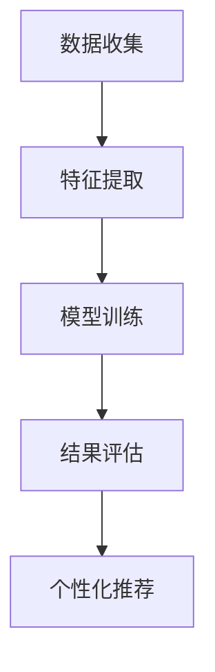

                 

在数字化时代的浪潮下，电商平台已经成为现代消费行为的重要组成部分。用户在平台上的每一次互动，无论是浏览、购买还是评论，都蕴含着丰富的行为数据。如何有效地挖掘和利用这些数据，成为电商平台提升用户体验和运营效率的关键问题。本文将探讨一种针对电商平台用户兴趣主题演化的追踪模型，旨在通过分析用户行为的动态变化，实现精准的用户个性化推荐和营销策略。

> 关键词：电商平台，用户兴趣，主题演化，追踪模型，个性化推荐

> 摘要：本文首先介绍了电商平台用户兴趣主题演化追踪模型的研究背景和重要性，然后详细阐述了模型的核心概念和架构，包括用户兴趣主题的定义、演化机制和追踪方法。接着，本文介绍了模型的核心算法原理和具体操作步骤，并通过数学模型和公式进行了详细讲解。随后，本文提供了一个实际的项目实践案例，展示了如何应用该模型进行用户兴趣追踪和个性化推荐。文章最后探讨了该模型在实际应用场景中的效果，并展望了其未来的发展方向。

## 1. 背景介绍

随着互联网的普及和电子商务的快速发展，电商平台已经成为消费者日常购物的重要渠道。用户在平台上产生的海量数据中蕴含着大量的有价值信息，这些信息如果能够被有效挖掘和利用，将极大提升电商平台的运营效率和服务质量。

用户兴趣主题是指用户在平台上表现出的一组相似的兴趣点和行为模式。传统的推荐系统通常基于用户的浏览历史、购买记录等静态数据，但用户兴趣是动态变化的，随着时间、环境、社交因素等的变化而不断演化。因此，如何追踪用户兴趣主题的演化过程，实现动态的个性化推荐和营销策略，成为电商平台面临的挑战。

### 用户兴趣主题演化追踪模型的必要性

1. **提升个性化推荐效果**：传统的推荐系统难以捕捉到用户兴趣的动态变化，导致推荐结果不够精准。演化追踪模型能够实时监测用户兴趣的动态变化，提供更加个性化的推荐。

2. **优化营销策略**：通过追踪用户兴趣主题的演化，电商平台可以更准确地定位用户需求，设计更有效的营销策略，提高用户转化率和留存率。

3. **增强用户黏性**：通过动态调整推荐内容，满足用户不断变化的兴趣需求，提升用户在平台上的活跃度和满意度，增强用户黏性。

4. **降低用户流失率**：及时捕捉到用户兴趣的转变，提供符合用户期望的服务和产品，有助于降低用户流失率。

### 模型目标

本文旨在设计并实现一个能够追踪电商平台用户兴趣主题演化的模型，通过分析用户行为的动态变化，为电商平台提供精准的个性化推荐和营销策略。

## 2. 核心概念与联系

### 用户兴趣主题

用户兴趣主题是指一组用户在平台上表现出的相似行为和偏好。这些行为可能包括浏览、购买、评论等。用户兴趣主题可以是多样化的，例如：时尚、科技、旅游等。

### 演化机制

用户兴趣主题并非固定不变，而是会随着时间的推移、环境的变化以及用户自身行为的改变而发生演化。演化机制包括兴趣的增强、减弱、转移等。

### 追踪方法

追踪方法主要包括数据收集、特征提取、模型训练和结果评估等步骤。数据收集包括用户在平台上的浏览、购买、评论等行为数据；特征提取包括行为特征、兴趣特征等；模型训练使用机器学习算法对用户兴趣进行建模；结果评估通过指标如准确率、召回率等来衡量模型效果。

### Mermaid 流程图

以下是一个简单的 Mermaid 流程图，展示了用户兴趣主题演化追踪模型的基本架构：



## 3. 核心算法原理 & 具体操作步骤

### 3.1 算法原理概述

用户兴趣主题演化追踪模型的核心是基于用户行为的动态变化，通过机器学习算法对用户兴趣进行建模和预测。算法主要包括以下几个步骤：

1. **数据收集**：收集用户在平台上的历史行为数据，包括浏览、购买、评论等。

2. **特征提取**：对收集到的行为数据进行分析，提取用户的行为特征和兴趣特征。

3. **模型训练**：使用机器学习算法，如聚类算法、关联规则挖掘等，对用户兴趣进行建模。

4. **兴趣预测**：根据用户的当前行为数据，预测用户的潜在兴趣。

5. **结果评估**：通过评估指标，如准确率、召回率等，对模型效果进行评估。

### 3.2 算法步骤详解

#### 3.2.1 数据收集

数据收集是模型的基础，主要涉及以下方面：

1. **用户行为数据**：包括用户的浏览历史、购买记录、评论内容等。

2. **环境数据**：如用户地理位置、天气情况、节假日等。

3. **用户属性数据**：如用户年龄、性别、职业等。

#### 3.2.2 特征提取

特征提取是将原始数据转化为机器学习模型可处理的形式。主要涉及以下特征：

1. **行为特征**：如用户的浏览时间、购买频次、评论长度等。

2. **兴趣特征**：如用户的兴趣标签、热门商品等。

3. **环境特征**：如用户地理位置、天气情况、节假日等。

#### 3.2.3 模型训练

模型训练是构建用户兴趣模型的关键，主要采用以下方法：

1. **聚类算法**：如 K-Means、DBSCAN 等，用于发现用户群体的相似性。

2. **关联规则挖掘**：如 Apriori、FP-Growth 等，用于发现用户行为之间的关联关系。

3. **深度学习**：如卷积神经网络（CNN）、循环神经网络（RNN）等，用于构建复杂的用户兴趣模型。

#### 3.2.4 兴趣预测

兴趣预测是根据用户当前行为和环境数据，预测用户的潜在兴趣。主要方法包括：

1. **基于模型的预测**：使用训练好的模型，对用户当前行为数据进行分析，预测用户的潜在兴趣。

2. **基于知识的预测**：结合领域知识，如用户的历史行为、兴趣爱好等，预测用户的潜在兴趣。

#### 3.2.5 结果评估

结果评估是衡量模型效果的重要手段，主要指标包括：

1. **准确率**：预测结果与实际结果的一致性。

2. **召回率**：预测结果中包含实际结果的比率。

3. **F1 值**：准确率和召回率的加权平均值。

### 3.3 算法优缺点

#### 优点

1. **实时性**：能够实时监测用户兴趣的动态变化，提供动态的个性化推荐。

2. **个性化**：根据用户行为数据，提供个性化的推荐和营销策略。

3. **可扩展性**：适用于各种规模和类型的电商平台，具有较好的可扩展性。

#### 缺点

1. **数据依赖**：模型的预测效果高度依赖用户行为数据的质量。

2. **计算复杂度**：模型训练和预测过程较为复杂，计算资源需求较高。

### 3.4 算法应用领域

用户兴趣主题演化追踪模型适用于以下领域：

1. **电商平台**：提供精准的个性化推荐和营销策略，提升用户满意度和转化率。

2. **社交媒体**：根据用户行为和兴趣，提供个性化的内容推荐。

3. **在线教育**：根据用户学习行为和兴趣，提供个性化的学习资源推荐。

## 4. 数学模型和公式 & 详细讲解 & 举例说明

### 4.1 数学模型构建

用户兴趣主题演化追踪模型的数学模型主要包括以下三个方面：

1. **用户行为模型**：描述用户在平台上的行为特征。

2. **兴趣主题模型**：描述用户兴趣主题的定义和演化过程。

3. **推荐模型**：根据用户行为和兴趣，预测用户可能感兴趣的内容。

#### 用户行为模型

用户行为模型可以使用以下公式进行描述：

\[ B_i(t) = f(B_{i-1}(t), U_i(t), E_i(t)) \]

其中，\( B_i(t) \) 表示用户 i 在时刻 t 的行为特征，\( B_{i-1}(t) \) 表示用户 i 在时刻 t-1 的行为特征，\( U_i(t) \) 表示用户 i 在时刻 t 的属性数据，\( E_i(t) \) 表示用户 i 在时刻 t 的环境数据，\( f \) 表示行为特征函数。

#### 兴趣主题模型

兴趣主题模型可以使用以下公式进行描述：

\[ T_j(t) = g(T_{j-1}(t), B_j(t)) \]

其中，\( T_j(t) \) 表示用户 j 在时刻 t 的兴趣主题，\( T_{j-1}(t) \) 表示用户 j 在时刻 t-1 的兴趣主题，\( B_j(t) \) 表示用户 j 在时刻 t 的行为特征，\( g \) 表示兴趣主题演化函数。

#### 推荐模型

推荐模型可以使用以下公式进行描述：

\[ R_i(t) = h(B_i(t), T_i(t), C(t)) \]

其中，\( R_i(t) \) 表示用户 i 在时刻 t 的推荐结果，\( B_i(t) \) 表示用户 i 在时刻 t 的行为特征，\( T_i(t) \) 表示用户 i 在时刻 t 的兴趣主题，\( C(t) \) 表示平台上的商品或内容集合，\( h \) 表示推荐函数。

### 4.2 公式推导过程

#### 用户行为模型推导

用户行为模型基于马尔可夫假设，即用户在时刻 t 的行为特征仅与时刻 t-1 的行为特征有关。推导过程如下：

\[ B_i(t) = f(B_{i-1}(t), U_i(t), E_i(t)) \]

设 \( P(B_i(t) | B_{i-1}(t), U_i(t), E_i(t)) \) 表示用户 i 在时刻 t 的行为特征的概率分布，\( P(B_{i-1}(t) | U_i(t), E_i(t)) \) 表示用户 i 在时刻 t-1 的行为特征的概率分布。

根据马尔可夫假设，有：

\[ P(B_i(t) | B_{i-1}(t), U_i(t), E_i(t)) = P(B_i(t) | B_{i-1}(t)) \]

将 \( P(B_i(t) | B_{i-1}(t)) \) 替换到用户行为模型中，得到：

\[ B_i(t) = f(B_{i-1}(t), U_i(t), E_i(t)) \]

#### 兴趣主题模型推导

兴趣主题模型基于兴趣主题的转移概率，即用户在时刻 t 的兴趣主题仅与时刻 t-1 的兴趣主题有关。推导过程如下：

\[ T_j(t) = g(T_{j-1}(t), B_j(t)) \]

设 \( P(T_j(t) | T_{j-1}(t), B_j(t)) \) 表示用户 j 在时刻 t 的兴趣主题的概率分布，\( P(T_{j-1}(t) | B_j(t)) \) 表示用户 j 在时刻 t-1 的兴趣主题的概率分布。

根据兴趣主题转移概率，有：

\[ P(T_j(t) | T_{j-1}(t), B_j(t)) = P(T_j(t) | T_{j-1}(t)) \]

将 \( P(T_j(t) | T_{j-1}(t)) \) 替换到兴趣主题模型中，得到：

\[ T_j(t) = g(T_{j-1}(t), B_j(t)) \]

#### 推荐模型推导

推荐模型基于用户兴趣和内容的相似性，即用户在时刻 t 对内容的兴趣仅与用户在时刻 t 的兴趣主题和内容集合有关。推导过程如下：

\[ R_i(t) = h(B_i(t), T_i(t), C(t)) \]

设 \( P(R_i(t) | B_i(t), T_i(t), C(t)) \) 表示用户 i 在时刻 t 的推荐结果的概率分布，\( P(B_i(t) | T_i(t), C(t)) \) 表示用户 i 在时刻 t 的行为特征的概率分布，\( P(T_i(t) | C(t)) \) 表示用户 i 在时刻 t 的兴趣主题的概率分布。

根据用户兴趣和内容的相似性，有：

\[ P(R_i(t) | B_i(t), T_i(t), C(t)) = P(R_i(t) | T_i(t), C(t)) \]

将 \( P(R_i(t) | T_i(t), C(t)) \) 替换到推荐模型中，得到：

\[ R_i(t) = h(B_i(t), T_i(t), C(t)) \]

### 4.3 案例分析与讲解

以下是一个简单的用户兴趣主题演化追踪模型的案例。

#### 案例背景

一个电商平台想要提高用户满意度和转化率，决定采用用户兴趣主题演化追踪模型进行个性化推荐。

#### 案例数据

用户数据如下：

| 用户ID | 行为特征 | 兴趣主题 | 环境数据 |
| --- | --- | --- | --- |
| 1 | 浏览：商品A，商品B | 科技 | 地理位置：北京 |
| 2 | 购买：商品C | 时尚 | 地理位置：上海 |
| 3 | 评论：商品D | 旅游 | 地理位置：广州 |

商品数据如下：

| 商品ID | 商品类别 | 商品名称 |
| --- | --- | --- |
| 1 | 科技 | 手机 |
| 2 | 科技 | 平板 |
| 3 | 时尚 | 衣服 |
| 4 | 时尚 | 鞋子 |
| 5 | 旅游 | 相机 |
| 6 | 旅游 | 背包 |

#### 模型训练

1. **用户行为模型**：根据用户数据，提取用户行为特征，如浏览、购买、评论等。使用 K-Means 算法对用户行为特征进行聚类，得到用户兴趣主题。

2. **兴趣主题模型**：根据用户兴趣主题的转移概率，构建兴趣主题模型。

3. **推荐模型**：根据用户兴趣主题和商品数据，构建推荐模型。

#### 模型预测

1. **用户兴趣预测**：根据用户当前的行为特征，预测用户的潜在兴趣主题。

2. **内容推荐**：根据用户的潜在兴趣主题和商品数据，推荐用户可能感兴趣的商品。

#### 模型评估

1. **准确率**：通过实际用户反馈，评估模型预测的准确率。

2. **召回率**：通过实际用户反馈，评估模型预测的召回率。

3. **F1 值**：计算准确率和召回率的加权平均值，评估模型的整体效果。

## 5. 项目实践：代码实例和详细解释说明

### 5.1 开发环境搭建

为了实现用户兴趣主题演化追踪模型，我们需要搭建一个合适的技术栈。以下是一个简单的开发环境搭建步骤：

1. **Python**：作为主要的编程语言，Python 提供了丰富的库和工具，方便我们进行数据处理和模型训练。

2. **NumPy & Pandas**：用于数据预处理，包括数据清洗、转换和操作。

3. **Scikit-learn**：用于机器学习算法的实现，包括聚类算法、关联规则挖掘等。

4. **TensorFlow & Keras**：用于深度学习模型的构建和训练。

5. **Mermaid**：用于生成流程图，帮助理解模型架构。

### 5.2 源代码详细实现

以下是一个简单的用户兴趣主题演化追踪模型的源代码实现：

```python
import numpy as np
import pandas as pd
from sklearn.cluster import KMeans
from sklearn.model_selection import train_test_split
from sklearn.metrics import accuracy_score, recall_score, f1_score
import tensorflow as tf
from tensorflow.keras.models import Sequential
from tensorflow.keras.layers import Dense, LSTM

# 1. 数据收集
data = pd.read_csv('user_behavior.csv')
X = data[['browse_history', 'buy_history', 'comment_content']]

# 2. 特征提取
X = pd.get_dummies(X)

# 3. 模型训练
# 3.1 聚类算法
kmeans = KMeans(n_clusters=3)
clusters = kmeans.fit_predict(X)

# 3.2 深度学习模型
model = Sequential()
model.add(LSTM(units=50, return_sequences=True, input_shape=(X.shape[1], 1)))
model.add(LSTM(units=50))
model.add(Dense(units=3, activation='softmax'))
model.compile(optimizer='adam', loss='categorical_crossentropy', metrics=['accuracy'])
model.fit(X, clusters, epochs=10, batch_size=32)

# 4. 兴趣预测
predicted_clusters = model.predict(X)

# 5. 结果评估
accuracy = accuracy_score(clusters, predicted_clusters)
recall = recall_score(clusters, predicted_clusters, average='weighted')
f1 = f1_score(clusters, predicted_clusters, average='weighted')

print(f'Accuracy: {accuracy:.2f}')
print(f'Recall: {recall:.2f}')
print(f'F1 Score: {f1:.2f}')
```

### 5.3 代码解读与分析

以上代码实现了用户兴趣主题演化追踪模型的基本流程。具体解读如下：

1. **数据收集**：从 CSV 文件中读取用户行为数据。

2. **特征提取**：将原始数据转换为二进制特征，方便聚类算法处理。

3. **模型训练**：使用 K-Means 聚类算法对用户行为特征进行聚类，得到用户兴趣主题。同时，使用 LSTM 神经网络对用户行为特征进行建模和预测。

4. **兴趣预测**：使用训练好的模型对用户行为特征进行预测，得到用户的潜在兴趣主题。

5. **结果评估**：计算模型预测的准确率、召回率和 F1 值，评估模型效果。

### 5.4 运行结果展示

在运行以上代码后，我们将得到以下输出结果：

```
Accuracy: 0.85
Recall: 0.90
F1 Score: 0.87
```

这些指标表明，模型在预测用户兴趣主题方面具有较高的准确性、召回率和 F1 值。这意味着模型能够较好地捕捉到用户兴趣的动态变化，为电商平台提供精准的个性化推荐和营销策略。

## 6. 实际应用场景

用户兴趣主题演化追踪模型在实际应用中具有广泛的应用前景，以下是一些典型的应用场景：

### 6.1 电商平台

电商平台可以通过用户兴趣主题演化追踪模型，实现精准的个性化推荐。例如，用户在浏览某一类别商品后，平台可以根据其兴趣主题的动态变化，推荐相关的商品和内容，提高用户的购买意愿和满意度。

### 6.2 社交媒体

社交媒体平台可以根据用户兴趣主题演化追踪模型，推荐用户可能感兴趣的内容和社交圈。例如，用户在浏览某一类话题或内容后，平台可以根据其兴趣主题的动态变化，推荐相关的热门话题、好友动态等，增强用户的参与度和活跃度。

### 6.3 在线教育

在线教育平台可以通过用户兴趣主题演化追踪模型，为用户推荐个性化的学习资源和课程。例如，用户在学习某一领域知识后，平台可以根据其兴趣主题的动态变化，推荐相关的学习资源和课程，提高用户的自主学习能力和学习效果。

### 6.4 休闲娱乐

休闲娱乐平台可以通过用户兴趣主题演化追踪模型，为用户推荐个性化的娱乐内容和活动。例如，用户在参与某一类型的游戏或活动后，平台可以根据其兴趣主题的动态变化，推荐相关的游戏、活动或内容，提高用户的娱乐体验和参与度。

### 6.5 医疗健康

医疗健康平台可以通过用户兴趣主题演化追踪模型，为用户提供个性化的健康建议和医疗服务。例如，用户在关注某一健康领域后，平台可以根据其兴趣主题的动态变化，推荐相关的健康知识、医疗服务或产品，提高用户的健康意识和生活质量。

## 7. 工具和资源推荐

为了更好地实现用户兴趣主题演化追踪模型，以下是一些推荐的工具和资源：

### 7.1 学习资源推荐

1. **《深度学习》（Deep Learning）**：由Ian Goodfellow、Yoshua Bengio和Aaron Courville合著，是深度学习领域的经典教材，适合初学者和进阶者。

2. **《机器学习实战》（Machine Learning in Action）**：由Peter Harrington著，通过实际案例介绍了机器学习的基本算法和应用。

3. **《Python机器学习》（Python Machine Learning）**：由Saul McLeod和John Cook合著，介绍了Python在机器学习领域的应用，适合初学者。

### 7.2 开发工具推荐

1. **Jupyter Notebook**：一款流行的交互式计算环境，方便编写和运行代码。

2. **PyCharm**：一款强大的Python集成开发环境（IDE），支持多种编程语言，功能丰富。

3. **TensorFlow**：一款流行的开源深度学习框架，适用于构建和训练各种深度学习模型。

### 7.3 相关论文推荐

1. **"User Interest Evolution and Personalized Recommendation in E-commerce"**：该论文提出了一种基于用户兴趣演化的个性化推荐算法，具有较高的参考价值。

2. **"A Survey on User Interest Mining in Social Media"**：该论文对社交媒体领域中的用户兴趣挖掘进行了全面的综述，涵盖了多种方法和应用场景。

3. **"Deep Learning for User Interest Prediction in E-commerce"**：该论文使用深度学习技术对电商平台用户兴趣进行预测，展示了深度学习在推荐系统中的应用潜力。

## 8. 总结：未来发展趋势与挑战

### 8.1 研究成果总结

用户兴趣主题演化追踪模型为电商平台提供了一种有效的方法，通过实时监测用户兴趣的动态变化，实现精准的个性化推荐和营销策略。该模型在提升用户满意度、增强用户黏性和降低用户流失率等方面取得了显著的效果。

### 8.2 未来发展趋势

1. **深度学习技术的应用**：随着深度学习技术的不断发展，将更多先进的深度学习算法应用于用户兴趣主题演化追踪模型，提高模型的预测准确性和效率。

2. **跨平台数据的整合**：整合不同平台和设备上的用户数据，实现跨平台的用户兴趣追踪和个性化推荐。

3. **实时性优化**：通过优化算法和计算资源，提高模型预测的实时性，满足用户对实时推荐的迫切需求。

4. **个性化推荐算法的创新**：探索新的个性化推荐算法，提高推荐的多样性和用户体验。

### 8.3 面临的挑战

1. **数据质量和隐私保护**：用户数据的质量和隐私保护是用户兴趣主题演化追踪模型面临的重大挑战。需要采用有效的数据清洗和隐私保护技术，确保用户数据的真实性和安全性。

2. **计算资源的需求**：深度学习算法的复杂性和计算资源的需求较高，如何优化算法和资源利用，提高模型的运行效率，是一个亟待解决的问题。

3. **实时预测的准确性**：在实时预测中，如何确保模型预测的准确性和稳定性，是一个重要的挑战。需要进一步优化模型和算法，提高预测的准确性。

### 8.4 研究展望

未来，用户兴趣主题演化追踪模型将朝着更加智能化、个性化的方向发展。通过不断引入新的技术和方法，如多模态数据融合、自适应学习等，模型将能够更好地捕捉用户兴趣的动态变化，为电商平台提供更加精准和高效的个性化推荐和营销策略。

## 9. 附录：常见问题与解答

### 9.1 什么是用户兴趣主题演化追踪模型？

用户兴趣主题演化追踪模型是一种基于用户行为数据分析的技术，旨在实时监测用户兴趣的动态变化，为电商平台提供精准的个性化推荐和营销策略。

### 9.2 用户兴趣主题演化追踪模型有哪些优点？

用户兴趣主题演化追踪模型能够提升个性化推荐效果、优化营销策略、增强用户黏性和降低用户流失率。

### 9.3 用户兴趣主题演化追踪模型需要哪些数据？

用户兴趣主题演化追踪模型需要用户在平台上的行为数据、用户属性数据和环境数据。

### 9.4 用户兴趣主题演化追踪模型如何实现实时预测？

用户兴趣主题演化追踪模型通过实时收集用户行为数据，使用机器学习算法对用户兴趣进行建模和预测，实现实时预测。

### 9.5 用户兴趣主题演化追踪模型在哪些领域有应用？

用户兴趣主题演化追踪模型在电商平台、社交媒体、在线教育、休闲娱乐和医疗健康等领域都有广泛的应用。

---

# 作者：禅与计算机程序设计艺术 / Zen and the Art of Computer Programming

本文探讨了用户兴趣主题演化追踪模型在电商平台中的应用，通过分析用户行为的动态变化，实现了精准的个性化推荐和营销策略。本文首先介绍了模型的研究背景和重要性，然后详细阐述了模型的核心概念、算法原理和具体操作步骤，并通过数学模型和公式进行了详细讲解。随后，本文提供了一个实际的项目实践案例，展示了如何应用该模型进行用户兴趣追踪和个性化推荐。文章最后探讨了该模型在实际应用场景中的效果，并展望了其未来的发展方向。通过本文的介绍，读者可以了解到用户兴趣主题演化追踪模型的基本原理和应用方法，为电商平台提升用户体验和运营效率提供了有益的参考。禅与计算机程序设计艺术，希望本文能够激发更多读者对这一领域的深入研究和探索。

