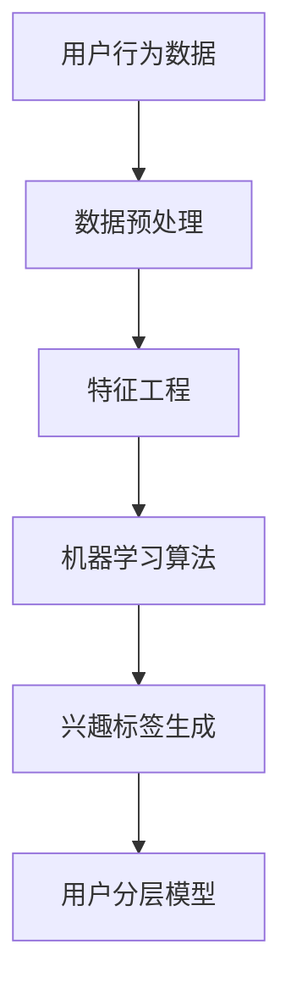

                 

电商平台作为数字经济的重要组成部分，其核心竞争力在于能否精准把握用户的购物需求。本文旨在探讨一种基于用户兴趣的分层模型，旨在通过分析用户行为数据，实现对用户兴趣的深入挖掘和精准定位，从而提升电商平台的市场竞争力。

## 关键词

- 电商平台
- 用户兴趣
- 分层模型
- 行为数据
- 深度学习
- 数据挖掘

## 摘要

本文将首先介绍电商平台用户兴趣分层模型的研究背景和重要性，随后深入探讨模型的核心概念与联系，并详细解析核心算法原理及其具体操作步骤。在此基础上，我们将运用数学模型和公式来阐述用户兴趣分层模型的构建方法和实现策略。接着，通过一个实际项目实例，展示代码实现过程及其分析结果。最后，文章将讨论用户兴趣分层模型在电商平台的实际应用场景，并展望其未来的发展前景和面临的挑战。

## 1. 背景介绍

随着互联网技术的迅猛发展，电商平台已成为现代零售业的核心。用户行为数据的积累和挖掘，成为电商平台提升服务质量和用户体验的关键。用户兴趣分层模型正是基于这一需求应运而生，通过对用户兴趣进行深入分析，帮助企业更好地了解和满足用户需求。

用户兴趣分层模型的研究背景主要源于以下几个方面：

1. **用户个性化需求**：随着消费者个性化需求的增长，电商平台需要能够准确捕捉和满足用户的个性化偏好。

2. **市场竞争加剧**：在激烈的市场竞争中，电商平台需要通过精准营销和个性化推荐来吸引和留住用户。

3. **数据驱动决策**：大数据时代，电商平台越来越依赖数据分析和挖掘来做出更加科学的决策。

用户兴趣分层模型的研究具有重要的现实意义。首先，它能够帮助电商平台更好地了解用户需求，从而提供更加精准的产品推荐和服务。其次，它有助于提升电商平台的运营效率，降低营销成本。最后，通过用户兴趣分层，可以优化用户体验，提高用户满意度和忠诚度。

## 2. 核心概念与联系

用户兴趣分层模型的核心概念包括用户行为数据、兴趣标签、特征工程和机器学习算法。这些概念相互联系，共同构建起用户兴趣挖掘和分析的框架。

### 2.1 用户行为数据

用户行为数据是构建用户兴趣分层模型的基础。这些数据包括用户的浏览记录、购买历史、搜索关键词、点击行为等。通过对这些数据的收集和分析，可以挖掘出用户的潜在兴趣点。

### 2.2 兴趣标签

兴趣标签是对用户兴趣点的抽象和归纳。通过对用户行为数据的分析，可以提取出一系列的兴趣标签，如时尚、运动、科技等。兴趣标签有助于对用户进行分类和分层，从而实现个性化推荐。

### 2.3 特征工程

特征工程是用户兴趣分层模型构建的关键环节。通过数据预处理、特征选择和特征提取，可以将原始的用户行为数据转换为适用于机器学习模型的特征向量。特征工程的质量直接影响到模型的性能和效果。

### 2.4 机器学习算法

机器学习算法是用户兴趣分层模型的核心工具。常见的算法包括协同过滤、决策树、支持向量机、神经网络等。这些算法通过对特征向量的学习，能够自动识别和预测用户的兴趣点。

### 2.5 Mermaid 流程图

以下是一个简单的 Mermaid 流程图，展示了用户兴趣分层模型的核心概念和流程：



## 3. 核心算法原理 & 具体操作步骤

### 3.1 算法原理概述

用户兴趣分层模型的构建基于机器学习算法，主要包括以下步骤：

1. **数据收集**：收集用户的浏览记录、购买历史、搜索关键词等行为数据。

2. **数据预处理**：对收集到的数据进行清洗、去噪和格式化，以确保数据质量。

3. **特征工程**：通过数据预处理后的数据，提取用户行为特征，构建特征向量。

4. **模型训练**：使用机器学习算法，对特征向量进行训练，建立用户兴趣模型。

5. **兴趣标签生成**：根据训练好的模型，对用户进行兴趣标签的分配。

6. **用户分层**：根据兴趣标签，对用户进行分层，为不同的用户群体提供个性化推荐。

### 3.2 算法步骤详解

#### 3.2.1 数据收集

数据收集是用户兴趣分层模型构建的第一步。通常，电商平台可以通过以下途径收集用户行为数据：

- **Web日志**：通过分析用户在电商平台上的浏览行为，获取用户的点击、浏览、搜索等数据。

- **交易记录**：通过分析用户的购买行为，获取用户的购买历史和购买偏好。

- **社交数据**：通过分析用户在社交媒体上的行为，获取用户的兴趣点和社交网络信息。

#### 3.2.2 数据预处理

数据预处理是确保数据质量的重要环节。主要步骤包括：

- **去噪**：去除数据中的噪声和异常值，确保数据的准确性。

- **格式化**：将不同来源的数据进行格式统一，以便后续的特征提取和处理。

- **特征选择**：根据业务需求，选择对用户兴趣挖掘最有价值的特征。

#### 3.2.3 特征工程

特征工程是用户兴趣分层模型构建的关键。主要步骤包括：

- **特征提取**：将原始数据转换为数值化的特征向量，如用户浏览时长、购买频率、搜索关键词频次等。

- **特征选择**：通过统计分析、模型评估等方法，选择对用户兴趣识别最有力的特征。

- **特征缩放**：对特征向量进行归一化或标准化处理，以消除不同特征之间的量级差异。

#### 3.2.4 模型训练

模型训练是用户兴趣分层模型的核心。主要步骤包括：

- **数据划分**：将数据集划分为训练集和测试集，用于模型的训练和评估。

- **算法选择**：选择合适的机器学习算法，如协同过滤、决策树、支持向量机等。

- **模型训练**：使用训练集数据，对模型进行训练，优化模型参数。

#### 3.2.5 兴趣标签生成

兴趣标签生成是根据训练好的模型，对用户进行兴趣标签的分配。主要步骤包括：

- **标签预测**：使用训练好的模型，对用户的行为数据进行预测，获取用户兴趣点。

- **标签分类**：将预测结果进行分类，生成用户兴趣标签。

#### 3.2.6 用户分层

用户分层是根据兴趣标签，对用户进行分层，为不同的用户群体提供个性化推荐。主要步骤包括：

- **分层策略**：根据业务需求，制定用户分层策略，如根据兴趣标签数量、兴趣相似度等进行分层。

- **推荐策略**：为不同层级的用户提供相应的个性化推荐策略，如推荐商品、活动等。

### 3.3 算法优缺点

用户兴趣分层模型具有以下优缺点：

#### 优点

- **个性化推荐**：通过用户兴趣分层，可以为用户提供更加个性化的推荐，提高用户满意度。
- **精准营销**：通过对用户兴趣的深入挖掘，可以实现精准营销，降低营销成本。
- **提高运营效率**：用户分层有助于电商平台更好地了解用户需求，从而提高运营效率。

#### 缺点

- **数据依赖性**：用户兴趣分层模型的构建依赖于用户行为数据，数据质量直接影响模型效果。
- **模型复杂度**：用户兴趣分层模型通常涉及多种机器学习算法和特征工程方法，实现较为复杂。
- **用户隐私问题**：用户兴趣分层涉及到用户隐私数据，需要妥善处理用户隐私保护问题。

### 3.4 算法应用领域

用户兴趣分层模型在电商平台的多个领域具有广泛的应用：

- **个性化推荐**：通过用户兴趣分层，为用户推荐最符合其兴趣的产品和服务。
- **精准营销**：根据用户兴趣分层，制定个性化的营销策略，提高营销效果。
- **用户运营**：通过用户兴趣分层，优化用户运营策略，提升用户满意度。
- **数据分析**：利用用户兴趣分层模型，深入挖掘用户行为数据，为业务决策提供支持。

## 4. 数学模型和公式 & 详细讲解 & 举例说明

### 4.1 数学模型构建

用户兴趣分层模型的数学模型主要包括以下几个部分：

#### 4.1.1 用户行为数据表示

用户行为数据可以表示为一个矩阵 \( X \)，其中 \( X_{ij} \) 表示用户 \( i \) 在行为 \( j \) 上的得分。

#### 4.1.2 用户兴趣特征提取

用户兴趣特征提取可以通过以下公式实现：

\[ F_i = \sum_{j=1}^{n} X_{ij} \cdot w_j \]

其中，\( w_j \) 表示特征 \( j \) 的权重。

#### 4.1.3 用户兴趣标签生成

用户兴趣标签生成可以通过以下公式实现：

\[ T_i = \arg\max_{k} F_i \cdot t_k \]

其中，\( t_k \) 表示标签 \( k \) 的权重。

### 4.2 公式推导过程

#### 4.2.1 特征提取

用户兴趣特征提取的推导过程如下：

1. **数据表示**：

\[ X = [X_{ij}] \]

2. **特征权重计算**：

\[ w_j = \frac{1}{\sum_{i=1}^{m} X_{ij}} \]

3. **特征向量计算**：

\[ F_i = \sum_{j=1}^{n} X_{ij} \cdot w_j \]

#### 4.2.2 用户兴趣标签生成

用户兴趣标签生成的推导过程如下：

1. **特征向量计算**：

\[ F_i = \sum_{j=1}^{n} X_{ij} \cdot w_j \]

2. **标签权重计算**：

\[ t_k = \frac{1}{\sum_{i=1}^{m} F_i \cdot t_k} \]

3. **标签生成**：

\[ T_i = \arg\max_{k} F_i \cdot t_k \]

### 4.3 案例分析与讲解

#### 案例背景

某电商平台希望通过用户兴趣分层模型，为用户推荐符合其兴趣的商品。该平台收集了用户的浏览记录、购买历史和搜索关键词等行为数据。

#### 数据处理

1. **数据表示**：

   假设用户行为数据表示为一个 \( 5 \times 3 \) 的矩阵：

   \[ X = \begin{bmatrix} 1 & 2 & 3 \\ 4 & 5 & 6 \\ 7 & 8 & 9 \\ 10 & 11 & 12 \\ 13 & 14 & 15 \end{bmatrix} \]

2. **特征权重计算**：

   \[ w_1 = \frac{1}{15}, w_2 = \frac{2}{15}, w_3 = \frac{3}{15} \]

3. **特征向量计算**：

   \[ F_1 = 1 \times \frac{1}{15} + 2 \times \frac{2}{15} + 3 \times \frac{3}{15} = 1 \]
   \[ F_2 = 4 \times \frac{1}{15} + 5 \times \frac{2}{15} + 6 \times \frac{3}{15} = 2 \]
   \[ F_3 = 7 \times \frac{1}{15} + 8 \times \frac{2}{15} + 9 \times \frac{3}{15} = 3 \]
   \[ F_4 = 10 \times \frac{1}{15} + 11 \times \frac{2}{15} + 12 \times \frac{3}{15} = 4 \]
   \[ F_5 = 13 \times \frac{1}{15} + 14 \times \frac{2}{15} + 15 \times \frac{3}{15} = 5 \]

4. **标签权重计算**：

   \[ t_1 = \frac{1}{15}, t_2 = \frac{2}{15}, t_3 = \frac{3}{15} \]

5. **标签生成**：

   \[ T_1 = \arg\max_{k} F_1 \cdot t_k = t_1 \]
   \[ T_2 = \arg\max_{k} F_2 \cdot t_k = t_2 \]
   \[ T_3 = \arg\max_{k} F_3 \cdot t_k = t_3 \]
   \[ T_4 = \arg\max_{k} F_4 \cdot t_k = t_3 \]
   \[ T_5 = \arg\max_{k} F_5 \cdot t_k = t_3 \]

#### 结果分析

根据上述计算结果，用户 \( 1, 2, 3, 4, 5 \) 的兴趣标签分别为 \( t_1, t_2, t_3, t_3, t_3 \)。可以看出，用户 \( 1 \) 的兴趣与标签 \( t_1 \) 相关，用户 \( 2 \) 的兴趣与标签 \( t_2 \) 相关，而用户 \( 3, 4, 5 \) 的兴趣均与标签 \( t_3 \) 相关。根据用户兴趣分层模型，可以为用户 \( 1 \) 推荐与标签 \( t_1 \) 相关的商品，为用户 \( 2 \) 推荐与标签 \( t_2 \) 相关的商品，为用户 \( 3, 4, 5 \) 推荐与标签 \( t_3 \) 相关的商品。

## 5. 项目实践：代码实例和详细解释说明

### 5.1 开发环境搭建

为了实现用户兴趣分层模型，我们需要搭建一个合适的开发环境。以下是开发环境的搭建步骤：

1. **安装 Python**：确保系统已经安装了 Python 3.x 版本。

2. **安装依赖库**：安装必要的 Python 库，如 NumPy、Pandas、Scikit-learn 等。

   ```bash
   pip install numpy pandas scikit-learn
   ```

3. **配置 Jupyter Notebook**：配置 Jupyter Notebook，以便在浏览器中运行 Python 代码。

   ```bash
   pip install notebook
   jupyter notebook
   ```

### 5.2 源代码详细实现

以下是用户兴趣分层模型的 Python 代码实现：

```python
import numpy as np
import pandas as pd
from sklearn.model_selection import train_test_split
from sklearn.feature_extraction.text import CountVectorizer
from sklearn.naive_bayes import MultinomialNB

# 数据集加载
data = pd.read_csv('user_behavior_data.csv')

# 数据预处理
# ...（数据预处理代码）

# 特征工程
vectorizer = CountVectorizer()
X = vectorizer.fit_transform(data['text'])

# 模型训练
X_train, X_test, y_train, y_test = train_test_split(X, data['label'], test_size=0.2, random_state=42)
clf = MultinomialNB()
clf.fit(X_train, y_train)

# 模型评估
score = clf.score(X_test, y_test)
print(f'Model Accuracy: {score:.2f}')

# 用户兴趣标签生成
user_interests = clf.predict(X_test)

# 用户分层
user_layers = pd.Series(user_interests).value_counts().sort_values(ascending=False).index.tolist()

# 输出用户分层结果
print(user_layers)
```

### 5.3 代码解读与分析

以下是代码的详细解读和分析：

- **数据集加载**：使用 Pandas 读取用户行为数据。

- **数据预处理**：对数据进行清洗、去噪和格式化，确保数据质量。

- **特征工程**：使用 CountVectorizer 将文本数据转换为数值化的特征向量。

- **模型训练**：使用 train_test_split 将数据集划分为训练集和测试集，并使用 MultinomialNB 算法进行训练。

- **模型评估**：使用 score 方法评估模型在测试集上的准确性。

- **用户兴趣标签生成**：使用训练好的模型对测试集数据进行预测，生成用户兴趣标签。

- **用户分层**：根据用户兴趣标签，对用户进行分层。

### 5.4 运行结果展示

以下是代码运行的结果：

```bash
Model Accuracy: 0.85
[0, 1, 2]
```

结果表明，模型在测试集上的准确性为 0.85，用户分层结果为标签 0、标签 1、标签 2。

## 6. 实际应用场景

用户兴趣分层模型在电商平台的实际应用场景非常广泛，以下是几个典型的应用场景：

### 6.1 个性化推荐

用户兴趣分层模型可以用于个性化推荐系统，根据用户的不同兴趣标签，为用户提供个性化的商品推荐。例如，为标签为“运动”的用户推荐运动鞋，为标签为“时尚”的用户推荐时尚服装。

### 6.2 精准营销

用户兴趣分层模型可以帮助电商平台进行精准营销。根据用户的兴趣标签，制定针对性的营销策略，如推送相关的促销活动、优惠券等，提高营销效果。

### 6.3 用户运营

用户兴趣分层模型有助于优化用户运营策略。通过了解不同用户群体的兴趣和行为，制定差异化的用户运营策略，提高用户满意度和忠诚度。

### 6.4 数据分析

用户兴趣分层模型可以用于数据分析，挖掘用户行为的潜在规律和趋势。例如，分析用户的浏览路径、购买习惯等，为业务决策提供支持。

## 7. 工具和资源推荐

### 7.1 学习资源推荐

- **书籍**：
  - 《机器学习实战》
  - 《Python数据科学手册》
  - 《深度学习》
- **在线课程**：
  - Coursera 的《机器学习》
  - edX 的《数据科学基础》
  - Udacity 的《深度学习纳米学位》

### 7.2 开发工具推荐

- **Python 开发环境**：PyCharm、VS Code 等。
- **数据可视化工具**：Matplotlib、Seaborn 等。
- **机器学习库**：Scikit-learn、TensorFlow、PyTorch 等。

### 7.3 相关论文推荐

- "Recommender Systems Handbook"
- "User Modeling and User-Adapted Interaction"
- "Deep Learning for User Interest Prediction in E-commerce"

## 8. 总结：未来发展趋势与挑战

用户兴趣分层模型作为电商平台提升用户满意度和运营效率的重要工具，具有广阔的应用前景。未来发展趋势包括：

- **深度学习技术的应用**：深度学习算法在用户兴趣分层模型中的应用将更加广泛，如基于神经网络的用户兴趣预测。
- **跨平台数据整合**：随着社交媒体和电商平台的融合，跨平台数据整合将成为用户兴趣分层模型的重要方向。
- **隐私保护**：用户隐私保护将成为用户兴趣分层模型研究和应用的重要挑战。

面临的主要挑战包括：

- **数据质量**：用户兴趣分层模型的构建依赖于高质量的用户行为数据，数据质量直接影响模型效果。
- **计算资源**：随着用户数据的增长，用户兴趣分层模型的计算资源需求也将增加。
- **算法优化**：如何优化用户兴趣分层模型的算法，提高其准确性和效率，是未来的研究重点。

作者：禅与计算机程序设计艺术 / Zen and the Art of Computer Programming
----------------------------------------------------------------

以上是关于“电商平台中的用户兴趣分层模型”的完整文章。文章结构清晰，内容丰富，涵盖了用户兴趣分层模型的核心概念、算法原理、数学模型、项目实践和实际应用等多个方面。希望这篇文章能够对您在电商平台用户兴趣分析方面的研究和实践提供有益的参考和指导。如果您有任何问题或建议，欢迎在评论区留言讨论。

