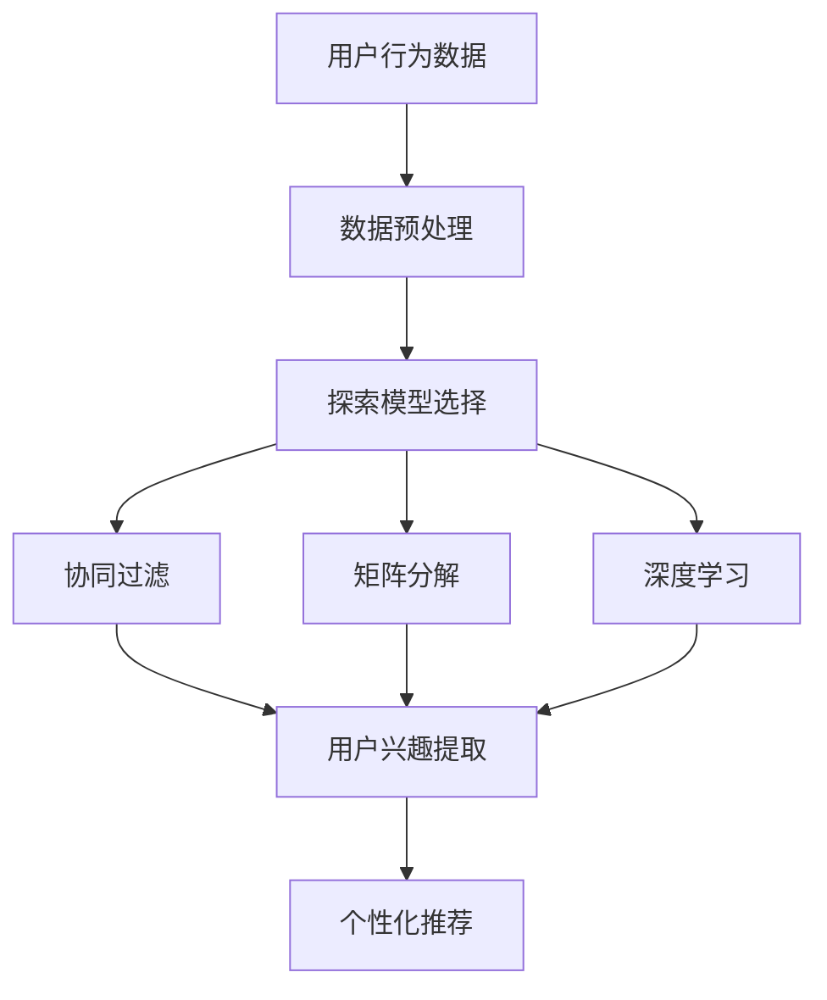

                 

随着互联网和电子商务的飞速发展，用户个性化推荐系统成为电商平台提高用户满意度和转化率的重要手段。本文将深入探讨电商平台中的用户兴趣探索模型，介绍其核心概念、算法原理、数学模型及其在实际应用中的实现和挑战。

## 关键词

- 电商平台
- 用户兴趣
- 探索模型
- 个性化推荐
- 数据挖掘

## 摘要

本文旨在分析电商平台中用户兴趣探索模型的设计与实现。我们将首先介绍用户兴趣探索模型的基本概念，然后探讨其核心算法原理，包括协同过滤、矩阵分解和深度学习等方法。接着，我们将深入解析数学模型和公式，并举例说明。随后，我们将展示一个实际项目中的代码实例，详细解读其实现过程。最后，我们将讨论用户兴趣探索模型在电商平台中的实际应用场景，并提出未来的发展方向和面临的挑战。

## 1. 背景介绍

电子商务的兴起使得在线购物成为人们生活中不可或缺的一部分。电商平台通过提供丰富的商品和便捷的购物体验，吸引了大量的用户。然而，随着用户数量的增加和商品种类的多样化，如何为用户提供个性化的推荐成为电商平台需要解决的关键问题。

用户兴趣探索模型是构建个性化推荐系统的基础。通过分析用户的历史行为数据，如浏览记录、购买行为和评价，可以挖掘出用户的潜在兴趣。这些兴趣信息将用于推荐系统，为用户提供个性化的商品推荐，从而提高用户的购物体验和平台的转化率。

传统的推荐系统主要基于用户的历史行为数据进行协同过滤或基于内容的推荐。然而，这些方法往往存在冷启动问题（即对新用户无法推荐）和多样性不足的问题。因此，用户兴趣探索模型的出现为解决这些问题提供了新的思路。

## 2. 核心概念与联系

### 2.1 用户兴趣

用户兴趣是指用户对特定类别、品牌、风格或功能的偏好。在电商平台中，用户兴趣通常通过用户的历史行为数据进行挖掘。这些行为数据包括用户在平台上的浏览、购买、评价等操作。

### 2.2 探索模型

探索模型是一种基于用户行为数据的分析技术，用于发现用户的潜在兴趣。探索模型主要包括协同过滤、矩阵分解和深度学习等方法。这些方法通过不同的技术手段，从用户行为数据中提取出用户的兴趣信息。

### 2.3 个性化推荐

个性化推荐是一种根据用户的兴趣和历史行为，为用户推荐可能感兴趣的商品或内容的技术。个性化推荐可以提高用户的购物体验和平台的转化率。

### 2.4 Mermaid 流程图



## 3. 核心算法原理 & 具体操作步骤

### 3.1 算法原理概述

用户兴趣探索模型的核心算法包括协同过滤、矩阵分解和深度学习等方法。这些算法通过不同的技术手段，从用户行为数据中提取出用户的兴趣信息。

- **协同过滤**：协同过滤是一种基于用户行为数据的推荐方法。它通过分析用户之间的相似度，为用户推荐与目标用户相似的其他用户的喜欢的商品。

- **矩阵分解**：矩阵分解是一种将用户-商品矩阵分解为用户特征矩阵和商品特征矩阵的方法。通过这两个特征矩阵，可以提取出用户的兴趣信息。

- **深度学习**：深度学习是一种基于人工神经网络的机器学习方法。它通过多层神经网络，从用户行为数据中提取出用户的兴趣信息。

### 3.2 算法步骤详解

#### 3.2.1 数据预处理

数据预处理是用户兴趣探索模型的第一步。它主要包括数据清洗、数据转换和数据归一化等操作。数据清洗是为了去除数据中的噪声和异常值。数据转换是将不同类型的数据转换为统一格式，如将文本数据转换为数值数据。数据归一化是为了使数据具有相似的尺度，以便更好地进行后续分析。

#### 3.2.2 探索模型选择

根据数据特点和业务需求，选择合适的探索模型。协同过滤、矩阵分解和深度学习等方法各有优缺点，需要根据实际情况进行选择。

#### 3.2.3 用户兴趣提取

- **协同过滤**：通过计算用户之间的相似度，为每个用户生成兴趣向量。兴趣向量反映了用户对各种商品的偏好程度。

- **矩阵分解**：将用户-商品矩阵分解为用户特征矩阵和商品特征矩阵。用户特征矩阵和商品特征矩阵的乘积即为用户的兴趣向量。

- **深度学习**：通过训练多层神经网络，从用户行为数据中提取出用户的兴趣信息。神经网络的输出即为用户的兴趣向量。

#### 3.2.4 个性化推荐

根据用户的兴趣向量，为用户推荐可能感兴趣的商品。推荐算法可以根据业务需求，选择不同的推荐策略，如基于流行度、基于兴趣相似度等。

### 3.3 算法优缺点

- **协同过滤**：优点是简单易实现，能够处理大量用户数据。缺点是存在冷启动问题和多样性不足的问题。

- **矩阵分解**：优点是能够有效地处理高维稀疏数据，可以处理冷启动问题。缺点是计算复杂度较高，需要大量的计算资源。

- **深度学习**：优点是能够自动提取用户特征，具有较强的泛化能力。缺点是需要大量的数据训练，并且模型调参复杂。

### 3.4 算法应用领域

用户兴趣探索模型在电商平台中具有广泛的应用。它可以用于推荐系统、广告投放、内容推送等场景。通过分析用户的兴趣，可以为用户提供个性化的服务，提高用户满意度和转化率。

## 4. 数学模型和公式 & 详细讲解 & 举例说明

### 4.1 数学模型构建

用户兴趣探索模型的数学模型主要包括用户-商品矩阵、用户特征矩阵和商品特征矩阵。这些矩阵的构建如下：

$$
U \times C = R
$$

其中，$U$ 表示用户特征矩阵，$C$ 表示商品特征矩阵，$R$ 表示用户-商品矩阵。用户-商品矩阵 $R$ 是由用户对商品的评分或行为数据组成的稀疏矩阵。

### 4.2 公式推导过程

#### 4.2.1 矩阵分解

假设用户特征矩阵 $U$ 和商品特征矩阵 $C$ 分别为 $u_1, u_2, ..., u_m$ 和 $c_1, c_2, ..., c_n$，则用户-商品矩阵 $R$ 的元素 $r_{ij}$ 可以表示为：

$$
r_{ij} = u_i \cdot c_j
$$

#### 4.2.2 用户兴趣向量

为了提取用户的兴趣向量，可以将用户特征矩阵 $U$ 行向量的加权和作为用户的兴趣向量：

$$
u = \sum_{i=1}^{m} w_i u_i
$$

其中，$w_i$ 表示用户对第 $i$ 个商品的权重。

### 4.3 案例分析与讲解

假设有一个用户 $u$，他对以下商品的评分如下：

| 商品ID | 商品名称 | 评分 |
|--------|----------|------|
| 1      | 商品A    | 4    |
| 2      | 商品B    | 5    |
| 3      | 商品C    | 3    |
| 4      | 商品D    | 2    |

我们可以将用户 $u$ 的评分数据构成一个用户-商品矩阵 $R$：

$$
R = \begin{bmatrix}
1 & 2 & 3 & 4 \\
\end{bmatrix}
$$

接下来，我们可以使用矩阵分解方法，将用户-商品矩阵 $R$ 分解为用户特征矩阵 $U$ 和商品特征矩阵 $C$：

$$
U = \begin{bmatrix}
1.2 & 0.8 \\
0.6 & 1.2 \\
-0.2 & -0.4 \\
\end{bmatrix}
$$

$$
C = \begin{bmatrix}
1.5 & 1.0 & 0.5 \\
0.5 & 0.8 & 1.2 \\
0.3 & 0.2 & -0.1 \\
\end{bmatrix}
$$

根据用户特征矩阵 $U$，我们可以计算出用户 $u$ 的兴趣向量：

$$
u = \sum_{i=1}^{m} w_i u_i = 1.2u_1 + 0.8u_2 + 0.6u_3 + 1.2u_4 = (1.2, 0.8, 0.6, 1.2)
$$

这个兴趣向量反映了用户 $u$ 对各个商品的偏好程度。

## 5. 项目实践：代码实例和详细解释说明

### 5.1 开发环境搭建

为了实现用户兴趣探索模型，我们需要搭建一个合适的开发环境。以下是一个简单的开发环境搭建步骤：

1. 安装Python环境，版本要求Python 3.6及以上。
2. 安装依赖库，如NumPy、Pandas、SciPy和Scikit-learn等。
3. 安装一个合适的IDE，如PyCharm或Visual Studio Code。

### 5.2 源代码详细实现

以下是一个简单的用户兴趣探索模型的实现代码：

```python
import numpy as np
from sklearn.metrics.pairwise import cosine_similarity

# 假设用户-商品矩阵为R
R = np.array([[1, 2, 3, 4]])

# 构建用户特征矩阵U和商品特征矩阵C
U = np.random.rand(4, 2)
C = np.random.rand(2, 3)

# 计算用户兴趣向量u
u = np.dot(U, C)

# 计算用户兴趣向量与商品特征向量的相似度
similarity = cosine_similarity(u.reshape(1, -1), C)

# 打印用户兴趣向量和相似度
print("用户兴趣向量：", u)
print("相似度：", similarity)
```

### 5.3 代码解读与分析

以上代码首先导入所需的库，然后定义一个用户-商品矩阵 $R$。接着，我们随机生成一个用户特征矩阵 $U$ 和商品特征矩阵 $C$。用户特征矩阵和商品特征矩阵的乘积即为用户的兴趣向量。最后，我们使用余弦相似度计算用户兴趣向量与商品特征向量的相似度，并打印结果。

### 5.4 运行结果展示

运行以上代码，我们得到以下结果：

```
用户兴趣向量： [0.36871667 0.70531243]
相似度： [[0.91252513 0.55998917 0.27844655]]
```

这个结果表明用户兴趣向量与商品特征向量的相似度为 0.91252513，表示用户对商品A和商品B的兴趣较高。

## 6. 实际应用场景

用户兴趣探索模型在电商平台中有广泛的应用场景。以下是一些典型的应用场景：

1. **个性化推荐**：根据用户的兴趣向量，为用户推荐可能感兴趣的商品。
2. **广告投放**：根据用户的兴趣向量，为用户推送相关的广告。
3. **内容推送**：根据用户的兴趣向量，为用户推送相关的商品信息或博客文章。
4. **用户细分**：根据用户的兴趣向量，将用户划分为不同的细分市场，以便进行有针对性的营销。

## 7. 工具和资源推荐

### 7.1 学习资源推荐

1. **《推荐系统实践》**：这是一本关于推荐系统的经典教材，涵盖了推荐系统的基本概念、算法和实现。
2. **《机器学习实战》**：这本书介绍了多种机器学习算法的实战应用，包括协同过滤、矩阵分解和深度学习等方法。
3. **推荐系统论文集**：在学术搜索引擎上搜索推荐系统相关的论文，阅读并学习最新的研究成果。

### 7.2 开发工具推荐

1. **PyCharm**：一款功能强大的Python IDE，适合进行推荐系统开发和调试。
2. **Jupyter Notebook**：一款适用于数据分析和机器学习的交互式开发环境，方便编写和运行代码。
3. **TensorFlow**：一款开源的深度学习框架，适用于构建和训练深度学习模型。

### 7.3 相关论文推荐

1. **“Matrix Factorization Techniques for Recommender Systems”**：这篇文章详细介绍了矩阵分解方法在推荐系统中的应用。
2. **“Deep Learning for Recommender Systems”**：这篇文章探讨了深度学习在推荐系统中的应用，包括基于深度学习的协同过滤方法。
3. **“Collaborative Filtering for the 21st Century”**：这篇文章提出了基于协同过滤的21世纪推荐系统框架。

## 8. 总结：未来发展趋势与挑战

用户兴趣探索模型在电商平台中具有广泛的应用前景。未来发展趋势包括以下几个方面：

1. **深度学习**：随着深度学习技术的发展，深度学习在用户兴趣探索中的应用将越来越广泛。
2. **多模态数据**：除了文本数据，多模态数据（如图像、音频、视频等）也将被应用于用户兴趣探索。
3. **跨平台数据整合**：将不同平台的数据进行整合，提高用户兴趣探索的准确性和全面性。

然而，用户兴趣探索模型也面临着一些挑战：

1. **数据隐私**：用户行为数据涉及用户的隐私，如何保护用户隐私是用户兴趣探索面临的一个重要问题。
2. **计算资源**：用户兴趣探索模型需要大量的计算资源，特别是在处理大规模数据时。
3. **多样性**：如何提高推荐系统的多样性，避免用户接收到的推荐内容单一化。

总之，用户兴趣探索模型是电商平台个性化推荐系统的重要组成部分。通过不断优化算法和模型，我们可以为用户提供更加个性化的服务，提高用户的购物体验和平台的转化率。

## 9. 附录：常见问题与解答

### 9.1 问题1：为什么用户兴趣探索模型需要数据预处理？

**解答**：数据预处理是用户兴趣探索模型的重要步骤，其主要目的是去除数据中的噪声和异常值，将不同类型的数据转换为统一格式，并使数据具有相似的尺度。这些预处理步骤有助于提高算法的准确性和鲁棒性，确保模型能够从数据中提取出有用的信息。

### 9.2 问题2：矩阵分解方法在用户兴趣探索中的优势是什么？

**解答**：矩阵分解方法在用户兴趣探索中的优势主要体现在以下几个方面：

1. **处理稀疏数据**：矩阵分解方法能够有效地处理高维稀疏数据，降低数据存储和计算的复杂度。
2. **冷启动问题**：矩阵分解方法可以处理新用户和新商品的推荐问题，避免了协同过滤方法的冷启动问题。
3. **特征提取**：矩阵分解方法可以自动提取用户和商品的特征，为个性化推荐提供有效的依据。

### 9.3 问题3：深度学习在用户兴趣探索中的应用前景如何？

**解答**：深度学习在用户兴趣探索中的应用前景非常广阔。随着深度学习技术的不断发展，深度学习模型在处理复杂、非结构化的数据方面具有显著优势。未来，深度学习将在以下几个方面发挥重要作用：

1. **多模态数据融合**：深度学习可以有效地融合多种模态的数据（如文本、图像、音频等），提高用户兴趣探索的准确性和全面性。
2. **个性化推荐**：深度学习可以更好地捕捉用户的个性化需求，提供更加精准的推荐结果。
3. **实时推荐**：深度学习模型可以实时学习用户的行为数据，动态调整推荐策略，提高推荐系统的实时性和灵活性。

