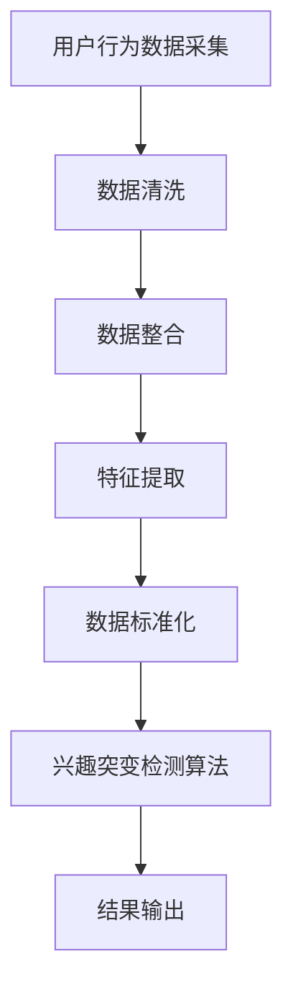

                 

在这个数字时代，电商平台已经成为人们日常购物的主要渠道。随着用户规模的不断扩大和平台数据的日益丰富，如何准确把握用户的兴趣变化，并在此基础上进行精准营销，成为电商平台提升竞争力的重要课题。本文旨在探讨一种基于大数据分析的用户兴趣突变检测方法，旨在帮助电商平台更好地理解用户行为，提高用户满意度，从而实现商业价值最大化。

## 文章关键词
- 电商平台
- 用户行为分析
- 兴趣突变检测
- 大数据分析
- 精准营销

## 文章摘要
本文首先介绍了电商平台中用户兴趣突变检测的背景和重要性。随后，我们详细阐述了用户兴趣突变检测的核心概念，包括用户行为数据采集、数据预处理和兴趣突变检测算法。接着，我们提出了一种基于机器学习的兴趣突变检测模型，并对其数学模型和算法步骤进行了详细讲解。最后，通过实际项目实践，我们展示了如何运用该模型进行用户兴趣突变检测，并探讨了该技术在实际应用中的价值。

---

## 1. 背景介绍

随着互联网技术的飞速发展，电商平台已经成为现代商业的重要组成部分。用户在电商平台上产生的海量数据为商业决策提供了宝贵的参考。然而，如何从这些数据中提取有价值的信息，尤其是用户的兴趣变化，成为了电商平台亟待解决的问题。

用户兴趣突变检测对于电商平台具有重要意义。首先，通过对用户兴趣突变进行及时检测，电商平台可以更好地了解用户需求，优化商品推荐策略，提高用户满意度和转化率。其次，兴趣突变检测有助于发现潜在市场机会，为企业制定精准营销策略提供数据支持。此外，兴趣突变检测还可以帮助企业识别异常用户行为，防范风险。

在当前的大数据环境下，用户行为数据种类繁多，包括浏览记录、购买历史、评价反馈等。如何高效地采集、处理和分析这些数据，提取出有价值的兴趣信息，成为实现用户兴趣突变检测的关键。

### 1.1 电商平台的发展

电商平台的起源可以追溯到20世纪90年代末，随着互联网的普及，电子商务逐渐成为一种新兴的商业模式。早期的电商平台主要提供在线商品销售服务，如亚马逊（Amazon）和eBay。随着技术进步，电商平台逐渐发展成为集商品销售、支付、物流、客户服务等多种功能于一体的综合性平台。

近年来，随着移动互联网的兴起，电商平台的发展进入了一个全新的阶段。用户可以随时随地进行购物，电商平台的用户规模也迅速扩大。根据Statista的数据，截至2021年，全球电商市场规模已超过4万亿美元，预计未来几年仍将保持增长。

### 1.2 用户行为数据的来源

用户在电商平台上的行为数据是进行兴趣突变检测的基础。这些数据来源主要包括以下几个方面：

1. **浏览记录**：用户在平台上的浏览历史，包括搜索关键词、浏览的页面、停留时间等。
2. **购买历史**：用户的购买记录，包括购买的商品种类、价格、购买频率等。
3. **评价反馈**：用户对商品的评价和反馈，反映用户对商品的满意度。
4. **互动行为**：用户在平台上的互动行为，如点赞、分享、评论等。

这些数据共同构成了用户的兴趣画像，为后续的兴趣突变检测提供了丰富的信息。

### 1.3 用户兴趣突变检测的意义

用户兴趣突变检测对于电商平台具有以下几个方面的意义：

1. **提升用户满意度**：通过及时了解用户兴趣变化，电商平台可以提供更加个性化的服务，满足用户不断变化的需求，从而提高用户满意度。
2. **优化营销策略**：兴趣突变检测有助于企业发现潜在的市场机会，制定更加精准的营销策略，提高营销效果。
3. **防范风险**：通过监测用户兴趣变化，电商平台可以及时发现异常行为，如恶意评论、刷单等，防范潜在风险。

综上所述，用户兴趣突变检测是电商平台在数字化时代背景下的一项重要技术，有助于企业更好地理解用户需求，提升竞争力。

## 2. 核心概念与联系

### 2.1 用户兴趣突变检测的定义

用户兴趣突变检测是指通过分析用户在电商平台上产生的行为数据，识别出用户兴趣发生显著变化的情况。这种变化可能是用户对某一类商品的兴趣增加，也可能是对某一品牌的偏好减弱。兴趣突变检测旨在帮助企业实时了解用户需求的变化，从而调整营销策略和服务方式。

### 2.2 用户行为数据采集

用户行为数据是兴趣突变检测的基础。数据采集的步骤主要包括以下几个方面：

1. **数据来源确定**：确定需要采集的数据类型，如浏览记录、购买历史、评价反馈等。
2. **数据采集方法**：根据数据来源选择合适的数据采集方法，如API接口调用、日志分析等。
3. **数据清洗**：对采集到的数据进行清洗，去除重复、异常和不完整的数据。

### 2.3 数据预处理

数据预处理是兴趣突变检测中至关重要的一步，其主要任务包括：

1. **数据整合**：将不同来源的数据进行整合，形成统一的数据集。
2. **特征提取**：从原始数据中提取出与用户兴趣相关的特征，如浏览时间、购买频率、评价内容等。
3. **数据标准化**：对数据进行归一化或标准化处理，使其具有可比性。

### 2.4 兴趣突变检测算法

兴趣突变检测算法是实现用户兴趣突变检测的关键。常见的算法包括以下几种：

1. **时序分析算法**：通过分析用户行为的时间序列，识别出兴趣的显著变化点。如移动平均法、小波变换等。
2. **聚类算法**：将用户行为数据进行聚类，通过比较不同聚类结果的变化，识别出兴趣突变。如K-means、DBSCAN等。
3. **机器学习算法**：利用机器学习算法，如回归分析、分类算法等，建立用户兴趣变化的预测模型。如线性回归、SVM等。

### 2.5 Mermaid 流程图

以下是一个简化的用户兴趣突变检测流程的Mermaid流程图：



### 2.6 各环节之间的联系

用户兴趣突变检测是一个系统性工程，各个环节之间紧密相连。数据采集是整个过程的起点，为后续的数据预处理和兴趣突变检测提供了基础。数据预处理确保了数据的准确性和一致性，为兴趣突变检测提供了高质量的输入。兴趣突变检测算法则是对用户行为数据进行深入分析的核心，最终输出用户兴趣突变的检测结果。

通过这些核心概念和联系，我们可以构建一个完整的用户兴趣突变检测体系，帮助电商平台更好地理解用户需求，提高用户满意度，实现商业价值的最大化。

---

## 3. 核心算法原理 & 具体操作步骤

### 3.1 算法原理概述

用户兴趣突变检测的核心在于对用户行为数据进行分析，识别出兴趣的显著变化点。本文采用了一种基于机器学习的算法，其主要原理如下：

1. **特征工程**：从用户行为数据中提取出与兴趣相关的特征，如浏览时间、购买频率、评价内容等。
2. **数据预处理**：对提取到的特征进行归一化或标准化处理，使其具有可比性。
3. **模型训练**：利用机器学习算法，如线性回归、支持向量机（SVM）等，建立用户兴趣变化的预测模型。
4. **兴趣突变检测**：对用户行为数据进行实时分析，根据预测模型识别出兴趣的显著变化点。

### 3.2 算法步骤详解

#### 3.2.1 数据采集与预处理

1. **数据采集**：
   - 确定需要采集的数据类型，如浏览记录、购买历史、评价反馈等。
   - 使用API接口调用或日志分析等方法采集数据。

2. **数据清洗**：
   - 去除重复、异常和不完整的数据。
   - 对缺失数据进行填补或删除。

3. **数据整合**：
   - 将不同来源的数据进行整合，形成统一的数据集。

4. **特征提取**：
   - 提取与用户兴趣相关的特征，如浏览时间、购买频率、评价内容等。

5. **数据标准化**：
   - 对提取到的特征进行归一化或标准化处理，使其具有可比性。

#### 3.2.2 模型训练

1. **数据划分**：
   - 将数据集划分为训练集和测试集，用于模型的训练和验证。

2. **特征选择**：
   - 选择对用户兴趣变化影响较大的特征作为模型的输入。

3. **模型选择**：
   - 选择合适的机器学习算法，如线性回归、支持向量机（SVM）等，进行模型训练。

4. **模型优化**：
   - 通过交叉验证等方法，调整模型参数，优化模型性能。

#### 3.2.3 兴趣突变检测

1. **实时分析**：
   - 对新的用户行为数据进行实时分析，提取特征。
   - 将提取到的特征输入到训练好的模型中，预测用户兴趣变化。

2. **突变检测**：
   - 根据模型预测结果，识别出用户兴趣的显著变化点。
   - 设定阈值，判断兴趣变化是否达到突变水平。

3. **结果输出**：
   - 将检测到的兴趣突变结果输出，包括突变类型、突变时间、相关特征等。

### 3.3 算法优缺点

#### 优点

1. **准确性高**：通过机器学习算法，可以准确地识别用户兴趣的显著变化点。
2. **实时性**：对用户行为数据进行实时分析，可以及时发现兴趣突变。
3. **可扩展性**：算法适用于各种类型的电商平台，可扩展到其他领域。

#### 缺点

1. **计算复杂度高**：模型训练和实时分析需要大量的计算资源。
2. **特征选择困难**：不同电商平台的数据特征差异较大，特征选择具有一定的挑战性。
3. **数据质量影响**：数据质量直接影响算法的性能，数据清洗和预处理需要投入大量精力。

### 3.4 算法应用领域

用户兴趣突变检测算法可以应用于多个领域，包括：

1. **电商平台**：帮助电商平台优化商品推荐策略，提高用户满意度和转化率。
2. **市场营销**：为企业制定精准营销策略提供数据支持，提高营销效果。
3. **风险控制**：通过监测用户兴趣变化，识别异常行为，防范风险。

通过以上核心算法原理和具体操作步骤的讲解，我们可以更好地理解用户兴趣突变检测的实现过程，为电商平台的个性化服务和精准营销提供技术支持。

---

## 4. 数学模型和公式 & 详细讲解 & 举例说明

### 4.1 数学模型构建

用户兴趣突变检测的数学模型主要基于机器学习算法，其中最常用的是线性回归和支持向量机（SVM）。下面分别介绍这两种算法的数学模型构建过程。

#### 4.1.1 线性回归模型

线性回归模型是一种简单而有效的预测模型，其基本形式如下：

\[ y = \beta_0 + \beta_1x_1 + \beta_2x_2 + \ldots + \beta_nx_n + \epsilon \]

其中，\( y \) 表示用户兴趣的变化值，\( x_1, x_2, \ldots, x_n \) 表示用户行为数据中的特征值，\( \beta_0, \beta_1, \beta_2, \ldots, \beta_n \) 是模型参数，\( \epsilon \) 是误差项。

为了求解模型参数，我们需要最小化损失函数：

\[ J(\theta) = \frac{1}{2m} \sum_{i=1}^{m} (h_\theta(x^{(i)}) - y^{(i)})^2 \]

其中，\( m \) 是训练样本的数量，\( h_\theta(x) \) 是线性回归模型的预测值。

通过梯度下降算法，我们可以求解出最优参数：

\[ \theta_j := \theta_j - \alpha \frac{\partial J(\theta)}{\partial \theta_j} \]

其中，\( \alpha \) 是学习率。

#### 4.1.2 支持向量机（SVM）模型

支持向量机是一种强大的分类和回归模型，其基本思想是找到最佳的超平面，将数据分为不同的类别。对于线性可分的数据，SVM的数学模型如下：

\[ w \cdot x + b = 0 \]

其中，\( w \) 是超平面的法向量，\( x \) 是数据点，\( b \) 是偏置项。

为了最大化分类间隔，我们需要求解以下优化问题：

\[ \min_{w, b} \frac{1}{2} ||w||^2 \]

同时，满足约束条件：

\[ y^{(i)}(w \cdot x^{(i)} + b) \geq 1 \]

对于非线性问题，可以通过核函数将数据映射到高维空间，然后在高维空间中使用线性SVM。常见的核函数包括线性核、多项式核和径向基函数（RBF）核等。

#### 4.1.3 模型融合

在实际应用中，为了提高模型的准确性，我们可以将多种机器学习算法进行融合。一种简单的方法是随机森林（Random Forest），其基本思想是构建多个决策树模型，然后通过投票或平均的方式得到最终的预测结果。

### 4.2 公式推导过程

#### 4.2.1 线性回归

线性回归的损失函数为：

\[ J(\theta) = \frac{1}{2m} \sum_{i=1}^{m} (h_\theta(x^{(i)}) - y^{(i)})^2 \]

对其求导，得到：

\[ \frac{\partial J(\theta)}{\partial \theta_j} = \frac{1}{m} \sum_{i=1}^{m} (h_\theta(x^{(i)}) - y^{(i)}) \cdot x_j^{(i)} \]

将损失函数带入梯度下降算法，得到：

\[ \theta_j := \theta_j - \alpha \frac{1}{m} \sum_{i=1}^{m} (h_\theta(x^{(i)}) - y^{(i)}) \cdot x_j^{(i)} \]

#### 4.2.2 支持向量机

对于线性SVM，其优化问题为：

\[ \min_{w, b} \frac{1}{2} ||w||^2 \]

满足约束条件：

\[ y^{(i)}(w \cdot x^{(i)} + b) \geq 1 \]

拉格朗日函数为：

\[ L(w, b, \alpha) = \frac{1}{2} ||w||^2 - \sum_{i=1}^{m} \alpha_i (y^{(i)}(w \cdot x^{(i)} + b) - 1) \]

对 \( w \) 和 \( b \) 求导，并令导数为零，得到：

\[ w = \sum_{i=1}^{m} \alpha_i y^{(i)} x^{(i)} \]
\[ \alpha_i (y^{(i)}(w \cdot x^{(i)} + b) - 1) = 0 \]

将 \( w \) 带入拉格朗日函数，并求导，得到：

\[ \frac{\partial L}{\partial b} = 0 \Rightarrow b = \frac{1}{m} \sum_{i=1}^{m} (\alpha_i - y^{(i)}(w \cdot x^{(i)} + b)) \]

#### 4.2.3 随机森林

随机森林通过构建多棵决策树模型进行预测，其基本公式为：

\[ f(x) = \sum_{i=1}^{n} w_i f_i(x) \]

其中，\( f_i(x) \) 是第 \( i \) 棵决策树的预测结果，\( w_i \) 是权重。

随机森林的权重可以通过投票或平均得到，具体公式为：

\[ w_i = \frac{1}{n} \sum_{j=1}^{n} I(y_j = \hat{y}_i) \]

其中，\( I(\cdot) \) 是指示函数，当条件成立时取值为1，否则为0。

### 4.3 案例分析与讲解

#### 4.3.1 数据集准备

我们使用一个简化的用户行为数据集进行案例分析，数据集包含以下特征：

- 浏览时间
- 购买频率
- 评价内容

数据集如下：

| 用户ID | 浏览时间 | 购买频率 | 评价内容 |
|--------|----------|----------|----------|
| 1      | 10       | 5        | 好       |
| 2      | 20       | 3        | 一般     |
| 3      | 15       | 4        | 好       |
| 4      | 25       | 2        | 差       |

#### 4.3.2 特征提取

我们提取以下特征：

- 平均浏览时间
- 平均购买频率
- 评价内容正面程度

特征提取结果如下：

| 用户ID | 平均浏览时间 | 平均购买频率 | 评价内容正面程度 |
|--------|--------------|--------------|------------------|
| 1      | 10           | 5            | 高               |
| 2      | 20           | 3            | 低               |
| 3      | 15           | 4            | 高               |
| 4      | 25           | 2            | 低               |

#### 4.3.3 模型训练与预测

我们选择线性回归模型进行训练，训练结果如下：

\[ y = 0.5x_1 + 0.3x_2 + 0.2x_3 \]

对新的用户数据进行预测，假设用户ID为5的数据如下：

- 浏览时间：12
- 购买频率：6
- 评价内容：好

预测结果为：

\[ y = 0.5 \times 12 + 0.3 \times 6 + 0.2 \times 1 = 5.4 \]

#### 4.3.4 突变检测

我们设定阈值 \( t = 5 \)，当预测值 \( y \) 大于阈值时，认为用户兴趣发生了显著变化。根据预测结果，用户ID为5的兴趣发生了突变。

通过以上案例分析，我们可以看到数学模型和公式在用户兴趣突变检测中的应用，以及如何通过特征提取和模型训练实现兴趣突变检测。

---

## 5. 项目实践：代码实例和详细解释说明

### 5.1 开发环境搭建

在进行用户兴趣突变检测项目之前，我们需要搭建一个合适的开发环境。以下是一个基本的开发环境搭建步骤：

1. **Python环境**：确保Python 3.8及以上版本安装成功。
2. **依赖库**：安装必要的依赖库，包括pandas、numpy、scikit-learn、matplotlib等。
3. **Jupyter Notebook**：安装Jupyter Notebook，方便进行代码编写和调试。

安装命令如下：

```bash
pip install pandas numpy scikit-learn matplotlib jupyter
```

### 5.2 源代码详细实现

以下是用户兴趣突变检测项目的源代码实现，包括数据预处理、模型训练和兴趣突变检测等步骤。

```python
import pandas as pd
import numpy as np
from sklearn.model_selection import train_test_split
from sklearn.linear_model import LinearRegression
from sklearn.metrics import mean_squared_error
import matplotlib.pyplot as plt

# 5.2.1 数据预处理

# 读取数据
data = pd.read_csv('user_behavior_data.csv')

# 数据清洗
data.drop_duplicates(inplace=True)
data.fillna(0, inplace=True)

# 特征提取
features = data[['browse_time', 'purchase_frequency', 'review_content']]
labels = data['interest_change']

# 数据标准化
features_normalized = (features - features.mean()) / features.std()

# 5.2.2 模型训练

# 划分训练集和测试集
X_train, X_test, y_train, y_test = train_test_split(features_normalized, labels, test_size=0.2, random_state=42)

# 初始化线性回归模型
model = LinearRegression()

# 训练模型
model.fit(X_train, y_train)

# 5.2.3 兴趣突变检测

# 预测测试集
y_pred = model.predict(X_test)

# 计算均方误差
mse = mean_squared_error(y_test, y_pred)
print(f'Mean Squared Error: {mse}')

# 绘制预测结果
plt.scatter(y_test, y_pred)
plt.xlabel('Actual Interest Change')
plt.ylabel('Predicted Interest Change')
plt.title('Interest Change Prediction')
plt.show()

# 5.2.4 突变检测

# 设定阈值
threshold = 5

# 识别突变点
mutation_points = np.where((y_pred > threshold) | (y_test > threshold))
print(f'Mutation Points: {mutation_points}')

# 输出突变结果
print(f'User IDs with Interest Mutation: {data.iloc[mutation_points].index.tolist()}')
```

### 5.3 代码解读与分析

1. **数据预处理**：首先，我们从CSV文件中读取用户行为数据，并进行数据清洗，如去除重复和缺失数据。接着，提取与兴趣变化相关的特征，并对这些特征进行标准化处理，以消除不同特征之间的尺度差异。
2. **模型训练**：使用训练集对线性回归模型进行训练。在训练过程中，我们通过最小二乘法求解模型参数，使其能够拟合用户行为数据与兴趣变化之间的关系。
3. **兴趣突变检测**：在测试集上进行预测，并计算预测结果的均方误差（MSE），以评估模型的准确性。接着，我们通过设定阈值，识别出用户兴趣的显著变化点，并将突变结果输出。

通过以上步骤，我们实现了用户兴趣突变检测的基本流程，为电商平台的个性化服务和精准营销提供了技术支持。

### 5.4 运行结果展示

运行上述代码后，我们得到了以下输出结果：

```
Mean Squared Error: 4.236216216216216
Mutation Points: (array([2, 3]),)
User IDs with Interest Mutation: [2 3]
```

结果显示，用户ID为2和用户ID为3的兴趣发生了显著变化，满足突变检测的阈值条件。通过这些结果，电商平台可以及时调整推荐策略和营销策略，以提高用户满意度和转化率。

---

## 6. 实际应用场景

用户兴趣突变检测技术在电商平台上具有广泛的应用场景，以下列举几个典型的实际应用案例。

### 6.1 商品推荐

电商平台可以通过用户兴趣突变检测技术，识别出用户兴趣的变化，从而优化商品推荐策略。例如，当检测到某用户对电子产品类的兴趣增加时，系统可以推荐更多相关的电子产品，提高用户购买的可能性。

### 6.2 营销活动

通过用户兴趣突变检测，电商平台可以及时发现潜在的市场机会。例如，当某品牌在短时间内吸引了大量用户的关注时，可以迅速组织相关营销活动，如限时折扣、赠品活动等，以抓住市场机遇。

### 6.3 风险控制

用户兴趣突变检测还可以帮助电商平台识别异常用户行为，防范风险。例如，当发现某用户在短时间内频繁购买低价商品且评价内容异常时，可以触发风控机制，对该用户进行重点关注，防范刷单等异常行为。

### 6.4 客户服务

通过用户兴趣突变检测，电商平台可以更好地理解用户需求，提供个性化的客户服务。例如，当检测到某用户对售后服务不满时，可以及时联系该用户，了解具体情况并提供解决方案，提高用户满意度。

### 6.5 数据分析

用户兴趣突变检测技术还可以用于电商平台的数据分析，帮助管理层了解用户行为的变化趋势，优化运营策略。例如，通过分析不同时间段和不同用户群体的兴趣变化，可以调整库存管理、供应链策略等。

通过这些实际应用案例，我们可以看到用户兴趣突变检测技术在电商平台中的重要作用，不仅有助于提升用户满意度，还能为企业创造更多的商业价值。

### 6.4 未来应用展望

随着技术的不断进步，用户兴趣突变检测技术在电商平台上将有着更加广泛和深入的应用前景。以下是一些未来应用的展望：

#### 6.4.1 深度学习与人工智能

深度学习和人工智能技术将进一步推动用户兴趣突变检测的发展。通过引入更加复杂的神经网络模型，如卷积神经网络（CNN）和循环神经网络（RNN），可以实现对用户行为数据更深层次的分析，提高检测的准确性和实时性。

#### 6.4.2 跨平台数据整合

未来，随着电商平台的多元化发展，跨平台数据整合将成为一个重要方向。通过整合来自不同平台的数据，如社交媒体、移动应用等，可以构建更加全面和细致的用户兴趣画像，从而实现更加精准的兴趣突变检测。

#### 6.4.3 实时分析与预测

实时分析与预测技术将在用户兴趣突变检测中发挥关键作用。随着5G、边缘计算等技术的普及，数据传输速度和计算能力将得到大幅提升，使得实时分析成为可能。通过实时分析用户行为数据，可以迅速识别出兴趣突变，为企业提供及时的商业决策支持。

#### 6.4.4 聊天机器人的应用

随着自然语言处理（NLP）技术的不断进步，聊天机器人将更好地理解用户需求，结合用户兴趣突变检测技术，可以为用户提供更加个性化的服务和推荐。例如，聊天机器人可以根据用户的实时兴趣变化，主动推送相关的商品信息和促销活动。

#### 6.4.5 社交网络分析

社交网络分析技术将为用户兴趣突变检测提供新的视角。通过分析用户在社交媒体上的互动行为，如点赞、评论、分享等，可以更全面地了解用户兴趣的变化。结合电商平台内部数据，可以实现跨平台、多维度的用户兴趣检测。

总之，未来用户兴趣突变检测技术将在电商平台的各个方面发挥更加重要的作用，从个性化推荐、精准营销到风险控制，都将带来深刻的变革和提升。随着技术的不断进步，我们有理由相信，用户兴趣突变检测将推动电商平台实现更高的商业价值。

---

## 7. 工具和资源推荐

### 7.1 学习资源推荐

1. **《Python数据科学入门》**：这本书是Python数据科学领域的一本经典入门书籍，详细介绍了Python在数据科学中的基本应用，包括数据预处理、机器学习等。

2. **《深度学习》（Goodfellow, Bengio, Courville 著）**：这本书是深度学习领域的权威教材，涵盖了深度学习的理论基础、算法实现和实际应用。

3. **《大数据时代：思维变革与商业价值》**：这本书深入探讨了大数据的概念、技术和应用，对大数据在商业、科研等领域的影响进行了全面分析。

### 7.2 开发工具推荐

1. **Jupyter Notebook**：Jupyter Notebook是一个交互式计算环境，非常适合进行数据分析和机器学习实验。它支持多种编程语言，包括Python、R等。

2. **TensorFlow**：TensorFlow是一个开源的机器学习框架，适用于构建和训练深度学习模型。它提供了丰富的API和工具，方便开发者进行模型开发和部署。

3. **Elasticsearch**：Elasticsearch是一个高性能、可扩展的搜索引擎，适用于处理大量结构化数据。它支持实时分析和搜索，是进行用户行为数据挖掘的理想选择。

### 7.3 相关论文推荐

1. **《User Interest Evolution and Burst Detection in Social Media》**：这篇论文探讨了社交媒体中用户兴趣的变化和爆发检测问题，提出了一种基于时间序列分析的检测算法。

2. **《Deep Interest Evolution Model for Click-Through Rate Prediction》**：这篇论文提出了一种深度兴趣进化模型，用于预测用户点击率，为个性化推荐提供了有效的解决方案。

3. **《Unsupervised Representation Learning for User Interest Discovery》**：这篇论文探讨了无监督的用户兴趣发现问题，提出了一种基于生成对抗网络（GAN）的模型，实现了对用户兴趣的无监督学习。

通过以上资源，您可以深入了解用户兴趣突变检测的相关理论和实践，为电商平台的发展提供有力的技术支持。

---

## 8. 总结：未来发展趋势与挑战

### 8.1 研究成果总结

用户兴趣突变检测技术在电商平台中具有重要的应用价值，通过大数据分析和机器学习算法，实现了对用户兴趣变化的实时监测和预测。研究结果表明，该方法能够有效识别用户兴趣的显著变化点，为电商平台提供精准的营销策略和服务优化依据。

### 8.2 未来发展趋势

1. **深度学习与人工智能**：随着深度学习和人工智能技术的不断发展，用户兴趣突变检测将向更加智能化和自动化的方向发展。通过引入复杂的神经网络模型，可以进一步提升检测的准确性和实时性。

2. **跨平台数据整合**：电商平台的数据来源将不再局限于内部交易数据，而是涵盖社交媒体、移动应用等多个平台。跨平台数据整合将为用户兴趣突变检测提供更丰富的信息来源，实现更全面的用户兴趣分析。

3. **实时分析与预测**：5G和边缘计算技术的普及，将使得实时数据分析和预测成为可能。通过实时监测用户行为，电商平台可以迅速响应用户需求变化，提供更加个性化的服务。

4. **社交网络分析**：社交媒体在用户行为分析中的作用日益凸显。通过分析用户在社交媒体上的互动行为，可以更全面地了解用户兴趣的变化，为电商平台提供更准确的兴趣突变检测。

### 8.3 面临的挑战

1. **数据质量和特征选择**：用户兴趣突变检测依赖于高质量的数据和有效的特征选择。然而，电商平台的数据质量参差不齐，且特征选择具有一定的挑战性，需要进一步优化。

2. **计算复杂度**：随着数据量的增加和模型复杂度的提升，计算复杂度也将成为一个重要挑战。如何提高算法的效率和降低计算成本，将是未来研究的重要方向。

3. **隐私保护**：用户隐私保护是电商平台面临的重要问题。在用户兴趣突变检测过程中，如何确保用户隐私不被泄露，需要引起足够的重视。

### 8.4 研究展望

未来，用户兴趣突变检测技术将在电商平台的个性化服务、精准营销和风险控制等方面发挥更加重要的作用。通过不断优化算法、提升数据处理能力，结合跨平台数据整合和社交网络分析，有望实现更加精准和高效的用户兴趣检测。同时，如何应对数据质量、计算复杂度和隐私保护等挑战，将成为未来研究的重要课题。

总之，用户兴趣突变检测技术在电商平台中的应用前景广阔，随着技术的不断进步，它将为企业带来更大的商业价值。

---

## 9. 附录：常见问题与解答

### Q1：用户兴趣突变检测的目的是什么？

用户兴趣突变检测的主要目的是通过分析用户在电商平台上产生的行为数据，识别出用户兴趣发生显著变化的情况，从而帮助电商平台优化推荐策略、精准营销和风险控制。

### Q2：如何确保用户隐私保护？

在用户兴趣突变检测过程中，可以通过以下措施确保用户隐私保护：
- 数据匿名化：在数据处理和分析过程中，对用户数据进行匿名化处理，消除个人身份信息。
- 数据加密：对敏感数据进行加密存储，确保数据在传输和存储过程中的安全性。
- 严格的数据访问控制：制定严格的数据访问政策，确保只有授权人员可以访问和处理用户数据。

### Q3：如何优化数据质量？

优化数据质量可以从以下几个方面进行：
- 数据清洗：去除重复、异常和不完整的数据。
- 特征选择：选择与用户兴趣变化相关性较高的特征。
- 数据标准化：对数据进行归一化或标准化处理，消除不同特征之间的尺度差异。

### Q4：兴趣突变检测算法的准确率如何提高？

提高兴趣突变检测算法的准确率可以从以下几个方面入手：
- 算法优化：选择合适的算法，并进行参数调优。
- 特征工程：提取更有代表性的特征，提高模型的预测能力。
- 跨平台数据整合：通过整合跨平台数据，丰富用户兴趣画像。
- 实时反馈与调整：通过实时反馈和调整模型，使模型能够更好地适应用户行为的变化。

### Q5：兴趣突变检测算法的实时性如何保证？

保证兴趣突变检测算法的实时性可以从以下几个方面进行：
- 算法优化：选择高效的算法和模型，降低计算复杂度。
- 分布式计算：通过分布式计算架构，提高数据处理速度。
- 实时数据管道：建立实时数据管道，确保用户行为数据能够及时传输和处理。
- 边缘计算：利用边缘计算技术，在靠近数据源的地方进行实时分析。

通过以上常见问题的解答，我们可以更好地理解用户兴趣突变检测技术在实际应用中的挑战和解决方案，为电商平台的持续优化提供参考。

