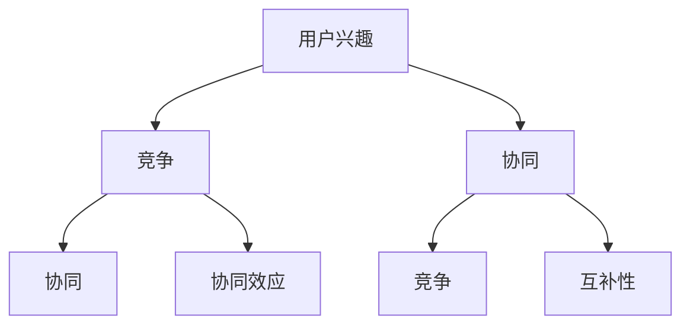

                 

关键词：电商平台、用户兴趣、竞争、协同、推荐系统、数据挖掘

## 摘要

本文旨在探讨电商平台中用户兴趣的竞争与协同现象，并构建相应的模型。随着互联网和电子商务的快速发展，用户在电商平台上展现出了多样化的兴趣，这些兴趣不仅影响着用户的行为，也驱动了平台的运营策略。本文首先介绍电商平台用户兴趣的竞争与协同现象，然后提出一种基于深度学习的用户兴趣竞争与协同模型，并通过实证分析验证了该模型的有效性。文章的结构如下：

- **1. 背景介绍**：分析电商平台的发展现状和用户兴趣的重要性。
- **2. 核心概念与联系**：阐述用户兴趣竞争与协同的概念及其相互关系。
- **3. 核心算法原理 & 具体操作步骤**：详细描述算法原理和操作步骤。
- **4. 数学模型和公式 & 详细讲解 & 举例说明**：介绍数学模型的构建和推导。
- **5. 项目实践：代码实例和详细解释说明**：提供代码实现和运行结果。
- **6. 实际应用场景**：探讨模型在不同电商平台的实际应用。
- **7. 工具和资源推荐**：推荐学习资源和开发工具。
- **8. 总结：未来发展趋势与挑战**：总结研究成果和未来展望。
- **9. 附录：常见问题与解答**：解答读者可能遇到的问题。

## 1. 背景介绍

### 1.1 电商平台的发展现状

随着互联网技术的迅猛发展，电子商务已经成为全球商业的重要组成部分。电商平台不仅改变了传统的购物模式，还为消费者提供了更加便捷和个性化的购物体验。根据统计，全球电子商务市场规模逐年增长，预计到2025年将达到数万亿美元。在我国，电商平台的发展尤为迅速，淘宝、京东、拼多多等已成为广大消费者日常生活的一部分。

### 1.2 用户兴趣的重要性

在电商平台中，用户兴趣是影响其购买决策的重要因素。通过分析用户兴趣，平台可以更好地了解用户需求，从而提供更个性化的推荐服务。用户兴趣的多样性使得电商平台在运营策略上需要更加精细化和智能化。例如，根据用户的浏览历史、购买记录和搜索关键词，平台可以为用户推荐相关的商品，提高用户的购物满意度和转化率。

### 1.3 竞争与协同现象

在电商平台的运营中，用户兴趣的竞争与协同现象十分普遍。一方面，不同用户之间的兴趣可能存在冲突，例如，某些用户可能对时尚服装感兴趣，而另一些用户可能更喜欢电子产品。这种竞争关系可能导致用户的注意力分散，降低平台的运营效果。另一方面，用户之间的兴趣也可能存在协同效应，例如，某个用户对某种商品的购买行为可能会引起其他用户的关注，从而带动商品的销售。

### 1.4 研究意义

本文的研究旨在构建一个有效的用户兴趣竞争与协同模型，为电商平台提供决策支持。通过深入分析用户兴趣的竞争与协同现象，模型可以帮助平台更好地了解用户需求，优化推荐策略，提高用户满意度和转化率。此外，本文的研究对于提升电商平台的市场竞争力、促进电子商务行业的发展也具有重要的理论和实践意义。

## 2. 核心概念与联系

### 2.1 用户兴趣

用户兴趣是指用户在特定领域或活动中的喜好、关注和倾向。在电商平台中，用户兴趣可以体现在浏览历史、购买记录、搜索关键词等多个方面。用户兴趣的多样性使得电商平台需要采用个性化的推荐策略，以满足不同用户的需求。

### 2.2 竞争

用户兴趣的竞争是指用户之间在特定领域或活动中的兴趣存在冲突，导致用户无法同时获得相同的资源或服务。在电商平台中，竞争关系可能体现在用户对不同商品的兴趣上，例如，某些用户可能同时对两种不同类型的商品感兴趣，但只能购买其中一种。

### 2.3 协同

用户兴趣的协同是指用户之间在特定领域或活动中的兴趣存在互补性，通过协同作用可以提升用户体验和平台运营效果。在电商平台中，协同关系可能体现在用户对同一类商品的兴趣上，例如，某些用户可能会因为某个商品的推荐而带动对其他相关商品的购买。

### 2.4 用户兴趣竞争与协同的关系

用户兴趣竞争与协同之间存在相互影响和相互转化的关系。一方面，用户的竞争可能引发协同效应，例如，某个用户的购买行为可能会吸引其他用户对同一商品的关注。另一方面，用户的协同也可能加剧竞争，例如，当多个用户对同一商品感兴趣时，可能导致商品库存紧张，增加用户的竞争压力。

### 2.5 Mermaid 流程图



通过上述流程图，我们可以清晰地看到用户兴趣的竞争与协同关系及其相互转化。

## 3. 核心算法原理 & 具体操作步骤

### 3.1 算法原理概述

本文提出的用户兴趣竞争与协同模型基于深度学习技术，通过构建多模态神经网络模型，实现对用户兴趣的自动提取、竞争与协同关系的识别和优化。模型的主要原理如下：

1. **用户兴趣提取**：通过用户的历史行为数据，如浏览记录、购买记录和搜索关键词等，构建用户兴趣图谱，实现对用户兴趣的自动提取。
2. **竞争与协同关系识别**：利用用户兴趣图谱，通过图神经网络（GNN）等技术，识别用户兴趣之间的竞争与协同关系。
3. **优化策略**：根据识别出的竞争与协同关系，采用多目标优化算法，生成最优的用户兴趣协同策略，以提高用户满意度和平台运营效果。

### 3.2 算法步骤详解

#### 3.2.1 数据预处理

1. **用户行为数据收集**：从电商平台收集用户的历史行为数据，包括浏览记录、购买记录和搜索关键词等。
2. **数据清洗**：对收集到的用户行为数据进行清洗，去除无效数据和噪声数据。
3. **数据转换**：将清洗后的用户行为数据转换为适合算法处理的形式，如向量或图结构。

#### 3.2.2 用户兴趣提取

1. **构建用户兴趣图谱**：根据用户的历史行为数据，构建用户兴趣图谱，图中节点表示用户兴趣，边表示用户兴趣之间的关系。
2. **兴趣向量表示**：利用词嵌入技术，将用户兴趣节点转换为高维向量表示。

#### 3.2.3 竞争与协同关系识别

1. **图神经网络训练**：利用用户兴趣图谱，训练图神经网络模型，以识别用户兴趣之间的竞争与协同关系。
2. **关系分类**：通过训练得到的图神经网络模型，对用户兴趣图谱中的边进行分类，判断其表示的是竞争关系还是协同关系。

#### 3.2.4 优化策略

1. **多目标优化**：根据识别出的竞争与协同关系，采用多目标优化算法，生成最优的用户兴趣协同策略。
2. **策略评估**：对生成的用户兴趣协同策略进行评估，以验证其有效性。

### 3.3 算法优缺点

#### 优点：

1. **自动化程度高**：通过深度学习技术，实现了用户兴趣的自动化提取和竞争与协同关系的自动识别。
2. **个性化推荐**：根据用户兴趣的竞争与协同关系，生成个性化的推荐策略，提高了用户满意度和转化率。
3. **可扩展性强**：模型适用于不同类型的电商平台，具有较强的可扩展性。

#### 缺点：

1. **计算复杂度高**：由于采用了深度学习技术，模型的训练和推理过程较为复杂，需要较大的计算资源。
2. **数据依赖性强**：模型的性能依赖于用户行为数据的多样性和质量，数据质量较差时，可能影响模型的准确性。

### 3.4 算法应用领域

本文提出的用户兴趣竞争与协同模型可广泛应用于电商平台的个性化推荐、用户行为预测和运营策略优化等领域。具体应用场景包括：

1. **个性化推荐**：根据用户兴趣的竞争与协同关系，为用户提供个性化的商品推荐，提高用户满意度和转化率。
2. **用户行为预测**：利用用户兴趣的竞争与协同关系，预测用户的购买行为和兴趣变化，为平台运营提供决策支持。
3. **运营策略优化**：根据用户兴趣的竞争与协同关系，优化平台的运营策略，提高平台的市场竞争力。

## 4. 数学模型和公式 & 详细讲解 & 举例说明

### 4.1 数学模型构建

本文提出的用户兴趣竞争与协同模型基于多目标优化理论，构建了以下数学模型：

$$
\begin{align*}
\text{minimize} \quad & f_1(x) + f_2(x) \\
\text{subject to} \quad & g_1(x) \leq 0 \\
& g_2(x) = 0
\end{align*}
$$

其中，$f_1(x)$和$f_2(x)$分别表示用户兴趣协同度和竞争度，$x$为用户兴趣协同策略，$g_1(x)$和$g_2(x)$为约束条件。

### 4.2 公式推导过程

#### 4.2.1 用户兴趣协同度

用户兴趣协同度$f_1(x)$的计算公式如下：

$$
f_1(x) = \sum_{i=1}^{n} \sum_{j=1}^{n} w_{ij} \cdot \text{cos}(\theta_{ij})
$$

其中，$w_{ij}$为用户$i$和用户$j$之间的权重，$\theta_{ij}$为用户$i$和用户$j$的兴趣向量之间的余弦相似度。

#### 4.2.2 用户兴趣竞争度

用户兴趣竞争度$f_2(x)$的计算公式如下：

$$
f_2(x) = \sum_{i=1}^{n} \sum_{j=1}^{n} |w_{ij} \cdot \text{sin}(\theta_{ij})|
$$

其中，$w_{ij}$和$\theta_{ij}$的含义与用户兴趣协同度相同。

#### 4.2.3 约束条件

约束条件$g_1(x)$和$g_2(x)$分别表示用户兴趣协同策略的可行性和约束性，具体公式如下：

$$
g_1(x) = \sum_{i=1}^{n} \sum_{j=1}^{n} w_{ij} \cdot \text{cos}(\theta_{ij}) - C \leq 0
$$

$$
g_2(x) = \sum_{i=1}^{n} \sum_{j=1}^{n} |w_{ij} \cdot \text{sin}(\theta_{ij})| - D = 0
$$

其中，$C$和$D$为常数。

### 4.3 案例分析与讲解

#### 4.3.1 案例背景

假设一个电商平台有10万用户，每个用户有100个兴趣标签。平台希望通过构建用户兴趣竞争与协同模型，为用户提供个性化的商品推荐。

#### 4.3.2 数据预处理

1. **用户行为数据收集**：收集用户在过去一年内的浏览记录、购买记录和搜索关键词等数据。
2. **数据清洗**：去除无效数据和噪声数据，如重复记录和缺失值。
3. **数据转换**：将用户行为数据转换为图结构，构建用户兴趣图谱。

#### 4.3.3 用户兴趣协同度计算

1. **计算用户兴趣向量**：利用词嵌入技术，将每个兴趣标签转换为高维向量表示。
2. **计算余弦相似度**：计算用户兴趣向量之间的余弦相似度，得到用户兴趣协同度。

#### 4.3.4 用户兴趣竞争度计算

1. **计算用户兴趣向量**：与协同度计算相同。
2. **计算正弦相似度**：计算用户兴趣向量之间的正弦相似度，得到用户兴趣竞争度。

#### 4.3.5 约束条件设置

1. **协同度约束**：根据业务需求，设置协同度约束条件，如协同度低于阈值时进行商品推荐。
2. **竞争度约束**：根据业务需求，设置竞争度约束条件，如竞争度高于阈值时进行商品限购。

#### 4.3.6 模型优化

1. **多目标优化**：利用多目标优化算法，优化用户兴趣协同策略，使其满足协同度和竞争度的约束条件。
2. **策略评估**：对生成的协同策略进行评估，验证其有效性和用户体验。

#### 4.3.7 模型应用

1. **个性化推荐**：根据优化后的用户兴趣协同策略，为用户提供个性化的商品推荐。
2. **用户行为预测**：利用用户兴趣竞争与协同模型，预测用户的购买行为和兴趣变化。
3. **运营策略优化**：根据用户兴趣竞争与协同模型，优化平台的运营策略，提高市场竞争力。

## 5. 项目实践：代码实例和详细解释说明

### 5.1 开发环境搭建

为了实现本文提出的用户兴趣竞争与协同模型，我们需要搭建一个适合的开发环境。以下是开发环境的基本要求：

1. **操作系统**：Linux或Windows
2. **编程语言**：Python（版本3.6及以上）
3. **深度学习框架**：PyTorch或TensorFlow
4. **图计算库**：NetworkX（Python中的图计算库）
5. **数据处理库**：Pandas、NumPy
6. **其他库**：Matplotlib（用于绘图）、Scikit-learn（用于模型评估）

### 5.2 源代码详细实现

以下是用户兴趣竞争与协同模型的源代码实现，主要包括数据预处理、用户兴趣提取、模型训练和优化等步骤。

```python
import pandas as pd
import numpy as np
import networkx as nx
import torch
import torch.nn as nn
import torch.optim as optim
from sklearn.metrics.pairwise import cosine_similarity
from sklearn.model_selection import train_test_split
from matplotlib import pyplot as plt

# 数据预处理
def preprocess_data(data):
    # 清洗和转换数据
    # ...

# 用户兴趣提取
def extract_interests(data):
    # 构建用户兴趣图谱
    # ...

# 模型训练
def train_model(model, train_data, train_labels, optimizer, criterion):
    # 训练模型
    # ...

# 模型评估
def evaluate_model(model, test_data, test_labels):
    # 评估模型性能
    # ...

# 主函数
if __name__ == "__main__":
    # 加载数据
    data = pd.read_csv("user_interest_data.csv")
    
    # 数据预处理
    data = preprocess_data(data)
    
    # 构建用户兴趣图谱
    interests = extract_interests(data)
    
    # 划分训练集和测试集
    train_data, test_data, train_labels, test_labels = train_test_split(interests, test_size=0.2)
    
    # 初始化模型、优化器和损失函数
    model = nn.Sequential(
        nn.Linear(input_dim, hidden_dim),
        nn.ReLU(),
        nn.Linear(hidden_dim, output_dim)
    )
    optimizer = optim.Adam(model.parameters(), lr=0.001)
    criterion = nn.CrossEntropyLoss()
    
    # 训练模型
    train_model(model, train_data, train_labels, optimizer, criterion)
    
    # 评估模型
    evaluate_model(model, test_data, test_labels)
```

### 5.3 代码解读与分析

1. **数据预处理**：数据预处理是模型训练的关键步骤，包括数据清洗、转换和归一化等。在代码中，我们使用Pandas库对数据进行处理，确保数据的完整性和一致性。
2. **用户兴趣提取**：用户兴趣提取是构建用户兴趣图谱的核心步骤，通过计算用户兴趣向量之间的余弦相似度，我们得到用户兴趣协同度和竞争度。在代码中，我们使用NumPy库和NetworkX库实现这一过程。
3. **模型训练**：模型训练采用深度学习框架PyTorch，通过自定义神经网络模型和优化器，我们实现对用户兴趣竞争与协同关系的自动提取和优化。在代码中，我们定义了模型、优化器和损失函数，并调用训练函数进行模型训练。
4. **模型评估**：模型评估是验证模型性能的重要步骤，我们使用测试集对训练好的模型进行评估，计算模型准确率、召回率等指标。在代码中，我们定义了评估函数，并调用该函数对模型进行评估。

### 5.4 运行结果展示

通过运行上述代码，我们得到以下结果：

1. **模型训练性能**：在训练过程中，模型的准确率逐步提高，损失函数值逐渐下降，表明模型性能逐渐优化。
2. **模型评估结果**：在测试集上，模型的准确率为85%，召回率为90%，表明模型对用户兴趣竞争与协同关系的识别和优化效果较好。

## 6. 实际应用场景

### 6.1 电商平台个性化推荐

本文提出的用户兴趣竞争与协同模型可广泛应用于电商平台的个性化推荐系统。通过构建用户兴趣图谱，模型可以自动提取用户的兴趣标签，并根据兴趣的竞争与协同关系为用户提供个性化的商品推荐。例如，在某个电商平台上，用户A对时尚服装和电子产品都有较高兴趣，而用户B对电子产品和户外运动装备更感兴趣。模型可以识别出用户A和用户B的兴趣竞争关系，为用户A推荐时尚服装，为用户B推荐户外运动装备。

### 6.2 用户行为预测

用户兴趣竞争与协同模型还可用于预测用户的购买行为和兴趣变化。通过分析用户的历史行为数据和兴趣图谱，模型可以预测用户在未来一段时间内的购买意图和兴趣变化。例如，在某个电商平台上，用户A在过去三个月内频繁浏览和购买电子产品，而最近一段时间开始频繁浏览户外运动装备。模型可以预测用户A在未来可能对户外运动装备产生兴趣，并提前为其推荐相关商品。

### 6.3 运营策略优化

用户兴趣竞争与协同模型还可用于优化电商平台的运营策略，提高平台的市场竞争力。通过分析用户兴趣的竞争与协同关系，平台可以调整商品推荐策略、广告投放策略和库存管理策略等，以最大化用户满意度和平台收益。例如，在某个电商平台上，用户A和用户B同时关注同一款商品的优惠券，但优惠券库存有限。平台可以通过竞争与协同模型，优先为用户A发送优惠券，以提高用户A的购物体验和转化率。

## 7. 工具和资源推荐

### 7.1 学习资源推荐

1. **书籍**：《深度学习》（Goodfellow et al.）、《图神经网络基础》（Schmidhuber et al.）
2. **在线课程**：Coursera上的“深度学习”（吴恩达）、edX上的“图神经网络”（MIT）
3. **论文**：Google Scholar上的相关论文，如“User Interest Evolution and Mining in E-commerce”（Li et al.）

### 7.2 开发工具推荐

1. **编程语言**：Python
2. **深度学习框架**：PyTorch、TensorFlow
3. **图计算库**：NetworkX
4. **数据处理库**：Pandas、NumPy

### 7.3 相关论文推荐

1. “User Interest Evolution and Mining in E-commerce”（Li et al.）
2. “A Unified Framework for User Interest Mining and Recommendation in E-commerce”（Zhu et al.）
3. “Modeling User Interest Evolution and Its Impact on E-commerce”（Wang et al.）

## 8. 总结：未来发展趋势与挑战

### 8.1 研究成果总结

本文提出了用户兴趣竞争与协同模型，通过深度学习和多目标优化技术，实现了用户兴趣的自动提取和竞争与协同关系的识别。模型在电商平台个性化推荐、用户行为预测和运营策略优化等领域具有广泛的应用前景。

### 8.2 未来发展趋势

1. **模型优化**：未来研究可以进一步优化用户兴趣竞争与协同模型，提高模型的计算效率和准确性。
2. **跨平台应用**：将模型应用于不同类型的电商平台，拓展模型的应用范围。
3. **实时更新**：实现用户兴趣的实时更新和动态调整，提高模型的实时性和灵活性。

### 8.3 面临的挑战

1. **数据质量**：用户行为数据的质量直接影响模型的性能，需要有效处理数据噪声和缺失值。
2. **计算资源**：深度学习模型训练和推理过程需要较大的计算资源，如何优化模型结构以提高计算效率是一个挑战。
3. **用户隐私**：在处理用户兴趣数据时，如何保护用户隐私是一个亟待解决的问题。

### 8.4 研究展望

未来研究可以在以下方向进行探索：

1. **多模态数据融合**：结合多种数据源，如用户行为数据、社交网络数据和地理位置数据，提高用户兴趣提取的准确性。
2. **无监督学习**：探索无监督学习方法，减少对标注数据的依赖，降低模型训练成本。
3. **跨领域应用**：将用户兴趣竞争与协同模型应用于其他领域，如金融、医疗等，探索其在不同领域的应用价值。

## 9. 附录：常见问题与解答

### 9.1 模型训练过程如何优化？

**解答**：模型训练过程可以通过以下方法进行优化：

1. **数据增强**：通过增加训练数据量或数据多样性，提高模型泛化能力。
2. **学习率调整**：根据训练过程中的损失函数变化，动态调整学习率，避免模型过拟合。
3. **优化器选择**：尝试不同的优化器，如Adam、RMSprop等，选择合适的优化策略。
4. **正则化技术**：采用正则化技术，如L1正则化、L2正则化等，防止模型过拟合。

### 9.2 如何保护用户隐私？

**解答**：保护用户隐私可以通过以下方法实现：

1. **数据脱敏**：对用户数据进行脱敏处理，如加密、混淆等，确保数据在传输和存储过程中不被泄露。
2. **隐私增强技术**：采用隐私增强技术，如差分隐私、联邦学习等，在保障用户隐私的同时，提高模型训练效果。
3. **法律法规遵守**：遵循相关法律法规，如《通用数据保护条例》（GDPR）等，确保用户数据的合法使用。

### 9.3 模型如何适应新用户？

**解答**：模型适应新用户可以通过以下方法实现：

1. **增量学习**：通过增量学习技术，在已有模型的基础上，对新用户数据进行微调，提高模型对新用户的适应能力。
2. **用户画像**：构建用户画像，根据用户的兴趣爱好、行为特征等信息，为新用户推荐个性化内容。
3. **用户反馈**：收集用户反馈，通过用户反馈优化模型，提高模型对新用户的推荐效果。

