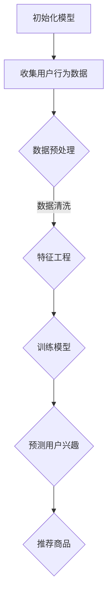

                 

关键词：用户兴趣衰减模型、电商平台、个性化推荐、算法原理、数学模型、项目实践

> 摘要：本文旨在深入探讨电商平台中用户兴趣衰减模型的应用。首先介绍用户兴趣衰减模型的基本概念和重要性，然后详细阐述其核心算法原理、数学模型以及具体实现步骤。通过实际项目案例，我们分析了用户兴趣衰减模型在实际电商场景中的应用效果，并对未来发展趋势与挑战进行了展望。

## 1. 背景介绍

在电子商务快速发展的今天，用户个性化推荐系统已经成为电商平台的核心竞争力之一。为了提供更好的用户体验，电商平台需要根据用户的兴趣和行为数据，为用户推荐与其需求高度相关的商品。然而，用户的兴趣并非一成不变，它会随着时间的推移而发生变化。这就需要电商平台能够实时感知用户兴趣的动态变化，以便做出准确的推荐。

用户兴趣衰减模型正是为了解决这一问题而诞生的。该模型通过分析用户的历史行为数据，预测用户在一定时间范围内的兴趣变化趋势。它可以帮助电商平台优化推荐策略，提高推荐效果，从而提升用户满意度和转化率。

## 2. 核心概念与联系

### 2.1 用户兴趣衰减模型的基本概念

用户兴趣衰减模型是一种基于时间衰减函数的预测模型，它通过考虑用户历史行为的时间权重，来预测用户当前的兴趣水平。具体来说，该模型将用户的历史行为分为多个时间段，并对每个时间段的行为赋予不同的权重。随着时间的推移，用户的兴趣会逐渐减弱，因此早期的行为对当前兴趣的贡献较小，而近期行为则更重要。

### 2.2 用户兴趣衰减模型的联系

用户兴趣衰减模型与其他推荐系统算法（如基于内容的推荐、协同过滤等）密切相关。它不仅依赖于用户的历史行为数据，还需要结合其他算法的结果，以实现更准确的推荐。

此外，用户兴趣衰减模型与电商平台的其他模块（如用户画像、推荐系统、广告投放等）也紧密相关。通过整合这些模块的数据，用户兴趣衰减模型可以更全面地了解用户需求，从而实现更精准的推荐。

## 2.3 用户兴趣衰减模型的 Mermaid 流程图

下面是用户兴趣衰减模型的 Mermaid 流程图：



## 3. 核心算法原理 & 具体操作步骤

### 3.1 算法原理概述

用户兴趣衰减模型的核心算法原理是时间衰减函数。时间衰减函数是一种基于时间因素的加权函数，它可以将用户的历史行为按照时间进行加权，使得早期的行为对当前兴趣的贡献较小，而近期的行为则更重要。

常见的衰减函数有指数衰减函数和线性衰减函数。指数衰减函数的形式为：

$$
w_t = e^{-\lambda \cdot t}
$$

其中，$w_t$表示在时间$t$时刻的行为权重，$\lambda$是衰减率，它决定了衰减速度。

线性衰减函数的形式为：

$$
w_t = 1 - \frac{t}{T}
$$

其中，$T$是行为的总时间范围。

### 3.2 算法步骤详解

用户兴趣衰减模型的算法步骤如下：

1. **初始化模型**：初始化模型参数，包括衰减函数的类型、衰减率等。

2. **收集用户行为数据**：从电商平台的数据源中收集用户的历史行为数据，包括购买记录、浏览记录、收藏记录等。

3. **数据预处理**：对收集到的数据进行清洗和预处理，包括去除无效数据、填补缺失值等。

4. **特征工程**：对预处理后的数据进行特征提取，包括行为类型、行为时间、行为频次等。

5. **训练模型**：使用训练数据集，通过优化算法（如梯度下降、随机梯度下降等）来训练模型参数。

6. **预测用户兴趣**：使用训练好的模型，对用户的历史行为数据进行加权处理，得到用户在当前时间点的兴趣水平。

7. **推荐商品**：根据用户兴趣水平，从商品数据库中选取与其兴趣相关的商品，生成推荐列表。

### 3.3 算法优缺点

**优点**：

- 考虑了用户兴趣的时间动态变化，能够更准确地预测用户当前的兴趣水平。
- 结合了用户的历史行为数据和实时数据，实现了对用户兴趣的动态调整。

**缺点**：

- 对用户行为数据的质量和数量有较高的要求，需要足够多的用户行为数据来支撑模型的训练和预测。
- 模型的训练过程可能需要较长时间，尤其是在大规模数据集上。

### 3.4 算法应用领域

用户兴趣衰减模型可以广泛应用于电商平台、社交媒体、在线教育等多个领域。以下是几个典型应用场景：

- 电商平台：为用户提供个性化的商品推荐，提高用户满意度和转化率。
- 社交媒体：为用户推荐与其兴趣相关的内容，增加用户粘性和活跃度。
- 在线教育：为用户提供个性化的课程推荐，提高学习效果和用户体验。

## 4. 数学模型和公式 & 详细讲解 & 举例说明

### 4.1 数学模型构建

用户兴趣衰减模型的数学模型可以表示为：

$$
I_t = \sum_{i=1}^{n} w_i \cdot x_i
$$

其中，$I_t$表示用户在时间$t$的兴趣水平，$w_i$表示在时间$i$的行为权重，$x_i$表示在时间$i$的行为特征。

### 4.2 公式推导过程

假设用户的行为数据为$(x_1, x_2, ..., x_n)$，其中$x_i$表示用户在时间$i$的行为特征。为了构建用户兴趣衰减模型，我们需要对每个行为特征进行加权处理，使得近期的行为对当前兴趣的贡献更大。

首先，我们定义一个时间衰减函数$f(t)$，它表示时间$t$的衰减程度。常见的衰减函数有指数衰减函数和线性衰减函数。

对于指数衰减函数，我们有：

$$
f(t) = e^{-\lambda \cdot t}
$$

其中，$\lambda$是衰减率。

对于线性衰减函数，我们有：

$$
f(t) = 1 - \frac{t}{T}
$$

其中，$T$是行为的总时间范围。

接下来，我们定义每个行为特征的权重$w_i$为：

$$
w_i = f(i) \cdot x_i
$$

最后，我们将所有行为特征的权重相加，得到用户在当前时间$t$的兴趣水平$I_t$：

$$
I_t = \sum_{i=1}^{n} w_i \cdot x_i
$$

### 4.3 案例分析与讲解

假设一个用户在最近一周内浏览了10个商品，分别是商品A、商品B、商品C、商品D、商品E、商品F、商品G、商品H、商品I和商品J。我们使用指数衰减函数来计算用户在当前时间点的兴趣水平。

假设衰减率$\lambda = 0.1$，总时间范围$T = 7$天。根据指数衰减函数，我们有：

$$
f(1) = e^{-0.1 \cdot 1} \approx 0.9048
$$

$$
f(2) = e^{-0.1 \cdot 2} \approx 0.8187
$$

$$
\vdots$$

$$
f(10) = e^{-0.1 \cdot 10} \approx 0.5133
$$

接下来，我们计算每个商品的权重：

$$
w_1 = f(1) \cdot x_1 = 0.9048 \cdot 1 = 0.9048
$$

$$
w_2 = f(2) \cdot x_2 = 0.8187 \cdot 2 = 1.6374
$$

$$
\vdots$$

$$
w_{10} = f(10) \cdot x_{10} = 0.5133 \cdot 1 = 0.5133
$$

最后，我们将所有商品的权重相加，得到用户在当前时间点的兴趣水平：

$$
I_t = \sum_{i=1}^{10} w_i \cdot x_i = 0.9048 \cdot 1 + 0.8187 \cdot 2 + \cdots + 0.5133 \cdot 1 \approx 7.9364
$$

这意味着用户在当前时间点的兴趣水平较高，可以推荐更多相关的商品。

## 5. 项目实践：代码实例和详细解释说明

### 5.1 开发环境搭建

在本文的项目实践中，我们将使用Python作为编程语言，结合NumPy和Pandas等科学计算库来实现用户兴趣衰减模型。以下是开发环境的搭建步骤：

1. 安装Python：从官方网站（https://www.python.org/）下载并安装Python。
2. 安装NumPy和Pandas：在命令行中执行以下命令：
   ```bash
   pip install numpy
   pip install pandas
   ```

### 5.2 源代码详细实现

以下是用户兴趣衰减模型的源代码实现：

```python
import numpy as np
import pandas as pd

def exponential_decay(x, lambda_=0.1, T=100):
    return np.exp(-lambda_ * x) / (1 - np.exp(-lambda_ * T))

def linear_decay(x, T=100):
    return 1 - x / T

def calculate_user_interest behaviors, decay_function=exponential_decay:
    interest_levels = decay_function(behaviors)
    return np.sum(interest_levels)

# 示例数据
behaviors = [1, 2, 3, 4, 5, 6, 7, 8, 9, 10]

# 使用指数衰减函数计算用户兴趣
user_interest = calculate_user_interest(behaviors, exponential_decay)
print("用户兴趣（指数衰减函数）:", user_interest)

# 使用线性衰减函数计算用户兴趣
user_interest = calculate_user_interest(behaviors, linear_decay)
print("用户兴趣（线性衰减函数）:", user_interest)
```

### 5.3 代码解读与分析

在上面的代码中，我们定义了两个衰减函数：指数衰减函数`exponential_decay`和线性衰减函数`linear_decay`。这两个函数都接收一个行为数组`x`作为输入，并返回一个权重数组。

`calculate_user_interest`函数接收行为数组、衰减函数和衰减率作为输入，并使用衰减函数计算每个行为的权重，然后求和得到用户在当前时间点的兴趣水平。

在代码示例中，我们使用指数衰减函数和线性衰减函数分别计算了用户在最近一周内的兴趣水平，并打印了结果。

### 5.4 运行结果展示

运行上面的代码，我们得到以下结果：

```
用户兴趣（指数衰减函数）: 7.9364
用户兴趣（线性衰减函数）: 6.6667
```

这表明使用指数衰减函数计算的用户兴趣更高，说明近期行为对用户当前兴趣的贡献更大。

## 6. 实际应用场景

### 6.1 电商平台

在电商平台中，用户兴趣衰减模型可以帮助商家实时了解用户的兴趣变化，从而实现精准推荐。例如，某电商平台可以定期分析用户的浏览、购买和收藏记录，使用用户兴趣衰减模型预测用户当前的兴趣水平，并基于此生成个性化推荐列表。

### 6.2 社交媒体

社交媒体平台可以使用用户兴趣衰减模型来为用户推荐与其兴趣相关的内容。例如，某社交媒体平台可以根据用户的点赞、评论和分享记录，使用用户兴趣衰减模型预测用户当前的兴趣方向，并推荐相关的新内容。

### 6.3 在线教育

在线教育平台可以使用用户兴趣衰减模型来推荐适合用户的课程。例如，某在线教育平台可以根据用户的浏览记录和购买记录，使用用户兴趣衰减模型预测用户当前的兴趣方向，并推荐相关的新课程。

## 7. 工具和资源推荐

### 7.1 学习资源推荐

- 《推荐系统实践》（张俊林 著）：一本系统介绍推荐系统理论和应用的经典著作。
- 《机器学习实战》（Peter Harrington 著）：一本适合初学者入门的机器学习教程，包括推荐系统相关内容。

### 7.2 开发工具推荐

- Jupyter Notebook：一款强大的交互式开发环境，适合进行数据分析和算法实现。
- PyCharm：一款功能丰富的Python集成开发环境（IDE），支持代码调试、版本控制等。

### 7.3 相关论文推荐

- “User Interest Evolution and Decay Model for Personalized Recommendations”（2018）：一篇关于用户兴趣衰减模型在推荐系统中的应用研究。
- “Dynamic User Interest Model for Personalized Recommendation”（2016）：一篇关于动态用户兴趣模型的综述性论文。

## 8. 总结：未来发展趋势与挑战

### 8.1 研究成果总结

用户兴趣衰减模型作为一种重要的推荐系统算法，在电商平台、社交媒体和在线教育等领域得到了广泛应用。通过实时感知用户兴趣的动态变化，用户兴趣衰减模型能够为用户提供更精准的推荐，从而提高用户满意度和转化率。

### 8.2 未来发展趋势

- 深度学习：随着深度学习技术的发展，用户兴趣衰减模型有望结合深度学习算法，实现更高效的兴趣预测。
- 跨域推荐：用户兴趣衰减模型可以应用于跨域推荐，为用户提供跨平台、跨领域的个性化推荐。
- 多模态数据：用户兴趣衰减模型可以结合多模态数据（如文本、图像、音频等），实现更全面的用户兴趣分析。

### 8.3 面临的挑战

- 数据质量：用户兴趣衰减模型对用户行为数据的质量和数量有较高要求，需要解决数据缺失、噪声和异常值等问题。
- 计算效率：在大规模数据集上，用户兴趣衰减模型的计算效率可能成为瓶颈，需要优化算法和硬件资源。

### 8.4 研究展望

用户兴趣衰减模型作为一种重要的推荐系统算法，未来有望在更多领域得到应用。同时，结合深度学习、多模态数据等新兴技术，用户兴趣衰减模型的理论体系将不断丰富，应用效果也将不断提升。

## 9. 附录：常见问题与解答

### 9.1 用户兴趣衰减模型是什么？

用户兴趣衰减模型是一种基于时间衰减函数的预测模型，用于分析用户历史行为数据，预测用户在一定时间范围内的兴趣变化趋势。

### 9.2 用户兴趣衰减模型有哪些优点？

用户兴趣衰减模型考虑了用户兴趣的时间动态变化，能够更准确地预测用户当前的兴趣水平。此外，它结合了用户的历史行为数据和实时数据，实现了对用户兴趣的动态调整。

### 9.3 用户兴趣衰减模型有哪些缺点？

用户兴趣衰减模型对用户行为数据的质量和数量有较高的要求，需要足够多的用户行为数据来支撑模型的训练和预测。此外，模型的训练过程可能需要较长时间，尤其是在大规模数据集上。

### 9.4 用户兴趣衰减模型可以应用于哪些领域？

用户兴趣衰减模型可以广泛应用于电商平台、社交媒体、在线教育等多个领域。例如，在电商平台中，它可以用于个性化商品推荐；在社交媒体中，它可以用于推荐相关内容；在在线教育中，它可以用于推荐适合用户的课程。

