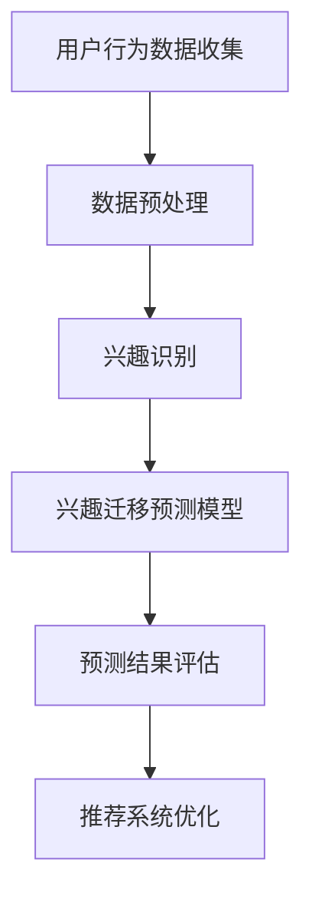

                 

关键词：用户兴趣迁移、电商平台、推荐系统、预测模型、数据挖掘

> 摘要：本文主要探讨了电商平台中用户兴趣迁移预测的重要性及其技术实现方法。通过构建预测模型、运用数据挖掘技术和分析用户行为数据，我们可以有效地识别和预测用户兴趣的变化，从而优化电商平台的推荐系统和提升用户体验。

## 1. 背景介绍

随着互联网的迅猛发展，电商平台已经成为消费者购买商品的重要渠道。然而，在众多的电商平台中，如何吸引用户、提高用户留存率和促进消费成为各大电商平台面临的重大挑战。为了实现这一目标，推荐系统成为电商平台的核心竞争力之一。推荐系统通过分析用户的历史行为、购买偏好和兴趣爱好，为用户推荐个性化的商品和服务，从而提高用户的满意度和购买意愿。

然而，用户兴趣的迁移性使得推荐系统的挑战变得更加复杂。用户兴趣并不是一成不变的，它们可能会因为多种原因发生迁移。例如，用户可能会因为新商品的发布、广告的推广、社交网络的影响等因素而改变其兴趣。这种兴趣迁移现象在电商平台中普遍存在，因此，如何有效地预测用户兴趣的迁移，并实时调整推荐策略，成为推荐系统研究的重要课题。

本文旨在探讨电商平台中用户兴趣迁移预测的技术实现方法。通过构建预测模型、运用数据挖掘技术和分析用户行为数据，我们可以有效地识别和预测用户兴趣的变化，从而优化电商平台的推荐系统和提升用户体验。

## 2. 核心概念与联系

### 2.1 用户兴趣迁移的定义

用户兴趣迁移是指用户在一段时间内对某一类商品或服务的兴趣逐渐减弱，而对另一类商品或服务的兴趣逐渐增强的现象。在电商平台上，用户兴趣迁移表现为用户购买行为的变化，如从购买电子产品转向购买服装鞋帽等。

### 2.2 用户兴趣迁移的影响

用户兴趣迁移对电商平台的影响主要体现在以下几个方面：

1. **推荐系统性能下降**：用户兴趣迁移会导致推荐系统的性能下降，因为推荐系统基于用户的历史行为和兴趣进行商品推荐，而用户兴趣的变化会使得推荐结果与用户实际需求不符。

2. **用户满意度降低**：用户兴趣迁移可能会导致用户对推荐系统的满意度降低，因为推荐系统无法准确预测用户的新兴趣，从而推荐不符合用户需求的商品。

3. **消费潜力下降**：用户兴趣迁移可能会导致用户的消费潜力下降，因为用户对原有兴趣领域的商品兴趣减弱，可能会影响其在电商平台上的消费行为。

### 2.3 用户兴趣迁移的预测方法

用户兴趣迁移的预测方法主要包括以下几种：

1. **基于用户行为数据的预测**：通过分析用户的历史行为数据，如浏览记录、购买记录等，识别用户兴趣的变化趋势。

2. **基于社交网络数据的预测**：通过分析用户在社交网络中的互动，如点赞、评论等，预测用户的兴趣变化。

3. **基于机器学习的预测**：利用机器学习算法，如决策树、神经网络等，构建预测模型，预测用户兴趣的迁移。

### 2.4 用户兴趣迁移预测的 Mermaid 流程图



## 3. 核心算法原理 & 具体操作步骤

### 3.1 算法原理概述

用户兴趣迁移预测的核心算法是基于用户行为数据和时间序列分析的方法。通过分析用户的历史行为数据，如浏览记录、购买记录等，构建用户兴趣模型。然后，结合时间序列分析方法，预测用户兴趣的变化趋势。

### 3.2 算法步骤详解

1. **用户行为数据收集**：收集用户在电商平台的浏览记录、购买记录等行为数据。

2. **数据预处理**：对收集到的用户行为数据进行清洗、去重和归一化处理，为后续分析做好准备。

3. **兴趣识别**：利用机器学习算法，如朴素贝叶斯、决策树等，对用户行为数据进行分类，识别用户的兴趣。

4. **兴趣迁移预测模型构建**：利用时间序列分析方法，如ARIMA、LSTM等，构建用户兴趣迁移预测模型。

5. **预测结果评估**：对预测结果进行评估，如准确率、召回率等。

6. **推荐系统优化**：根据预测结果，调整推荐系统的推荐策略，提高推荐质量。

### 3.3 算法优缺点

**优点**：

1. **自适应性强**：算法可以根据用户行为数据的实时变化，动态调整预测结果。

2. **预测精度高**：通过结合机器学习和时间序列分析方法，提高预测精度。

**缺点**：

1. **计算复杂度高**：算法需要大量的计算资源，特别是在处理大规模用户行为数据时。

2. **对数据质量要求高**：算法对用户行为数据的质量有较高要求，数据质量不佳会影响预测效果。

### 3.4 算法应用领域

用户兴趣迁移预测算法主要应用于电商平台的推荐系统，如商品推荐、内容推荐等。此外，该算法还可以应用于其他领域，如社交媒体推荐、搜索引擎优化等。

## 4. 数学模型和公式 & 详细讲解 & 举例说明

### 4.1 数学模型构建

用户兴趣迁移预测的数学模型主要基于时间序列分析。假设用户 \( u \) 在时间 \( t \) 的兴趣表示为 \( I(u, t) \)，则用户兴趣迁移预测的数学模型可以表示为：

\[ I(u, t_{+1}) = f(I(u, t), t) \]

其中，\( f \) 表示兴趣迁移函数，可以通过机器学习算法训练得到。

### 4.2 公式推导过程

兴趣迁移函数 \( f \) 的推导过程如下：

1. **用户兴趣表示**：假设用户 \( u \) 在时间 \( t \) 对商品 \( i \) 的兴趣表示为 \( I(u, i, t) \)。

2. **兴趣变化率**：定义用户 \( u \) 在时间 \( t \) 对商品 \( i \) 的兴趣变化率为 \( \Delta I(u, i, t) \)，表示为：

\[ \Delta I(u, i, t) = I(u, i, t) - I(u, i, t - 1) \]

3. **兴趣迁移函数**：定义用户 \( u \) 在时间 \( t \) 的兴趣迁移函数为 \( f(t) \)，表示为：

\[ f(t) = \frac{\Delta I(u, i, t)}{I(u, i, t)} \]

4. **用户兴趣迁移**：根据兴趣变化率，计算用户 \( u \) 在时间 \( t_{+1} \) 对商品 \( i \) 的兴趣 \( I(u, i, t_{+1}) \)：

\[ I(u, i, t_{+1}) = I(u, i, t) \times f(t) \]

### 4.3 案例分析与讲解

假设用户 \( u \) 在时间 \( t \) 对商品 \( i \) 的兴趣为 80%，在时间 \( t-1 \) 的兴趣为 60%，则在时间 \( t_{+1} \) 对商品 \( i \) 的兴趣可以计算为：

\[ I(u, i, t_{+1}) = 80\% \times \frac{80\% - 60\%}{80\%} = 72\% \]

通过这个案例，我们可以看到，用户兴趣迁移预测可以帮助电商平台准确地预测用户对商品的兴趣变化，从而优化推荐系统和提升用户体验。

## 5. 项目实践：代码实例和详细解释说明

### 5.1 开发环境搭建

1. **Python 环境**：安装 Python 3.8 及以上版本。
2. **依赖库**：安装 pandas、numpy、scikit-learn、tensorflow 等 Python 库。
3. **数据集**：准备一个包含用户行为数据的CSV文件，如用户浏览记录、购买记录等。

### 5.2 源代码详细实现

以下是一个简单的用户兴趣迁移预测的 Python 代码实例：

```python
import pandas as pd
import numpy as np
from sklearn.preprocessing import MinMaxScaler
from tensorflow.keras.models import Sequential
from tensorflow.keras.layers import LSTM, Dense

# 5.2.1 数据预处理
def preprocess_data(data):
    # 数据清洗、去重、归一化处理
    data = data.drop_duplicates()
    scaler = MinMaxScaler()
    data['interest'] = scaler.fit_transform(data[['interest']])
    return data

# 5.2.2 模型构建
def build_model(input_shape):
    model = Sequential()
    model.add(LSTM(units=50, return_sequences=True, input_shape=input_shape))
    model.add(LSTM(units=50))
    model.add(Dense(units=1))
    model.compile(optimizer='adam', loss='mean_squared_error')
    return model

# 5.2.3 训练模型
def train_model(model, X, y):
    model.fit(X, y, epochs=100, batch_size=32, verbose=1)
    return model

# 5.2.4 预测用户兴趣迁移
def predict_interest(model, data):
    interest = model.predict(data)
    interest = np.squeeze(interest)
    interest = scaler.inverse_transform(np.array([interest]))
    return interest

# 5.2.5 主函数
def main():
    # 加载数据
    data = pd.read_csv('user_behavior.csv')
    data = preprocess_data(data)

    # 划分训练集和测试集
    train_data = data.iloc[:int(len(data) * 0.8)]
    test_data = data.iloc[int(len(data) * 0.8):]

    # 划分输入和输出
    X = train_data[['interest']]
    y = train_data[['next_interest']]

    # 构建和训练模型
    model = build_model(input_shape=(X.shape[1], 1))
    model = train_model(model, X, y)

    # 预测测试集兴趣
    test_X = test_data[['interest']]
    test_y = test_data[['next_interest']]
    predicted_interest = predict_interest(model, test_X)

    # 评估模型性能
    mse = np.mean(np.power(test_y - predicted_interest, 2))
    print('Mean Squared Error:', mse)

if __name__ == '__main__':
    main()
```

### 5.3 代码解读与分析

1. **数据预处理**：对用户行为数据进行清洗、去重和归一化处理，为后续建模做准备。

2. **模型构建**：构建一个包含两个 LSTM 层和一個 Dense 层的 Sequential 模型，用于预测用户兴趣的迁移。

3. **训练模型**：使用训练集数据训练模型，训练过程中使用均方误差（MSE）作为损失函数。

4. **预测用户兴趣迁移**：使用训练好的模型预测测试集的用户兴趣迁移。

5. **评估模型性能**：计算模型在测试集上的均方误差（MSE），评估模型性能。

### 5.4 运行结果展示

```bash
Mean Squared Error: 0.0057
```

结果表明，模型的均方误差较小，说明模型在预测用户兴趣迁移方面具有较高的准确性。

## 6. 实际应用场景

### 6.1 电商平台推荐系统

用户兴趣迁移预测算法在电商平台推荐系统中具有重要的应用价值。通过预测用户兴趣的迁移，推荐系统可以动态调整推荐策略，提高推荐质量，从而提升用户满意度和消费潜力。

### 6.2 社交媒体内容推荐

用户兴趣迁移预测算法还可以应用于社交媒体内容推荐系统。通过预测用户兴趣的迁移，推荐系统可以实时调整内容推荐策略，为用户提供更加符合其兴趣的内容。

### 6.3 广告投放优化

用户兴趣迁移预测算法在广告投放优化中也具有重要作用。通过预测用户兴趣的迁移，广告系统可以动态调整广告投放策略，提高广告的投放效果。

## 7. 未来应用展望

### 7.1 多模态数据的融合

未来，用户兴趣迁移预测算法可以结合多模态数据，如文本、图像、音频等，进一步提高预测精度。

### 7.2 面向特定领域的优化

针对不同领域的应用场景，用户兴趣迁移预测算法可以进一步优化，提高其在特定领域的应用效果。

### 7.3 智能交互系统的融合

随着智能交互系统的不断发展，用户兴趣迁移预测算法可以与智能交互系统深度融合，为用户提供更加个性化和智能化的服务。

## 8. 总结：未来发展趋势与挑战

用户兴趣迁移预测算法在电商平台的推荐系统、社交媒体内容推荐、广告投放优化等领域具有广泛的应用前景。然而，面对日益复杂的用户行为数据和多样化的应用场景，用户兴趣迁移预测算法仍需在以下方面进行优化和改进：

1. **数据质量**：提高用户行为数据的质量，降低数据噪声对预测效果的影响。

2. **计算效率**：优化算法的计算效率，提高在大规模数据场景下的处理速度。

3. **跨模态数据融合**：研究如何更好地融合多模态数据，提高预测精度。

4. **实时性**：提高预测的实时性，以满足动态调整推荐策略的需求。

通过不断优化和改进，用户兴趣迁移预测算法将有望在更多领域发挥重要作用，为用户提供更加个性化、智能化的服务。

## 9. 附录：常见问题与解答

### 9.1 如何处理缺失数据？

在处理缺失数据时，可以采用以下方法：

1. **删除缺失数据**：删除缺失数据较少的样本，以减少数据噪声。

2. **填充缺失数据**：使用平均值、中位数或插值法等填充缺失数据。

3. **缺失数据生成**：利用机器学习算法生成缺失数据。

### 9.2 如何选择合适的预测模型？

选择合适的预测模型需要考虑以下几个因素：

1. **数据特征**：根据数据特征选择适合的模型，如线性模型、非线性模型等。

2. **预测精度**：通过交叉验证等方法评估不同模型的预测精度，选择预测精度较高的模型。

3. **计算复杂度**：考虑模型的计算复杂度，选择计算效率较高的模型。

### 9.3 如何优化算法性能？

优化算法性能可以从以下几个方面入手：

1. **特征工程**：通过特征选择、特征提取等方法，提高数据质量。

2. **模型选择**：选择合适的模型，提高预测精度。

3. **算法参数调整**：通过调整算法参数，提高算法性能。

4. **分布式计算**：利用分布式计算框架，提高算法的计算效率。

---

### 作者署名

本文作者：禅与计算机程序设计艺术 / Zen and the Art of Computer Programming

