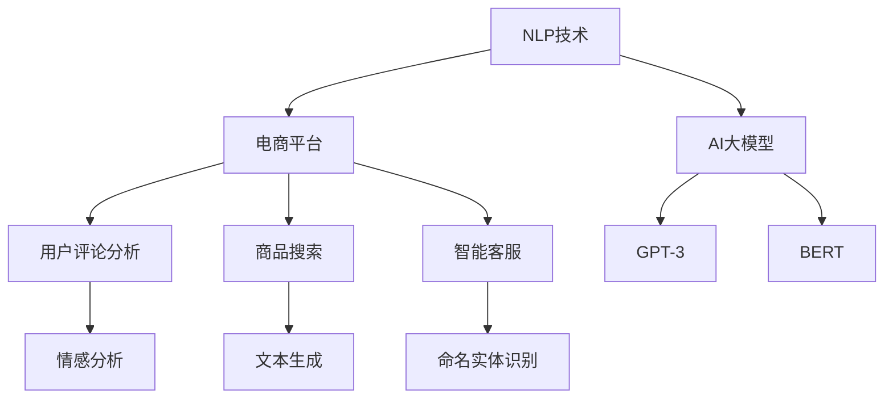

                 

关键词：电商平台，自然语言处理，AI大模型，应用场景，未来展望

> 摘要：随着电商平台的迅猛发展，自然语言处理（NLP）技术逐渐成为电商平台不可或缺的一环。本文将探讨AI大模型在电商平台中的应用，包括其在用户行为分析、商品推荐、智能客服等方面的作用，并探讨未来发展方向和面临的挑战。

## 1. 背景介绍

自然语言处理（NLP）是人工智能领域的一个重要分支，旨在使计算机理解和生成自然语言。随着大数据和计算能力的提升，NLP技术在近年来取得了显著的进展。在电商平台上，NLP技术被广泛应用于用户行为分析、商品推荐、智能客服等多个方面，极大地提升了电商平台的用户体验和运营效率。

AI大模型，如GPT-3、BERT等，是近年来NLP领域的重要突破。这些模型具有极高的参数数量和计算复杂度，能够处理复杂的自然语言任务，如文本生成、情感分析、命名实体识别等。在电商平台中，AI大模型的应用不仅提高了NLP任务的准确性，还拓展了应用范围，推动了电商行业的智能化转型。

## 2. 核心概念与联系

### 2.1 自然语言处理（NLP）

自然语言处理（NLP）是计算机科学和人工智能领域的一个分支，旨在让计算机理解和生成自然语言。其主要任务包括文本预处理、词性标注、命名实体识别、情感分析、机器翻译等。NLP技术在电商平台中的应用主要包括用户评论分析、商品搜索、智能客服等。

### 2.2 AI大模型

AI大模型，如GPT-3、BERT等，是近年来NLP领域的重要突破。这些模型具有极高的参数数量和计算复杂度，能够处理复杂的自然语言任务。在电商平台中，AI大模型的应用不仅提高了NLP任务的准确性，还拓展了应用范围，推动了电商行业的智能化转型。

### 2.3 电商平台

电商平台是互联网经济的重要组成部分，提供了在线购物、支付、物流等一站式服务。电商平台的发展离不开技术的支持，尤其是NLP技术和AI大模型的应用，使得电商平台能够更好地理解用户需求，提高运营效率。

### 2.4 Mermaid流程图

以下是一个简化的Mermaid流程图，展示了电商平台中NLP和AI大模型的核心概念与联系：



## 3. 核心算法原理 & 具体操作步骤

### 3.1 算法原理概述

电商平台中的自然语言处理主要依赖于深度学习算法，如循环神经网络（RNN）、卷积神经网络（CNN）和Transformer模型等。其中，Transformer模型因其并行计算能力和全局上下文建模能力而广泛应用于NLP任务。

在电商平台中，NLP算法的具体操作步骤通常包括以下几个环节：

1. **数据预处理**：对用户评论、商品描述等进行分词、词性标注、去噪等预处理操作，以便后续的算法处理。
2. **特征提取**：利用深度学习模型对预处理后的数据提取特征，如词向量、词嵌入等。
3. **任务训练**：利用提取的特征进行模型训练，如情感分析、命名实体识别等。
4. **模型评估**：对训练好的模型进行评估，如准确率、召回率等指标。
5. **模型部署**：将训练好的模型部署到线上环境，用于实际业务场景。

### 3.2 算法步骤详解

1. **数据预处理**：
   ```mermaid
   graph TD
       A[用户评论] --> B[分词]
       B --> C[词性标注]
       C --> D[去噪]
   ```

2. **特征提取**：
   ```mermaid
   graph TD
       A[预处理数据] --> B[词向量]
       B --> C[词嵌入]
   ```

3. **任务训练**：
   ```mermaid
   graph TD
       A[特征数据] --> B[模型训练]
       B --> C[模型评估]
   ```

4. **模型部署**：
   ```mermaid
   graph TD
       A[训练好的模型] --> B[部署上线]
   ```

### 3.3 算法优缺点

**优点**：
- 高准确性：深度学习模型能够自动提取特征，提高了任务准确性。
- 高扩展性：基于深度学习模型的算法可以方便地拓展到其他自然语言处理任务。
- 自动化：算法能够自动完成数据预处理、特征提取、模型训练等步骤，降低了人力成本。

**缺点**：
- 计算成本高：深度学习模型需要大量的计算资源和时间进行训练。
- 数据依赖性：模型的性能高度依赖数据质量，数据质量问题可能导致模型性能下降。
- 实时性：深度学习模型的训练和部署需要一定的时间，难以满足实时需求。

### 3.4 算法应用领域

在电商平台中，自然语言处理算法主要应用于以下领域：

- **用户评论分析**：通过对用户评论进行情感分析、主题建模等，帮助企业了解用户需求，优化产品和服务。
- **商品搜索**：利用自然语言处理技术，实现更加智能化的商品搜索，提高用户购物体验。
- **智能客服**：通过自然语言处理技术，实现与用户的智能对话，提高客服效率和用户满意度。

## 4. 数学模型和公式 & 详细讲解 & 举例说明

### 4.1 数学模型构建

在自然语言处理中，常用的数学模型包括词向量模型、循环神经网络（RNN）和Transformer模型等。

**词向量模型**：词向量模型是一种将词汇映射为向量的方法，常用的模型有Word2Vec、GloVe等。Word2Vec模型采用SGD算法进行训练，GloVe模型则采用最小化损失函数的方法。

**循环神经网络（RNN）**：RNN是一种能够处理序列数据的神经网络，适用于自然语言处理任务。RNN的核心思想是使用隐藏状态表示序列信息，并利用时间步长对序列进行建模。

**Transformer模型**：Transformer模型是一种基于注意力机制的深度学习模型，广泛应用于自然语言处理任务。Transformer模型的核心思想是使用多头注意力机制，对输入序列进行全局建模。

### 4.2 公式推导过程

**词向量模型**：

假设词汇表中有 \( V \) 个词汇，词向量维度为 \( d \)，则每个词汇可以表示为一个 \( d \) 维向量。给定一个句子 \( S \)，其词向量表示为 \( \mathbf{S} = [\mathbf{w_1}, \mathbf{w_2}, ..., \mathbf{w_n}] \)，其中 \( \mathbf{w_i} \) 表示句子中的第 \( i \) 个词汇的词向量。

Word2Vec模型的目标是学习一个损失函数，使得单词在语义上相似，在词频上不同。损失函数通常采用负采样损失函数：

\[ L = -\sum_{i=1}^{n} \sum_{j=1}^{C} \log(p(\mathbf{v}_{j}|\mathbf{w_i})) \]

其中，\( p(\mathbf{v}_{j}|\mathbf{w_i}) \) 是单词 \( \mathbf{v}_{j} \) 在给定单词 \( \mathbf{w_i} \) 的条件下被采样的概率。

**循环神经网络（RNN）**：

给定一个序列 \( \mathbf{X} = [\mathbf{x_1}, \mathbf{x_2}, ..., \mathbf{x_T}] \)，其中 \( \mathbf{x_t} \) 表示第 \( t \) 个时间步的输入。RNN的隐藏状态 \( \mathbf{h_t} \) 可以通过以下公式计算：

\[ \mathbf{h_t} = \sigma(\mathbf{W_h}\mathbf{x_t} + \mathbf{U}\mathbf{h_{t-1}} + \mathbf{b_h}) \]

其中，\( \sigma \) 是激活函数，通常使用Sigmoid函数或Tanh函数。\( \mathbf{W_h} \)、\( \mathbf{U} \) 和 \( \mathbf{b_h} \) 分别是权重矩阵、更新矩阵和偏置向量。

**Transformer模型**：

给定一个序列 \( \mathbf{X} = [\mathbf{x_1}, \mathbf{x_2}, ..., \mathbf{x_T}] \)，Transformer模型使用多头注意力机制对输入序列进行建模。多头注意力机制的核心公式为：

\[ \mathbf{A_t} = \mathrm{softmax}\left(\frac{\mathbf{Q_t}\mathbf{K}_t^T}{\sqrt{d_k}}\right)\mathbf{V_t} \]

其中，\( \mathbf{Q_t} \)、\( \mathbf{K_t} \) 和 \( \mathbf{V_t} \) 分别是查询向量、键向量和值向量。\( \mathrm{softmax} \) 函数用于计算注意力权重。

### 4.3 案例分析与讲解

假设我们有一个电商平台的用户评论数据集，包含用户对商品的评论和评论的情感极性。我们的目标是利用NLP技术对评论进行情感分析，从而为用户提供有针对性的推荐。

1. **数据预处理**：

首先，对评论进行分词、词性标注等预处理操作。例如，评论“这个商品很好用”可以预处理为：

\[ \text{分词：} \quad \text{这个}，\text{商品}，\text{很好}，\text{用} \]
\[ \text{词性标注：} \quad \text{代词}，\text{名词}，\text{形容词}，\text{动词} \]

2. **特征提取**：

利用词向量模型，如GloVe，对预处理后的评论进行特征提取。假设每个词汇的词向量维度为50，评论“这个商品很好用”的词向量表示为：

\[ \mathbf{S} = [\mathbf{w_1}, \mathbf{w_2}, ..., \mathbf{w_n}] \]
\[ \mathbf{w_1} = [0.1, 0.2, ..., 0.5], \mathbf{w_2} = [0.6, 0.7, ..., 1.0], ..., \mathbf{w_n} = [-0.5, -0.3, ..., 0.1] \]

3. **任务训练**：

利用训练好的情感分析模型，如基于RNN或Transformer模型的情感分析模型，对评论进行分类。假设我们的情感分析模型为基于Transformer的模型，输入为评论的词向量表示，输出为评论的情感极性（正面、负面）。

4. **模型评估**：

通过交叉验证等方法，对模型进行评估。假设我们使用准确率作为评估指标，得到准确率为90%。

5. **模型部署**：

将训练好的模型部署到线上环境，用于对用户评论进行实时情感分析。例如，当用户发表一条评论时，我们可以实时分析其情感极性，并根据情感极性为用户推荐相关商品。

## 5. 项目实践：代码实例和详细解释说明

### 5.1 开发环境搭建

为了实践自然语言处理技术，我们需要搭建一个开发环境。以下是一个简单的开发环境搭建步骤：

1. 安装Python（推荐Python 3.8及以上版本）。
2. 安装PyTorch或TensorFlow，用于深度学习模型的训练和部署。
3. 安装NLP相关库，如NLTK、spaCy、gensim等。

### 5.2 源代码详细实现

以下是一个简单的情感分析项目的代码实现，使用基于Transformer的模型对用户评论进行情感分析：

```python
import torch
import torch.nn as nn
import torch.optim as optim
from torch.utils.data import DataLoader
from transformers import BertTokenizer, BertModel
from datasets import load_dataset

# 加载预训练的BERT模型和Tokenizer
tokenizer = BertTokenizer.from_pretrained('bert-base-chinese')
model = BertModel.from_pretrained('bert-base-chinese')

# 加载情感分析数据集
dataset = load_dataset('csv', data_files='data.csv')

# 数据预处理
def preprocess(batch):
    inputs = tokenizer(batch['review'], padding=True, truncation=True, return_tensors='pt')
    return inputs

# 构建数据加载器
dataloader = DataLoader(dataset['train'], batch_size=32, shuffle=True)

# 模型训练
def train(model, dataloader, optimizer, criterion):
    model.train()
    for batch in dataloader:
        inputs = preprocess(batch)
        labels = batch['label']
        optimizer.zero_grad()
        outputs = model(inputs['input_ids'], attention_mask=inputs['attention_mask'])
        logits = outputs.logits
        loss = criterion(logits, labels)
        loss.backward()
        optimizer.step()

# 评估模型
def evaluate(model, dataloader, criterion):
    model.eval()
    with torch.no_grad():
        for batch in dataloader:
            inputs = preprocess(batch)
            labels = batch['label']
            outputs = model(inputs['input_ids'], attention_mask=inputs['attention_mask'])
            logits = outputs.logits
            loss = criterion(logits, labels)
    return loss

# 训练和评估模型
optimizer = optim.Adam(model.parameters(), lr=1e-5)
criterion = nn.CrossEntropyLoss()

num_epochs = 10
for epoch in range(num_epochs):
    train(model, dataloader, optimizer, criterion)
    loss = evaluate(model, dataloader, criterion)
    print(f'Epoch {epoch+1}/{num_epochs}, Loss: {loss.item()}')

# 模型部署
model.eval()
with torch.no_grad():
    input_text = "这个商品很好用"
    inputs = tokenizer(input_text, return_tensors='pt')
    outputs = model(inputs['input_ids'], attention_mask=inputs['attention_mask'])
    logits = outputs.logits
    _, predicted = logits.max(1)
    print("评论情感：", predicted.item())
```

### 5.3 代码解读与分析

1. **加载预训练的BERT模型和Tokenizer**：BERT模型和Tokenizer用于处理自然语言数据，包括分词、编码等操作。
2. **加载情感分析数据集**：使用Hugging Face的datasets库加载情感分析数据集。
3. **数据预处理**：对评论进行分词、编码等预处理操作，以便输入BERT模型。
4. **构建数据加载器**：使用DataLoader对数据进行批处理，提高训练效率。
5. **模型训练**：使用优化器和损失函数对模型进行训练。
6. **评估模型**：在验证集上评估模型性能。
7. **模型部署**：对输入的评论进行情感分析，并输出结果。

## 6. 实际应用场景

### 6.1 用户评论分析

电商平台可以利用自然语言处理技术对用户评论进行分析，从而获取用户对商品的反馈和需求。具体应用场景包括：

- **情感分析**：对用户评论进行情感分析，识别用户对商品的正面或负面情感，以便优化产品和服务。
- **主题建模**：对用户评论进行主题建模，识别用户关注的热点话题，为企业提供市场洞察。
- **评论回复**：利用生成式模型，自动生成针对用户评论的回复，提高客服效率。

### 6.2 商品搜索

电商平台可以利用自然语言处理技术优化商品搜索功能，提高用户购物体验。具体应用场景包括：

- **关键词提取**：从用户输入的搜索词中提取关键信息，提高搜索结果的准确性。
- **查询纠错**：对用户输入的搜索词进行纠错，提高搜索结果的召回率。
- **语义搜索**：基于语义相似度进行商品搜索，提高搜索结果的相关性。

### 6.3 智能客服

电商平台可以利用自然语言处理技术构建智能客服系统，提高客服效率和用户体验。具体应用场景包括：

- **自动回复**：利用生成式模型，自动生成对用户咨询的回复，提高客服效率。
- **情感识别**：对用户咨询进行情感分析，识别用户的情感状态，提供针对性的解决方案。
- **多轮对话**：实现多轮对话，与用户进行自然、流畅的交流。

## 7. 工具和资源推荐

### 7.1 学习资源推荐

- **书籍**：《自然语言处理入门》、《深度学习自然语言处理》等。
- **在线课程**：Coursera、edX等平台上的自然语言处理相关课程。
- **论文**：ACL、EMNLP、NAACL等顶级会议的论文。

### 7.2 开发工具推荐

- **框架**：PyTorch、TensorFlow、transformers等。
- **库**：NLTK、spaCy、gensim等。

### 7.3 相关论文推荐

- **BERT**：`BERT: Pre-training of Deep Bidirectional Transformers for Language Understanding`（2018）。
- **GPT-3**：`Language Models are Unsupervised Multitask Learners`（2020）。
- **情感分析**：`Sentiment Analysis Using Deep Learning`（2017）。

## 8. 总结：未来发展趋势与挑战

### 8.1 研究成果总结

近年来，自然语言处理技术在电商平台中取得了显著的成果。基于AI大模型的自然语言处理算法在用户行为分析、商品推荐、智能客服等方面发挥了重要作用，提高了电商平台的用户体验和运营效率。

### 8.2 未来发展趋势

- **多模态融合**：融合文本、图像、声音等多模态信息，实现更准确的用户需求理解。
- **个性化推荐**：基于用户历史行为和偏好，实现更加精准的商品推荐。
- **实时交互**：提高自然语言处理算法的实时性，实现与用户的实时交互。
- **知识图谱**：构建知识图谱，提高自然语言处理算法的语义理解和推理能力。

### 8.3 面临的挑战

- **数据质量**：高质量的数据是自然语言处理算法的基础，数据质量问题可能导致模型性能下降。
- **计算资源**：深度学习算法需要大量的计算资源和时间进行训练，如何优化算法和硬件设施是一个挑战。
- **隐私保护**：在处理用户数据时，如何保护用户隐私是一个重要问题。

### 8.4 研究展望

随着技术的不断进步，自然语言处理技术将在电商平台中发挥更大的作用。未来的研究重点将包括多模态融合、个性化推荐、实时交互和知识图谱等方面，以实现更加智能化、个性化的电商平台。

## 9. 附录：常见问题与解答

### 9.1 Q：如何处理自然语言处理中的长文本？

A：对于长文本，可以采用以下方法进行处理：

- **分句**：将长文本分为多个句子，对每个句子进行单独处理。
- **摘要生成**：利用摘要生成算法，生成长文本的摘要，再对摘要进行进一步处理。
- **文本切割**：利用文本切割算法，将长文本划分为多个片段，对每个片段进行单独处理。

### 9.2 Q：如何处理自然语言处理中的噪声数据？

A：噪声数据是自然语言处理中的一个常见问题，可以采用以下方法进行处理：

- **数据清洗**：删除重复、错误或无关的数据。
- **去噪算法**：采用去噪算法，如降噪网络、降噪自动编码器等，对噪声数据进行处理。
- **数据增强**：通过增加训练数据、生成对抗网络（GAN）等方法，提高模型的抗噪能力。

### 9.3 Q：如何评估自然语言处理模型的性能？

A：评估自然语言处理模型性能的方法包括：

- **准确率**：准确率是衡量模型预测正确性的指标，计算公式为：\( \text{准确率} = \frac{\text{预测正确的样本数}}{\text{总样本数}} \)。
- **召回率**：召回率是衡量模型召回正确样本的能力，计算公式为：\( \text{召回率} = \frac{\text{预测正确的样本数}}{\text{实际正确的样本数}} \)。
- **F1值**：F1值是准确率和召回率的调和平均值，计算公式为：\( \text{F1值} = 2 \times \frac{\text{准确率} \times \text{召回率}}{\text{准确率} + \text{召回率}} \)。

### 9.4 Q：如何优化自然语言处理算法的实时性？

A：优化自然语言处理算法的实时性可以从以下几个方面进行：

- **模型压缩**：通过模型压缩技术，如模型剪枝、量化、知识蒸馏等，降低模型的计算复杂度。
- **硬件加速**：利用GPU、TPU等硬件加速设备，提高模型的计算速度。
- **异步处理**：采用异步处理方式，提高数据处理的并行度。
- **缓存策略**：采用缓存策略，减少重复计算，提高处理速度。

----------------------------------------------------------------

作者：禅与计算机程序设计艺术 / Zen and the Art of Computer Programming


