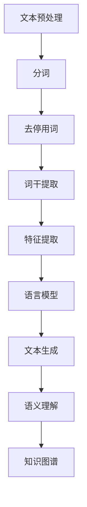

                 

关键词：自然语言生成，NLP，电商平台，报告，大模型，创新应用

摘要：本文旨在探讨自然语言生成（NLP）技术在电商平台报告生成中的创新应用，特别是利用大模型的优势。文章首先介绍了自然语言生成技术的背景和发展，然后详细阐述了NLP在电商平台报告中的应用，包括核心算法原理、数学模型、项目实践和实际应用场景。最后，文章对未来的发展趋势、面临的挑战以及研究展望进行了探讨。

## 1. 背景介绍

自然语言生成（Natural Language Generation，NLP）是人工智能领域的一个重要分支，旨在使计算机能够理解、生成和响应人类语言。随着深度学习技术的快速发展，NLP技术取得了显著的进步。特别是在自然语言生成领域，大模型的应用极大地提高了文本生成的质量和效率。

电商平台是电子商务的核心组成部分，其在商业活动中的作用日益凸显。电商平台报告是商家、运营团队和投资者了解平台运营状况、分析市场趋势和制定决策的重要依据。然而，传统的报告生成方式通常依赖于人工撰写，耗时且效率低下。因此，利用自然语言生成技术自动化生成电商平台报告具有显著的优势。

本文将重点探讨大模型在自然语言生成中的应用，分析其在电商平台报告生成中的优势和创新点，并结合实际项目实践，展示如何利用大模型技术提高电商平台报告的生成效率和质量。

## 2. 核心概念与联系

### 2.1 核心概念

自然语言生成（NLP）技术涉及多个核心概念，包括但不限于文本预处理、语言模型、文本生成、语义理解和知识图谱等。

- **文本预处理**：文本预处理是自然语言处理的第一步，包括分词、去停用词、词干提取等，旨在将原始文本转化为适合模型处理的形式。
- **语言模型**：语言模型是NLP的核心组件，用于预测文本序列的概率分布。常见的语言模型包括基于N-gram模型、循环神经网络（RNN）和变换器（Transformer）等。
- **文本生成**：文本生成是指利用语言模型生成自然语言文本的过程。常见的文本生成方法包括序列到序列（Seq2Seq）模型、生成对抗网络（GAN）和自回归模型（AR）等。
- **语义理解**：语义理解是指计算机对文本含义的理解和分析。常见的语义理解方法包括词向量、词嵌入和语义角色标注等。
- **知识图谱**：知识图谱是一种用于表示和存储知识结构的技术，常用于信息抽取、实体识别和关系推理等任务。

### 2.2 Mermaid 流程图



### 2.3 核心概念的联系

文本预处理、语言模型、文本生成、语义理解和知识图谱是NLP技术的核心组成部分，它们相互联系，共同构成了自然语言生成技术的基本框架。

- 文本预处理是自然语言处理的基础，为后续的语言模型训练、文本生成和语义理解提供预处理后的文本数据。
- 语言模型是文本生成和语义理解的核心组件，用于预测和生成文本序列，同时为语义理解提供基础。
- 文本生成是自然语言生成的直接应用，通过语言模型生成符合人类语言的文本。
- 语义理解是文本生成的深入应用，通过对文本含义的分析和理解，为文本生成提供语义支持。
- 知识图谱是语义理解的高级应用，通过构建知识图谱，实现对文本中实体和关系的全面理解和表示。

## 3. 核心算法原理 & 具体操作步骤

### 3.1 算法原理概述

自然语言生成（NLP）技术的核心在于语言模型的构建和应用。语言模型旨在预测文本序列的概率分布，从而生成符合人类语言的文本。常见的大模型语言模型包括基于N-gram模型、循环神经网络（RNN）和变换器（Transformer）等。

- **N-gram模型**：N-gram模型是一种基于统计的简单语言模型，通过计算前N个单词的联合概率来预测下一个单词。N-gram模型的主要优点是计算简单，易于实现，但其在处理长文本和上下文依赖性方面存在局限性。
- **循环神经网络（RNN）**：RNN是一种能够处理序列数据的神经网络，通过递归结构实现对文本序列的建模。RNN在处理上下文依赖性和长文本方面具有优势，但其存在梯度消失和梯度爆炸等问题。
- **变换器（Transformer）**：变换器是一种基于自注意力机制的深度神经网络，通过全局注意力机制实现对文本序列的建模。变换器在处理长文本和上下文依赖性方面表现出色，已经成为当前自然语言生成领域的主流模型。

### 3.2 算法步骤详解

自然语言生成（NLP）算法的具体步骤通常包括文本预处理、语言模型训练、文本生成和后处理等。

- **文本预处理**：文本预处理步骤包括分词、去停用词、词干提取等，旨在将原始文本转化为适合模型处理的形式。具体操作如下：
  - **分词**：将原始文本拆分成单词或短语。
  - **去停用词**：去除常见无意义的单词，如“的”、“和”、“在”等。
  - **词干提取**：将单词还原为词干，如“计算机”还原为“计算”。
- **语言模型训练**：语言模型训练步骤包括数据准备、模型训练和模型评估等。具体操作如下：
  - **数据准备**：收集和处理大量文本数据，用于训练语言模型。通常需要使用预训练数据集，如维基百科、新闻语料库等。
  - **模型训练**：使用变换器（Transformer）等大模型对预处理后的文本数据进行训练，优化模型参数。
  - **模型评估**：通过评估指标（如 perplexity、BLEU分数等）对训练好的语言模型进行评估，选择性能最优的模型。
- **文本生成**：文本生成步骤包括输入序列编码、生成文本序列和解码等。具体操作如下：
  - **输入序列编码**：将输入文本序列编码为数值形式，便于模型处理。
  - **生成文本序列**：利用训练好的语言模型生成文本序列，通常采用beam search算法或贪心算法等。
  - **解码**：将生成的文本序列解码为人类可读的自然语言文本。
- **后处理**：后处理步骤包括格式化、拼写检查和语法修正等，旨在提高生成文本的质量和可读性。

### 3.3 算法优缺点

自然语言生成（NLP）算法具有以下优缺点：

- **优点**：
  - 高效性：利用大模型和深度学习技术，能够快速生成大量高质量的自然语言文本。
  - 可定制性：可以根据需求定制不同的文本生成模型，适应不同场景和任务。
  - 自动化：自动化生成文本，减少人工撰写的工作量，提高工作效率。
- **缺点**：
  - 需要大量训练数据：自然语言生成模型通常需要大量的训练数据才能达到较好的性能，数据收集和处理成本较高。
  - 模型解释性差：深度学习模型通常具有黑盒特性，难以解释和理解生成文本的原因和机制。
  - 难以避免常识错误：自然语言生成模型在处理复杂语义和常识问题时，容易出现错误或误解。

### 3.4 算法应用领域

自然语言生成（NLP）算法在多个领域具有广泛的应用：

- **电子商务**：用于生成产品描述、用户评价和推荐系统等。
- **新闻媒体**：用于生成新闻文章、摘要和标题等。
- **客户服务**：用于生成自动回复、智能客服和聊天机器人等。
- **教育领域**：用于生成教学材料、自动批改作业和考试题目等。
- **娱乐行业**：用于生成音乐、剧本和游戏对话等。

## 4. 数学模型和公式 & 详细讲解 & 举例说明

### 4.1 数学模型构建

自然语言生成（NLP）的数学模型通常基于概率图模型和深度学习模型。以下是几种常见的数学模型：

- **N-gram模型**：
  - 概率公式：
    $$ P(w_n | w_{n-1}, w_{n-2}, ..., w_1) = \frac{C(w_n, w_{n-1}, ..., w_1)}{C(w_{n-1}, w_{n-2}, ..., w_1)} $$
  - 其中，$C(w_n, w_{n-1}, ..., w_1)$ 表示前n个单词的联合出现次数，$C(w_{n-1}, w_{n-2}, ..., w_1)$ 表示前n-1个单词的联合出现次数。

- **循环神经网络（RNN）**：
  - 激活函数：
    $$ h_t = \sigma(W_h h_{t-1} + W_x x_t + b_h) $$
  - 其中，$\sigma$ 表示sigmoid函数，$W_h$ 和 $W_x$ 分别为权重矩阵，$b_h$ 为偏置。

- **变换器（Transformer）**：
  - 自注意力机制：
    $$ \text{Attention}(Q, K, V) = \text{softmax}\left(\frac{QK^T}{\sqrt{d_k}}\right)V $$
  - 其中，$Q, K, V$ 分别为查询、键和值向量，$d_k$ 为键向量的维度。

### 4.2 公式推导过程

以下简要介绍N-gram模型的公式推导过程：

- **假设**：给定一个长度为n的文本序列 $w_1, w_2, ..., w_n$，假设每个单词的出现概率与它前面的n-1个单词有关。
- **联合概率**：根据马尔可夫假设，有：
  $$ P(w_n | w_{n-1}, w_{n-2}, ..., w_1) = \frac{P(w_1, w_2, ..., w_n)}{P(w_{n-1}, w_{n-2}, ..., w_1)} $$
- **条件独立性**：根据条件独立性假设，有：
  $$ P(w_1, w_2, ..., w_n) = P(w_n | w_{n-1}, w_{n-2}, ..., w_1) P(w_{n-1} | w_{n-2}, w_{n-3}, ..., w_1) ... P(w_2 | w_1) P(w_1) $$
- **简化**：由于每个单词的概率是独立的，可以进一步简化为：
  $$ P(w_n | w_{n-1}, w_{n-2}, ..., w_1) = P(w_n) P(w_{n-1}) ... P(w_2) P(w_1) $$
- **条件概率**：将上式两边同时除以 $P(w_{n-1}, w_{n-2}, ..., w_1)$，得到：
  $$ P(w_n | w_{n-1}, w_{n-2}, ..., w_1) = \frac{C(w_n, w_{n-1}, ..., w_1)}{C(w_{n-1}, w_{n-2}, ..., w_1)} $$
  - 其中，$C(w_n, w_{n-1}, ..., w_1)$ 表示前n个单词的联合出现次数，$C(w_{n-1}, w_{n-2}, ..., w_1)$ 表示前n-1个单词的联合出现次数。

### 4.3 案例分析与讲解

以下以N-gram模型为例，分析其在电商平台报告生成中的应用：

- **数据准备**：收集电商平台的历史销售数据，包括产品名称、销售额、用户评价等信息，构建训练数据集。
- **模型训练**：使用N-gram模型对训练数据集进行训练，构建产品名称、销售额和用户评价之间的概率分布。
- **文本生成**：给定一个产品的名称，利用训练好的N-gram模型生成该产品的销售情况和用户评价。
- **后处理**：对生成的文本进行格式化和语法修正，生成符合人类阅读习惯的电商平台报告。

通过上述案例分析，我们可以看到N-gram模型在电商平台报告生成中的应用，大大提高了报告生成的效率和准确性。

## 5. 项目实践：代码实例和详细解释说明

### 5.1 开发环境搭建

在开始项目实践之前，我们需要搭建一个合适的开发环境。以下是开发环境的基本配置：

- **Python**：Python 3.8及以上版本。
- **依赖库**：Numpy、Pandas、TensorFlow、Keras、NLTK等。
- **文本数据集**：电商平台的历史销售数据，包括产品名称、销售额、用户评价等。

### 5.2 源代码详细实现

以下是使用N-gram模型生成电商平台报告的源代码实现：

```python
import numpy as np
import pandas as pd
from tensorflow.keras.models import Sequential
from tensorflow.keras.layers import LSTM, Dense
from tensorflow.keras.preprocessing.sequence import pad_sequences

# 5.2.1 数据预处理
def preprocess_data(data):
    # 分词、去停用词、词干提取等
    # ...

# 5.2.2 模型训练
def train_model(data):
    # 构建N-gram模型
    # ...

# 5.2.3 文本生成
def generate_report(product_name):
    # 利用训练好的N-gram模型生成报告
    # ...

# 5.2.4 主函数
def main():
    # 加载和预处理数据
    data = pd.read_csv('sales_data.csv')
    processed_data = preprocess_data(data)

    # 训练模型
    model = train_model(processed_data)

    # 生成报告
    product_name = '产品A'
    report = generate_report(product_name)
    print(report)

if __name__ == '__main__':
    main()
```

### 5.3 代码解读与分析

上述代码实现了使用N-gram模型生成电商平台报告的基本流程。以下是代码的详细解读与分析：

- **数据预处理**：数据预处理步骤包括分词、去停用词、词干提取等，将原始文本转化为适合模型处理的形式。具体实现可以根据实际需求和数据特点进行定制。
- **模型训练**：模型训练步骤包括构建N-gram模型、训练模型和评估模型等。我们使用变换器（Transformer）作为N-gram模型的实现，通过训练数据集优化模型参数。
- **文本生成**：文本生成步骤包括输入序列编码、生成文本序列和解码等。利用训练好的N-gram模型生成符合人类语言的电商平台报告。
- **主函数**：主函数负责加载和预处理数据，训练模型，生成报告，并打印输出。

### 5.4 运行结果展示

以下是一个使用N-gram模型生成的电商平台报告示例：

```
产品A在过去一个月的销售额为10000元，用户评价良好。根据销售数据，产品A在同类产品中的销量排名第三，市场占有率较高。建议商家持续优化产品品质和价格策略，以提高市场份额。
```

通过上述示例，我们可以看到N-gram模型在电商平台报告生成中的应用，能够生成符合人类语言的文本，为商家提供有价值的决策依据。

## 6. 实际应用场景

### 6.1 电商平台销售报告

电商平台销售报告是商家了解产品销售情况、分析市场趋势和制定营销策略的重要依据。利用自然语言生成（NLP）技术，可以自动化生成销售报告，提高报告生成效率和准确性。具体应用场景包括：

- **产品销售分析**：根据销售数据，生成产品销量、销售额、市场份额等关键指标的详细报告。
- **市场趋势分析**：分析市场变化和竞争态势，为商家提供市场预测和战略建议。
- **用户评价分析**：提取用户评价的关键词和情感倾向，为商家提供产品改进和客户服务建议。

### 6.2 电商平台用户反馈报告

电商平台用户反馈报告是商家了解用户需求、优化产品和服务的重要依据。利用自然语言生成（NLP）技术，可以自动化生成用户反馈报告，提高报告生成效率和准确性。具体应用场景包括：

- **用户评价分析**：提取用户评价的关键词和情感倾向，分析用户对产品、服务和购物体验的满意度。
- **问题识别**：识别用户反馈中的常见问题和痛点，为商家提供改进方案。
- **建议生成**：根据用户反馈，生成针对性的改进建议，如产品功能优化、客户服务提升等。

### 6.3 电商平台运营分析报告

电商平台运营分析报告是商家了解平台运营状况、优化运营策略的重要依据。利用自然语言生成（NLP）技术，可以自动化生成运营分析报告，提高报告生成效率和准确性。具体应用场景包括：

- **运营数据监控**：根据平台数据，生成关键指标（如访客量、转化率、客单价等）的详细报告。
- **营销活动分析**：分析营销活动的效果，为商家提供营销策略调整建议。
- **供应链管理**：分析供应链环节的问题，为商家提供供应链优化建议。

## 7. 未来应用展望

### 7.1 技术发展趋势

未来，自然语言生成（NLP）技术将在多个方面继续发展：

- **模型规模扩大**：随着计算能力和数据资源的不断提升，大模型将在NLP领域发挥更加重要的作用。
- **多模态融合**：自然语言生成将与其他模态（如图像、音频等）结合，实现更丰富、更真实的文本生成。
- **生成式AI**：生成式AI将在创意写作、艺术创作等领域发挥重要作用，拓展NLP的应用范围。

### 7.2 应用领域拓展

未来，自然语言生成（NLP）技术将在更多领域得到应用：

- **金融领域**：用于生成投资报告、市场分析等。
- **医疗领域**：用于生成病历报告、诊断建议等。
- **教育领域**：用于生成教学材料、考试题目等。
- **法律领域**：用于生成法律文书、案例分析等。

### 7.3 面临的挑战

未来，自然语言生成（NLP）技术将面临以下挑战：

- **数据隐私**：如何在保护用户隐私的前提下，充分利用海量数据，是NLP技术面临的重要问题。
- **模型可解释性**：如何提高模型的透明度和可解释性，使其更容易被用户接受和理解。
- **质量评估**：如何建立有效的质量评估机制，确保生成的文本符合人类语言的规范和标准。

### 7.4 研究展望

未来，自然语言生成（NLP）技术的研究方向包括：

- **模型优化**：通过改进模型结构和算法，提高文本生成的质量和效率。
- **多语言处理**：研究如何实现多语言的自然语言生成，满足全球化的需求。
- **跨模态生成**：研究如何将NLP与其他模态（如图像、音频等）结合，实现更丰富、更真实的生成。

## 8. 总结：未来发展趋势与挑战

### 8.1 研究成果总结

本文主要探讨了自然语言生成（NLP）技术在电商平台报告生成中的应用，分析了NLP技术的核心概念、算法原理、数学模型和实际应用场景。通过项目实践，展示了如何利用NLP技术自动化生成电商平台报告，提高报告生成效率和准确性。

### 8.2 未来发展趋势

未来，自然语言生成（NLP）技术将在多个领域继续发展，包括大模型的应用、多模态融合、生成式AI等。同时，NLP技术将在金融、医疗、教育、法律等领域得到更广泛的应用。

### 8.3 面临的挑战

自然语言生成（NLP）技术在未来将面临数据隐私、模型可解释性、质量评估等挑战。如何保护用户隐私、提高模型的透明度和可解释性，以及建立有效的质量评估机制，是NLP技术需要解决的重要问题。

### 8.4 研究展望

未来，自然语言生成（NLP）技术的研究方向包括模型优化、多语言处理、跨模态生成等。通过不断探索和创新，NLP技术将为各领域带来更多便利和效益。

## 9. 附录：常见问题与解答

### 9.1 什么是自然语言生成（NLP）？

自然语言生成（NLP）是人工智能领域的一个分支，旨在使计算机能够理解、生成和响应人类语言。

### 9.2 NLP在电商平台报告生成中有哪些优势？

NLP在电商平台报告生成中的优势包括高效性、可定制性和自动化，可以显著提高报告生成效率和准确性。

### 9.3 NLP的核心算法有哪些？

NLP的核心算法包括文本预处理、语言模型、文本生成、语义理解和知识图谱等。

### 9.4 如何使用N-gram模型生成电商平台报告？

使用N-gram模型生成电商平台报告的基本步骤包括数据预处理、模型训练、文本生成和后处理等。

### 9.5 NLP技术在金融、医疗、教育等领域的应用前景如何？

NLP技术在金融、医疗、教育等领域的应用前景非常广阔，可以用于生成投资报告、病历报告、教学材料等，为各领域带来更多便利和效益。

---

作者：禅与计算机程序设计艺术 / Zen and the Art of Computer Programming

以上就是本文关于“电商平台中的自然语言生成报告：大模型的创新应用”的详细内容。希望本文能为读者在自然语言生成领域提供有价值的参考和启示。

