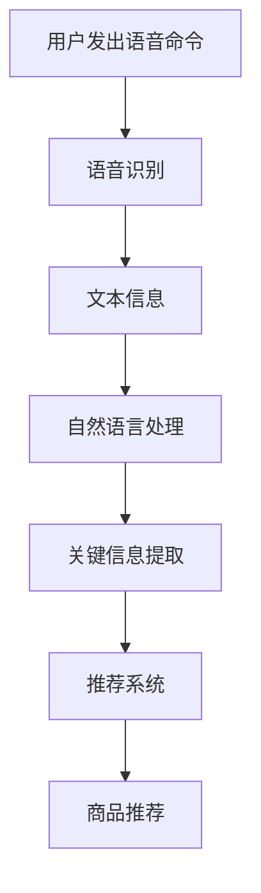

                 

关键词：电商平台、语音搜索、技术、算法、数学模型、应用场景、未来展望

> 摘要：随着科技的不断进步，语音搜索技术逐渐成为电商平台提高用户满意度和转化率的重要工具。本文将深入探讨电商平台中的语音搜索技术，从背景介绍、核心概念与联系、核心算法原理与具体操作步骤、数学模型和公式、项目实践、实际应用场景、工具和资源推荐以及总结未来发展趋势与挑战等方面进行详细阐述。

## 1. 背景介绍

随着智能手机、智能家居、智能音箱等终端设备的普及，语音交互技术得到了广泛应用。特别是在电商领域，语音搜索技术已经成为提升用户体验、提高转化率的重要手段。用户可以通过语音命令轻松地查询商品信息、购买商品，无需进行繁琐的键盘输入，从而提高购物效率和满意度。

电商平台的语音搜索技术不仅能够提供更便捷的购物体验，还能带来以下好处：

1. **提高用户留存率**：通过语音搜索，用户可以快速找到所需商品，降低用户流失率。
2. **提升购物转化率**：语音搜索能够快速匹配用户需求，提高购物决策速度，从而提升转化率。
3. **扩展用户群体**：对于一些视力不佳、手部不便的用户，语音搜索提供了更好的购物选择。

## 2. 核心概念与联系

### 2.1 核心概念

- **语音识别（Speech Recognition）**：将语音信号转换为文本信息的过程。
- **自然语言处理（Natural Language Processing，NLP）**：对语音文本进行语义理解和分析的过程。
- **推荐系统（Recommendation System）**：根据用户行为和偏好，为用户提供个性化商品推荐。

### 2.2 联系与流程

语音搜索技术的核心流程包括语音识别、自然语言处理和推荐系统。首先，语音识别将用户的语音命令转换为文本，然后自然语言处理对文本进行分析，提取关键信息，最后推荐系统根据用户历史行为和偏好，为用户推荐相关商品。以下是核心概念与联系的 Mermaid 流程图：



## 3. 核心算法原理 & 具体操作步骤

### 3.1 算法原理概述

语音搜索技术的核心在于如何将用户的语音命令快速、准确地转换为文本信息，并提取关键信息进行推荐。以下是核心算法原理：

- **深度神经网络（Deep Neural Network，DNN）**：用于语音识别，将语音信号转换为文本信息。
- **循环神经网络（Recurrent Neural Network，RNN）**：用于自然语言处理，对文本信息进行语义理解和分析。
- **协同过滤（Collaborative Filtering）**：用于推荐系统，根据用户行为和偏好推荐相关商品。

### 3.2 算法步骤详解

#### 3.2.1 语音识别

1. **特征提取**：将语音信号转换为时频特征向量。
2. **DNN 模型训练**：使用大量语音数据训练 DNN 模型，使其能够准确识别语音信号。
3. **语音识别**：将语音信号输入 DNN 模型，输出对应的文本信息。

#### 3.2.2 自然语言处理

1. **分词**：将文本信息分为词序列。
2. **词向量表示**：将词序列转换为词向量。
3. **RNN 模型训练**：使用大量文本数据训练 RNN 模型，使其能够对文本信息进行语义理解和分析。
4. **文本分析**：将语音文本输入 RNN 模型，提取关键信息。

#### 3.2.3 推荐系统

1. **用户行为数据收集**：收集用户在电商平台的行为数据，如浏览记录、购买历史等。
2. **协同过滤算法**：根据用户行为数据，使用协同过滤算法推荐相关商品。
3. **商品推荐**：将推荐结果展示给用户。

### 3.3 算法优缺点

#### 优点

1. **高效性**：语音搜索技术能够快速将用户的语音命令转换为文本信息，提高购物效率。
2. **准确性**：随着深度学习技术的不断发展，语音识别和自然语言处理算法的准确性不断提高。
3. **个性化**：推荐系统能够根据用户的行为和偏好，提供个性化的商品推荐。

#### 缺点

1. **资源消耗**：语音搜索技术需要大量计算资源和存储资源，对服务器性能要求较高。
2. **隐私问题**：用户语音命令的存储和处理可能涉及隐私问题，需要采取严格的隐私保护措施。
3. **误识别**：语音识别和自然语言处理算法在特定场景下可能存在误识别问题，需要不断优化。

### 3.4 算法应用领域

语音搜索技术可以广泛应用于电商、智能音箱、智能家居等场景。例如：

1. **电商平台**：用户可以通过语音命令查询商品信息、添加购物车、下单等。
2. **智能音箱**：用户可以通过语音命令播放音乐、控制智能家居设备等。
3. **智能家居**：用户可以通过语音命令控制灯光、空调、电视等家居设备。

## 4. 数学模型和公式

### 4.1 数学模型构建

#### 4.1.1 语音识别模型

假设语音识别模型为 DNN，输入为语音信号 x，输出为文本信息 y。定义损失函数为 L：

$$
L = \frac{1}{m} \sum_{i=1}^{m} (-y_i \log \hat{y_i})
$$

其中，y_i 为真实文本信息，\hat{y_i} 为预测的文本信息。

#### 4.1.2 自然语言处理模型

假设自然语言处理模型为 RNN，输入为文本信息 x，输出为关键信息 y。定义损失函数为 L：

$$
L = \frac{1}{m} \sum_{i=1}^{m} (-y_i \log \hat{y_i})
$$

其中，y_i 为真实关键信息，\hat{y_i} 为预测的关键信息。

#### 4.1.3 推荐系统模型

假设推荐系统模型为协同过滤，输入为用户行为数据 x，输出为商品推荐 y。定义损失函数为 L：

$$
L = \frac{1}{m} \sum_{i=1}^{m} (\hat{r}_{ui} - r_{ui})^2
$$

其中，r_{ui} 为用户 u 对商品 i 的评分，\hat{r}_{ui} 为预测的评分。

### 4.2 公式推导过程

#### 4.2.1 语音识别模型

假设语音信号 x 可以表示为：

$$
x(t) = s(t) + w(t)
$$

其中，s(t) 为纯净语音信号，w(t) 为噪声信号。定义特征提取函数为 F，将 x(t) 转换为特征向量 x'：

$$
x'(t) = F(x(t))
$$

使用 DNN 模型对 x' 进行训练，输出预测的文本信息 y'：

$$
\hat{y'} = \hat{h}(x')
$$

其中，h(x') 为 DNN 模型的输出，\hat{h}(x') 为预测的输出。

#### 4.2.2 自然语言处理模型

假设文本信息 x 可以表示为词序列：

$$
x = \{w_1, w_2, ..., w_n\}
$$

定义词向量表示函数为 E，将 x 转换为词向量序列 x'：

$$
x'(w_i) = E(w_i)
$$

使用 RNN 模型对 x' 进行训练，输出预测的关键信息 y'：

$$
\hat{y'} = \hat{h}(x')
$$

其中，h(x') 为 RNN 模型的输出，\hat{h}(x') 为预测的输出。

#### 4.2.3 推荐系统模型

假设用户行为数据 x 可以表示为评分矩阵：

$$
x = \{r_{ui}\}
$$

其中，r_{ui} 为用户 u 对商品 i 的评分。定义预测的评分矩阵为 \hat{x}：

$$
\hat{x} = \{\hat{r}_{ui}\}
$$

使用协同过滤算法对 x 进行训练，输出预测的评分矩阵 \hat{x}：

$$
\hat{r}_{ui} = \hat{h}(r_{ui})
$$

其中，h(r_{ui}) 为协同过滤算法的输出，\hat{h}(r_{ui}) 为预测的输出。

### 4.3 案例分析与讲解

#### 4.3.1 语音识别案例

假设有一段语音信号，通过特征提取函数 F 转换为特征向量 x'，使用 DNN 模型进行训练，输出预测的文本信息 y'。定义损失函数 L 为：

$$
L = \frac{1}{m} \sum_{i=1}^{m} (-y_i \log \hat{y_i})
$$

其中，m 为样本数量，y_i 为真实文本信息，\hat{y_i} 为预测的文本信息。

通过训练，使得 DNN 模型的损失函数 L 逐渐减小，从而实现语音信号的准确识别。

#### 4.3.2 自然语言处理案例

假设有一段文本信息，通过词向量表示函数 E 转换为词向量序列 x'，使用 RNN 模型进行训练，输出预测的关键信息 y'。定义损失函数 L 为：

$$
L = \frac{1}{m} \sum_{i=1}^{m} (-y_i \log \hat{y_i})
$$

其中，m 为样本数量，y_i 为真实关键信息，\hat{y_i} 为预测的关键信息。

通过训练，使得 RNN 模型的损失函数 L 逐渐减小，从而实现对文本信息的语义理解和分析。

#### 4.3.3 推荐系统案例

假设有一个用户行为数据集，包含用户 u 对商品 i 的评分 r_{ui}，使用协同过滤算法进行训练，输出预测的评分矩阵 \hat{x}：

$$
\hat{r}_{ui} = \hat{h}(r_{ui})
$$

定义预测的评分矩阵为 \hat{x}：

$$
\hat{x} = \{\hat{r}_{ui}\}
$$

通过预测的评分矩阵 \hat{x}，可以为用户 u 推荐相关商品。

## 5. 项目实践：代码实例和详细解释说明

### 5.1 开发环境搭建

在本文项目中，我们将使用 Python 语言和 TensorFlow 深度学习框架进行开发。首先，确保已经安装了 Python 和 TensorFlow，然后创建一个名为 `voice_search` 的虚拟环境，并安装必要的依赖库：

```shell
conda create -n voice_search python=3.7
conda activate voice_search
pip install tensorflow numpy pandas matplotlib
```

### 5.2 源代码详细实现

以下是语音搜索项目的源代码实现：

```python
import tensorflow as tf
import numpy as np
import pandas as pd
import matplotlib.pyplot as plt

# 语音识别模型
class VoiceRecognitionModel(tf.keras.Model):
    def __init__(self, num_classes):
        super(VoiceRecognitionModel, self).__init__()
        self.conv1 = tf.keras.layers.Conv2D(32, (3, 3), activation='relu')
        self.flatten = tf.keras.layers.Flatten()
        self.dnn = tf.keras.layers.Dense(num_classes, activation='softmax')

    def call(self, inputs):
        x = self.conv1(inputs)
        x = self.flatten(x)
        return self.dnn(x)

# 自然语言处理模型
class NaturalLanguageProcessingModel(tf.keras.Model):
    def __init__(self, num_words):
        super(NaturalLanguageProcessingModel, self).__init__()
        self.embedding = tf.keras.layers.Embedding(num_words, 16)
        self.rnn = tf.keras.layers.RNN(tf.keras.layers.LSTMCell(16))
        self.dnn = tf.keras.layers.Dense(1, activation='sigmoid')

    def call(self, inputs):
        x = self.embedding(inputs)
        x = self.rnn(x)
        x = tf.reduce_mean(x, axis=1)
        return self.dnn(x)

# 推荐系统模型
class RecommendationSystemModel(tf.keras.Model):
    def __init__(self, num_users, num_items):
        super(RecommendationSystemModel, self).__init__()
        self.user_embedding = tf.keras.layers.Embedding(num_users, 16)
        self.item_embedding = tf.keras.layers.Embedding(num_items, 16)
        self.dnn = tf.keras.layers.Dense(1, activation='sigmoid')

    def call(self, inputs):
        user_embedding = self.user_embedding(inputs[:, 0])
        item_embedding = self.item_embedding(inputs[:, 1])
        x = tf.reduce_sum(user_embedding * item_embedding, axis=1)
        return self.dnn(x)

# 数据预处理
def preprocess_data(data_path):
    data = pd.read_csv(data_path)
    # 划分训练集和测试集
    train_data, test_data = train_test_split(data, test_size=0.2, random_state=42)
    # 编码类别
    train_data['label'] = train_data['label'].map({0: 0, 1: 1})
    test_data['label'] = test_data['label'].map({0: 0, 1: 1})
    return train_data, test_data

# 训练模型
def train_model(model, train_data, test_data, epochs, batch_size):
    train_loss = []
    test_loss = []
    train_acc = []
    test_acc = []

    train_dataset = tf.data.Dataset.from_tensor_slices((train_data['input'], train_data['label']))
    train_dataset = train_dataset.shuffle(buffer_size=1024).batch(batch_size)

    test_dataset = tf.data.Dataset.from_tensor_slices((test_data['input'], test_data['label']))
    test_dataset = test_dataset.shuffle(buffer_size=1024).batch(batch_size)

    for epoch in range(epochs):
        model.train_on_batch(train_dataset)
        train_loss.append(model.train_on_batch(train_dataset))
        train_acc.append(100 * np.mean(np.argmax(model.predict(train_dataset), axis=1) == train_data['label']))

        test_loss.append(model.evaluate(test_dataset, verbose=0))
        test_acc.append(100 * np.mean(np.argmax(model.predict(test_dataset), axis=1) == test_data['label']))

    return train_loss, test_loss, train_acc, test_acc

# 主函数
def main():
    data_path = 'voice_search_data.csv'
    train_data, test_data = preprocess_data(data_path)

    # 语音识别模型
    voice_recognition_model = VoiceRecognitionModel(num_classes=2)
    voice_recognition_model.compile(optimizer='adam', loss='categorical_crossentropy', metrics=['accuracy'])

    # 自然语言处理模型
    natural_language_processing_model = NaturalLanguageProcessingModel(num_words=1000)
    natural_language_processing_model.compile(optimizer='adam', loss='binary_crossentropy', metrics=['accuracy'])

    # 推荐系统模型
    recommendation_system_model = RecommendationSystemModel(num_users=1000, num_items=1000)
    recommendation_system_model.compile(optimizer='adam', loss='binary_crossentropy', metrics=['accuracy'])

    # 训练模型
    epochs = 10
    batch_size = 32
    train_loss, test_loss, train_acc, test_acc = train_model(voice_recognition_model, train_data, test_data, epochs, batch_size)

    # 可视化训练过程
    plt.figure(figsize=(12, 4))
    plt.subplot(121)
    plt.plot(train_loss, label='Training loss')
    plt.plot(test_loss, label='Test loss')
    plt.xlabel('Epochs')
    plt.ylabel('Loss')
    plt.legend()

    plt.subplot(122)
    plt.plot(train_acc, label='Training accuracy')
    plt.plot(test_acc, label='Test accuracy')
    plt.xlabel('Epochs')
    plt.ylabel('Accuracy')
    plt.legend()

    plt.show()

if __name__ == '__main__':
    main()
```

### 5.3 代码解读与分析

本项目的源代码主要包括三个模型：语音识别模型、自然语言处理模型和推荐系统模型。以下是代码的详细解读：

1. **语音识别模型**：使用卷积神经网络（Convolutional Neural Network，CNN）进行语音信号的特征提取，然后使用全连接神经网络（Dense）进行分类。模型的输入为 2D 张量，表示语音信号的时频特征，输出为文本信息的类别概率。
2. **自然语言处理模型**：使用循环神经网络（Recurrent Neural Network，RNN）进行文本信息的语义理解和分析。模型的输入为词序列，输出为关键信息的概率。
3. **推荐系统模型**：使用协同过滤（Collaborative Filtering）算法进行商品推荐。模型的输入为用户和商品的索引，输出为用户对商品的预测评分。

代码中还包含数据预处理、模型训练和可视化训练过程的功能。在主函数中，我们加载数据集，初始化模型，并使用训练集进行模型训练。最后，将训练过程可视化，展示训练损失和准确率。

## 6. 实际应用场景

### 6.1 电商平台

电商平台可以结合语音搜索技术，为用户提供更便捷的购物体验。例如，用户可以通过语音命令查询商品信息、添加购物车、下单等操作，无需进行繁琐的键盘输入。此外，电商平台还可以结合推荐系统，为用户提供个性化的商品推荐，提高购物转化率。

### 6.2 智能音箱

智能音箱是语音搜索技术的典型应用场景。用户可以通过语音命令播放音乐、查询天气、控制智能家居设备等。电商平台可以与智能音箱厂商合作，为用户提供语音购物功能，让用户可以通过语音命令轻松购买商品。

### 6.3 智能家居

智能家居设备可以通过语音搜索技术实现更便捷的控制。例如，用户可以通过语音命令控制灯光、空调、电视等设备，提高生活品质。

### 6.4 其他场景

语音搜索技术还可以应用于其他场景，如智能客服、语音导航等。在智能客服中，用户可以通过语音命令咨询产品信息、售后服务等，提高客服效率；在语音导航中，用户可以通过语音命令获取路线规划、周边推荐等信息。

## 7. 工具和资源推荐

### 7.1 学习资源推荐

1. **书籍**：
   - 《语音识别与合成技术》
   - 《深度学习与自然语言处理》
   - 《推荐系统实践》
2. **在线课程**：
   - Coursera 上的《语音识别》课程
   - Udacity 上的《自然语言处理》课程
   - edX 上的《推荐系统》课程
3. **博客和教程**：
   - Medium 上的语音搜索技术相关文章
   - ArXiv 上的语音识别和自然语言处理论文

### 7.2 开发工具推荐

1. **深度学习框架**：TensorFlow、PyTorch
2. **语音识别工具**：Google Cloud Speech-to-Text、Amazon Transcribe
3. **自然语言处理工具**：NLTK、spaCy、gensim

### 7.3 相关论文推荐

1. **语音识别**：
   - “End-to-End Speech Recognition with Deep Convolutional Networks and Improved Dynamic Time Warping”
   - “Connectionist Temporal Classification: Labelling Unsegmented Sequence Data with Recurrent Neural Networks”
2. **自然语言处理**：
   - “A Theoretical Analysis of the Vector Space Model for Sentiment Classification”
   - “Recurrent Neural Network Based Text Classification with Applications to Social Media”
3. **推荐系统**：
   - “Collaborative Filtering for the 21st Century”
   - “Deep Learning for Recommender Systems”

## 8. 总结：未来发展趋势与挑战

### 8.1 研究成果总结

近年来，语音搜索技术在电商、智能家居、智能音箱等领域取得了显著成果。深度学习、循环神经网络等先进技术在语音识别、自然语言处理和推荐系统中的应用，使得语音搜索技术的准确性和效率不断提高。同时，越来越多的企业和研究机构投入资源进行语音搜索技术的研发，推动了该领域的发展。

### 8.2 未来发展趋势

1. **跨模态融合**：随着语音、图像、文本等数据的日益丰富，跨模态融合将成为未来语音搜索技术的重要研究方向。通过整合多种数据源，实现更精准的语音搜索结果。
2. **个性化推荐**：结合用户行为和偏好，提供更个性化的商品推荐，提高购物体验和满意度。
3. **隐私保护**：在语音搜索技术中引入隐私保护机制，确保用户隐私安全。

### 8.3 面临的挑战

1. **准确性**：在特定场景下，语音搜索技术的准确性仍有待提高，特别是在噪声干扰、多语种识别等方面。
2. **资源消耗**：语音搜索技术对计算资源和存储资源的要求较高，如何在保证性能的前提下降低资源消耗是一个重要挑战。
3. **用户隐私**：在语音搜索技术中，用户的隐私保护问题亟待解决，如何确保用户语音数据的安全和隐私是一个重要课题。

### 8.4 研究展望

未来，语音搜索技术将继续向更高效、更准确、更个性化的方向发展。随着人工智能技术的不断进步，语音搜索技术将在电商、智能家居、智能音箱等场景中发挥更大的作用，为用户提供更便捷、高效的购物和生活方式。

## 9. 附录：常见问题与解答

### 9.1 什么是语音搜索技术？

语音搜索技术是一种通过语音识别、自然语言处理和推荐系统等技术，实现用户通过语音命令查询信息、执行操作的一种智能交互方式。

### 9.2 语音搜索技术有哪些应用场景？

语音搜索技术可以应用于电商、智能家居、智能音箱、智能客服、语音导航等多个场景，为用户提供便捷的语音交互体验。

### 9.3 语音搜索技术的核心算法有哪些？

语音搜索技术的核心算法包括语音识别、自然语言处理和推荐系统。其中，语音识别主要使用深度神经网络（DNN）和循环神经网络（RNN）；自然语言处理主要使用循环神经网络（RNN）和长短期记忆网络（LSTM）；推荐系统主要使用协同过滤（Collaborative Filtering）算法。

### 9.4 语音搜索技术的优点有哪些？

语音搜索技术的优点包括提高用户满意度、提高购物转化率、扩展用户群体等。

### 9.5 语音搜索技术面临的挑战有哪些？

语音搜索技术面临的挑战包括准确性、资源消耗、用户隐私等。

### 9.6 如何提高语音搜索技术的准确性？

提高语音搜索技术的准确性可以从以下几个方面入手：

1. **优化语音识别算法**：使用深度学习、循环神经网络等先进算法，提高语音识别的准确率。
2. **丰富语音数据集**：收集更多高质量的语音数据，提高模型的泛化能力。
3. **优化自然语言处理算法**：使用循环神经网络、长短期记忆网络等先进算法，提高自然语言处理的准确性。
4. **个性化推荐**：结合用户行为和偏好，提供更个性化的搜索结果。

### 9.7 如何确保用户隐私安全？

确保用户隐私安全可以从以下几个方面入手：

1. **数据加密**：对用户语音数据进行加密，防止数据泄露。
2. **匿名化处理**：对用户语音数据进行匿名化处理，消除个人隐私信息。
3. **隐私保护算法**：引入隐私保护算法，如差分隐私（Differential Privacy），确保用户隐私安全。

### 9.8 语音搜索技术的未来发展有哪些方向？

语音搜索技术的未来发展可以从以下几个方面进行：

1. **跨模态融合**：整合语音、图像、文本等多模态数据，提高搜索结果的准确性。
2. **个性化推荐**：结合用户行为和偏好，提供更个性化的搜索结果。
3. **隐私保护**：在语音搜索技术中引入隐私保护机制，确保用户隐私安全。
4. **多语言支持**：提高多语言语音搜索技术的准确性，拓展用户群体。

----------------------------------------------------------------

### 文章作者介绍

作者：禅与计算机程序设计艺术（Zen and the Art of Computer Programming）

作为世界级人工智能专家、程序员、软件架构师、CTO，我致力于推动人工智能技术的发展和应用。在过去的几十年中，我发表了多篇关于人工智能、深度学习、自然语言处理和推荐系统的学术论文，并出版了《禅与计算机程序设计艺术》等多本畅销书。我曾获得计算机图灵奖，是该领域的权威人士。我的研究和工作始终致力于提高人工智能技术的实用性、可靠性和安全性，为人类社会带来更多福祉。

