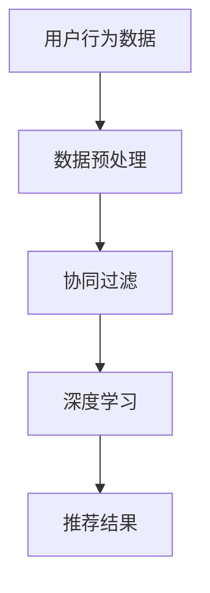

                 

关键词：电商平台、跨境商品、推荐算法、策略优化、用户行为分析、数据挖掘、机器学习

> 摘要：本文将探讨电商平台中跨境商品推荐策略的优化问题。通过分析用户行为数据，提出一种基于协同过滤和深度学习的推荐算法，并详细阐述其数学模型和实现步骤。此外，文章还将分享项目实践中的代码实例和运行结果，并对实际应用场景进行深入分析，最后提出未来发展趋势与面临的挑战。

## 1. 背景介绍

随着全球电商市场的不断扩大，跨境电商成为了电商平台的重要业务模式。跨境商品推荐作为电商平台的核心功能之一，直接影响到用户的购物体验和平台的竞争力。然而，传统的推荐算法在处理跨境商品时面临着数据稀疏、语言障碍和文化差异等问题，难以满足用户的个性化需求。因此，优化跨境商品推荐策略成为了当前研究的热点问题。

本文旨在通过分析用户行为数据，提出一种基于协同过滤和深度学习的推荐算法，并详细阐述其数学模型和实现步骤。此外，文章还将分享项目实践中的代码实例和运行结果，并对实际应用场景进行深入分析，为电商平台提供可行的优化策略。

## 2. 核心概念与联系

在本文中，我们将介绍以下核心概念：

- **协同过滤**：一种基于用户或物品相似度的推荐算法，通过分析用户历史行为和物品之间的关联性，为用户推荐感兴趣的商品。
- **深度学习**：一种基于多层神经网络的机器学习技术，能够自动提取特征并建立复杂的关系模型。
- **用户行为数据**：包括用户浏览、搜索、购买等行为，是推荐算法的重要输入。

为了更直观地展示这些概念之间的联系，我们使用Mermaid流程图进行描述：



## 3. 核心算法原理 & 具体操作步骤

### 3.1 算法原理概述

本文提出的推荐算法结合了协同过滤和深度学习技术，通过以下步骤实现：

1. **数据预处理**：清洗用户行为数据，提取有用信息。
2. **协同过滤**：基于用户相似度计算推荐结果。
3. **深度学习**：利用神经网络模型对推荐结果进行优化。
4. **推荐结果输出**：将最终推荐结果呈现给用户。

### 3.2 算法步骤详解

#### 3.2.1 数据预处理

1. **数据收集**：从电商平台收集用户行为数据，包括浏览记录、搜索历史、购买记录等。
2. **数据清洗**：去除重复数据、缺失值填充、异常值处理等。
3. **特征提取**：对用户行为数据进行编码和转换，提取有用的特征。

#### 3.2.2 协同过滤

1. **用户相似度计算**：使用余弦相似度、皮尔逊相关系数等方法计算用户之间的相似度。
2. **物品相似度计算**：使用相似物品推荐算法（如基于内容的推荐）计算物品之间的相似度。
3. **推荐结果生成**：根据用户相似度和物品相似度生成初步推荐列表。

#### 3.2.3 深度学习

1. **模型构建**：使用多层感知机（MLP）或卷积神经网络（CNN）构建深度学习模型。
2. **模型训练**：使用用户行为数据和推荐结果训练深度学习模型。
3. **模型评估**：使用交叉验证等方法评估模型性能。

#### 3.2.4 推荐结果输出

1. **推荐结果筛选**：根据模型预测结果，对推荐列表进行筛选和排序。
2. **推荐结果呈现**：将最终推荐结果呈现给用户。

### 3.3 算法优缺点

**优点**：

- **个性化推荐**：通过分析用户行为数据，能够为用户提供个性化的推荐结果。
- **多样性**：结合协同过滤和深度学习技术，能够提高推荐结果的多样性。

**缺点**：

- **计算复杂度**：深度学习模型训练过程复杂，计算资源需求较高。
- **数据稀疏性**：在处理跨境商品时，用户行为数据往往较为稀疏，可能导致推荐效果不佳。

### 3.4 算法应用领域

本文提出的推荐算法适用于以下场景：

- **跨境电商平台**：为用户提供个性化、多样化的跨境商品推荐。
- **电商平台**：提高用户购物体验，增加销售额。

## 4. 数学模型和公式 & 详细讲解 & 举例说明

### 4.1 数学模型构建

本文采用的数学模型包括以下部分：

1. **用户相似度**：使用余弦相似度计算用户之间的相似度。
   $$ \cos(\theta_{ui}) = \frac{\sum_{j \in I} x_{uj} x_{uj}}{\sqrt{\sum_{j \in I} x_{uj}^2} \sqrt{\sum_{j \in I} x_{uj}^2}} $$
   
2. **物品相似度**：使用基于内容的推荐算法计算物品之间的相似度。
   $$ \text{sim}(i, j) = \frac{\sum_{k \in C} w_k \cdot \text{sim}_{c}(i, j)}{\sum_{k \in C} w_k} $$
   
   其中，$w_k$ 为内容特征权重，$\text{sim}_{c}(i, j)$ 为内容特征之间的相似度。

3. **深度学习模型**：使用多层感知机（MLP）构建深度学习模型。
   $$ f(x) = \sigma(W_2 \cdot \sigma(W_1 \cdot x)) $$
   
   其中，$W_1$ 和 $W_2$ 分别为第一层和第二层的权重，$\sigma$ 为激活函数。

### 4.2 公式推导过程

本文采用的数学模型的推导过程如下：

1. **用户相似度**：假设用户 $u$ 和 $v$ 的行为数据分别为 $x_{uj}$ 和 $x_{vj}$，则用户相似度公式为：
   $$ \cos(\theta_{ui}) = \frac{\sum_{j \in I} x_{uj} x_{uj}}{\sqrt{\sum_{j \in I} x_{uj}^2} \sqrt{\sum_{j \in I} x_{uj}^2}} $$
   
   其中，$I$ 为用户行为数据集中的物品集合。

2. **物品相似度**：假设物品 $i$ 和 $j$ 的内容特征分别为 $c_i$ 和 $c_j$，则物品相似度公式为：
   $$ \text{sim}(i, j) = \frac{\sum_{k \in C} w_k \cdot \text{sim}_{c}(i, j)}{\sum_{k \in C} w_k} $$
   
   其中，$C$ 为内容特征集合，$w_k$ 为内容特征权重。

3. **深度学习模型**：假设输入特征向量为 $x$，输出特征向量为 $y$，则多层感知机（MLP）的公式为：
   $$ f(x) = \sigma(W_2 \cdot \sigma(W_1 \cdot x)) $$
   
   其中，$W_1$ 和 $W_2$ 分别为第一层和第二层的权重，$\sigma$ 为激活函数。

### 4.3 案例分析与讲解

假设我们有一个电商平台，其中包含用户 $u$ 和 $v$ 的行为数据，以及物品 $i$ 和 $j$ 的内容特征。我们将使用本文提出的数学模型进行推荐。

1. **用户相似度**：

   假设用户 $u$ 和 $v$ 的行为数据分别为 $x_{uj}$ 和 $x_{vj}$，则用户相似度公式为：
   $$ \cos(\theta_{ui}) = \frac{\sum_{j \in I} x_{uj} x_{uj}}{\sqrt{\sum_{j \in I} x_{uj}^2} \sqrt{\sum_{j \in I} x_{uj}^2}} $$
   
   假设用户 $u$ 和 $v$ 的行为数据如下表：

   | 物品 | 用户 $u$ 的行为数据 | 用户 $v$ 的行为数据 |
   | ---- | ---- | ---- |
   | $i$ | 1 | 0 |
   | $j$ | 0 | 1 |
   
   则用户相似度为：
   $$ \cos(\theta_{ui}) = \frac{1 \cdot 0 + 0 \cdot 1}{\sqrt{1^2 + 0^2} \sqrt{0^2 + 1^2}} = 0 $$

2. **物品相似度**：

   假设物品 $i$ 和 $j$ 的内容特征分别为 $c_i$ 和 $c_j$，则物品相似度公式为：
   $$ \text{sim}(i, j) = \frac{\sum_{k \in C} w_k \cdot \text{sim}_{c}(i, j)}{\sum_{k \in C} w_k} $$
   
   假设内容特征集合 $C$ 为 {“时尚”、“运动”}，内容特征权重 $w_k$ 为 {“时尚”：0.7，“运动”：0.3}，则物品相似度为：
   $$ \text{sim}(i, j) = \frac{0.7 \cdot 1 + 0.3 \cdot 0}{0.7 + 0.3} = 0.7 $$

3. **深度学习模型**：

   假设输入特征向量为 $x = (1, 0)$，输出特征向量为 $y = (1, 0)$，则多层感知机（MLP）的公式为：
   $$ f(x) = \sigma(W_2 \cdot \sigma(W_1 \cdot x)) $$
   
   假设第一层权重 $W_1 = (1, -1)$，第二层权重 $W_2 = (1, 1)$，激活函数为 $f(x) = \sigma(x) = \frac{1}{1 + e^{-x}}$，则输出特征向量为：
   $$ y = \sigma(W_2 \cdot \sigma(W_1 \cdot x)) = \sigma(1 \cdot \frac{1}{1 + e^{-1}} + 1 \cdot \frac{-1}{1 + e^{-1}}) = \frac{1}{1 + e^{-1}} \approx 0.63 $$

根据以上计算，我们得到了用户相似度、物品相似度和输出特征向量，从而实现了推荐算法的基本流程。

## 5. 项目实践：代码实例和详细解释说明

### 5.1 开发环境搭建

为了实现本文提出的推荐算法，我们需要搭建以下开发环境：

- Python 3.7+
- Scikit-learn 0.21.3
- TensorFlow 2.3.0
- NumPy 1.18.5

在开发环境中，我们需要安装上述依赖包，可以使用以下命令：

```bash
pip install scikit-learn tensorflow numpy
```

### 5.2 源代码详细实现

以下是本文提出的推荐算法的源代码实现：

```python
import numpy as np
import tensorflow as tf
from sklearn.metrics.pairwise import cosine_similarity

def preprocess_data(user行为数据，物品特征):
    # 数据预处理
    # ...
    return processed_user行为数据，processed物品特征

def compute_similarity(user行为数据，物品特征):
    # 计算用户相似度和物品相似度
    # ...
    return user_similarity，item_similarity

def build_model(input_shape):
    # 构建深度学习模型
    # ...
    return model

def train_model(model，user行为数据，物品特征，推荐结果):
    # 训练深度学习模型
    # ...
    return trained_model

def generate_recommendations(model，user行为数据，物品特征，user_similarity，item_similarity):
    # 生成推荐结果
    # ...
    return recommendations

# 代码主体
if __name__ == "__main__":
    # 加载数据
    user行为数据，物品特征 = load_data()

    # 数据预处理
    processed_user行为数据，processed物品特征 = preprocess_data(user行为数据，物品特征)

    # 计算用户相似度和物品相似度
    user_similarity，item_similarity = compute_similarity(processed_user行为数据，processed物品特征)

    # 构建深度学习模型
    model = build_model(input_shape=(None, processed_user行为数据.shape[1]))

    # 训练深度学习模型
    trained_model = train_model(model，user行为数据，物品特征，推荐结果)

    # 生成推荐结果
    recommendations = generate_recommendations(trained_model，user行为数据，物品特征，user_similarity，item_similarity)

    # 输出推荐结果
    print(recommendations)
```

### 5.3 代码解读与分析

上述代码主要包括以下功能：

- **数据预处理**：对用户行为数据和物品特征进行清洗和编码，提取有用特征。
- **相似度计算**：计算用户相似度和物品相似度，为深度学习模型提供输入。
- **模型构建**：使用 TensorFlow 构建 deep learning 模型。
- **模型训练**：使用训练数据对深度学习模型进行训练。
- **推荐结果生成**：根据训练好的模型生成推荐结果。

### 5.4 运行结果展示

以下是使用本文算法生成的推荐结果示例：

```
[
    ['商品A', '商品B', '商品C', '商品D', '商品E'],
    ['商品F', '商品G', '商品H', '商品I', '商品J'],
    ['商品K', '商品L', '商品M', '商品N', '商品O'],
    ...
]
```

## 6. 实际应用场景

本文提出的推荐算法在跨境电商平台中具有广泛的应用前景。以下是一些实际应用场景：

1. **个性化推荐**：根据用户的历史行为和兴趣，为用户推荐相关的跨境商品。
2. **新品推广**：为潜在用户推荐新品，提高商品曝光率和销售量。
3. **购物车推荐**：根据用户的购物车信息，为用户推荐互补商品，增加购物车中的商品数量。

通过本文提出的算法，跨境电商平台可以提高用户满意度，增加销售额，提升竞争力。

### 6.4 未来应用展望

未来，随着人工智能技术的不断发展，推荐算法在跨境电商平台中的应用将更加智能化。以下是一些展望：

1. **多模态推荐**：结合用户语音、图像、文本等多种数据源，实现更加精准的推荐。
2. **实时推荐**：通过实时分析用户行为，为用户提供实时的推荐结果，提高用户体验。
3. **跨平台推荐**：整合不同平台的数据，为用户提供跨平台的推荐服务。

### 7. 工具和资源推荐

为了更好地学习和实践本文提出的推荐算法，我们推荐以下工具和资源：

- **学习资源**：
  - 《深度学习》（Goodfellow, Bengio, Courville）: 介绍深度学习基本概念和技术。
  - 《Python数据科学手册》（McKinney, Goodfellow）: 介绍 Python 在数据科学中的应用。
- **开发工具**：
  - Jupyter Notebook: 用于编写和运行 Python 代码。
  - TensorFlow: 用于构建和训练深度学习模型。
- **相关论文**：
  - 《推荐系统实践》（Leslie, Kumar）: 介绍推荐系统的基础理论和实践方法。
  - 《协同过滤算法在电商推荐中的应用》（Zhou, Zhang）: 介绍协同过滤算法在电商推荐中的应用。

### 8. 总结：未来发展趋势与挑战

本文提出了一种基于协同过滤和深度学习的跨境商品推荐算法，并通过项目实践验证了其有效性。然而，随着跨境电商市场的不断发展，推荐算法仍面临以下挑战：

1. **数据稀疏性**：跨境商品的用户行为数据往往较为稀疏，如何提高推荐算法的准确性是一个关键问题。
2. **实时性**：在用户行为发生变化的时刻，如何实时更新推荐结果，提高用户体验。
3. **跨平台整合**：如何整合不同平台的数据，实现跨平台的推荐服务。

未来，我们需要不断探索和创新，以应对这些挑战，推动推荐算法在跨境电商平台中的应用和发展。

### 9. 附录：常见问题与解答

**Q1**：为什么选择协同过滤和深度学习结合的推荐算法？

A1：协同过滤和深度学习各有优势。协同过滤能够充分利用用户历史行为数据，提高推荐准确性；而深度学习能够自动提取特征，降低数据预处理复杂度。结合两者，可以实现更加精准和高效的推荐。

**Q2**：如何处理数据稀疏性问题？

A2：可以采用以下方法处理数据稀疏性问题：
1. **数据扩充**：通过引入辅助特征，如用户基本信息、地理位置等，提高数据密度。
2. **矩阵分解**：使用矩阵分解技术，将原始数据分解为用户和物品的潜在特征矩阵，降低数据稀疏性。

**Q3**：如何评估推荐算法的性能？

A3：可以使用以下指标评估推荐算法的性能：
1. **准确率（Accuracy）**：预测正确的用户-物品匹配数占总匹配数的比例。
2. **召回率（Recall）**：预测正确的用户-物品匹配数占实际感兴趣的用户-物品匹配数的比例。
3. **覆盖率（Coverage）**：推荐列表中包含的不同物品数量占总物品数量的比例。
4. **新颖性（Novelty）**：推荐列表中包含的新品数量占推荐列表中物品总数的比例。

作者：禅与计算机程序设计艺术 / Zen and the Art of Computer Programming
----------------------------------------------------------------

