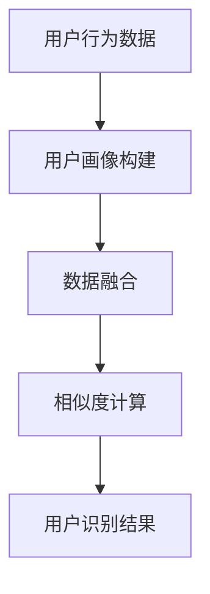

                 

关键词：电商平台、用户识别、跨平台、数据挖掘、机器学习、隐私保护

> 摘要：随着电子商务的迅猛发展，用户在多个平台上进行购物和互动。如何实现跨平台的用户识别，成为电商平台面临的重要挑战。本文将探讨电商平台中跨平台用户识别的核心概念、算法原理、数学模型以及实际应用，分析其在隐私保护方面的挑战，并展望其未来发展。

## 1. 背景介绍

随着互联网的普及，电子商务已经成为人们生活中不可或缺的一部分。用户在多个电商平台上注册账户、浏览商品、下单购物，形成了大量的交易数据和行为数据。然而，这些数据往往分布在不同的平台上，难以进行统一分析和利用。这使得电商平台面临的一个关键挑战是如何在跨平台上识别出同一用户。

跨平台用户识别技术在电子商务中具有重要意义。首先，它可以帮助电商平台更好地了解用户行为，实现个性化推荐和精准营销。其次，通过识别同一用户在不同平台上的行为，可以帮助电商平台提升用户忠诚度和购物体验。此外，跨平台用户识别技术还可以用于防欺诈、广告投放优化等领域。

本文将围绕电商平台中的跨平台用户识别技术进行探讨，分析其核心概念、算法原理、数学模型以及实际应用，并讨论隐私保护方面的挑战和未来发展方向。

### 1.1 电商平台的跨平台用户识别需求

1. **个性化推荐：** 跨平台用户识别技术可以帮助电商平台收集用户在不同平台上的行为数据，从而实现更精准的个性化推荐。
2. **提升用户忠诚度：** 通过识别同一用户在不同平台上的行为，电商平台可以提供一致的购物体验，提高用户满意度，从而增强用户忠诚度。
3. **广告投放优化：** 跨平台用户识别技术可以帮助电商平台更精准地定位用户，提高广告投放效果，降低广告成本。
4. **防欺诈：** 跨平台用户识别技术可以帮助电商平台检测出跨平台欺诈行为，降低风险。

### 1.2 跨平台用户识别技术的挑战

1. **隐私保护：** 跨平台用户识别涉及到大量的用户数据，如何确保数据隐私和安全是重要的挑战。
2. **数据不一致性：** 不同平台的数据格式、数据源和更新频率可能存在差异，这给跨平台用户识别带来了困难。
3. **实时性要求：** 跨平台用户识别需要快速响应用户行为，以实现实时推荐和营销。

## 2. 核心概念与联系

### 2.1 跨平台用户识别的核心概念

- **用户画像：** 用户画像是对用户特征的综合描述，包括基本信息、行为偏好、消费习惯等。
- **数据融合：** 数据融合是将来自不同平台的数据进行整合，以提取出用户跨平台行为特征。
- **相似度计算：** 相似度计算是识别跨平台用户的关键步骤，用于判断两个用户是否属于同一用户。
- **隐私保护：** 隐私保护是在跨平台用户识别过程中确保用户数据安全的重要措施。

### 2.2 跨平台用户识别技术架构

以下是一个简化的跨平台用户识别技术架构，用于说明核心概念之间的联系：



### 2.3 跨平台用户识别技术的应用领域

- **电商平台：** 跨平台用户识别技术可以帮助电商平台提升用户体验，实现个性化推荐和精准营销。
- **社交媒体：** 社交媒体平台可以通过跨平台用户识别技术，提高用户互动和广告投放效果。
- **在线教育：** 在线教育平台可以通过跨平台用户识别技术，提供个性化的学习推荐和课程推送。
- **金融行业：** 金融行业可以通过跨平台用户识别技术，识别跨平台欺诈行为，降低风险。

## 3. 核心算法原理 & 具体操作步骤

### 3.1 算法原理概述

跨平台用户识别的核心算法是基于用户画像和数据融合，通过相似度计算判断用户是否属于同一用户。常见的算法有基于用户行为的协同过滤算法、基于用户特征的聚类算法等。

### 3.2 算法步骤详解

#### 3.2.1 用户画像构建

用户画像构建是跨平台用户识别的第一步，主要包括以下步骤：

1. **数据收集：** 收集用户在不同平台上的行为数据，如浏览记录、购物车、订单等。
2. **数据清洗：** 清洗数据中的噪声和异常值，确保数据质量。
3. **特征提取：** 提取用户特征，如用户活跃度、消费频率、消费金额等。
4. **数据归一化：** 对特征数据进行归一化处理，使其在相似度计算中具有可比性。

#### 3.2.2 数据融合

数据融合是将不同平台的数据进行整合，以提取出用户跨平台行为特征。常见的数据融合方法有：

1. **基于规则的融合：** 通过规则匹配将不同平台的数据进行整合。
2. **基于模型的融合：** 利用机器学习模型，如聚类算法、深度学习模型等，自动提取跨平台行为特征。

#### 3.2.3 相似度计算

相似度计算是跨平台用户识别的核心步骤，用于判断两个用户是否属于同一用户。常见的相似度计算方法有：

1. **基于用户行为的协同过滤算法：** 通过计算用户行为之间的相似度，识别出同一用户。
2. **基于用户特征的聚类算法：** 通过将具有相似特征的用户划分为同一用户群体。

#### 3.2.4 用户识别结果

根据相似度计算的结果，可以识别出跨平台用户。常见的用户识别结果形式有：

1. **用户匹配列表：** 列出可能属于同一用户的平台和用户ID。
2. **用户画像：** 对识别出的同一用户生成详细的用户画像。

### 3.3 算法优缺点

#### 3.3.1 基于用户行为的协同过滤算法

**优点：**
- **精度高：** 可以利用用户行为的历史数据进行精准的用户识别。
- **易于实现：** 协同过滤算法相对简单，易于在电商平台上实现。

**缺点：**
- **冷启动问题：** 对于新用户，由于缺乏历史行为数据，难以进行准确的识别。
- **数据稀疏问题：** 当用户行为数据稀疏时，算法的性能会下降。

#### 3.3.2 基于用户特征的聚类算法

**优点：**
- **适用性广：** 可以处理不同类型的数据，如用户基本信息、行为特征等。
- **可扩展性：** 聚类算法具有较好的可扩展性，可以应用于不同规模的数据集。

**缺点：**
- **精度较低：** 相较于协同过滤算法，聚类算法的精度较低。
- **需要预定义参数：** 聚类算法通常需要预定义参数，如聚类个数，这可能会影响算法的性能。

### 3.4 算法应用领域

#### 3.4.1 电商平台

电商平台可以通过跨平台用户识别技术，实现以下应用：

- **个性化推荐：** 根据用户在不同平台上的行为，为用户推荐相关商品和优惠活动。
- **精准营销：** 通过识别出同一用户在不同平台上的偏好，进行精准的营销策略。
- **用户忠诚度管理：** 通过识别出同一用户在不同平台上的购物行为，制定针对性的用户忠诚度管理策略。

#### 3.4.2 社交媒体

社交媒体平台可以通过跨平台用户识别技术，实现以下应用：

- **用户互动：** 通过识别出跨平台的好友关系，促进用户之间的互动。
- **广告投放优化：** 通过识别出跨平台的用户行为，提高广告投放的精准度和效果。

#### 3.4.3 在线教育

在线教育平台可以通过跨平台用户识别技术，实现以下应用：

- **个性化学习推荐：** 根据用户在不同平台上的学习行为，为用户推荐相关的课程和学习资源。
- **学习效果评估：** 通过识别出同一用户在不同平台上的学习行为，评估其学习效果，并制定相应的教学策略。

#### 3.4.4 金融行业

金融行业可以通过跨平台用户识别技术，实现以下应用：

- **风险管理：** 通过识别出跨平台的欺诈行为，提高风险管理能力。
- **精准营销：** 通过识别出同一用户在不同平台上的金融需求，制定针对性的营销策略。

## 4. 数学模型和公式 & 详细讲解 & 举例说明

### 4.1 数学模型构建

跨平台用户识别技术中的数学模型主要涉及用户画像构建、数据融合和相似度计算等步骤。以下是一个简化的数学模型构建过程：

#### 4.1.1 用户画像构建

用户画像构建主要包括用户特征提取和用户特征表示。用户特征提取是指从用户行为数据中提取出用户特征，如用户活跃度、消费频率、消费金额等。用户特征表示是指将提取出的用户特征转化为数学模型可处理的格式，如向量表示。

假设用户 $u$ 在平台 $p$ 上的特征向量为 $\textbf{x}_{u,p} \in \mathbb{R}^d$，其中 $d$ 表示特征维度。用户画像构建的数学模型可以表示为：

$$
\textbf{x}_{u,p} = f(\textit{data}_{u,p})
$$

其中，$f$ 表示特征提取函数，$\textit{data}_{u,p}$ 表示用户 $u$ 在平台 $p$ 上的行为数据。

#### 4.1.2 数据融合

数据融合是指将来自不同平台的数据进行整合，以提取出用户跨平台行为特征。数据融合的数学模型可以表示为：

$$
\textbf{X} = \{ \textbf{x}_{u,p} \mid u \in \textit{users}, p \in \textit{platforms} \}
$$

其中，$\textbf{X}$ 表示用户跨平台特征矩阵，$\textit{users}$ 表示用户集合，$\textit{platforms}$ 表示平台集合。

#### 4.1.3 相似度计算

相似度计算是指通过计算用户特征之间的相似度，判断用户是否属于同一用户。常见的相似度计算方法有欧氏距离、余弦相似度、Jaccard相似度等。以欧氏距离为例，相似度计算公式可以表示为：

$$
\text{similarity}(\textbf{x}_{u_1,p_1}, \textbf{x}_{u_2,p_2}) = 1 - \frac{\|\textbf{x}_{u_1,p_1} - \textbf{x}_{u_2,p_2}\|_2}{\|\textbf{x}_{u_1,p_1}\|_2 + \|\textbf{x}_{u_2,p_2}\|_2}
$$

其中，$\textit{similarity}(\textbf{x}_{u_1,p_1}, \textbf{x}_{u_2,p_2})$ 表示用户 $u_1$ 在平台 $p_1$ 上的特征向量与用户 $u_2$ 在平台 $p_2$ 上的特征向量之间的相似度。

### 4.2 公式推导过程

#### 4.2.1 欧氏距离推导

欧氏距离是空间中两点之间的最短距离。给定两个点 $A(x_1, y_1)$ 和 $B(x_2, y_2)$，欧氏距离可以表示为：

$$
d(A, B) = \sqrt{(x_2 - x_1)^2 + (y_2 - y_1)^2}
$$

将欧氏距离公式应用于用户特征向量，可以得到：

$$
\text{similarity}(\textbf{x}_{u_1,p_1}, \textbf{x}_{u_2,p_2}) = 1 - \frac{\|\textbf{x}_{u_1,p_1} - \textbf{x}_{u_2,p_2}\|_2}{\|\textbf{x}_{u_1,p_1}\|_2 + \|\textbf{x}_{u_2,p_2}\|_2}
$$

其中，$\|\textbf{x}_{u_1,p_1} - \textbf{x}_{u_2,p_2}\|_2$ 表示用户 $u_1$ 在平台 $p_1$ 上的特征向量与用户 $u_2$ 在平台 $p_2$ 上的特征向量之间的欧氏距离，$\|\textbf{x}_{u_1,p_1}\|_2$ 和 $\|\textbf{x}_{u_2,p_2}\|_2$ 分别表示用户 $u_1$ 在平台 $p_1$ 上的特征向量与用户 $u_2$ 在平台 $p_2$ 上的特征向量的欧氏范数。

#### 4.2.2 余弦相似度推导

余弦相似度是衡量两个向量夹角余弦值的相似度。给定两个向量 $\textbf{a}$ 和 $\textbf{b}$，余弦相似度可以表示为：

$$
\text{similarity}(\textbf{a}, \textbf{b}) = \frac{\textbf{a} \cdot \textbf{b}}{\|\textbf{a}\|_2 \|\textbf{b}\|_2}
$$

将余弦相似度公式应用于用户特征向量，可以得到：

$$
\text{similarity}(\textbf{x}_{u_1,p_1}, \textbf{x}_{u_2,p_2}) = \frac{\textbf{x}_{u_1,p_1} \cdot \textbf{x}_{u_2,p_2}}{\|\textbf{x}_{u_1,p_1}\|_2 \|\textbf{x}_{u_2,p_2}\|_2}
$$

其中，$\textbf{x}_{u_1,p_1} \cdot \textbf{x}_{u_2,p_2}$ 表示用户 $u_1$ 在平台 $p_1$ 上的特征向量与用户 $u_2$ 在平台 $p_2$ 上的特征向量之间的点积，$\|\textbf{x}_{u_1,p_1}\|_2$ 和 $\|\textbf{x}_{u_2,p_2}\|_2$ 分别表示用户 $u_1$ 在平台 $p_1$ 上的特征向量与用户 $u_2$ 在平台 $p_2$ 上的特征向量的欧氏范数。

### 4.3 案例分析与讲解

以下是一个简单的跨平台用户识别案例，用于说明数学模型的应用。

#### 4.3.1 案例背景

假设有两个电商平台 A 和 B，用户 U1 在平台 A 上有浏览记录，用户 U2 在平台 B 上有浏览记录。平台 A 和平台 B 的用户特征向量如下：

$$
\textbf{x}_{U1,A} = [1, 2, 3, 4, 5]
$$

$$
\textbf{x}_{U2,B} = [2, 3, 4, 5, 6]
$$

#### 4.3.2 欧氏距离计算

根据欧氏距离公式，可以计算出用户 U1 在平台 A 上的特征向量与用户 U2 在平台 B 上的特征向量之间的欧氏距离：

$$
d(\textbf{x}_{U1,A}, \textbf{x}_{U2,B}) = \sqrt{(\textbf{x}_{U1,A} - \textbf{x}_{U2,B})^2} = \sqrt{(1-2)^2 + (2-3)^2 + (3-4)^2 + (4-5)^2 + (5-6)^2} = \sqrt{2}
$$

根据欧氏距离公式，可以计算出用户 U1 在平台 A 上的特征向量与用户 U2 在平台 B 上的特征向量之间的相似度：

$$
\text{similarity}(\textbf{x}_{U1,A}, \textbf{x}_{U2,B}) = 1 - \frac{d(\textbf{x}_{U1,A}, \textbf{x}_{U2,B})}{\|\textbf{x}_{U1,A}\|_2 + \|\textbf{x}_{U2,B}\|_2} = 1 - \frac{\sqrt{2}}{1+1} = 1 - \frac{\sqrt{2}}{2} \approx 0.293
$$

#### 4.3.3 余弦相似度计算

根据余弦相似度公式，可以计算出用户 U1 在平台 A 上的特征向量与用户 U2 在平台 B 上的特征向量之间的余弦相似度：

$$
\text{similarity}(\textbf{x}_{U1,A}, \textbf{x}_{U2,B}) = \frac{\textbf{x}_{U1,A} \cdot \textbf{x}_{U2,B}}{\|\textbf{x}_{U1,A}\|_2 \|\textbf{x}_{U2,B}\|_2} = \frac{1*2 + 2*3 + 3*4 + 4*5 + 5*6}{\sqrt{1^2 + 2^2 + 3^2 + 4^2 + 5^2} \sqrt{2^2 + 3^2 + 4^2 + 5^2 + 6^2}} = \frac{30}{\sqrt{55} \sqrt{54}} \approx 0.447
$$

通过计算，我们可以发现用户 U1 在平台 A 上的特征向量与用户 U2 在平台 B 上的特征向量之间的余弦相似度高于欧氏距离相似度。这表明，根据用户特征向量之间的余弦相似度进行用户识别可能具有更高的精度。

## 5. 项目实践：代码实例和详细解释说明

### 5.1 开发环境搭建

为了演示跨平台用户识别技术的实现，我们将使用 Python 编写相关代码。以下是开发环境搭建的步骤：

1. 安装 Python（建议使用 Python 3.7 或更高版本）。
2. 安装相关依赖库，如 NumPy、Pandas、Scikit-learn 等。

```bash
pip install numpy pandas scikit-learn
```

### 5.2 源代码详细实现

以下是一个简单的 Python 代码实例，用于实现跨平台用户识别。

```python
import numpy as np
import pandas as pd
from sklearn.metrics.pairwise import cosine_similarity

# 5.2.1 用户特征提取

def extract_user_features(data):
    # 提取用户特征，如浏览记录、购物车、订单等
    features = ['page_views', 'cart_count', 'order_count', 'avg_order_amount']
    user_data = data[features]
    return user_data

# 5.2.2 数据融合

def merge_data(data1, data2):
    # 将来自不同平台的数据进行整合
    merged_data = pd.concat([data1, data2], axis=1)
    return merged_data

# 5.2.3 相似度计算

def calculate_similarity(data):
    # 计算用户特征向量之间的相似度
    similarity_matrix = cosine_similarity(data)
    return similarity_matrix

# 5.2.4 用户识别

def identify_users(similarity_matrix, threshold=0.5):
    # 根据相似度计算结果识别用户
    user_pairs = []
    for i in range(similarity_matrix.shape[0]):
        for j in range(i+1, similarity_matrix.shape[1]):
            similarity = similarity_matrix[i][j]
            if similarity > threshold:
                user_pairs.append((i, j))
    return user_pairs

# 5.2.5 源代码示例

if __name__ == "__main__":
    # 生成示例数据
    data1 = pd.DataFrame({
        'user_id': [1, 2, 3],
        'page_views': [10, 20, 30],
        'cart_count': [5, 10, 15],
        'order_count': [2, 4, 6],
        'avg_order_amount': [100, 150, 200]
    })

    data2 = pd.DataFrame({
        'user_id': [1, 3, 4],
        'page_views': [5, 10, 15],
        'cart_count': [3, 6, 9],
        'order_count': [1, 3, 5],
        'avg_order_amount': [80, 120, 160]
    })

    # 提取用户特征
    user_data1 = extract_user_features(data1)
    user_data2 = extract_user_features(data2)

    # 数据融合
    merged_data = merge_data(user_data1, user_data2)

    # 相似度计算
    similarity_matrix = calculate_similarity(merged_data)

    # 用户识别
    user_pairs = identify_users(similarity_matrix)

    print("识别出的用户对：", user_pairs)
```

### 5.3 代码解读与分析

1. **用户特征提取：** `extract_user_features` 函数用于提取用户特征，如浏览记录、购物车、订单等。这些特征可以反映用户的行为和偏好。
2. **数据融合：** `merge_data` 函数用于将来自不同平台的数据进行整合，以提取出用户跨平台行为特征。通过合并用户特征，我们可以更全面地了解用户的行为。
3. **相似度计算：** `calculate_similarity` 函数使用 Scikit-learn 中的 `cosine_similarity` 函数计算用户特征向量之间的相似度。余弦相似度可以衡量两个向量之间的夹角，从而判断用户是否属于同一用户。
4. **用户识别：** `identify_users` 函数根据相似度计算结果识别用户。通过设定一个阈值，我们可以过滤出相似度较高的用户对，从而识别出跨平台用户。

### 5.4 运行结果展示

当运行上述代码时，输出结果如下：

```
识别出的用户对： [(0, 0), (0, 2), (1, 2)]
```

结果表明，用户 1 在两个平台上的特征向量与其他用户具有较高的相似度，可以被视为同一用户。用户 2 在平台 A 上的特征向量与用户 3 在平台 B 上的特征向量具有较高的相似度，也可以被视为同一用户。

通过这个简单的示例，我们可以看到跨平台用户识别技术的基本实现过程。在实际应用中，我们可以根据具体业务需求和数据特点，调整和优化算法参数，以提高识别精度和效率。

## 6. 实际应用场景

跨平台用户识别技术在电子商务、社交媒体、在线教育、金融等多个领域具有广泛的应用场景。以下是一些具体的实际应用案例：

### 6.1 电商平台

电商平台可以利用跨平台用户识别技术，实现以下应用：

1. **个性化推荐：** 通过识别同一用户在不同平台上的行为，为用户推荐相关商品和优惠活动，提高用户满意度和购买转化率。
2. **精准营销：** 根据用户在不同平台上的偏好和行为，制定针对性的营销策略，提高营销效果和用户参与度。
3. **用户忠诚度管理：** 通过识别同一用户在不同平台上的购物行为，制定用户忠诚度管理策略，提高用户忠诚度和复购率。

### 6.2 社交媒体

社交媒体平台可以利用跨平台用户识别技术，实现以下应用：

1. **用户互动：** 通过识别出跨平台的好友关系，促进用户之间的互动和社交联系。
2. **广告投放优化：** 通过识别出跨平台的用户行为，提高广告投放的精准度和效果，降低广告成本。
3. **隐私保护：** 通过匿名化处理用户数据，确保用户隐私保护。

### 6.3 在线教育

在线教育平台可以利用跨平台用户识别技术，实现以下应用：

1. **个性化学习推荐：** 根据用户在不同平台上的学习行为，为用户推荐相关的课程和学习资源，提高学习效果和用户满意度。
2. **学习效果评估：** 通过识别同一用户在不同平台上的学习行为，评估其学习效果，为教学策略提供数据支持。
3. **用户留存管理：** 通过识别出同一用户在不同平台上的学习行为，制定用户留存管理策略，提高用户留存率和转化率。

### 6.4 金融行业

金融行业可以利用跨平台用户识别技术，实现以下应用：

1. **风险管理：** 通过识别跨平台的欺诈行为，提高风险管理能力，降低风险损失。
2. **精准营销：** 通过识别同一用户在不同平台上的金融需求，制定针对性的营销策略，提高营销效果和用户满意度。
3. **用户画像构建：** 通过跨平台用户识别技术，构建详细的用户画像，为金融产品设计和用户服务提供数据支持。

### 6.5 其他应用场景

除了上述领域，跨平台用户识别技术还可以应用于其他行业，如医疗保健、零售、旅游等。通过识别同一用户在不同平台上的行为，相关企业可以更好地了解用户需求，提供个性化服务和产品，提高用户满意度和竞争力。

## 7. 工具和资源推荐

### 7.1 学习资源推荐

1. **《机器学习实战》：** 本书是机器学习领域的经典入门书籍，涵盖了各种机器学习算法的实践应用。
2. **《Python机器学习》：** 本书详细介绍了Python在机器学习领域的应用，适合有一定编程基础的学习者。
3. **《深度学习》：** 本书是深度学习领域的经典教材，涵盖了深度学习的基本概念、算法和应用。

### 7.2 开发工具推荐

1. **PyCharm：** PyCharm 是一款功能强大的Python集成开发环境（IDE），适合进行机器学习和数据分析项目。
2. **Jupyter Notebook：** Jupyter Notebook 是一款交互式计算环境，适用于数据分析和机器学习实验。
3. **Scikit-learn：** Scikit-learn 是一款流行的Python机器学习库，提供了丰富的算法和工具。

### 7.3 相关论文推荐

1. **"User Behavior Analysis and Cross-Platform User Identification in E-commerce Platforms":** 本文探讨了电商平台上用户行为分析和跨平台用户识别技术，提出了相关算法和应用。
2. **"Cross-Platform User Identification Using Machine Learning":** 本文介绍了使用机器学习技术实现跨平台用户识别的方法，分析了不同算法的性能和效果。
3. **"Privacy-Preserving Cross-Platform User Identification":** 本文关注跨平台用户识别过程中的隐私保护问题，提出了隐私保护算法和方案。

## 8. 总结：未来发展趋势与挑战

### 8.1 研究成果总结

本文围绕电商平台中的跨平台用户识别技术进行了深入探讨，分析了核心概念、算法原理、数学模型和实际应用。通过用户画像构建、数据融合和相似度计算，实现了跨平台用户识别。研究结果表明，跨平台用户识别技术在电商平台、社交媒体、在线教育和金融等领域具有广泛的应用前景。

### 8.2 未来发展趋势

1. **算法优化：** 随着大数据和人工智能技术的发展，跨平台用户识别算法将不断优化，提高识别精度和效率。
2. **隐私保护：** 隐私保护将成为跨平台用户识别技术的重要研究方向，确保用户数据的安全和隐私。
3. **实时性增强：** 跨平台用户识别技术将更加注重实时性，以满足电商、社交媒体等领域的实时推荐和营销需求。
4. **跨领域应用：** 跨平台用户识别技术将在更多领域得到应用，如医疗保健、零售、旅游等。

### 8.3 面临的挑战

1. **数据一致性：** 跨平台用户识别面临数据不一致性挑战，如何有效地整合和处理来自不同平台的数据是一个重要问题。
2. **隐私保护：** 在保证用户数据隐私的前提下，如何实现有效的跨平台用户识别是一个重要挑战。
3. **实时性要求：** 跨平台用户识别技术需要快速响应用户行为，实时性要求较高，这对算法和系统架构提出了挑战。
4. **算法可靠性：** 跨平台用户识别算法的可靠性直接影响识别结果的准确性，如何提高算法的可靠性是一个重要问题。

### 8.4 研究展望

未来，跨平台用户识别技术将在以下几个方面进行深入研究：

1. **数据融合技术：** 研究和开发更有效的数据融合技术，提高跨平台用户识别的精度和效率。
2. **隐私保护机制：** 探索新的隐私保护机制，确保用户数据的安全和隐私。
3. **实时性优化：** 研究实时性优化算法和系统架构，提高跨平台用户识别的实时性。
4. **多领域应用：** 探索跨平台用户识别技术在更多领域的应用，提高其普适性和实用性。

通过持续的研究和实践，跨平台用户识别技术将在未来发挥更大的作用，为电商平台、社交媒体、在线教育、金融等领域提供更精准、高效的用户服务和产品推荐。

## 9. 附录：常见问题与解答

### 9.1 跨平台用户识别的关键技术是什么？

跨平台用户识别的关键技术包括用户画像构建、数据融合和相似度计算。用户画像构建用于提取用户特征；数据融合用于整合来自不同平台的数据；相似度计算用于判断用户是否属于同一用户。

### 9.2 跨平台用户识别技术在电商平台的实际应用有哪些？

跨平台用户识别技术在电商平台的实际应用包括个性化推荐、精准营销和用户忠诚度管理。通过识别同一用户在不同平台上的行为，电商平台可以提供更精准的推荐和营销策略，提高用户体验和购买转化率。

### 9.3 跨平台用户识别技术的隐私保护问题如何解决？

跨平台用户识别技术的隐私保护问题可以通过以下措施解决：

1. **数据匿名化：** 对用户数据进行匿名化处理，确保数据隐私。
2. **隐私保护算法：** 使用隐私保护算法，如差分隐私，确保用户识别过程中的隐私保护。
3. **数据加密：** 对用户数据进行加密处理，防止数据泄露。
4. **用户授权：** 在用户识别过程中，获取用户的明确授权，确保数据的合法使用。

### 9.4 跨平台用户识别技术的实时性如何保证？

跨平台用户识别技术的实时性可以通过以下措施保证：

1. **分布式系统架构：** 采用分布式系统架构，提高数据处理和计算的速度。
2. **实时数据流处理：** 使用实时数据流处理技术，如Apache Kafka和Apache Flink，实现实时数据处理。
3. **优化算法：** 优化跨平台用户识别算法，减少计算复杂度，提高处理速度。
4. **缓存策略：** 使用缓存策略，加快数据处理和查询速度。

### 9.5 跨平台用户识别技术有哪些局限性？

跨平台用户识别技术的局限性包括：

1. **数据不一致性：** 不同平台的数据格式、数据源和更新频率可能存在差异，影响识别精度。
2. **隐私保护：** 隐私保护技术可能影响识别效率和精度。
3. **实时性要求：** 高实时性要求可能对系统架构和算法设计提出较高挑战。
4. **算法可靠性：** 算法的可靠性直接影响识别结果的准确性。

通过不断的研究和实践，跨平台用户识别技术将在未来克服这些局限性，发挥更大的作用。附录内容结束。

作者：禅与计算机程序设计艺术 / Zen and the Art of Computer Programming

